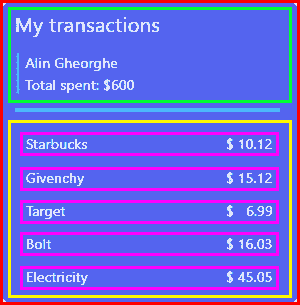
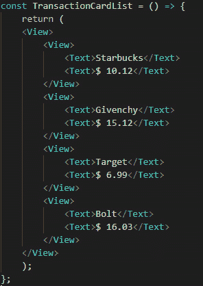
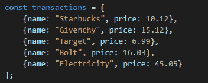

# 三、正确的心态

我想我说得对，我们在一起学到了很多东西，我希望你们能继续学习。在上一章中，我们进一步了解了 React 本机项目的工作原理以及每个文件或文件夹的作用。之后，我们开始学习**JavaScript XML**（**JSX**）以及如何使用它，实际上我们已经导入了第一个组件。了解每次创建新项目时将要使用的核心组件将使我们走上理解和创建自己的组件的道路。

本章将主要关注 React 架构，以及它如何让我们在花时间使用框架后以某种方式思考。首先，我们将从人们如何启动 React 应用或 React 本机应用的主要思想开始，然后我们将轻松过渡到更高级的 React 概念，如道具。

通过掌握道具的概念，我们将能够为我们的应用增加更高层次的复杂性。这将使我们能够创造更酷的组件，释放更多的 React 能力。您会发现自己在创建的几乎每个组件中都使用道具。

之后，是时候学习渲染列表以及如何使用这些列表来更改组件内部的信息了。这听起来很不错，对吧？我们将能够根据我们希望在组件内部执行的任何计算或需要展示的项目数量显示不同的信息。

完成本章将教会您作为 React 开发人员的良好思维方式。这将为您首次启动任何项目节省大量时间，了解如何正确构造文件和代码非常重要。

我们将认识到程序员是如何以这样一种方式重用他们的代码的，你将不断地向你的家人重复：“编写一次，到处使用！”

本章将涵盖以下主题：

*   React 思维
*   始终首先生成静态版本
*   道具及其使用方法

# 技术要求

您可以通过访问 GitHub[查看本章的代码 https://github.com/PacktPublishing/Lightning-Fast-Mobile-App-Development-with-Galio](https://github.com/PacktPublishing/Lightning-Fast-Mobile-App-Development-with-Galio) 。您将找到一个名为`Chapter 03`的文件夹，其中包含我们在本章中编写的所有代码。为了使用该项目，请按照`README.md`文件中的说明进行操作。

# React 思维

我们不要忘记 Facebook 为他们自己的项目创建了 React，并且它实际上被用于几乎任何类型的网站（或带有 React Native 的移动应用），因此它具有很大的可扩展性。如果 Facebook 可以在他们的平台上使用它，我们当然可以在我们的应用中使用它。

为了充分利用这一框架，我们需要从 React 开始思考。当我第一次开始编程之旅时，框架的想法对我来说似乎有些陌生。我不明白它之所以被称为框架，是因为它附带了一个特定的工作流。这不是它被称为框架的唯一原因，也是因为它包含了大量的特性和方法，使我们的工作更容易。

让我们想象一下，我们正在与朋友一起开发一款应用，我们将称之为*PiggyBank*只是为了好玩。我们的想法是，我们需要始终跟踪我们使用信用卡进行的所有交易。因此，这基本上意味着我们将有一张卡，记录我们应用中某个地方的所有交易。

我用 Adobe XD 设计了以下卡片，我认为这将帮助我们更好地形象化事物：


图 3.1–显示我们交易的卡组件

所以，我们的朋友想出了这个很酷的卡片设计，他要求我们在移动应用中实现它。简单，对吗？我们已经看到，只要使用 JSX 代码，就可以从上到下对所有内容进行编码；最重要的是，这张卡片上有太多的文字，这让我们的事情变得更加容易。您甚至可能认为我们不需要任何自定义组件，或者我们可能只需要一个。

嗯，这不完全是真的。这是我们的 React 知识闪耀的时刻，它帮助我们将所有内容划分为组件，以获得更简单、更清晰的代码。但是问题仍然存在……你如何知道在哪里画矩形，我们如何划分组件？React 推荐的一种技术是**单一责任原则**（**SRP**。

提示

SRP 是一种编程原则，它规定了这样一个事实，即我们正在编写的程序中的每个类都应该对该程序功能的单个部分负责。这是**SOLID**的一部分，它是五个设计原则的首字母缩略词，软件工程师可以创建更易于维护、灵活和理解的代码。

利用这一原理，我们现在应该能够将卡划分为多个组件。让我们拿着这张卡片，为我们遇到的每个组件在上面画矩形，如下所示：



图 3.2–绘制用于划分组件的矩形

因此，我们提取了以下组件：

*   `TransactionCard`（*红色*）-包含完整卡片及其所有元素
*   `TransactionCardHeader`（*绿色*）-表示卡的上部，有姓名和花费的总金额的部分
*   `TransactionCardList`（*黄色*）-包含项目列表
*   `TransactionItem`（*粉色*）-显示交易和价格的单个项目

如你所见，我们已经成功地将这张卡分为四个不同的组件，它们必须以某种方式相互通信，最后有一个目的是显示有关我们交易的信息。

它们都只有一个目的，因此可以检查我们所讨论的 SRP。让我们编写代码，但不进行样式化，我们将在下一章中完成。始终首先生成静态版本。

首先，我们需要了解，开始处理应用的最简单方法是构建静态页面，然后分离所有内容并构建逻辑。为此，我们必须基本上复制我们在图像中看到的所有内容，甚至文本，这就是为什么我们称之为静态版本。

首先，打开终端，移动到项目文件夹，然后编写以下命令，创建一个新项目：

```jsx
expo init TransactionCard
```

我选择了`TransactionCard`作为我的项目名称，但别忘了，你可以随意命名。接下来，我们将选择空白管理工作流模板，并且 OutT2 将等待它开始初始化我们的项目。完成后，让我们打开我们选择的**集成开发环境**（**IDE**）/文本编辑器，查看项目。

我将打开`App.js`并删除`StatusBar`导入（对于本练习来说并不重要）以及`App`函数中`View`组件内部的所有内容。

让我们决定我们需要什么类型的组件。很容易看出，这张卡只需要一个`View`组件和一个`Text`组件。幸运的是，我们已经在文件中导入了这些内容，所以让我们使用它们来构建卡的静态版本。

我们将从查看我们的设计开始，并尝试将所有内容划分为容器。正如我们所看到的，这张卡片有两部分：上面部分是带有一般信息的标题，下面部分是我们最近的所有交易。

那么，让我们为这些部分编写代码，但首先，我们将关注卡片的上方，如下所示：


图 3.3–我们的卡的上方

我们在这里看到很多`View`组件，但这是为什么？正如我们在上一章中讨论的，`View`组件通常用于布局设计和将元素分组在一起。因此，我们将其中的两个部分分组，然后为标题编写代码。如果我们保存并打开模拟器，我们应该能够看到刚刚编写的文本。

重要提示

不要忘记如果你使用 Android 模拟器，首先需要打开 Android Studio，然后进入**Android 虚拟设备**（**AVD**管理器。运行模拟器，然后从 Expo 仪表板启动应用。

现在让我们考虑一下我们的交易。我们有两段文字，左边是我们从中购买任何东西的公司名称，右边是交易价格。我们怎么能做到呢？就我们目前所见，我们打印到屏幕上的元素始终以柱状样式自上而下对齐。

好的，我们需要为它设计样式，但这里重要的一点是，我们需要了解这两个组件以某种方式连接，因此我们必须将这些元素放在相同的`View`组件中。

让我们现在开始并为编写所有这些事务做好组件准备。首先，试着自己做，然后看看你是否得到了和我一样的代码。

我将首先为每行创建一个不同的`View`组件，然后在其中添加文本，如下所示：


图 3.4–静态代码的其余部分

让我们打开我们的应用，看看一切都是什么样子。现在，它只是一堆文本，以列的形式显示我们设计中的所有信息。虽然它看起来不像一张卡片，但我们可以肯定地看到它与我们的设计有着相似之处，即在相同的顺序中拥有相同的信息。现在，我们已经创建了最基本的卡片版本。

下一步是最终将这棵大树分解成更小的组件。通过这样做，我们将使代码更容易阅读和理解，也更容易调整，这基本上意味着我们可以在不同的卡中使用相同的组件，或者我们当时需要它的任何东西。

## 破解我们的密码

还记得我们把设计分成了四个不同的部分吗？让我们创建一个`components`文件夹并为每个组件创建四个不同的文件，如下所示：


图 3.5–包含所有创建文件的文件夹

现在，是时候开始编码每一个了。因此，我们知道，大卡或第一个组件应该能够分为两部分，`List`和`Header`组件。让我们将所有代码从`App.js`复制到`TransactionCard`，因为这是主要组件。我所说的所有代码，只是指第一个`View`组件中的内容。

创建函数后，我们将所有代码粘贴到函数中。让我们导出组件并查看它，如下所示：


图 3.6–写为箭头函数的 TransactionCard 组件

我们将这个组件作为一个箭头函数编写，因为它更容易编写，至少在我看来，但老实说，如果您愿意，您甚至可以将它作为一个类来编写。根据经验，只有当涉及到状态时，您通常才会使用`class`，但状态是我们需要在后面的章节中更深入探讨的内容。

我们这里有所有的代码，我们已经导出了我们的函数。现在一切都好了，下一步是进一步深化我们的分工。让我们把组件的头端移到它的特定文件中。

在我们将代码复制到`TransactionCardHeader`组件中之后，让我们将该组件导入到`TransactionCard`组件中，并使用它代替复制的代码。我们应该对卡片的第二部分做同样的事情，那就是`TransactionCardList`组件。让我们来看看一切都是什么样子。结果如下：

s


图 3.7–我们新创建的 TransactionCard 组件

好吧，这看起来干净多了。如果我们将这个组件导入到我们的`App.js`文件中，所有内容都应该与我们开始对代码进行所有这些更改之前的外观相同。

提示

别忘了，我们总是需要运行`import React from 'react';`，这样我们才能使用我们所有的组件。对于要运行的组件，它需要知道它是一个组件，而不仅仅是在文件中随机写入。这种导入有助于我们的代码识别哪些对象是 React 对象以及如何呈现所有对象。

一切正常，对吗？如果您遇到任何问题，请停止 2 秒钟，然后再继续，并检查我们迄今为止所做的一切；也许你拼错了什么，或者你忘记了文件中的导出内容。

如果一切正常，让我们进入`TransactionItem`组件。好吧，顾名思义，这是一个单一项目，那么这意味着什么？正如我们在`TransactionCardList`组件中看到的，我们有几个不同的项目。我们是否要为它们中的每一个创建不同的组件？

实际上，我们并不打算创建一个单独的组件，它根据它作为输入接收的任何信息来更改显示的信息。这听起来很酷，对吧？这个输入称为道具，默认情况下，每个组件渲染时都会获得一组道具，但它也可以接收我们创建的自定义道具。让我们深入了解道具，并学习如何在卡片的上下文中使用道具。

# 道具及使用方法

那么，道具到底是什么呢？到目前为止，我们只使用普通标签来标识我们的组件，例如`TransactionCardHeader`。然而，正如我们在前面展示不同组件时所看到的，这些组件也可能有**道具**，用于将信息从较大组件（**父级**传递给较小组件（**子级**）。

让我们进入`TransactionCardList`并查看我们的代码。就我们所见，在所使用的组件方面，有很多代码在重复。因此，我们可以从主`<View />`标签中看到这种模式：



图 3.8–TransactionCardList 组件可分为更小的组件

该模式很容易看到，我们有四段相同的代码，但其中包含不同的信息。我们基本上有四个`View`组件实例，其中有两个`Text`组件。看到这种情况是如何重复的，我们可以清楚地意识到，我们可以为这个特定的案例编写一个外部组件。

让我们先在`TransactionItem`组件中编写一个静态组件，看看如何在列表中实现它。

继续写下这些图案中的一个；我们只需要一个，否则，我们会有点挫败一个单一项目的目的。代码应该是这样的：


图 3.9–TransactionItem 的静态版本

现在，让我们使用这个组件，而不是列表中使用的所有模式片段。导入文件并用四到五个`TransactionItem`实例替换所有内容后，我们可以看到数据现在到处都是`Starbucks`和`$ 10.12`。疯狂地重复自己并不是一个伟大的移动应用的真正设计方式，对吧？

现在，我们如何改变这一点？我们如何让组件显示不同的信息？通过使用道具。让我更改`TransactionItem`组件，看看需要如何实现道具。代码应该是这样的：


图 3.10–在我们的组件中实施道具

现在，您的`TransactionCardList`组件包含`TransactionItem`的多个实例。如果您现在保存，除了`$`标志外，这些组件没有显示任何内容。为什么呢？

这一切都是因为我们的组件在这些变量中没有任何存储。为了让我们在屏幕上真正显示出，我们必须从`TransactionCardList`向`TransactionItem`组件发送一些信息。让我们进入其中，使用最新更新的组件在手机上显示正确的信息。

在`TransactionCardList`组件内，找到我们的组件，为每个组件添加以下道具，如下所示：

```jsx
<TransactionItem name={"Starbucks"} price={10.12} />
```

在我们将道具添加到所有组件之后，下一步是保存。我们将看到我们的模拟器如何自动刷新，恭喜！我们已成功地将信息从一个**父**组件发送到我们的**子**组件。

提示

从一个组件发送到另一个组件的所有信息都将正式地放在花括号内，正如我们通过为价格道具写入数字所看到的那样。尽管字符串仍然可以放在大括号内，但它们不是发送信息的必需条件，因此您甚至可以编写`name="Mircea"`。

现在，让我们试着稍微了解一下我们的代码。那么，我们的应用里到底发生了什么？

当应用第一次运行时，它直接进入`App.js`并开始呈现所有首先写入其中的组件。为此，这将是我们的`TransactionCard`组件。

React 看到我们的组件实际上有两个不同的组件，并开始渲染下一个组件。现在，其中一个组件实际上是我们的`TransactionCardList`组件，它包含了我们所有的`TransactionItem`组件。

因为第一个组件包含另一个组件，我们将第一个组件称为**父**，将第二个组件称为**子**。所以，如果`TransactionItem`是到`TransactionCardList`的**孩子，试着弄清楚`TransactionCard`到`TransactionCardHeader`是什么。准备好的`TransactionCard`是`TransactionCardHeader`的**父**，因为它包含其他成分。**

现在，当 React 到达`TransactionCardList`时，它会通过**道具**向每个`TransactionItem`组件发送一些信息。正在发送的信息是如下所示的 JavaScript 对象：`{name: 'Starbucks', price=10.12}`。

这就是为什么我们可以使用道具作为`TransactionItem`中函数的参数，然后使用点访问对象的键，如：`props.name`。你一定想知道 React 是如何知道如何处理所有这些过程的，因为一个更复杂的应用可能有数百个组件相互嵌套，同时在第一次渲染时向彼此发送道具。

问题是，React 首先渲染曲面上的所有内容，当所有信息从父组件发送到子组件时，它会渲染这些信息。

现在，为了使我们的组件更具可用性和可重用性，我们必须使列表中的项的数量更加可变。对于一个更大的应用，我们必须问自己这样的问题：“如果用户进行的交易数量大于或小于 5，该怎么办？”；“如果未来的屏幕需要更多卡，但设计相同，该怎么办？如何重用此卡组件？”

## 使用 map 功能动态改变组件数量

好吧，让我们先看看如何输出尽可能多的`TransactionItem`组件。我们将进入`TransactionCardList`组件内部，在函数之外创建一个恒定的对象数组，称为`transactions`。此变量将包含项目所需的所有信息。让我们看看这是什么样子，如下所示：



图 3.11–交易变量

一旦我们有了这个变量以及我们需要的所有信息，我们就可以**映射**我们的数组，并为每个项目输出不同的组件。如果您对 JavaScript 不太熟悉，这听起来可能有点混乱，但相信我，这真的很容易。让我们删除`<View />`组件内部的所有内容，并将其替换为`map`函数，如下所示：


图 3.12–TransactionCardList 组件内部使用的映射函数

好吧，这看起来可能有点奇怪。别担心，这其实很容易。所以，我们在`transactions`数组中使用了`map`函数。这个`map`函数遍历数组中的每个元素，并使用其参数中的函数来输出*某物*。这就是你来利用这个很酷的功能的地方。

重要提示

JSX**中使用的所有外部代码必须**放在花括号之间，以便 React 能够理解我们正在执行的操作可能会导致输出其他元素进行渲染。

基本上，由于`map`函数，我们将获取数组的第一项`{name: "Starbucks", price: 10.12}`——输出`TransactionItem`组件，并将数组中的值作为道具传递。但我们也看到了**键道具**，我们都知道我们没有在组件内部使用键道具。每个列表都需要为每个子级设置一个键，以便 React 能够跟踪它们并避免过度重新渲染。这是 React 的规则之一，我们在使用此类列表时需要了解。

但我们说过我们会走得更远，对吗？如果需要，我们需要多次使用此卡组件。看看`transactions`如何只是`TransactionCardList`组件中的一个随机变量，也许我们可以将其作为**道具**发送？

让我们在函数的参数中添加`props`关键字，并从`transactions.map`更改为`props.transactions.map`。如果我们现在保存，我们会得到一个错误，我们的组件期望一个名为`transactions`的道具进入，但没有任何东西发送它。

我们必须从我们的父组件即`TransactionCard`发送此信息。但尽管如此，这并不能真正改变我们仍然无法正确使用这张卡的事实，所以我们可能需要将这个道具添加到我们的`TransactionCard`组件中。

让我们复制`transactions`变量并将其移动到`App.js`文件中。之后，让我们将`transactions`道具添加到`TransactionCard`组件中，如下所示：`<TransactionCard transactions={transactions} />.`

现在，我们必须转到我们的`TransactionCard`组件，使其能够获取此道具并将其发送到我们的`TransactionCardList`组件。我们的组件现在需要如下所示：


图 3.13–我们新创建的 TransactionCard 组件版本

因此，我们一直在将这些信息从`App.js`文件发送到`TransactionItem`组件，在那里我们最终显示了这些信息。这对我们有什么帮助？好的，现在，我们可以有多个具有不同交易的此卡实例，或者我们甚至可以根据我们现在在`App.js`文件中声明的常量来增加或减少交易数量。我们可以使用不同的变量；我们可以使用另一个名为`biggerTransactions`的数组，并将其传递给另一个组件。也许这个会显示你做过的最大的交易。

这里重要的一点是，我们现在根本不必触摸我们的卡组件，我们仍然可以在显示不同信息时使用它。这比为我们需要的每一条信息创建不同的文件要容易得多，或者在某一点上，您需要更改特定的信息，然后开始浏览每个文件以查找特定的内容。您现在不必这样做，只需进入主文件并从那里更改所有信息。

让我们做些家庭作业吧。您可以在我们的 GitHub 存储库中的`Chapter 03`文件夹中找到答案。在我们的名片上一直用同一个名字可能会变得很无聊。允许您为不同的用户使用同一卡组件的多个实例，从而简化此操作。完成后，检查代码并将其与我的代码进行比较。看看你是否做了同样的事！

# 总结

在本章中，我们更深入地介绍了 React Native。我们已经了解了很多新概念，比如道具和 SRP。我们现在应该能够开始使用基于道具的 React 方法进行思考，以后甚至可以使用状态。但是，了解所有这些是迈向成为真正的本地开发人员的一大步。

对于处理道具的方式，以及我们如何使用 React 调用组件的这一特殊功能来实现我们的优势、可重用性和更干净的代码，您应该感到更加舒适。代码没有太干净这回事，但同时，请记住，有时不需要多层道具。也许你的组件只需要一层或者根本不需要道具。只有当您觉得此功能可能使您的工作更轻松时，才使用此功能。

我们还第一次创建了一个列表，并了解到列表中的每个项都需要一个键，这个键有时甚至可以是数组的索引，但总是有一个唯一的键被发送到每个项。

在本章的最后，我们完成了一点家庭作业，并对下一章充满了希望，在下一章中，我们将最终创建第一个小应用来展示我们的朋友。