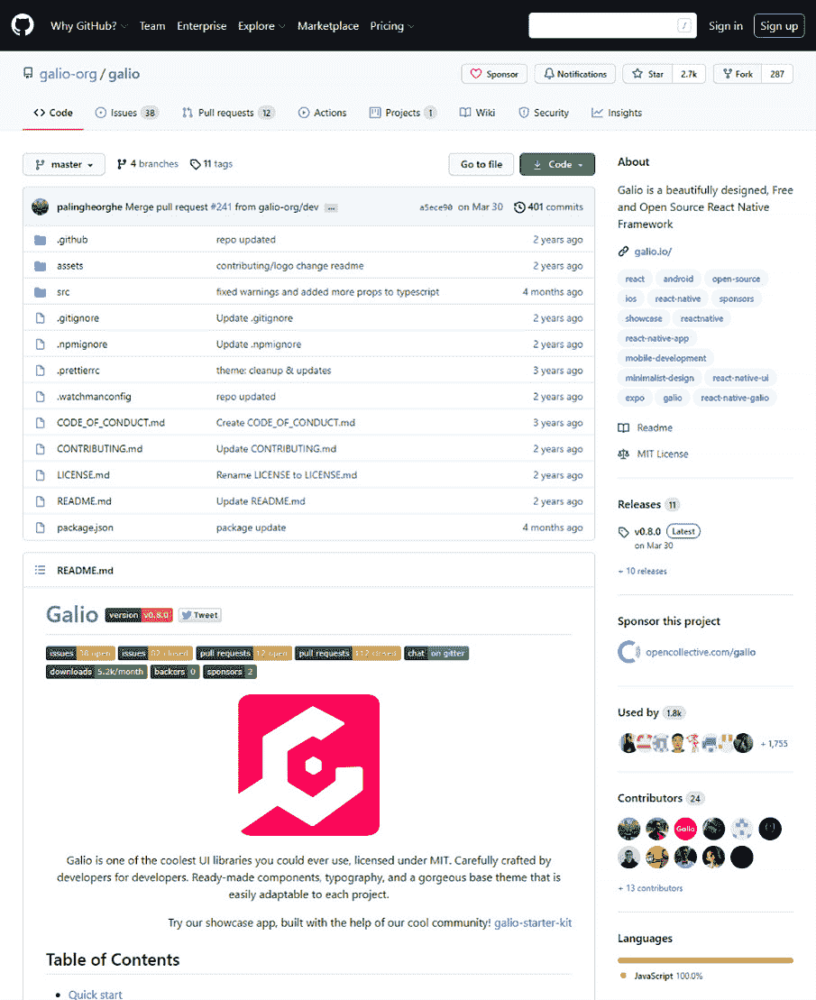

# 十二、从这里去往哪里？

在过去的 11 章中，我们学习了很多关于 React Native 以及如何使用它构建跨平台移动应用的知识。我们还看到了使用 Galio 这样的库可以节省多少时间，Galio 可以快速帮助我们使用默认组件构建外观酷炫的应用。

在我们的 React Native 之旅中，我们处理了许多不同的情况，在这些情况下，我们了解了用户界面、用户体验、世博会等等。我希望你喜欢我们所学到的一切，也希望你能很兴奋地了解到许多可以继续学习和学习的方法。

本章将重点介绍我们如何开始积累更多的知识。我们将讨论我们应该如何应对未来可能面临的任何新挑战，无论何时我们想要学习新的东西，还是仅仅使用小型库进行应用开发。

我们还将讨论 Galio 的社区，以及您可以做些什么来加入并帮助 Galio 的发展。我们还将了解开源对程序员社区的重要性，以及它如何帮助您的职业生涯。

在开发跨平台移动应用时，如果生活不轻松，我还将为您提供一些技巧和窍门。我希望你能经常重温这一部分，为你的工作获得一些灵感和动力。

最后但并非最不重要的一点，我们将讨论书籍和阅读的重要性。更具体地说，我们将讨论为什么尽可能多地从各种来源学习东西对我们如此重要。

我希望你喜欢这一章，并希望它能鼓舞你的士气，让你继续学习，并从中获得乐趣。

本章将涵盖以下主题：

*   始终阅读文档
*   Galio 社区
*   提示和技巧

# 始终阅读文档

每次你开始一个新项目或处理一个新的编程挑战时，在真正投入并开始编写代码之前，确保你做好了准备是很重要的。这种计划和准备可以有多种形式，但您可以做的最重要的事情之一是阅读您正在使用的技术的文档。

现在，阅读文档的目的是学习如何理解它。随着时间的推移，凭借经验，您将了解什么是优秀的文档，以及您希望从中获得什么。

阅读技术文档可能并不总是那么容易，特别是对于初学者程序员来说。一种语言中使用的某些术语可能与另一种语言不同。文档中还包含许多行话术语，在旅程开始时您可能会感到不舒服。

不要害怕！我列出了一系列阅读和解决未来挑战的技巧：

*   **冷静点！**：阅读文档需要时间；就像读任何一本书一样。不要直接跑到书中间去读所有的战斗场面；有时，最好阅读介绍，以便熟悉每个角色的能力。所以，准备好一个凉爽的小旅程，享受它的每一部分。如果你累了，就休息一下，看看窗外，稍后再回来，头脑清醒些。
*   **像真正的记者一样阅读多个来源**：有时，您正在阅读的文档可能对您来说有点太高级，或者根本不完整。有时候，你甚至会遇到一些你不懂的段落。因此，您需要学习如何比官方文档更进一步。从不同来源阅读更多关于该主题的文章。这将帮助你通过看到不同的视角和例子来更新你正在学习的概念。
*   **复习术语**：你总会看到一些你从未听说过的新术语。你应该列出所有你不懂的术语，并花些时间来复习它们。从长远来看，这将对您有所帮助，尤其是在您试图了解更多库的时候。
*   **版本检查**：您试图学习的库总是有多个版本，因此请确保您阅读的是正确的文档！

为什么你总是要先看技术文档而不是视频教程，是因为视频教程在解释概念方面通常很肤浅。当然，有很多很棒的视频教程，但是最好直接从源代码学习，正如我前面提到的，然后查看其他源代码。

有时你可以在网上找到任何文档的两部分：*入门指南*或*指南*和*文档*或*文档*。第一个总是有一个关于如何使用包或库的小而简单的例子。本部分的目的是让您尽可能多地了解包的上下文。*文档*部分更像一本电话簿。它很简单，你总能找到关于特定事物的特定信息，这意味着这一部分不是关于如何确保正确安装或使用它的指南——它更像是一本字典，里面有你需要的每个关键字的定义。

既然我们已经讨论了阅读文档，我们应该讨论阅读书籍。一本书可能有点像大型文档项目的*入门*部分，但有更多的示例和实际挑战。

## 书籍真的很有用

书籍的目的是引导你学习一种特殊技能，或者讲述不同的超级英雄为了更好的世界与坏黑客战斗的故事。但我们都知道我们在这里谈论的是技术书籍，所以让我们暂时忽略超级英雄。

通过阅读一本书，你并不是在替换文档，因为这些信息有时可能已经过时或过于固执己见。然而，正如我已经提到的，这并不意味着一本书对你没有帮助。

阅读尽可能多的书或文章是很重要的，尤其是关于你最感兴趣的主题。获得尽可能多的意见和工作流程将使您成为一名更好的程序员。

为什么我要说一个更好的程序员？我相信程序员生活中最重要的方面是他们通过研究、实践和实验不同的技术或库所获得的经验水平。

书可以帮助你到达那里。有很多著名的程序员对你应该如何编写代码，甚至如何思考，都有着强烈的看法。他们都把自己的知识写进了书中，因此，我们应该确保利用他们的知识对我们有利。

这正是在任何科学领域取得进展的方式。通过吸收别人的想法并以此为基础，你将有机会创造新的东西。

这就是为什么书籍对我们程序员真的很有帮助——它们是知识的快照。我们利用它们与技术和思维方式保持联系。

但这并不意味着我们仅仅通过读书就能获得进步所需的所有知识。它们更像是额外的指导。重要的是尽可能多地从各种来源获取信息，书籍是其中一种比原始文档以外的其他来源更能激发你灵感的来源。

# Galio 社区

如果你曾经觉得没有适合你的地方……那么，你应该试试 Galio 的《不和谐》。无论你有什么具体问题，它都会帮助你。

我们在这里讨论的不仅仅是不和谐——我们在这里讨论的是 Galio 的社区如何帮助您学习帮助进行开源项目的基础知识，以及帮助 Galio 进行开源项目的整个经验如何对您属于一个社区有益。

有多种方式参与 Galio 的活动。在本节中，我们将讨论您了解 Galio、与社区接触以及学习其工作方式的所有方法。让我们先谈谈 Galio 的网站。

## Galio 的网站

我们从 Galio 的网站开始，因为这通常是人们在寻找 Galio 时发现的第一件或第二件事。您可以通过导航到[找到他们的网站 https://galio.io/](https://galio.io/) 。

首先，这个网站看起来很酷：


图 12.1–Galio 的网站

正如你所见，Galio 的调色板也出现在网站上。这就是一切开始的地方，也就是关于 Galio 的一切都有联系的地方。这是人们第一次开始了解 Galio 是如何工作的，以及它为什么被创造出来的。

在导航栏中，您可以找到不同的链接来帮助您完成旅程。第二个用于**启动套件**。这将直接带您到 GitHub 存储库，在那里您可以尝试使用 Galio 构建的各种屏幕的项目。这将有助于激励您了解 Galio 可以做些什么来帮助您完成项目。有很多示例屏幕，您可以从中学习，甚至可以在项目中使用，因为所有内容都是开源的，可以随意使用、重用和修改。

第三个链接，**组件**直接带您进入文档，我们将在本章后面讨论。然后是第四和第五个链接：**示例**和**高级主题**。第一个目的是展示其他人用 Galio 的图书馆建造的东西；它接触社区，通过展示他们的工作来帮助他们。第二个是帮助其他开发人员购买使用 Galio 构建的主题，以最大化他们的工作流程并提高他们的产品的可用性。这是为那些已经与 Galio 合作过的开发人员准备的，他们希望构建一些真正快速且优质的东西。

你应该访问网站并四处看看，看看你还能从 Galio 中学到什么和发现什么。现在，让我们转到 Galio 的文档。

## Galio 的文件

在这里，每个人都来学习如何使用 Galio，以及了解 Galio 的每一个小方面。尽管 Galio 有一个指南，但本文档更像是直接的技术文档：


图 12.2–Galio 的文档网站

当你前往[时 https://galio.io/docs/](https://galio.io/docs/) ，您会注意到一个大的登录页，其中包含一些关于 Galio 的信息。你必须向下滚动才能看到导航栏，并开始接受 Galio 的文档。

您应该注意导航栏，因为在这里您可以找到 Galio 的所有组件，以及关于每个组件的大量信息。

让我们查看`<Block />`组件的文档：


图 12.3-块组件概述

正如您所看到的，每个组件都有一个描述供您进一步了解。然后，您有一个如何使用它并将其导入项目的示例。还有一张桌子上摆满了道具，你可以用它来搭配你感兴趣的组件。

在这里，您可以了解有关这些道具的信息。还有一个描述告诉你它应用了什么类型的样式或者它的作用。

通过直接深入 Galio 的 GitHub 存储库中的代码，您可以找到许多关于 Galio 组件的信息。

## Galio 的仓库

您可以在[找到 Galio 的 GitHub 存储库 https://github.com/galio-org/galio](https://github.com/galio-org/galio) 。你可以在这里找到很多东西。在这里，您可以做的最强大的事情是查看 Galio 的源代码：



图 12.4–Galio 的 GitHub 存储库

通过这样做，您将了解 Galio 是如何创建的，并且还可以调试代码，以防出现不符合预期的情况。这是为 UI 库或开源项目提供灵感的最佳场所。

还有一个**维基**标签。在这里你可以找到很多关于 Galio 的额外信息。我所说的额外信息是指诸如开发状态、如何使用它以及如何为这个开源项目做出贡献的指南之类的东西。

有很多方法可以帮助 Galio，我支持你找到自己的途径来帮助图书馆。

社区才是真正支持 Galio 的地方。如果没有社区，我们就无法像现在这样进步，如果你需要帮助，我们会一直在那里拥抱你。

这就是成为社区一部分的意义。它意味着帮助和被帮助。这意味着你对一个项目有如此多的信任，以至于你愿意尽可能多地支持它。如果你真的觉得 Galio 值得你的支持，跳上我们的船，让我们一起工作！

## Galio 的不和

在寻求帮助或解决 bug 时，除了**问题**标签外，一个开始与人互动的好地方是不和谐。你可以在我们的网站上找到 Discord 链接。

在《不和谐》中，每个人都在分享有趣的图片或询问有关如何使用 Galio 的问题。这就像有一个小小的在线家庭，总是帮助你解决 Galio 问题。

现在，我们已经完成了所有这些，让我们来看一下 React 原生项目的一些技巧和窍门。

# 小窍门

React Native 很棒，但所有伟大的东西都有一些小瑕疵。因为您永远不知道可能会遇到什么类型的错误，所以我决定创建一个最常见错误和修复的列表。开始吧！

## 导入错误

当您混合使用默认导入和命名导入时，通常会出现此错误。让我们查看错误消息：

```jsx
Invariant Violation: Element type is invalid: expected a string (for built-in components) or a class/function (for composite components) but got: undefined. You likely forgot to export your component from the file it's defined in, or you might have mixed up default and named imports.
Check the render method of 'App'.
```

正如我们所看到的，这个错误是由一个组件被导入到主`App.js`文件中引起的。不幸的是，错误消息没有告诉您哪个组件或线路正在破坏应用。为了确保这种情况不会再次发生，您必须仔细检查导出/导入的组件，以确保没有错误。现在，让我们看看这是怎么发生的。

我们知道有默认的和命名的导入，但是让我们讨论一下它们之间的区别。

假设您有以下导出：

```jsx
export const myComponent;
```

现在，这是一个名为`export`。因为它是一个名为`export`的文件，所以您必须导入它，如下所示：

```jsx
import { myComponent } from './myComponent';
```

现在，让我们看看默认导出是如何工作的：

```jsx
export default myComponent;
```

作为默认导出，您可以在不使用花括号的情况下导入它。另一件很酷的事情是名字不再重要了：

```jsx
import stillMyComponent from './file';
import myComponent from './file';
```

这两个进口产品工作原理相同，尽管我们对的命名不同。这很酷，对吧？你知道的越多，你的准备就越充分。

## ReactNative 版本不匹配

那么，让我们直接开始并查看错误消息：

```jsx
React Native version mismatch.
Javascript version: X.XX.X
Native version: X.XX.X
Make sure you have rebuilt the native code...
```

每当您尝试构建应用时，都会显示此消息。这是因为当您在内使用命令时使用的绑定器使用的是不同的`react-native`JavaScript 版本。在升级 React Native 或 Expo SDK 版本后，甚至在尝试连接到错误的本地开发服务器时，您可能会遇到这种情况。

让我们来解决这个问题。首先关闭世博会服务器。之后，您应该尝试两种不同的方法：第一种是从您的`app.json`文件中删除`sdkVersion`文件。第二个是确保该文件与您的`package.json`文件中的`expo`依赖项的值匹配。

通过管理工作流项目，您可以通过运行`expo upgrade`命令来确保您的`react-native`版本是正确的。如果您有一个简单的工作流项目，请确保您已正确升级了所有内容。

完成所有操作后，应通过运行以下命令清除缓存：

```jsx
rm -rf node_modules && npm cache clean --force && npm install && watchman watch-del-all && rm -rf $TMPDIR/haste-map-* && rm -rf $TMPDIR/metro-cache && expo start --clear
```

现在，我们不应该再看到错误了——太好了！

## 无法解决

此操作的错误消息如下所示：

```jsx
Unable to resolve module <module name> from <path>: Module does not exist in the module map or in these directories
```

此错误通常是通过在`package.json`文件中使用`^`或`~`等符号生成的。

若要解决此问题，请删除符号并删除您的`node_modules`文件夹。重新安装所有软件包后，一切正常。

# 总结

在本章中，我们为自己作为本地开发人员的生活做好了准备。我们讨论了很多对您的旅程有帮助的事情。我也坚信我能够通过激励你尽可能多地追求知识来帮助你。

首先，我们讨论了文档的帮助程度。我们还学习了如何从尽可能多的资源中收集信息。书籍是我们教育的一个非常重要的组成部分，所以请确保至少尝试多读一些关于英语的书籍。

然后，我们讨论了 Galio 以及如何与社区取得联系。我们看到了我们有多少资源可供支配，可以免费使用，而且质量很好。这将有助于我们再次见面（至少我希望如此）在 Galio 的不和谐或存储库。

在此之后，我们解决了一些常见的问题，并学习了如何解决它们。我希望这对您有所帮助，并且您稍后会回来讨论这些问题，这样您可以比执行谷歌搜索更快地修复错误。

此时，您已经准备好开始开发项目。你终于准备好提出一个想法，并努力使其取得巨大成功。我希望这本书对你有所帮助，并且你已经学到了尽可能多的东西。我也希望你对未来充满了希望和炒作。保持安全和健康！