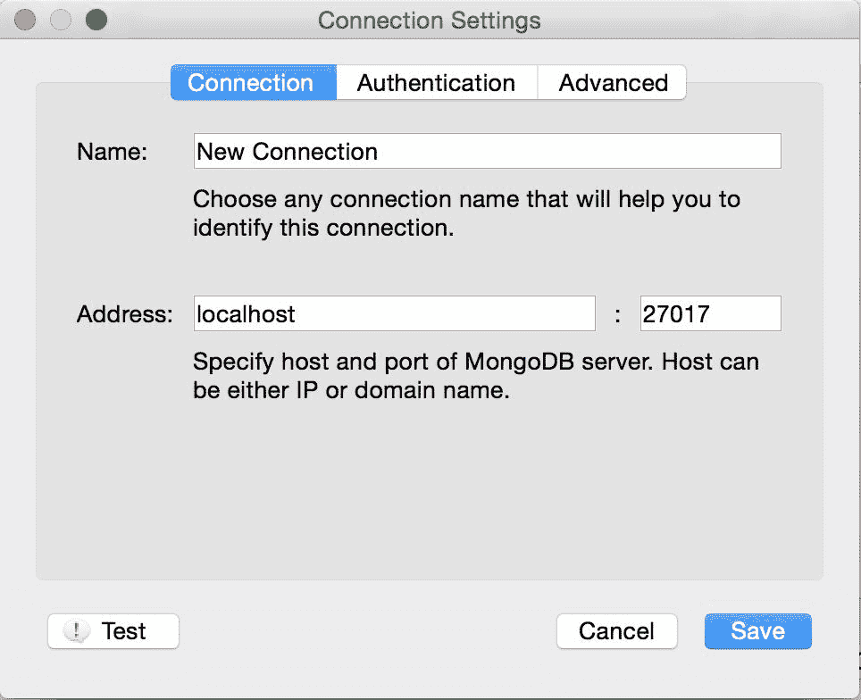
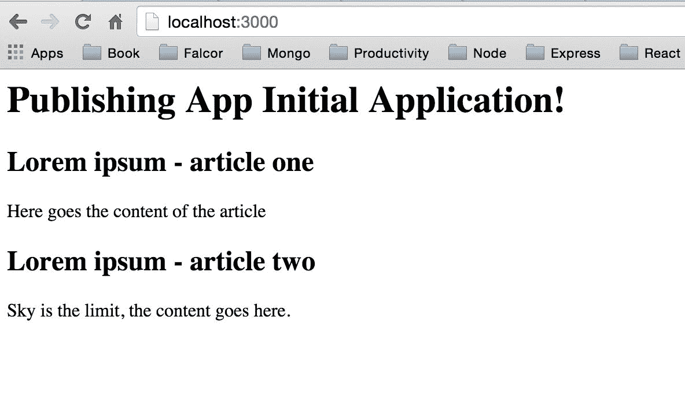
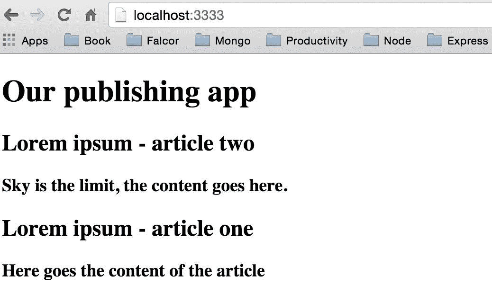
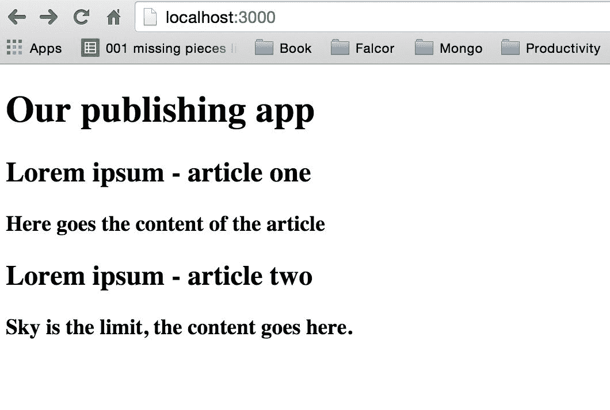

# 一、使用 Node.js、Express.js、MongoDB、Mongoose、Falcor 和 Redux 配置全栈

欢迎来到*掌握全栈 React Web 开发*。在本书中，您将使用 JavaScript 创建一个通用的全栈应用。我们将要构建的应用是一个发布平台，类似于目前市场上流行的发布平台，例如：

*   中等（[https://medium.com/](https://medium.com/) ）
*   WordPress（[https://wordpress.com/](https://wordpress.com/) ）
*   issuu（[https://issuu.com/](https://issuu.com/) ）

有许多较小的发布平台，当然，我们的应用的功能将少于上述列表中列出的功能，因为我们只关注主要功能，例如发布文章、编辑文章或删除文章（您可以使用这些核心功能实现自己的想法）。除此之外，我们将重点构建一个可构建的健壮应用，因为这类应用最重要的一点是可伸缩性。有时候，一篇文章获得的网络流量比整个网站加起来的流量要多得多（在这个行业，正常情况下，流量要高出 10000%，因为，例如，一篇文章可以通过社交媒体获得疯狂的吸引力）。

本书的第一章是关于设置项目的主要依赖项的。

本章的重点将包括以下主题：

*   安装**节点版本管理器**（**NVM**），方便节点管理
*   安装节点和 NPM
*   在本地环境中准备 MongoDB
*   用于 Mongo 的 GUI 的 Robomongo
*   Express.js 安装程序
*   Mongoose 安装和配置
*   客户端应用的初始 React Redux 结构
*   Netflix Falcor 在后端和前端作为旧 RESTful 方法的粘合剂和替代品

我们将使用非常现代的应用堆栈，这些堆栈在 2015 年和 2016 年获得了巨大的吸引力——我相信，你将在本书中学习的堆栈在未来几年将更加流行，因为我们公司*MobileWebPro.pl*看到了对前面几点中列出的技术的巨大兴趣。您将从本书中获益匪浅，并将掌握构建健壮、全栈应用的最新方法。

# 更多关于我们的技术堆栈

在本书中，我们假设您熟悉 JavaScript（ES5 和 ES6），我们还将向您介绍 ES7 和 ES8 中的一些机制。

对于客户端，您将使用 React.js，您必须已经熟悉它，因此我们不会详细讨论 React 的 API。

对于客户端的数据管理，我们将使用 Redux。我们还将向您展示如何使用 Redux 设置服务器端渲染。

对于数据库，您将学习如何与 Mongoose 一起使用 MongoDB。第二个是对象数据建模库，它为数据提供了严格的建模环境。它强化了一种结构，同时还允许您保持使 MongoDB 如此强大的灵活性。

Node.js 和 Express.js 是前端开发人员开始全堆栈开发的标准选择。Express 的框架对**Netflix**-**Falcor.js**创建的创新客户端后端数据获取机制提供了最佳支持。我们相信您会喜欢 Falcor，因为它的简单性以及它在进行全堆栈开发时会为您节省大量时间的事实。我们将在本书后面详细解释为什么使用此数据获取库而不是构建 RESTful API 的标准过程是如此高效。

通常，我们几乎在任何地方都会使用对象表示法（JSON）——使用 React 作为库，JSON 大量用于扩散虚拟 DOM（隐藏）。Redux 还使用 JSON 树作为其单个状态树容器。Netflix Falcor 的库还使用了一种称为虚拟 JSON 图的高级概念（我们将在后面详细描述）。最后，MongoDB 也是一个基于文档的数据库。

JSON 无处不在——这种设置将极大地提高我们的生产率，主要是因为 Falcor 将所有内容绑定在一起。

# 环境准备

要启动，您需要在操作系统上安装以下工具：

*   蒙哥达
*   Node.js
*   NPM--与 Node.js 一起自动安装

我们强烈建议使用 Linux 或 OS X 进行开发。对于 Windows 用户，我们建议设置虚拟机并在其中执行开发部分。为此，您可以使用**流浪者**（[https://www.vagrantup.com/](https://www.vagrantup.com/) ），它在后台创建一个虚拟环境进程，开发几乎在 Windows 上本地进行，或者您可以使用 Oracle 的**VirtualBox**（[https://www.virtualbox.org/](https://www.virtualbox.org/) 直接，并且在虚拟桌面中工作，但是这里的性能明显低于本机工作。

# NVM 和节点安装

NVM 是一个非常方便的工具，用于在开发期间在您的机器上保留不同的节点版本。转到[https://github.com/creationix/nvm](https://github.com/creationix/nvm) 获取系统上尚未安装 NVM 的说明。

在系统上安装 NVM 后，可以键入以下内容：

```jsx
$ nvm list-remote

```

此命令列出所有可用的节点版本。在本例中，我们将使用节点 v4.0.0，因此您需要在终端中键入以下内容：

```jsx
$ nvm install v4.0.0
$ nvm alias default v4.0.0

```

这些命令将安装节点版本 4.0.0。并将其设置为默认值。我们在本书中使用 NPM 2.14.23，因此您可以使用以下命令检查您的版本：

```jsx
$ npm -v
2.14.23

```

在本地计算机上安装了相同版本的 Node 和 NPM 之后，我们就可以开始设置我们将要使用的其他工具了。

# MongoDB 安装

您可以在[找到所有 MongoDB 说明 https://docs.mongodb.org/manual/installation/](https://docs.mongodb.org/manual/installation/) 在教程部分下。

以下是 MongoDB 网站的屏幕截图：


安装 Node.js 的说明和准备的软件包可在[中找到 https://nodejs.org](https://nodejs.org) 。

# 用于 MongoDB 的 Robomongo GUI

**Robomongo**是一款跨平台桌面客户端，可与 MySQL 或 PostgreSQL for SQL 数据库进行比较。

在开发应用时，最好有一个 GUI，能够快速查看数据库中的集合。如果您熟悉使用 shell for DB management，那么这是一个可选步骤，但如果这是使用数据库的第一步，那么它会很有帮助。

要获得 Robomongo（适用于所有操作系统），请访问[https://robomongo.org/](https://robomongo.org/) 并在您的机器上安装一个。

在我们的例子中，我们将使用 Robomongo 的 0.9.0 RC4 版本。

# 运行 MongoDB 并在 Robomongo GUI 中查看我们的收藏

在机器上安装 MongoDB 和 Robomongo 后，需要运行其守护进程，该进程侦听连接并将它们委托给数据库。要在终端中运行 Mongo 守护进程，请使用以下命令：

```jsx
mongod

```

然后执行以下步骤：

1.  打开 Robomongo 的客户端--将出现以下屏幕：


2.  通过单击“创建”链接创建具有默认值的连接：



3.  为您的连接选择一个名称，并使用数据库的默认端口`27017`，然后单击保存。

此时，您已经完成了 localhost 数据库设置，并且可以使用 GUI 客户端预览其内容。

# 将第一个示例集合导入数据库

在项目目录中，创建一个名为`initData.js`的文件：

```jsx
touch initData.js

```

在我们的例子中，我们正在构建发布应用，因此它将是一个文章列表。在下面的代码中，我们有一个 JSON 格式的两篇文章的示例集合：

```jsx
[ 
    { 
        articleId: '987654', 
        articleTitle: 'Lorem ipsum - article one', 
        articleContent: 'Here goes the content of the article' 
    }, 
    { 
        articleId: '123456', 
        articleTitle: 'Lorem ipsum - article two', 
        articleContent: 'Sky is the limit, the content goes here.' 
    } 
]

```

一般来说，我们从一个模拟的文章集合开始——稍后我们将添加一个特性，将更多的文章添加到 MongoDB 的集合中，但为了简洁起见，现在我们只使用两篇文章。

要列出本地主机数据库，请通过键入以下内容打开 Mongo shell：

```jsx
$ mongo

```

在 Mongo shell 中，键入：

```jsx
show dbs

```

有关完整示例，请参见以下内容：

```jsx
Welcome to the MongoDB shell. 
For interactive help, type "help". 
For more comprehensive documentation, see 
 http://docs.mongodb.org/ 
Questions? Try the support group 
 http://groups.google.com/group/mongodb-user 
Server has startup warnings: 
2016-02-25T13:31:05.896+0100 I CONTROL  [initandlisten] 
2016-02-25T13:31:05.896+0100 I CONTROL  [initandlisten] ** WARNING: soft rlimits too low. Number of files is 256, should be at least 1000 
> show dbs 
local  0.078GB 
>

```

在我们的示例中，它显示了本地主机中有一个名为`local`的数据库。

# 将文章导入 MongoDB

在下面，我们将使用终端（命令提示符）将文章导入数据库。或者，您也可以使用 Robomongo 通过 GUI 来实现：

```jsx
mongoimport --db local --collection articles --jsonArray initData.js --host=127.0.0.1

```

Remember that you need a new tab in your Terminal and `mongo import` will work while you are in the Mongo shell (Don't confuse it with the `mongod` process).

然后，您将在终端中看到以下信息：

```jsx
connected to: 127.0.0.1
imported 2 documents

```

如果您收到错误`Failed: error connecting to db server: no reachable servers`，请确保您在给定主机 IP（`127.0.0.1`上运行了`mongod`。

在通过命令行导入这些文章之后，您还将在 Robomongo 中看到这一点：


# 使用 Node.js 和 Express.js 设置服务器

一旦我们在 MongoDB 中拥有了我们的文章集，我们就可以开始在我们的 Express.js 服务器上工作，以便在该集合上工作。

首先，我们的目录中需要一个 NPM 项目：

```jsx
npm init --yes

```

`--yes`标志表示我们将使用`package.json`的默认设置。

接下来，我们在`server`目录中创建一个`index.js`文件：

```jsx
mkdir server
cd server
touch index.js

```

在`index.js`中，我们需要添加一个 Babel/寄存器，以便更好地覆盖 ECMAScript 2015 和 2016 规范。这将使我们能够支持当前版本 Node.js 中默认不可用的结构，如`async`和`generator`函数。

`index.js`文件内容见下表（稍后我们将安装 Babel 的`dev`依赖项）：

```jsx
// babel-core and babel-polyfill to be installed later in that  
//chapter 
require('babel-core/register'); 
require('babel-polyfill'); 
require('./server');

```

安装`express`和其他初始依赖项：

```jsx
npm i express@4.13.4  cors@2.7.1 body-parser@1.15.0--save

```

在命令中可以看到`express`之后的`@4.13.4`等。这些是我们将要安装的库的版本，我们特意选择了这些版本，以确保它在 side Falcor 上运行良好，但很可能您可以跳过这些，新版本也应该可以。

我们还需要安装`dev`依赖项（为了更好的可读性，我们将所有`npm install`命令分散到单独的目录中）：

```jsx
npm i --save-dev babel@6.5.2 
npm i --save-dev babel-core@6.6.5 
npm i --save-dev babel-polyfill@6.6.1 
npm i --save-dev babel-loader@6.2.4 
npm i --save-dev babel-preset-es2015@6.6.0 
npm i --save-dev babel-preset-react@6.5.0 
npm i --save-dev babel-preset-stage-0@6.5.0

```

我们需要的`babel-preset-stage-0`用于 ES7 功能。JSX 和 ES6 支持需要`babel-preset-es2015`和`babel-preset-react`。

另外，请注意，我们安装 Babel 是为了让节点的服务器能够使用 ES6 功能。我们需要添加`.babelrc`文件，因此创建以下内容：

```jsx
$ [[[you are in the main project's directory]]] 
$ touch .babelrc 

```

然后打开`.babelrc`文件，填写以下内容：

```jsx
{ 
'presets': [ 
'es2015', 
'react', 
'stage-0' 
  ] 
}

```

记住，`.babelrc`是一个隐藏文件。编辑`.babelrc`的最佳方式可能是在文本编辑器（如 Sublime text）中打开整个项目。然后您应该能够看到所有隐藏的文件。

我们还需要以下图书馆：

*   `babel`和`babel-core/register`：这是用于将新 ECMAScript 函数转换为现有版本的库
*   `cors`：该模块负责以一种简单的方式创建到我们域的跨源请求
*   `body-parser`：这是解析请求主体的中间件

在此之后，项目的文件结构应如下所示：

```jsx
&boxvr;&boxh;&boxh; node_modules 
&boxv;   &boxvr;&boxh;&boxh; *** 
&boxvr;&boxh;&boxh; initData.js 
&boxvr;&boxh;&boxh; package.json 
&boxur;&boxh;&boxh; server 
    &boxur;&boxh;&boxh; index.js

```

`***`是一个通配符，这意味着我们的项目需要一些文件，但我们不在这里列出它们，因为它们太长了。

# 在我们的服务器上工作（server.js）

我们将开始处理`server/server.js`文件，这是我们项目的新文件，因此我们需要首先使用以下命令在项目的`server`目录中创建它：

```jsx
touch server.js

```

`server/server.js`文件的内容如下：

```jsx
import http from 'http'; 
import express from 'express'; 
import cors from 'cors'; 
import bodyParser from 'body-parser'; 

const app = express(); 
app.server = http.createServer(app); 

// CORS - 3rd party middleware 
app.use(cors()); 

// This is required by falcor-express middleware  
//to work correctly with falcor-browser 
app.use(bodyParser.json({extended: false})); 

app.get('/', (req, res) => res.send('Publishing App Initial Application!')); 

app.server.listen(process.env.PORT || 3000); 
console.log(&grave;Started on port ${app.server.address().port}&grave;); 
export default app;

```

这些文件使用`babel/register`库，因此我们可以在代码中使用 ES6 语法。在`index.js`文件中，我们有一个来自 Node.js（[的`http`模块 https://nodejs.org/api/http.html#http_http](https://nodejs.org/api/http.html#http_http) 。接下来是`express`、`cors`和`body-parser`。

Cors 是用于在 Express 应用中动态或静态启用**跨源资源共享**（**Cors**）的中间件——它将在我们的开发环境中非常有用（稍后我们将在生产服务器中删除它）。

主体解析器是 HTTP 主体解析的中间件。它有一些奇特的设置，帮助我们更快地构建应用。

这是我们的应用在我们开发的这一阶段的表现：


# Mongoose 和 Express.js

目前，我们有一个简单的工作 Express.js 服务器。现在我们必须将猫鼬添加到我们的项目中：

```jsx
npm i mongoose@4.4.5 --save

```

在后台安装 Mongoose 和运行 MongoDB 数据库后，我们可以将其导入我们的`server.js`文件并进行编码：

```jsx
import http from 'http'; 
import express from 'express'; 
import cors from 'cors'; 
import bodyParser from 'body-parser'; 
import mongoose from 'mongoose'; 

mongoose.connect('mongodb://localhost/local'); 

const articleSchema = { 
    articleTitle:String, 
    articleContent:String 
}; 

const Article = mongoose.model('Article', articleSchema,  'articles');
const app = express(); 
app.server = http.createServer(app); 

// CORS - 3rd party middleware 
app.use(cors()); 

// This is required by falcor-express middleware to work correctly  
//with falcor-browser 
app.use(bodyParser.json({extended: false})); 

app.use(express.static('dist')); 

app.get('/', (req, res) => {  
    Article.find( (err, articlesDocs) => { 
      const ourArticles = articlesDocs.map((articleItem) => { 
        return &grave;<h2>${articleItem.articleTitle}</h2>            
        ${articleItem.articleCon tent}&grave;; 
      }).join('<br/>'); 

      res.send(&grave;<h1>Publishing App Initial Application!</h1>        
      ${ourArticles}&grave;); 
    }); 
}); 

app.server.listen(process.env.PORT || 3000); 
console.log(&grave;Started on port ${app.server.address().port}&grave;); 
export default app;

```

# 如何运行项目的摘要

使用以下命令确保您的计算机上的 MongoDB 在后台运行：

```jsx
mongod

```

在终端（或 Windows 上的 PowerShell）中运行`mongod`命令后，您应该会在控制台中看到如下内容：


在运行服务器之前，请确保您的`package.json`文件中的`devDependencies`如下所示：

```jsx
"devDependencies": { 
"babel": "6.5.2", 
"babel-core": "6.6.5", 
"babel-loader": "6.2.4", 
"babel-polyfill": "6.6.1", 
"babel-preset-es2015": "6.6.0", 
"babel-preset-react": "6.5.0", 
"babel-preset-stage-0": "6.5.0" 
  }

```

在运行服务器之前，请确保您的`package.json`中的依赖项如下所示：

```jsx
"dependencies": { 
"body-parser": "1.15.0", 
"cors": "2.7.1", 
"express": "4.13.4", 
"mongoose": "4.4.5" 
  }

```

在主目录中，使用以下命令运行节点：

```jsx
node server/index.js 

```

之后，您的终端应显示如下内容：

```jsx
$ node server/index.js
Started on port 3000

```



# Redux 基本概念

在本节中，我们将只介绍帮助我们制作简单发布应用的 Redux 的最基本概念。本章应用将仅处于*只读*模式；在本书的后面，我们将添加更多功能，例如添加/编辑文章。在后面的章节中，您将发现关于 Redux 的所有重要规则和原则。

涵盖的基本主题包括：

*   什么是状态树？
*   Redux 中不变性的工作原理
*   减速器的概念和基本用途

让我们从基础开始。

# 单一不变状态树

Redux 最重要的原则是将应用的整个状态表示为单个 JavaScript 对象。

Redux 中的所有更改（操作）都是显式的，因此您可以使用开发工具跟踪应用中所有操作的历史记录。


前面的屏幕截图是一个简单的示例开发工具用例，您将在开发环境中使用它。它将帮助您跟踪应用中状态的变化。该示例显示了我们如何将状态中的计数器值增加*+1*，三倍。当然，我们的发布应用结构要比这个例子复杂得多。在本书的后面部分，您将了解有关该开发工具的更多信息。

# 不变性-操作和状态树是只读的

由于 Redux 的概念是基于函数式编程范式的，因此不能像 Facebook（和其他）FLUX 实现那样修改/变异状态树中的值。

与其他 FLUX 实现一样，action 是一个描述更改的普通对象——就像添加一篇文章（为了简洁起见，在下面的代码中我们模拟了负载）：

```jsx
{ 
    type: 'ADD_ARTICLE', 
    payload: '_____HERE_GOES_INFORMATION_ABOUT_THE_CHANGE_____' 
}

```

操作是应用状态树更改的最小表示形式。让我们为发布应用准备操作。

# 纯函数与非纯函数

**纯函数**是一个没有任何副作用的函数，例如 I/O（读取文件或 HTTP 请求）。**不纯函数**有副作用，例如，如果您调用 HTTP 请求，它可以为完全相同的参数*Y，Z（函数（X，Y））*返回不同的值，因为端点正在向我们返回随机值，或者可能因为服务器错误而关闭。

对于相同的*X，Y*参数，纯函数总是可预测的。在 Redux 中，我们只在减缩器和操作中使用纯函数（否则 Redux 的`lib`将无法正常工作）。

在本书中，您将学习整个结构以及在何处进行 API 调用。因此，如果您遵循这本书，那么您就不必太担心 Redux 中的原则。

# 减速器功能

Redux 的 Reducer 可以与 Facebook 的 Flux 中的单个商店相比。重要的是，reducer 总是采用以前的状态并返回对新对象的新引用（使用`Object.assign`和其他类似的方法），因此我们可以使用不可变 JS 来帮助我们构建一个更可预测的应用状态，而不是在存储中改变变量的旧 Flux 实现。

因此，创建一个新的引用是最佳的，因为 Redux 使用旧的引用来引用未更改的缩减器中的值。这意味着，即使每个动作都通过一个减速机创建了一个全新的对象，那么不会改变的值在内存中有一个先前的引用，这样我们就不会过度使用机器的计算能力。一切都很快。

在我们的应用中，我们将有一个文章缩减器，它将帮助我们从视图层列出、添加、编辑和删除我们的文章。

# 第一个减速器和网页包配置

首先，让我们为我们的发布应用创建一个减速机：

```jsx
mkdir src 
cd src 
mkdir reducers 
cd reducers 
touch article.js 

```

所以，我们第一个减速器的位置是`src/reducers/article.js`，我们`reducers/article.js`的内容如下：

```jsx
const articleMock = { 
'987654': { 
        articleTitle: 'Lorem ipsum - article one', 
        articleContent: 'Here goes the content of the article' 
    }, 
'123456': { 
        articleTitle: 'Lorem ipsum - article two', 
        articleContent: 'Sky is the limit, the content goes here.' 
    } 
}; 

const article = (state = articleMock, action) => { 
    switch (action.type) { 
        case 'RETURN_ALL_ARTICLES': 
            return Object.assign({}, state); 
        default: 
            return state; 
    } 
} 
export default article;

```

在前面的代码中，我们将`articleMock`保存在浏览器内存中（与`initData.js`中相同）——稍后，我们将从后端数据库中获取这些数据。

箭头函数`const article`得到的`action.type`将来自常量（我们稍后将创建它们），与 Facebook 的 FLUX 实现的工作方式相同。

对于`switch`语句中的默认`return`，我们提供了`state = articleMock`中的状态（返回状态；以上部分）。这将在第一次启动时返回发布应用的初始状态，然后再执行任何其他操作。确切地说，本例中的默认操作将与我们开始从后端获取数据之前的`RETURN_ALL_ARTICLES`操作完全相同（在从后端实现文章的获取机制之后；然后默认操作将返回一个空对象）。

由于我们的网页包配置（此处描述），我们需要在`dist`中输入`index.html`。让我们创建一个`dist/index.html`文件：

```jsx
pwd 
/Users/przeor/Desktop/React-Convention-Book/src/reducers 
cd ../.. 
mkdir dist 
cd dist 
touch index.html 

```

`dist/index.html`文件内容如下：

```jsx
<!doctype html> 
<html lang="en"> 
<head> 
<title>Publishing App</title> 
<meta charset="utf-8"> 

</head> 
<body> 
<div id="publishingAppRoot"></div> 

<script src="app.js"></script> 
</body> 
</html>

```

我们有一篇文章`reducer`和`dist/index.html`，但在我们开始构建 Redux 的发布应用之前，我们需要为我们构建的自动化配置 webpack。

首先安装 webpack（您可能需要`sudo`根目录访问）：

```jsx
npm i --save-dev webpack@1.12.14 webpack-dev-server@1.14.1 

```

然后，在`package.json`和`initData.js`文件旁边的主目录中，输入以下内容：

```jsx
touch webpack.config.js

```

然后创建网页包配置：

```jsx
module.exports = { 
    entry: ['babel-polyfill', './src/app.js'], 
    output: { 
        path: './dist', 
        filename: 'app.js', 
        publicPath: '/' 
    }, 
    devServer: { 
        inline: true, 
        port: 3000, 
        contentBase: './dist' 
    }, 
    module: { 
        loaders: [ 
            { 
                test: /.js$/, 
                exclude: /(node_modules|bower_components)/, 
                loader: 'babel', 
        query: { 
                    presets: ['es2015', 'stage-0', 'react'] 
                } 
            } 
        ] 
    } 
}

```

简单地说，webpack config 表示 CommonJS 模块的条目位于条目`'./src/app.js'`。webpack 在所有从`app.js`导入之后构建一个完整的应用，最终输出位于路径`'./dist'`。我们位于`contentBase: './dist'`的应用将位于`3000`端口。我们还配置了 ES2015 和 React 的使用，以便 webpack 将 ES2015 编译成 ES5，并将 React 的 JSX 编译成 JavaScript。如果您对 webpack 的配置选项感兴趣，请阅读其文档。

# 其余的重要依赖项包括安装和 npm 开发脚本

安装 webpack 使用的 Babel 工具（检查配置文件）：

```jsx
npm i --save react@0.14.7 react-dom@0.14.7 react-redux@4.4.0 redux@3.3.1

```

我们还需要更新我们的`package.json`文件（添加`scripts`：

```jsx
"scripts": { 
"dev": "webpack-dev-server" 
  },

```

我们完整的`package.json`应该如下所示，包括所有前端依赖项：

```jsx
01{ 
"name": "project", 
"version": "1.0.0", 
"description": "", 
"scripts": { 
"dev": "webpack-dev-server" 
  }, 
"dependencies": { 
"body-parser": "1.15.0", 
"cors": "2.7.1", 
"express": "4.13.4", 
"mongoose": "4.4.5", 
"react": "0.14.7", 
"react-dom": "0.14.7", 
"react-redux": "4.4.0", 
"redux": "3.3.1" 
  }, 
"devDependencies": { 
"babel": "6.5.2", 
"babel-core": "6.6.5", 
"babel-loader": "6.2.4", 
"babel-polyfill": "6.6.1", 
"babel-preset-es2015": "6.6.0", 
"babel-preset-react": "6.5.0", 
"babel-preset-stage-0": "6.5.0", 
"webpack": "1.12.14", 
"webpack-dev-server": "1.14.1" 
  } 
}

```

As you may realize, the mentioned `package.json` doesn't have the `^` signs as we want to use the exact versions of each package in order to make sure that all our packages are installed with the correct and exact version given in the package. Otherwise, you may have some difficulties, for example, if you add `"mongoose": "4.4.5"`, with the `^` then it will install a newer version that causes some additional warnings in the console. Let's stick to the versions mentioned in the book in order to avoid unnecessary problems with the app that we are building. We want to avoid NPM dependencies hell at all cost.

# 处理 src/app.js 和 src/layouts/PublishingApp.js

让我们创建我们的`app.js`文件，我们的应用的主要部分将位于`src/app.js`：

```jsx
//[[your are in the main directory of the project]] cd src
touch app.js

```

我们新的`src/app.js`文件的内容如下：

```jsx
import React from 'react'; 
import { render } from 'react-dom'; 
import { Provider } from 'react-redux'; 
import { createStore } from 'redux'; 
import article from './reducers/article'; 
import PublishingApp from './layouts/PublishingApp'; 

const store = createStore(article); 

render( 
<Provider store={store}> 
<PublishingApp /> 
</Provider>, 
    document.getElementById('publishingAppRoot') 
);

```

新的部分是`store = createStore(article)`部分——这个来自 Redux 的实用程序允许您保留一个应用状态对象，分派一个操作，并允许您提供一个 reducer 作为参数，告诉您如何使用操作更新应用。

`react-redux`是 Redux 到 React 的有用绑定（因此我们将编写更少的代码并提高效率）：

```jsx
<Provider store>

```

`Provider store`帮助我们使 Redux 存储可用于子组件中的`connect()`调用（如下所示）：

```jsx
connect([mapStateToProps], [mapDispatchToProps], [mergeProps], [options])

```

`connect`将用于任何必须在我们的应用中监听减速器变化的组件。您将在本章后面看到如何使用它。

对于商店，我们使用`const store = createStore(article)`——为了简单起见，我要提到商店中有几种方法，我们将在下一步从头开始构建应用时使用：

```jsx
store.getState();

```

`getState`功能提供应用的当前状态：

```jsx
store.dispatch({ type: 'RETURN_ALL_ARTICLES' });

```

`dispatch`功能可以帮助您更改应用的状态：

```jsx
store.subscribe(() => { 

});

```

Subscribe 允许您注册一个回调，Redux 将在每次调度操作时调用该回调，这样视图层就可以了解应用状态的变化并刷新其视图。

# 包装 React Redux 应用

让我们完成我们的第一个 React Redux 应用。总结一下，让我们看看当前的目录结构：

```jsx
&boxvr;&boxh;&boxh; dist 
&boxv;   &boxur;&boxh;&boxh; index.html 
&boxvr;&boxh;&boxh; initData.js 
&boxvr;&boxh;&boxh; node_modules 
&boxv;   &boxvr;&boxh;&boxh; ********** (A LOT OF LIBRARIES HERE) 
&boxvr;&boxh;&boxh; package.json 
&boxvr;&boxh;&boxh; server 
&boxv;   &boxvr;&boxh;&boxh; index.js 
&boxv;   &boxur;&boxh;&boxh; server.js 
&boxvr;&boxh;&boxh; src 
&boxv;   &boxvr;&boxh;&boxh; app.js 
&boxv;   &boxur;&boxh;&boxh; reducers 
&boxv;       &boxur;&boxh;&boxh; article.js 
&boxur;&boxh;&boxh; webpack.config.js

```

现在我们需要创建应用的主视图。我们将在第一个版本中将其放入布局目录：

```jsx
pwd
/Users/przeor/Desktop/React-Convention-Book/src
mkdir layouts
cd layouts
touch PublishingApp.js

```

`PublishingApp.js`的内容为：

```jsx
import React from 'react'; 
import { connect } from 'react-redux'; 

const mapStateToProps = (state) => ({ 
  ...state 
}); 

const mapDispatchToProps = (dispatch) => ({ 
}); 

class PublishingApp extends React.Component { 
  constructor(props) { 
    super(props); 
  } 
  render () { 
    console.log(this.props);     
    return ( 
<div> 
          Our publishing app 
</div> 
    ); 
  } 
} 
export default connect(mapStateToProps, mapDispatchToProps)(PublishingApp);

```

前面介绍了`...`旁边的 ES7 语法`...`：

```jsx
const mapStateToProps = (state) => ({ 
  ...state 
});

```

`...`是一个扩展运算符，Mozilla 文档中对其进行了详细描述：；*在需要多个参数（用于函数调用）或多个元素（用于数组文本）的地方展开的表达式*。在我们的例子中，这个`...`操作符将一个对象状态扩展为第二个对象状态（在我们的例子中，是空对象`{ }`。这里是这样写的，因为在将来，我们将指定多个必须从我们的应用状态映射到`this.props`组件的还原器。

# 完成我们的第一个静态发布应用

在我们的静态应用中要做的最后一件事是呈现来自`this.props`的文章。

由于 Redux，在 reducer 中模拟的对象可用，因此如果您在`PublishingApp.js`的渲染功能中选中`console.log(this.props)`，那么您将能够访问我们的`articles`对象：

```jsx
const articleMock = { 
'987654': { 
        articleTitle: 'Lorem ipsum - article one', 
        articleContent: 'Here goes the content of the article' 
    }, 
"123456": { 
        articleTitle: 'Lorem ipsum - article two', 
        articleContent: 'Sky is the limit, the content goes here.' 
    } 
};

```

在本例中，我们需要更改 React 的渲染函数，如下所示（在`src/layouts/PublishingApp.js`中）：

```jsx
 render () { 
    let articlesJSX = []; 

    for(let articleKey in this.props) { 
        const articleDetails = this.props[articleKey]; 
        const currentArticleJSX = ( 
          <div key={articleKey}> 
          <h2>{articleDetails.articleTitle}</h2> 
          <h3>{articleDetails.articleContent}</h3> 
          </div>); 

        articlesJSX.push(currentArticleJSX); 
    } 

    return ( 
      <div> 
      <h1>Our publishing app</h1> 
          {articlesJSX} 
      </div> 
    ); 
  }

```

在前面的代码片段中，我们正在对 article`Mock`对象（从`this.props`中的 reducer 状态传递）进行`for(let articleKey in this.props)`迭代，并使用`articlesJSX.push(currentArticleJSX);`创建一个 articles 数组（在 JSX 中）。创建之后，我们将把`articlesJSX`添加到`return`语句中：

```jsx
<div> 
<h1>Our publishing app</h1> 
          {articlesJSX} 
</div>

```

此评论将在`3000`端口启动您的项目：

```jsx
npm run dev

```

勾选`localhost:3000`后，新的静态 Redux 应用应如下图所示：



太好了，所以我们在 Redux 中有一个静态应用！现在是使用 Falcor 从 MongoDB 数据库获取数据的时候了。

# Falcor 的基本概念

Falcor 就像一块胶水，粘在：

*   后端及其数据库结构（记得将`initData.js`导入 MongoDB）
*   前端 Redux 单状态树容器

它以一种比为单页应用构建老式 RESTAPI 更有效的方式粘合各个部分。

与*Redux 基本概念*部分一样，在本节中，我们将只学习 Falcor 最基本的概念，它们将帮助我们在*只读*模式下构建一个简单的全堆栈应用。在本书的后面，您将学习如何使用 Falcor 制作添加/编辑文章。

我们将重点关注最重要的方面：

*   Falcor 的模型是什么？
*   从 Falcor 检索值（前端和后端）
*   JSON 图的概念和基本用法
*   哨兵的概念和基本用途
*   如何从后端检索数据
*   如何使用名为
    `falcor-router`的 Express.js 中间件配置我们的第一条路由

# 什么是 Falcor？为什么我们需要在我们的全堆栈发布应用中使用它？

让我们首先考虑网页和 Web 应用之间的区别：

*   当**万维网**（**WWW**）发明时，网页服务于少量的大型资源（如 HTML、PDF 和 PNG 文件）。例如，您可以从服务器请求 PDF、视频或文本文件。
*   自*2008 年左右*以来，网络应用的开发越来越流行。Web 应用服务于大量的小型资源。这对我们意味着什么？您有许多使用 AJAX 调用对服务器的 RESTAPI 小调用。许多 API 请求的旧方法会造成延迟，从而减慢移动/web 应用的速度。

为什么我们在 2016 年及以后编写的应用中使用旧的 RESTAPI 请求（就像我们在 2005 年所做的那样）？这就是 Falcor 闪耀的地方；它解决了后端到前端的延迟和紧密耦合问题。

# 紧密耦合和延迟与所有地方的一个模型相比

如果您熟悉前端开发，您就知道如何向 API 发出请求。这种老方法总是迫使您将后端 API 与前端 API 实用程序紧密耦合。总是这样的：

1.  您可以创建一个类似于[的 API 端点 https://applicationDomain.com/api/recordDetails?id=92](https://applicationDomain.com/api/recordDetails?id=92) 。
2.  使用前端上的 HTTP API 请求使用数据：

```jsx
        { 
            id: '92', 
            title: 'example title', 
            content: 'example content' 
        }

```

在大型应用中，很难维护真正的干式 RESTful API，而且这个问题会导致大量端点没有得到优化，因此前端有时必须进行多次往返以获取特定视图所需的数据（有时它获取的信息远远超过了它的需要，这会给应用的最终用户带来更多的延迟）。

假设您有一个具有 50 多个不同 API 端点的大型应用。在应用的第一个版本完成后，您的客户或老板会找到一种更好的方法来组织应用中的用户流。这是什么意思？您必须同时更改前端和后端端点，以满足用户界面层中的更改。这称为前端和后端之间的紧密耦合。

Falcor 为改善这两个导致 RESTful API 使用效率低下的方面带来了什么？答案是到处都有一种模式。

如果您的所有数据都可以在客户端的内存中访问，那么构建 web 应用将非常容易。

Falcor 提供的实用程序可以帮助您感觉所有数据都在您的指尖，而无需对后端 API 端点和客户端消费实用程序进行编码。

# 客户端和服务器端不再紧密耦合

Falcor 帮助您将应用的所有数据表示为服务器上的一个虚拟 JSON 模型。

在编写客户端编程时，Falcor 让您感觉应用的整个 JSON 模型都可以在本地访问，并允许您以与从内存 JSON 读取数据相同的方式读取数据——您很快就会学会！

由于 Falcor 的浏览器库和`falcor-express`中间件，您可以从云上按需从模型中检索数据。

Falcor 透明地处理所有网络通信，并使客户端应用与服务器和数据库保持同步。

在本章中，我们还将学习如何使用`falcor-router`。

# 客户端 Falcor

让我们先从 NPM 安装 Falcor：

```jsx
pwd 
/Users/przeor/Desktop/React-Convention-Book 
npm i --save falcor@0.1\. 
16 falcor-http-datasource@0.1.3 

```

`falcor-http-datasource`帮助我们从服务器端到客户端检索数据，开箱即用（不必担心 HTTP API 请求）——我们稍后将在将客户端模型移动到后端时使用它。

让我们在客户端创建应用的 Falcor 模型：

```jsx
cd src
touch falcorModel.js

```

那么`falcorModel.js`的内容如下：

```jsx
import falcor from 'falcor';  
import FalcorDataSource from 'falcor-http-datasource'; 

let cache = { 
  articles: [ 
    { 
        id: 987654, 
        articleTitle: 'Lorem ipsum - article one', 
        articleContent: 'Here goes the content of the article' 
    }, 
    { 
        id: 123456, 
        articleTitle: 'Lorem ipsum - article two from backend', 
        articleContent: 'Sky is the limit, the content goes here.' 
    } 
  ] 
}; 

const model = new falcor.Model({ 
'cache': cache 
}); 
export default model;

```

在这段代码中，您可以找到一个众所周知的、简短的、可读的发布应用模型，其中包含两篇文章。

现在我们将在`src/layouts/PublishingApp.js`React 组件中从前端 Falcor 的模型中获取该数据，我们将添加一个名为`_fetch()`的新函数，该函数将负责获取应用开始时的所有文章。

我们需要首先导入我们的 Falcor 模型，因此在`PublishingApp.js`文件的顶部，我们需要添加以下内容：

```jsx
import falcorModel from '../falcorModel.js';

```

在我们的`PublishingApp`类中，我们需要添加以下两个函数：；`componentWillMount`和`_fetch`（更多说明如下）：

```jsx
class PublishingApp extends React.Component { 
  constructor(props) { 
    super(props); 
  } 

  componentWillMount() { 
    this._fetch(); 
  } 

  async _fetch() { 
    const articlesLength = await falcorModel. 
      getValue('articles.length'). 
      then((length) => length ); 

    const articles = await falcorModel. 
      get(['articles', {from: 0, to: articlesLength-1},  
      ['id','articleTitle', 'articleContent']])  
      .then((articlesResponse) => articlesResponse.json.articles); 
  } 
  // below here are next methods o the PublishingApp

```

在这里，您可以看到名为`_fetch`的异步函数。这是一种特殊的语法，允许您像使用`let articlesLength = await falcorModel`和`let articles = await falcorModel`一样使用`await`关键字。

使用`async await`over promissions 意味着我们的代码更具可读性，避免了一个接一个嵌套多个回调导致代码很难读取和扩展的回调地狱。

`async`/`await`特性取自受 C#启发的 ECMAScript 7。它允许您编写似乎在每个异步操作中被阻止的函数，这些异步操作在继续下一个操作之前等待结果。

在我们的示例中，代码将按如下方式执行：

1.  首先，它将调用 Falcor 的模式进行物品计数，如下所示：

```jsx
        const articlesLength = await falcorModel. 
          getValue('articles.length'). 
          then( (length) =>  length );

```

2.  在本文的`Length`变量中，我们将从我们的模型中获得`articles.length`计数（在我们的例子中，它将是第二个）。
3.  在我们知道模型中有两篇文章之后，下一段代码将执行以下内容：

```jsx
        let articles = await falcorModel. 
          get(['articles', {from: 0, to: articlesLength-1},
          ['id','articleTitle', 'articleContent']]).  
          then( (articlesResponse) => articlesResponse.json.articles);

```

`falcorModel.get(['articles', {from: 0, to: articlesLength-1}, ['id','articleTitle', 'articleContent']]).`上的`get`方法也是异步操作（与`http request`相同）。在`get`方法的参数中，我们提供了我们的文章在我们的模型中的位置（在`src/falcorModel.js`中），因此我们提供以下路径：

```jsx
falcorModel.get( 
['articles', {from: 0, to: articlesLength-1}, ['id','articleTitle', 'articleContent']] 
)

```

前面 Falcor 路径的解释基于我们的模型。我们再说一遍：

```jsx
{ 
  articles: [ 
    { 
        id: 987654, 
        articleTitle: 'Lorem ipsum - article one', 
        articleContent: 'Here goes the content of the article' 
    }, 
    { 
        id: 123456, 
        articleTitle: 'Lorem ipsum - article two from backend', 
        articleContent: 'Sky is the limit, the content goes here.' 
    } 
  ] 
}

```

我们对 Falcor 说的是：

1.  首先，我们希望使用以下方法从对象内的`articles`获取数据：

```jsx
        ['articles']

```

2.  接下来，从`articles`集合中选择其所有文章的子集，其范围为`{from: 0, to: articlesLength-1}`（我们之前获取的`articlesLength`），路径如下：

```jsx
        ['articles', {from: 0, to: articlesLength-1}]

```

3.  最后一步向 Falcor 解释了要从我们的模型中获取对象的哪些属性。所以`falcorModel.get`查询的完整路径如下：

```jsx
        ['articles', {from: 0, to: articlesLength-1},   
        ['id','articleTitle', 'articleContent']]

```

4.  `['id','articleTitle', 'articleContent']`的数组表示您希望从每篇文章中获得这三个属性。
5.  最后，我们从 Falcor 接收到一组 article 对象：


在我们从 Falcor 模型中获取数据后，我们需要发送一个操作，该操作将相应地更改文章的缩减器，并最终从`const articleMock`（在`src/reducers/article.js`中）重新呈现 Falcor 模型中的文章列表。

但在我们能够发出行动之前，我们需要执行以下操作：

使用`article.js`创建`actions`目录：

```jsx
pwd 
$ /Users/przeor/Desktop/React-Convention-Book 
cd src 
mkdir actions 
cd actions 
touch article.js 

```

为我们的`src/actions/article.js`文件创建如下内容：

```jsx
export default { 
  articlesList: (response) => { 
    return { 
      type: 'ARTICLES_LIST_ADD', 
      payload: { response: response } 
    } 
  } 
}

```

`actions/article.js`文件`.`中没有太多内容，如果您已经熟悉 FLUX，那么它非常相似。Redux 中操作的一个重要规则是它必须是纯函数。现在，我们将把一个名为`ARTICLES_LIST_ADD`的常量硬编码为`actions/article.js`。

在`src/layouts/PublishingApp.js`文件中，我们需要在文件顶部添加一个新的导入代码：

```jsx
import {bindActionCreators} from 'redux'; 
import articleActions from '../actions/article.js';

```

当您在我们的`PublishingApp`中添加了前两项后，请从以下内容修改同一文件中的现有功能：

```jsx
const mapDispatchToProps = (dispatch) => ({ 
});

```

添加`articleActions: bindActionCreators(articleActions, dispatch)`以便我们能够将文章的行为绑定到我们的`this.props`组件中：

```jsx
const mapDispatchToProps = (dispatch) => ({ 
  articleActions: bindActionCreators(articleActions, dispatch) 
});

```

由于我们组件中提到的更改`(articleActions: bindActionCreators(articleActions, dispatch))`，我们将能够从道具中发送一个动作，因为现在，当您使用`this.props.articleActions.articlesList(articles)`时，从 Falcor 获取的`articles`对象将在我们的 reducer 中可用（从这里开始，我们的应用获取数据只需一步）。

现在，完成这些更改后，在`_fetch`函数中向我们的组件添加一个操作：

```jsx
this.props.articleActions.articlesList(articles);

```

我们的整个抓取功能如下所示：

```jsx
 async _fetch() { 
    const articlesLength = await falcorModel. 
      getValue('articles.length'). 
      then( (length) => length); 

    let articles = await falcorModel. 
      get(['articles', {from: 0, to: articlesLength-1},  
      ['id','articleTitle', 'articleContent']]).  
      then( (articlesResponse) => articlesResponse.json.articles); 

    this.props.articleActions.articlesList(articles); 
  }

```

另外，不要忘记从`ComponentWillMount`拨打`_fetch`：

```jsx
 componentWillMount() { 
    this._fetch(); 
  }

```

此时，我们将能够在 Redux 的减速机中接收到一个动作。让我们改进我们的`src/reducers/article.js`文件：

```jsx
const article = (state = {}, action) => { 
    switch (action.type) { 
        case 'RETURN_ALL_ARTICLES': 
            return Object.assign({}, state); 
        case 'ARTICLES_LIST_ADD': 
            return Object.assign({}, action.payload.response); 
        default: 
            return state; 
    } 
} 
export default article

```

如您所见，我们不再需要`articleMock`，因此我们已将其从`src/reducers/article.js`中删除。

我们增加了一个新案例`ARTICLES_LIST_ADD`：

```jsx
   case 'ARTICLES_LIST_ADD': 
        let articlesList = action.payload.response; 
        return Object.assign({}, articlesList);

```

`articlesList`对象（由于`Object.assign`，内存中有一个新的引用）。

Don't confuse the two files with the same name and other locations, such as:
`reducers/article.js` 
`actions/article.js` 
You need to make sure that you are editing the correct file, otherwise the app won't work.

# 客户端 Falcor+Redux 概述

如果您运行`http://localhost:3000/index.html`，您会看到，目前我们有两个独立的应用：

*   一个位于前端，使用 Redux 和客户端 Falcor
*   一个在后端使用 MongoDB、Mongoose 和 Express

我们需要将两者结合在一起，以便我们的应用有一个状态源（来自 MongoDB）。

# 将 Falcor 的模型移动到后端

我们还需要更新我们的`package.json`文件：

```jsx
"scripts": { 
  "dev": "webpack-dev-server", 
  "start": "npm run webpack; node server", 
  "webpack": "webpack --config ./webpack.config.js" 
},

```

由于我们正在启动全栈开发部分，我们需要在`package.json`中的脚本中添加`npm start`——这将有助于编译客户端，将它们放入`dist`文件夹（通过网页包生成），并在`dist`中创建静态文件，然后将此文件夹用作静态文件的源（检查`server/server.js`中的`app.use(express.static('dist'));`。

下一个重要事项是在后端安装 Falcor 所需的新依赖项：

```jsx
npm i --save falcor-express@0.1.2 falcor-router@0.2.12

```

当您最终安装了新的依赖项并配置了在同一端口上运行后端和前端的基本脚本后，请按如下方式编辑`server/server.js`：

1.  在我们的文件顶部，在`server/server.js`中导入新库：

```jsx
        import falcor from 'falcor'; 
        import falcorExpress from 'falcor-express';

```

2.  然后在以下两者之间：

```jsx
        app.use(bodyParser.json({extended: false})); 
        app.use(express.static('dist'));

```

3.  添加用于在后端管理 Falcor 的新代码：

```jsx
        app.use(bodyParser.json({extended: false})); 

        let cache = { 
          articles: [ 
            { 
                id: 987654, 
                articleTitle: 'Lorem ipsum - article one', 
                articleContent: 'Here goes the content of the article' 
            }, 
            { 
                id: 123456, 
                articleTitle: 'Lorem ipsum - article two from          
                backend', 
                articleContent: 'Sky is the limit, the content goes          
                here.' 
            } 
          ] 
        }; 

        var model = new falcor.Model({ 
          cache: cache 
        }); 

        app.use('/model.json', falcorExpress.dataSourceRoute((req,               
        res) => { 
            return model.asDataSource(); 
        })); 
        app.use(express.static('dist'));

```

4.  前面的代码与`src/falcorModel.js`文件中的代码几乎相同。唯一的区别是，现在 Falcor 将从后端的模拟对象（在`server.js`中称为`cache`的对象）获取数据。
5.  第二部分是更改前端的数据源，所以在`src/falcorModel.js`文件中，您更改了以下旧代码：

```jsx
        import falcor from 'falcor'; 
        import FalcorDataSource from 'falcor-http-datasource'; 

        let cache = { 
          articles: [ 
          { 
            id: 987654, 
            articleTitle: 'Lorem ipsum - article one', 
            articleContent: 'Here goes the content of the article' 
          }, 
          { 
            id: 123456, 
            articleTitle: 'Lorem ipsum - article two from backend', 
            articleContent: 'Sky is the limit, the content goes here.' 
          } 
         ] 
        }; 

        const model = new falcor.Model({ 
        'cache': cache 
        }); 

        export default model;

```

6.  将其更改为以下更新代码：

```jsx
        import falcor from 'falcor'; 
        import FalcorDataSource from 'falcor-http-datasource'; 

        const model = new falcor.Model({ 
          source: new FalcorDataSource('/model.json') 
        }); 

        export default model;

```

7.  使用以下命令运行应用：

```jsx
 npm start

```

8.  您将在浏览器的开发工具中看到 Falcor 发出的新 HTTP 请求，例如，在我们的示例中：


如果您正确遵循所有说明，则还可以通过执行以下操作，直接从浏览器向服务器发出请求：

```jsx
http://localhost:3000/model.json?paths=[["articles", {"from":0,"to":1},   
["articleContent","articleTitle","id"]]]&method=get.

```

然后您将在响应中看到一个`jsonGraph`：


你不必担心前两张截图。它们只是 Falcor 如何用 Falcor 的语言在后端和前端之间进行通信的一个示例。您不必再担心公开 API 端点和对前端进行编程以了解后端提供的数据。Falcor 正在开箱即用地完成所有这些工作，您将在制作此发布应用时了解更多详细信息。

# 配置 Falcor 的路由（Express.js）

目前，我们的后端模型是硬编码的，因此它保留在服务器的 RAM 内存中。我们需要增加从 MongoDB 的文章集合中读取数据的能力——这就是`falcor-router`派上用场的地方。

我们需要创建`falcor-router`库将使用的路由定义文件：

```jsx
$ pwd 
/Users/przeor/Desktop/React-Convention-Book 
$ cd server 
$ touch routes.js 

```

我们已经创建了`server/routes.js`文件；该路由的内容如下：

```jsx
const PublishingAppRoutes = [{ 
  route: 'articles.length', 
  get: () => { 
    const articlesCountInDB = 2; // hardcoded for example 
    return { 
      path: ['articles', 'length'], 
      value: articlesCountInDB 
    }; 
  } 
}]; 
export default PublishingAppRoutes;

```

如您所见，我们已经创建了第一条路径，它将与`_fetch`函数中的`articles.length`匹配（在`layouts/PublishingApp.js`中）。

我们已经在`articlesCountInDB`中硬编码了数字 2，稍后我们将在那里查询我们的数据库。

这里的新东西是`route: 'articles.length'`，这只是 Falcor 匹配的一条路线。

更准确地说，Falcor 路由的路径与您在`src/layouts/PublishingApp.js (_fetch function)`中提供的路径完全相同，例如，为了匹配此前端呼叫：

```jsx
 // location of that code snippet: src/layouts/PublishingApp.js 
 const articlesLength = await falcorModel. 
    getValue('articles.length'). 
    then((length) => length);

```

*   `path: ['articles', 'length']`：该属性告诉我们 Falcor 的路径（它由 Falcor 在后端和前端使用）。我们需要提供这一点，因为有时候，一个路由可以返回许多不同的对象作为服务器文章（您将在我们创建的下一个路由中看到）。
*   `value: articlesCountInDB`：这是一个返回值。在本例中，它是一个整数，但也可以是具有多个属性的对象，稍后您将了解到这一点。

# 从后端返回两篇文章的第二个途径

我们的第二条路线（也是本章的最后一条）如下：

```jsx
{ 
  route: 'articles[{integers}]["id","articleTitle","articleContent"]', 
  get: (pathSet) => { 
    const articlesIndex = pathSet[1]; 
    const articlesArrayFromDB = [{ 
    'articleId': '987654', 
    'articleTitle': 'BACKEND Lorem ipsum - article one', 
    'articleContent': 'BACKEND Here goes the content of the article' 
    }, { 
    'articleId': '123456', 
    'articleTitle': 'BACKEND Lorem ipsum - article two', 
    'articleContent': 'BACKEND Sky is the limit, the content goes here.' 
    }]; // That are our mocked articles from MongoDB 

    let results = []; 
    articlesIndex.forEach((index) => { 
      const singleArticleObject = articlesArrayFromDB[index]; 
      const falcorSingleArticleResult = { 
        path: ['articles', index], 
        value: singleArticleObject 
      }; 
      results.push(falcorSingleArticleResult); 
    }); 

    return results; 
  } 
}

```

第二条路线中的新事物是`pathSet`，如果您将其登录到控制台，那么您将看到，在我们的情况下（当尝试运行我们的全栈应用时），如下所示：

```jsx
[  
'articles', 
  [ 0, 1 ], 
  [ 'articleContent', 'articleTitle', 'id' ]  
]

```

`pathSet`告诉我们从客户端请求什么索引（在我们的示例中为`[ 0, 1 ]`）。

因为在本例中，我们将返回一个项目数组（多个项目），所以需要创建一个结果变量：

```jsx
let results = [];

```

迭代请求的索引：

```jsx
articlesIndex.forEach((index) => { 
   const singleArticleObject = articlesArrayFromDB[index]; 
   const falcorSingleArticleResult = { 
     path: ['articles', index], 
     value: singleArticleObject 
   }; 
   results.push(falcorSingleArticleResult); 
 });

```

在前面的代码片段中，我们迭代了一组请求的索引（您还记得`PublishingApp.js`中的`{from: 0, to: articlesLength-1}`吗？）。基于索引`([0, 1])`我们通过`const singleArticleObject = articlesArrayFromDB[index];`获取模拟数据。后来我们输入了`path`和`index`（`path: ['articles', index],`，以便 Falcor 知道`singleArticleObject`值属于 JSON 图形对象中的哪个路径。

返回该文章数组：

```jsx
console.info(results) 
 return results;

```

`console.info`将显示该路径返回的内容：

```jsx
[{ 
  path: ['articles', 0], 
  value: { 
    articleId: '987654', 
    articleTitle: 'BACKEND Lorem ipsum - article one', 
    articleContent: 'BACKEND Here goes the content of the article' 
  } 
}, { 
  path: ['articles', 1], 
  value: { 
    articleId: '123456', 
    articleTitle: 'BACKEND Lorem ipsum - article two', 
    articleContent: 'BACKEND Sky is the limit, the content goes here.' 
  } 
}]

```

# 最后一次触按可使 Falcor 满栈运行

目前，我们的路由中仍有模拟数据，但在开始调用 MongoDB 之前，我们需要结束当前的设置，以便您能够在浏览器中看到它正在运行。

打开您的`server/server.js`并确保导入以下两个内容：

```jsx
import falcorRouter from 'falcor-router'; 
import routes from './routes.js';

```

现在我们已经导入了我们的`falcor-router`和`routes.js`——我们需要使用它们，所以修改这个旧代码：

```jsx
// This is old code, remove it and replace with new 
app.use('/model.json', falcorExpress.dataSourceRoute((req, res) =>  { 
  return model.asDataSource(); 
}));

```

将前面的代码替换为：

```jsx
app.use('/model.json', falcorExpress.dataSourceRoute((req, res) => { 
 return new falcorRouter(routes); 
}));

```

只有当`falcor-router`已经安装并导入到`server.js`文件中时，此操作才有效。这是一个用于`DataSource`的库，用于在应用服务器上创建虚拟 JSON 图形文档。正如您在`server.js`中所看到的，到目前为止，我们的`DataSource`由我们的硬编码型号`return model.asDataSource();`提供。这里的路由也会这样做，但现在你可以根据你的应用要求匹配路由。

此外，正如您所看到的，新的`falcorRouter`采用了我们的路线`return new falcorRouter(routes);`的参数。

如果正确遵循说明，您将能够运行项目：

```jsx
npm start

```

在端口`3000`上，您将看到以下内容：


# 根据 Falcor 的路线添加 MongoDB/Mongoose 呼叫

让我们回到我们的`server/routes.js`档案。我们需要移动（从`server.js`删除并移动到`routes.js`以下代码：

```jsx
// this goes to server/routes.js 
import mongoose from 'mongoose'; 

mongoose.connect('mongodb://localhost/local'); 

const articleSchema = { 
  articleTitle:String, 
  articleContent:String 
}; 
const Article = mongoose.model('Article', articleSchema, 'articles');

```

在第一条路径`articles.length`中，您需要将模拟的第二条（物品计数）替换为猫鼬的`count`方法：

```jsx
 route: 'articles.length', 
    get: () => { 
    return Article.count({}, (err, count) => count) 
    .then ((articlesCountInDB) => { 
      return { 
        path: ['articles', 'length'], 
        value: articlesCountInDB 
      } 
    }) 
  }

```

We are returning a Promise in `get` (Mongoose, by its asynchronous nature, always returns a Promise while making any database's request, as in the example, `Article.count`).

方法`Article.count`简单地从我们的*文章*模型中检索文章计数的整数（这是在本书开头的`MongoDB/Mongoose sub-chapter`中准备的）。

第二条路线`route: 'articles[{integers}]["id","articleTitle","articleContent"]'`必须更改如下：

```jsx
{ 
  route: 'articles[{integers}]["id","articleTitle","articleContent"]', 
  get: (pathSet) => { 
    const articlesIndex = pathSet[1]; 

    return Article.find({}, (err, articlesDocs) => articlesDocs) 
    .then ((articlesArrayFromDB) => { 
      let results = []; 
      articlesIndex.forEach((index) => { 
        const singleArticleObject =          
        articlesArrayFromDB[index].toObject(); 
        const falcorSingleArticleResult = { 
          path: ['articles', index], 
          value: singleArticleObject 
        }; 
        results.push(falcorSingleArticleResult); 
      }); 
      return results; 
    }) 
  } 
}

```

我们再次以`Article.find`返回承诺。此外，我们已经从数据库中删除了模拟响应，取而代之的是使用`Article.find`方法。

文章数组在`}).then ((articlesArrayFromDB) => {`中返回，接下来我们只需迭代并创建一个结果数组。

请注意，在`const singleArticleObject = articlesArrayFromDB[index].toObject();`上，我们使用了一种方法`.toObject`。这对实现这一目标非常重要。

# 仔细检查服务器/routes.js 和 package.json

为了在应用无法运行时节省您的时间，我们可以再次检查后端的 Falcor 路由是否正确准备：

```jsx
import mongoose from 'mongoose'; 

mongoose.connect('mongodb://localhost/local'); 

const articleSchema = { 
  articleTitle:String, 
  articleContent:String 
}; 

const Article = mongoose.model('Article', articleSchema, 'articles'); 

const PublishingAppRoutes = [ 
  { 
    route: 'articles.length', 
      get: () =>  Article.count({}, (err, count) => count) 
        .then ((articlesCountInDB) => { 
          return { 
            path: ['articles', 'length'], 
            value: articlesCountInDB 
          }; 
      }) 
  }, 
  { 
    route: 'articles[{integers}]  
    ["id","articleTitle","articleContent"]', 
    get: (pathSet) => { 
      const articlesIndex = pathSet[1]; 

      return Article.find({}, (err, articlesDocs) =>         
      articlesDocs); 
       .then ((articlesArrayFromDB) => { 
          let results = []; 

          articlesIndex.forEach((index) => { 
            const singleArticleObject =              
            articlesArrayFromDB[index].toObject(); 
            const falcorSingleArticleResult = { 
              path: ['articles', index], 
              value: singleArticleObject 
            }; 

            results.push(falcorSingleArticleResult); 
          }); 

          return results; 
        }) 
      } 
  } 
]; 

export default PublishingAppRoutes;

```

检查您的`server/routes.js`文件是否与前面的代码和您使用的其他代码元素相似。

此外，检查您的`package.json`外观是否与以下外观相似：

```jsx
{ 
"name": "project", 
"version": "1.0.0", 
"scripts": { 
"dev": "webpack-dev-server", 
"start": "npm run webpack; node server", 
"webpack": "webpack --config ./webpack.config.js" 
  }, 
"dependencies": { 
"body-parser": "^1.15.0", 
"cors": "^2.7.1", 
"express": "^4.13.4", 
"falcor": "^0.1.16", 
"falcor-express": "^0.1.2", 
"falcor-http-datasource": "^0.1.3", 
"falcor-router": "0.2.12", 
"mongoose": "4.4.5", 
"react": "^0.14.7", 
"react-dom": "^0.14.7", 
"react-redux": "^4.4.0", 
"redux": "^3.3.1" 
  }, 
"devDependencies": { 
"babel": "^6.5.2", 
"babel-core": "^6.6.5", 
"babel-loader": "^6.2.4", 
"babel-polyfill": "^6.6.1", 
"babel-preset-es2015": "^6.6.0", 
"babel-preset-react": "^6.5.0", 
"babel-preset-stage-0": "^6.5.0", 
"webpack": "^1.12.14", 
"webpack-dev-server": "^1.14.1" 
  } 
}

```

关于`package.json`需要注意的重要一点是，我们已经从`"mongoose": "4.4.5"`中删除了`^`。我们这样做是因为如果 NPM 安装任何高于`4.4.5`的版本，那么我们会在 bash/命令行中收到警告。

# 我们的第一个工作完整的堆栈应用

之后，您应该有一个完整的应用全栈版本：



在几乎每个步骤中，我们应用的 UI 部分都是相同的。前面的屏幕截图是发布应用，它执行以下操作：

1.  使用`Falcor-Express`和`Falcor-Router`从数据库中获取数据。
2.  数据从后端（源是 MongoDB）移动到前端。我们填充 Redux 的`src/reducers/article.js`状态树。
3.  我们基于单个状态树呈现 DOM 元素。
4.  所有这些步骤都允许我们将全栈应用的所有数据从数据库传送到用户的浏览器（以便用户可以查看文章）。

# 总结

我们还没有开始进行应用设计，但在我们的书中，我们将使用 React（[的材质设计 CSShttp://material-ui.com](http://material-ui.com) ）。在下一章中，我们将开始使用它进行用户注册和登录。之后，我们将使用 Material Design 的组件重新设置应用主页的样式。

为了让您了解目标（在阅读本书时），以下是应用的屏幕截图，以及发布应用将如何在以下章节中改进：


在前面的屏幕截图中，有一篇来自我们应用的示例文章。我们正在使用几种材料设计组件，以使我们的工作更轻松，发布应用看起来更专业。你以后会知道的。

您准备好在下一章中为我们的发布应用进行全栈登录和注册了吗？让我们继续玩吧。