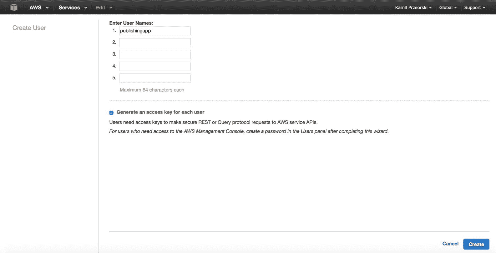
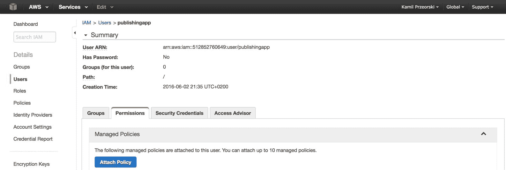
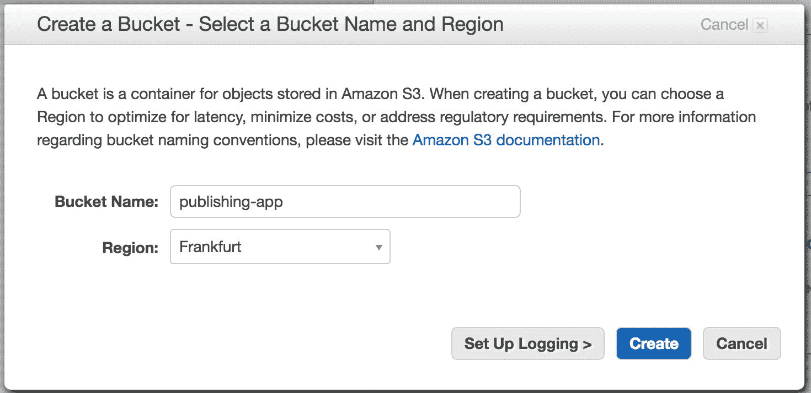
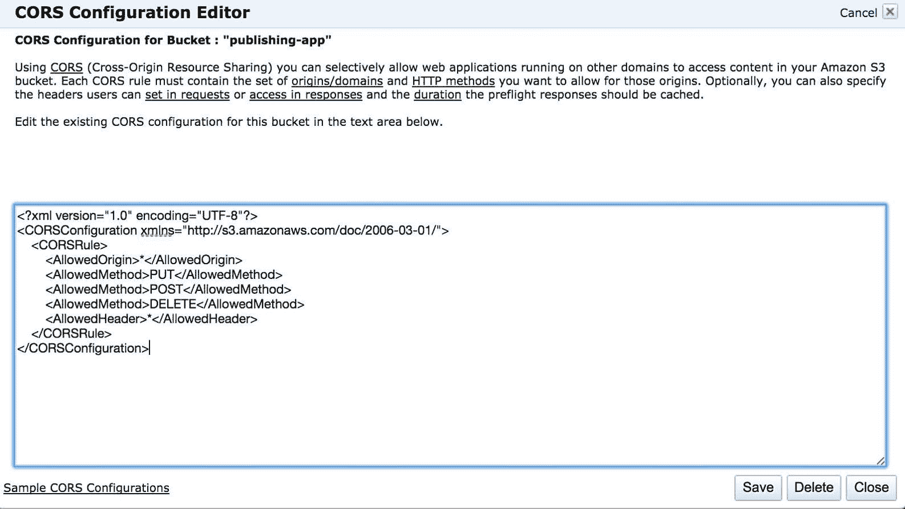
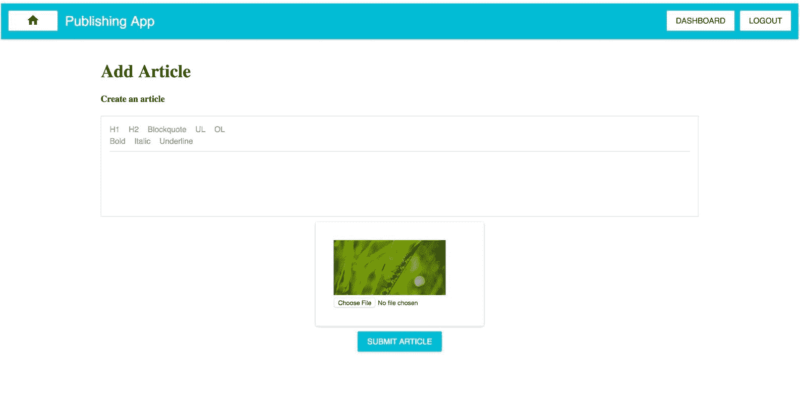
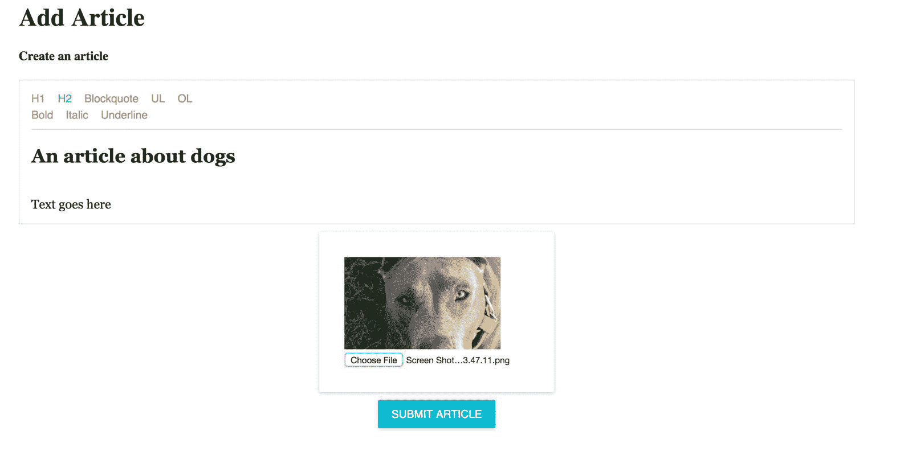
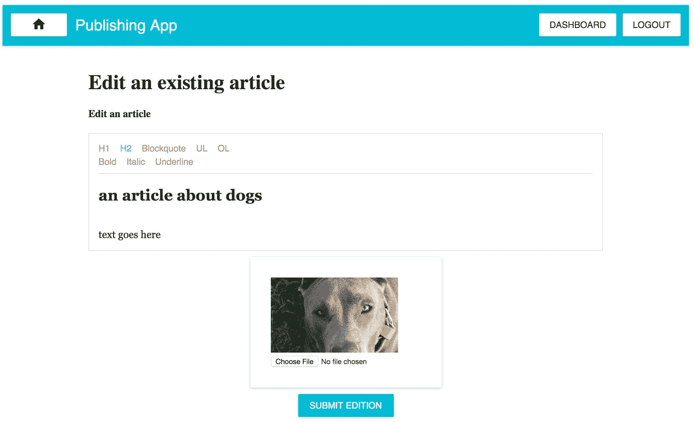

# 六、用于图像上传和包装关键应用功能的 AWS S3 

目前，我们有一个应用，但缺少一些关键功能。本章的重点将包括以下功能实现/改进：

*   开设新的 AWS 帐户
*   为您的 AWS 帐户创建**身份和访问管理**（**IAM**）
*   设置 AWS S3 铲斗
*   添加上载文章照片的功能（添加和编辑文章封面）
*   添加设置标题、副标题和“叠加副标题”的功能（在添加/编辑文章视图上）

仪表板上的文章内容中当前包含 HTML；我们需要改进这一点：


我们需要完成这件事。完成这些改进后，我们将进行一些重构。

# AWS S3-简介

Amazon 的 AWS S3 是一种简单的静态资产存储服务，如 Amazon 服务器上的图像。它帮助您在云中托管安全、安全且高度可伸缩的对象（如图像）。

这种在线存储静态资产的方法非常方便和简单——这就是为什么我们将在本书中使用它的原因。

我们将在应用中使用它，因为它为我们提供了许多可伸缩性功能，在我们自己的 Node.js 服务器上托管图像资产时，这些功能不容易访问。

一般来说，Node.js 不应该用于托管比我们现在使用的更大的资产。甚至不要考虑在 Node.js 服务器上实现图像上传机制（根本不推荐）——我们将为此使用 Amazon 的服务。

# 生成密钥（访问密钥 ID 和密钥）

在开始添加新的 S3 存储桶之前，我们需要为 AWS 帐户生成密钥（`accessKeyId`和`secretAccessKey`。

我们需要在 Node.js 应用中保留的一组详细信息示例如下：

```jsx
const awsConfig = { 
  accessKeyId: 'EXAMPLE_LB7XH_KEY_BGTCA', 
  secretAccessKey: 'ExAMpLe+KEY+FYliI9J1nvky5g2bInN26TCU+FiY', 
  region: 'us-west-2', 
  bucketKey: 'your-bucket-name-' 
};

```

亚马逊 S3 中的水桶是什么？**bucket**是 AmazonS3 中文件的名称空间。可以将多个 bucket 与不同的项目关联。如您所见，我们下一步将创建与您的`accountDefine`和`bucketKey`相关联的`accessKeyId`和`secretAccessKey`（我们文章中图片的名称空间）。定义要在其中物理保留文件的区域。如果您的项目为某个位置指定了目标，它将加快图像的加载速度，并且通常会限制延迟，因为图像将托管在离发布应用的客户端/用户更近的位置。

要创建 AWS 帐户，请转至[https://aws.amazon.com/](https://aws.amazon.com/) ：


创建帐户或登录您的帐户：


下一步是创建 IAM，将在下一节中详细介绍。

**Regarding AWS creation** After you create an account for a certain region, if you want to create an S3 bucket, you need to choose the same region your account is assigned to; otherwise, you may have problems while setting up S3 in the following pages.

# 国际机械师协会

让我们准备新的`accessKeyId`和`secretAccessKey`。您需要访问 Amazon 控制台中的 IAM 页面。您可以在服务列表中找到它：


IAM 页面如下所示（[https://console.aws.amazon.com/iam/home?#home](https://console.aws.amazon.com/iam/home?#home) ：


转到 IAM 资源|用户：


在下一页，您将看到一个按钮；点击它：


单击后，您将看到一个表单。至少填写一个用户，如本屏幕截图所示（屏幕截图给出了您必须完成的确切步骤，即使 AWS 的用户体验在此期间发生了变化）：



单击“创建”按钮后，将密钥复制到一个安全的地方（我们稍后将使用它们）：


Do not forget to copy the keys (access key ID and secret access key). You will learn where to put them in the code in order to use S3 services later in the book. Of course, the ones in the screenshot aren't active. They are only examples; you need to have your own.

# 为用户设置 S3 权限

最后一件事是通过以下步骤添加 AmazonS3FullAccess 权限：

1.  转到“权限”选项卡：



2.  单击附加策略并选择 AmazonS3FullAccessAfter。附加后，将如以下示例所示列出：


现在我们将继续为图像文件创建一个新的存储桶。

1.  您已使用完密钥，并且已授予密钥的 S3 策略；现在，我们需要准备保存图像的存储桶。首先，您需要进入 AWS 控制台主页面，如下所示（[https://console.aws.amazon.com/console/home](https://console.aws.amazon.com/console/home) ：


2.  您将看到类似于 AWS Services SHOW ALL Services（或者，以与 IAM 相同的方式从服务列表中查找它）的内容：


3.  单击 S3-云中的可扩展存储（如前一屏幕截图所示）。之后，您将看到类似的视图（我有六个存储桶；当您有一个新帐户时，您将没有存储桶）：


在这个桶中，我们将保留文章的静态图像（您将在接下来的页面中了解具体操作）。

4.  通过单击创建 bucket 按钮创建 bucket：


5.  选择发布应用名称（或其他适合您的名称）。



In the screenshot, we have chosen Frankfurt. But if, for example, when you create an account and your URL shows `"?region=us-west-2"`, then choose Oregon. It's important to create the S3 bucket in the region that you have assigned your account to.

6.  创建存储桶后，从存储桶列表中单击它：


7.  带有发布应用名称的空 bucket 将如下所示：


8.  当您在此视图中时，浏览器中的 URL 会告诉您确切的区域和存储桶（以便您以后在后端执行配置时可以使用它）：

```jsx
        // just an example link to the bucket 
        https://console.aws.amazon.com/s3/home?region=eu-central-  
        1&bucket=publishing-app&prefix=

```

9.  最后一件事是确保发布应用 bucket 的 CORS 配置正确。单击该视图中的“属性”选项卡，您将获得该视图的详细视图：


10.  然后，单击添加 CORS 按钮：


11.  之后，将以下内容粘贴到文本区域（以下是跨源资源共享定义；它定义了一种方式，用于加载到一个域中的 Pub 应用与 AWS 服务中不同域中的资源进行交互）：

```jsx
        <?xml version="1.0" encoding="UTF-8"?> 
        <CORSConfiguration title-page-name"/>         /doc/2006-03-01/"> 
            <CORSRule> 
                <AllowedOrigin>*</AllowedOrigin> 
                <AllowedMethod>GET</AllowedMethod> 
                <AllowedMethod>POST</AllowedMethod> 
                <AllowedMethod>PUT</AllowedMethod> 
                <MaxAgeSeconds>3000</MaxAgeSeconds> 
                <AllowedHeader>*</AllowedHeader> 
            </CORSRule> 
        </CORSConfiguration>

```

12.  现在，它将类似于以下示例：



13.  点击保存按钮。完成所有步骤后，我们可以开始编码图像上传功能。

# 在 AddArticleView 中编码图像上载功能

在继续之前，您需要了解在前面的页面中创建的 S3 存储桶的访问详细信息。`AWS_ACCESS_KEY_ID`来自上一小节，在该小节中，我们在该视图中创建了一个用户：


`AWS_SECRET_ACCESS_KEY`与 AWS 访问密钥相同（您可以通过名称本身猜到）。`AWS_BUCKET_NAME`是您的存储桶的名称（在我们的书中，我们称之为发布应用）。对于`AWS_REGION_NAME`，我们将使用`eu-central-1`。

The easiest way to find `AWS_BUCKET_NAME` and `AWS_REGION_NAME` is to look at the URL while you are in that view (described in the previous subsection).


在该视图中检查浏览器的 URL:`https://console.aws.amazon.com/s3/home?region=eu-central-1#&bucket=publishing-app&prefix=`

区域和 bucket 名称在该 URL 中很清楚（我想说得很清楚，因为您的区域和 bucket 名称可能不同，这取决于您居住的地方）。

Also, make sure that your CORS are set up correctly and your permissions/attach policy is done exactly as described above. Otherwise, you can have problems with everything described in the following subsections.

# Node.js 中的环境变量

我们将通过节点的环境变量传递所有四个参数（`AWS_ACCESS_KEY_ID`、`AWS_SECRET_ACCESS_KEY`、`AWS_BUCKET_NAME`和`AWS_REGION_NAME`。

首先，让我们安装一个节点库，它将从文件中创建环境变量，以便我们能够在本地主机中使用它们：

```jsx
npm i -save node-env-file@0.1.8

```

这些环境变量是什么？通常，我们将使用它们将一些敏感数据的变量传递给应用——我们在这里专门讨论当前环境设置的 AWS 密钥和 MongoDB 的登录/密码信息（如果是开发或生产）。

您可以通过访问这些环境变量来读取它们，如以下示例所示：

```jsx
// this is how we will access the variables in 
//the server.js for example: 
env.process.AWS_ACCESS_KEY_ID 
env.process.AWS_SECRET_ACCESS_KEY 
env.process.AWS_BUCKET_NAME 
env.process.AWS_REGION_NAME

```

在我们的本地开发环境中，我们会将这些信息保存在服务器的目录中，因此请在命令提示符下执行此操作：

```jsx
$ [[you are in the server/ directory of your project]]
$ touch .env

```

您已经创建了一个`server/.env`文件；下一步是将内容放入其中（从该文件，`node-env-file`将在我们的应用运行时读取环境变量）：

```jsx
AWS_ACCESS_KEY_ID=_*_*_*_*_ACCESS_KEY_HERE_*_*_*_*_ 
AWS_SECRET_ACCESS_KEY=_*_*_*_*_SECRET_KEY_HERE_*_*_*_*_ 
AWS_BUCKET_NAME=publishing-app 
AWS_REGION_NAME=eu-central-1

```

在这里，您可以看到节点环境文件的结构。每一行都有一个键和值。在这里，您需要粘贴阅读本章时创建的关键点。将这些值替换为您自己的：`*_*_ACCESS_KEY_HERE_*_`和`_*_SECRET_KEY_HERE_**_`。

创建`server/.env`文件后，安装所需的依赖项，该依赖项将通过图像上传抽象整个 gig；在项目目录中使用`npm`进行此操作：

```jsx
npm i --save react-s3-uploader@3.0.3

```

`react-s3-uploader`组件在我们的用例中运行得很好，它为我们很好地抽象了`aws-sdk`特性。这里的要点是，我们需要配置好`.env`文件（使用正确的变量），并且`react-s3-uploader`将在后端和前端为我们完成这项工作（您很快就会看到）。

# 改进 Mongoose 文章模式

我们需要改进模式，因此我们将在文章集合中占有一席之地，用于存储图像的 URL。编辑旧文章架构：

```jsx
// this is old codebase to improve: 
var articleSchema = new Schema({ 
    articleTitle: String, 
    articleContent: String, 
    articleContentJSON: Object 
  },  
  {  
    minimize: false  
  } 
);

```

将其更改为新的改进版本：

```jsx
var articleSchema = new Schema({ 
    articleTitle: String, 
    articleContent: String, 
    articleContentJSON: Object, 
    articlePicUrl: { type: String, default: 
     '/static/placeholder.png' } 
  },  
  {  
    minimize: false  
  } 
);

```

如您所见，我们引入了默认值为`/static/placeholder.png`的`articlePicUrl`。现在，我们将能够在文章的对象中保存带有图片 URL 变量的文章。

If you forgot to update the Mongoose model, then it won't let you save that value into the database.

# 为 S3 的上传添加路由

我们需要将一个新库导入到`server/server.js`文件中：

```jsx
import s3router from 'react-s3-uploader/s3router';

```

我们将以以下内容结束：

```jsx
// don't write it, this is how your server/server.js 
 //file should look like: 
import http from 'http'; 
import express from 'express'; 
import cors from 'cors'; 
import bodyParser from 'body-parser'; 
import falcor from 'falcor'; 
import falcorExpress from 'falcor-express'; 
import FalcorRouter from 'falcor-router'; 
import routes from './routes.js'; 

import React from 'react' 
import { createStore } from 'redux' 
import { Provider } from 'react-redux' 
import { renderToStaticMarkup } from 'react-dom/server' 
import ReactRouter from 'react-router'; 
import { RoutingContext, match } from 'react-router'; 
import * as hist  from 'history'; 
import rootReducer from '../src/reducers'; 
import reactRoutes from '../src/routes'; 
import fetchServerSide from './fetchServerSide'; 

import s3router from 'react-s3-uploader/s3router'; 

var app = express(); 
app.server = http.createServer(app); 

// CORS - 3rd party middleware 
app.use(cors()); 

// This is required by falcor-express middleware 
// to work correctly with falcor-browser 
app.use(bodyParser.json({extended: false})); 
app.use(bodyParser.urlencoded({extended: false}));

```

我把这些都放在这里，这样你就可以确保你的`server/server.js`文件与此匹配。

还有一件事要做，就是修改`server/index.js`文件。找到这个：

```jsx
require('babel-core/register'); 
require('babel-polyfill'); 
require('./server');

```

将其更改为以下改进版本：

```jsx
var env = require('node-env-file'); 
// Load any undefined ENV variables form a specified file. 
env(__dirname + '/.env'); 

require('babel-core/register'); 
require('babel-polyfill'); 
require('./server');

```

为了澄清，`env(__dirname + '/.env');`告诉我们`.env`文件在我们的结构中的位置（您可以从`console.log`中发现`__dirname`变量是服务器文件的系统位置——这必须与真实的`.env`文件位置匹配，以便系统可以找到它）。

下一部分是将其添加到我们的`server/server.js`文件中：

```jsx
app.use('/s3', s3router({ 
  bucket: process.env.AWS_BUCKET_NAME, 
  region: process.env.AWS_REGION_NAME, 
  signatureVersion: 'v4', 
  headers: {'Access-Control-Allow-Origin': '*'},  
  ACL: 'public-read' 
}));

```

正如您在这里看到的，我们已经开始使用在`server/.env`文件中定义的环境变量。对我来说，`process.env.AWS_BUCKET_NAME`等于`publishing-app`，但如果您对其进行了不同的定义，那么它将从`server/.env`中检索另一个值（多亏了我们刚才定义的`env`express 中间件）。

基于该后端配置（环境变量和使用`import s3router from 'react-s3-uploader/s3router'`设置`s3router`，我们将能够使用 AWS S3 bucket。我们需要准备前端，它首先将在 AddaArticle 视图上实现。

# 在前端创建 ImgUploader 组件

我们将创建一个名为`ImgUploader`的转储组件。该组件将使用`react-s3-uploader`库，该库负责对上传到 AmazonS3 的内容进行抽象。在回调时，您会收到`information:onProgress`，您可以通过该回调找到进度百分比，这样用户就可以看到`uploadonError`的状态。当出现错误`occursonFinish`时，将触发此回调：此回调将向我们返回已上载到 S3 的文件的位置。

您将在本章中进一步了解更多细节；让我们先创建一个文件：

```jsx
    $ [[you are in the src/components/articles directory of your   
    project]]
$ touch ImgUploader.js

```

您已经创建了`src/components/articles/ImgUploader.js`文件，下一步是准备导入。因此，在`ImgUploader`文件的顶部添加以下内容：

```jsx
import React from 'react'; 
import ReactS3Uploader from 'react-s3-uploader'; 
import {Paper} from 'material-ui'; 

class ImgUploader extends React.Component { 
  constructor(props) { 
    super(props); 
    this.uploadFinished = this.uploadFinished.bind(this); 

    this.state = { 
      uploadDetails: null, 
      uploadProgress: null, 
      uploadError: null, 
      articlePicUrl: props.articlePicUrl 
    }; 
  } 

  uploadFinished(uploadDetails) { 
    // here will be more code in a moment 
  } 

  render () { 
    return <div>S3 Image uploader placeholder</div>; 
  } 
} 

ImgUploader.propTypes = {  
  updateImgUrl: React.PropTypes.func.isRequired  
}; 
export default ImgUploader;

```

正如您在这里看到的，我们已经用返回`render`函数中临时占位符的`div`启动了`ImgUploader`组件。

我们还准备了一个名为`updateImgUrl`的必需属性`propTypes`。这将是一个回调函数，它将发送最终上传图像的位置（必须保存在数据库中——我们稍后将使用这个`updateImgUrl`道具）。

在该`ImgUploader`组件的状态下，我们有以下内容：

```jsx
// this is already in your codebase: 
this.state = { 
  uploadDetails: null, 
  uploadProgress: null, 
  uploadError: null, 
  articlePicUrl: props.articlePicUrl 
};

```

在这些变量中，我们将根据当前状态和`props.articlePicUrl`存储组件的所有状态，并将 URL 详细信息发送到`AddArticleView`组件（我们将在本章后面完成`ImgUploader`组件后执行此操作）。

# 包装 ImgUploader 组件

下一步是对我们`ImgUploader`中的`uploadFinished`函数进行改进，找到原来的空函数：

```jsx
 uploadFinished(uploadDetails) { 
    // here will be more code in a moment 
  }

```

将其替换为以下内容：

```jsx
 uploadFinished(uploadDetails) { 
    let articlePicUrl = '/s3/img/'+uploadDetails.filename; 
    this.setState({  
      uploadProgress: null, 
      uploadDetails:  uploadDetails, 
      articlePicUrl: articlePicUrl 
    }); 
    this.props.updateImgUrl(articlePicUrl); 
  }

```

如您所见，`uploadDetails.filename`变量来自`ReactS3Uploader`组件，我们在`ImgUploader`文件顶部导入了该组件。上传成功后，我们将`uploadProgress`设置回`null`，设置上传的详细信息，并使用`this.props.updateImgUrl(articlePicUrl)`通过回调发送回详细信息。

下一步是改进我们在`ImgUploader`中的`render`功能：

```jsx
 render () { 
    let imgUploadProgressJSX; 
    let uploadProgress = this.state.uploadProgress; 
    if(uploadProgress) { 
      imgUploadProgressJSX = ( 
          <div> 
            {uploadProgress.uploadStatusText} 

          </div> 
        ); 
    } else if(this.state.articlePicUrl) { 
      let articlePicStyles = { 
        maxWidth: 200,  
        maxHeight: 200,  
        margin: 'auto' 
      }; 
      imgUploadProgressJSX = ; 
    } 

    return <div>S3 Image uploader placeholder</div>; 
  }

```

此渲染不完整，但让我们描述一下到目前为止添加的内容。代码只是通过`this.state`（第一条`if`语句）获取有关`uploadProgress`的信息。`else if(this.state.articlePicUrl)`是上传完成后的图像渲染。好的，但是我们从哪里得到这些信息呢？以下是剩下的：

```jsx
   let uploaderJSX = ( 
        <ReactS3Uploader 
        signingUrl='/s3/sign' 
        accept='image/*' 
          onProgress={(progressInPercent, uploadStatusText) => { 
            this.setState({  
              uploadProgress: { progressInPercent,  
              uploadStatusText },  
              uploadError: null 
            }); 
          }}  
          onError={(errorDetails) => { 
            this.setState({  
              uploadProgress: null, 
              uploadError: errorDetails 
            }); 
          }} 
          onFinish={(uploadDetails) => { 
            this.uploadFinished(uploadDetails); 
          }} /> 
      );

```

`uploaderJSX`变量与我们的`react-s3-uploader`库完全相同。从代码中可以看出，对于进度，我们将状态设置为`uploadProgress: { progressInPercent, uploadStatusText }`，并设置了`uploadError: null`（以防用户收到错误消息）。在出错时，我们设置状态，以便告诉用户。在完成时，我们运行`uploadFinished`函数，前面已经详细描述了该函数。

`ImgUploader`的完整`render`功能如下：

```jsx
 render () { 
    let imgUploadProgressJSX; 
    let uploadProgress = this.state.uploadProgress; 
    if(uploadProgress) { 
      imgUploadProgressJSX = ( 
          <div> 
            {uploadProgress.uploadStatusText} 
             ({uploadProgress.progressInPercent}%) 
          </div> 
        ); 
    } else if(this.state.articlePicUrl) { 
      let articlePicStyles = { 
        maxWidth: 200,  
        maxHeight: 200,  
        margin: 'auto' 
      }; 
      imgUploadProgressJSX = ; 
    } 

    let uploaderJSX = ( 
        <ReactS3Uploader 
        signingUrl='/s3/sign' 
        accept='image/*' 
          onProgress={(progressInPercent, uploadStatusText) => { 
            this.setState({  
              uploadProgress: { progressInPercent, 
               uploadStatusText },  
              uploadError: null 
            }); 
          }}  
          onError={(errorDetails) => { 
            this.setState({  
              uploadProgress: null, 
              uploadError: errorDetails 
            }); 
          }} 
          onFinish={(uploadDetails) => { 
            this.uploadFinished(uploadDetails); 
          }} /> 
      ); 

    return ( 
      <Paper zDepth={1} style={{padding: 32, margin: 'auto', 
       width: 300}}> 
        {imgUploadProgressJSX} 
        {uploaderJSX} 
      </Paper> 
    ); 
  }

```

如您所见，这是`ImgUploader`的整个渲染。我们使用了一个内联样式的`Paper`组件（来自`material-ui`），因此，对于文章的最终用户/编辑来说，整个内容看起来会更好。

# AddArticleView 改进

我们需要将`ImgUploader`组件添加到`AddArticleView`中；首先，我们需要将其导入到`src/views/articles/AddArticleView.js`文件中，如下所示：

```jsx
import ImgUploader from '../../components/articles/ImgUploader';

```

接下来，在`AddArticleView`的构造函数中，找到这个旧代码：

```jsx
// this is old, don't write it: 
class AddArticleView extends React.Component { 
  constructor(props) { 
    super(props); 
    this._onDraftJSChange = this._onDraftJSChange.bind(this); 
    this._articleSubmit = this._articleSubmit.bind(this); 

    this.state = { 
      title: 'test', 
      contentJSON: {}, 
      htmlContent: '', 
      newArticleID: null 
    }; 
  }

```

将其更改为以下改进版本：

```jsx
class AddArticleView extends React.Component { 
  constructor(props) { 
    super(props); 
    this._onDraftJSChange = this._onDraftJSChange.bind(this); 
    this._articleSubmit = this._articleSubmit.bind(this); 
    this.updateImgUrl = this.updateImgUrl.bind(this); 

    this.state = { 
      title: 'test', 
      contentJSON: {}, 
      htmlContent: '', 
      newArticleID: null, 
      articlePicUrl: '/static/placeholder.png' 
    }; 
  }

```

如您所见，我们已将其绑定到`updateImgUrl`函数，并添加了一个名为`articlePicUrl`的新状态变量（默认情况下，如果用户不选择封面，我们将指向`/static/placeholder.png`。

让我们改进此组件的功能：

```jsx
// this is old codebase, just for your reference: 
  async _articleSubmit() { 
    let newArticle = { 
      articleTitle: this.state.title, 
      articleContent: this.state.htmlContent, 
      articleContentJSON: this.state.contentJSON 
    } 

    let newArticleID = await falcorModel 
      .call( 
            'articles.add', 
            [newArticle] 
          ). 
      then((result) => { 
        return falcorModel.getValue( 
            ['articles', 'newArticleID'] 
          ).then((articleID) => { 
            return articleID; 
          }); 
      }); 

    newArticle['_id'] = newArticleID; 
    this.props.articleActions.pushNewArticle(newArticle); 
    this.setState({ newArticleID: newArticleID}); 
  }

```

将此代码更改为以下代码：

```jsx
 async _articleSubmit() { 
    let newArticle = { 
      articleTitle: this.state.title, 
      articleContent: this.state.htmlContent, 
      articleContentJSON: this.state.contentJSON, 
      articlePicUrl: this.state.articlePicUrl 
    } 

    let newArticleID = await falcorModel 
      .call( 
            'articles.add', 
            [newArticle] 
          ). 
      then((result) => { 
        return falcorModel.getValue( 
            ['articles', 'newArticleID'] 
          ).then((articleID) => { 
            return articleID; 
          }); 
      }); 

    newArticle['_id'] = newArticleID; 
    this.props.articleActions.pushNewArticle(newArticle); 
    this.setState({ newArticleID: newArticleID }); 
  } 

  updateImgUrl(articlePicUrl) { 
    this.setState({  
      articlePicUrl: articlePicUrl 
    }); 
  }

```

如您所见，我们已将`articlePicUrl: this.state.articlePicUrl`添加到`newArticle`对象。我们还引入了一个名为`updateImgUrl`的新函数，它只是一个回调函数，用`articlePicUrl`变量设置一个新的状态（在`this.state.articlePicUrl`中，我们保留将保存到数据库中的当前文章的图像 URL）。

在`src/views/articles/AddArticleView.js`中唯一需要改进的是我们当前的渲染。这是旧的：

```jsx
// your current old codebase to improve: 
    return ( 
      <div style={{height: '100%', width: '75%', margin: 'auto'}}> 
        <h1>Add Article</h1> 
        <WYSIWYGeditor 
          name='addarticle' 
          title='Create an article' 
          onChangeTextJSON={this._onDraftJSChange} /> 
          <RaisedButton 
            onClick={this._articleSubmit} 
            secondary={true} 
            type='submit' 
            style={{margin: '10px auto', display: 'block', 
             width: 150}} 
            label={'Submit Article'} /> 
      </div> 
    ); 
  }

```

我们需要使用`ImgUploader`改进此代码：

```jsx
   return ( 
      <div style={{height: '100%', width: '75%', margin: 'auto'}}> 
        <h1>Add Article</h1> 
        <WYSIWYGeditor 
          name='addarticle' 
          title='Create an article' 
          onChangeTextJSON={this._onDraftJSChange} /> 

        <div style={{margin: '10px 10px 10px 10px'}}>  
          <ImgUploader  
              updateImgUrl={this.updateImgUrl}  
              articlePicUrl={this.state.articlePicUrl} /> 
        </div> 

        <RaisedButton 
          onClick={this._articleSubmit} 
          secondary={true} 
          type='submit' 
          style={{margin: '10px auto', display: 'block', 
           width: 150}} 
          label={'Submit Article'} /> 
      </div> 
    ); 
  }

```

您可以看到，我们使用属性向下发送当前的`articlePicUrl`（这将在以后很方便，并为我们提供默认的`placeholder.png`位置）和回调来更新`img`URL，称为`updateImgUrl`。

如果您访问`http://localhost:3000/add-article`，您将在所见即所得框和提交文章按钮之间看到一个新的图像选择器（检查屏幕截图）：



当然，如果您正确地遵循了所有说明，在单击“选择文件”后，您将能够将新图像上载到 S3 存储桶，并且缩略图中的图像将被替换，如下例所示：



如你所见，我们可以上传一张图片。下一步是取消对它们的查看，以便我们可以看到我们的文章封面上有一只狗（狗的图像来自我们在 DB 中的文章集合）。

# 发布 App、ArticleCard 和 DashboardView 的一些剩余调整

我们可以添加一篇文章。我们需要在视图中卸载图像 URL，以便从数据库中看到真实的 URL（而不是在`img src`属性中模拟）。

让我们从`src/layouts/PublishingApp.js`开始，改进旧的`_fetch`功能：

```jsx
// old codebase to improve: 
  async _fetch() { 
    let articlesLength = await falcorModel. 
      getValue('articles.length'). 
      then((length) =>  length); 

    let articles = await falcorModel. 
      get(['articles', {from: 0, to: articlesLength-1}, 
      ['_id','articleTitle', 'articleContent', 
      'articleContentJSON']]).  
      then((articlesResponse) => {   
        return articlesResponse.json.articles; 
      }).catch(e => { 
        return 500; 
      }); 

    if(articles === 500) { 
      return; 
    } 

    this.props.articleActions.articlesList(articles); 
  }

```

将此代码替换为以下代码：

```jsx
 async _fetch() { 
    let articlesLength = await falcorModel. 
      getValue('articles.length'). 
      then((length) => length); 

    let articles = await falcorModel. 
      get(['articles', {from: 0, to: articlesLength-1}, 
       ['_id','articleTitle', 'articleContent', 
       'articleContentJSON', 'articlePicUrl']]).  
      then((articlesResponse) => {   
        return articlesResponse.json.articles; 
      }).catch(e => { 
        console.debug(e); 
        return 500; 
      }); 

    if(articles === 500) { 
      return; 
    } 

    this.props.articleActions.articlesList(articles); 
  }

```

如您所见，我们已经开始通过`falcorModel.get`方法获取`articlePicUrl`。

下一步，也是在`PublishingApp`文件中，是改进`render`函数，所以需要改进以下代码：

```jsx
// old code: 
    this.props.article.forEach((articleDetails, articleKey) => { 
      let currentArticleJSX = ( 
        <div key={articleKey}> 
          <ArticleCard  
            title={articleDetails.articleTitle} 
            content={articleDetails.articleContent} /> 
        </div> 
      );

```

向其添加一个新属性，该属性将传递图像 URL：

```jsx
   this.props.article.forEach((articleDetails, articleKey) => { 
      let currentArticleJSX = ( 
        <div key={articleKey}> 
          <ArticleCard  
            title={articleDetails.articleTitle} 
            content={articleDetails.articleContent}  
            articlePicUrl={articleDetails.articlePicUrl} /> 
        </div> 
      );

```

如您所见，我们正在将获取的`articlePicUrl`传递给`ArticleCard`组件。

# 改进 ArticleCard 组件

通过属性传递`articlePicUrl`变量后，我们需要改进以下内容（`src/components/ArticleCard.js`：

```jsx
// old code to improve: 
  render() { 
    let title = this.props.title || 'no title provided'; 
    let content = this.props.content || 'no content provided'; 

    let paperStyle = { 
      padding: 10,  
      width: '100%',  
      height: 300 
    }; 

    let leftDivStyle = { 
      width: '30%',  
      float: 'left' 
    } 

    let rightDivStyle = { 
      width: '60%',  
      float: 'left',  
      padding: '10px 10px 10px 10px' 
    } 

    return ( 
      <Paper style={paperStyle}> 
        <CardHeader 
          title={this.props.title} 
          subtitle='Subtitle' 
          avatar='/static/avatar.png' 
        /> 

        <div style={leftDivStyle}> 
          <Card > 
            <CardMedia 
              overlay={<CardTitle title={title} 
               subtitle='Overlay subtitle' />}> 
               
            </CardMedia> 
          </Card> 
        </div> 
        <div style={rightDivStyle}> 
          <div dangerouslySetInnerHTML={{__html: content}} /> 
        </div> 
      </Paper>); 
  }

```

将其更改为以下内容：

```jsx
 render() { 
    let title = this.props.title || 'no title provided'; 
    let content = this.props.content || 'no content provided'; 
    let articlePicUrl = this.props.articlePicUrl || 
     '/static/placeholder.png'; 

    let paperStyle = { 
      padding: 10,  
      width: '100%',  
      height: 300 
    }; 

    let leftDivStyle = { 
      width: '30%',  
      float: 'left' 
    } 

    let rightDivStyle = { 
      width: '60%',  
      float: 'left',  
      padding: '10px 10px 10px 10px' 
    } 

    return ( 
      <Paper style={paperStyle}> 
        <CardHeader 
          title={this.props.title} 
          subtitle='Subtitle' 
          avatar='/static/avatar.png' 
        /> 

        <div style={leftDivStyle}> 
          <Card > 
            <CardMedia 
              overlay={<CardTitle title={title} 
               subtitle='Overlay subtitle' />}> 
               
            </CardMedia> 
          </Card> 
        </div> 
        <div style={rightDivStyle}> 
          <div dangerouslySetInnerHTML={{__html: content}} /> 
        </div> 
      </Paper>); 
  }

```

在`render`的开头，我们使用`let articlePicUrl = this.props.articlePicUrl || '/static/placeholder.png';`，之后，我们在图像的 JSX（`img src={articlePicUrl} height='190'`中使用它。

在这两个更改之后，您可以看到文章的真实封面，如下所示：


# 改进 DashboardView 组件

让我们用盖子来改进仪表板，在`src/views/DashboardView.js`中找到以下代码：

```jsx
// old code: 
  render () { 
    let articlesJSX = []; 
    this.props.article.forEach((articleDetails, articleKey) => { 
      let currentArticleJSX = ( 
        <Link  
          to={&grave;/edit-article/${articleDetails['_id']}&grave;}  
          key={articleKey}> 
          <ListItem 

            leftAvatar={} 
            primaryText={articleDetails.articleTitle} 
            secondaryText={articleDetails.articleContent} 
          /> 
        </Link> 
      ); 

      articlesJSX.push(currentArticleJSX); 
    }); 
    // below is rest of the render's function

```

将其替换为以下内容：

```jsx
 render () { 
    let articlesJSX = []; 
    this.props.article.forEach((articleDetails, articleKey) => { 
      let articlePicUrl = articleDetails.articlePicUrl || 
       '/static/placeholder.png'; 
      let currentArticleJSX = ( 
        <Link  
                to={&grave;/edit-article/${articleDetails['_id']}&grave;}  

          <ListItem 

            leftAvatar={} 
            primaryText={articleDetails.articleTitle} 
            secondaryText={articleDetails.articleContent} 
          /> 
        </Link> 
      ); 

      articlesJSX.push(currentArticleJSX); 
    }); 
    // below is rest of the render's function

```

如您所见，我们已将模拟占位符替换为真实封面照片，因此在我们的文章仪表板（登录后可用）上，我们将在缩略图中找到真实图像。

# 编辑文章封面照片

关于文章的照片，我们需要在`src/views/articles/EditArticleView.js`文件中做一些改进，比如导入`ImgUploader`：

```jsx
import ImgUploader from '../../components/articles/ImgUploader';

```

导入`ImgUploader`后，改进`EditArticleView`的构造函数。查找以下代码：

```jsx
// old code to improve: 
class EditArticleView extends React.Component { 
  constructor(props) { 
    super(props); 
    this._onDraftJSChange = this._onDraftJSChange.bind(this); 
    this._articleEditSubmit = this._articleEditSubmit.bind(this); 
    this._fetchArticleData = this._fetchArticleData.bind(this); 
    this._handleDeleteTap = this._handleDeleteTap.bind(this); 
    this._handleDeletion = this._handleDeletion.bind(this); 
    this._handleClosePopover = 
     this._handleClosePopover.bind(this); 

    this.state = { 
      articleFetchError: null, 
      articleEditSuccess: null, 
      editedArticleID: null, 
      articleDetails: null, 
      title: 'test', 
      contentJSON: {}, 
      htmlContent: '', 
      openDelete: false, 
      deleteAnchorEl: null 
    }; 
  }

```

将其替换为新的、改进的构造函数：

```jsx
class EditArticleView extends React.Component { 
  constructor(props) { 
    super(props); 
    this._onDraftJSChange = this._onDraftJSChange.bind(this); 
    this._articleEditSubmit = this._articleEditSubmit.bind(this); 
    this._fetchArticleData = this._fetchArticleData.bind(this); 
    this._handleDeleteTap = this._handleDeleteTap.bind(this); 
    this._handleDeletion = this._handleDeletion.bind(this); 
    this._handleClosePopover = 
     this._handleClosePopover.bind(this); 
    this.updateImgUrl = this.updateImgUrl.bind(this); 

    this.state = { 
      articleFetchError: null, 
      articleEditSuccess: null, 
      editedArticleID: null, 
      articleDetails: null, 
      title: 'test', 
      contentJSON: {}, 
      htmlContent: '', 
      openDelete: false, 
      deleteAnchorEl: null, 
      articlePicUrl: '/static/placeholder.png' 
    }; 
  }

```

如您所见，我们已将其绑定到新的`updateImgUrl`函数（即`ImgUploader`回调），并为`articlePicUrl`创建一个新的默认状态。

下一步是改进当前`_fetchArticleData`功能：

```jsx
// this is old already in your codebase: 
  _fetchArticleData() { 
    let articleID = this.props.params.articleID; 
    if(typeof window !== 'undefined' && articleID) { 
        let articleDetails = this.props.article.get(articleID); 
        if(articleDetails) { 
          this.setState({  
            editedArticleID: articleID,  
            articleDetails: articleDetails 
          }); 
        } else { 
          this.setState({ 
            articleFetchError: true 
          }) 
        } 
    } 
  }

```

将其替换为以下改进的代码：

```jsx
 _fetchArticleData() { 
    let articleID = this.props.params.articleID; 
    if(typeof window !== 'undefined' && articleID) { 
        let articleDetails = this.props.article.get(articleID); 
        if(articleDetails) { 
          this.setState({  
            editedArticleID: articleID,  
            articleDetails: articleDetails, 
            articlePicUrl: articleDetails.articlePicUrl, 
            contentJSON: articleDetails.articleContentJSON, 
            htmlContent: articleDetails.articleContent 
          }); 
        } else { 
          this.setState({ 
            articleFetchError: true 
          }) 
        } 
    } 
  }

```

这里，我们在初始获取中添加了一些新的`this.setState`变量，例如`articlePicUrl`、`contentJSON`和`htmlContent`。这篇文章之所以在这里，是因为我们需要在当前图像的`ImgUploader`中设置一个可能被更改的封面。这里有`contentJSON`和`htmlContent`，以防用户在所见即所得编辑器中不编辑任何内容，我们需要从数据库中获得一个默认值（否则，编辑按钮会将空值保存到数据库中，并破坏整个编辑体验）。

让我们改进`_articleEditSubmit`函数。这是旧代码：

```jsx
// old code to improve: 
  async _articleEditSubmit() { 
    let currentArticleID = this.state.editedArticleID; 
    let editedArticle = { 
      _id: currentArticleID, 
      articleTitle: this.state.title, 
      articleContent: this.state.htmlContent, 
      articleContentJSON: this.state.contentJSON 
    // striped code for our convience

```

更改为以下改进版本：

```jsx
  async _articleEditSubmit() { 
    let currentArticleID = this.state.editedArticleID; 
    let editedArticle = { 
      _id: currentArticleID, 
      articleTitle: this.state.title, 
      articleContent: this.state.htmlContent, 
      articleContentJSON: this.state.contentJSON, 
      articlePicUrl: this.state.articlePicUrl 
    } 
    // striped code for our convenience

```

下一步是为`EditArticleView`组件添加一个新功能：

```jsx
 updateImgUrl(articlePicUrl) { 
    this.setState({  
      articlePicUrl: articlePicUrl 
    }); 
  }

```

完成文章编辑封面的最后一步是改进旧的渲染：

```jsx
// old code to improve: 
    let initialWYSIWYGValue = 
     this.state.articleDetails.articleContentJSON; 

    return ( 
      <div style={{height: '100%', width: '75%', margin: 'auto'}}> 
        <h1>Edit an existing article</h1> 
        <WYSIWYGeditor 
          initialValue={initialWYSIWYGValue} 
          name='editarticle' 
          title='Edit an article' 
          onChangeTextJSON={this._onDraftJSChange} /> 

        <RaisedButton 
          onClick={this._articleEditSubmit} 
          secondary={true} 
          type='submit' 
          style={{margin: '10px auto', 
           display: 'block', width: 150}} 
          label={'Submit Edition'} /> 
        <hr />

```

将其替换为以下内容：

```jsx
   let initialWYSIWYGValue = 
    this.state.articleDetails.articleContentJSON; 

    return ( 
      <div style={{height: '100%', width: '75%', margin: 'auto'}}> 
        <h1>Edit an existing article</h1> 
        <WYSIWYGeditor 
          initialValue={initialWYSIWYGValue} 
          name='editarticle' 
          title='Edit an article' 
          onChangeTextJSON={this._onDraftJSChange} /> 

        <div style={{margin: '10px 10px 10px 10px'}}>  
          <ImgUploader updateImgUrl={this.updateImgUrl} 
           articlePicUrl={this.state.articlePicUrl} /> 
        </div> 

        <RaisedButton 
          onClick={this._articleEditSubmit} 
          secondary={true} 
          type='submit' 
          style={{margin: '10px auto', 
           display: 'block', width: 150}} 
          label={'Submit Edition'} /> 
        <hr/>

```

如您所见，我们添加了`ImgUploader`并以与`AddArticleView`完全相同的方式对其进行了样式化。`ImgUploader`的其余部分为我们完成了这项工作，以便允许我们的用户编辑文章照片。



In this screenshot, you can see how the edit view should look after all the recent improvements.

# 添加添加/编辑文章标题和副标题的功能

一般来说，我们将在`server/configMongoose.js`文件中改进文章的模型。首先查找以下代码：

```jsx
// old codebase: 
var articleSchema = new Schema({ 
    articleTitle: String, 
    articleContent: String, 
    articleContentJSON: Object, 
    articlePicUrl: { type: String, default: 
     '/static/placeholder.png' } 
  },  
  {  
    minimize: false  
  } 
);

```

将其替换为改进的代码，如下所示：

```jsx
var defaultDraftJSobject = { 
    'blocks' : [], 
    'entityMap' : {} 
} 

var articleSchema = new Schema({ 
    articleTitle: { type: String, required: true, default: 
     'default article title' }, 
    articleSubTitle: { type: String, required: true, default: 
     'default subtitle' }, 
    articleContent: { type: String, required: true, default: 
     'default content' }, 
    articleContentJSON: { type: Object, required: true, default: 
     defaultDraftJSobject }, 
    articlePicUrl: { type: String, required: true, default: 
     '/static/placeholder.png' } 
  },  
  {  
    minimize: false  
  } 
);

```

如您所见，我们在模型中添加了许多必需的属性；这将影响保存不完整对象的能力，因此一般来说，我们的模型在发布应用的整个生命周期中将更加一致。

我们还为我们的模型添加了一个名为`articleSubTitle`的新属性，我们将在本章后面使用它。

# AddArticleView 改进

一般我们会增加两个`DefaultInput`组件（标题和副标题），整个表单会使用`formsy-react`，所以在`src/views/articles/AddArticleView.js`中增加新的导入：

```jsx
import DefaultInput from '../../components/DefaultInput'; 
import Formsy from 'formsy-react';

```

下一步是对`async _articleSubmit`进行改进，所以更改旧代码：

```jsx
// old code to improve: 
  async _articleSubmit() { 
    let newArticle = { 
      articleTitle: articleModel.title, 
      articleContent: this.state.htmlContent, 
      articleContentJSON: this.state.contentJSON, 
      articlePicUrl: this.state.articlePicUrl 
    } 

    let newArticleID = await falcorModel 
      .call( 
            'articles.add', 
            [newArticle] 
          ). 
          // rest code below is striped

```

将其替换为以下内容：

```jsx
  async _articleSubmit(articleModel) { 
    let newArticle = { 
      articleTitle: articleModel.title, 
      articleSubTitle: articleModel.subTitle, 
      articleContent: this.state.htmlContent, 
      articleContentJSON: this.state.contentJSON, 
      articlePicUrl: this.state.articlePicUrl 
    } 

    let newArticleID = await falcorModel 
      .call( 
            'articles.add', 
            [newArticle] 
          ).

```

如您所见，我们在`_articleSubmit`参数中添加了`articleModel`；这将来自`formsy-react`，与我们在`LoginView`和`RegisterView`中实现它的方式相同。我们还向`newArticle`对象添加了`articleSubTitle`属性。

旧的`render`函数返回如下：

```jsx
// old code below: 
    return ( 
      <div style={{height: '100%', width: '75%', margin: 'auto'}}> 
        <h1>Add Article</h1> 
        <WYSIWYGeditor 
          name='addarticle' 
          title='Create an article' 
          onChangeTextJSON={this._onDraftJSChange} /> 

        <div style={{margin: '10px 10px 10px 10px'}}>  
          <ImgUploader updateImgUrl={this.updateImgUrl} 
           articlePicUrl={this.state.articlePicUrl} /> 
        </div> 

        <RaisedButton 
          onClick={this._articleSubmit} 
          secondary={true} 
          type='submit' 
          style={{margin: '10px auto', 
           display: 'block', width: 150}} 
          label={'Submit Article'} /> 
      </div> 
    );

```

将其更改为以下内容：

```jsx
   return ( 
      <div style={{height: '100%', width: '75%', margin: 'auto'}}> 
        <h1>Add Article</h1> 

        <Formsy.Form onSubmit={this._articleSubmit}> 
          <DefaultInput  
            onChange={(event) => {}}  
            name='title'  
            title='Article Title (required)' required /> 

          <DefaultInput  
            onChange={(event) => {}}  
            name='subTitle'  
            title='Article Subtitle' /> 

          <WYSIWYGeditor 
            name='addarticle' 
            title='Create an article' 
            onChangeTextJSON={this._onDraftJSChange} /> 

          <div style={{margin: '10px 10px 10px 10px'}}>  
            <ImgUploader updateImgUrl={this.updateImgUrl} 
             articlePicUrl={this.state.articlePicUrl} /> 
          </div> 

          <RaisedButton 
            secondary={true} 
            type='submit' 
            style={{margin: '10px auto', 
             display: 'block', width: 150}} 
            label={'Submit Article'} /> 
        </Formsy.Form> 
      </div> 
    );

```

在这个代码片段中，我们添加了与在`LoginView`中相同的方式的`Formsy.Form`，因此我不会详细描述它。需要注意的最重要的一点是，对于`onSubmit`，我们称之为`this._articleSubmit`函数。我们还添加了两个`DefaultInput`组件（标题和副标题）：来自这两个输入的数据将用于`async _articleSubmit(articleModel)`（根据本书之前的实现，您已经知道）。

根据 Mongoose 配置和`AddArticleView`组件中的更改，您现在可以为新文章添加标题和副标题，如以下屏幕截图所示：


我们仍然缺少编辑标题和副标题的功能，所以现在让我们实现它。

# 能够编辑文章标题和副标题

转到`src/views/articles/EditArticleView.js`文件并添加新导入（与`add`视图类似）：

```jsx
import DefaultInput from '../../components/DefaultInput'; 
import Formsy from 'formsy-react';

```

从当前版本改进旧的`_articleEditSubmit`功能：

```jsx
// old code: 
  async _articleEditSubmit() { 
    let currentArticleID = this.state.editedArticleID; 
    let editedArticle = { 
      _id: currentArticleID, 
      articleTitle: this.state.title, 
      articleContent: this.state.htmlContent, 
      articleContentJSON: this.state.contentJSON, 
      articlePicUrl: this.state.articlePicUrl 
    } 
    // rest of the function has been striped below

```

将其更改为以下内容：

```jsx
 async _articleEditSubmit(articleModel) { 
    let currentArticleID = this.state.editedArticleID; 
    let editedArticle = { 
      _id: currentArticleID, 
      articleTitle: articleModel.title, 
      articleSubTitle: articleModel.subTitle, 
      articleContent: this.state.htmlContent, 
      articleContentJSON: this.state.contentJSON, 
      articlePicUrl: this.state.articlePicUrl 
    } 
    // rest of the function has been striped below

```

如您所见，我们做的事情与`AddArticleView`中的相同，因此您应该熟悉它。最后一件事是更新`render`以便我们能够输入标题和副标题，这些标题和副标题将作为回调发送到`_articleEditSubmit`，其中包含`articleModel`中的数据。`render`功能中的旧返回如下：

```jsx
// old code: 
    return ( 
      <div style={{height: '100%', width: '75%', margin: 'auto'}}> 
        <h1>Edit an existing article</h1> 
        <WYSIWYGeditor 
          initialValue={initialWYSIWYGValue} 
          name='editarticle' 
          title='Edit an article' 
          onChangeTextJSON={this._onDraftJSChange} /> 
        <div style={{margin: '10px 10px 10px 10px'}}>  
          <ImgUploader updateImgUrl={this.updateImgUrl} 
           articlePicUrl={this.state.articlePicUrl} /> 
        </div> 
        <RaisedButton 
          onClick={this._articleEditSubmit} 
          secondary={true} 
          type='submit' 
          style={{margin: '10px auto', 
           display: 'block', width: 150}} 
          label={'Submit Edition'} /> 
        <hr /> 
        {/* striped below */}

```

`render`功能中新改进的返回如下：

```jsx
   return ( 
      <div style={{height: '100%', width: '75%', margin: 'auto'}}> 
        <h1>Edit an existing article</h1> 
        <Formsy.Form onSubmit={this._articleEditSubmit}> 
          <DefaultInput  
            onChange={(event) => {}} 
            name='title'  
            value={this.state.articleDetails.articleTitle} 
            title='Article Title (required)' required /> 

          <DefaultInput  
            onChange={(event) => {}} 
            name='subTitle'  
            value={this.state.articleDetails.articleSubTitle} 
            title='Article Subtitle' /> 

          <WYSIWYGeditor 
            initialValue={initialWYSIWYGValue} 
            name='editarticle' 
            title='Edit an article' 
            onChangeTextJSON={this._onDraftJSChange} /> 

          <div style={{margin: '10px 10px 10px 10px'}}>  
            <ImgUploader updateImgUrl={this.updateImgUrl} 
             articlePicUrl={this.state.articlePicUrl} /> 
          </div> 

          <RaisedButton 
            onClick={this._articleEditSubmit} 
            secondary={true} 
            type='submit' 
            style={{margin: '10px auto', 
             display: 'block', width: 150}} 
            label={'Submit Edition'} /> 
        </Formsy.Form> 
        {/* striped below */}

```

我们在这里做的事情和我们在`AddArticleView`中做的一样。我们正在引入`Formsy.Form`，当用户点击提交按钮（提交版本）时，它会回调文章的标题和副标题。

下面是一个示例，说明它的外观：


# ArticleCard 和 PublishingApp 改进

改进`ArticleCard`中的`render`功能，使其同时显示字幕（目前为模拟字幕）。`src/components/ArticleCard.js`文件的旧内容如下：

```jsx
// old code: 
  render() { 
    let title = this.props.title || 'no title provided'; 
    let content = this.props.content || 'no content provided'; 
    let articlePicUrl = this.props.articlePicUrl || 
     '/static/placeholder.png'; 

    let paperStyle = { 
      padding: 10,  
      width: '100%',  
      height: 300 
    }; 

    let leftDivStyle = { 
      width: '30%',  
      float: 'left' 
    } 

    let rightDivStyle = { 
      width: '60%',  
      float: 'left',  
      padding: '10px 10px 10px 10px' 
    } 

    return ( 
      <Paper style={paperStyle}> 
        <CardHeader 
          title={this.props.title} 
          subtitle='Subtitle' 
          avatar='/static/avatar.png' 
        /> 

        <div style={leftDivStyle}> 
          <Card > 
            <CardMedia 
              overlay={<CardTitle title={title} 
               subtitle='Overlay subtitle' />}> 
               
            </CardMedia> 
          </Card> 
        </div> 
        <div style={rightDivStyle}> 
          <div dangerouslySetInnerHTML={{__html: content}} /> 
        </div> 
      </Paper>); 
  }

```

让我们将其更改为以下内容：

```jsx
 render() { 
    let title = this.props.title || 'no title provided'; 
    let subTitle = this.props.subTitle || ''; 
    let content = this.props.content || 'no content provided'; 
    let articlePicUrl = this.props.articlePicUrl || 
     '/static/placeholder.png'; 

    let paperStyle = { 
      padding: 10,  
      width: '100%',  
      height: 300 
    }; 

    let leftDivStyle = { 
      width: '30%',  
      float: 'left' 
    } 

    let rightDivStyle = { 
      width: '60%',  
      float: 'left',  
      padding: '10px 10px 10px 10px' 
    } 

    return ( 
      <Paper style={paperStyle}> 
        <CardHeader 
          title={this.props.title} 
          subtitle={subTitle} 
          avatar='/static/avatar.png' 
        /> 

        <div style={leftDivStyle}> 
          <Card > 
            <CardMedia 
              overlay={<CardTitle title={title} 
               subtitle={subTitle} />}> 
               
            </CardMedia> 
          </Card> 
        </div> 
        <div style={rightDivStyle}> 
          <div dangerouslySetInnerHTML={{__html: content}} /> 
        </div> 
      </Paper>); 
  }

```

如您所见，我们定义了一个新的`subTitle`变量，然后在`CardHeader`和`CardMedia`组件中使用它，因此现在它也将显示副标题。

另一件事是让`PublishingApp`也获取章节中介绍的字幕，所以我们需要改进以下旧代码：

```jsx
// old code: 
  async _fetch() { 
    let articlesLength = await falcorModel. 
      getValue('articles.length'). 
      then((length) => length); 

    let articles = await falcorModel. 
      get(['articles', {from: 0, to: articlesLength-1}, 
       ['_id','articleTitle', 'articleContent', 
       'articleContentJSON', 'articlePicUrl']]).  
      then((articlesResponse) => {   
        return articlesResponse.json.articles; 
      }).catch(e => { 
        console.debug(e); 
        return 500; 
      }); 
    // no changes below, striped

```

将其替换为以下内容：

```jsx
 async _fetch() { 
    let articlesLength = await falcorModel. 
      getValue('articles.length'). 
      then((length) => length); 

    let articles = await falcorModel. 
      get(['articles', {from: 0, to: articlesLength-1}, ['_id', 
       'articleTitle', 'articleSubTitle','articleContent', 
       'articleContentJSON', 'articlePicUrl']]).  
      then((articlesResponse) => {   
        return articlesResponse.json.articles; 
      }).catch(e => { 
        console.debug(e); 
        return 500; 
      });

```

正如您所看到的，我们从`articleSubTitle`属性开始`falcorModel.get`。

当然，我们需要将这个`subTitle`属性传递给`PublishingApp`类的`render`函数中的`ArticleCard`组件：

```jsx
// old code: 
    this.props.article.forEach((articleDetails, articleKey) => { 
      let currentArticleJSX = ( 
        <div key={articleKey}> 
          <ArticleCard  
            title={articleDetails.articleTitle} 
            content={articleDetails.articleContent} 
      articlePicUrl={articleDetails.articlePicUrl} /> 
        </div> 
      );

```

最后，我们将得到以下结果：

```jsx
   this.props.article.forEach((articleDetails, articleKey) => { 
      let currentArticleJSX = ( 
        <div key={articleKey}> 
          <ArticleCard  
            title={articleDetails.articleTitle} 
            content={articleDetails.articleContent}  
            articlePicUrl={articleDetails.articlePicUrl} 
      subTitle={articleDetails.articleSubTitle} /> 
        </div> 
      );

```

在主页上进行所有这些更改后，您可以找到一篇编辑过的文章，其中包含标题、副标题、封面照片和内容（由我们的 WYSIWYG 编辑器创建）：


# 仪表板改进（现在我们可以去掉剩下的 HTML）

本章的最后一步是改进仪表板。当用户浏览我们的应用时，它会将道具中的 HTML 串起来，以获得更好的外观和感觉。查找以下代码：

```jsx
// old code: 
    this.props.article.forEach((articleDetails, articleKey) => { 
      let articlePicUrl = articleDetails.articlePicUrl || 
       '/static/placeholder.png'; 
      let currentArticleJSX = ( 
        <Link to={&grave;/edit-article/${articleDetails['_id']}&grave;} 
         key={articleKey}> 
          <ListItem 

            leftAvatar={} 
            primaryText={articleDetails.articleTitle} 
            secondaryText={articleDetails.articleContent} 
          /> 
        </Link> 
      );

```

将其替换为以下内容：

```jsx
   this.props.article.forEach((articleDetails, articleKey) => { 
      let articlePicUrl = articleDetails.articlePicUrl || 
       '/static/placeholder.png'; 
      let articleContentPlanText = 
       articleDetails.articleContent.replace(/</?[^>]+(>|$)/g, 
       ''); 
      let currentArticleJSX = ( 
        <Link to={&grave;/edit-article/${articleDetails['_id']}&grave;} 
         key={articleKey}> 
          <ListItem 

            leftAvatar={} 
            primaryText={articleDetails.articleTitle} 
            secondaryText={articleContentPlanText} 
          /> 
        </Link> 
      );

```

如您所见，我们只需从 HTML 中剥离 HTML 标记，这样我们就可以在没有 HTML 标记的情况下获得更好的`secondaryText`，如本例所示：


# 总结

我们已经实现了本书范围内的所有功能。下一步是开始部署此应用。

如果您想提高您的编码技能，最好完全自己实现一些功能。这些是我们发布应用中仍然缺少的功能的一些想法。

我们可以有一个单独的链接到某篇文章，这样你可以与朋友分享。如果要创建与数据库中的某个项目关联的人类可读的唯一 slug，这可能非常有用。因此，与其链接到[之类的内容 http://reactjs.space/570b6e26ae357d391c6ebc1d](http://reactjs.space/570b6e26ae357d391c6ebc1d) （`reactjs.space`是我们将在生产服务器上使用的域），用户可以共享一个链接，如[http://reactjs.space/an-article-about-a-dog](http://reactjs.space/an-article-about-a-dog) 。

有一种方法可以将文章与发布它的编辑联系起来。现在，它被嘲笑了。你可以拆下它。

用户在登录时不能更改其用户详细信息——这可能是练习更完整的堆栈开发的一个好方法。

用户无法设置他们的头像图像——您可以以与我们实现图像封面类似的方式添加此功能。

使用插件创建更健壮的 Draft.JS WYSIWYG 编辑器。健壮的插件很容易实现提及、标签、表情符号、标签、撤销/重做等功能。访问[https://www.draft-js-plugins.com/](https://www.draft-js-plugins.com/) 了解更多详情。实施一两个你最喜欢的方案。

在下一章中，我们将开始使用[www.mLab.com](http://www.mLab.com)在线部署我们的 MongoDB 实例，它是一家数据库即服务提供商，帮助我们轻松构建可扩展的 MongoDB 节点。

让我们从部署乐趣开始吧！