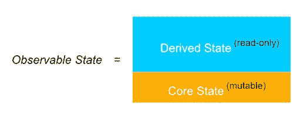
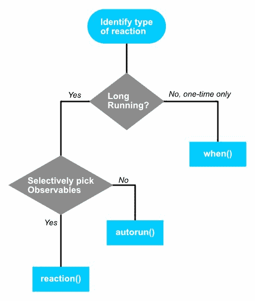

# 五、衍生、作用和反应

既然 MobX 的基础已经建立在*可观察物*、*动作*和*反应*这三大支柱上，现在是我们深入了解更精细方面的时候了。在本章中，我们将探讨 mobxapi 的核心理念和细微差别，以及一些用于简化 MobX 中异步编程的特殊 API

本章涵盖的主题包括：

*   计算属性（也称为派生）及其各种选项
*   操作，特别关注异步操作
*   反应和控制 MobX 反应的规则

# 技术要求

您需要在系统上安装 Node.js。最后，要使用本书的 Git 存储库，用户需要安装 Git。

本章代码文件可在 GitHub 上找到：
[https://github.com/PacktPublishing/MobX-Quick-Start-Guide/tree/master/src/Chapter05](https://github.com/PacktPublishing/MobX-Quick-Start-Guide/tree/master/src/Chapter05)

查看以下视频以查看代码的运行：
[http://bit.ly/2mAvXk9](http://bit.ly/2mAvXk9)

# 派生（计算属性）

*派生*是一个在 MobX 术语中非常常用的术语。它在客户机状态建模中得到了特别的重视。正如我们在前一章中看到的，可观察状态可以通过*核心可变状态*和*派生的只读状态*的组合来确定：

*Observable State = (Core-mutable-State) + (Derived-readonly-State)*

保持核心状态尽可能精简是至关重要的。在应用的生命周期中，这部分将保持稳定并缓慢增长。实际上只有核心状态是可变的，*动作*总是只变异*核心状态*。衍生状态取决于堆芯状态，并由 MobX 反应性系统保持最新状态。我们知道，在 MobX 中，*计算属性*充当派生状态。它们不仅可以依赖于*核心状态*，还可以依赖于其他派生状态，从而创建一个由 MobX 保持活动状态的依赖树：



派生状态的一个关键特征是它是*只读*。它的任务是生成一个*计算值*（使用*核心状态*，但绝不会对*核心状态*进行变异。MobX 可以智能地缓存这些计算值，而不执行任何不必要的计算。当没有观察到*计算值*时，它也会进行有效的清理。强烈建议尽可能利用计算属性，而不要担心性能影响。

让我们举一个例子，其中可以有一个最小的核心状态和一个派生状态来满足 UI 需求。考虑一下谦卑的胡言，以及对它的理解。你大概可以猜到这些类是做什么的。它们构成*Todos*应用的可观察状态：

```jsx
import { computed, decorate, observable, autorun, action } from 'mobx';

class Todo {
    @observable title = '';
    @observable done = false;

    constructor(title) {
        this.title = title;
    }
}

class TodoList {
    @observable.shallow todos = [];

    @computed
    get pendingTodos() {
        return this.todos.filter(x => x.done === false);
    }

    @computed
    get completedTodos() {
        return this.todos.filter(x => x.done);
    }

 @computed
    get pendingTodosDescription() {
        const count = this.pendingTodos.length;
        return `${count} ${count === 1 ? 'todo' : 'todos'} remaining`;
    }

    @action
    addTodo(title) {
        const todo = new Todo(title);
        this.todos.push(todo);
    }
}

class TodoManager {
    list = null;

    @observable filter = 'all'; // all, pending, completed
    @observable title = ''; // user-editable title when creating a new 
    todo

    constructor(list) {
        this.list = list;

        autorun(() => {
            console.log(this.list.pendingTodos.length);
        });
    }

    @computed
    get visibleTodos() {
        switch (this.filter) {
            case 'pending':
                return this.list.pendingTodos;
            case 'completed':
                return this.list.completedTodos;
            default:
                return this.list.todos;
        }
    }
}
```

从前面的代码中可以看到，核心状态由标记为`@observable`的属性定义。它们是这些类的可变属性。对于*Todos*应用，核心状态主要是`Todo`项列表。

派生状态主要是为了满足用户界面的过滤需求，包括标记为`@computed`的属性。特别有趣的是`TodoList`类，它只有一个`@observable`：一个`todos`数组。Rest 是由`pendingTodos`、`pendingTodosDescription`和`completedTodos`组成的派生状态，均以`@computed`标记。

通过保持精简的核心状态，我们可以根据 UI 的需要生成派生状态的许多变体。这种派生状态也有助于保持语义模型干净和简单。这也让您有机会*强制执行域*的词汇表，而不是直接公开原始核心状态。

# 这是副作用吗？

在[第一章](1.html#LTSU0-58c2559ca4304cecab9bc46f496bc070)*状态管理导论*中，我们谈到了副作用的作用。这些是应用的反应性方面，根据状态变化（也称为数据）产生*外部效应*。如果我们现在从副作用的角度来看*计算属性*，你会发现它与 MobX 中的反应非常相似。毕竟，MobX 中的反应关注可观察到的东西并产生副作用。这也是计算属性所做的！它依赖于可观测值，并产生一个可观测值作为副作用。那么，*计算属性*不应该被视为副作用吗？

这确实是一个很好的论点。从其衍生方式来看，它可能是一种副作用，但它产生*可观察值*的事实将其带回*客户国*的世界，而不是成为一种外部效应。事实上，计算属性是 UI 和其他状态管理方面的数据。与 MobX 的副作用产生功能不同，如`autorun()`、`reaction()`、`when()`，计算属性不会产生任何*外部*副作用，并停留在客户端状态的范围内。

MobX 反应和计算属性之间的另一个明显区别是，存在一种隐含的期望，即*计算属性将返回一个值*，而反应是*激发并忘记*，不期望返回一个值。此外，对于计算属性，只要没有更多的观察者，重新评估（计算属性的*副作用*部分）就可以停止。然而，对于反应，何时停止并不总是很清楚。例如，何时停止日志记录或网络请求并不总是很清楚。

那么，让我们先说一下*计算属性*只是*部分副作用*，而不是 MobX 的完全启动、启动和遗忘反应。

# 还有更多的事情要做（）

到目前为止，我们已经研究了`@computed`装饰器和`@computed.struct`的使用，其中结构平等至关重要。当然，`computed`函数还有更多的功能，它还为细粒度定制提供了多个选项。这些选项在`decorate()`函数、`@computed`装饰器中使用时，或在创建*盒装计算可观测值*时可用

在下面的代码片段中，我们看到了更常见的`decorate()`函数的用法：

```jsx
class TodoList {
    @observable.shallow todos = [];
    get pendingTodos() {
        return this.todos.filter(x => x.done === false);
    }

    get completedTodos() {
        return this.todos.filter(x => x.done);
    }

    @action
    addTodo(title) {
        const todo = new Todo(title);
        this.todos.push(todo);
    }
}

decorate(TodoList, {
 pendingTodos: computed({ name: 'pending-todos', /* other options */ }),
});

```

`computed()`的选项可以作为具有多个属性的*对象参数*传递：

*   `name`：与 MobX DevTools（属于***MobX react DevTools***NPM 包的一部分）结合使用时非常有用。此处指定的名称在日志中使用，也可在自省呈现的 React 组件的*可观测值*时使用。
*   `context`：计算函数内的****这个***的值。通常，您不需要指定，因为它将默认为装饰实例。*
**   `set`：一个*计算属性*最常用作*吸气剂*。但是，你也可以提供一个二传手。这并不是替换计算属性的值，而是充当一个*逆*。考虑下面的例子，其中，用于 Ty1 T1 的 SET 器将其拆分为 AUT2 T2 和 AUT3 T3：*

```jsx
class Contact {
    @observable firstName = '';
    @observable lastName = '';

 get fullName() {
 return `${this.firstName} ${this.lastName}`;
 }

}

decorate(Contact, {
    fullName: computed({
        // extract firstName and lastName
 set: function(value) {
 const [firstName, lastName] = value.split(' ');

 this.firstName = firstName;
 this.last = lastName;
 },
    }),
});
```

要在类内执行同样的操作，不使用`decorate()`，只需添加一个 setter，如以下代码所示：

```jsx
class Contact {
    @observable firstName = '';
    @observable lastName = '';

    @computed
    get fullName() {
        return `${this.firstName} ${this.lastName}`;
    }

 set fullName(value) {
 const [firstName, lastName] = value.split(' ');

 this.firstName = firstName;
 this.lastName = lastName;
 }
}

const c = new Contact();

c.firstName = 'Pavan';
c.lastName = 'Podila';

console.log(c.fullName); // Prints: Pavan Podila

c.fullName = 'Michel Weststrate';
console.log(c.firstName, c.lastName); // Prints: Michel Weststrate
```

*   `keepAlive`：有时，即使没有跟踪观察者，也需要计算出的值始终可用。此选项保持计算值*热*并始终更新。此选项的一个注意事项是，计算值*将始终被缓存*，您可能需要更深入地考虑可能的内存泄漏和昂贵的计算。只有当对象的所有依赖观测值都被垃圾收集时，才可以垃圾收集具有`{ keepAlive: true }`计算属性的对象。因此，请小心使用此选项。
*   `requiresReaction`：这是一项旨在防止*昂贵计算运行频率高于预期*的属性。默认设置为`false`，这意味着即使没有观察者（也称为反应），也会第一次对其进行评估。当设置为`true`时，如果没有观察者，则不会执行计算。相反，它会抛出一个错误，通知您需要一个观察者。可以通过调用`configure({ computedRequiresReaction: Boolean })`来更改全局行为。
*   `equals`：为计算属性设置相等检查器。相等性检查确定是否需要触发通知以通知所有观察者（也称为反应）。我们知道，只有当新计算的*值*与之前缓存的*值*不同时，才会触发通知。默认为`comparer.identity`，进行`===`检查。换句话说，一个值和一个引用检查。另一种相等性检查是使用`comparer.structural`，它对值进行深入比较，以确定它们是否相等。从概念上讲，它类似于`observable.struct`装饰器。这也是用于`computed.struct`装饰器的比较器：

```jsx
import { observable, computed, decorate, comparer } from 'mobx';

class Contact {
    @observable firstName = '';
    @observable lastName = '';

    get fullName() {
        return `${this.firstName} ${this.lastName}`;
    }

}

decorate(Contact, {
    fullName: computed({
        set: function(value) {
            const [firstName, lastName] = value.split(' ');

            this.firstName = firstName;
            this.last = lastName;
        },
 equals: comparer.identity,
    }),

});
```

# 计算机内部的错误处理

计算属性具有从计算期间抛出的错误中恢复的特殊能力。他们没有立即出手，而是抓住并抓住了错误。只有当您尝试读取*计算属性*时，它才会重新显示错误。这使您有机会通过重置某些状态并恢复到某些默认状态来进行恢复。

以下示例直接来自 MobX 文档，并恰当地演示了错误恢复：

```jsx
import { observable, computed } from 'mobx';

const x = observable.box(3);
const y = observable.box(1);

const divided = computed(() => {
    if (y.get() === 0) {
        throw new Error('Division by zero');
    }

    return x.get() / y.get();
});

divided.get(); // returns 3

y.set(0); // OK

try {
    divided.get(); // Throws: Division by zero
        } catch (ex) {
    // Recover to a safe state
 y.set(2);
}

divided.get(); // Recovered; Returns 1.5 
```

# 行动

*操作*是改变应用核心状态的方法。事实上，MobX 强烈建议您始终使用动作，并且不要在动作之外进行任何突变。如果您`configure`MobX 使用：`{ enforceActions: true }`：

```jsx
import { configure } from 'mobx';

configure({ enforceActions: true });
```

让前面几行代码作为您的*MobX 驱动的*React 应用的起点。显然，对所有状态使用操作都有一些好处。但到目前为止，还不是很清楚。让我们深入探讨一下，以发现这些隐藏的好处。

`configure({ enforceActions: true })` isn't the only option available for guarding state-mutation. There is a stricter form with `{ enforceActions: 'strict' }`. The difference is subtle but worth calling out. When set to `true`, you are still allowed to make stray mutations outside of an action, **if** there are *no observers* tracking the mutating observable. This may seem like a slip on the part of MobX. However, it is OK to allow this because there are no side effects happening yet, since there are no observers. It won't cause any harm to the consistency of the MobX reactivity system. It's like the old saying, *If a tree falls in the forest and no one is around, does it make a sound? *Maybe too philosophical, but the gist is: without observers, you have no-one tracking observables and causing side effects, so you can safely apply the mutation.

But, if you do want to go the purist route, you can use `{ enforceActions: 'strict' }` and call foul even in cases where there are no observers. It's really a personal choice here. 

# 为什么要采取行动？

当一个可观察对象发生变化时，MobX 立即发出通知，通知每个观察者该变化。因此，如果您碰巧更改了 10 个观测值，那么将发送 10 个通知。有时，这是过分的。你不希望一个嘈杂的系统过于急切地通知你。最好将通知成批发送，然后一次性发送。它节省了 CPU 周期，让您的移动设备上的电池保持愉快，并且总体上带来了一个平衡、更健康的应用。

这正是`action()`将所有突变都放入其中时所达到的效果。它用 MobX 内部的两个特殊用途的低级实用程序`untracked()`和`transaction()`来包装变异函数。`untracked()`防止在变异函数内跟踪观察对象（也称为创建新的*观察对象*关系）；鉴于`transaction()`对通知进行批处理，对同一个可观察对象强制发送通知，然后在***动作***结束时发送最小的通知集。

还有一个核心的实用功能是动作使用的，即`allowStateChanges(true)`。这确保了状态变化确实发生在可观察对象上，并且它们得到了新的值。*未跟踪*、*交易*和*allowStateChanges*的组合构成了一个动作：

*操作=未跟踪（事务（allowStateChanges（true，<变异函数>））*

这种组合具有以下预期效果：

*   减少过多的通知
*   通过批处理最少的通知集提高效率
*   对于在*动作*中多次变化的观察对象，尽量减少*副作用*的执行

事实上，动作可以相互嵌套，这确保了通知只有在*最外层的动作*完成执行后才会发出

*动作*也有助于展现域的语义，使您的应用变得更具声明性。通过包装观察对象如何变异的细节，您为改变状态的操作提供了一个*不同的名称*。这强调了您所在领域的*词汇*，并将其编码为*状态管理*的一部分。这是对*领域驱动设计*原则的认可，该设计将无处不在的语言（领域术语）引入客户端代码。

*操作*有助于缩小域名词汇表与实际代码中使用的名称之间的差距。除了效率方面的好处外，您还可以获得语义方面的好处，使代码更具可读性。

We saw earlier, in the *Derivations (computed properties)* section, that you can also have setters. These setters are automatically wrapped by an `action()` by MobX. A setter for a computed-property is not really changing the computed-property directly. Instead, it is the inverse that mutates the dependent observables that make up the computed-property. Since we are mutating observables, it makes sense to wrap them in an action. MobX is smart enough to do this for you.

# 异步操作

异步编程在 JavaScript 中非常普遍，MobX 完全接受了这一思想，没有添加太多的仪式。下面是一个小片段，显示了一些散布在 MobX 状态变异中的异步代码：

```jsx
class ShoppingCart {
    @observable asyncState = '';

    @observable.shallow items = [];

    @action
    async submit() {
        this.asyncState = 'pending';
        try {
            const response = await this.purchaseItems(this.items);

            this.asyncState = 'completed'; // modified outside of 
            action
        } catch (ex) {
            console.error(ex);
            this.asyncState = 'failed'; // modified outside of action
        }
    }

    purchaseItems(items) {
        /* ... */
        return Promise.resolve({});
    }
}
```

看起来很正常，就像其他异步代码一样。这正是重点。默认情况下，MobX 只是将其放在一边，让您按照预期改变可观察对象。但是，如果您将 MobX 配置为`{ enforceActions: 'strict' }`，您将在控制台上获得热烈的**红色**欢迎：

```jsx
Unhandled Rejection (Error): [mobx] Since strict-mode is enabled, changing observed observable values outside actions is not allowed. Please wrap the code in an `action` if this change is intended. Tried to modify: ShoppingCart@14.asyncState
```

你可能会问，这里怎么了？这与我们使用`async-await`操作符有关。你看，`await`后面的代码*没有同步执行*。在该`await`承诺兑现后执行*。现在，`action()`装饰器只能保护在其块内同步执行的代码。不考虑异步运行的代码，因此在`action()`之外运行。因此，`await`后面的代码不再是`action`的一部分，导致 MobX 投诉。*

# 使用 runInAction（）进行包装

规避此问题的方法是使用 MobX 提供的实用功能，称为`runInAction()`。这是一个方便的函数，它接受一个*变异函数*并在`action()`中执行。在下面的代码中，您可以看到使用`runInAction()`来包装突变：

```jsx
import { action, observable, configure, runInAction } from 'mobx';

configure({ enforceActions: 'strict' });

class ShoppingCart {
    @observable asyncState = '';

    @observable.shallow items = [];

    @action
    async submit() {
        this.asyncState = 'pending';
        try {
            const response = await this.purchaseItems(this.items);

 runInAction(() => {
 this.asyncState = 'completed';
 });
        } catch (ex) {
            console.error(ex);

 runInAction(() => {
 this.asyncState = 'failed';
 });
        }
    }

    purchaseItems(items) {
        /* ... */
        return Promise.resolve({});
    }
}

const cart = new ShoppingCart();

cart.submit();
```

注意，我们已经将`runInAction()`应用于`await`之后的代码，包括*try 块*和*catch 块*中的代码。

`runInAction(fn)` is just a convenience utility that is equivalent to `action(fn)()`.

尽管*async await*为编写`async`代码提供了漂亮、简洁的语法，但要注意代码中不同步的部分。代码在`action()`块中的同一位置可能会产生误导。在运行时，并非所有语句都同步执行。在*等待的承诺*实现后，`await`后面的代码始终运行`async`。用`runInAction()`包装`async`的部件，让我们回归`action()`装饰的优点。现在，当您配置`({ enforceActions: 'strict' })`时，MobX 不再有任何抱怨。

# 流量（）

在前面的简单示例中，我们只需将两段代码包装在`runInAction()`中。这很简单，不需要太多的努力。但是，在某些情况下，一个函数中会有多个`await`语句。考虑下面所示的 AuthT2A.方法，该方法执行涉及多个 T3 T3 的操作，等待 OLE T4。

```jsx
import { observable, action } from 'mobx';

class AuthStore {
    @observable loginState = '';

    @action.bound
    async login(username, password) {
        this.loginState = 'pending';

        await this.initializeEnvironment();

        this.loginState = 'initialized';

        await this.serverLogin(username, password);

        this.loginState = 'completed';

        await this.sendAnalytics();

        this.loginState = 'reported';
    }

    async initializeEnvironment() {}

    async serverLogin(username, password) {}

    async sendAnalytics() {}
}
```

在每个`await`之后将状态突变包装在`runInAction()`中可能会很快变得麻烦。如果涉及更多的条件，或者如果突变分布在多个函数中，甚至可以忘记包装某些部分。如果有一种方法可以自动将代码的异步部分包装到`action()`中呢？

MobX 也为这个用例提供了一个解决方案。有一个名为`flow()`的实用函数，它将*发电机功能*作为输入。您可以使用`yield`操作符代替`await`。在概念上，它与*异步等待*类代码非常相似，但使用*生成器函数*和`yield`语句来实现相同的效果。让我们使用`flow()`实用程序重写上一个示例中的代码：

```jsx
import { observable, action, flow, configure } from 'mobx';

configure({ enforceActions: 'strict' });

class AuthStore {
    @observable loginState = '';

    login = flow(function*(username, password) {
        this.loginState = 'pending';

        yield this.initializeEnvironment();

        this.loginState = 'initialized';

        yield this.serverLogin(username, password);

        this.loginState = 'completed';

        yield this.sendAnalytics();

        this.loginState = 'reported';

        yield this.delay(3000);
    });

}

new AuthStore().login();
```

注意使用了生成器`function*()`而不是正则函数，正则函数作为参数传递给`flow()`。在结构上，它与*异步等待*风格的代码没有什么不同，但它还有一个额外的好处，即自动将`yield`后面的代码部分包装为`action()`。有了`flow()`，您的异步代码又变得更具声明性了。

`flow()`给你带来了另一个好处。可以*取消异步代码*的执行。

`flow()`的返回值是一个可以调用以执行异步代码的函数。这是上例中`AuthStore`的`login`方法。当您拨打`new AuthStore().login()`时，您会得到一个通过`cancel()`方法得到 MobX 增强的承诺：

```jsx
const promise = new AuthStore().login2();
promise.cancel(); // prematurely cancel the async code
```

这对于通过提供用户级控制来取消长时间运行的操作非常有用。

# 反应

观察和行动使事物处于 MobX 反应系统的范围内。动作改变了可观察的事物，通过通知的力量，MobX 系统的其余部分与变化保持一致，以保持状态的一致性。要开始在 MobX 系统之外进行更改，您需要*反应*。它是通向外部世界的桥梁，通知 MobX 世界内发生的*状态变化*

将反应视为在 MOBX 和外界之间的反应性桥接。这些也是应用的副作用产生者。

我们知道反应有三种味道：`autorun`、`reaction`和`when`。这三种风格具有不同的特点，可以应对应用中的各种场景。

在决定选择哪一个时，您可以应用以下简单的决策过程：



每个反应都会返回一个*处理程序功能*，可用于提前处理反应，因此：

```jsx
import { autorun, reaction, when } from 'mobx';

const disposer1 = autorun(() => {
    /* effect function */
});

const disposer2 = reaction(
    () => {
        /* tracking function returning data */
    },
    data => {
        /* effect function */
    },
);

const disposer3 = when(
    () => {
        /* predicate function */
    },
    predicate => {
        /* effect function */
    },
);

// Dispose pre-maturely
disposer1();
disposer2();
disposer3();
```

回到决策树上的上图，我们现在可以定义*长时间运行*意味着什么：反应在第一次执行后不会自动处理。在使用*处理器功能*明确处理之前，它将继续存在。`autorun()`和`reaction()`属于长期运行反应，而`when()`仅为一次性反应。请注意，`when()`还返回了一个*处理器功能*，可以提前取消`when()`效应。然而，*一次性*行为意味着在效果执行后，`when()`将自动处理自身，无需任何清理。

决策树中包含的第二个定义特征是关于*选择要跟踪的观察对象*。这是*效果功能*执行的保护条件。`reaction()`和`when()`有能力决定哪些观察值用于跟踪，而`autorun()`在其*效应函数*中隐式选择所有观察值。在`reaction()`的情况下，它是*跟踪函数*，在`when()`的情况下，它是*谓词函数*。这些函数预计会产生一个值，当值发生变化时，执行*效果函数*

The *selector-function* of `reaction()` and `when()` is where the observable tracking happens. The *effect-function* is only for causing side effects with no tracking. `autorun()` implicitly combines the *selector-function* and the *effect-function* into just one function.

使用决策树，您可以在应用中对不同的*副作用*进行分类。在[第 6 章](6.html#30A8Q0-58c2559ca4304cecab9bc46f496bc070)中*处理真实世界用例*中，我们将看到各种各样的例子，这些例子将使选择过程更加自然。

# 配置自动运行（）和反应（）

`autorun()`和`reaction()`都提供了一个额外的参数来定制更多的行为。让我们看看可以作为选项传递的最常见属性。

# 自动运行（）的选项

`autorun()`的第二个参数是一个带有*选项*的对象：

```jsx
autorun(() => { /* side effects */}, options)
```

它具有以下属性：

*   `name`：这对于调试非常有用，尤其是在 MobX DevTools 的上下文中，`name`打印在日志中。该名称还与 MobX 提供的`spy()`实用功能一起使用。这两个方面将在后面的章节中介绍。
*   `delay`：这对频繁变化的观测值起到了去噪作用。*效果函数*将等待`delay`时间段（以毫秒为单位指定），然后重新执行。在下一个示例中，我们希望注意不要对`profile.couponsUsed`的每一次更改都发出网络请求。一个简单的防护是使用`delay`选项：

```jsx
import { autorun } from 'mobx';

const profile = observable({
    name: 'Pavan Podila',
    id: 123,
    couponsUsed: 3,
});

function sendCouponTrackingAnalytics(id, couponsUsed) {
    /* Make network request */
}

autorun(
    () => {
        sendCouponTrackingAnalytics(profile.id, profile.couponsUsed);
    },
    { delay: 1000 },
);
```

*   `onError`：通过提供`onError`处理程序，可以安全处理*效果函数*执行过程中抛出的错误。该错误作为输入提供给`onError`处理程序，该处理程序可用于恢复，并防止*效果函数*后续运行的异常状态。请注意，通过提供此处理程序，MobX 即使在发生错误后也会继续跟踪。这将保持系统运行，并允许其他可能无关的预定*副作用*按预期运行。
    在下面的示例中，我们有一个`onError`处理程序，处理优惠券数量大于两个的情况。提供该处理器可使`autorun()`保持运行，而不会干扰 MobX 反应系统的其余部分。我们还将取消多余的优惠券，以防止这种情况再次发生：

```jsx
autorun(
    () => {
        if (profile.couponsUsed > 2) {
            throw new Error('No more than 2 Coupons allowed');
        }
    },
    {
        onError(ex) {
            console.error(ex);
            removeExcessCoupons(profile.id);
        },
    },
);

function removeExcessCoupons(id) {}
```

# 反应选项（）

与`autorun()`类似，我们可以向`reaction()`传递一个额外的参数，该参数包含*选项*：

`*reaction(() => {/* tracking data */}, (data) => { /* side effects */}, options)*`

如下所示，一些选项与*自动运行*完全相同，保持一致：

*   `name`
*   `delay`
*   `onError`

但是，还有其他选项，特别是对于`reaction()`：

*   `fireImmediately`：布尔值，表示第一次调用*跟踪功能*后是否立即触发*效果功能*。请注意，这种行为使我们更接近`autorun()`，它也会立即运行。默认设置为`false`。
*   `equals`：注意`reaction()`中的*跟踪功能*返回`data`，用于与之前生成的值进行比较。对于原始值，基于值的默认*相等比较*（`comparer.default`）效果良好。但是，您可以自由提供结构比较器（`comparer.structural`，以确保执行更深入的比较。相等性检查很重要，因为只有当值（由*跟踪函数*产生）不同时，才会调用*效果函数*。

# MobX 什么时候反应？

MobX 反应系统从跟踪或观察*可观察物*开始。这是建立反应性图的一个重要方面，因此跟踪正确的观测值是关键。通过遵循一组简单的规则，您可以保证跟踪过程的结果，并确保您的反应正确。

我们将使用术语*跟踪功能*来表示以下任一项：

*   该函数已传递到`autorun()`。该函数中使用的观测值由 MobX 跟踪。
*   `reaction()`或`when()`的*选择器功能*（第一个参数）。它所使用的可观察物被跟踪。
*   *观察者*的`render()`方法-反应成分。跟踪`render()`方法执行过程中使用的观察值。

# 规则

对于以下每一条规则，我们将看一个实施规则的示例：

*   在执行跟踪功能期间，始终取消对观测值的引用。取消引用是建立 MobX 跟踪器的关键。

```jsx
const item = observable({
    name: 'Laptop',
    price: 999,
    quantity: 1,
});

autorun(() => {
 showInfo(item);
});

item.price = 1050;
```

在前面的代码段中，`autorun()`不会再次被调用，因为没有可观察的属性被取消引用。为了使 MobX 对变化做出反应，需要在*跟踪功能*中读取可观察的属性。一种可能的修复方法是读取`autorun()`中的`item.price`，只要`item.price`发生变化，它就会重新触发：

```jsx
autorun(() => {
    showInfo(item.price);
});
```

*   跟踪只发生在跟踪函数的同步执行代码中：
    *   观测值应该直接在跟踪函数中访问，而不是在内部的异步函数中访问。
    *   在下面的代码中，MobX 永远不会对`item.quantity`中的更改做出反应。虽然我们在`autorun()`内解除对可观察物的引用，但这并不是同步进行的。因此，MobX 永远不会重新执行`autorun()`：

```jsx
autorun(() => {
 setTimeout(() => {
        if (item.quantity > 10) {
            item.price = 899;
        }
    }, 500);
});

item.quantity = 24;
```

要修复，我们可以将代码从`setTimeout()`中拉出，并将其直接放在`autorun()`中。如果使用`setTimeout()`是为了增加一些延迟执行，我们可以使用`autorun()`的`delay`选项来实现。以下代码显示修复程序：

```jsx
autorun(
    () => {
        if (item.quantity > 10) {
            item.price = 899;
        }
    },
 { delay: 500 },
);
```

*   仅跟踪已存在的可观察对象：
    *   在下面的示例中，我们正在解引用一个可观察的（计算属性），该属性在`autorun()`执行时不存在于`item`上。因此，MobX 从不跟踪它。在后面的代码中，我们正在更改`item.quantity`，导致`item.description`发生更改，但`autorun()`仍然没有执行：

```jsx
autorun(() => {
    console.log(`Item Description: ${item.description}`);
});

extendObservable(item, {
    get description() {
        return `Only ${item.quantity} left at $${item.price}`;
    },
});

item.quantity = 10;
```

一个简单的解决方法是确保在`autorun()`执行之前，可观察到的对象确实存在。通过更改语句的顺序，我们可以获得所需的行为，如下面的代码段所示。实际上，您应该预先声明所需的所有属性。这有助于 MobX 在需要时正确跟踪属性，有助于类型检查器（例如，TypeScript）确保使用正确的属性，并向代码读者清楚地表达意图：

```jsx
extendObservable(item, {
 get description() {
 return `Only ${item.quantity} left at $${item.price}`;
 },
});

autorun(() => {
    console.log(`Item Description: ${item.description}`);
});

item.quantity = 10;
```

In the snippet* before the fix*, if we had also read the `item.quantity` in `autorun()`, then this *tracking-function* would re-execute on changes to `item.quantity`. That happens as the observable property exists at the time the `autorun()` executes for the first time. The second time `autorun()` executes (due to change in `item.quantity`), `item.description` would also be available and MobX can start tracking that as well.

*   上述规则的一个例外是可观察地图，其中还跟踪动态关键点：

```jsx
const twitterUrls = observable.map({
    John: 'twitter.com/johnny',
});

autorun(() => {
    console.log(twitterUrls.get('Sara'));
});

twitterUrls.set('Sara', 'twitter.com/horsejs');
```

在前面的代码片段中，`autorun()`将重新执行，因为`twitterUrls`是一个`observable.map`，它跟踪新密钥的添加。因此，即使在`autorun()`执行时密钥`Sara`不存在，仍会对其进行跟踪。

In MobX 5, it can track *not-yet-existing* properties for all objects created using the `observable()` API.

# 总结

MobX 应用的心智模型旨在思考*可观察状态*。这本身被分为*最小核心状态*和*派生状态*。派生是我们如何处理核心状态在 UI 上的各种投影，以及我们需要执行特定于域的操作的位置。在添加更多核心状态之前，请考虑是否可以将其作为派生状态转入。只有在不可能的情况下，才应该引入新的核心状态。

我们看到*异步动作*与常规*动作*非常相似，没有太多仪式。唯一需要注意的是，当您将 MobX 配置为`enforceActions`时。在这种情况下，您必须将*状态突变*包装在`runInAction()`内的异步代码中。当动作中有多个异步部分时，**`flow()`**是更好的选择。它使用一个生成器函数（由`function*(){ }`表示），该函数穿插有`yield`到各种基于*承诺的*调用。

`reaction()`和`autorun()`提供了额外的选项来控制他们的行为。它们共享大多数选项，例如*名称*、*延迟*和*错误*。`reaction()`还有两个选项：控制如何对*跟踪功能*（`equals`生成的数据进行比较，以及*跟踪功能*（`fireImmediately`第一次运行后是否立即触发*效果功能*。

在[第 6 章](6.html#30A8Q0-58c2559ca4304cecab9bc46f496bc070)*处理现实世界用例*中，我们可以开始探索使用 MobX 处理各种常见场景的方法。如果到目前为止的章节看起来像是*科学*，那么下一个章节就是*应用科学*！*