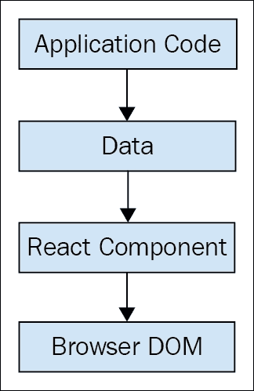
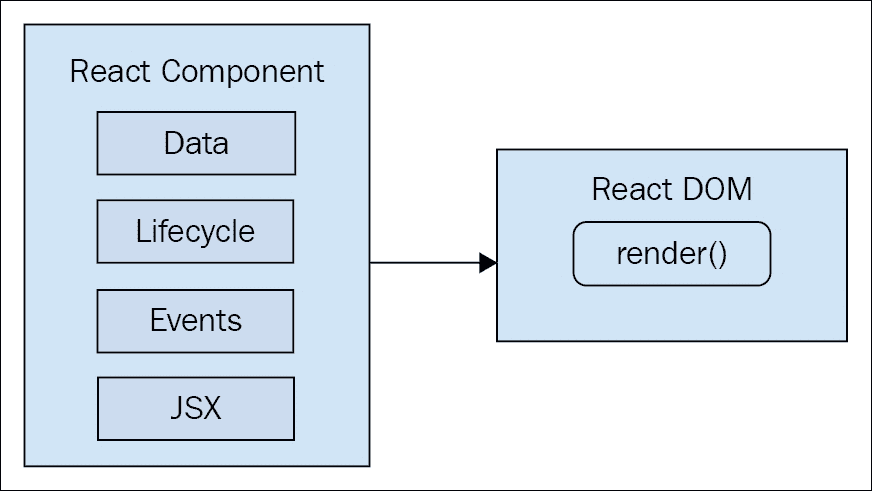
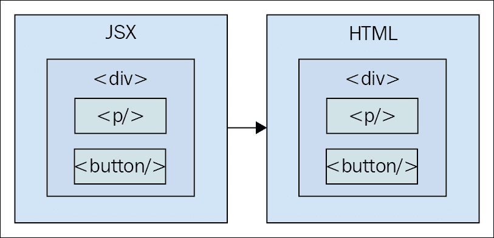
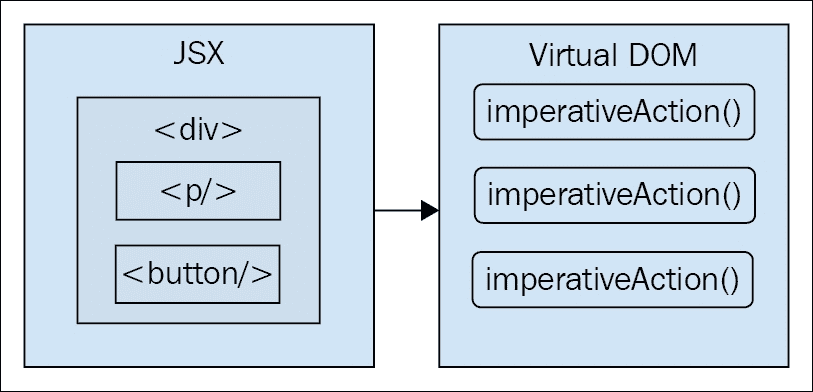

# 一、为什么是 React？

如果你正在读这本书，你可能已经对 React 有了一些概念。你也可能听过一两个 React 的成功故事。如果没有，不要担心。在这一章的开头，我会尽我最大的努力让你不必再阅读更多的营销文献。然而，这是一本很大的书，内容很多，所以我觉得确定基调是适当的第一步。是的，目标是学习 React 和 React Native。但是，这也是为了建立一个持久的体系结构，它可以处理我们今天和将来想要用 React 构建的所有东西。

本章首先简要说明 React 存在的原因。然后，我们将讨论使 React 成为一种吸引人的技术的简单性，以及 React 如何能够处理 web 开发人员面临的许多典型性能问题。最后，我们将介绍 React 的声明性哲学以及 React 程序员可以使用的抽象级别。

走吧！

# 什么是 React？

我认为 React 在其主页（[上的一行描述 https://facebook.github.io/react](https://facebook.github.io/react) 非常精彩：

*用于构建用户界面的 JavaScript 库。*

这是一个用于构建用户界面的库。这是完美的，因为事实证明，这是我们大多数时候想要的。我认为这个描述最好的地方是它遗漏了一切。它不是一个大型框架。它不是一个能够处理从数据库到通过 web 套接字连接进行实时更新的所有内容的完整堆栈解决方案。实际上，我们并不想要这些预打包的解决方案中的大多数，因为最终，它们通常会导致比它们解决的问题更多的问题。Facebook 确实听了我们的心声。

## React 只是一种看法

React 通常被认为是应用中的*视图*层。您过去可能使用过 Handlebar 或 jQuery 之类的库。就像 jQuery 操纵 UI 元素，或者将把手模板插入页面一样，React 组件会改变用户看到的内容。下图说明了 React 在我们前端代码中的位置：

这就是对核心概念的 React。当然，在我们阅读这本书的过程中，这个主题会有微妙的变化，但流程大致相同。我们有一些生成数据的应用逻辑。我们希望将这些数据呈现给 UI，因此我们将其传递给 React 组件，该组件处理将 HTML 放入页面的任务。

您可能想知道这有什么大不了的，特别是在表面上，React 似乎是另一种渲染技术。在本章的其余部分中，我们将讨论 React 可以简化应用开发的一些关键领域。

### 注

别担心；我们的介绍差不多讲完了。令人敬畏的代码示例即将问世！

# 简单是好的

React 没有很多活动部件需要学习和理解。在内部，有很多事情在进行，我们将在书中各处讨论这些事情。使用小型 API 的好处是，您可以花更多的时间熟悉它、试验它，等等。大型框架的情况正好相反，您所有的时间都花在弄清楚一切是如何工作的。下图大致介绍了使用 React 编程时必须考虑的 API：

React 分为两个主要 API。首先是 React DOM。这是用于在网页上执行实际呈现的 API。其次，是 React 组件 API。这些是页面中实际由 React DOM 呈现的部分。在 React 组件中，我们需要考虑以下方面：

*   **数据**：这是来自某处的数据（组件不在乎在哪里），由组件呈现
*   **生命周期**：这些是我们实现的方法，用于响应组件生命周期中的变化。例如，组件即将被渲染
*   **事件**：这是我们为响应用户交互而编写的代码
*   **JSX**：这是用来描述 UI 结构的 React 组件的语法

现在还不要关注 React API 的这些不同区域代表什么。这里的要点是，React 本质上是简单的。只要看看有多少是要弄清楚！这意味着我们不必花太多时间在这里查看 API 细节。相反，一旦你掌握了基本知识，我们就可以花更多的时间在细微的 React 使用模式上。

# 声明式 UI 结构

React 新手很难接受组件将标记与 JavaScript 混合在一起的想法。如果你看过 React 的例子，也有同样的不良 React，别担心。起初，我们都对这种方法持怀疑态度，我认为原因是几十年来我们一直受到**关注点分离**原则的制约。现在，每当我们看到事情混合在一起，我们就会自动地认为这是不好的，不应该发生。

React 组件使用的语法称为**JSX**（**JavaScript XML**。这个想法其实很简单。组件通过返回一些 JSX 来呈现内容。JSX 本身通常是 HTML 标记，与 React 组件的自定义标记混合在一起。具体细节在这一点上并不重要；我们将在接下来的章节中详细介绍。这里绝对具有突破性的是，我们不必执行微小的微操作来更改组件的内容。

例如，考虑使用 jQuery 之类的工具来构建应用。您有一个包含某些内容的页面，并且您希望在单击按钮时向段落添加一个类。执行这些步骤很容易，但挑战在于，根本就没有要执行的步骤。这就是所谓的**命令式编程**，这对于 UI 开发来说是个问题。虽然这个为响应事件而更改元素类的示例很简单，但实际应用往往涉及三到四个以上的步骤来实现某些事情。

React 组件不需要以强制方式执行步骤来呈现内容。这就是为什么 JSX 对组件的 React 如此重要。XML 风格的语法使得描述 UI 应该是什么样子变得很容易。也就是说，这个组件将呈现哪些 HTML 元素？这被称为**声明性编程**，非常适合 UI 开发。

# 时间和数据

另一个让 React 新手难以理解的领域是，JSX 就像一个静态字符串，表示渲染输出的一大块。我们应该继续渲染相同的视图吗？这是时间和数据发挥作用的地方。React 组件依赖于传递给它们的数据。此数据表示 UI 的动态方面。例如，基于布尔值呈现的 UI 元素在下次呈现组件时可能会发生更改。这是一个想法的例子：

每次呈现 React 组件时，就好像在某个时刻拍摄 JSX 的快照一样。随着我们的应用随着时间的推移向前移动，我们有一个有序的呈现用户界面组件集合。除了声明性地描述 UI 应该是什么之外，重新呈现相同的 JSX 内容对开发人员来说更容易。挑战在于确保 React 能够处理此方法的性能需求。

# 绩效事项

使用 React 构建用户界面意味着我们可以用 JSX 声明 UI 的结构。与逐块组装 UI 的命令式方法相比，这种方法不太容易出错。然而，声明式方法确实给我们带来了一个挑战：**性能**。

例如，具有声明性 UI 结构对于初始呈现来说很好，因为页面上还没有任何内容。因此，React 渲染器可以查看 JSX 中声明的结构，并将其渲染到浏览器 DOM 中。下图对此进行了说明：

在初始渲染时，React 组件及其 JSX 与其他模板库没有什么不同。例如，Handlebar 将模板作为字符串呈现为 HTML 标记，然后将其插入浏览器 DOM 中。React 与 handlebar 之类的库不同之处在于，当数据发生更改时，我们需要重新渲染组件。Handlebar 将重新生成整个 HTML 字符串，与初始渲染时的方式相同。因为这对性能是有问题的，所以我们通常会实现命令式的变通方法，手动更新 DOM 的一小部分。我们最终得到的是一堆杂乱无章的声明性模板和处理 UI 动态方面的命令式代码。

我们不做这种 React。这就是 React 与其他视图库的区别所在。组件在初始渲染时是声明性的，即使在渲染时也是如此。正是 React 在幕后所做的工作使得重新呈现声明性 UI 结构成为可能。

React 有一种称为**虚拟 DOM**的东西，用于在内存中保存真实 DOM 元素的表示。这样，每次我们重新呈现组件时，它都可以将新内容与页面上已经显示的内容进行比较。基于这种差异，虚拟 DOM 可以执行进行更改所需的必要步骤。因此，我们不仅可以在需要更新 UI 时保留声明性代码，React 还可以确保以高性能的方式完成。以下是此过程的外观：

### 注

当你阅读 React 时，你会经常看到像**diffing**和**patching**这样的词。差异化意味着将旧内容与新内容进行比较，找出发生了什么变化。修补意味着执行必要的 DOM 操作来呈现新内容。

# 正确的抽象层次

在深入研究 React 代码之前，我想在高层讨论的最后一个主题是**抽象**。React 没有太多的功能，但是 React 实现的抽象对它的成功至关重要。

在上一节中，您看到了 JSX 语法如何转换为我们不想维护的低级操作。查看 React 如何转换声明性 UI 组件的更重要的方法是，我们不一定关心呈现目标是什么。渲染目标恰好是带有 React 的浏览器 DOM。但是，这种情况正在改变。

本书的主题是 React 有潜力用于我们想要在任何可能的设备上创建的任何用户界面。我们在 React Native 中才刚刚开始看到这一点，但可能性是无穷的。当 React Toast 成为一件事时，我个人不会感到惊讶，目标是能够将 JSX 渲染输出烧焦到面包上的烤面包机。React 的抽象级别处于正确的级别，并且位于正确的位置。

下图向您展示了 React 如何将目标锁定在浏览器之外：

从左到右，我们有 React Web（只是简单的 React）、React Native、React Desktop 和 React Toast。如您所见，要针对新事物，同样的模式也适用：

*   实现特定于目标的组件
*   实施 React 渲染器，该渲染器可以在引擎盖下执行特定于平台的操作
*   利润

这显然是对任何给定 React 环境的实际实现的过分简化。但细节对我们来说并不重要。重要的是，我们可以利用我们的 React 知识，专注于描述任何平台上的用户界面结构。

### 注

不幸的是，烤面包可能永远不会成为一件事。

# 总结

在本章中，我们向您介绍了高级别的 React。React 是一个库，带有一个小 API，用于构建用户界面。接下来，向您介绍了 React 的一些关键概念。首先，我们讨论了 React 很简单，因为它没有很多运动部件。接下来，我们研究了 React 组件和 JSX 的声明性本质。然后，您了解到 React 非常重视性能，这就是我们如何编写可以反复重新呈现的声明性代码的方法。最后，我们考虑了渲染目标的概念，以及 React 如何轻松成为所有目标的 UI 工具。

对我来说，这些介绍性和概念性的东西已经足够了。在我们接近本书结尾的时候，我们将重新审视这些想法，因为它们是重要的战略智慧。现在，让我们后退一步，从 JSX 开始，把基础知识钉住。