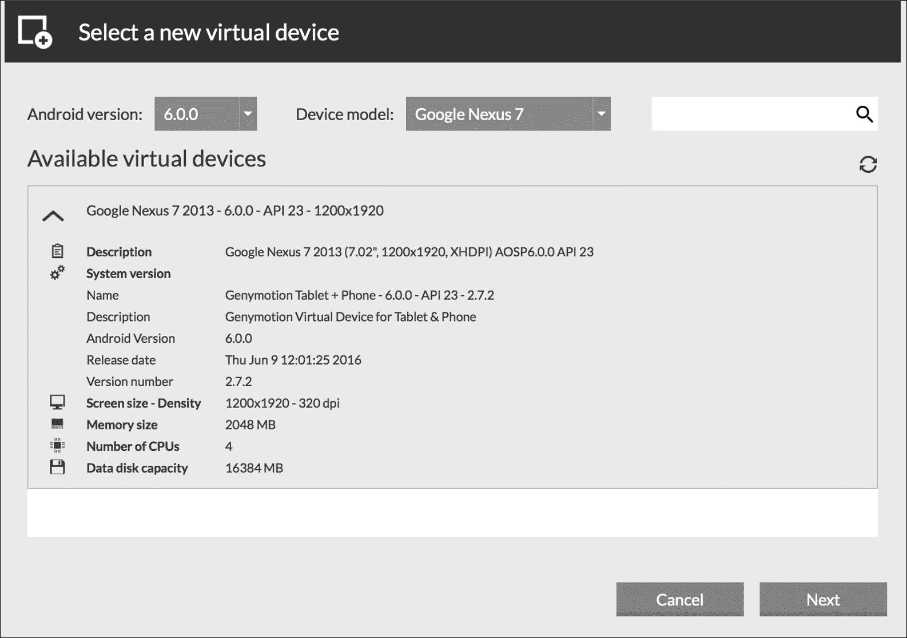
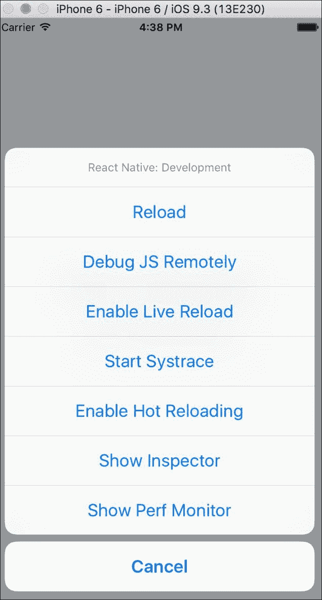

# 十三、启动本机项目

在本章中，您将使用 React Native 启动并运行。谢天谢地，关于创建新项目的许多样板文件都是由 React 本地命令行工具为我们处理的。我将解释在初始化空项目时实际为您创建了什么。然后，我将向您展示如何在 iOS 和 Android 模拟器上运行该项目。

# 使用 React 本机命令行工具

在本节中，我们将安装`react-native-cli`工具并使用它创建一个空的 React 本机项目。好吧，创建的项目并不是完全空的：它实现了一个基本屏幕，因此您可以验证所有功能是否正常工作。从技术上讲，您不需要`react-native-cli`来运行 React 原生项目，但我强烈建议您使用它。

因此，无需进一步 ado，打开命令行终端并运行以下命令：

```jsx
npm install react-native-cli -g

```

这将在您的系统上安装`react-native`命令。此命令用于启动新项目。切换到您希望保留 React 本机项目的目录，并运行以下程序（本书的代码包已包含此项目的文件，以防您想跳过此步骤）：

```jsx
react-native init MyProject

```

这将创建一个新的`MyProject`目录，其中包含多个文件和目录。让我们来看看增加了什么。首先，我们将浏览`MyProject`根目录下的文件：

*   `package.json`：典型的 npm 包定义。它将`react`和`react-native`列为依赖项
*   `index.android.js`：构建 Android 应用时`react-native`使用的入口点
*   `index.ios.js`：构建 iOS 应用时`react-native`使用的入口点

这里还有其他几个配置文件，但我们不必担心这些，因为它们与构建相关，可能不需要我们修改。现在让我们看看在`MyProject`根目录下创建的目录：

*   `android`：用于构建 Android 应用的项目文件
*   `ios`：用于构建 iOS 应用的项目文件
*   `node_modules`：`react-native`包及其所有依赖项

`node_modules`目录不是很有趣，因为您可能已经在几乎任何其他 JavaScript 项目中多次看到过它。然而，`android`和`ios`目录构成了各自 Android 和 iOS 本地应用的核心。

如果你在这两个目录中随便翻找，你会发现它们看起来像是你典型的 Android 或 iOS 项目，只是没有太多。原因是这些应用的大部分代码都是在 React 组件中实现的。这段代码的主要工作是建立一个 shell 应用，它可以在其中嵌入 JavaScriptCore 运行时和用于编写本机平台组件脚本的机制。

例如，以下是 Android 的主要应用文件：

```jsx
package com.myproject; 

import android.app.Application; 
import android.util.Log; 

import com.facebook.react.ReactApplication; 
import com.facebook.react.ReactInstanceManager; 
import com.facebook.react.ReactNativeHost; 
import com.facebook.react.ReactPackage; 
import com.facebook.react.shell.MainReactPackage; 

import java.util.Arrays; 
import java.util.List; 

public class MainApplication extends Application implements ReactApplication { 

  private final ReactNativeHost mReactNativeHost = new ReactNativeHost(this) { 
    @Override 
    protected boolean getUseDeveloperSupport() { 
      return BuildConfig.DEBUG; 
    } 

    @Override 
    protected List<ReactPackage> getPackages() { 
      return Arrays.<ReactPackage>asList( 
          new MainReactPackage() 
      ); 
} 
  }; 

  @Override 
  public ReactNativeHost getReactNativeHost() { 
      return mReactNativeHost; 
  } 
} 

```

这段代码使用 Facebook 的 Java 模块来引入我们的 React 本机组件。当我们的组件发生变化时，这个来源根本不会改变。您实现的 React 本机组件将消息传递到平台，以检测本机组件。

现在让我们来看看 Apple T0 的内容：

```jsx
/** 
 * Sample React Native App 
 * https://github.com/facebook/react-native 
 * @flow 
 */ 

import React, { Component } from 'react'; 
import { 
  AppRegistry, 
  StyleSheet, 
  Text, 
  View 
} from 'react-native'; 

class MyProject extends Component { 
  render() { 
    return ( 
      <View style={styles.container}> 
        <Text style={styles.welcome}> 
          Welcome to React Native! 
        </Text> 
        <Text style={styles.instructions}> 
          To get started, edit index.android.js 
        </Text> 
        <Text style={styles.instructions}> 
          Shake or press menu button for dev menu 
        </Text> 
      </View> 
    ); 
  } 
} 

const styles = StyleSheet.create({ 
  container: { 
    flex: 1, 
    justifyContent: 'center', 
    alignItems: 'center', 
    backgroundColor: '#F5FCFF', 
  }, 
  welcome: { 
    fontSize: 20, 
    textAlign: 'center', 
    margin: 10, 
  }, 
  instructions: { 
    textAlign: 'center', 
    color: '#333333', 
    marginBottom: 5, 
  }, 
}); 

AppRegistry.registerComponent( 
  'MyProject', 
  () => MyProject 
); 

```

这里使用了几个 React 本地组件：现在还不必关心它们如何工作的细节。该文件是作为项目初始化过程的一部分为我们创建的。它被创建为一个起点，以便您可以运行项目并确保所有设置都正确。

现在，如果打开`index.ios.js`文件，它看起来与`index.android.js`几乎相同。唯一的区别在于文本内容；应用的实际结构完全相同。这是因为应用使用的组件在 iOS 和 Android 上的工作方式都是相同的。当应用生成时，React Native 会根据生成目标知道要使用这些文件中的哪一个。

### 注

在实现这个示例时，我看到了奇怪的 JavaScript 错误。这是一个干净的项目，我甚至还没有触及生成的示例。我一辈子都搞不清楚发生了什么事。在谷歌搜索了一段时间后，我意识到父目录中的`.babelrc`文件正在被使用，并且它的设置与 React Native 不兼容。因此，我添加了新的`MyProject/.babelrc`文件，其中的设置有效。开发人员必须花费时间的事情。

# iOS 和 Android 模拟器

使用 React Native 开发 iOS 和 Android 应用的大部分时间将花在模拟器上。模拟器是一种虚拟机，它在桌面上运行要测试应用的移动操作系统。如果您必须验证您想要针对的实际硬件上的每一个更改，那么实现它既非常耗时，又非常昂贵。在本节中，我们将为您设置 iOS 和 Android 模拟器。

## Xcode

如果您尚未安装 Xcode，可以从应用商店或[免费下载并安装 https://developer.apple.com/](https://developer.apple.com/) 。在模拟任何可以运行 React 本机应用的 iOS 设备之前，您需要执行此操作。

### 注

如果你要构建 iOS 应用，你需要一台 Mac 和 OSX。这包括 React Native。这根本没有办法。打得好的苹果。

一旦您安装了 Xcode，您可以通过双击`MyProject/ios/MyProject.xcodeproj`文件打开项目。这将打开项目的 Xcode。屏幕顶部的播放按钮将使用所选模拟器构建和运行项目：


如果您点击设备名称，在本例中默认为**iPhone 6s Plus**，您可以看到可以模拟的设备列表，以便运行 React 本机应用：


## 基因运动

Genymotion 是一个帮助构建 Android 应用的开发工具。我之所以推荐使用这个工具而不是标准的 Android 开发工具，是因为它工作得更好。使用 Genymotion 实际上使 React 本机开发感觉更像 OSX 上的 Xcode。

此外，Genymotion 使用 VirtualBox 运行 Android 操作系统，这也是在任何平台上使用 Genymotion 进行 Android 开发都很容易的部分原因。虽然这是许可软件，但您可以免费试用，而且一旦您有了生产应用要维护，价格也非常便宜。

第一步是安装它；可在此处找到说明：[https://www.genymotion.com/thank-you-freemium/](https://www.genymotion.com/thank-you-freemium/) 。安装 Genymotion 后，您应该创建一个帐户，该帐户将允许您访问其设备存储库。然后，当您启动 Genymotion 时，您可以创建一个新的虚拟 Android 设备，该设备的外观如下：



一旦你拥有了所有你想要开发的 Android 设备，唯一要做的就是将你的 React 原生应用部署到该设备上。我们现在讨论这个问题。

# 项目运行

在本章的这一点上，您知道如何启动新的 React 原生项目。您还准备好了 iOS 和 Android 设备模拟器。在最后一节中，我们将介绍在开发模式下构建项目并将其部署到虚拟设备的过程。

## 运行 iOS 应用

在上一节中，您使用 Xcode 应用本身打开了 React 本机的 iOS 项目。但事实证明，大多数时候，你实际上不需要这样做。模拟器是一个单独的进程，因此我们可以使用 React 本机工具从`MyProject/`目录运行它：

```jsx
react-native run-ios

```

这将启动 React Native packager 进程。它构建应用，用于启动模拟器并与之通信。以下是 iOS 模拟器在默认 React 本机项目中的外观：


你有了它；您正在模拟 iOS 环境中启动并运行！但是，与其在每次您想要测试代码更改时重新启动模拟器，为什么不让打包机在更改时重建和更新应用呢？有两种方法可以做到这一点。我们可以启用实时重新加载或热模块重新加载。实时重新加载刷新整个应用，而热重新加载在交换新组件代码时保持应用状态。

如果您对特定功能进行频繁更改，那么热重新加载可能是一种方法，这样您就不必一直导航到它。但是热重新加载需要更多的资源，所以如果你正在使用的是一个简单的应用，那么现场重新加载可能是更好的选择。这些选项中的任何一个都可以在“开发人员”菜单中设置。在模拟器界面中，按**Cmd**+**D**：



最后，如果您想使用不同的设备模拟器运行 iOS，可以将其指定为`run-ios`命令的参数。首先，可以发出以下命令以获取可用设备名称的列表：

```jsx
xcrun simctl list devices | grep unavailable -vi

```

我们在这里使用`grep`来过滤不可用的设备名称。输出应如下所示：

```jsx
== Devices ==
-- iOS 9.3 --
 iPhone 4s (2E2C7E46-FB08-4464-BA9B-BA90CBDEE2D9) (Shutdown)
 iPhone 5 (0028976C-7E4B-4764-AA9A-3E099E0A5DCF) (Shutdown)
 iPhone 5s (221FAFB3-0BDC-42E1-849E-0F4D8FECDCB1) (Shutdown)
 iPhone 6 (14399036-4B2C-4BA0-90B6-90948BC1CA8D) (Shutdown)
 iPhone 6 Plus (8BE16249-B9E1-4862-85E5-1AEAADCF3008) (Shutdown)
 iPhone 6s (DE4D9DA5-9FF9-48D2-A87E-58EC1BF73757) (Shutdown)
 iPhone 6s Plus (0E37E6E8-4B00-404F-9E47-C9796963C138) (Shutdown)
 iPad 2 (6F6FCD37-AD12-430F-A06D-ACC34310A2D2) (Shutdown)
 iPad Retina (855D92C5-4911-4392-B320-C99D3602C6CB) (Shutdown)
 iPad Air (76D2B2FB-7D90-4A6E-8575-414B18600E96) (Shutdown)
 iPad Air 2 (2C0CC11F-7F2F-4558-B5ED-124B84BFA6BB) (Shutdown)
 iPad Pro (B2BFC081-0E89-46A0-92CA-B78E6BCD90F6) (Shutdown)
-- tvOS 9.2 --
 Apple TV 1080p (59F20EC8-3FEF-42A7-916A-67665A5C8B24) (Shutdown)
-- watchOS 2.2 --
 Apple Watch - 38mm (FCF7F7A2-6D12-4A2B-B4B5-FD08E01895F9) (Shutdown)
 Apple Watch - 42mm (6E7749AD-580C-431D-B920-27E44FF514D6) (Shutdown)

```

现在，您可以在运行 React Native tool 时指定以下设备名称之一作为模拟器参数：

```jsx
react-native run-ios --simulator='iPad 2'

```

## 运行 Android 应用

在模拟的 Android 环境中运行 React 本机应用与在模拟的 iOS 环境中运行它的方式相同。不同之处在于工具。您可以使用 Genymotion 来模拟设备，而不是 Xcode 模拟器。主要区别在于，在通过 React Native packager 部署应用之前，需要启动并运行模拟设备。

否则，当您尝试运行`react-native run-android`时，将看到如下错误消息：

```jsx
Make sure you have an Android emulator running or a device connected and have set up your Android development environment

```

足够容易；让我们继续从 Genymotion 内部启动一个模拟 Android 设备。在设备列表中，只需选择要使用的设备并单击开始按钮。这将启动虚拟 Android 环境。现在，当您运行`react-native run-android`时，您应该会看到 React 本机应用显示在模拟屏幕上：


我们在上一节中看到的开发人员菜单也在这里；你只是以不同的方式访问它。

在实现此示例时，我在尝试将 React 本机应用部署到虚拟设备时遇到了一些问题。我看到了这样的情况：

```jsx
E/adb: error: could not install *smartsocket* listener: Address already in use
E/adb: ADB server didn't ACK
E/adb: * failed to start daemon *
E/ddms: '/usr/local/opt/android-sdk/platform-tools/adb,start-server' failed -- run manually if necessary
E/adb: error: cannot connect to daemon

```

Genymotion 使用自己的 ADB（Android 调试桥：[https://developer.android.com/studio/command-line/adb.html](https://developer.android.com/studio/command-line/adb.html) ）与虚拟安卓环境连接。事实证明，我已经安装了 Android Studio，这意味着我有两个 ADB 实例正在运行。这很容易修复，我只需告诉 Genymotion 使用现有的 ADB 工具：


# 总结

本章向您介绍了 React Native 附带的帮助您开始新项目的工具。我们浏览了创建一个空的示例项目，并浏览了实际为我们生成的内容。然后，您了解了 iOS 和 Android 模拟器，因为它们是您花费大部分时间开发 React 本机应用的地方。

最后，您了解了 React 本机工具，这些工具为您构建应用并将其部署到模拟器中。您还了解到，您可以在应用中启用实时重新加载或热重新加载。

在下一章中，您将花费更多时间通过构建灵活的布局来编写 React 本机应用代码。