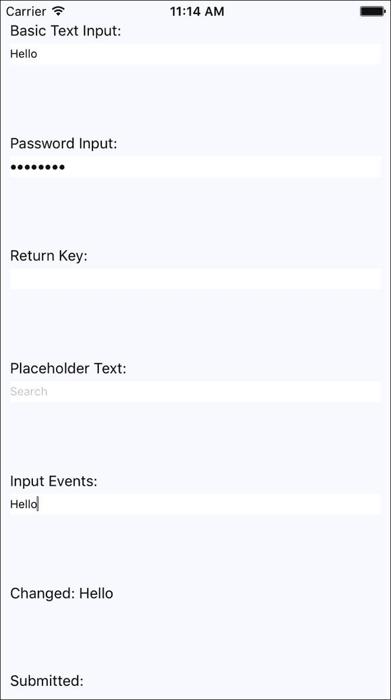
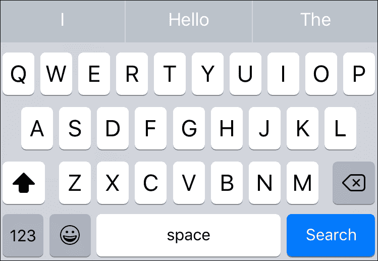
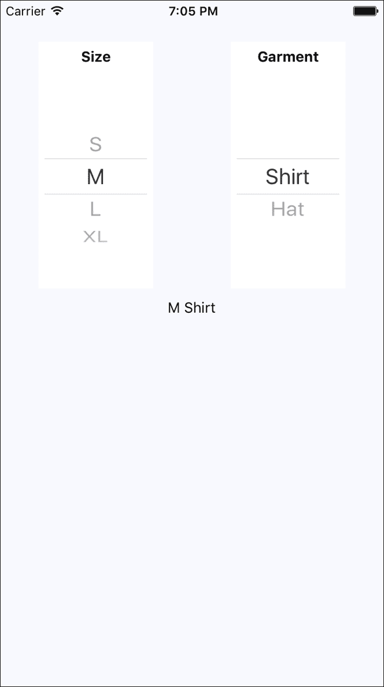
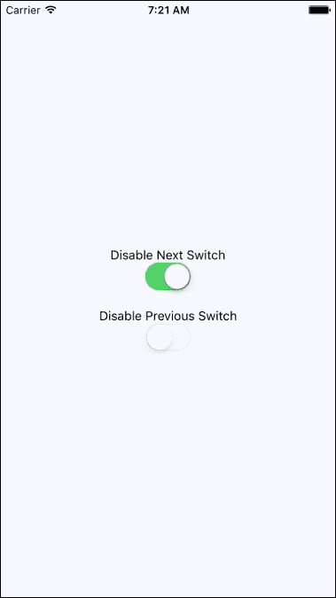
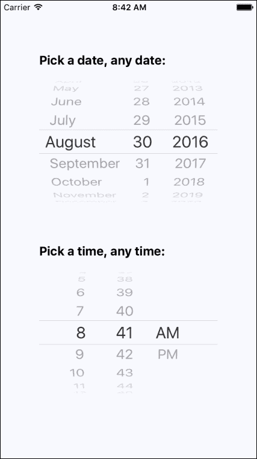
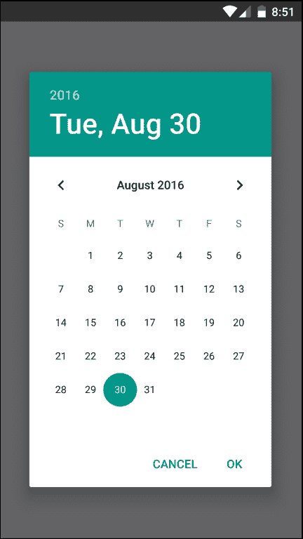

# 十九、收集用户输入

在 web 应用中，很容易收集用户输入，因为标准 HTML 表单元素在所有浏览器上的外观和行为都相似。对于本机 UI 平台，收集用户输入更为细致。

在本章中，您将学习如何使用用于收集用户输入的各种 React 本机组件。其中包括文本输入、从选项列表中选择、复选框和日期/时间选择器。您将看到 iOS 和 Android 之间的差异，以及如何为应用实现适当的抽象。

# 采集文本输入

收集文本输入似乎非常容易实现，即使在 React Native 中也是如此。这很容易，但在实现文本输入时需要考虑很多问题。例如，它应该有占位符文本吗？这是不应该显示在屏幕上的敏感数据吗？我们应该在输入文本时处理文本，还是在用户移动到另一个字段时处理文本？名单还在继续，我在这本书里只有这么多的空间。

移动文本输入与传统网络文本输入的显著区别在于，前者有自己的内置虚拟键盘，我们可以对其进行配置和响应。因此，不要再拖延了，让我们开始编码。我们将呈现`<TextInput>`组件的几个实例：

```jsx
import React, { Component, PropTypes } from 'react'; 
import { 
  AppRegistry, 
  Text, 
  TextInput, 
  View, 
} from 'react-native'; 
import { fromJS } from 'immutable'; 

import styles from './styles'; 

// A Generic "<Input>" component that we can use in our app. 
// It's job is to wrap the "<TextInput>" component in a "<View>" 
// so that we can render a label, and to apply styles to the 
// appropriate components. 
const Input = props => ( 
  <View style={styles.textInputContainer}> 
    <Text style={styles.textInputLabel}> 
      {props.label} 
    </Text> 
    <TextInput 
      style={styles.textInput} 
      {...props} 
    /> 
  </View> 
); 

Input.propTypes = { 
  label: PropTypes.string, 
}; 

class CollectingTextInput extends Component { 
  // This state is only relevant for the "input events" 
  // component. The "changedText" state is updated as 
  // the user types while the "submittedText" state is 
  // updated when they're done. 
  state = { 
   data: fromJS({ 
      changedText: '', 
      submittedText: '', 
    }), 
  } 

  // Getter for "Immutable.js" state data... 
  get data() { 
    return this.state.data; 
  } 

  // Setter for "Immutable.js" state data... 
  set data(data) { 
    this.setState({ data }); 
  } 

  render() { 
    const { 
      changedText, 
      submittedText, 
    } = this.data.toJS(); 

    return ( 
      <View style={styles.container}> 
        {/* The simplest possible text input. */} 
        <Input 
          label="Basic Text Input:" 
        /> 

        { /* The "secureTextEntry" property turns 
             the text entry into a password input 
             field. */ } 
        <Input 
          label="Password Input:" 
          secureTextEntry 
        /> 

        { /* The "returnKeyType" property changes 
             the return key that's displayed on the 
             virtual keyboard. In this case, we want 
             a "search" button. */ } 
        <Input 
          label="Return Key:" 
          returnKeyType="search" 
        /> 

        { /* The "placeholder" property works just 
             like it does with web text inputs. */ } 
        <Input 
          label="Placeholder Text:" 
          placeholder="Search" 
        /> 

        { /* The "onChangeText" event is triggered as 
             the user enters text. The "onSubmitEditing" 
             event is triggered when they click "search". */ } 
        <Input 
          label="Input Events:" 
          onChangeText={(e) => { 
            this.data = this.data 
              .set('changedText', e); 
          }} 
          onSubmitEditing={(e) => { 
            this.data = this.data.set( 
              'submittedText', 
              e.nativeEvent.text 
            ); 
          }} 
          onFocus={() => { 
            this.data = this.data 
              .set('changedText', '') 
              .set('submittedText', ''); 
          }} 
        /> 

        { /* Displays the captured state from the 
             "input events" text input component. */ } 
        <Text>Changed: {changedText}</Text> 
        <Text>Submitted: {submittedText}</Text> 
      </View> 
    ); 
  } 
} 

AppRegistry.registerComponent( 
  'CollectingTextInput', 
  () => CollectingTextInput 
); 

```

我不会深入讨论这些`<TextInput>`组件中的每一个都在做什么，因为代码中有注释。让我们看看这些组件在屏幕上的样子：



如您所见，纯文本输入仅显示已输入的文本。密码字段不显示任何字符。当输入为空时，将显示占位符文本。还将显示已更改的文本状态。你看不到提交的文本状态，因为我在截图之前没有按下虚拟键盘上的提交按钮。

让我们来看看实际的虚拟键盘的输入元素，其中我们改变了返回键：



当键盘返回键反映了他们按下它时将要发生的事情时，用户会感觉与应用更加协调。

# 从选项列表中选择

在 web 应用中，通常使用`<select>`元素让用户从选项列表中进行选择。React Native 附带一个可在 iOS 和 Android 上运行的`<Picker>`组件。设置此组件的样式有一些技巧，因此让我们将所有这些隐藏在通用`Select`组件中：

```jsx
import React, { PropTypes } from 'react'; 
import { 
  View, 
  Picker, 
  Text, 
} from 'react-native'; 
import styles from './styles'; 

// The "<Select>" component provides an 
// abstraction around the "<Picker>" component. 
// It actually has two outer views that are 
// needed to get the styling right. 
const Select = props => ( 
  <View style={styles.pickerHeight}> 
    <View style={styles.pickerContainer}> 
      {/* The label for the picker... */} 
      <Text style={styles.pickerLabel}> 
        {props.label} 
      </Text> 
      <Picker style={styles.picker} {...props}> 
        { /* Maps each "items" value to a 
             "<Picker.Item>" component. */ } 
        {props.items.map(i => ( 
          <Picker.Item key={i.label} {...i} /> 
        ))} 
      </Picker> 
    </View> 
  </View> 
); 

Select.propTypes = { 
  items: PropTypes.array, 
  label: PropTypes.string, 
}; 

export default Select; 

```

对于一个简单的`Select`组件来说，这是很大的开销。事实证明，设计 React-Native`<Picker>`组件的样式其实很难。以下是这些样式的外观：

```jsx
import { StyleSheet } from 'react-native'; 

export default StyleSheet.create({ 
  container: { 
    flex: 1, 
    flexDirection: 'row', 
    flexWrap: 'wrap', 
    justifyContent: 'space-around', 
    alignItems: 'center', 
    backgroundColor: 'ghostwhite', 
  }, 

  // The outtermost container, needs a height. 
  pickerHeight: { 
    height: 175, 
  }, 

  // The inner container lays out the picker 
  // components and sets the background color. 
  pickerContainer: { 
    flex: 1, 
    flexDirection: 'column', 
    alignItems: 'center', 
    marginTop: 40, 
    backgroundColor: 'white', 
    padding: 6, 
    height: 240, 
  }, 

  pickerLabel: { 
    fontSize: 14, 
    fontWeight: 'bold', 
  }, 

  picker: { 
  width: 100, 
    backgroundColor: 'white', 
  }, 

  selection: { 
    width: 200, 
    marginTop: 230, 
    textAlign: 'center', 
  }, 
}); 

```

现在我们可以呈现我们的`<Select>`组件：

```jsx
import React, { Component } from 'react'; 
import { 
  AppRegistry, 
  View, 
  Text, 
} from 'react-native'; 
import { fromJS } from 'immutable'; 

import styles from './styles'; 
import Select from './Select'; 

class SelectingOptions extends Component { 
  // The state is a collection of "sizes" and 
  // "garments". At any given time there can be 
  // selected size and garment. 
  state = { 
    data: fromJS({ 
      sizes: [ 
        { label: '', value: null }, 
        { label: 'S', value: 'S' }, 
        { label: 'M', value: 'M' }, 
        { label: 'L', value: 'L' }, 
        { label: 'XL', value: 'XL' }, 
      ], 
      selectedSize: null, 
      garments: [ 
        { label: '', value: null, sizes: ['S', 'M', 'L', 'XL'] }, 
        { label: 'Socks', value: 1, sizes: ['S', 'L'] }, 
        { label: 'Shirt', value: 2, sizes: ['M', 'XL'] }, 
        { label: 'Pants', value: 3, sizes: ['S', 'L'] }, 
        { label: 'Hat', value: 4, sizes: ['M', 'XL'] }, 
      ], 
      availableGarments: [], 
      selectedGarment: null, 
      selection: '', 
    }), 
  } 

  // Getter for "Immutable.js" state data... 
  get data() { 
    return this.state.data; 
  } 

  // Setter for "Immutable.js" state data... 
  set data(data) { 
    this.setState({ data }); 
  } 

  render() { 
    const { 
      sizes, 
      selectedSize, 
      availableGarments, 
      selectedGarment, 
      selection, 
    } = this.data.toJS(); 

    // Renders two "<Select>" components. The first 
    // one is a "size" selector, and this changes 
    // the available garments to select from. 
    // The second selector changes the "selection" 
    // state to include the selected size 
    // and garment. 
    return ( 
      <View style={styles.container}> 
        <Select 
          label="Size" 
          items={sizes} 
          selectedValue={selectedSize} 
          onValueChange={(size) => { 
            this.data = this.data 
              .set('selectedSize', size) 
              .set('selectedGarment', null) 
              .set('availableGarments', 
                this.data.get('garments') 
                  .filter( 
                    i => i.get('sizes').includes(size) 
                  ) 
              ); 
          }} 
        /> 
        <Select 
          label="Garment" 
          items={availableGarments} 
          selectedValue={selectedGarment} 
          onValueChange={(garment) => { 
            this.data = this.data 
              .set('selectedGarment', garment) 
              .set('selection', 
                this.data.get('selectedSize') + ' ' + 
                  this.data.get('garments') 
                    .find(i => i.get('value') === garment) 
                    .get('label') 
              ); 
          }} 
        /> 
        <Text style={styles.selection}>{selection}</Text> 
      </View> 
    ); 
  } 
} 

AppRegistry.registerComponent( 
  'SelectingOptions', 
  () => SelectingOptions 
); 

```

本示例的基本思想是，第一个选择器中的选定选项将更改第二个选择器中的可用选项。当第二个选择器更改时，标签将以字符串形式显示选定的尺寸和服装。以下是屏幕的外观：



# 开关切换

您将在 web 表单中看到的另一个常见元素是复选框。React Native 有一个可在 iOS 和 Android 上运行的`Switch`组件。谢天谢地，这个组件比`Picker`组件更易于设计。下面是一个简单的抽象，您可以实现它来为交换机提供标签：

```jsx
import React, { PropTypes } from 'react'; 
import { 
  View, 
  Text, 
  Switch, 
} from 'react-native'; 

import styles from './styles'; 

// A fairly straightforward wrapper component 
// that adds a label to the React Native 
// "<Switch>" component. 
const CustomSwitch = props => ( 
  <View style={styles.customSwitch}> 
    <Text>{props.label}</Text> 
    <Switch {...props} /> 
  </View> 
); 

CustomSwitch.propTypes = { 
  label: PropTypes.string, 
}; 

export default CustomSwitch; 

```

现在，让我们看看如何使用两个开关来控制应用状态：

```jsx
import React, { Component } from 'react'; 
import { 
  AppRegistry, 
  View, 
} from 'react-native'; 
import { fromJS } from 'immutable'; 

import styles from './styles'; 
import Switch from './Switch'; 

class TogglingOnAndOff extends Component { 
  state = { 
    data: fromJS({ 
      first: false, 
      second: false, 
    }), 
  } 

  // Getter for "Immutable.js" state data... 
  get data() { 
    return this.state.data; 
  } 

  // Setter for "Immutable.js" state data... 
  set data(data) { 
    this.setState({ data }); 
  } 

  render() { 
    const { 
      first, 
      second, 
    } = this.state.data.toJS(); 

    return ( 
      <View style={styles.container}> 
        { /* When this switch is turned on, the 
             second switch is disabled. */ } 
        <Switch 
          label="Disable Next Switch" 
          value={first} 
          disabled={second} 
          onValueChange={(v) => { 
            this.data = this.data.set('first', v); 
          }} 
        /> 

        { /* When this switch is turned on, the 
             first switch is disabled. */ } 
        <Switch 
          label="Disable Previous Switch" 
          value={second} 
          disabled={first} 
          onValueChange={(v) => { 
            this.data = this.data.set('second', v); 
          }} 
        /> 
      </View> 
    ); 
  } 
} 

AppRegistry.registerComponent( 
  'TogglingOnAndOff', 
  () => TogglingOnAndOff 
); 

```

这两个开关只是切换彼此的`disabled`属性。以下是 iOS 中的屏幕外观：



以下是 Android 上相同屏幕的外观：


# 领用日期/时间输入

在本章的最后一节中，您将学习如何实现日期/时间选择器。React Native 为 iOS 和 Android 提供了独立的日期/时间选择器组件，这意味着由您来处理组件之间的跨平台差异。

那么，让我们从 iOS 的日期选择器组件开始：

```jsx
import React, { PropTypes } from 'react'; 
import { 
  Text, 
  View, 
  DatePickerIOS, 
} from 'react-native'; 

import styles from './styles'; 

// A simple abstraction that adds a label to 
// the "<DatePickerIOS>" component. 
const DatePicker = (props) => ( 
  <View style={styles.datePickerContainer}> 
    <Text style={styles.datePickerLabel}> 
      {props.label} 
    </Text> 
    <DatePickerIOS mode="date" {...props} /> 
  </View> 
); 

DatePicker.propTypes = { 
  label: PropTypes.string, 
}; 

export default DatePicker; 

```

这个组件没有太多内容；它只是向`DatePickerIOS`组件添加一个标签。我们的约会选择器的 Android 版本需要做更多的工作。让我们来看看这个实现：

```jsx
import React, { PropTypes } from 'react'; 
import { 
  Text, 
  View, 
  DatePickerAndroid, 
} from 'react-native'; 

import styles from './styles'; 

// Opens the "DatePickerAndroid" dialog and handles 
// the response. The "onDateChange" function is 
// a callback that's passed in from the container 
// component and expects a "Date" instance. 
const pickDate = (options, onDateChange) => { 
  DatePickerAndroid.open(options) 
    .then(date => onDateChange(new Date( 
      date.year, 
      date.month, 
      date.day 
    ))); 
}; 

// Renders a "label" and the "date" properties. 
// When the date text is clicked, the "pickDate()" 
// function is used to render the Android 
// date picker dialog. 
const DatePicker = ({ 
  label, 
  date, 
  onDateChange, 
}) => ( 
  <View style={styles.datePickerContainer}> 
    <Text style={styles.datePickerLabel}> 
      {label} 
    </Text> 
    <Text 
      onPress={() => pickDate( 
        { date }, 
        onDateChange 
      )} 
    > 
      {date.toLocaleDateString()} 
    </Text> 
  </View> 
); 

DatePicker.propTypes = { 
  label: PropTypes.string, 
  date: PropTypes.instanceOf(Date), 
  onDateChange: PropTypes.func.isRequired, 
}; 

export default DatePicker; 

```

这两个日期选择器之间的关键区别在于 Android 版本没有使用 React 本机组件，例如`DatePickerIOS`。相反，我们必须使用命令式`DatePickerAndroid.open()`API。当用户按下组件呈现的日期文本并打开日期选择器对话框时，会触发此操作。好消息是，我们的这个组件将这个 API 隐藏在声明性组件后面。

### 注

我还实现了一个时间选择器组件，它遵循这种模式。因此，我建议您从[下载本书的代码，而不是在这里列出这些代码 https://github.com/PacktPublishing/React-and-React-Native](https://github.com/PacktPublishing/React-and-React-Native) ，这样您就可以看到细微的差异并运行示例。

现在，让我们看看如何使用日期和时间选择器组件：

```jsx
import React, { Component } from 'react'; 
import { 
  AppRegistry, 
  View, 
} from 'react-native'; 

import styles from './styles'; 

// Imports our own platform-independent "DatePicker" 
// and "TimePicker" components. 
import DatePicker from './DatePicker'; 
import TimePicker from './TimePicker'; 

class CollectingDateTimeInput extends Component { 
  state = { 
    date: new Date(), 
    time: new Date(), 
  } 

  setDate = (date) => { 
    this.setState({ date }); 
  } 

  setTime = (time) => { 
    this.setState({ time }); 
  } 

  render() { 
    const { 
      setDate, 
      setTime, 
      state: { 
        date, 
        time, 
      }, 
    } = this; 

    // Pretty self-explanatory - renders a "<DatePicker>" 
    // and a "<TimePicker>". The date/time comes from the 
    // state of this component and when the user makes a 
    // selection, the "setDate()" or "setTime()" function 
    // is called. 
    return ( 
      <View style={styles.container}> 
        <DatePicker 
          label="Pick a date, any date:" 
          date={date} 
          onDateChange={setDate} 
        /> 
        <TimePicker 
          label="Pick a time, any time:" 
          date={time} 
          onTimeChange={setTime} 
        /> 
      </View> 
    ); 
  } 
} 

AppRegistry.registerComponent( 
  'CollectingDateTimeInput', 
  () => CollectingDateTimeInput 
); 

```

令人惊叹的现在我们有两个简单的组件可以在 iOS 和 Android 上工作。让我们看看在 iOS 上选择器的外观：



如您所见，iOS 日期和时间选择器使用您在本章前面了解的`Picker`组件。Android picker 看起来很不一样，现在我们来看一下：



# 总结

在本章中，您了解了各种 React 本机组件，它们类似于您所使用的 Web 表单元素。您首先学习了文本输入，以及如何考虑每个文本输入都有自己的虚拟键盘。接下来，您了解了允许用户从选项列表中选择项目的`Picker`组件。然后，您了解了类似于复选框的`Switch`组件。

在最后一节中，您学习了如何实现可在 iOS 和 Android 上工作的通用日期/时间选择器。在下一章中，您将学习 React Native 中的模态对话框。