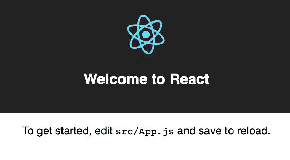

# 三、开发模式与掌握热重新加载

在上一章中，您学习了如何使用`create-react-app`。这只是我们*React toolin*g 旅程的开始。通过使用`create-react-app`引导应用，您安装了许多用于开发的其他工具。这些工具是`react-scripts`包的一部分。本章的重点是`react-scripts`附带的开发服务器，我们将介绍：

*   启动开发服务器
*   自动网页包配置
*   使用热组件重新加载

# 启动开发服务器

如果您使用上一章中的`create-react-app`工具创建了 React 应用，那么您就拥有了启动开发服务器所需的一切。不需要配置！我们现在就开始吧。首先，确保您位于项目目录中：

```jsx
cd my-react-app/ 
```

现在，您可以启动开发服务器：

```jsx
npm start 
```

这将使用`react-scripts`包中的`start`脚本启动开发服务器。您应该看到控制台输出如下所示：

```jsx
Compiled successfully!

You can now view my-react-app in the browser.

  Local:            http://localhost:3000/
  On Your Network:  http://192.168.86.101:3000/

Note that the development build is not optimized.
To create a production build, use npm run build. 
```

您会注意到，除了在控制台中打印此输出外，此脚本还将启动一个新的浏览器选项卡，其地址为`http://localhost:3000/`。显示的页面如下所示：



到目前为止，我们仅在几章中就完成了很多工作。让我们暂停一下，回顾一下我们所做的工作：

1.  您使用`create-react-app`包创建了一个新的 React 应用。
2.  您已经准备好了基本的项目结构和一个占位符`App`组件来渲染。
3.  您启动了开发服务器，现在已经准备好构建 React 组件。

在没有`create-react-app`和`react-scripts`的情况下达到这一点通常需要几个小时。您可能没有时间来处理元开发工作。很多都是为你自动完成的！

# 网页包配置

Webpack 是构建现代 web 应用的首选工具。它足够强大，可以将从 JSX 语法到静态图像的所有内容编译成可以部署的包。它还附带了一个开发服务器。它的主要缺点是它的复杂性。有很多运动部件需要配置，以便让 Webpack 离开地面，但您不必触摸任何部件。这是因为您为 React 应用设置的大多数网页包配置值与大多数 React 应用相同。

开发服务器有两个单独的部分需要配置。首先是网页包开发服务器本身。然后是主 Webpack 配置，即使您没有使用 Webpack 开发服务器，也需要它。那么这些配置文件在哪里呢？它们是`react-scripts`套餐的一部分，意思是，你不必和它们混在一起！

现在让我们浏览一下这些配置值，让您更好地了解可以避免的不必要的头痛。

# 入口点

入口点用于告诉 Webpack 从何处开始查找用于构建应用的模块。对于一个简单的应用，您只需要一个文件作为入口点。例如，这可能是用来呈现根组件的`index.js`文件。考虑这个入口点的另一种方式，借用其他编程语言的术语，是主程序。

当您运行`start`脚本时，`react-scripts`包在源文件夹中查找`index.js`文件。它还添加了几个其他入口点：

*   `Promise`、`fetch()`和`Object.assign()`的 Polyfills。只有在目标浏览器中不存在这些文件时，才会使用它们。
*   用于重新加载热模块的客户端。

最后两个入口点对于 React 开发很有价值，但是当您试图启动一个项目时，您不需要考虑它们。

# 构建输出

Webpack 的工作是捆绑您的应用资源，以便可以从 web 轻松地提供服务。这意味着您必须配置与 bundle 输出相关的各种内容，从输出路径和文件开始。Webpack 开发服务器实际上并没有将捆绑文件写入磁盘，因为它假定构建会频繁发生。生成的包保存在内存中。即使考虑到这一点，您仍然必须配置主输出路径，因为 Webpack 开发服务器仍然需要将其作为真实文件提供给浏览器。

除了主输出位置外，您还可以配置区块文件名和用于为来自的文件提供服务的公共路径。块是被分割成较小部分的捆绑包，以避免创建单个捆绑包文件，该文件太大，可能会导致性能问题。等等，什么？在为应用实现单个组件之前，考虑性能和用于服务资源的路径？在项目的这一点上，这是完全不必要的。别担心，`react-scripts`已经涵盖并提供了可能永远不需要更改的输出配置。

# 解析输入文件

Webpack 的一个关键优势是，您不需要向它提供需要捆绑的模块列表。一旦您在 Webpack 配置中提供了入口点，它就可以确定您的应用需要哪些模块，并相应地将它们捆绑起来。不用说，这是一项复杂的任务，Webpack 正在为您执行，它需要所有能够得到的帮助。

例如，部分的 To.t0t 配置告诉 WebPoP 要考虑的文件扩展名，例如，TytT1 或 Ty2 T2。您还需要告诉 Webpack 在哪里查找包模块。这些模块不是您编写的，也不是应用的一部分。这些是 npm 包，通常可以在项目的`node_modules`目录中找到。

还有更高级的选项，例如为模块创建别名和使用解析器插件。同样，在您编写任何 React 代码之前，这些东西都与您无关，但是，您需要对它们进行配置，以便您可以开发您的组件，当然，除非您使用`react-scripts`来处理此配置。

# 加载和编译文件

为您的包加载和编译文件可能是 Webpack 最重要的功能。有趣的是，Webpack 不会在文件加载后直接处理它们。相反，它在通过 Webpack loader 插件时协调 I/O。例如，`react-scripts`使用的网页包配置使用以下加载程序插件：

*   **巴别塔**：巴别塔加载器将应用源文件中的 JavaScript 转换为所有浏览器都能理解的 JavaScript。Babel 还负责将 JSX 语法编译成常规 JavaScript。
*   **CSS**：有`react-scripts`使用的两个加载程序导致 CSS 输出：
    *   `style-loader`：使用`import`语法导入 CSS 模块，如 JavaScript 模块。
    *   `postcss-loader`：增强的 CSS 功能，如模块、函数和自定义属性。
*   **图像**：通过 JavaScript 或 CSS 导入的图像使用`url-loader`绑定。

随着应用的成熟，您可能会发现自己需要加载并捆绑默认`react-scripts`配置之外的不同类型的资产。由于您在项目开始时不需要担心这一点，因此浪费时间配置网页包加载程序是没有意义的。

# 配置插件

有一个看似无限的插件列表，你可以添加到你的网页配置。其中一些插件对于开发非常有用，所以您希望提前配置这些插件。在项目成熟之前，其他人可能不会被证明有用。`react-scripts`开箱即用的插件有助于提供无缝的 React 开发体验。

# 热重新加载

热模块重新加载机制需要在主 Webpack bundle 配置文件以及开发服务器配置中进行配置。这是另一个例子，当您开始开发组件时，您就想要它，但不想花时间在上面。`react-scripts`的`start`命令启动已配置热重新加载并准备就绪的网页包开发服务器。

# 运行中的热组件重新加载

在本章前面，您学习了如何启动`react-scripts`开发服务器。此开发服务器已配置热模块重新加载并准备使用。您所要做的就是开始编写组件代码。

让我们从实现以下标题组件开始：

```jsx
import React from 'react'; 

const Heading = ({ children }) => ( 
  <h1>{children}</h1> 
); 

export default Heading; 
```

此组件将任何子文本呈现为`<h1>`标记。够简单吗？现在，让我们将`App`组件更改为使用`Heading`：

```jsx
import React, { Component } from 'react'; 
import './App.css'; 
import Heading from './Heading';

class App extends Component { 
  render() { 
    return ( 
      <div className="App"> 
        <Heading> 
          My App 
        </Heading> 
      </div> 
    ); 
  } 
} 

export default App; 
```

然后，您可以看到这是什么样子：


`Heading`组件按预期呈现。现在您已经在浏览器中加载了应用，现在是时候让热重新加载机制开始工作了。假设您已决定更改此标题的标题：

```jsx
<Heading> 
  My App Heading 
</Heading> 
```

只要在代码编辑器中点击 save，Webpack development server 就会检测到发生了更改，新代码应该被编译、捆绑并发送到浏览器。由于`react-scripts`已经完成了 Webpack 的配置，您可以直接进入浏览器，在更改发生时观察更改：


这应该有助于加快发展！事实上，它已经发生了，你刚刚目睹了它。您更改了 React 元素的文本，并立即看到了结果。您本可以花费数小时以 Web 包配置为中心设置此基础设施，但您不必这样做，因为您只是重复使用了`react-scripts`提供的配置，因为几乎所有 React 开发配置看起来都差不多。随着时间的推移，它们会出现分歧，但没有任何组件的项目看起来非常相似。这项运动的名称是跑步。

现在让我们尝试一些不同的东西。让我们添加一个带有`state`的组件，看看当我们更改它时会发生什么。下面是一个简单的按钮组件，用于跟踪其单击：

```jsx
import React, { Component } from 'react'; 

class Button extends Component { 
  style = {} 

  state = { 
    count: 0 
  } 

  onClick = () => this.setState(state => ({ 
    count: state.count + 1 
  })); 

  render() { 
    const { count } = this.state; 
    const { 
      onClick, 
      style 
    } = this; 

    return ( 
      <button {...{ onClick, style }}> 
        Clicks: {count} 
      </button> 
    ); 
  } 
} 

export default Button;
```

让我们来分析一下这个组件发生了什么：

1.  它有一个`style`对象，但没有任何属性，因此这没有效果。
2.  它有一个`count`状态，该状态在每次单击按钮时递增。
3.  `onClick()`处理程序设置新的`count`状态，将旧的`count`状态增加`1`。
4.  `render()`方法使用`onClick`处理程序和`style`属性呈现`<button>`元素。

一旦你点击这个按钮，它将有一个新的状态。这将如何与热模块加载一起工作？让我们试试看。我们将在`App`组件中呈现此`Button`组件，如下所示：

```jsx
import React, { Component } from 'react'; 
import './App.css'; 
import Heading from './Heading'; 
import Button from './Button'; 

class App extends Component { 
  render() { 
    return ( 
      <div className="App"> 
        <Heading> 
          My App Heading 
        </Heading> 
        <Button/> 
      </div> 
    ); 
  } 
} 

export default App; 
```

加载 UI 时，您应该看到如下内容：


点击按钮应将`count`状态增加`1`。确实，单击几次会导致渲染按钮标签发生更改，反映新状态：


现在，假设您想要更改按钮的样式。我们将使文本加粗：

```jsx
class Button extends Component { 
  style = { fontWeight: 'bold' } 

  ... 

  render() { 
    const { count } = this.state; 
    const { 
      onClick, 
      style 
    } = this; 

    return ( 
      <button {...{ onClick, style }}> 
        Clicks: {count} 
      </button> 
    ); 
  } 
} 

export default Button; 
```

热模块机制按预期工作，但有一个重要区别：`Button`组件的状态已恢复到其初始状态：


这是因为当`Button.js`模块被替换时，现有组件实例在被替换为新实例之前被卸载。组件的状态与组件本身一起被吹走。

解决方法是使用*React Hot Loader*工具。此工具将在更新组件的实现时使其保持安装状态。这意味着该状态持续存在。在某些情况下，这可能非常有用。当你刚开始的时候需要这个吗？可能不是热模块的重新加载，它不会持续状态，足以开始运行。

# 正在从 CreateReact 应用中弹出

`create-react-app`和`react-scripts`的目标是零配置反应开发。您花在配置开发样板文件上的时间越少，您花在开发组件上的时间就越多。你应该尽可能地避免担心配置你的应用。但在某个时刻，您必须放弃`create-react-app`并保持自己的配置。

提供零配置环境是可能的，因为`create-react-app`假设了许多默认值和限制。这是一种权衡。通过为开发人员必须做但不想做的大多数事情提供合理的默认值，您为开发人员做出了选择。在应用开发的早期，能够在决策上下赌注是一件好事，这会使您的工作效率更高。

React 组件热加载是`create-react-app`限制的一个很好的例子。它不是`create-react-app`提供的配置的一部分，因为您可能在项目早期不需要它。但随着事情变得越来越复杂，能够在不中断组件当前状态的情况下对组件进行故障排除是至关重要的。在项目的这一点上，`create-react-app`已经达到了它的目的，是时候退出了。

要从`create-react-app`中弹出，请运行`eject`脚本：

```jsx
npm run eject
```

您将被要求确认此操作，因为无法返回。在这一点上，值得强调的是，在`create-react-app`遇到阻碍之前，你不应该从`create-react-app`中弹出。请记住，一旦您从`create-react-app`弹出，您现在就承担起维护所有脚本和曾经隐藏在视图中的所有配置的责任。

好消息是，弹出过程的一部分包括为项目设置脚本和配置值。本质上，`react-scripts`内部使用的是相同的东西，只是现在这些脚本和配置文件被复制到项目目录中供您维护。例如，弹出后，您将看到一个包含以下文件的`scripts`目录：

*   `build.js`
*   `start.js`
*   `test.js`

现在，如果您查看`package.json`，您将看到您使用`npm`调用的脚本现在引用您的本地脚本，而不是引用`react-scripts`包。反过来，这些脚本使用在`config`目录中找到的文件，该目录是在您运行 eject 时为您创建的。以下是在此处找到的相关网页包配置文件：

*   `webpack.config.dev.js`
*   `webpack.config.prod.js`
*   `webpackDevServer.config.js`

记住，这些文件是从`react-scripts`包复制过来的。弹出只是意味着你现在可以控制所有曾经隐藏的东西。它仍然以完全相同的方式设置，并将保持不变，直到您更改它。

例如，假设您已经决定需要热模块替换，以保持组件状态。现在您已经从`create-react-app`弹出，您可以配置启用`react-hot-loader`工具所需的部件。让我们从安装依赖项开始：

```jsx
npm install react-hot-loader --save-dev
```

接下来，让我们更新`webpack.config.dev.js`文件，使其使用`react-hot-loader`。在我们弹出之前，这是不可能配置的。有两个部分需要更新：

1.  首先，在`entry`部分找到以下行：

```jsx
      require.resolve('react-dev-utils/webpackHotDevClient'), 
```

2.  将其替换为以下两行：

```jsx
      require.resolve('webpack-dev-server/client') + '?/', 
      require.resolve('webpack/hot/dev-server'), 
```

3.  接下来，您必须将`react-hot-loader`添加到网页包配置的`module`部分。查找以下对象：

```jsx
      { 
        test: /\.(js|jsx|mjs)$/, 
        include: paths.appSrc, 
        loader: require.resolve('babel-loader'), 
        options: { 
          cacheDirectory: true, 
        }, 
      }
```

4.  将其替换为以下内容：

```jsx
      { 
        test: /\.(js|jsx|mjs)$/, 
        include: paths.appSrc, 
        use: [ 
          require.resolve('react-hot-loader/webpack'), 
          { 
            loader: require.resolve('babel-loader'), 
            options: { 
              cacheDirectory: true, 
            }, 
          } 
        ] 
      }, 
```

您在这里所做的就是将`loader`选项更改为`use`选项，这样您就可以传递一组装载机。您使用的`babel-loader`保持不变。但是现在您也添加了`react-hot-loader/webpack`加载器。现在，该工具可以检测何时需要在源更改时热更换 React 组件。

这就是开发网页包配置所需更改的全部内容。接下来，您必须更改根 React 组件的渲染方式。以下是`index.js`过去的样子：

```jsx
import React from 'react'; 
import ReactDOM from 'react-dom'; 
import './index.css'; 
import App from './App'; 
import registerServiceWorker from './registerServiceWorker'; 

ReactDOM.render(<App />, document.getElementById('root')); 
registerServiceWorker(); 
```

要启用热组件更换，您可以将`index.js`更改为如下所示：

```jsx
import 'react-hot-loader/patch'; 
import React from 'react'; 
import ReactDOM from 'react-dom'; 
import { AppContainer } from 'react-hot-loader'; 

import './index.css'; 
import App from './App'; 
import registerServiceWorker from './registerServiceWorker'; 

const render = Component => { 
  ReactDOM.render( 
    <AppContainer> 
      <Component /> 
    </AppContainer>, 
    document.getElementById('root') 
  ) 
};
```

```jsx
render(App); 

if (module.hot) { 
  module.hot.accept('./App', () => { 
    render(App); 
  }); 
} 

registerServiceWorker(); 
```

让我们对您刚才添加的内容进行分解：

1.  `import 'react-hot-loader/patch'`语句是引导`react-hot-loader`机制所必需的。
2.  您已经创建了一个`render()`函数，该函数接受要渲染的组件。该组件由来自`react-hot-loader`的`AppContainer`组件包装，该组件处理与热加载相关的一些簿记。
3.  对`render(App)`的第一次调用将呈现应用。
4.  对`module.hot.accept()`的调用设置了一个回调函数，该函数在`App`组件的新版本到达时呈现该组件。

现在，您的应用已准备好接收热响应组件更新。它总是能够在源代码更改时接收更新，但正如本章前面所讨论的，这些更新将在重新呈现组件之前清除组件中的任何状态。现在`react-hot-loader`已经就位，您可以在组件中保持任何状态。让我们试试看。

加载 UI 后，单击按钮几次以更改其状态。然后，更改`style`常量以使字体粗体：

```jsx
const style = { 
  fontWeight: 'bold' 
}; 
```

保存此文件后，您会注意到按钮组件已更新。更重要的是，国家没有改变！如果单击按钮两次，现在应该是这样：


这是一个只涉及一个按钮的简单示例。但是，您刚刚通过从`create-react-app`弹出、调整开发网页配置以及更改`App`组件的呈现方式而创建的设置，可以支持您创建的每个组件的热组件加载。

将`react-hot-loader`包添加到项目中只是需要从`create-react-app`中弹出以便调整配置的一个示例。我要提醒大家不要改变绝对必要的事情。当您更改`create-react-app`提供给您的配置时，请确保您心中有一个特定的目标。换句话说，不要撤销`create-react-app`为你所做的所有工作。

# 总结

在本章中，您学习了如何为使用`create-react-app`创建的项目启动开发服务器。然后您了解到`react-scripts`包有自己的网页包配置，在为您启动开发服务器时使用。我们讨论了在编写应用时不必考虑的关键配置领域。

最后，您看到热模块正在重新加载。开箱即用，`react-scripts`在您更改源代码时为您重新加载应用。这将导致页面刷新，这已经足够好，可以开始了。然后，我们研究了使用这种方法开发组件的潜在挑战，因为它消除了组件在更新之前的所有状态。因此，您退出了`create-react-app`并为您的项目定制了 Webpack 配置，以支持热组件重新加载，从而保持状态。

在下一章中，您将使用工具来支持 React 应用中的单元测试。