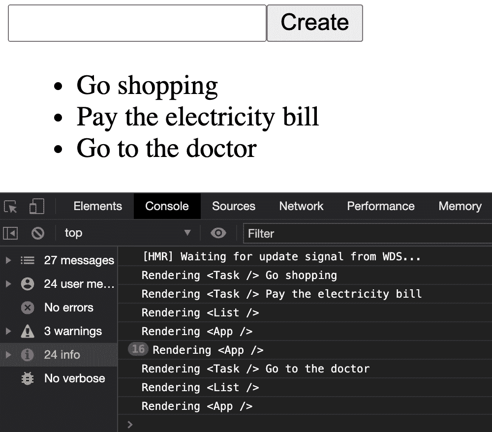
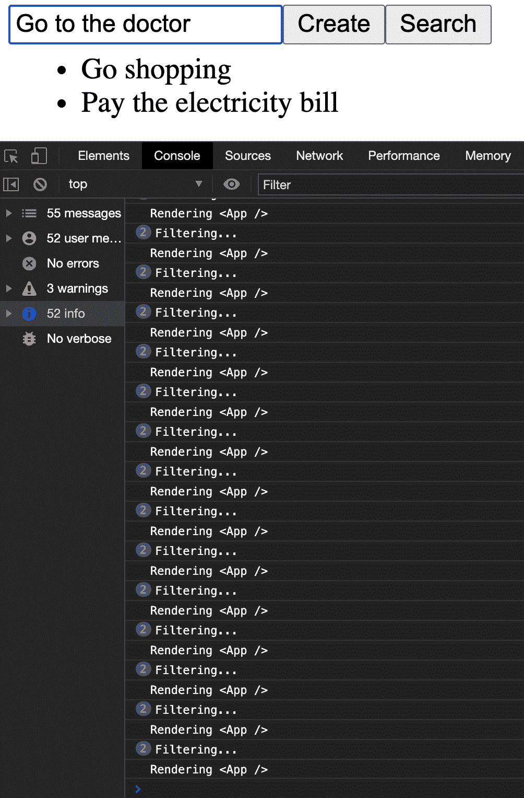
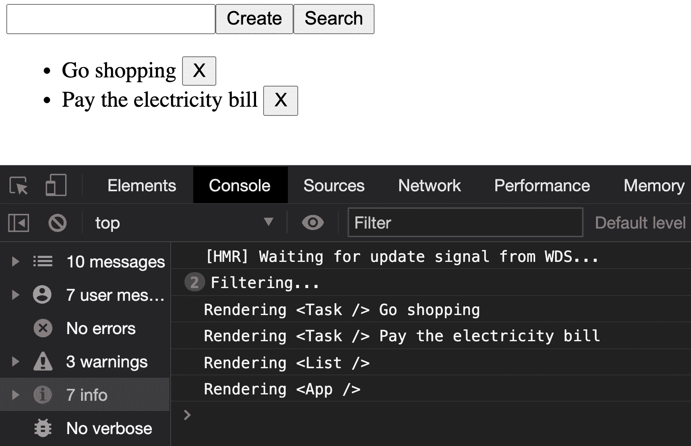
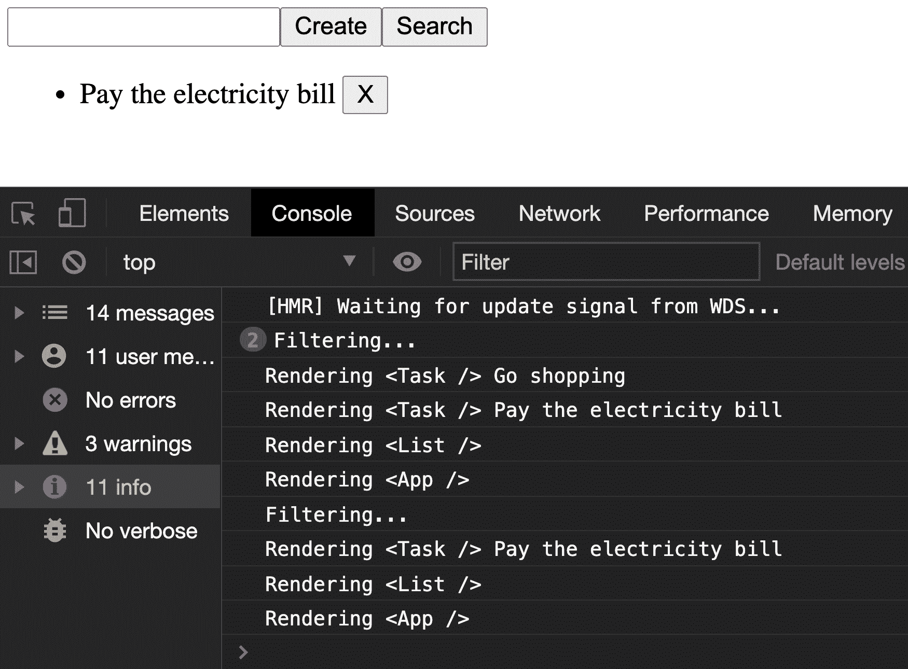
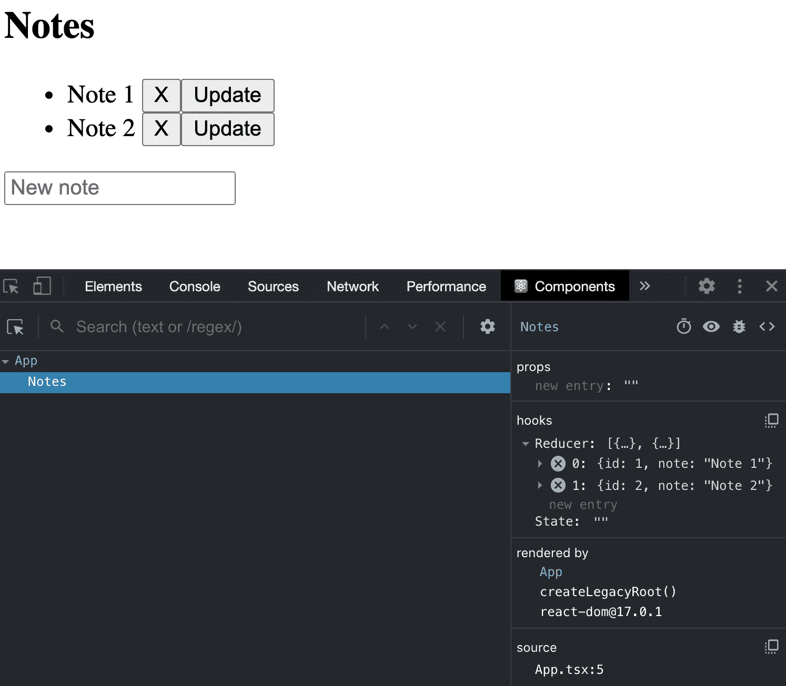

# 三、React 挂钩

React 发展非常迅速，自 React 16.8 以来，新的 React 挂钩被引入，这是 React 开发的游戏规则改变者，因为它们将提高编码速度并提高应用程序的性能。React 使我们能够仅使用功能组件编写 React 应用程序，这意味着不再需要使用类组件。

在本章中，我们将介绍以下主题：

*   新 React 挂钩及其使用方法
*   钩子的规则
*   如何将类组件迁移到 React 钩子
*   了解具有挂钩和影响的组件生命周期
*   如何使用钩子获取数据
*   如何使用`memo`、`useMemo`和`useCallback`记忆组件、值和函数
*   如何实施`useReducer`

# 技术要求

要完成本章，您需要以下内容：

*   Node.js 12+
*   Visual Studio 代码

您可以在本书的 GitHub 存储库[中找到本章的代码 https://github.com/PacktPublishing/React-17-Design-Patterns-and-Best-Practices-Third-Edition/tree/main/Chapter03](https://github.com/PacktPublishing/React-17-Design-Patterns-and-Best-Practices-Third-Edition/tree/main/Chapter03) 。

# 引入 React 钩子

React 挂钩是 React 16.8 中新增的。它们允许您在不编写 React 类组件的情况下使用状态和其他 React 特性。React 钩子也是向后兼容的，这意味着它不包含任何突破性的更改，也不会取代您对 React 概念的了解。在本章中，我们将看到经验丰富的 React 用户的钩子概述，我们还将学习一些最常见的 React 钩子，如`useState`、`useEffect`、`useMemo`、`useCallback`和`memo`。

## 没有破坏性的变化

许多人认为，有了新的 React 钩子，类组件现在在 React 中已经过时了，但这种说法是不正确的。没有从 React 中删除类的计划。钩子不会取代你对概念的了解。相反，钩子为 React 概念提供了一个更直接的 API，如 props、state、context、refs 和生命周期，您已经知道了。

## 使用状态挂钩

您可能知道如何在具有`this.setState`的类中使用组件状态。现在您可以使用新的 React`useState`钩子来使用组件状态。

首先，您需要从 React 中提取`useState`钩子：

```jsx
import { useState } from 'react'
```

Since React 17, the React object is no longer required to render JSX code.

然后，您需要通过为此特定状态定义状态和 setter 来声明要使用的状态：

```jsx
const Counter = () => {
  const [counter, setCounter] = useState<number>(0)
}
```

如您所见，我们使用`setCounter`setter 声明计数器状态，并指定只接受数字，最后，我们将初始值设置为零。

为了测试我们的状态，我们需要创建一个由`onClick`事件触发的方法：

```jsx
const Counter = () => {
  const [counter, setCounter] = useState<number>(0)

  const handleCounter = (operation) => {
    if (operation === 'add') {
      return setCounter(counter + 1)
    }

    return setCounter(counter - 1)
  }
}
```

最后，我们可以渲染`counter`状态和一些按钮来增加或减少`counter`状态：

```jsx
return (
  <p>
    Counter: {counter} <br />
    <button onClick={() => handleCounter('add')}>+ Add</button>
    <button onClick={() => handleCounter('subtract')}>- Subtract</button>
  </p>
)
```

如果您单击+添加按钮一次，您应该看到计数器为 1：


如果您两次单击-Subtract 按钮，那么您应该看到-1 表示计数器：


正如您所看到的，`useState`钩子在 React 中是一个游戏规则改变者，它使得在功能组件中处理状态变得非常容易。

## 钩子规则

React 钩子基本上是 JavaScript 函数，但要使用它们，需要遵循两条规则。React 提供了一个 linter 插件来为您强制执行这些规则，您可以通过运行以下命令来安装这些规则：

```jsx
npm install --save-dev eslint-plugin-react-hooks 
```

让我们看看这两条规则。

### 规则 1：只在顶层调用钩子

来自官方文件（[https://reactjs.org/docs/hooks-rules.html](https://reactjs.org/docs/hooks-rules.html) ：

"**Don’t call Hooks inside loops, conditions, or nested functions**. Instead, always use Hooks at the top level of your React function. By following this rule, you ensure that Hooks are called in the same order each time a component renders. That's what allows React to correctly preserve the state of Hooks between multiple useState and useEffect calls."

### 规则 2：只从 React 函数调用钩子

来自官方文件（[https://reactjs.org/docs/hooks-rules.html](https://reactjs.org/docs/hooks-rules.html) ：

"Don't call Hooks from regular JavaScript functions. Instead, you can:

*   来自 React 函数组件的调用挂钩。
*   从定制钩子调用钩子（我们将在下一页了解它们）。

By following this rule, you ensure that all stateful logic in a component is clearly visible from its source code."

在下一节中，我们将学习如何迁移类组件以使用新的 React 钩子。

# 将类组件迁移到 React 钩子

让我们转换一段代码，该代码当前正在使用类组件，并且还使用一些生命周期方法。在本例中，我们从 GitHub 存储库获取问题并将其列出。

对于本例，您需要安装`axios`来执行提取：

```jsx
npm install axios
```

这是类组件版本：

```jsx
// Dependencies
import { Component } from 'react'
import axios from 'axios'

// Types
type Issue = {
  number: number
  title: string
  state: string
}
type Props = {}
type State = { issues: Issue[] };

class Issues extends Component<Props, State> {
  constructor(props: Props) {
    super(props)

    this.state = {
      issues: []
    }
  }

  componentDidMount() {
    axios
    .get('https://api.github.com/repos/ContentPI/ContentPI/issues')
     .then((response: any) => {
        this.setState({
          issues: response.data
        })
      })
  }

  render() {
    const { issues = [] } = this.state

    return (
      <>
        <h1>ContentPI Issues</h1>

        {issues.map((issue: Issue) => (
          <p key={issue.title}>
            <strong>#{issue.number}</strong> {' '}
            <a href=    {`https://github.com/ContentPI/ContentPI/issues/${issue.number}`}
                target="_blank">{issue.title}</a> {' '}
            {issue.state}
          </p>
        ))}
      </>
    )
  }
}

export default Issues
```

如果渲染此组件，则应看到如下内容：


现在，让我们使用 React 钩子将代码转换为功能组件。我们需要做的第一件事是导入一些 React 函数和类型：

```jsx
// Dependencies
import { FC, useState, useEffect } from 'react'
import axios from 'axios'
```

现在我们可以删除之前创建的`Props`和`State`类型，只需保留`Issue`类型：

```jsx
// Types
type Issue = {
  number: number
  title: string
  state: string
}
```

在此之后，您可以更改类定义以使用功能组件：

```jsx
const Issues: FC = () => {...}
```

`FC`类型用于定义 React 中的**功能组件**。如果需要向组件传递一些道具，可以按如下方式传递：

```jsx
type Props = { propX: string propY: number propZ: boolean  
}

const Issues: FC<Props> = () => {...}
```

我们需要做的下一件事是使用`useState`钩子替换构造函数和状态定义：

```jsx
// The useState hook replace the this.setState method
const [issues, setIssues] = useState<Issue[]>([])
```

我们以前使用过名为`componentDidMount`的生命周期方法，该方法在安装组件时执行，只运行一次。新的 React 钩子名为`useEffect`，现在将使用不同的语法处理所有生命周期方法，但现在，让我们看看如何在新的功能组件中获得`componentDidMount`相同的*效果*：

```jsx
// When we use the useEffect hook with an empty array [] on the 
// dependencies (second parameter) 
// this represents the componentDidMount method (will be executed when the 
// component is mounted).
useEffect(() => {
  axios
    .get('https://api.github.com/repos/ContentPI/ContentPI/issues')
    .then((response: any) => {
      // Here we update directly our issue state
      setIssues(response.data)
    })
}, [])
```

最后，我们只需呈现 JSX 代码：

```jsx
return (
  <>
    <h1>ContentPI Issues</h1>

    {issues.map((issue: Issue) => (
      <p key={issue.title}>
        <strong>#{issue.number}</strong> {' '}
        <a href=
          {`https://github.com/ContentPI/ContentPI/issues/${issue.number}`} 
            target="_blank">{issue.title}</a> {' '}
        {issue.state}
      </p>
    ))}
  </>
)
```

正如您所看到的，新的钩子帮助我们简化了很多代码，并且更有意义。此外，我们将代码减少了 10 行（类组件代码有 53 行，函数组件有 43 行）。

# 了解反应效应

在本节中，我们将学习在类组件上使用的组件生命周期方法和新的 React 效果之间的区别。即使您在其他地方读到它们是相同的，只是语法不同，这也是不正确的。

## 理解使用效果

当你与`useEffect`合作时，你需要*考虑效果*。如果要使用`useEffect`执行`componentDidMount`的等效方法，可以执行以下操作：

```jsx
useEffect(() => {
  // Here you perform your side effect
}, [])
```

第一个参数是要执行的效果的回调，第二个参数是 dependencies 数组。如果在依赖项上传递一个空数组（`[]`），则状态和道具将具有其原始初始值。

然而，值得一提的是，尽管这是`componentDidMount`最接近的等价物，但它并不具有相同的行为。与`componentDidMount`和`componentDidUpdate`不同，我们传递给`useEffect`的功能在布局和绘制之后，在延迟事件期间启动。这通常适用于许多常见的副作用，例如设置订阅和事件处理程序，因为大多数类型的工作不应阻止浏览器更新屏幕。

然而，并非所有的影响都可以推迟。例如，如果需要修改**文档对象模型**（**DOM**），则会出现闪烁。这就是为什么必须在下次绘制之前同步激发事件的原因。React 提供了一个名为`useLayoutEffect`的钩子，其工作方式与`useEffect`完全相同。

## 有条件地发射效果

如果需要有条件地激发效果，则应向依赖项数组添加依赖项，否则，将多次执行效果，这可能会导致无限循环。如果您传递一个依赖项数组，`useEffect`钩子将仅在其中一个依赖项发生更改时运行：

```jsx
useEffect(() => {
  // When you pass an array of dependencies the useEffect hook will only 
  // run 
  // if one of the dependencies changes.
}, [dependencyA, dependencyB])
```

If you understand how the React class life cycle methods works, basically, `useEffect` behaves in the same way as `componentDidMount`, `componentDidUpdate`, and `componentWillUnmount` combined.

这些效果非常重要，但我们也来探索其他一些重要的新挂钩，包括`useCallback`、`useMemo`和`memo`。

# 了解 useCallback、useMemo 和 memo

为了理解`useCallback`、`useMemo`和`memo`之间的区别，我们将做一个待办事项列表示例。您可以使用`create-react-app`和 typescript 作为模板创建基本应用程序：

```jsx
create-react-app todo --template typescript
```

在这之后，您可以删除所有额外的文件（`App.css`、`App.test.ts`、`index.css`、`logo.svg`、`reportWebVitals.ts`和`setupTests.ts`。您只需保留`App.tsx`文件，该文件将包含以下代码：

```jsx
// Dependencies
import { useState, useEffect, useMemo, useCallback } from 'react'

// Components
import List, { Todo } from './List'

const initialTodos = [
  { id: 1, task: 'Go shopping' },
  { id: 2, task: 'Pay the electricity bill'}
]

function App() {
  const [todoList, setTodoList] = useState(initialTodos)
  const [task, setTask] = useState('')

  useEffect(() => {
    console.log('Rendering <App />')
  })

  const handleCreate = () => {
    const newTodo = {
      id: Date.now(), 
      task
    }

    // Pushing the new todo to the list
    setTodoList([...todoList, newTodo])

    // Resetting input value
    setTask('')
  }

  return (
    <>
      <input 
        type="text" 
        value={task} 
        onChange={(e) => setTask(e.target.value)} 
      />

      <button onClick={handleCreate}>Create</button>

      <List todoList={todoList} />
    </>
  )
}

export default App
```

基本上，我们正在定义一些初始任务并创建`todoList`状态，我们将把它传递给列表组件。然后您需要使用以下代码创建`List.tsx`文件：

```jsx
// Dependencies
import { FC, useEffect } from 'react'

// Components
import Task from './Task'

// Types
export type Todo = {
  id: number
  task: string
}

interface Props {
  todoList: Todo[]
}

const List: FC<Props> = ({ todoList }) => {
  useEffect(() => {
    // This effect is executed every new render
    console.log('Rendering <List />')
  })

  return (
    <ul>
      {todoList.map((todo: Todo) => (
        <Task key={todo.id} id={todo.id} task={todo.task} />
      ))}
    </ul>
  )
}

export default List
```

如您所见，我们使用`Task`组件渲染`todoList`数组的每个任务，并将`task`作为道具传递。我还添加了一个`useEffect`挂钩，以查看我们执行了多少渲染。

最后，我们用以下代码创建我们的`Task.tsx`文件：

```jsx
import { FC, useEffect } from 'react'

interface Props {
  id: number
  task: string
}

const Task: FC<Props> = ({ task }) => {
  useEffect(() => {
    console.log('Rendering <Task />', task)
  })

  return (
    <li>{task}</li>
  )
}

export default Task
```

下面是我们应该看到的待办事项列表：


如您所见，当我们呈现待办事项列表时，默认情况下，我们将对`Task`组件执行两次呈现，一次为`List`渲染，另一次为`App`组件渲染。

现在，如果我们尝试在输入中编写新任务，我们可以看到，对于我们编写的每个字母，我们将再次看到所有这些呈现：


如您所见，通过编写`Go`，我们有两个新的渲染批次，因此我们可以确定该组件没有良好的性能，这就是`memo`可以帮助我们提高性能的地方。在下一节中，我们将学习如何实现`memo`、`useMemo`和`useCallback`来记忆组件、值和函数。

## 使用备忘录对组件进行备忘录化

`memo`**高阶组件（HOC）**与 React 类的`PureComponent`类似，因为它对道具进行了肤浅的比较（意思是肤浅的检查），所以如果我们一直尝试使用相同的道具渲染一个组件，该组件只渲染一次，并且会记住。重新渲染组件的唯一方法是当道具更改其值时。

为了修复组件以避免写入输入时出现多个渲染，我们需要将组件包装在`memo`HOC 上。

我们要修复的第一个组件是我们的`List`组件，您只需要影响`import memo`并将组件包装在`export default`上：

```jsx
import { FC, useEffect, memo } from 'react'

...

export default memo(List)
```

然后您需要对`Task`组件执行相同的操作：

```jsx
import { FC, useEffect, memo } from 'react'

...

export default memo(Task)
```

现在，当我们再次尝试在输入中写入`Go`时，让我们看看这次得到了多少渲染：


现在，我们第一次只得到第一批渲染，然后，当我们编写`Go`时，我们只得到`App`组件的另外两个渲染，这是完全好的，因为我们正在更改的任务状态（输入值）实际上是`App`组件的一部分。

此外，单击“创建”按钮，可以查看创建新任务时执行的渲染数量：



如果您看到，前 16 个渲染是 Go to the doctor 字符串的字数计算，然后，当您单击 Create 按钮时，您应该会看到一个`Task`组件的渲染、`List`组件的渲染和`App`组件的渲染。正如您所看到的，我们已经大大提高了性能，并且我们正在执行它所呈现的确切需求。

At this point, you're probably thinking that the correct way is to always add memo to our components, or maybe you're thinking why React doesn't do this by default for us?

The reason is **performance**, which means **it** **is not a good idea to add** `memo` **to all our components unless it is totally necessary**, otherwise, the process of shallow comparisons and memorization will have inferior performance than if we don't use it.

I have a rule when it comes to establishing whether it is a good idea to use `memo`, and this rule is straightforward: **just don't use it.** Normally, when we have small components or basic logic, we don't need this unless you're working with **large data from some API or your component needs to perform a lot of renders (normally huge lists), or when you notice that your app is going slow**. Only in that case would I recommend using `memo`.

## 使用 useMoom 记录值

假设我们现在想要在待办事项列表中实现一个搜索功能。我们需要做的第一件事是在`App`组件中添加一个名为`term`的新状态：

```jsx
const [term, setTerm] = useState('')
```

然后我们需要创建一个名为`handleSearch`的函数：

```jsx
const handleSearch = () => {
 setTerm(task)
}
```

在返回之前，我们将创建`filterTodoList`，它将根据任务过滤待办事项，我们将在那里添加一个控制台，以查看它被渲染了多少次：

```jsx
const filteredTodoList = todoList.filter((todo: Todo) => {
  console.log('Filtering...')
 return todo.task.toLowerCase().includes(term.toLocaleLowerCase())
})
```

最后，我们需要在已经存在的 Create 按钮旁边添加一个新按钮：

```jsx
<button onClick={handleSearch}>Search</button>
```

此时，我建议您删除或注释`List`和`Task`组件中的`console.log`，以便我们关注过滤性能：


当你再次运行应用程序时，你会看到过滤被执行了两次，然后是`App`组件，这里的一切看起来都很好，但是这有什么问题吗？再次尝试在输入中写入`Go to the doctor`，让我们看看您得到了多少渲染和过滤：



正如你所看到的，对于你写的每封信，你将得到两个过滤调用和一个`App`渲染，你不需要是天才就能看到这是糟糕的性能；更不用说，如果您使用的是大型数据阵列，情况会更糟，那么我们如何解决这个问题呢？

在这种情况下，`useMemo`钩子是我们的英雄，基本上，我们需要将过滤器移到`useMemo`中，但首先让我们看看语法：

```jsx
const filteredTodoList = useMemo(() => SomeProcessHere, [])
```

`useMemo`钩子将记住函数的结果（值），并将有一些依赖项可供监听。让我们看看如何实现它：

```jsx
const filteredTodoList = useMemo(() => todoList.filter((todo: Todo) => {
  console.log('Filtering...')
 return todo.task.toLowerCase().includes(term.toLowerCase())
}), [])
```

现在，如果您再次在输入中写入内容，您将看到过滤不会一直执行，就像前面的情况一样：


这很好，但还有一个小问题。如果您尝试单击搜索按钮，它将不会过滤，这是因为我们忽略了依赖项。实际上，如果您看到控制台警告，您将看到以下警告：


您需要将`term`和`todoList`依赖项添加到数组中：

```jsx
const filteredTodoList = useMemo(() => todoList.filter((todo: Todo) => {
  console.log('Filtering...')
 return todo.task.toLowerCase().includes(term.toLocaleLowerCase())
}), [term, todoList])
```

如果你写下`Go`并点击搜索按钮，它现在应该可以工作了：


Here, we have to use the same rule that we used for memo; **just don't use it until absolutely necessary.**

## 使用 useCallback 记忆函数定义

现在我们将添加一个删除任务功能来了解`useCallback`是如何工作的。我们需要做的第一件事是在我们的`App`组件中创建一个名为`handleDelete`的新函数：

```jsx
const handleDelete = (taskId: number) => {
  const newTodoList = todoList.filter((todo: Todo) => todo.id !== taskId)
  setTodoList(newTodoList)
}
```

然后您需要将此函数作为道具传递给`List`组件：

```jsx
<List todoList={filteredTodoList} handleDelete={handleDelete} />
```

然后，在我们的`List`组件中，您需要将道具添加到`Props`接口：

```jsx
interface Props {
  todoList: Todo[]
  handleDelete: any
}
```

接下来，您需要将其从道具中拉出并传递到`Task`组件：

```jsx
const List: FC<Props> = ({ todoList, handleDelete }) => {
  useEffect(() => {
    // This effect is executed every new render
    console.log('Rendering <List />')
  })

  return (
    <ul>
      {todoList.map((todo: Todo) => (
        <Task 
          key={todo.id} 
          id={todo.id}
          task={todo.task} 
          handleDelete={handleDelete}
        />
      ))}
    </ul>
  )
}
```

在`Task`组件中，您需要创建一个执行`handleDelete onClick`的按钮：

```jsx
interface Props {
  id: number
  task: string
  handleDelete: any
}

const Task: FC<Props> = ({ id, task, handleDelete }) => {
  useEffect(() => {
    console.log('Rendering <Task />', task)
  })

  return (
    <li>{task} <button onClick={() => handleDelete(id)}>X</button></li>
  )
}
```

此时，我建议您删除或注释`List`和`Task`组件中的`console.log`，这样我们可以关注过滤的性能。现在，您应该看到任务旁边的 X 按钮：



如果您点击 X 进行购物，您应该能够将其删除：



到目前为止还不错，对吧？但是我们在这个实现上又遇到了一个小问题。如果您现在尝试在输入中写入一些内容，例如`Go to the doctor`，让我们看看会发生什么：


如果您看到，我们将再次执行所有组件的**71**渲染。在这一点上，您可能在想，*如果我们已经实现了记忆组件*的备忘录，会发生什么？但现在的问题是，我们的`handleDelete`函数被分为两个部分传递，从`App`到`List`和`Task`，问题是每次我们有一个新的重新渲染，在这种情况下，每次我们写东西时，这个函数都会重新生成。那么我们如何解决这个问题呢？

在本例中，`useCallback`钩子是英雄，在语法上与`useMemo`非常相似，但主要区别在于它不是像`useMemo`那样记忆函数的结果值，而是记忆**函数定义**：

```jsx
const handleDelete = useCallback(() => SomeFunctionDefinition, [])
```

我们的`handleDelete`函数应该是这样的：

```jsx
const handleDelete = useCallback((taskId: number) => {
  const newTodoList = todoList.filter((todo: Todo) => todo.id !== taskId)
  setTodoList(newTodoList)
}, [todoList])
```

现在，如果我们再写一次`Go to the doctor`，它应该可以正常工作了：


现在，我们只有 23 个渲染，而不是 71 个渲染，这是正常的，我们还可以删除任务：


正如您所看到的，`useCallback`挂钩帮助我们显著提高了性能。在下一节中，您将学习如何记忆在`useEffect`钩子中作为参数传递的函数。

## 作为有效参数传递的记忆函数

有一种特殊情况，我们需要使用`useCallback`钩子，这是当我们在`useEffect`钩子中传递函数作为参数时，例如在`App`组件中。让我们创建一个新的`useEffect`块：

```jsx
const printTodoList = () => {
  console.log('Changing todoList')
}

useEffect(() => {
  printTodoList()
}, [todoList])
```

在本例中，我们正在监听`todoList`状态的变化。如果运行此代码并创建或删除任务，它将正常工作（请记住先删除所有其他控制台）：


一切正常，但让我们在控制台中添加`todoList`：

```jsx
const printTodoList = () => {
  console.log('Changing todoList', todoList)
}
```

如果您使用的是 Visual Studio 代码，则会收到以下警告：


基本上，它要求我们将`printTodoList`函数添加到依赖项中：

```jsx
useEffect(() => {
  printTodoList()
}, [todoList, printTodoList])
```

但现在，在我们这样做之后，我们得到了另一个警告：


我们得到此警告的原因是我们现在正在操作一个状态（安慰状态），这就是为什么我们需要为此函数添加一个`useCallback`钩子来修复此问题：

```jsx
const printTodoList = useCallback(() => {
  console.log('Changing todoList', todoList)
}, [todoList])
```

现在，当我们删除一个任务时，我们可以看到`todoList`更新正确：


在这一点上，这对您来说可能是信息过载，所以让我们快速回顾一下：

`memo`：

*   记忆一个**组件**
*   当道具改变时重新记忆
*   避免重新渲染

`useMemo`：

*   记忆一个**计算值**
*   对于计算属性
*   用于重型工艺

`useCallback`：

*   记住一个**函数定义**，以避免在每次渲染时重新定义它。
*   只要函数作为效果参数传递，就使用它。
*   当一个函数通过道具传递给记忆的组件时，使用它。

最后，不要忘记黄金法则：**在绝对必要之前不要使用它们。**

在下一节中，我们将学习如何使用新的`useReducer`挂钩。

# 理解 useReducer 钩子

您可能有一些在类组件中使用 Redux（`react-redux`）的经验，如果是这样，那么您将了解`useReducer`是如何工作的。这些概念基本上是相同的：操作、减缩器、分派、存储和状态。即使在一般情况下，它看起来非常类似于`react-redux`，但它们也有一些差异。主要区别在于`react-redux`提供了中间件和包装器，如 thunk、sagas 等，而`useReducer`只提供了一个`dispatch`方法，您可以使用该方法将普通对象作为动作分派。另外，`useReducer`默认没有存储；相反，您可以使用`useContext`创建一个，但这只是重新发明轮子。

让我们创建一个基本的应用程序来了解`useReducer`是如何工作的。您可以从创建新的 React 应用程序开始：

```jsx
create-react-app reducer --template typescript
```

然后，像往常一样，您可以删除`src`文件夹中除`App.tsx`和`index.tsx`之外的所有文件，以启动一个全新的应用程序。

我们将创建一个基本的`Notes`应用程序，在这里我们可以使用`useReducer`列出、删除、创建或更新我们的笔记。您需要做的第一件事是将我们稍后创建的`Notes`组件导入到您的`App`组件中：

```jsx
import Notes from './Notes'

function App() {
  return (
    <Notes />
  )
}

export default App
```

现在，在我们的`Notes`组件中，您首先需要导入`useReducer`和`useState`：

```jsx
import { useReducer, useState, ChangeEvent } from 'react'
```

然后我们需要定义一些需要用于`Note`对象、Redux 操作和操作类型的 TypeScript 类型：

```jsx
type Note = {
  id: number
  note: string
}

type Action = {
  type: string
  payload?: any
}

type ActionTypes = {
  ADD: 'ADD'
  UPDATE: 'UPDATE'
  DELETE: 'DELETE'
}

const actionType: ActionTypes = {
  ADD: 'ADD',
  DELETE: 'DELETE',
  UPDATE: 'UPDATE'
}
```

在此之后，我们需要创建带有一些虚拟注释的`initialNotes`（也称为`initialState`：

```jsx
const initialNotes: Note[] = [
  {
    id: 1,
    note: 'Note 1'
  },
  {
    id: 2,
    note: 'Note 2'
  }
]
```

如果您还记得减速机是如何工作的，那么这似乎与我们使用`switch`语句处理减速机的方式非常相似，以便执行`ADD`、`DELETE`和`UPDATE`等基本操作：

```jsx
const reducer = (state: Note[], action: Action) => {
  switch (action.type) {
    case actionType.ADD:
      return [...state, action.payload]

    case actionType.DELETE: 
      return state.filter(note => note.id !== action.payload)

    case actionType.UPDATE:
      const updatedNote = action.payload
      return state.map((n: Note) => n.id === updatedNote.id ? 
        updatedNote : n)

    default:
      return state
  }
}
```

最后，该组件非常简单。基本上，你从`useReducer`钩子（类似于`useState`钩子）中获得笔记和`dispatch`方法，你需要通过`reducer`函数和`initialNotes`（`initialState`函数）：

```jsx
const Notes = () => {
  const [notes, dispatch] = useReducer(reducer, initialNotes)
  const [note, setNote] = useState('')
  ...
}
```

然后，我们有一个`handleSubmit`函数，当我们在输入中写东西时，它会创建一个新的音符。然后，我们按下*回车键：*

```jsx
const handleSubmit = (e: ChangeEvent<HTMLInputElement>) => {
  e.preventDefault()

  const newNote = {
    id: Date.now(),
    note
  }

  dispatch({ type: actionType.ADD, payload: newNote })
}
```

最后，我们用`map`呈现我们的`Notes`列表，我们还创建了两个按钮，一个用于删除，一个用于更新，然后输入应该包装成`<form>`标记：

```jsx
return (
  <div>
    <h2>Notes</h2>

    <ul>
      {notes.map((n: Note) => (
        <li key={n.id}>
          {n.note} {' '}
          <button 
            onClick={() => dispatch({ 
              type: actionType.DELETE,
              payload: n.id
            })}
          >
            X
          </button>

          <button 
            onClick={() => dispatch({ 
              type: actionType.UPDATE,
              payload: {...n, note}
            })}
          >
            Update
          </button>
        </li>
      ))}
    </ul>

    <form onSubmit={handleSubmit}>
      <input 
        placeholder="New note" 
        value={note} 
        onChange={e => setNote(e.target.value)} 
      />
    </form>
  </div>
)

export default Notes
```

如果运行应用程序，则应看到以下输出：



正如您在 React DevTools 中看到的，`Reducer`对象包含我们定义为初始状态的两个注释。现在，如果您在输入中写入内容并按*Enter*，您应该能够创建一个新便笺：


然后，如果要删除便笺，只需单击 X 按钮。让我们删除注释 2：


最后，您可以在输入中写入任何需要的内容，如果单击“更新”按钮，您将更改注释值：


很好，嗯？正如您所看到的，`useReducer`钩子在分派方法、操作和缩减器方面与 redux 几乎相同，但主要区别在于，这仅限于组件及其子组件的上下文，因此如果您需要一个全局存储来从整个应用程序访问，那么您应该改为使用`react-redux`。

# 总结

我希望你喜欢阅读这一章，这一章充满了与新的 React 挂钩有关的非常好的信息。到目前为止，您已经了解了新的 React 钩子是如何工作的，如何使用钩子获取数据，如何将类组件迁移到 React 钩子，效果是如何工作的，以及`memo`、`useMemo`和`useCallback`之间的区别，最后，您了解了`useReducer`钩子是如何工作的，以及与`react-redux`相比的主要区别。这将帮助您提高 React 组件的性能。

在下一章中，我们将介绍一些最流行的合成模式和工具。