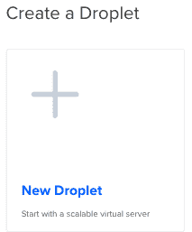
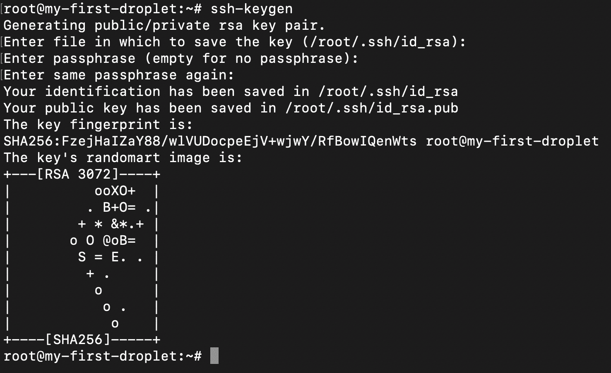
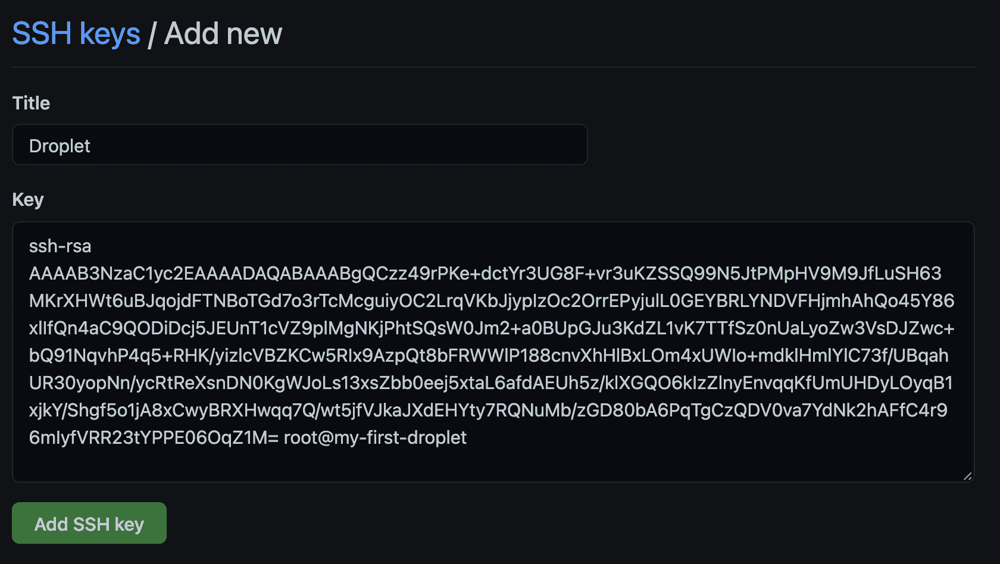
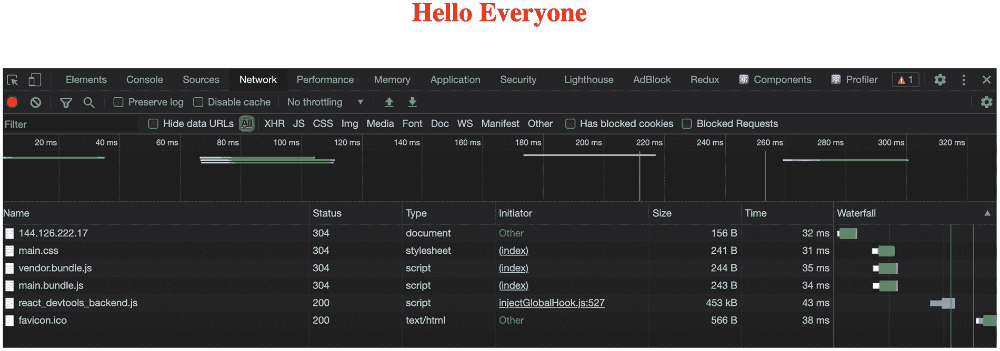
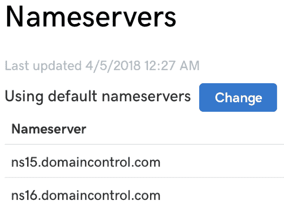
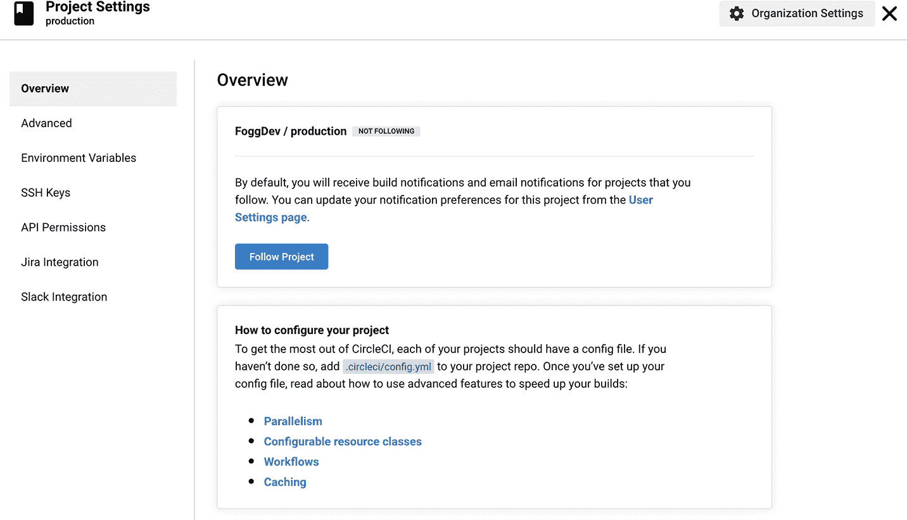
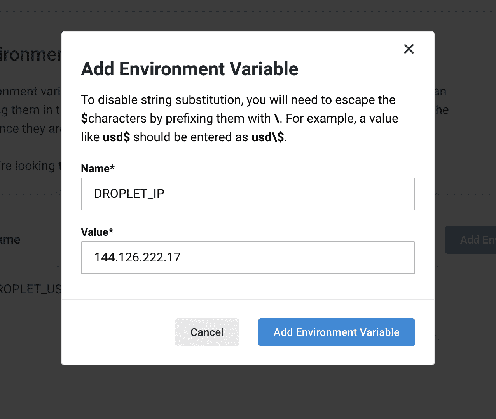
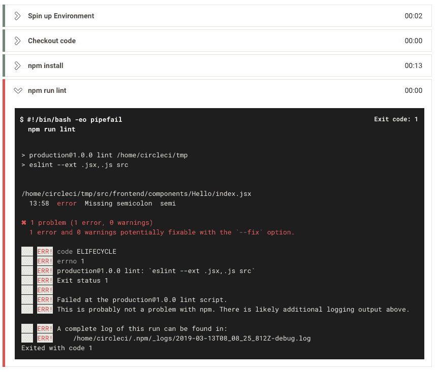

# 十四、部署到生产环境

现在您已经完成了第一个 React 应用程序，现在是学习如何将其部署到世界各地的时候了。为此，我们将使用名为**DigitalOcean**的云服务。

在本章中，您将学习如何在 DigitalOcean 的 Ubuntu 服务器上使用 Node.js 和 nginx 部署 React 应用程序。

在本章中，我们将介绍以下主题：

*   创建数字海洋液滴并对其进行配置
*   配置 nginx、PM2 和域
*   实现 CircleCI 以实现持续集成

# 技术要求

要完成本章，您需要以下内容：

*   Node.js 12+
*   Visual Studio 代码

# 创造我们的第一个数字化海洋水滴

过去六年来，我一直在使用 DigitalOcean，我可以说它是我尝试过的最好的云服务之一，这不仅是因为它价格合理，而且因为它配置起来非常简单和快速，而且社区有很多更新的文档来修复与服务器配置相关的大多数常见问题。

在这一点上，你需要投资一些钱来获得这项服务。我将向您展示最便宜的方法，如果将来您想增加液滴的功率，您将能够在不重新配置的情况下增加容量。最基本的水滴的最低价格是每月 5 美元（每小时 0.007 美元）。

我们将使用 Ubuntu20.04（但可以随意使用最新版本 21.04）；您需要了解一些基本的 Linux 命令才能配置您的 Droplet。如果您是 Linux 的初学者，请不要担心，我将尝试以非常简单的方式向您展示每个步骤。

## 注册数字海洋

如果您没有 DigitalOcean 帐户，您可以在[注册 https://cloud.digitalocean.com/registrations/new](https://cloud.digitalocean.com/registrations/new) 。

你可以注册你的谷歌账户，或者手动注册。在 Google 注册后，您将看到 billing info 视图，如下所示：


你可以用信用卡或贝宝支付。一旦您配置了付款信息，DigitalOcean 将询问您有关项目的一些信息，以便更快地配置您的 Droplet：


在下一节中，我们将创建第一个液滴。

## 创造我们的第一滴

我们将从头开始创建一个新的液滴。请按照以下步骤执行此操作：

1.  选择新液滴选项，如以下屏幕截图所示：



2.  选择 Ubuntu 20.04（LTS）x64，如下所示：


3.  然后，选择基本计划，如下所示：


4.  然后，您可以在付款计划选项中选择$5/mo：


5.  选择一个区域。在这种情况下，我们将选择旧金山地区：


6.  创建根密码，添加液滴的名称，然后单击“创建液滴”按钮，如下所示：


7.  产生水滴大约需要 30 秒。创建后，您将能够看到它：


8.  现在，在终端中，您可以使用以下命令访问液滴：

```jsx
ssh root@THE_DROPLET_IP
```

9.  当您第一次访问它时，它会要求您输入指纹，您只需写“是”，然后它将需要您的密码（您在创建水滴时定义的密码）。


现在我们都准备好安装 Node.js 了，我们将在下一节介绍它。

## 安装 Node.js

现在您已经连接到您的液滴，让我们对其进行配置。首先，我们需要使用个人软件包存档安装 Node.js 的最新版本。在编写本书时，Node 的当前版本是 14.16.x。按照以下给定步骤安装 Node.js：

1.  如果在阅读本段时，Node 有新版本，请在`setup_14.x`命令中更改版本：

```jsx
cd ~
curl -sL https://deb.nodesource.com/setup_14.x -o nodesource_setup.sh
```

2.  获取`nodesource_setup.sh`文件后，运行以下命令：

```jsx
sudo bash nodesource_setup.sh 
```

3.  然后，通过运行以下命令安装节点：

```jsx
sudo apt install nodejs -y
```

4.  如果一切正常，使用以下命令验证 Node 和`npm`的安装版本：

```jsx
node -v
v14.16.1
npm -v
6.14.12
```

如果需要更新版本的 Node.js，可以随时升级。

## 配置 Git 和 GitHub

我创建了一个特殊的存储库，用于帮助您将第一个 React 应用程序部署到生产环境中（[https://github.com/D3vEducation/production](https://github.com/D3vEducation/production) ）。

在您的 Droplet 中，您需要克隆这个 Git 存储库（或者您自己的存储库，如果您已经准备好部署 React 应用程序的话）。生产存储库是公共的，但通常您将使用私有存储库；在这种情况下，您需要将 Droplet 的 SSH 密钥添加到 GitHub 帐户。要创建此密钥，请执行以下步骤：

1.  运行`ssh-keygen`命令，然后按*Enter*三次，但不写入任何密码短语：



If you left your Terminal inactive for more than five minutes, your Droplet connection will probably be closed, and you will need to connect again.

2.  创建 Droplet SSH 密钥后，可以通过运行以下命令查看该密钥：

```jsx
 vi /root/.ssh/id_rsa.pub
```

您将看到如下内容：


3.  复制 SSH 密钥，然后访问 GitHub 帐户。转到设置| SSH 和 GPG 密钥（[https://github.com/settings/ssh/new](https://github.com/settings/ssh/new) ）。然后，将密钥粘贴到文本区域，并将标题添加到密钥：



4.  单击添加 SSH 密钥按钮后，您将看到您的 SSH 密钥，如下所示：


5.  现在，您可以使用以下命令克隆我们的存储库（或您的存储库）：

```jsx
git clone git@github.com:FoggDev/production.git
```

6.  首次克隆时，您将收到一条消息，要求您允许 RSA 密钥指纹：


7.  您必须写“是”，然后点击*输入*才能克隆它：


8.  然后，您必须转到`production`目录并安装`npm`软件包：

```jsx
cd production
npm install
```

9.  如果要测试应用程序，只需运行`start`脚本：

```jsx
npm start
```

10.  然后打开浏览器，转到 Droplet IP 并添加端口号。就我而言，它是`http://144.126.222.17:3000`：


11.  这将以开发模式运行项目。如果要在生产模式下运行，请使用以下命令：

```jsx
npm run start:production
```

您应该看到 PM2 正在运行，如以下屏幕截图所示：


12.  如果您运行它并在 Chrome DevTools 中查看网络选项卡，您将看到正在加载的捆绑包：



现在，我们的 React 应用程序已投入生产，但让我们在下一节中看看我们还可以用 DigitalOcean 做些什么。

## 关掉我们的水滴

要关闭液滴，请执行以下步骤：

1.  如果要关闭液滴，可以转到电源部分，或者使用开/关开关：


2.  DigitalOcean 将仅在您的液滴打开时向您充电。如果单击“打开”开关将其关闭，则会收到以下确认消息：


通过这种方式，你可以控制你的液滴，避免在不使用液滴时支付不必要的费用。

# 配置 nginx、PM2 和域

我们的液滴已准备好用于生产，但如您所见，我们仍在使用端口`3000`。我们需要配置 nginx 并实现一个代理，将流量从端口`80`重定向到`3000`；这意味着我们不再需要直接指定端口。**节点生产流程管理器**（**PM2**将帮助我们安全运行生产中的节点服务器。一般情况下，如果我们直接使用`node`或`babel-node`命令运行 Node，并且应用程序中出现错误，那么它将崩溃并停止工作。如果发生错误，PM2 将重新启动节点服务器。

首先，在您的液滴中，您需要在全球范围内安装 PM2：

```jsx
npm install -g pm2 
```

PM2 将帮助我们以非常简单的方式运行 React 应用程序。

## 安装和配置 nginx

要安装 nginx，您需要执行以下命令：

```jsx
sudo apt-get update
sudo apt-get install nginx
```

安装 nginx 后，您可以启动配置：

1.  我们需要调整防火墙以允许端口`80`的流量。要列出可用的应用程序配置，需要运行以下命令：

```jsx
sudo ufw app list
Available applications:
 Nginx Full
 Nginx HTTP
 Nginx HTTPS
 OpenSSH
```

2.  `Nginx Full`表示允许来自端口`80`（HTTP）和端口`443`（HTTPS）的流量。我们尚未使用 SSL 配置任何域，因此，目前，我们应该限制仅通过端口`80`（HTTP）发送的流量：

```jsx
sudo ufw allow 'Nginx HTTP'
Rules updated
Rules updated (v6) 
```

如果您尝试访问液滴 IP，您应该看到 nginx 正在工作：


3.  您可以使用以下命令管理 nginx 进程：

```jsx
Start server: sudo systemctl start nginx
Stop server: sudo systemctl stop nginx 
Restart server: sudo systemctl restart nginx
```

Nginx 是一款非常棒的 web 服务器，现在非常流行。

## 设置反向代理服务器

正如我前面提到的，我们需要设置一个反向代理服务器来将流量从端口`80`（HTTP）发送到端口`3000`（React app）。为此，您需要打开以下文件：

```jsx
sudo vi /etc/nginx/sites-available/default 
```

步骤如下：

1.  在`location /`块中，您需要用以下代码替换文件中的代码：

```jsx
location / {
  proxy_pass http://localhost:3000; 
  proxy_http_version 1.1; 
  proxy_set_header Upgrade $http_upgrade; 
  proxy_set_header Connection 'upgrade'; 
  proxy_set_header Host $host; 
  proxy_cache_bypass $http_upgrade;
}
```

2.  保存文件后，可以使用以下命令验证 nginx 配置中是否存在语法错误：

```jsx
sudo nginx -t
```

3.  如果一切正常，那么您应该看到：


4.  最后，您需要重新启动 nginx 服务器：

```jsx
sudo systemctl restart nginx
```

现在，您应该能够在不使用端口的情况下访问 React 应用程序，如以下屏幕截图所示：


我们差不多完成了！在下一节中，我们将向液滴添加一个域。

## 向我们的液滴添加一个域

使用 IP 访问网站是不好的；我们总是需要使用域来帮助用户更容易地找到我们的网站。如果您想在 Droplet 上使用域，则需要更改域的名称服务器以指向 DigitalOcean DNS。我通常使用 GoDaddy 注册我的域名。要使用 GoDaddy 执行此操作，请执行以下步骤：

1.  转到[https://dcc.godaddy.com/manage/YOURDOMAIN.COM/dns](https://dcc.godaddy.com/manage/YOURDOMAIN.COM/dns) ，然后转到名称服务器部分：



2.  单击更改按钮，选择自定义，然后指定 DigitalOcean DNS：


3.  通常，需要 15 到 30 分钟才能反映 DNS 更改；现在，更新名称服务器后，请转到 Droplet 仪表板，然后选择添加域选项：


4.  然后，写下您的域名，选择您的水滴，然后单击添加域按钮：


5.  现在，您必须为 CNAME 创建一个新记录。选择 CNAME 选项卡，在主机名中写入`www`；在别名字段中写入`@`；默认情况下，TTL 为`43200`。所有这些都是为了能够使用`www`前缀访问您的域：


如果所有操作都正确，您应该能够访问您的域并看到 React 应用程序正在工作。如前所述，此过程可能需要 30 分钟，但在某些情况下，可能需要 24 小时，具体取决于 DNS 传播速度：


令人惊讶的是，现在您已经正式将第一个 React 应用程序部署到生产环境中了！

# **实施 CircleCI 持续集成**

我已经使用 CircleCI 一段时间了，我可以告诉你，它是最好的 CI 解决方案之一：它免费供个人使用，为你提供无限的存储库和用户；您每月有 1000 分钟的构建时间、一个容器和一个并发作业；如果您需要更多，您可以升级计划，初始价格为每月 50 美元。

您需要做的第一件事是使用您的 GitHub 帐户（或者 Bitbucket，如果您愿意的话）在站点上注册。如果您选择使用 GitHub，则需要在您的帐户中授权 CircleCI，如以下屏幕截图所示：


在下一节中，我们将向 CircleCI 添加 SSH 密钥。

## 向 CircleCI 添加 SSH 密钥

现在您已经创建了帐户，CircleCI 需要一种登录到 DigitalOcean Droplet 的方法来运行部署脚本。按照以下步骤完成此任务：

1.  使用以下命令在 Droplet 中创建新的 SSH 密钥：

```jsx
ssh-keygen -t rsa
# Then save the key as /root/.ssh/id_rsa_droplet with no password.
# After go to .ssh directory
cd /root/.ssh
```

2.  之后，让我们将密钥添加到我们的`authorized_keys`：

```jsx
cat id_rsa_droplet.pub >> authorized_keys
```

3.  现在，您需要下载私钥。要验证是否可以使用新密钥登录，需要将其复制到本地计算机，如下所示：

```jsx
# In your local machine do:
scp root@YOUR_DROPLET_IP:/root/.ssh/id_rsa_droplet ~/.ssh/
cd .ssh
ssh-add id_rsa_droplet
ssh -v root@YOUR_DROPLET_IP
```

如果你做的一切都正确，你应该能够在没有密码的情况下登录到你的 Droplet，这意味着 CircleCI 也可以访问我们的 Droplet：

4.  复制`id_rsa_droplet.pub`键的内容，然后转到存储库设置（[https://app.circleci.com/settings/project/github/YOUR_GITHUB_USER/YOUR_REPOSITORY](https://app.circleci.com/settings/project/github/YOUR_GITHUB_USER/YOUR_REPOSITORY) ：



5.  转到 SSH 密钥，如下所示：


6.  您也可以访问 URL[https://app.circleci.com/settings/project/github/YOUR_GITHUB_USER/YOUR_REPOSITORY/shh](https://app.circleci.com/settings/project/github/YOUR_GITHUB_USER/YOUR_REPOSITORY/shh) ，然后点击底部的添加 SSH 密钥按钮：


7.  粘贴私钥，然后为主机名字段提供名称；我们将把它命名为`DigitalOcean`。

现在，让我们在下一节中配置 CircleCI 实例。

## 配置 CircleCI

现在您已经为 CircleCI 配置了对 Droplet 的访问权限，您需要向项目中添加一个`config`文件，以指定要为部署过程执行的作业。此过程显示在以下步骤中：

1.  为此，您需要创建`.circleci`目录，并在`config.yml`文件中添加以下内容：

```jsx
version: 2.1
jobs:
  build:
    working_directory: ~/tmp
    docker:
      - image: cimg/node:14.16.1
    steps:
      - checkout
      - run: npm install
      - run: npm run lint
      - run: npm test
      - run: ssh -o StrictHostKeyChecking=no $DROPLET_USER@$DROPLET_IP 'cd production; git checkout master; git pull; npm install; npm run start:production;'
workflows:
  build-deploy:
    jobs:
      - build:
        filters:
          branches:
            only: master
```

2.  当你有一个`.yml`文件时，你需要小心缩进；它与 Python 的相似之处在于，如果不正确使用缩进，就会出现错误。让我们看看这个文件是如何构造的。
3.  指定我们将使用的 CircleCI 版本。在本例中，您使用的是版本`2.1`（撰写本书时的最新版本）：

```jsx
version: 2.1
```

4.  在`jobs`中，我们将指定需要配置容器；我们将使用 Docker 创建它，并概述部署过程中要遵循的步骤。

5.  `working_directory`将是我们用来安装 npm 包和运行部署脚本的临时目录。在这种情况下，我决定使用`tmp`目录，如下所示：

```jsx
jobs:
  build:
    working_directory: ~/tmp
```

6.  如前所述，我们将创建一个 Docker 容器，在本例中，我选择了一个包含`node: 14.16.1`的现有图像。如果您想了解所有可用图像，可以访问[https://circleci.com/docs/2.0/circleci-images](https://circleci.com/docs/2.0/circleci-images) ：

```jsx
docker:
  - image: cimg/node:14.16.1
```

7.  对于代码案例，首先执行`git checkout`到`master`，然后在每个运行语句中，您需要指定要运行的脚本：

```jsx
steps:
  - checkout
  - run: npm install
  - run: npm run lint
  - run: npm test
  - run: ssh -o StrictHostKeyChecking=no $DROPLET_USER@$DROPLET_IP 'cd production; git checkout master; git pull; npm install; npm run start:production;'
```

遵循以下步骤：

1.  首先，您需要使用`npm install`安装 npm 包，以便能够执行接下来的任务。
2.  使用`npm run lint`执行 ESLint 验证。如果失败，它将中断部署过程，否则，它将继续下一次运行。
3.  使用`npm run test`执行 Jest 验证；如果失败，它将中断部署过程，否则，它将继续下一次运行。
4.  在最后一步中，我们连接到 DigitalOcean Droplet，传递`StrictHostKeyChecking=no`标志以禁用严格的主机密钥检查。然后我们使用`$DROPLET_USER`和`$DROPLET_IP`ENV 变量连接到它（我们将在下一步中创建这些变量），最后，我们将使用单引号指定我们将在液滴内部执行的所有命令。这些命令如下所示：

`cd produ``ction`：授予对产品（或您的 Git 存储库名称）的访问权。

`git checkout master`：这将检查主分支。

`git pull`：从我们的存储库中获取最新的更改。

`npm run start:production`：这是最后一步，以生产模式运行我们的项目。

最后，让我们向 CircleCI 添加一些环境变量。

## 在 CircleCI 中创建环境变量

正如您之前看到的，我们使用的是`$DROPLET_USER`和`$DROPLET_IP`变量，但是我们如何定义它们呢？遵循以下步骤：

1.  您需要再次转到项目设置并选择环境变量选项。然后，您需要创建`DROPLET_USER`变量：


2.  然后，您需要使用液滴 IP 创建`DROPLET_IP`变量：



3.  现在，您需要将`config`文件推送到您的存储库中，您就可以开始使用魔法了。现在 CircleCI 已连接到您的存储库，每次您将更改推送到 master 时，它都会启动一个构建。

通常，前两个或三个构建可能会由于语法错误、配置中的缩进错误，或者可能是因为存在 linter 错误或单元测试错误而失败。如果你失败了，你会看到这样的情况：


4.  从前面的屏幕截图中可以看到，底部的第一个构建失败表示构建错误，第二个表示工作流构建部署。这基本上意味着在第一次构建中，`config.yml`文件中有语法错误。
5.  在您修复了`config.yml`文件中的所有语法错误以及 linter 或单元测试的所有问题之后，您应该会看到一个成功的构建，如下所示：


6.  如果单击内部版本号，您可以看到 CircleCI 在发布液滴中的新更改之前执行的所有步骤：


7.  如您所见，步骤的顺序与我们在`config.yml`文件中指定的顺序相同；您甚至可以通过单击每个步骤来查看其输出：


8.  现在，假设您在 linter 验证或某些单元测试中出错。让我们看看在这种情况下会发生什么，如下所示：



如您所见，一旦检测到错误，它将以代码`1`退出。这意味着它将中止部署并将其标记为失败，如您所见，`npm run lint`之后的任何步骤都不会执行。

另一件很酷的事情是，如果现在转到 GitHub 存储库并检查提交，您将看到所有生成成功的提交和所有生成失败的提交：


这是惊人的–现在您已经将项目配置为自动执行部署，并将其连接到 GitHub 存储库。

# 总结

我们的部署过程已经结束，现在您知道如何将 React 应用程序部署到世界各地（生产），以及如何实施 CircleCI 以实现持续集成。

在下一章中，我们将学习如何发布`npm`包。