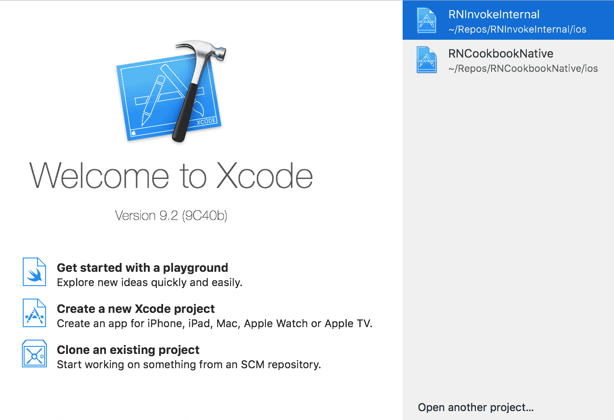
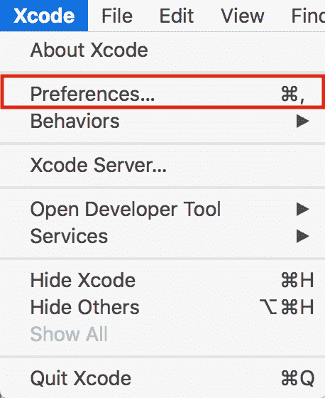
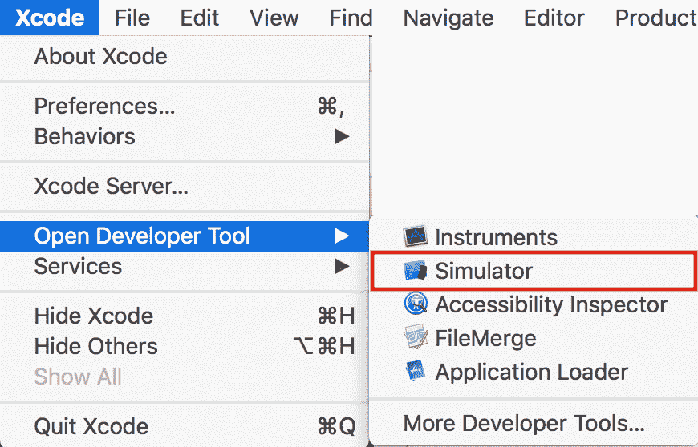
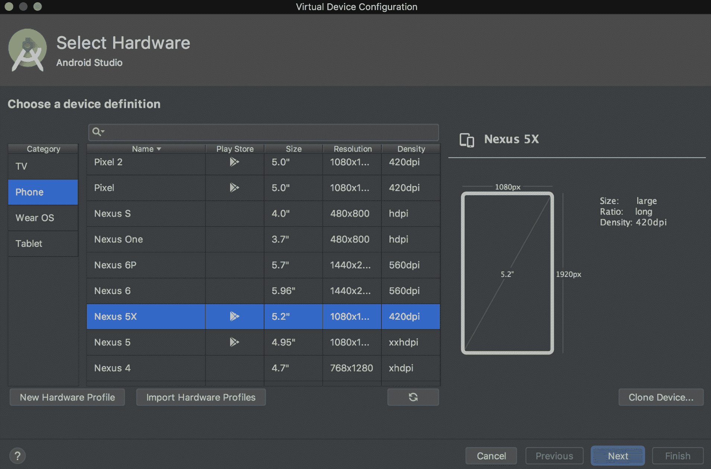
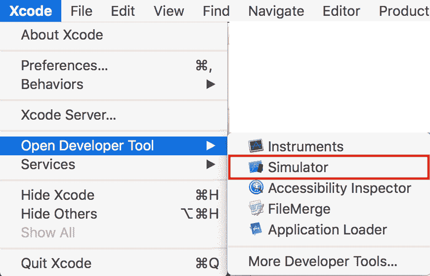
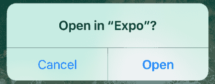
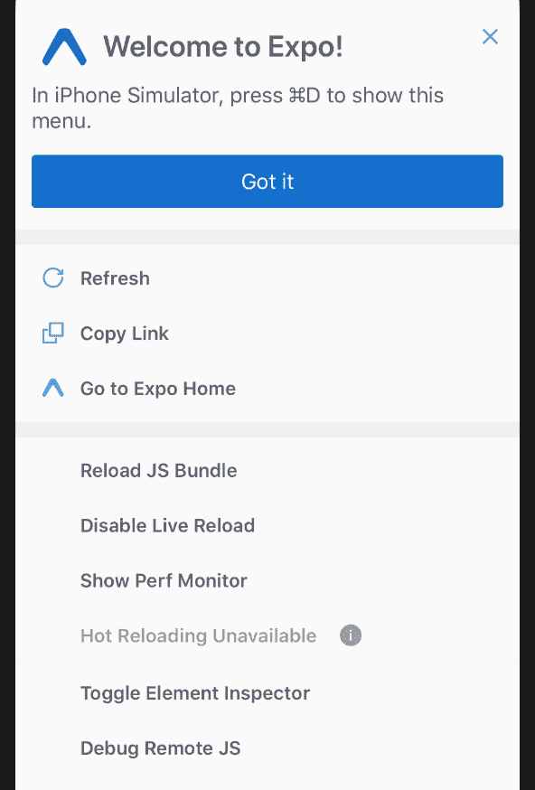
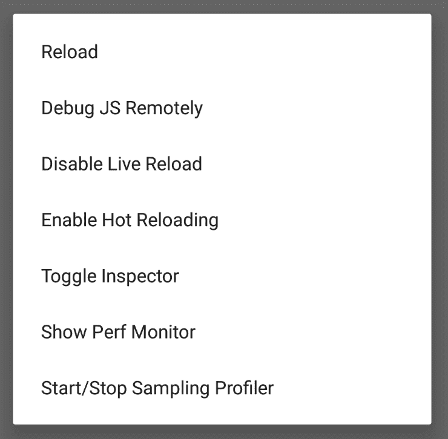

# 一、设置您的环境

自第一版以来，React 原生生态系统已经进化了不少。尤其是开源工具 Expo.io，简化了项目初始化和开发阶段，使得在 React Native 中工作比在 0.36 版中更加愉快

使用 Expo 工作流，您将能够仅使用 JavaScript 构建本机 iOS 和 Android 应用，在 iOS 模拟器和 Android 模拟器中使用实时重新加载，并通过 Expo 的应用轻松地在任何真实设备上测试您的应用。在您需要访问本机代码（例如，从单独的代码库与遗留本机代码集成）之前，您可以完全用 JavaScript 开发应用，而无需使用 Xcode 或 Android Studio。如果您的项目演变为必须支持本机代码的应用，Expo 将提供弹出*项目的功能，从而将您的应用更改为本机代码，以便在 Xcode 和 Android Studio 中使用。有关退出世博会项目的更多信息，请参见[第 10 章](10.html)、*应用工作流和第三方插件*。*

 *Expo 是为 Android 和 iOS 设备构建功能齐全的应用的绝佳方式，而无需处理本机代码。让我们开始吧！

本章将介绍以下主题：

*   安装依赖项
*   初始化第一个应用
*   在模拟器/仿真器中运行应用
*   在真实设备上运行应用

# 技术要求

本章将介绍在本书中使用的工具的安装。这些措施包括：

*   博览会
*   Xcode（仅适用于 iOS 模拟器、macOS）
*   安卓工作室
*   Node.js
*   看守员

# 安装依赖项

构建第一个 React 本机应用的第一步是安装依赖项以便开始

# 安装 Xcode

正如本章导言中提到的，Expo 为我们提供了一个工作流，在这个工作流中，我们可以避免在 Xcode 和 Android Studio 中工作，因此我们可以单独使用 JavaScript 进行开发。但是，为了在 iOS 模拟器中运行应用，您需要安装 Xcode。

Xcode requires macOS, and therefore running your React Native application in an iOS simulator is only possible on macOS.

Xcode 应该从应用商店下载。您可以在应用商店中搜索 Xcode，或使用以下链接：
[https://itunes.apple.com/app/xcode/id497799835](https://itunes.apple.com/app/xcode/id497799835) 。

Xcode 是一个相当大的下载量，所以这部分需要花费一些时间。通过应用商店安装 Xcode 后，您可以通过 Finder 中的`Applications`文件夹运行 Xcode：

1.  这是启动 Xcode 时看到的第一个屏幕。注意，如果这是您第一次安装 Xcode，您将不会看到右侧下面列出的最新项目：



2.  从菜单栏中选择 Xcode |首选项。。。详情如下:



3.  单击“组件”选项卡，然后从提供的模拟器列表中安装模拟器：


4.  安装后，您可以从菜单栏打开模拟器：Xcode | open Developer Tool | simulator:

****

# 安装 Android Studio

Android Studio 附带了官方的 Android 仿真器，这是 Expo 推荐在开发过程中使用的仿真器。

# 怎么做。。。

1.  从[下载 Android Studiohttps://developer.android.com/studio/](https://developer.android.com/studio/) 。
2.  打开下载的文件并将 Android Studio.app 图标拖动到应用文件夹图标：


3.  一旦安装，我们将需要更改 Android Studio 首选项。打开 Android Studio，然后从系统栏中的 Android Studio 菜单打开首选项。在首选项子菜单中，选择外观和行为|系统设置| Android SDK。在“SDK 工具”选项卡下，确保已安装某些版本的 Android SDK 构建工具，如果尚未安装，请进行安装。
4.  我们还需要通过编辑`~/.bash_profile`或`~/.bashrc`将 Android SDK 位置添加到系统`PATH`。可以通过添加以下行来完成此操作：

```jsx
export PATH=$PATH:/Users/MY_USER_NAME/Library/Android/sdk
```

请确保将`MY_USER_NAME`替换为您的系统用户名。

5.  在 macOS 上，您还需要在`~/.bash_profile`或`~/.bashrc`中的`PATH`中添加平台工具。您可以通过添加以下行来完成此操作：

```jsx

 PATH=$PATH:/Users/MY_USER_NAME/Library/Android/platform-tools 
```

请确保将`MY_USER_NAME`替换为您的系统用户名。

If you've never edited a `.bash_profile` or `.bashrc` file before, or aren't familiar with `PATH`, you can get more information on what purpose they serve and how to work with them from the following resources:

*   [https://www.rc.fas.harvard.edu/resources/documentation/editing-your-bashrc/](https://www.rc.fas.harvard.edu/resources/documentation/editing-your-bashrc/)
*   [https://www.cyberciti.biz/faq/appleosx-bash-unix-change-set-path-environment-variable/](https://www.cyberciti.biz/faq/appleosx-bash-unix-change-set-path-environment-variable/)

6.  如果`PATH`被正确更新，`adb`命令应该在终端中工作。要使更改生效，您可能必须重新启动终端。

7.  在新安装的 Android Studio 上，您将看到欢迎屏幕。启动新应用以完全打开软件。然后，从窗口右上角的按钮中选择 AVD 管理器，如以下步骤所示：


8.  在打开模式下按创建虚拟设备。
9.  在选择硬件屏幕中选择一个设备，然后按下一步：



10.  在系统映像屏幕的推荐选项卡下下载一个系统映像：


11.  在最终屏幕上按 Finish，Android Studio 将创建新的虚拟设备。通过按下右上角按钮行中的播放按钮，可以随时运行设备：


为了在开发过程中在 Android 仿真器上运行应用，Expo 曾建议使用优秀的第三方仿真器 Genymotion。然而，从第 29 届世博会开始，他们现在建议使用 Android Studio 附带的官方模拟器。

您可以按照世博会官方文档中提供的分步指南进行操作，以确保 Android Studio 的设置能够与世博会开发工作流程正常工作。该指南可在[找到 https://docs.expo.io/versions/latest/workflow/android-studio-emulator](https://docs.expo.io/versions/latest/workflow/android-studio-emulator) 。

这就是开始使用 Expo 开发第一款 React 本机应用所需的全部设置！但是，使用纯 React 本机应用（非 Expo 应用）还需要执行一些额外的步骤。纯 React 原生应用开发将在[第 10 章](01.html)、*应用工作流和第三方插件*中深入介绍。由于这个设置过程有点复杂，可能会发生变化，我建议参考官方指南。您可以在位于[的《React Native:入门指南》中找到这些说明 https://facebook.github.io/react-native/docs/getting-started.html](https://facebook.github.io/react-native/docs/getting-started.html) 在“使用本机代码的建筑项目”选项卡部分下。

打开模拟器后，通过菜单栏选择所需的 iOS 设备：硬件|设备|[iOS 版本]|[iOS 设备]。将来在模拟器中运行 Expo 应用时，应自动使用相同的设备

如果运行以下命令，则可以在终端中使用 Expo CLI 启动应用：

```jsx
 expo start
```

该命令将生成您的应用并在 web 浏览器中打开 Expo Developer 工具。在 Expo 开发者工具中，选择在 iOS 模拟器上运行。

# 还有更多。。。

一旦您在模拟器中启动了一个应用，您就可以在不从 Xcode 打开模拟器的情况下按下在 iOS 模拟器上运行按钮。它还应该记住您的设备选择。从 Xcode 打开模拟器提供了一种选择首选 iOS 设备进行模拟的简单方法

如果您按照世博会指南中的步骤进行操作，可以在*安装 Android Studio*一节中找到，您也会看到其中包括安装一个虚拟设备，我们可以将其作为模拟器运行。要在 emulator 上启动应用，只需打开您在 Android Studio 中安装的 Android 虚拟设备，在终端中运行`expo start`命令，然后选择 run on Android Device/emulator。

# 安装 Node.js

Node.js 是基于 Chrome 的 V8 JavaScript 引擎构建的 JavaScript 运行时，旨在构建可伸缩的网络应用。Node 允许 JavaScript 在终端中执行，是任何 web 开发人员不可或缺的工具。关于 Node.js 是什么的更多信息，您可以阅读项目的*关于 Node.js*页面[https://nodejs.org/en/about/](https://nodejs.org/en/about/) 。

根据世博会安装文档，Node.js 在技术上不是必需的，但一旦你开始实际构建一些东西，你就会想要它。Node.js 本身不在本书的范围之内，但你可以查看*进一步阅读*本章末尾的小节提供了有关使用 Node.js 的更多资源。

安装 Node.js 的方法很多，因此很难推荐特定的安装方法。在 macOS 上，您可以通过以下方式之一安装 Node.js：

*   从项目站点[下载并安装 Node.jshttps://nodejs.org/en/download/](https://nodejs.org/en/download/) 。
*   通过自制安装。如果您熟悉自制，此过程将在[中简要说明 https://medium.com/@katopz/how-to-install-specific-nodejs-version-c6e1cec8aa11](https://medium.com/@katopz/how-to-install-specific-nodejs-version-c6e1cec8aa11)。
*   通过节点版本管理器安装（NVM；[https://github.com/creationix/nvm](https://github.com/creationix/nvm) ）。NVM 允许您安装 Node.js 的多个版本，并轻松地在它们之间切换。使用存储库自述文件中提供的说明安装 NVM。这是推荐的方法，因为它的灵活性，只要您在终端工作舒适。

# 安装世博会

世博会项目过去有一个名为 Expo XDE 的基于 GUI 的开发环境，现在已被名为 Expo Developer Tools 的基于浏览器的 GUI 所取代。由于 Expo XDE 已被弃用，因此现在始终使用 Expo CLI 创建新的 Expo 应用。可以使用 npm（Node Package Manager，作为 Node.js 的一部分）通过终端通过以下命令安装：

```jsx
 npm install expo-cli -g
```

在本书中，我们将大量使用 Expo 来创建和构建 React 本机应用，特别是那些不需要访问本机 iOS 或 Android 代码的应用。使用 Expo 构建的应用在开发方面有一些非常好的优势，有助于混淆本机代码，简化应用发布和推送通知，并提供许多内置于 Expo SDK 中的有用功能。有关 Expo 如何运作以及如何融入 React Native 开发的更多信息，请参见[第 10 章](01.html)、*应用工作流和第三方插件*。

# 安装值班员

Watchman 是 React Native 内部使用的工具。它的目的是监视文件的更新，并在发生更改时触发响应（如实时重新加载）。世博会文档建议安装 Watchman，因为据报道，一些 macOS 用户在没有 Watchman 的情况下遇到问题。安装 Watchman 的推荐方法是通过自制软件。缺少的 macOS 软件包管理器 Homebrew 允许您直接从终端安装大量有用的程序。它是每个开发人员工具包中不可或缺的工具：

1.  如果您尚未安装自制软件，请在终端中运行以下命令进行安装（您可以在[上阅读更多相关信息并查看官方文档）https://brew.sh/](https://brew.sh/) ：

```jsx
/usr/bin/ruby -e "$(curl -fsSL https://raw.githubusercontent.com/Homebrew/install/master/install)"
```

2.  一旦安装了自制软件，在终端中运行以下两个命令来安装`watchman`：

```jsx
brew update
brew install watchman
```

# 初始化您的第一个应用

为了开始使用 Expo 开发您的第一个 React 本机应用，这就是您需要的所有设置！不过，使用纯 React 本机应用（非 Expo 应用）还需要执行一些额外的步骤。纯 React 原生应用开发将在[第 10 章](10.html)、*应用工作流和第三方插件*中深入介绍。由于这个设置过程有点复杂，可能会发生变化，我建议参考官方指南。您可以在位于
[的 React Native《入门指南》中找到这些说明 https://facebook.github.io/react-native/docs/getting-started.html](https://facebook.github.io/react-native/docs/getting-started.html) 在“使用本机代码的建筑项目”选项卡下。从现在开始，我们可以利用世博会提供的魔力轻松创建新的应用进行开发。

我们将通过 Expo CLI 使用 Expo 创建第一个应用。创建新应用非常简单，只需运行以下操作：

```jsx
expo init project-name
```

运行此命令将首先提示您要创建哪种类型的应用：没有添加任何功能的`blank`应用，或将创建具有最小选项卡导航的新应用的`tabs`应用。对于本书中的食谱，我们将使用`blank`应用选项。

一旦您选择了首选的应用类型，就会在新的`project-name`目录中创建一个新的空本地应用，以及立即开始开发所需的所有依赖项。您只需开始编辑新项目目录中的`App.js`文件即可开始工作。

要运行我们的新应用，我们可以`cd`进入目录，然后使用`expo start`命令。这将自动构建和服务应用，并为您的本地应用的开发打开一个新的浏览器窗口，其中包含 Expo Developer 工具。

有关 Expo CLI 的所有可用命令的列表，请查看位于[的文档 https://docs.expo.io/versions/latest/guides/expo-cli.html](https://docs.expo.io/versions/latest/guides/expo-cli.html) 。

创建了第一个应用后，让我们继续在 iOS 模拟器和/或 Android 模拟器中运行该应用。

# 在模拟器/仿真器中运行应用

您已经创建了一个新项目，并在最后一步中开始使用 Expo 运行该项目。一旦我们开始对 React 本机代码进行更改，看到这些更改的结果不是很好吗？多亏了 Expo，在已安装的 iOS 模拟器或 Android 模拟器中运行您的项目也得到了优化。

# 在 iOS 模拟器上运行应用

在 Xcode 模拟器中运行应用只需点击几下。

1.  打开 Xcode。
2.  从菜单栏打开模拟器：Xcode |打开开发人员工具|模拟器：

****

3.  如果运行以下命令，则可以在终端中使用 Expo CLI 启动应用：

```jsx
expo start
```

该命令将生成您的应用并在 web 浏览器中打开 Expo Developer 工具。在 Expo 开发者工具中，选择在 iOS 模拟器上运行。

4.  首次通过 run on iOS simulator 在 iOS 模拟器上运行 React 本机应用时，Expo 应用将安装在模拟器上，并且您的应用将在 Expo 应用中自动打开。模拟 iOS 将询问您是否想在“Expo”中打开？。**选择打开：**

 **

5.  加载后，您将看到 Expo Developer 菜单。您可以通过按键盘上的*命令*键*+D*在该菜单和 React 原生应用之间切换：



# 还有更多。。。

一旦您在模拟器中启动了一个应用，您就可以在不从 Xcode 打开模拟器的情况下按下在 iOS 模拟器上运行按钮。它还应该记住您的设备选择。从 Xcode 打开模拟器提供了一种选择首选 iOS 设备进行模拟的简单方法

通过按键盘上的*命令*键+*M*，您可以在 React 原生应用和 Expo Developer 功能表之间切换，Expo Developer 功能表是一个有助于开发的功能列表。世博会开发者菜单应如下所示：



# 在真实设备上运行应用

在真实设备上运行开发应用就像在模拟器上运行应用一样简单。通过本地 Expo 应用和二维码的巧妙结合，在真正的设备上运行只需点击几下即可！

# 在 iPhone 或 Android 上运行应用

您可以通过三个简单的步骤在手机上运行开发中的应用：

1.  在 iPhone 上打开应用商店，或在 Android 设备上打开 Google Play 商店。
2.  搜索并下载 Expo 客户端应用。
3.  当您的应用在开发机器上运行时，您还应该在浏览器中打开 Expo Developer Tools。您应该会在 Expo 开发者工具左侧菜单的底部看到一个二维码。使用 iPhone 自带的摄像头应用，或 Android 上 Expo 客户端应用中的扫描二维码按钮，扫描二维码。这将在 Expo 客户端应用内的设备上打开您的开发中应用。

您的 React 本机应用现在应该在您的真实设备上运行，完全配备实时重新加载！您还可以摇动设备，在 React 本机应用和 Expo Developer 菜单之间切换。

# 总结

在本章中，我们已经完成了开始开发 React 本机应用所需的所有步骤，包括初始化新项目、在计算机上模拟运行新项目以及在真实设备上运行开发应用。多亏了世博会的力量，我们比以往任何时候都更容易投入工作

现在一切都准备好了，是时候开始建造了！

# 进一步阅读

以下是涵盖类似主题的其他资源列表：

*   位于[的世博会安装文件 https://docs.expo.io/versions/latest/introduction/installation.html](https://docs.expo.io/versions/latest/introduction/installation.html) 。
*   *Node.js 网站开发*在[处 https://www.packtpub.com/mapt/book/web_development/9781785881503](https://www.packtpub.com/mapt/book/web_development/9781785881503)
*   *引入热重新加载-在[处反应本机](https://facebook.github.io/react-native/blog/2016/03/24/introducing-hot-reloading.html)*https://facebook.github.io/react-native/blog/2016/03/24/introducing-hot-reloading.html 。React Native 团队的这篇博文深入描述了热重新加载的工作原理。
*   *与世博会*在[出版 https://docs.expo.io/versions/latest/guides/publishing.html](https://docs.expo.io/versions/latest/guides/publishing.html) .Expo 有一个发布功能，允许您通过创建一个持久 URL 与其他开发人员共享您的开发中的本机应用。
*   [世博快餐店 https://snack.expo.io](https://snack.expo.io) 。类似于[codepen.io](http://codepen.io)或[jsfiddle.net](https://jsfiddle.net/)，Snapshot 允许您在浏览器中实时编辑 React 原生应用！***