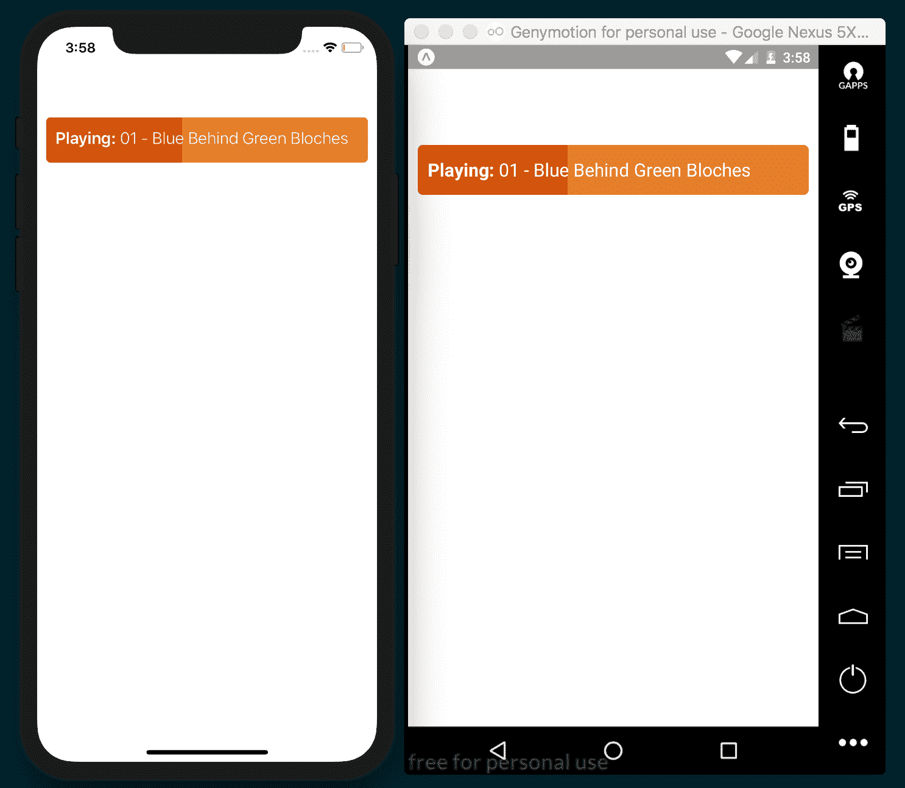
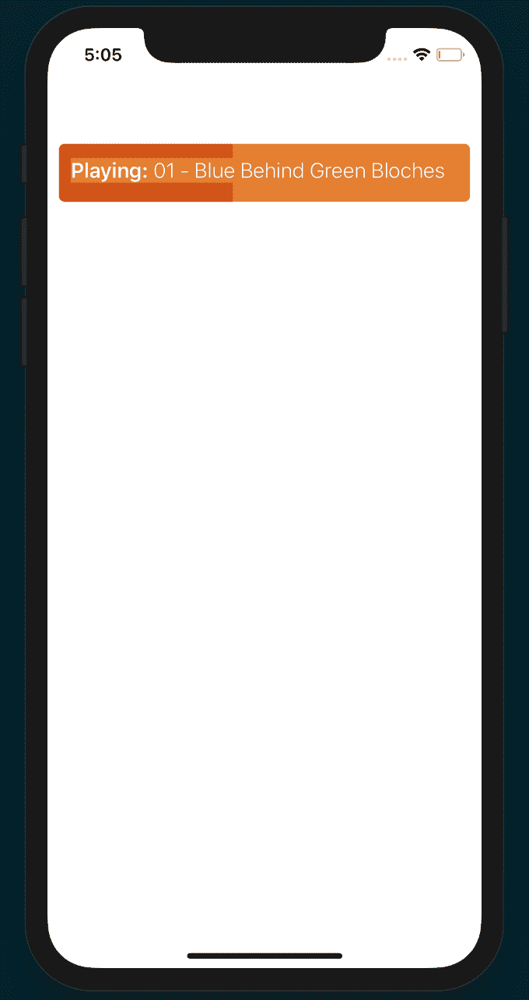
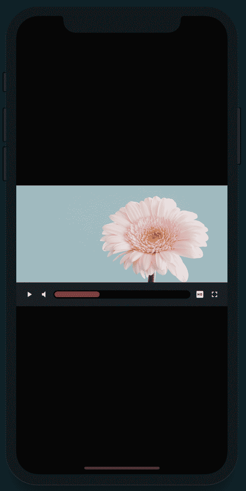
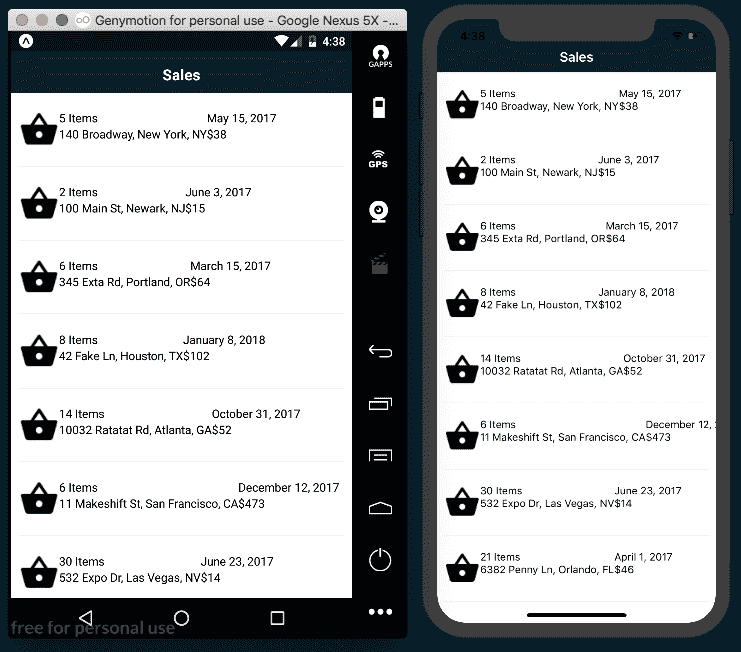
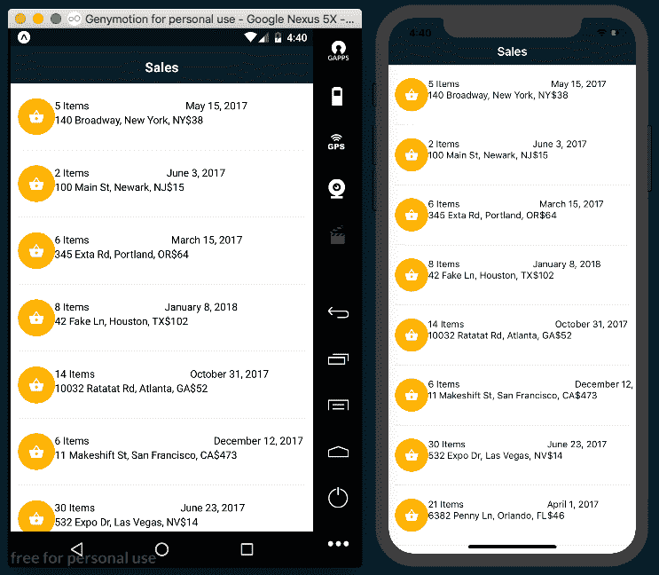
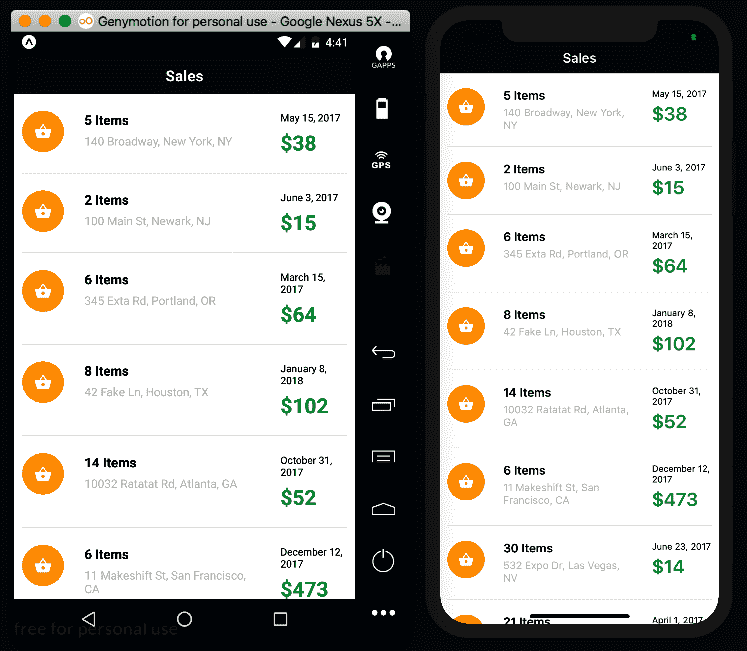
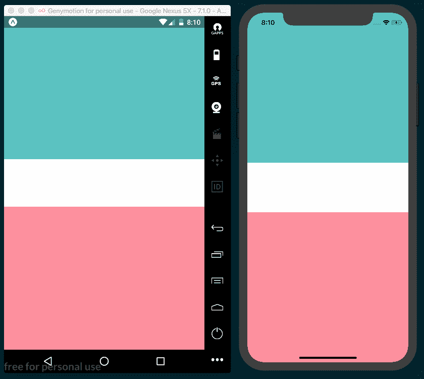
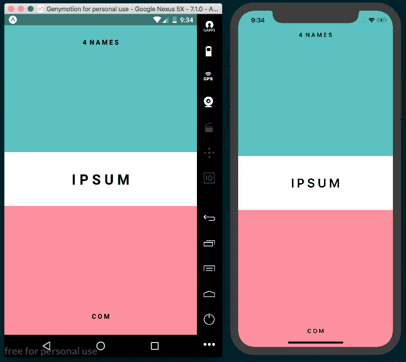
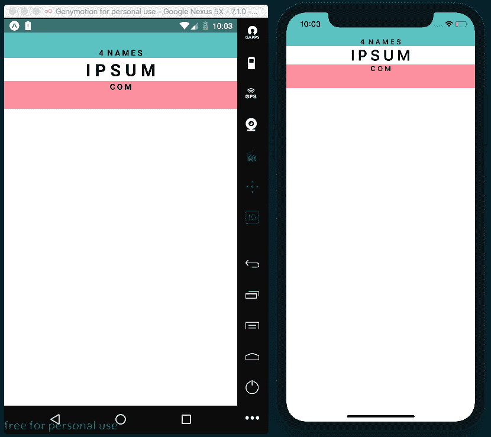
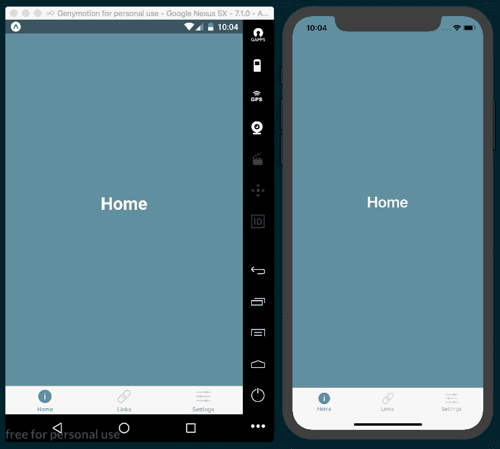

# 二、创建一个简单的本地应用

在本章中，我们将介绍以下配方：

*   向元素添加样式
*   使用图像模拟视频播放器
*   创建切换按钮
*   显示项目列表
*   使用 flexbox 创建布局
*   设置和使用导航

React Native 是一个快速增长的库。在过去几年中，它在开源社区中非常流行。通常每隔一周会有一个新的版本来提高性能、添加新组件或提供对设备上新 API 的访问。

在本章中，我们将了解库中最常见的组件。要逐步了解本章中的所有方法，我们必须创建一个新的应用，因此请确保您的环境已启动并运行

# 向元素添加样式

我们有几个组件可供使用，但容器和文本是创建布局或其他组件的最常见和最有用的组件。在本教程中，我们将了解如何使用容器和文本，但最重要的是，我们将了解样式在 React Native 中的工作方式。

# 准备

按照上一章中的说明创建新的应用。我们将此应用命名为`fake-music-player`。

使用 Expo 创建新应用时，少量样板代码将添加到`root`文件夹中的`App.js`文件中。这将是您构建的任何 React 本机应用的起点。在每个菜谱开始时，请随意删除所有样板文件，因为所有代码（包括在`App.js`样板文件中使用的内容）都将被讨论。

# 怎么做。。。

1.  在`App.js`文件中，我们将创建一个无状态组件。此组件将模拟小型音乐播放器。它将只显示歌曲的名称和一个显示进度的条。第一步是导入我们的依赖项：

```jsx
import React from 'react';
import { StyleSheet, Text, View } from 'react-native';
```

2.  导入依赖项后，我们可以构建组件：

```jsx
export default class App extends React.Component {
  render() {
    const name = '01 - Blue Behind Green Bloches';

    return (
      <View style={styles.container}>
        <View style={styles.innerContainer} />
        <Text style={styles.title}>
          <Text style={styles.subtitle}>Playing:</Text> {name}
        </Text>
      </View>
    );
  }
}
```

3.  我们已经准备好了组件，所以现在我们需要添加一些样式，以添加颜色和字体：

```jsx
const styles = StyleSheet.create({
  container: {
    margin: 10,
    marginTop: 100,
    backgroundColor: '#e67e22',
    borderRadius: 5,
  },
  innerContainer: {
    backgroundColor: '#d35400',
    height: 50,
    width: 150,
    borderTopLeftRadius: 5,
    borderBottomLeftRadius: 5,
  },
  title: {
    fontSize: 18,
    fontWeight: '200',
    color: '#fff',
    position: 'absolute',
    backgroundColor: 'transparent',
    top: 12,
    left: 10,
  },
  subtitle: {
    fontWeight: 'bold',
  },
});
```

4.  只要我们的模拟器和仿真器正在运行我们的应用，我们就会看到变化：



# 它是如何工作的。。。

在*步骤 1*中，我们包含了组件的依赖项。在本例中，我们使用了`View`，这是一个容器。如果您熟悉 web 开发，`View`与`div`类似。我们可以在其他`Views`、`Texts`、`Lists`以及我们创建或从第三方库导入的任何其他自定义组件中添加更多`Views`。

如果您熟悉 React，您会注意到，这是一个无状态组件，这意味着它没有任何状态；它是一个纯函数，不支持任何生命周期方法。

我们在组件中定义了一个`name`常数，但在实际应用中，这些数据应该来自道具。作为回报，我们将定义呈现组件所需的**JavaScript XML**（**JSX**）以及对样式的引用。

每个组件都有一个名为`style`的属性。此属性接收一个对象，该对象具有要应用于给定组件的所有样式。子组件不会继承样式（除了`Text`组件），这意味着我们需要为每个组件设置单独的样式。

在*步骤 3*中，我们定义了组件的样式。我们正在使用`StyleSheet`API 创建我们所有的样式。我们可以使用包含样式的普通对象，但是通过使用`StyleSheet`API 而不是对象，我们获得了一些性能优化，因为样式将被每个渲染器重用，而不是每次执行渲染方法时都创建一个对象。

# 还有更多。。。

我想提醒您注意*步骤 3*中`title`样式的定义。在这里，我们定义了一个名为`backgroundColor`的属性，并将`transparent`设置为其值。作为一个很好的练习，让我们对这行代码进行注释并查看结果：



在 iOS 上，文本的背景颜色为橙色，这可能不是我们真正希望在 UI 中出现的颜色。为了解决这个问题，我们需要将文本的背景色设置为透明。但问题是，为什么会发生这种情况？原因是 React Native 通过设置父级背景色的颜色来为文本添加一些优化。这将提高渲染性能，因为渲染引擎不必计算文本每个字母周围的像素，渲染将执行得更快。

Think carefully when setting the background color to `transparent`. If the component is going to be updating the content very frequently, there might be some performance issues with text, especially if the text is too long.

# 使用图像模拟视频播放器

图像是任何 UI 的重要组成部分，无论我们使用它们来显示图标、化身还是图片。在此配方中，我们将使用图像创建模拟视频播放器。我们还将显示本地设备的图标和远程服务器（由 Flickr 托管）的大图像。

# 准备

为了遵循此配方中的步骤，让我们创建一个新的应用。我们将把它命名为`fake-video-player`。

我们将在应用中显示一些图像来模拟视频播放器，因此您需要应用的相应图像。我建议使用我从 GitHub 上的这个配方的存储库下载的图标[https://github.com/warlyware/react-native-cookbook/tree/master/chapter-2/fake-video-player/images](https://github.com/warlyware/react-native-cookbook/tree/master/chapter-2/fake-video-player/images) 。

# 怎么做。。。

1.  我们要做的第一件事是在项目的根目录中创建一个名为`Images`的新文件夹。将下载的图像添加到新文件夹中。
2.  在`App.js`文件中，我们包含了该组件所需的所有依赖项：

```jsx
import React from 'react'; 
import { StyleSheet, View, Image } from 'react-native';
```

3.  我们需要`require`将在我们的组件中显示的图像。通过在常量中定义它们，我们可以在不同的位置使用相同的图像：

```jsx
const playIcon = require(img/play.png');
const volumeIcon = require(img/sound.png');
const hdIcon = require(img/hd-sign.png');
const fullScreenIcon = require(img/full-screen.png');
const flower = require(img/flower.jpg');
const remoteImage = { uri: `https://farm5.staticflickr.com/4702/24825836327_bb2e0fc39b_b.jpg` };
```

4.  我们将使用一个无状态组件来呈现 JSX。我们将使用在上一步中声明的所有图像：

```jsx
export default class App extends React.Component {
  render() {
    return (
      <View style={styles.appContainer}>
        <ImageBackground source={remoteImage} style=
         {styles.videoContainer} resizeMode="contain">
          <View style={styles.controlsContainer}>
            <Image source={volumeIcon} style={styles.icon} />
            <View style={styles.progress}>
              <View style={styles.progressBar} />
            </View>
            <Image source={hdIcon} style={styles.icon} />
            <Image source={fullScreenIcon} style={styles.icon} />
          </View>
        </ImageBackground>
      </View>
    );
  }
};
```

5.  一旦我们有了要渲染的元素，我们需要为每个元素定义样式：

```jsx
const styles = StyleSheet.create({
  flower: {
    flex: 1,
  },
  appContainer: {
    flex: 1,
    justifyContent: 'center',
    alignItems: 'center',
  },
  videoContainer: {
    backgroundColor: '#000',
    flexDirection: 'row',
    flex: 1,
    justifyContent: 'center',
    alignItems: 'center',
  },
  controlsContainer: {
    padding: 10,
    backgroundColor: '#202020',
    flexDirection: 'row',
    alignItems: 'center',
    marginTop: 175,
  },
  icon: {
    tintColor: '#fff',
    height: 16,
    width: 16,
    marginLeft: 5,
    marginRight: 5,
  },
  progress: {
    backgroundColor: '#000',
    borderRadius: 7,
    flex: 1,
    height: 14,
    margin: 4,
  },
  progressBar: {
    backgroundColor: '#bf161c',
    borderRadius: 5,
    height: 10,
    margin: 2,
    paddingTop: 3,
    width: 80,
    alignItems: 'center',
    flexDirection: 'row',
  },
});
```

6.  我们完了！现在，当您查看应用时，应该会看到如下内容：



# 它是如何工作的。。。

在*步骤 2*中，我们需要`Image`组件。这是负责从设备上的本地文件系统或远程服务器渲染图像的组件。

在*步骤 3*中，我们需要所有图像。最好的做法是要求组件外部的图像只需要一次。在每个渲染器上，React Native 将使用相同的图像。如果我们处理来自远程服务器的动态图像，那么我们需要在每个渲染器上都使用它们。

`require`函数接受图像路径作为参数。路径是相对于类所在的文件夹的。对于远程图像，我们需要使用一个对象来定义文件所在的位置`uri`。

在*步骤 4*中，声明了无状态组件。我们通过`ImageBackground`元素使用`remoteImage`作为应用的背景，因为`Image`元素不能有子元素。此元素的作用类似于 CSS 中的`background-url`属性。

`Image`的`source`属性接受加载远程图像的对象或对所需文件的引用。明确要求我们要使用的每个映像非常重要，因为当我们准备分发应用时，映像将自动添加到包中。这就是我们应该避免做任何动态操作的原因，例如：

```jsx
const iconName = playing ? 'pause' : 'play'; 
const icon = require(iconName); 
```

前面的代码将不包括最终捆绑包中的图像。因此，在尝试访问这些图像时会出现错误。相反，我们应该将代码重构为如下内容：

```jsx
const pause = require('pause'); 
const play = require('playing'); 
const icon = playing ? pause : play; 
```

这样，在准备分发应用时，捆绑包将包含这两个图像，并且我们可以决定在运行时动态显示哪个图像。

在*步骤 5*中，我们定义了样式。大多数属性都是不言自明的。尽管我们用于图标的图像是白色的，但我添加了`tintColor`属性来显示如何使用它来为图像着色。试试看！将`tintColor`更改为`#f00`并观看图标变为红色。

Flexbox 用于对齐布局的不同部分。React Native 中的 Flexbox 的行为与 web 开发中的基本相同。我们将在本章后面的*使用 flexbox 创建布局*配方中进一步讨论 flexbox，但 flexbox 本身的复杂性超出了本书的范围。

# 创建切换按钮

按钮是每个应用中必不可少的 UI 组件。在这个配方中，我们将创建一个切换按钮，默认情况下将取消选中该按钮。当用户点击按钮时，我们将更改应用于按钮的样式，使其显示为选中状态。

我们将学习如何检测点击事件，使用图像作为 UI，保持按钮的状态，以及根据组件状态添加样式。

# 准备

让我们创建一个新的应用。我们将把它命名为`toggle-button`。我们将在这个配方中使用一个图像。您可以从 GitHub 上托管的相应存储库[下载此配方的资产 https://github.com/warlyware/react-native-cookbook/tree/master/chapter-2/toggle-button/images](https://github.com/warlyware/react-native-cookbook/tree/master/chapter-2/toggle-button/images) 。

# 怎么做。。。

1.  我们将在项目根目录中创建一个名为`images`的新文件夹，并将心脏图像添加到新文件夹中。

2.  接下来，我们导入此类的依赖项：

```jsx
import React, { Component } from 'react';
import {
  StyleSheet,
  View,
  Image,
  Text,
  TouchableHighlight,
} from 'react-native';

const heartIcon = require(img/heart.png');
```

3.  对于这个配方，我们需要跟踪按钮是否被按下。为此，我们将使用具有`liked`布尔属性的`state`对象。初始类应如下所示：

```jsx
export default class App extends React.Component {
  state = {
    liked: false,
  };

  handleButtonPress = () => {
    // Defined in a later step
  }

  render() {
    // Defined in a later step
  }
}
```

4.  我们需要在`render`方法中定义新组件的内容。在这里，我们将定义`Image`按钮及其下方的`Text`元素：

```jsx
export default class App extends React.Component {
  state = {
    liked: false,
  };

  handleButtonPress = () => {
    // Defined in a later step
  }

  render() {
    return (
      <View style={styles.container}>
        <TouchableHighlight
          style={styles.button}
          underlayColor="#fefefe"
        >
          <Image
            source={heartIcon}
            style={styles.icon}
          />
        </TouchableHighlight>
        <Text style={styles.text}>Do you like this app?</Text>
      </View>
    );
  }
}
```

5.  让我们定义一些样式来设置尺寸、位置、边距、颜色等：

```jsx
const styles = StyleSheet.create({
  container: {
    marginTop: 50,
    alignItems: 'center',
  },
  button: {
    borderRadius: 5,
    padding: 10,
  },
  icon: {
    width: 180,
    height: 180,
    tintColor: '#f1f1f1',
  },
  liked: {
    tintColor: '#e74c3c',
  },
  text: {
    marginTop: 20,
  },
});
```

6.  当我们在模拟器上运行项目时，应该有类似于以下屏幕截图的内容：


7.  为了响应 tap 事件，我们需要定义`handleButtonPress`函数的内容，并将其分配为对`onPress`属性的回调：

```jsx
  handleButtonPress = () => {
    this.setState({
      liked: !this.state.liked,
    });
  }

  render() {
    return (
      <View style={styles.container}>
        <TouchableHighlight
          onPress={this.handleButtonPress}
          style={styles.button}
          underlayColor="#fefefe"
        >
          <Image
            source={heartIcon}
            style={styles.icon}
          />
        </TouchableHighlight>
        <Text style={styles.text}>Do you like this app?</Text>
      </View>
    );
  }
```

8.  如果我们测试代码，我们将不会看到 UI 上有任何变化，即使当我们按下按钮时组件的状态发生了变化。让我们在状态更改时为图像添加不同的颜色。这样，我们将能够看到来自 UI 的响应：

```jsx
  render() {
 const likedStyles = this.state.liked ? styles.liked : undefined; 
    return (
      <View style={styles.container}>
        <TouchableHighlight
          onPress={this.handleButtonPress}
          style={styles.button}
          underlayColor="#fefefe"
        >
          <Image
            source={heartIcon}
 style={[styles.icon, likedStyles]}          />
        </TouchableHighlight>
        <Text style={styles.text}>Do you like this app?</Text>
      </View>
    );
  }
```

# 它是如何工作的。。。

在*步骤 2*中，我们导入了`TouchableHighlight`组件。这是负责处理触摸事件的组件。当用户触摸活动区域时，内容将根据我们设置的`underlayColor`值高亮显示。

在*步骤 3*中，我们定义了`Component`的状态。在本例中，状态上只有一个属性，但我们可以根据需要添加任意多个属性。在[第 3 章](02.html)中*实现复杂用户界面–第一部分*中，我们将看到更多关于在更复杂场景中处理状态的方法。

在*步骤 6*中，我们使用`setState`方法更改`liked`属性的值。此方法继承自我们正在扩展的`Component`类。

在*步骤 7*中，根据`liked`属性的当前状态，我们使用样式将图像的颜色设置为红色，或者返回`undefined`以避免应用任何样式。在将样式分配给`Image`组件时，我们使用了一个数组来分配许多对象。这非常方便，因为组件将在内部将所有样式合并到单个对象中。索引最高的对象将覆盖数组中索引最低的对象的属性：


# 还有更多。。。

在实际应用中，我们将使用几个按钮，有时会有一个向左对齐的图标、一个标签、不同的大小、颜色等等。强烈建议创建一个可重用组件，以避免在整个应用中重复代码。在[第 3 章](02.html)*实现复杂用户界面–第一部分*中，我们将创建一个按钮组件来处理其中一些场景。

# 显示项目列表

列表无处不在：用户历史记录中的订单列表、商店中可用物品列表、要播放的歌曲列表。几乎任何应用都需要在列表中显示某种信息。

对于这个配方，我们将在`list`组件中显示几个项目。我们将用一些数据定义一个 JSON 文件，然后我们将使用一个简单的`require`加载这个文件，最终用一个漂亮但简单的布局呈现每个项目。

# 准备

让我们先创建一个空的应用。我们将此应用命名为`list-items`。我们需要在每个项目上显示一个图标。获取图像的最简单方法是从 GitHub 上托管的该配方存储库下载图像，地址为[https://github.com/warlyware/react-native-cookbook/tree/master/chapter-2/list-items/images](https://github.com/warlyware/react-native-cookbook/tree/master/chapter-2/list-items/images) 。

# 怎么做。。。

1.  我们将首先创建一个`images`文件夹并向其中添加`basket.png`。另外，在项目的根目录中创建一个名为`sales.json`的空文件。

2.  在`sales.json`文件中，我们将定义要在列表中显示的数据。以下是一些示例数据：

```jsx
[
  {
    "items": 5,
    "address": "140 Broadway, New York, NY 11101",
    "total": 38,
    "date": "May 15, 2016"
  }
]
```

3.  为了避免本书的页面混乱，我只定义了一条记录，但请继续向数组中添加更多内容。复制和粘贴同一对象多次将达到此目的。此外，您可以更改数据上的某些值，以便每个项目在 UI 中显示唯一的数据。

4.  在我们的`App.js`文件中，让我们导入需要的依赖项：

```jsx
import React, { Component } from 'react'; import {
  StyleSheet,
  View, 
  ListView, 
  Image, 
  Text,
} from 'react-native'; 
import data from './sales.json'; 

const basketIcon = require(img/basket.png');
```

5.  现在，我们需要创建类来呈现项目列表。我们将保留该州的销售数据；这样，我们可以轻松插入或删除元素：

```jsx
export default class App extends React.Component {
  constructor(props) {
    super(props);
    const dataSource = new ListView.DataSource({
      rowHasChanged: (r1, r2) => r1 !== r2
    });

    this.state = {
      dataSource: dataSource.cloneWithRows(data),
    };
  }

  renderRow(record) {
    // Defined in a later step
  }

  render() {
    // Defined in a later step
  }
}
```

6.  在`render`方法中，我们需要定义`ListView`组件，我们将使用`renderRow`方法渲染每个项目。`dataSource`属性定义我们将在列表中呈现的元素数组：

```jsx
render() {
  return (
    <View style={styles.mainContainer}>
      <Text style={styles.title}>Sales</Text>
      <ListView dataSource={this.state.dataSource} renderRow={this.renderRow} />
    </View>
  );
}
```

7.  现在，我们可以定义`renderRow`的内容。此方法接收包含我们需要的所有信息的每个对象。我们将在三列中显示数据。在第一列中，我们将显示一个图标；在第二列中，我们将显示每次销售的商品数量以及此订单的发货地址；第三列将显示日期和总数：

```jsx
    return ( 
      <View style={styles.row}> 
        <View style={styles.iconContainer}> 
          <Image source={basketIcon} style={styles.icon} /> 
        </View> 
        <View style={styles.info}> 
          <Text style={styles.items}>{record.items} Items</Text> 
          <Text style={styles.address}>{record.address}</Text> 
        </View> 
        <View style={styles.total}> 
          <Text style={styles.date}>{record.date}</Text> 
          <Text style={styles.price}>${record.total}</Text> 
        </View> 
      </View> 
    ); 
```

8.  一旦定义了 JSX，就可以添加样式了。首先，我们将为主容器、标题和行容器定义颜色、边距、填充等。为了为每行创建三列，我们需要使用`flexDirection: 'row'`属性。我们将在本章后面的*使用 flexbox 创建布局*配方中了解更多关于此属性的信息：

```jsx
const styles = StyleSheet.create({
  mainContainer: {
    flex: 1,
    backgroundColor: '#fff',
  },
  title: {
    backgroundColor: '#0f1b29',
    color: '#fff',
    fontSize: 18,
    fontWeight: 'bold',
    padding: 10,
    paddingTop: 40,
    textAlign: 'center',
  },
  row: {
    borderColor: '#f1f1f1',
    borderBottomWidth: 1,
    flexDirection: 'row',
    marginLeft: 10,
    marginRight: 10,
    paddingTop: 20,
    paddingBottom: 20,
  },
});
```

9.  如果我们刷新模拟器，我们将看到类似于以下屏幕截图的内容：



10.  现在，在`StyleSheet`定义中，让我们为图标添加样式。我们将添加一个黄色圆圈作为背景，并将图标颜色更改为白色：

```jsx
  iconContainer: {
    alignItems: 'center',
    backgroundColor: '#feb401',
    borderColor: '#feaf12',
    borderRadius: 25,
    borderWidth: 1,
    justifyContent: 'center',
    height: 50,
    width: 50,
  },
  icon: {
    tintColor: '#fff',
    height: 22,
    width: 22,
  },
```

11.  更改后，我们将在每行的左侧看到一个漂亮的图标，如以下屏幕截图所示：



12.  最后，我们将为文本添加样式。我们需要设置`color`、`size`、`fontWeight`、`padding`等几个属性：

```jsx
  info: { 
    flex: 1, 
    paddingLeft: 25, 
    paddingRight: 25, 
  }, 
  items: { 
    fontWeight: 'bold', 
    fontSize: 16, 
    marginBottom: 5, 
  }, 
  address: { 
    color: '#ccc', 
    fontSize: 14, 
  }, 
  total: { 
    width: 80, 
  }, 
  date: { 
    fontSize: 12, 
    marginBottom: 5, 
  }, 
  price: { 
    color: '#1cad61', 
    fontSize: 25, 
    fontWeight: 'bold', 
  }  
```

13.  最终结果应类似于以下屏幕截图：



# 它是如何工作的。。。

在*步骤 5*中，我们创建了数据源并将数据添加到状态。`ListView.DataSource`类实现`ListView`组件的性能数据处理。`rowHasChanged`属性是必需的，它应该是比较下一个元素的函数。在我们的例子中，如果更改与当前数据不同（表示为`(r1, r2) => r1 !== r2`，则 React Native 将知道如何响应并重新呈现 UI。

在用数据填充数据源时，我们需要调用`cloneWithRows`方法并发送一个记录数组。

如果我们想添加更多的数据，我们应该使用一个包含先前和新数据的数组再次调用`cloneWithRows`方法。数据源将确保计算差异，并根据需要重新呈现列表。

在*步骤 7*中，我们定义 JSX 来呈现列表。列表只需要两个属性：我们已经从*步骤 6*和`renderRow`获得的数据源。

`renderRow`属性接受函数作为值。此函数需要为每一行返回 JSX。

# 还有更多。。。

我们使用 flexbox 创建了一个简单的布局；然而，本章中还有另一个配方，我们将深入了解使用 flexbox 的更多细节。

一旦我们有了清单，我们很可能需要查看每个订单的详细信息。您可以使用`TouchableHighlight`组件作为每行的主容器，因此请继续尝试。如果您不确定如何使用`TouchableHighlight`组件，请查看本章前面的*创建切换按钮*配方。

# 使用 flexbox 创建布局

在本食谱中，我们将了解 flexbox。在本章前面的配方中，我们一直在使用 flexbox 创建布局，但在本配方中，我们将通过从应用商店上名为*命名器*（[的随机名称生成器应用中重新创建布局，重点关注我们可以使用的属性 https://itunes.apple.com/us/app/nominazer/id765422087?mt=8](https://itunes.apple.com/us/app/nominazer/id765422087?mt=8) ）。

在 React Native 中使用 flexbox 与在 CSS 中使用 flexbox 基本相同。这意味着，如果您喜欢使用 flexbox 布局开发网站，那么您已经知道如何在 React Native 中创建布局了！本练习将介绍在 React Native 中使用 flexbox 的基本知识，但有关您可以使用的所有布局道具的列表，请参阅关于布局道具的文档（[https://facebook.github.io/react-native/docs/layout-props.html](https://facebook.github.io/react-native/docs/layout-props.html) ）。

# 准备

让我们先创建一个新的空白应用。我们将把它命名为`flexbox-layout`

# 怎么做。。。

1.  在`App.js`中，让我们导入应用所需的依赖项：

```jsx
import React from 'react';
import { StyleSheet, Text, View } from 'react-native';
```

2.  我们的应用只需要一个`render`方法，因为我们正在构建一个静态布局。呈现的布局由一个容器`View`元素和应用每个彩色部分的三个子`View`元素组成：

```jsx
export default class App extends React.Component { 
 render() { 
  return ( 
    <View style={styles.container}> 
      <View style={styles.topSection}> </View> 
       <View style={styles.middleSection}></View> 
       <View style={styles.bottomSection}></View> 
    </View> ); 
  } 
 }
```

3.  接下来，我们可以开始添加我们的样式。我们将添加的第一个样式将应用于包装整个应用的`View`元素。将`flex`属性设置为`1`将导致所有子元素填充所有空白空间：

```jsx
const styles = StyleSheet.create({
  container: {
    flex: 1,
  }
});
```

4.  现在，我们可以为三个子`View`元素添加样式。每个节都有一个应用于它的`flexGrow`属性，它指示每个元素应该占用多少可用空间。`topSection`和`bottomSection`都设置为`3`，因此它们将占用相同的空间量。由于`middleSection`将`flexGrow`属性设置为`1`，因此该元素将占据`topSection`和`bottomSection`所占空间的三分之一：

```jsx
  topSection: {
    flexGrow: 3,
    backgroundColor: '#5BC2C1',
  },
  middleSection: {
    flexGrow: 1,
    backgroundColor: '#FFF',
  },
  bottomSection: {
    flexGrow: 3,
    backgroundColor: '#FD909E',
  },
```

5.  如果我们在模拟器中打开应用，我们应该已经能够看到基本布局的形成：



6.  在这里，我们可以向*步骤 2*中创建的三个子`View`元素中的每一个添加`Text`元素。注意：新添加的代码已突出显示：

```jsx
  render() {
    return (
      <View style={styles.container}>
        <View style={styles.topSection}>
 <Text style={styles.topSectionText}>
            4  N A M E S
          </Text>
        </View>
        <View style={styles.middleSection}>
 <Text style={styles.middleSectionText}>
 I P S U M
 </Text>
        </View>
        <View style={styles.bottomSection}>
 <Text style={styles.bottomSectionText}>
            C O M
          </Text>
        </View>
      </View>
    );
  }
```

7.  每个部分的文本默认位于该部分的左上角。我们可以使用 flexbox 将这些元素中的每一个对齐到所需的位置。所有三个子`View`元素的`alignItems`flex 属性都设置为`'center'`，这将导致每个元素的子元素沿*x*轴居中。中间和底部部分使用`justifyContent`来定义子元素应如何沿*y*轴对齐：

```jsx
onst styles = StyleSheet.create({
  container: {
    flex: 1,
  },
  topSection: {
    flexGrow: 3,
    backgroundColor: '#5BC2C1',
 alignItems: 'center',
  },
  middleSection: {
    flexGrow: 1,
    backgroundColor: '#FFF',
 justifyContent: 'center',
    alignItems: 'center',
  },
  bottomSection: {
    flexGrow: 3,
    backgroundColor: '#FD909E',
 alignItems: 'center',
    justifyContent: 'flex-end'
  }
});
```

8.  剩下要做的就是在`Text`元素中添加基本样式，以增加`fontSize`、`fontWeight`和所需的`margin`：

```jsx
  topSectionText: {
    fontWeight: 'bold',
    marginTop: 50
  },
  middleSectionText: {
    fontSize: 30,
    fontWeight: 'bold'
  },
  bottomSectionText: {
    fontWeight: 'bold',
    marginBottom: 30
  }
```

9.  如果我们在模拟器中打开应用，我们应该能够看到完整的布局：



# 它是如何工作的。。。

我们的应用看起来非常好，使用 flexbox 很容易实现。我们通过将`flexGrow`属性分别设置为`3`、`1`和`3`，使用占据屏幕不同部分的`View`元素创建了三个不同的部分。这使得顶部和底部的垂直尺寸相等，中间部分的尺寸为顶部和底部的三分之一。

使用 flexbox 时，我们有两个方向来布局子内容，`row`和`column`：

*   `row`：这允许我们水平排列容器的子级。
*   `column`：这允许我们垂直排列容器的子级。这是 React Native 中的默认方向。

当设置`flex: 1`时，就像我们对容器`View`元素所做的那样，我们告诉该元素占用所有可用空间。如果我们移除`flex: 1`或将`flex`设置为`0`，我们可以看到布局本身崩溃，因为容器不再弯曲进入所有的空白空间：



Flexbox 也非常适合支持不同的屏幕分辨率。即使不同的设备可能有不同的分辨率，我们也可以确保在任何设备上都能保持一致的布局。

# 还有更多。。。

flexbox 在 React Native 中的工作方式与在 CSS 中的工作方式存在一些差异。首先，CSS 中的默认`flexDirection`属性是`row`，而 React Native 中的默认`flexDirection`属性是`column`。

`flex`属性在 React Native 中的行为也有点不同。不必将`flex`设置为字符串值，可以将其设置为正整数、`0`或`-1`。正如官方文件所述：

When flex is a positive number, it makes the component flexible and it'll be sized proportional to its flex value. So, a component with flex set to 2 will take twice the space as a component with flex set to 1\. When flex is 0, the component is sized according to width and height and is inflexible. When flex is -1, the component is normally sized according width and height. However, if there's not enough space, the component will shrink to its minWidth and minHeight.

关于 flexbox 还有很多要说的，但是现在我们已经把脚弄湿了。在[第 3 章](02.html)*实现复杂用户界面–第一部分*中，我们将了解更多关于布局的信息。我们将了解有关布局的更多信息，并将创建一个使用更多可用布局属性的复杂布局。

# 另见

*   React 本地布局道具文档（[https://facebook.github.io/react-native/docs/layout-props.html](https://facebook.github.io/react-native/docs/layout-props.html) ）
*   React 原生文本风格道具文档（[https://facebook.github.io/react-native/docs/text-style-props.html](https://facebook.github.io/react-native/docs/text-style-props.html) ）
*   瑜伽（[https://github.com/facebook/yoga](https://github.com/facebook/yoga) -React Native 使用 Facebook 的 Flexbox 实现
*   一篇优秀的堆栈溢出文章，介绍 React 原生 flex 属性的工作原理，并附有示例-[https://stackoverflow.com/questions/43143258/flex-vs-flexgrow-vs-flexshrink-vs-flexbasis-in-react-native](https://stackoverflow.com/questions/43143258/flex-vs-flexgrow-vs-flexshrink-vs-flexbasis-in-react-native)

# 设置和使用导航

对于具有多个视图的任何应用，导航系统至关重要。在应用开发中，导航的需求非常普遍，因此在创建新应用时，Expo 会提供两个模板：**空白**或**选项卡导航**。此配方基于 Expo 提供的 Tab Navigation 应用模板的精简版本。我们仍将以一个空白应用开始配方，从头开始构建我们的基本 Tab Navigation 应用，以更好地理解所有必要部分。完成本食谱后，我鼓励您使用选项卡导航模板启动一个新的应用，以查看我们将在后面章节中介绍的一些更高级的功能，包括推送通知和堆栈导航。

# 准备

让我们继续创建一个名为`simple-navigation`的新空白应用。我们还需要一个第三方软件包来处理我们的导航。我们将使用 1.5.9 版本的`react-navigation`包。使用此软件包的较新版本将无法正确处理此代码，因为该软件包的 API 最近发生了重大更改。。在终端中，导航到新项目的根目录，并使用以下命令安装此软件包：

```jsx
yarn add react-navigation@1.5.9
```

这就是我们需要的全部设置。让我们建造！

# 怎么做。。。

1.  在`App.js`文件中，让我们导入依赖项：

```jsx
import React from 'react';
import { StyleSheet, View } from 'react-native';
```

2.  这个应用的`App`组件将非常简单。我们只需要一个带有呈现应用容器的`render`函数的`App`类。我们还将添加填充窗口和添加白色背景的样式：

```jsx
export default class App extends React.Component {
  render() {
    return (
      <View style={styles.container}>
      </View>
   );
 }
}

const styles = StyleSheet.create({
  container: {
    flex: 1,
    backgroundColor: '#fff',
  }
});
```

3.  `App.js`的下一步是导入并使用`MainTabNavigator`组件，这是我们将在*步骤 4*中创建的新组件：

```jsx
React.Component {
  render() {
    return (
      <View style={styles.container}>
        <MainTabNavigator />
      </View>
    );
  }
}
```

4.  我们需要为`MainTabNavigator`组件创建一个新文件。让我们在项目的根目录中创建一个名为`navigation`的新文件夹。在这个新文件夹中，我们将为导航组件创建`MainTabNavigator.js`。
5.  在`MainTabNavigator.js`中，我们可以导入导航所需的所有依赖项。依赖项包括三个屏幕（`HomeScreen`、`LinksScreen`和`SettingsScreen`。我们将在后面的步骤中添加这些屏幕：

```jsx
import React from 'react';
import { Ionicons } from '@expo/vector-icons';
import { TabNavigator, TabBarBottom } from 'react-navigation';

import HomeScreen from '../screens/HomeScreen';
import LinksScreen from '../screens/LinksScreen';
import SettingsScreen from '../screens/SettingsScreen';
```

6.  我们的导航组件将使用`react-navigation`提供的`TabNavigator`方法为我们的应用定义路线和导航。`TabNavigator`采用两个参数：一个`RouteConfig`对象定义每条路线，一个`TabNavigatorConfig`对象定义我们`TabNavigator`组件的选项：

```jsx
export default TabNavigator({
    // RouteConfig, defined in step 7.
}, {
    // TabNavigatorConfig, defined in steps 8 and 9.
});
```

7.  首先，我们将定义`RouteConfig`对象，它将为我们的应用创建一个路线图。`RouteConfig`对象中的每个键都作为路由的名称。我们将每个路由的屏幕属性设置为要在该路由上显示的相应屏幕组件：

```jsx
export default TabNavigator({
 Home: {
    screen: HomeScreen,
  },
  Links: {
    screen: LinksScreen,
  },
  Settings: {
    screen: SettingsScreen,
  },
}, {
  // TabNavigatorConfig, defined in steps 8 and 9\. 
});
```

8.  `TabNavigatorConfig`还有一点。我们将`react-navigation`提供的`TabBarBottom`组件传递给`tabBarComponent`属性，以声明我们要使用哪种选项卡栏（在本例中，是为屏幕底部设计的选项卡栏）。`tabBarPosition`定义该栏是在屏幕顶部还是底部。`animationEnabled`指定是否设置了动画转换，以及`swipeEnabled`声明是否可以通过滑动更改视图：

```jsx
export default TabNavigator({
    // Route Config, defined in step 7\. 
}, {
  navigationOptions: ({ navigation }) => ({
    // navigationOptions, defined in step 9.
  }),
  tabBarComponent: TabBarBottom,
  tabBarPosition: 'bottom',
  animationEnabled: false,
  swipeEnabled: false,
});
```

9.  在`TabNavigatorConfig`对象的`navigationOptions`属性中，我们将通过声明一个函数来为每个路由定义动态`navigationOptions`，该函数为当前路由/屏幕使用导航道具。我们可以使用此函数来决定选项卡栏在每个路由/屏幕上的行为，因为它被设计为返回一个为相应屏幕设置`navigationOptions`的对象。我们将使用此模式定义每个路由的`tabBarIcon`属性的外观：

```jsx
  navigationOptions: ({ navigation }) => ({
    tabBarIcon: ({ focused }) => {
      // Defined in step 10
    },
  }),
```

10.  `tabBarIcon`属性设置为一个函数，该函数的参数为当前路线的道具。我们将使用`focused`道具来决定是渲染彩色 in 图标还是渲染轮廓图标，具体取决于当前路线。我们通过`navigation.state`从导航道具获取`routeName`，为三条路线中的每一条定义图标，并返回相应路线的渲染图标。我们将使用世博会提供的`Ionicons`组件创建每个图标，并根据图标的路线是否为`focused`定义图标的颜色：

```jsx
  navigationOptions: ({ navigation }) => ({
    tabBarIcon: ({ focused }) => {
 const { routeName } = navigation.state;

      let iconName;
      switch (routeName) {
        case 'Home':
          iconName = `ios-information-circle`;
          break;
        case 'Links':
          iconName = `ios-link`;
          break;
        case 'Settings':
          iconName = `ios-options`;
      }
      return (
        <Ionicons name={iconName}
          size={28} style={{marginBottom: -3}}
          color={focused ? Colors.tabIconSelected :
          Colors.tabIconDefault}
        />
      );
    },
  }),
```

11.  设置`MainTabNavigator`的最后一步是创建用于为每个图标着色的`Colors`常量：

```jsx
const Colors = {
  tabIconDefault: '#ccc',
  tabIconSelected: '#2f95dc',
}
```

12.  我们的路线现在完成了！现在只剩下为我们在`MainTabNavigator.js`中导入和定义的三条路线中的每一条创建三个屏幕组件。为了简单起见，三个屏幕中的每个屏幕都有相同的代码，除了背景色和识别文本。
13.  在项目的根目录中，我们需要创建一个`screens`文件夹来存放我们的三个屏幕。在新文件夹中，我们需要制作`HomeScreen.js`、`LinksScreen.js`和`SettingsScreen.js`。
14.  让我们首先打开新创建的`HomeScreen.js`并添加必要的依赖项：

```jsx
import React from 'react';
import {
  StyleSheet,
  Text,
  View,
} from 'react-native';
```

15.  Apple T0.组件本身非常简单，只是一个全色页面，在屏幕中间有一个单词“Tyl T1”，以显示我们当前正在使用的屏幕：

```jsx
export default class HomeScreen extends React.Component {
  render() {
    return (
      <View style={styles.container}>
        <Text style={styles.headline}>
          Home
        </Text>
      </View>
    );
  }
}
```

16.  我们还需要为`Home`屏幕布局添加样式：

```jsx
const styles = StyleSheet.create({
  container: {
    flex: 1,
    alignItems: 'center',
    justifyContent: 'center',
    backgroundColor: '#608FA0',
  },
  headline: {
    fontWeight: 'bold',
    fontSize: 30,
    color: 'white',
  }
});
```

17.  现在剩下的就是对剩下的两个屏幕重复*步骤 14*、*步骤 15*和*步骤 16*，并进行一些小的更改。`LinksScreen.js`应该像`HomeScreen.js`一样，更新了以下突出显示的部分：

```jsx
import React from 'react';
import {
  StyleSheet,
  Text,
  View,
} from 'react-native';

export default class LinksScreen extends React.Component {
  render() {
    return (
      <View style={styles.container}>
        <Text style={styles.headline}>
 Links
        </Text>
      </View>
    );
  }
}

const styles = StyleSheet.create({
  container: {
    flex: 1,
    alignItems: 'center',
    justifyContent: 'center',
 backgroundColor: '#F8759D',  },
  headline: {
    fontWeight: 'bold',
    fontSize: 30,
    color: 'white',
  }
});
```

18.  同样，在`SettingsScreen.js`中，我们可以使用与前两个屏幕相同的结构创建第三个屏幕组件：

```jsx
import React from 'react';
import {
  StyleSheet,
  Text,
  View,
} from 'react-native';

export default class SettingsScreen extends React.Component {
  render() {
    return (
      <View style={styles.container}>
        <Text style={styles.headline}>
          Settings
        </Text>
      </View>
    );
  }
}

const styles = StyleSheet.create({
  container: {
    flex: 1,
    alignItems: 'center',
    justifyContent: 'center',
 backgroundColor: '#F0642E',
  },
  headline: {
    fontWeight: 'bold',
    fontSize: 30,
    color: 'white',
  }
});
```

19.  我们的申请完成了！当我们在模拟器中查看应用时，它应该在屏幕底部有一个选项卡栏，在三条路径之间切换：



# 它是如何工作的。。。

在本教程中，我们介绍了本机应用中最常见和最基本的导航模式之一，即选项卡栏。React 导航库是一个非常强大、功能丰富的导航解决方案，很可能能够为您的应用提供所需的任何类型的导航。我们将在[第三章](02.html)*实现复杂用户
界面第一部分*中介绍 React 导航的更多用途

# 另见

*   反应导航官方文件（[https://reactnavigation.org/](https://reactnavigation.org/) ）
*   世博会路线和导航指南（[https://docs.expo.io/versions/latest/guides/routing-and-navigation.html](https://docs.expo.io/versions/latest/guides/routing-and-navigation.html) ）