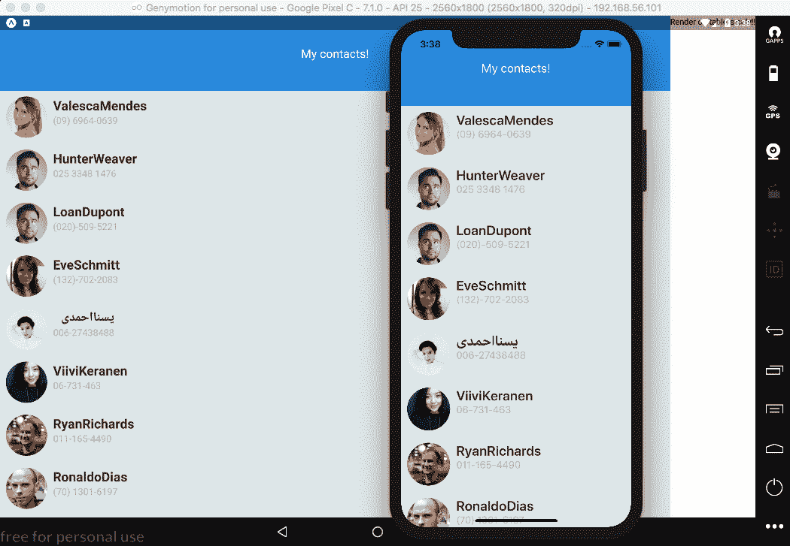
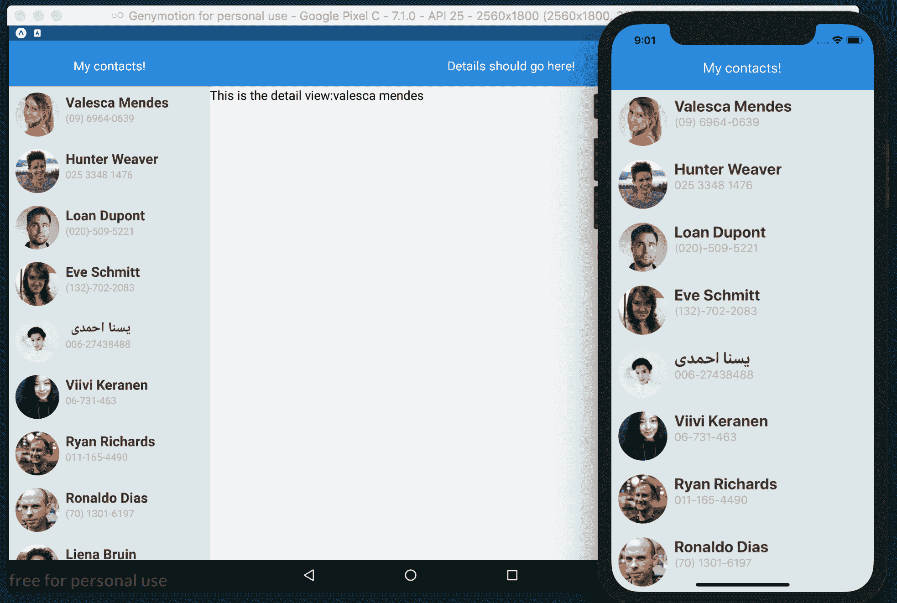
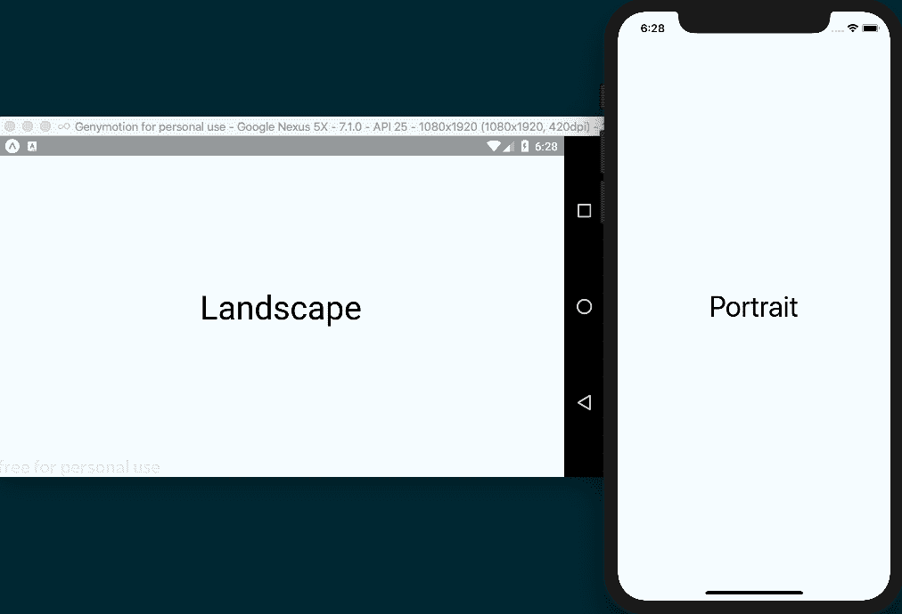
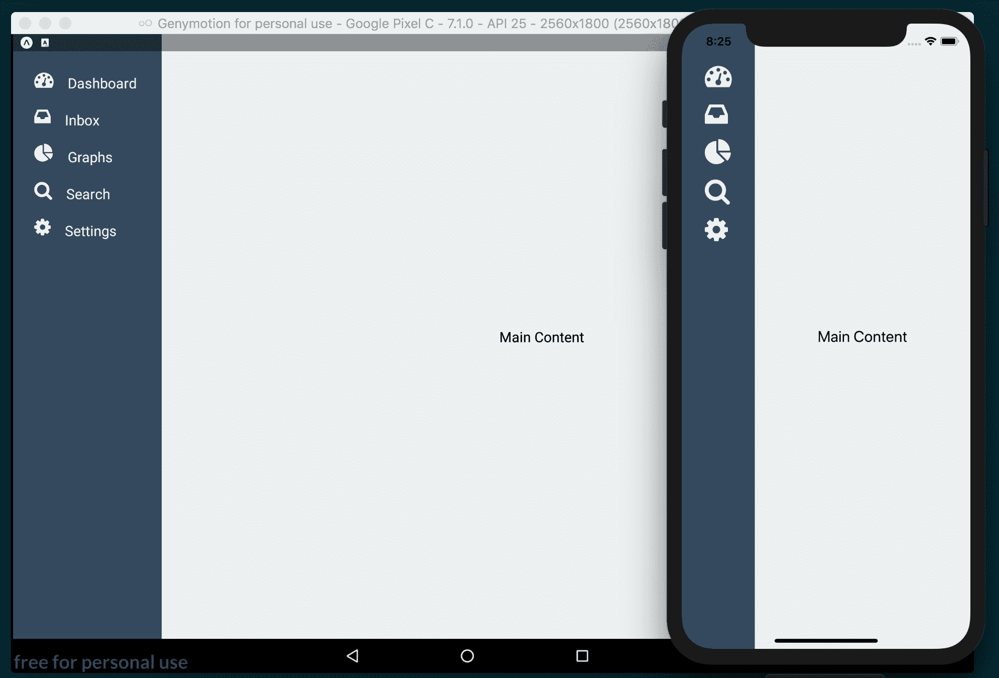
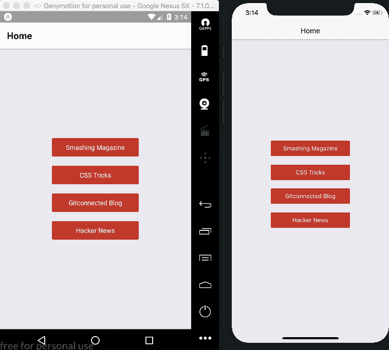
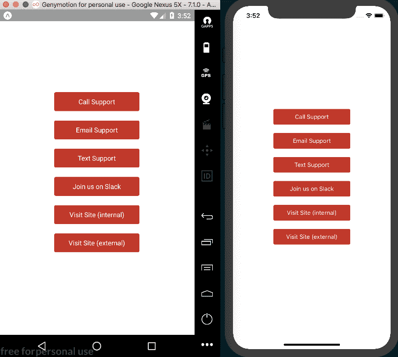

# 四、实现复杂用户界面——第二部分

本章将介绍更多使用 React Native 构建 UI 的方法。我们将首先了解链接到其他应用和网站、处理设备方向的变化以及如何构建用于收集用户输入的表单。

在本章中，我们将介绍以下配方：

*   处理通用应用
*   检测方向变化
*   使用 WebView 嵌入外部网站
*   链接到网站和其他应用
*   创建表单组件

# 处理通用应用

使用 React Native 的好处之一是它能够轻松创建通用应用。我们可以在手机和平板电脑应用之间共享大量代码。根据设备的不同，布局可能会发生变化，但我们可以跨布局重用这两种类型设备的代码片段。

在此配方中，我们将构建一个在手机和平板电脑上运行的应用。平板电脑版本将包括不同的布局，但我们将重用相同的内部组件。

# 准备

对于此配方，我们将显示联系人列表。现在，我们将从`.json`文件加载数据。我们将在后面的章节中探讨如何从**代表性状态传输**（**REST**API）加载远程数据。

让我们打开下面的 URL，并将生成的 JSON 复制到项目根目录下名为`data.json`的文件中。我们将使用此数据呈现联系人列表。在[处返回一个伪用户数据的 JSON 对象 http://api.randomuser.me/?results=20](http://api.randomuser.me/?results=20) 。

让我们创建一个名为`universal-app`的新应用。

# 怎么做。。。

1.  让我们打开`App.js`并导入此应用中需要的依赖项，以及我们在前面的*准备*部分中创建的`data.json`文件。我们还将从`./utils/Device`导入`Device`实用程序，我们将在后面的步骤中构建该实用程序：

```jsx
import React, { Component } from 'react';
import { StyleSheet, View, Text } from 'react-native';
import Device from './utils/Device';

import data from './data.json';
```

2.  在这里，我们将创建主`App`组件及其基本布局。这个顶级组件将决定是呈现手机还是平板电脑 UI。我们只呈现两个`Text`元素。`renderDetail`文本应仅在平板电脑上显示，`renderMaster`文本应在手机和平板电脑上显示：

```jsx
export default class App extends Component {
  renderMaster() {
    return (
      <Text>Render on phone and tablets!!</Text>
    );
  }

  renderDetail() {
    if (Device.isTablet()) {
      return (
        <Text>Render on tablets only!!</Text>
      );
    }
  }

  render() {
    return (
      <View style={styles.content}>
        {this.renderMaster()}
        {this.renderDetail()}
      </View>
    );
  }
}
```

3.  在`App`组件下，我们将添加一些基本样式。样式暂时包括`paddingTop: 40`，以便我们呈现的文本不会被设备的系统栏重叠：

```jsx
const styles = StyleSheet.create({
  content: {
    paddingTop: 40,
    flex: 1,
    flexDirection: 'row',
  },
});
```

4.  如果我们尝试按原样运行我们的应用，它将失败，并出现一个错误，告诉我们无法找到`Device`模块，因此让我们创建它。此实用程序类的目的是根据屏幕尺寸计算当前设备是手机还是平板电脑。它将有一个`isTablet`方法和一个`isPhone`方法。我们需要在项目的根目录中创建一个`utils`文件夹，并为实用程序添加一个`Device.js`。现在我们可以添加实用程序的基本结构：

```jsx
import { Dimensions, Alert } from 'react-native';

// Tablet portrait dimensions
const tablet = {
  width: 552,
  height: 960,
};

class Device {
  // Added in next steps
}

const device = new Device();
export default device;
```

5.  让我们通过创建两种方法开始构建该实用程序：一种是在纵向中获取维度，另一种是在横向中获取维度。根据设备旋转，`width`和`height`的值将发生变化，这就是为什么我们需要这两种方法来始终获得正确的值，无论设备是`landscape`还是`portrait`：

```jsx
class Device {
 getPortraitDimensions() {
    const { width, height } = Dimensions.get("window");

    return {
      width: Math.min(width, height),
      height: Math.max(width, height),
    };
  }

  getLandscapeDimensions() {
    const { width, height } = Dimensions.get("window");

    return {
      width: Math.max(width, height),
      height: Math.min(width, height),
    };
  }
}
```

6.  现在，让我们创建应用将用于确定应用是在平板电脑上运行还是在手机上运行的两种方法。要计算此值，我们需要在纵向模式下获取尺寸，并将其与我们为平板电脑定义的尺寸进行比较：

```jsx
  isPhone() {
    const dimension = this.getPortraitDimensions();
    return dimension.height < tablet.height;
  }

  isTablet() {
    const dimension = this.getPortraitDimensions();
    return dimension.height >= tablet.height;
  }
```

7.  现在，如果我们打开应用，我们将看到两个不同的文本被呈现，这取决于我们是在手机还是平板电脑上运行应用：


8.  该实用程序按预期工作！让我们回到主`App.js`的`renderMaster`方法。我们希望此方法能够呈现`data.json`文件中的联系人列表。让我们导入一个新组件，我们将在以下步骤中构建它，并更新`renderMaster`方法以使用我们的新组件：

```jsx
import UserList from './UserList';

export default class App extends Component {
 renderMaster() {
    return (
      <UserList contacts={data.results} />
    );
  }

  //...
}
```

9.  让我们创建一个新的`UserList`文件夹。在这个文件夹中，我们需要为新组件创建`index.js`和`styles.js`文件。我们需要做的第一件事是将依赖项导入新的`index.js`，创建`UserList`类，并将其导出为`default`：

```jsx
import React, { Component } from 'react';
import {
  StyleSheet,
  View,
  Text,
  ListView,
  Image,
  TouchableOpacity,
} from 'react-native';
import styles from './styles';

export default class UserList extends Component {
 // Defined in the following steps 
}
```

10.  我们已经介绍了如何创建列表。如果您不清楚`ListView`组件是如何工作的，请阅读[第 2 章](01.html)*中显示*配方项目列表的*，创建一个简单的 React 原生应用*。在类的构造函数中，我们将创建`dataSource`并将其添加到`state`：

```jsx
export default class UserList extends Component {
 constructor(properties) {
    super(properties);
    const dataSource = new ListView.DataSource({
      rowHasChanged: (r1, r2) => r1 !== r2
    });

    this.state = {
      dataSource: dataSource.cloneWithRows(properties.contacts),
    };
  }

  //...
}
```

11.  `render`方法也遵循`ListView`配方中介绍的相同模式，*显示项目列表，[第 2 章](01.html)中的*，*创建简单的 React 原生应用*：

```jsx
render() {
 return (
  <View style={styles.main}>
   <Text style={styles.toolbar}>
   My contacts!
   </Text>
   <ListView dataSource={this.state.dataSource}
    renderRow={this.renderContact}
    style={styles.main} />
  </View> );
 }
```

12.  如您所见，我们需要定义`renderContact`方法来渲染每一行。我们使用`TouchableOpacity`组件作为主包装器，它允许我们在按下列表项时使用回调函数执行一些操作。现在，当按下按钮时，我们什么也不做。我们将在[第 9 章](09.html)、*实现 Redux*中了解更多关于使用 Redux 进行组件间通信的信息：

```jsx
        renderContact = (contact) => { 
          return ( 
            <TouchableOpacity style={styles.row}> 
              <Image source={{uri: `${contact.picture.large}`}} style=
              {styles.img} /> 
              <View style={styles.info}> 
                <Text style={styles.name}> 
                  {this.capitalize(contact.name.first)} 
                  {this.capitalize(contact.name.last)} 
                </Text> 
                <Text style={styles.phone}>{contact.phone}</Text> 
              </View> 
            </TouchableOpacity> 
          ); 
        }
```

13.  我们无法使用样式将文本大写，因此需要使用 JavaScript。`capitalize`函数非常简单，将给定字符串的第一个字母设置为大写：

```jsx
  capitalize(value) {
    return value[0].toUpperCase() + value.substring(1);
  }
```

14.  我们几乎完成了这个组件。剩下的就是`styles`。让我们打开`/UserList/styles.js`文件，为主容器和工具栏添加样式：

```jsx
import { StyleSheet } from 'react-native';

export default StyleSheet.create({
  main: {
    flex: 1,
    backgroundColor: '#dde6e9',
  },
  toolbar: {
    backgroundColor: '#2989dd',
    color: '#fff',
    paddingTop: 50,
    padding: 20,
    textAlign: 'center',
    fontSize: 20,
  },
  // Remaining styles added in next step.
});
```

15.  现在，对于每一行，我们希望在左侧渲染每个联系人的图像，在右侧渲染联系人的姓名和电话号码：

```jsx
  row: {
    flexDirection: 'row',
    padding: 10,
  },
  img: {
    width: 70,
    height: 70,
    borderRadius: 35,
  },
  info: {
    marginLeft: 10,
  },
  name: {
    color: '#333',
    fontSize: 22,
    fontWeight: 'bold',
  },
  phone: {
    color: '#aaa',
    fontSize: 16,
  },
```

16.  让我们切换到`App.js`文件，删除*步骤 7*中用于使文本易读的`paddingTop`属性；要删除的行以粗体显示：

```jsx
const styles = StyleSheet.create({
  content: {
 paddingTop: 40,
    flex: 1,
    flexDirection: 'row',
  },
});
```

17.  如果我们尝试运行我们的应用，我们应该能够在手机和平板电脑上看到一个非常好的列表，并在两个不同的设备上看到相同的组件：



18.  我们已经基于当前设备显示了两种不同的布局！现在我们需要处理`UserDetail`视图，该视图将显示所选联系人。我们打开`App.js`，导入`UserDetail`视图，更新`renderDetail`方法，如下所示：

```jsx
import UserDetail from './UserDetail'; 
export default class App extends Component {
  renderMaster() {
    return (
      <UserList contacts={data.results} />
    );
  }

 renderDetail() {
    if (Device.isTablet()) {
      return (
        <UserDetail contact={data.results[0]} />
      );
    }
  }
}
```

As mentioned earlier, in this recipe, we are not focusing on sending data from one component to another, but instead on rendering a different layout in tablets and phones. Therefore, we will always send the first record to the user details view for this recipe.

19.  为了简化操作并尽可能缩短配方，对于“用户详细信息”视图，我们将只显示一个工具栏和一些文本，其中显示给定记录的名字和姓氏。我们将在这里使用无状态组件：

```jsx
import React from 'react';
import {
  View,
  Text,
} from 'react-native';
import styles from './styles';

const UserList = ({ contact }) => (
  <View style={styles.main}>
    <Text style={styles.toolbar}>Details should go here!</Text>
    <Text>
      This is the detail view:{contact.name.first} {contact.name.last}
    </Text>
  </View>
);

export default UserList;
```

20.  最后，我们需要设计这个组件的样式。我们希望将屏幕的四分之三分配给详细信息页面，四分之一分配给主列表。这可以通过使用 flexbox 轻松完成。由于`UserList`组件的`flex`属性为`1`，我们可以将`UserDetail`的`flex`属性设置为`3`，允许`UserDetail`占据屏幕的 75%。以下是我们将添加到`/UserDetail/styles.js`文件的样式：

```jsx
import { StyleSheet } from 'react-native';

const styles = StyleSheet.create({
  main: {
    flex: 3,
    backgroundColor: '#f0f3f4',
  },
  toolbar: {
    backgroundColor: '#2989dd',
    color: '#fff',
    paddingTop: 50,
    padding: 20,
    textAlign: 'center',
    fontSize: 20,
  },
});

export default styles;
```

21.  如果我们再次尝试运行我们的应用，我们将在平板电脑上看到，它将呈现一个漂亮的布局，显示列表视图和详细信息视图，而在手机上，它只显示联系人列表：



# 它是如何工作的。。。

在`Device`实用程序中，我们导入了一个称为`Dimension`的依赖项，用于获取当前设备的维度。我们还在`Device`实用程序中定义了一个`tablet`常数，它是一个包含`width`和`height`的对象，与`Dimension`一起用于计算设备是否为平板电脑。该常数的值基于市场上最小的安卓平板电脑。

在*步骤 5*中，我们通过调用`Dimensions.get("window")`方法得到宽度和高度，然后根据我们想要的方向得到最大值和最小值。

在*步骤 12*中，需要注意的是，我们使用了一个箭头函数来定义`renderContact`方法。使用 arrow 函数可以保持正确的绑定范围，否则对`this.capitalize`的调用中的`this`将绑定到错误的范围。查看*部分，另请参见*部分，了解有关`this`关键字和箭头功能如何工作的更多信息。

# 另见

*   ponyfoo 在[中对 ES6 箭头函数的一个很好的解释 https://ponyfoo.com/articles/es6-arrow-functions-in-depth](https://ponyfoo.com/articles/es6-arrow-functions-in-depth)
*   Kyle Simpson 在[上对`this`如何在 JavaScript 中工作的深入了解 https://github.com/getify/You-Dont-Know-JS/blob/master/this%20%26%20object%20prototypes/ch2.md](https://github.com/getify/You-Dont-Know-JS/blob/master/this%20%26%20object%20prototypes/ch2.md)

# 检测方向变化

在构建复杂界面时，根据设备的方向呈现不同的 UI 组件是非常常见的。在处理平板电脑时尤其如此。

在此配方中，我们将根据屏幕方向呈现菜单。在横向中，我们将渲染带有图标和文本的扩展菜单，在纵向中，我们将只渲染图标。

# 准备

为了支持方向更改，我们将使用名为`ScreenOrientation`的 Expo 帮助工具。

我们还将使用世博套餐`@expo/vector-icons`提供的`FontAwesome`组件。[第二章](01.html)*中的*使用字体图标*配方*描述了如何使用该组件。

在开始之前，让我们创建一个名为`screen-orientation`的新应用。我们还需要对 Expo 在目录根目录中创建的`app.json`文件进行调整。此文件包含 Expo 在构建应用时使用的一些基本设置。其中一个设置是`orientation`，对于每个新的应用，该设置都会自动设置为`portrait`。此设置确定应用允许的方向，可以设置为`portrait`、`landscape`或`default`。如果我们将其更改为`default`，我们的应用将同时允许纵向和横向。

要使这些更改生效，请确保重新启动您的世博会项目。

# 怎么做。。。

1.  我们将首先打开`App.js`并添加我们将使用的导入：

```jsx
import React from 'react';
import {
  Dimensions,
  StyleSheet,
  Text,
  View
} from 'react-native';
```

2.  接下来，我们将为组件添加空的`App`类，以及一些基本样式：

```jsx
export default class App extends React.Component {

}

const styles = StyleSheet.create({
  container: {
    flex: 1,
    justifyContent: 'center',
    alignItems: 'center',
    backgroundColor: '#fff'
  },
  text: {
    fontSize: 40,
  }
});
```

3.  有了应用的外壳，我们现在可以添加`render`方法。在`render`方法中，您会注意到我们有一个使用`onLayout`属性的`View`组件，当设备的方向改变时，该组件将触发。然后，`onLayout`将运行`this.handleLayoutChange`，我们将在下一步中对其进行定义。在`Text`元素中，我们只需在`state`对象上显示`orientation`的值：

```jsx
export default class App extends React.Component {
 render() {
    return (
      <View
        onLayout={() => this.handleLayoutChange}
        style={styles.container}
      >
        <Text style={styles.text}>
          {this.state.orientation}
        </Text>
      </View>
    );
  }
}
```

4.  让我们创建组件的`handleLayoutChange`方法，以及`handleLayoutChange`方法调用的`getOrientation`函数。`getOrientation`功能使用 React Native`Dimensions`实用程序获取屏幕的宽度和高度。如果`height > width`，我们知道设备是纵向的，如果不是，那么它是横向的。通过更新`state`，将启动重新渲染，`this.state.orientation`的值将反映方向：

```jsx
  handleLayoutChange() {
    this.getOrientation();
  }

  getOrientation() {
    const { width, height } = Dimensions.get('window');
    const orientation = height > width ? 'Portrait' : 'Landscape';
    this.setState({
      orientation
    });
  }
```

5.  如果此时运行应用，我们将得到错误 TypeError:null 不是对象：（计算'this.state.orientation'）。这是因为`render`方法试图在`this.state.orientation`值被定义之前读取它。我们可以通过 React 生命周期`componentWillMount`钩子在`render`首次运行之前获得方向，轻松解决此问题：

```jsx
  componentWillMount() {
    this.getOrientation();
  }
```

6.  这就是我们想要的基本功能！再次运行应用，您会看到显示的文本反映了设备的方向。旋转设备，方向文字应更新：



7.  既然方向`state`值正在正确更新，我们可以关注 UI。如前所述，我们将创建一个菜单，根据当前方向稍微不同地呈现选项。让我们导入一个`Menu`组件，我们将在接下来的步骤中构建它，并更新`App`组件的`render`方法以使用新的`Menu`组件。请注意，我们现在将`this.state.orientation`传递给`Menu`组件的`orientation`属性：

```jsx
import Menu from './Menu';

export default class App extends React.Component {

  // ...

  render() {
    return (
      <View
        onLayout={() => {this.handleLayoutChange()}}
        style={styles.container}
      >
        <Menu orientation={this.state.orientation} />
        <View style={styles.main}>
          <Text>Main Content</Text>
        </View>
      </View>
    );
  }
}
```

8.  我们还要更新`App`组件的样式。您可以使用以下代码替换*步骤 2*中的样式。通过将`container`样式上的`flexDirection`设置为`row`，我们将能够水平显示两个组件：

```jsx
const styles = StyleSheet.create({
  container: {
    flex: 1,
    flexDirection: 'row',
  },
  main: {
    flex: 1,
    backgroundColor: '#ecf0f1',
    justifyContent: 'center',
    alignItems: 'center',
  }
});
```

9.  接下来，让我们构建`Menu`组件。我们需要创建一个新的`/Menu/index.js`文件，它将定义`Menu`类。此组件将接收`orientation`属性，并根据`orientation`值决定如何呈现菜单选项。让我们从导入此类的依赖项开始：

```jsx
import React, { Component } from 'react';
import { StyleSheet, View, Text } from 'react-native';
import { FontAwesome } from '@expo/vector-icons';
```

10.  现在我们可以定义`Menu`类。在`state`对象上，我们将定义一个`options`数组。这些`option`对象将用于定义图标。如前一章*使用字体图标*配方中所述，我们可以通过关键字定义图标，如[中向量图标目录中所定义的 https://expo.github.io/vector-icons/](https://expo.github.io/vector-icons/) ：

```jsx
export default class Menu extends Component {
  state = {
    options: [
      {title: 'Dashboard', icon: 'dashboard'},
      {title: 'Inbox', icon: 'inbox'},
      {title: 'Graphs', icon: 'pie-chart'},
      {title: 'Search', icon: 'search'},
      {title: 'Settings', icon: 'gear'},
    ],
  };

  // Remainder defined in following steps
}
```

11.  此组件的`render`方法循环通过`state`对象中的`options`数组：

```jsx
  render() {
    return (
      <View style={styles.content}>
        {this.state.options.map(this.renderOption)}
      </View>
    );
  }
```

12.  如您所见，在最后一步的 JSX 中，有一个对`renderOption`的调用。在这个方法中，我们将呈现每个选项的图标和标签。我们还将使用方向值切换显示标签，并更改图标的大小：

```jsx
  renderOption = (option, index) => {
    const isLandscape = this.properties.orientation === 'Landscape';
    const title = isLandscape
      ? <Text style={styles.title}>{option.title}</Text>
      : null;
    const iconSize = isLandscape ? 27 : 35;

    return (
      <View key={index} style={[styles.option, styles.landscape]}>
        <FontAwesome name={option.icon} size={iconSize} color="#fff" />
        {title}
      </View>
    );
  }
```

In the previous code block, notice that we are defining a `key` property. When dynamically creating a new component, we always need to set a `key` property. This property should be unique for each item, since it's used internally by React. In this case, we are using the index of the loop iteration. This way, we can be assured that every item will have a unique `key` value since the data is static. You can read more about it in the official documentation at [https://reactjs.org/docs/lists-and-keys.html](https://reactjs.org/docs/lists-and-keys.html).

13.  最后，我们将定义菜单的样式。首先，我们将`backgroundColor`设置为深蓝色，然后，对于每个选项，我们将更改`flexDirection`以水平呈现图标和标签。其余样式添加了边距和填充，以便菜单项之间的间隔很好：

```jsx
const styles = StyleSheet.create({
  content: {
    backgroundColor: '#34495e',
    paddingTop: 50,
  },
  option: {
    flexDirection: 'row',
    paddingBottom: 15,
  },
  landscape: {
    paddingRight: 30,
    paddingLeft: 30,
  },
  title: {
    color: '#fff',
    fontSize: 16,
    margin: 5,
    marginLeft: 20,
  },
});
```

14.  如果我们现在运行应用，它将根据屏幕的方向以不同的方式显示菜单 UI。旋转设备，布局将自动更新：



# 还有更多。。。

在本食谱中，我们查看了作为每个世博会项目的一部分而存在的`app.json`文件。可以在此文件中调整许多有用的设置，这些设置会影响项目的生成过程。您可以使用此文件调整方向锁定、定义应用图标和设置启动屏幕，以及许多其他设置。您可以查看位于[的世博会配置文档中`app.json`支持的所有设置 https://docs.expo.io/versions/latest/guides/configuration.html](https://docs.expo.io/versions/latest/guides/configuration.html) 。

Expo 还提供了`ScreenOrientation`实用程序，它可以用来声明应用允许的方向。使用实用程序的主方法`ScreenOrientation.allow(orientation)`将覆盖`app.json`中的相应设置。该实用程序还提供了比`app.json`中的设置更细粒度的选项，例如`ALL_BUT_UPSIDE_DOWN`和`LANDSCAPE_RIGHT`。有关此实用程序的更多信息，请阅读[上的文档 https://docs.expo.io/versions/latest/sdk/screen-orientation.html](https://docs.expo.io/versions/latest/sdk/screen-orientation.html) 。

# 使用 WebView 嵌入外部网站

对于许多应用，需要在应用中访问和显示外部链接。这可以用于显示第三方网站、在线帮助以及使用应用的条款和条件等。

在本食谱中，我们将看到如何通过单击应用中的按钮并动态设置 URL 值来打开 WebView。我们还将使用`react-navigation`包在此配方中创建基本堆栈导航。请查看[第 3 章](02.html)*中的*设置和使用导航*配方*实现复杂用户界面–第一部分*，以便更深入地了解建筑导航。*

如果通过设备浏览器加载外部网站可以更好地满足应用的需求，请参阅下一个食谱*链接到网站和其他应用*。

# 准备

我们需要为基于 WebView 的配方创建一个新的应用。让我们把我们的新应用命名为`web-view`。我们还将使用`react-navigation`，所以一定要安装这个。您可以使用`yarn`或`npm`安装软件包。在项目的根目录中，运行以下命令：

```jsx
yarn add react-navigation
```

或者，使用`npm`安装它们：

```jsx
npm install --save react-navigation
```

# 怎么做。。。

1.  让我们先打开`App.js`文件。在这个文件中，我们将使用由`react-navigation`包提供的`StackNavigator`组件。首先，让我们添加将在此文件中使用的导入。`HomeScreen`是我们将在本配方后面构建的组件：

```jsx
import React, { Component } from 'react';
import { StackNavigator } from 'react-navigation';

import HomeScreen from './HomeScreen';
```

2.  现在我们有了导入，让我们使用`StackNavigator`组件来定义第一条路线；我们将使用带有链接的`Home`路由，该链接应使用 React Native`WebView`组件显示。`navigationOptions`属性允许我们定义要在导航标题中显示的标题：

```jsx
const App = StackNavigator({
  Home: {
    screen: HomeScreen,
    navigationOptions: ({ navigation }) => ({
      title: 'Home'
    }),
  },
});

export default App;
```

3.  我们现在准备创建`HomeScreen`组件。让我们在项目的根目录中创建一个名为`HomeScreen`的新文件夹，并在该文件夹中添加一个`index.js`文件。与往常一样，我们可以从进口开始：

```jsx
import React, { Component } from 'react';
import {
  TouchableOpacity,
  View,
  Text,
  SafeAreaView,
} from 'react-native';

import styles from './styles';
```

4.  现在我们可以声明我们的`HomeScreen`组件。我们还将向具有`links`数组的组件添加一个`state`对象。对于我们将在此组件中使用的每个链接，此数组都有一个对象。我提供了四个`links`供您使用；但是，您可以将每个`links`数组对象中的`title`和`url`编辑到您想要的任何网站：

```jsx
export default class HomeScreen extends Component {
  state = {
    links: [
      {
        title: 'Smashing Magazine',
        url: 'https://www.smashingmagazine.com/articles/'
      },
      {
        title: 'CSS Tricks',
        url: 'https://css-tricks.com/'
      },
      {
        title: 'Gitconnected Blog',
        url: 'https://medium.com/gitconnected'
      },
      {
        title: 'Hacker News',
        url: 'https://news.ycombinator.com/'
      }
     ],
  };
}
```

5.  我们已经准备好向这个组件添加一个`render`函数。这里，我们使用`SafeAreaView`作为容器元素。这就像一个普通的`View`元素，但也考虑了 iPhone X 上的凹口区域，因此我们的布局没有任何部分被设备挡板遮挡。您会注意到，我们正在使用`map`映射上一步中的`links`数组，并将每个数组传递给`renderButton`函数：

```jsx
  render() {
    return (
      <SafeAreaView style={styles.container}>
        <View style={styles.buttonList}>
          {this.state.links.map(this.renderButton)}
        </View>
      </SafeAreaView>
    );
  }
```

6.  现在我们已经定义了`render`方法，我们需要创建它正在使用的`renderButton`方法。此方法将每个链接作为一个名为`button`的参数，而`index`将用作`renderButton`创建的每个元素的唯一`key`。关于这一点的更多信息，请参见本章第二个配方*步骤 12*中的*提示****检测方向变化*。
    按下时`TouchableOpacity`按钮元件将`this.handleButtonPress(button)`点火：**

```jsx
  renderButton = (button, index) => {
    return (
      <TouchableOpacity
        key={index}
        onPress={() => this.handleButtonPress(button)}
        style={styles.button}
      >
        <Text style={styles.text}>{button.title}</Text>
      </TouchableOpacity>
    );
  }
```

7.  现在我们需要创建上一步中使用的`handleButtonPress`方法。此方法使用传入的`button`参数中的`url`和`title`属性。然后，我们可以在对`this.properties.navigation.navigate()`的调用中使用这些参数，传递我们想要导航到的路由的名称以及应该传递到该路由的参数。我们可以访问名为`navigation`的`property`，因为我们正在使用`StackNavigator`，这是我们在*第 2 步*中设置的：

```jsx
  handleButtonPress(button) {
    const { url, title } = button;
    this.properties.navigation.navigate('Browser', { url, title });
  }
```

8.  `HomeScreen`组件已完成，但样式除外。让我们在`HomeScreen`文件夹中添加一个`styles.js`文件来定义这些样式：

```jsx
import { StyleSheet } from 'react-native';

const styles = StyleSheet.create({
  container: {
    flex: 1,
    justifyContent: 'center',
    alignItems: 'center',
  },
  buttonList: {
    flex: 1,
    justifyContent: 'center',
  },
  button: {
    margin: 10,
    backgroundColor: '#c0392b',
    borderRadius: 3,
    padding: 10,
    paddingRight: 30,
    paddingLeft: 30,
  },
  text: {
    color: '#fff',
    textAlign: 'center',
  },
});

export default styles;
```

9.  现在，如果我们打开应用，我们应该会看到`HomeScreen`组件与我们的四个链接按钮列表一起呈现，并且在每个设备上以本机样式呈现标题 Home 的标题。但是，由于我们的`StackNavigator`中没有`Browser`路线，所以按下按钮时实际上不会执行任何操作：



10.  让我们回到`App.js`文件并添加`Browser`路由。首先，我们需要导入`BrowserScreen`组件，我们将在以下步骤中创建该组件：

```jsx
import BrowserScreen from './BrowserScreen';
```

11.  既然`BrowserScreen`组件已经导入，我们可以将其添加到`StackNavigator`对象中以创建`Browser`路由。在`navigationOptions`中，我们根据传递给路线的参数定义了一个动态标题。这些参数与我们在*步骤 7*中作为第二个参数传入`navigation.navigate()`调用的对象相同：

```jsx
const App = StackNavigator({
  Home: {
    screen: HomeScreen,
    navigationOptions: ({ navigation }) => ({
      title: 'Home'
    }),
  },
 Browser: {
    screen: BrowserScreen,
    navigationOptions: ({ navigation }) => ({
      title: navigation.state.params.title
    }),
  },
});
```

12.  我们已经准备好创建`BrowserScreen`组件。让我们在项目的根目录中创建一个名为`BrowserScreen`的新文件夹，其中包含一个新的`index.js`文件，然后添加此组件需要的导入：

```jsx
import React, { Component } from 'react';
import { WebView } from 'react-native';
```

13.  `BrowserScreen`组件相当简单。它只包含一个呈现方法，该方法从传入的`navigation.state`属性中读取`params`属性，以调用按下按钮时触发的`this.properties.navigation.navigate`，如*步骤 7*中所定义。我们需要做的就是渲染`WebView`组件，并将其`source`属性设置为`uri`属性设置为`params.url`的对象：

```jsx
export default class BrowserScreen extends Component {
  render() {
    const { params } = this.properties.navigation.state;

    return(
      <WebView
        source={{uri: params.url}}
      />
    );
  }
}
```

14.  现在，如果我们回到在模拟器中运行的应用，我们可以看到我们的 WebView 正在运行！


Hacker News and Smashing Magazine visited from our app

# 它是如何工作的。。。

使用 WebView 打开外部网站是一种很好的方式，可以让用户在使用外部网站的同时将其保留在我们的应用中。很多应用都这样做，用户可以轻松返回到应用的主要部分。

在*步骤 6*中，我们使用了一个箭头函数将`onPress`属性中的函数绑定到当前类实例的范围，因为我们在循环链接数组时使用了这个函数。

在*步骤 7*中，每当按下按钮时，我们都会使用绑定到该按钮的标题和 URL，并在导航到`Browser`屏幕时将其作为参数传递。*步骤 11*中的`navigationOptions`使用与屏幕标题相同的标题值。`navigationOptions`采用一个函数，其第一个参数是包含`navigation`的对象，该对象提供导航时使用的参数。在*步骤 11*中，我们从该对象构造导航，以便将视图的标题设置为`navigation.state.params.title`。

感谢`react-navigation`提供的`StackNavigator`组件，我们得到了一个带有操作系统特定动画的标题，内置了一个后退按钮。有关此组件的更多信息，请阅读`StackNavigation`文档，网址为[https://reactnavigation.org/docs/stack-navigator.html](https://reactnavigation.org/docs/stack-navigator.html) 。

*步骤 13*使用传递给`BrowserScreen`组件的 URL，通过使用 WebView 的`source`属性中的 URL 呈现 WebView。您可以在位于[的官方文档中找到所有可用 WebView 属性的列表 https://facebook.github.io/react-native/docs/webview.html](https://facebook.github.io/react-native/docs/webview.html) 。

# 链接到网站和其他应用

我们已经学习了如何使用 WebView 将第三方网站呈现为我们应用的嵌入部分。但是，有时，我们可能希望使用本机浏览器打开站点，链接到其他本机系统应用（如电子邮件、电话和短信），甚至深入链接到完全独立的应用

在此配方中，我们将通过本机浏览器和应用内的浏览器模式链接到外部站点，创建到电话和消息应用的链接，并创建一个深度链接，打开 Slack 应用并自动加载[gitconnected.com](http://gitconnected.com)Slack 组中的#general channel。

You will need to run this app on a real device in order to open the links in this app that use the device's system applications, such as email, phone, and SMS links. In my experience, this will not work in the simulator.

# 准备

让我们为这个食谱创建一个新的应用。我们称之为`linking-app`。

# 怎么做。。。

1.  让我们首先打开`App.js`并添加我们将使用的导入：

```jsx
import React from 'react';
import { StyleSheet, Text, View, TouchableOpacity, Platform } from 'react-native';
import { Linking } from 'react-native';
import { WebBrowser } from 'expo';
```

2.  接下来，让我们添加一个`App`组件和一个`state`对象。在这个应用中，`state`对象将在一个名为`links`的数组中包含我们将在这个配方中使用的所有链接。请注意，每个`links`对象中的`url`属性都有一个附加到它的协议（`tel`、`mailto`、`sms`等等）。设备使用这些协议来正确处理每个链接：

```jsx
export default class App extends React.Component {
  state = {
    links: [
      {
        title: 'Call Support',
        url: 'tel:+12025550170',
        type: 'phone'
      },
      {
        title: 'Email Support',
        url: 'mailto:support@email.com',
        type: 'email',
      },
      {
        title: 'Text Support',
        url: 'sms:+12025550170',
        type: 'text message',
      },
      {
        title: 'Join us on Slack',
        url: 'slack://channel?team=T5KFMSASF&id=C5K142J57',
        type: 'slack deep link',
      },
      {
        title: 'Visit Site (internal)',
        url: 'https://google.com',
        type: 'internal link'
      },
      {
        title: 'Visit Site (external)',
        url: 'https://google.com',
        type: 'external link'
      }
    ]
  }

}
```

The phone number used in the Text Support and Call Support buttons is an unused number at the time of writing, as generated by [https://fakenumber.org/](https://fakenumber.org/). This number is likely to still be unused, but this could possibly change. Feel free to use a different fake number for these links, just make sure to keep the protocol in place.

3.  接下来，让我们为我们的应用添加`render`功能。这里的 JSX 很简单：我们映射上一步中的`state.links`数组，将每个数组传递给下一步中定义的`renderButton`函数：

```jsx
  render() {
    return(
      <View style={styles.container}>
        <View style={styles.buttonList}>
          {this.state.links.map(this.renderButton)}
        </View>
      </View>
    );
  }
```

4.  让我们构建最后一步中使用的`renderButton`方法。对于每个链接，我们创建一个带有`TouchableOpacity`的按钮，并设置`onPress`属性来执行`handleButtonPress`并将`button`属性传递给它：

```jsx
  renderButton = (button, index) => {
    return(
      <TouchableOpacity
        key={index}
        onPress={() => this.handleButtonPress(button)}
        style={styles.button}
      >
        <Text style={styles.text}>{button.title}</Text>
      </TouchableOpacity>
    );
  }
```

5.  接下来，我们可以构建`handleButtonPress`函数。在这里，我们将使用我们添加到`links`数组中每个对象的`type`属性。如果类型为`'internal link'`，我们希望使用 Expo`WebBrowser`组件的`openBrowserAsync`方法打开我们应用中的 URL*，对于其他所有内容，我们将使用 React Native`Linking`组件的`openURL`方法。
    如果`openURL`调用有问题，并且 URL 使用的是`slack://`协议，这意味着设备不知道如何处理协议，可能是因为没有安装 slack 应用。我们将使用`handleMissingApp`函数处理此问题，我们将在下一步中添加此函数：*

```jsx
  handleButtonPress(button) {
    if (button.type === 'internal link') {
      WebBrowser.openBrowserAsync(button.url);
    } else {
      Linking.openURL(button.url).catch(({ message }) => {
        if (message.includes('slack://')) {
          this.handleMissingApp();
        }
      });
    }
  }
```

6.  现在我们可以创建我们的`handleMissingApp`函数了。在这里，我们使用 React Native helper`Platform`，它提供了应用运行平台的相关信息。`Platform.OS`将始终返回操作系统，在手机上，操作系统应始终解析为`'ios'`或`'android'`。您可以在[的官方文档中阅读更多关于`Platform`功能的信息 https://facebook.github.io/react-native/docs/platform-specific-code.html](https://facebook.github.io/react-native/docs/platform-specific-code.html) 。
    如果 Slack 应用的链接未按预期工作，我们将再次使用`Linking.openURL`；这一次，要在适用于设备的应用商店中打开应用，请执行以下操作：

```jsx
  handleMissingApp() {
    if (Platform.OS === 'ios') {
      Linking.openURL(`https://itunes.apple.com/us/app/id618783545`);
    } else {
      Linking.openURL(
        `https://play.google.com/store/applications/details?id=com.Slack`
      );
    }
  }
```

7.  我们的应用还没有任何样式，所以让我们添加一些。这里没有什么特别之处，只是将按钮对准屏幕中央，对文本进行着色和居中，并在每个按钮上提供填充：

```jsx
const styles = StyleSheet.create({
  container: {
    flex: 1,
    backgroundColor: '#fff',
    justifyContent: 'center',
    alignItems: 'center',
  },
  buttonList: {
    flex: 1,
    justifyContent: 'center',
  },
  button: {
    margin: 10,
    backgroundColor: '#c0392b',
    borderRadius: 3,
    padding: 10,
    paddingRight: 30,
    paddingLeft: 30,
  },
  text: {
    color: '#fff',
    textAlign: 'center',
  },
});
```

8.  这就是这个应用的全部功能。加载应用后，应该有一列按钮代表我们的每个链接。呼叫支持和电子邮件支持按钮在 iOS 模拟器上不起作用。在真实设备上运行此配方，查看所有链接是否正常工作：



# 它是如何工作的。。。

在*步骤 2*中，我们定义了应用使用的所有链接。每个链接对象都有一个`type`属性，我们在*步骤 5*中定义的`handleButtonPress`方法中使用该属性。

此`handleButtonPress`函数使用链接的类型来确定将使用两种策略中的哪一种。如果链接的类型为`'internal link'`，我们希望通过设备浏览器打开链接，作为应用本身中弹出的模式。为此，我们可以使用 Expo 的`WebBrowser`助手，将 URL 传递给其`openBrowserAsync`方法。如果链接的类型为`'external link'`，我们将使用 React Native 的`Linking`助手打开链接。这可以让您看到从应用打开网站的不同方式。

`Linking`助手还可以处理 HTTP 和 HTTPS 以外的协议。通过在我们传递到`Linking.openURL`的链接中使用适当的协议，我们可以打开电话（`tel:`）、消息（`sms:`）或电子邮件（`mailto:`）。

`Linking.openURL`还可以处理到其他应用的深度链接，只要您想要链接到的应用有这样做的协议，例如我们如何使用`slack://`协议打开 Slack。有关 Slack 深度链接协议的更多信息以及您可以使用它做什么，请访问他们的文档[https://api.slack.com/docs/deep-linking](https://api.slack.com/docs/deep-linking) 。

在*步骤 5*中，我们`catch`调用`Linking.openURL`导致的任何错误，使用`message.includes('slack://')`检查错误是否由 Slack 协议引起，如果是，我们知道设备上没有安装 Slack app。在这种情况下，我们启动`handleMissingApp`，它使用`Platform.OS`确定的适当链接打开应用商店链接。

# 另见

`Linking`模块的官方文件可在[上找到 https://docs.expo.io/versions/latest/guides/linking.html](https://docs.expo.io/versions/latest/guides/linking.html) 。

# 创建表单组件

大多数应用都需要一种输入数据的方式，无论是简单的注册和登录表单，还是包含许多输入字段和控件的更复杂组件。

在这个配方中，我们将创建一个表单组件来处理文本输入。我们将使用不同的键盘收集数据，并显示带有结果信息的警报消息。

# 准备

我们需要创建一个空的应用。让我们把它命名为`user-form`。

# 怎么做。。。

1.  让我们先打开`App.js`并添加我们的进口商品。导入包括我们将在后面的步骤中构建的`UserForm`组件：

```jsx
import React from 'react';
import {
 Alert,
 StyleSheet,
 ScrollView,
 SafeAreaView,
 Text,
 TextInput,
} from 'react-native';

import UserForm from './UserForm';
```

2.  由于这个组件将非常简单，我们将为我们的`App`创建一个无状态组件。对于`UserForm`组件，我们只在`ScrollView`中呈现一个顶部工具栏：

```jsx
const App = () => (
  <SafeAreaView style={styles.main}>
    <Text style={styles.toolbar}>Fitness App</Text>
    <ScrollView style={styles.content}>
      <UserForm />
    </ScrollView>
  </SafeAreaView>
);

const styles = StyleSheet.create({
  // Defined in a later step
});

export default App; 
```

3.  我们需要为这些组件添加一些样式。我们将添加一些颜色和填充，并将`main`类设置为`flex: 1`以填充屏幕的其余部分：

```jsx
const styles = StyleSheet.create({
  main: {
    flex: 1,
    backgroundColor: '#ecf0f1',
  },
  toolbar: {
    backgroundColor: '#1abc9c',
    padding: 20,
    color: '#fff',
    fontSize: 20,
  },
  content: {
    padding: 10,
  },
});
```

4.  我们已经定义了主要的`App`组件。现在让我们开始实际的表单。让我们在项目的基础上创建一个名为`UserForm`的新目录，并添加一个`index.js`文件。然后，我们将导入该类的所有依赖项：

```jsx
import React, { Component } from 'react';
import {
  Alert,
  StyleSheet,
  View,
  Text,
  TextInput,
  TouchableOpacity,
} from 'react-native';
```

5.  这个类将呈现输入并跟踪数据。我们将保存`state`对象上的数据，因此我们首先将`state`初始化为空对象：

```jsx
export default class UserForm extends Component { 
  state = {}; 

  // Defined in a later step
} 

const styles = StyleSheet.create({ 
 // Defined in a later step
});
```

6.  在`render`方法中，我们将定义要显示的组件，在本例中是三个文本输入和一个按钮。我们将定义一个`renderTextfield`方法，该方法接受配置对象作为参数。我们将定义字段的`name`、`placeholder`和输入中应使用的`keyboard`类型。此外，我们还调用了一个`renderButton`方法来呈现保存按钮：

```jsx
  render() {
    return (
      <View style={styles.panel}>
        <Text style={styles.instructions}>
          Please enter your contact information
        </Text>
        {this.renderTextfield({ name: 'name', placeholder: 'Your 
        name' })}
        {this.renderTextfield({ name: 'phone', placeholder: 'Your
        phone number', keyboard: 'phone-pad' })}
        {this.renderTextfield({ name: 'email', placeholder: 'Your 
        email address', keyboard: 'email-address'})}
        {this.renderButton()}
      </View>
    );
  }
```

7.  为了呈现文本字段，我们将在`renderTextfield`方法中使用`TextInput`组件。此`TextInput`组件由 React Native 提供，可在 iOS 和 Android 上运行。`keyboardType`属性允许我们设置要使用的键盘。两种平台上的四个可用键盘分别为`default`、`numeric`、`email-address`和`phone-pad`：

```jsx
  renderTextfield(options) {
    return (
      <TextInput
        style={styles.textfield}
        onChangeText={(value) => this.setState({ [options.name]: 
        value })}
        placeholder={options.label}
        value={this.state[options.name]}
        keyboardType={options.keyboard || 'default'}
      />
    );
  }
```

8.  我们已经知道如何呈现按钮和响应`Press`操作。如果不清楚，我建议阅读[第 3 章](02.html)*实现复杂用户界面第一部分*中的*创建具有主题支持的可重用按钮*配方*：*

```jsx
  renderButton() {
    return (
      <TouchableOpacity
        onPress={this.handleButtonPress}
        style={styles.button}
      >
        <Text style={styles.buttonText}>Save</Text>
      </TouchableOpacity>
    );
  }
```

9.  我们需要定义`onPressButton`回调。为简单起见，我们将只显示一个警报，其中包含`state`对象上的输入数据：

```jsx
  handleButtonPress = () => {
    const { name, phone, email } = this.state;

    Alert.alert(`User's data`,`Name: ${name}, Phone: ${phone}, 
    Email: ${email}`);
  }
```

10.  我们几乎完成了这个食谱！我们所需要做的就是应用一些样式——一些颜色、填充和边距；没什么特别的：

```jsx
const styles = StyleSheet.create({
 panel: {
  backgroundColor: '#fff',
  borderRadius: 3,
  padding: 10,
  marginBottom: 20,
 },
 instructions: {
  color: '#bbb',
  fontSize: 16,
  marginTop: 15,
  marginBottom: 10,
 },
 textfield: {
  height: 40,
  marginBottom: 10,
 },
 button: {
  backgroundColor: '#34495e',
  borderRadius: 3,
  padding: 12,
  flex: 1,
 },
 buttonText: {
  textAlign: 'center',
  color: '#fff',
  fontSize: 16,
 },
});
```

11.  如果我们运行我们的应用，我们应该能够看到一个在 Android 和 iOS 上都使用本机控件的表单，正如预期的那样：


You might not be able to see the keyboard as defined by `keyboardType` when running your app in a simulator. Run the app on a real device to ensure that the `keyboardType` is properly changing the keyboard for each `TextInput`.

# 它是如何工作的。。。

在*步骤 8*中，我们定义了`TextInput`组件。在 React（和 React Native）中，我们可以使用两种类型的输入：受控组件和非受控组件。在这个配方中，我们使用了 React 团队推荐的受控输入组件。

受控组件将具有`value`属性，并且该组件将始终显示`value`属性的内容。这意味着当用户开始输入时，我们需要一种改变值的方法。如果我们不更新该值，那么输入中的文本将永远不会更改，即使用户尝试键入某些内容。

为了更新`value`，我们可以使用`onChangeText`回调并设置新值。在本例中，我们使用状态来跟踪数据，并使用输入内容在状态上设置一个新键。

另一方面，非受控部件不会分配`value`属性。我们可以使用`defaultValue`属性指定初始值。非受控组件有自己的状态，我们可以使用`onChangeText`回调来获取它们的值，就像我们可以使用受控组件一样。***