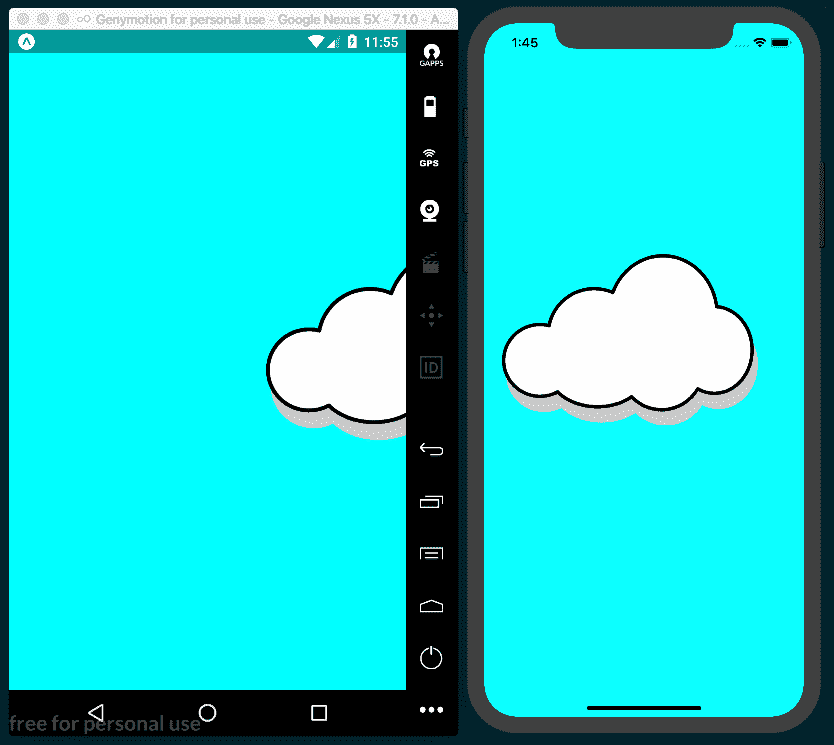
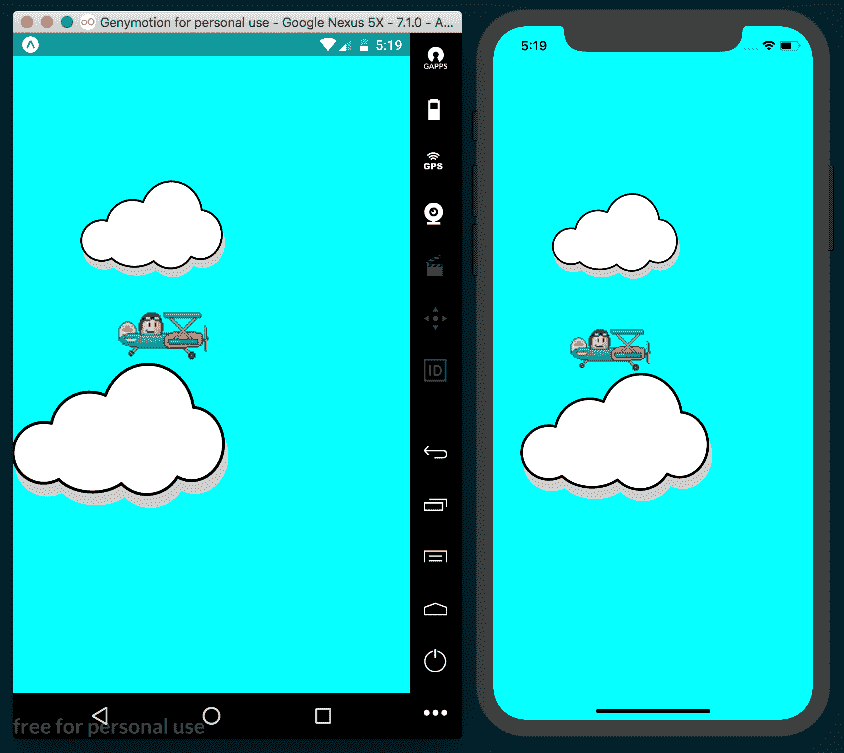
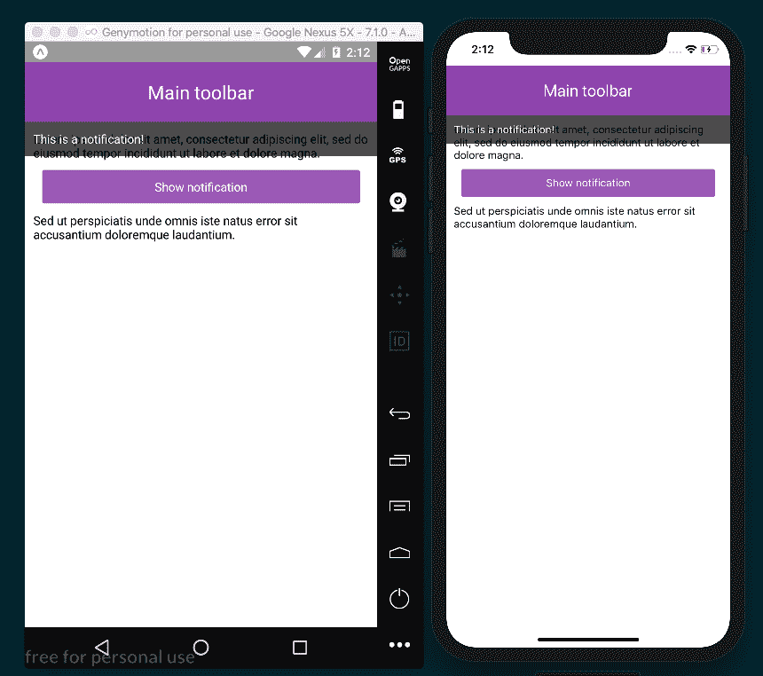
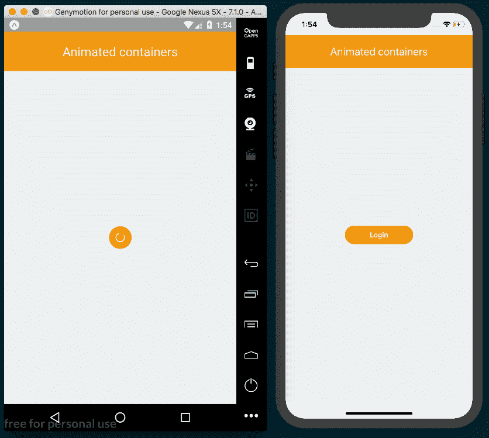

# 六、向应用添加基本动画

在本章中，我们将介绍以下配方：

*   创建简单动画
*   运行多个动画
*   创建动画通知
*   胀缩容器
*   创建带有加载动画的按钮

# 介绍

为了提供良好的用户体验，我们可能希望添加一些动画来引导用户的注意力，突出显示特定的动作，或者只是为我们的应用添加独特的触感。

正在进行一项计划，将所有处理从 JavaScript 移动到本机端。在编写本文时（React Native Version 0.58），我们可以选择使用本机驱动程序在本机世界中运行所有这些计算。遗憾的是，这不能用于所有动画，尤其是与布局相关的动画，例如 flexbox 属性。请阅读[文档中有关使用本机动画时的注意事项的更多信息 http://facebook.github.io/react-native/docs/animations#caveats](http://facebook.github.io/react-native/docs/animations#caveats) 。

本章中的所有方法都使用 JavaScript 实现。React Native 团队承诺在将所有处理移到本机端时使用相同的 API，因此我们不必担心破坏对现有 API 的更改。

# 创建简单动画

在本食谱中，我们将学习动画的基础知识。我们将使用一个图像来创建一个简单的从屏幕右侧到左侧的线性运动。

# 准备

为了完成这个配方，我们需要创建一个空的应用。我们叫它`simple-animation`

我们将在这个配方中使用一个云的 PNG 图像。您可以在 GitHub 上托管的配方存储库中的[中找到该图像 https://github.com/warlyware/react-native-cookbook/tree/master/chapter-6/simple-animation/img/images](https://github.com/warlyware/react-native-cookbook/tree/master/chapter-6/simple-animation/img/images) 。将图像放入`/img/images`文件夹中，以便在应用中使用。

# 怎么做。。。

1.  让我们首先打开`App.js`并导入`App`类的依赖项。`Animated`类将负责为动画创建值。它提供了一些可以设置动画的组件，还提供了一些方法和帮助程序来运行平滑动画。
    `Easing`类提供了几种辅助方法，用于计算动作（如`linear`和`quadratic`）和预定义动画（如`bounce`、`ease`和`elastic`。
    我们将使用`Dimensions`类获取当前设备大小，以便我们知道在动画初始化中放置元素的位置：

```jsx
import React, { Component } from 'react';
import {
  Animated,
  Easing,
  Dimensions,
  StyleSheet,
  View,
} from 'react-native';
```

2.  我们还将初始化应用中需要的一些常量。在本例中，我们将获取设备尺寸，设置图像大小，并`require`我们将设置动画的图像：

```jsx
const { width, height } = Dimensions.get('window');
const cloudImage = require('./iimg/cloud.png');
const imageHeight = 200;
const imageWidth = 300;
```

3.  现在，让我们创建`App`组件。我们将使用组件生命周期系统中的两种方法。如果您不熟悉此概念，请查看相关 React 文档（[http://reactjs.cn/react/docs/component-specs.html](http://reactjs.cn/react/docs/component-specs.html) 。本页还有一个关于生命周期挂钩如何工作的非常好的教程：

```jsx
export default class App extends Component { 
  componentWillMount() { 
    // Defined on step 4 
  } 

  componentDidMount() { 
    // Defined on step 7 
  } 

  startAnimation () { 
    // Defined on step 5 
  } 

  render() { 
    // Defined on step 6 
  } 
} 

const styles = StyleSheet.create({ 
  // Defined on step 8 
}); 
```

4.  为了创建动画，我们需要定义一个标准值来驱动动画。`Animated.Value`是一个处理随时间变化的每帧动画值的类。我们需要做的第一件事是在创建组件时创建这个类的实例。在这种情况下，我们使用的是`componentWillMount`方法，但我们也可以使用`constructor`甚至属性的默认值：

```jsx
  componentWillMount() {
    this.animatedValue = new Animated.Value();
  }
```

5.  创建动画值后，可以定义动画。我们还通过传递`Animated.timing`的`start`方法创建了一个循环，该方法使用箭头函数再次执行`startAnimation`函数。现在，当图像到达动画的末尾时，我们将再次启动相同的动画以创建无限循环动画：

```jsx
  startAnimation() {
    this.animatedValue.setValue(width);
    Animated.timing(
      this.animatedValue,
      {
        toValue: -imageWidth,
        duration: 6000,
        easing: Easing.linear,
        useNativeDriver: true,
      }
    ).start(() => this.startAnimation());
  }
```

6.  我们已经准备好了动画，但我们目前只计算每一帧随时间变化的值，而不使用这些值进行任何操作。下一步是在屏幕上渲染图像，并设置要设置动画的样式的属性。在这种情况下，我们希望在*x*轴上移动元素；因此，我们应该更新`left`属性：

```jsx
  render() {
    return (
      <View style={styles.background}>
        <Animated.Image
          style={[
            styles.image,
            { left: this.animatedValue },
          ]}
          source={cloudImage}
        />
      </View>
    );
  }
```

7.  如果我们刷新模拟器，我们会在屏幕上看到图像，但它还没有被设置动画。为了解决这个问题，我们需要调用`startAnimation`方法。一旦组件完全渲染，我们将使用`componentDidMount`生命周期挂钩启动动画：

```jsx
  componentDidMount() {
    this.startAnimation();
  }
```

8.  如果我们再次运行该应用，我们将看到图像如何在屏幕顶部移动，就像我们想要的那样！最后一步，让我们向应用添加一些基本样式：

```jsx
const styles = StyleSheet.create({
  background: {
    flex: 1,
    backgroundColor: 'cyan',
  },
  image: {
    height: imageHeight,
    position: 'absolute',
    top: height / 3,
    width: imageWidth,
  },
});
```

输出如以下屏幕截图所示：



# 它是如何工作的。。。

在*步骤 5*中，我们设置动画值。每次调用此方法时，第一行重置初始值。对于这个例子，初始值将是设备的`width`，它将把图像移动到屏幕的右侧，我们希望在那里开始动画。

然后，我们使用`Animated.timing`函数创建基于时间的动画，并获取两个参数。对于第一个参数，我们传入了在*步骤 4*中的`componentWillMount`生命周期钩子中创建的`animatedValue`。第二个参数是具有动画配置的对象。在本例中，我们将结束值设置为减去图像的宽度，这将把图像放置在屏幕的左侧。我们在那里完成动画。

在整个配置就绪的情况下，`Animated`类将计算分配给从右到左执行线性动画的 6 秒内所需的所有帧（通过`duration`属性设置为`6000`毫秒）。

我们有 React Native 提供的另一个助手，可以与`Animated`配对，称为`Easing`。在本例中，我们使用的是`Easing`助手类的`linear`属性。`Easing`提供了其他常用的缓和方法，如`elastic`和`bounce`。查看`Easing`类文档，尝试为`easing`属性设置不同的值，以了解每个属性的工作方式。您可以在[找到文档 https://facebook.github.io/react-native/docs/easing.html](https://facebook.github.io/react-native/docs/easing.html) 。

一旦动画配置正确，我们需要运行它。我们通过调用`start`方法来实现这一点。此方法接收一个可选的`callback`函数参数，该参数将在动画完成时执行。在本例中，我们递归地运行相同的`startAnimation`函数。这将创建一个无限循环，这就是我们想要实现的。

在*步骤 6*中，我们正在渲染图像。如果我们想给一个图像设置动画，我们应该始终使用`Animate.Image`组件。在内部，该组件将处理动画的值，并为本机组件上的每个帧设置每个值。这样可以避免在每一帧上运行 JavaScript 层中的 render 方法，从而实现更平滑的动画。

除了`Image`，我们还可以设置`View`、`Text`和`ScrollView`组件的动画。这四个组件都支持开箱即用，但我们也可以创建一个新组件，并通过`Animated.createAnimatedComponent()`添加对动画的支持。这四个组件都能够处理样式更改。我们所要做的就是将`animatedValue`传递给我们想要设置动画的属性，在本例中是`left`属性，但我们可以在每个组件上使用任何可用的样式。

# 运行多个动画

在这个配方中，我们将学习如何在几个元素中使用相同的动画值。通过这种方式，我们可以重用相同的值以及插值，为其余元素获得不同的值。

此动画将类似于上一个配方。这一次，我们将有两个云：一个较小，移动较慢，另一个较大，移动较快。在屏幕中央，我们将看到一架静止的飞机。我们不会向飞机添加任何动画，但移动的云将使飞机看起来好像在移动。

# 准备

让我们从创建一个名为`multiple-animations`的空应用开始

我们将使用三种不同的图像：两朵云和一架飞机。您可以从配方的存储库下载图像，该存储库位于 GitHub 上的[https://github.com/warlyware/react-native-cookbook/tree/master/chapter-6/multiple-animations/img/images](https://github.com/warlyware/react-native-cookbook/tree/master/chapter-6/multiple-animations/img/images) 。确保将图像放在`/img/images`文件夹中。

# 怎么做。。。

1.  让我们先打开`App.js`并添加我们的进口：

```jsx
import React, { Component } from 'react';
import {
  View,
  Animated,
  Image,
  Easing,
  Dimensions,
  StyleSheet,
} from 'react-native';
```

2.  此外，我们需要定义一些常量，并需要用于动画的图像。请注意，我们使用的云图像与`cloudImage1`和`cloudImage2`相同，但在此配方中，我们将它们视为单独的实体：

```jsx
const { width, height } = Dimensions.get('window');
const cloudImage1 = require('./iimg/cloud.png');
const cloudImage2 = require('./iimg/cloud.png');
const planeImage = require('./iimg/plane.gif');
const cloudHeight = 100;
const cloudWidth = 150;
const planeHeight = 60;
const planeWidth = 100;
```

3.  在下一步中，我们将在创建组件时创建`animatedValue`实例，然后在组件完全渲染时启动动画。我们正在创建一个无限循环运行的动画。初始值为`1`，最终值为`0`。如果您不清楚此代码，请务必阅读本章中的第一个配方：

```jsx
export default class App extends Component { 
  componentWillMount() { 
    this.animatedValue = new Animated.Value(); 
  } 

  componentDidMount() { 
    this.startAnimation(); 
  } 

  startAnimation () { 
    this.animatedValue.setValue(1); 
    Animated.timing( 
      this.animatedValue, 
      { 
        toValue: 0, 
        duration: 6000, 
        easing: Easing.linear, 
      } 
    ).start(() => this.startAnimation()); 
  } 

  render() { 
    // Defined in a later step
  } 
} 

const styles = StyleSheet.create({ 
  // Defined in a later step
}); 
```

4.  这个食谱中的`render`方法将与上一个完全不同。在这个配方中，我们将使用相同的`animatedValue`设置两个图像的动画。动画值将返回从`1`到`0`的值；但是，我们希望将云从右向左移动，因此需要在每个元素上设置`left`值。
    为了设置正确的值，我们需要插值`animatedValue`。对于较小的云，我们将初始`left`值设置为设备的宽度，但对于较大的云，我们将初始`left`值设置为远离设备右侧边缘。这将使移动距离更大，因此移动速度更快：

```jsx
  render() {
    const left1 = this.animatedValue.interpolate({
      inputRange: [0, 1],
      outputRange: [-cloudWidth, width],
    });

    const left2 = this.animatedValue.interpolate({
      inputRange: [0, 1],
      outputRange: [-cloudWidth*5, width + cloudWidth*5],
    });

    // Defined in a later step
  } 
```

5.  一旦我们有了正确的`left`值，我们就需要定义要设置动画的元素。这里，我们将插值设置为`left`styles 属性：

```jsx
  render() {
    // Defined in a later step

    return (
      <View style={styles.background}>
        <Animated.Image
          style={[
            styles.cloud1,
            { left: left1 },
          ]}
          source={cloudImage1}
        />
        <Image
          style={styles.plane}
          source={planeImage}
        />
        <Animated.Image
          style={[
            styles.cloud2,
            { left: left2 },
          ]}
          source={cloudImage2}
        />
      </View>
    );
  }
```

6.  最后一步，我们需要定义一些样式，只需要设置每个云的`width`和`height`，并将样式分配给`top`：

```jsx
const styles = StyleSheet.create({
  background: {
    flex: 1,
    backgroundColor: 'cyan',
  },
  cloud1: {
    position: 'absolute',
    width: cloudWidth,
    height: cloudHeight,
    top: height / 3 - cloudWidth / 2,
  },
  cloud2: {
    position: 'absolute',
    width: cloudWidth * 1.5,
    height: cloudHeight * 1.5,
    top: height/2,
  },
  plane: {
    position: 'absolute',
    height: planeHeight,
    width: planeWidth,
    top: height / 2 - planeHeight,
    left: width / 2 - planeWidth,
  }
});
```

7.  如果我们刷新应用，我们将看到动画：



# 它是如何工作的。。。

在*步骤 4*中，我们定义了插值以获得每个云的`left`值。`interpolate`方法接收具有两个必需配置的对象`inputRange`和`outputRange`。

`inputRange`配置接收一个值数组。这些值应始终为升序值；也可以使用负值，只要值是递增的。

`outputRange`应与`inputRange`上定义的值数量相匹配。这些是插值结果所需的值。

对于这个配方，`inputRange`从`0`到`1`，这是我们的`animatedValue`的值。在`outputRange`中，我们定义了我们所需要的移动限制。

# 创建动画通知

在这个配方中，我们将从头创建一个通知组件。显示通知时，组件将从屏幕顶部滑入。几秒钟后，我们将通过将其滑出自动隐藏它。

# 准备

我们将创建一个应用。我们叫它`notification-animation`

# 怎么做。。。

1.  我们将从处理`App`组件开始。首先，让我们导入所有必需的依赖项：

```jsx
import React, { Component } from 'react';
import {
  Text,
  TouchableOpacity,
  StyleSheet,
  View,
  SafeAreaView,
} from 'react-native';
import Notification from './Notification';
```

2.  一旦我们导入了所有依赖项，我们就可以定义`App`类。在本例中，我们将使用等于`false`的`notify`属性初始化`state`。我们将使用此属性显示或隐藏通知。默认情况下，通知不会显示在屏幕上。为了简单起见，我们将在`state`中使用要显示的文本定义`message`属性：

```jsx
export default class App extends Component {
  state = {
    notify: false,
    message: 'This is a notification!',
  };

  toggleNotification = () => {
    // Defined on later step
  }

  render() {
    // Defined on later step
  }
}

const styles = StyleSheet.create({
    // Defined on later step
});

```

3.  在`render`方法中，只有`notify`属性为`true`时才需要显示通知，我们可以通过`if`语句来实现：

```jsx
  render() {
    const notify = this.state.notify
      ? <Notification
          autoHide
          message={this.state.message}
          onClose={this.toggleNotification}
        />
    : null;
    // Defined on next step
  }
```

4.  在上一步中，我们只定义了对`Notification`组件的引用，但我们还没有使用它。让我们用这个应用所需的所有 JSX 来定义一个`return`。为了简单起见，我们只需要定义一个工具栏、一些文本和一个按钮，以在按下时切换通知的状态：

```jsx
  render() {
    // Code from previous step
    return (
      <SafeAreaView>
        <Text style={styles.toolbar}>Main toolbar</Text>
        <View style={styles.content}>
          <Text>
            Lorem ipsum dolor sit amet, consectetur adipiscing 
            elit,
            sed do eiusmod tempor incididunt ut labore et 
            dolore magna.
          </Text>
          <TouchableOpacity
            onPress={this.toggleNotification}
            style={styles.btn}
          >
            <Text style={styles.text}>Show notification</Text>
          </TouchableOpacity>
          <Text>
            Sed ut perspiciatis unde omnis iste natus error sit 
            accusantium doloremque laudantium.
          </Text>
          {notify}
        </View>
      </SafeAreaView>
    );
  }
```

5.  我们还需要定义切换`state`上`notify`属性的方法，非常简单：

```jsx
  toggleNotification = () => {
    this.setState({
      notify: !this.state.notify,
    });
  }
```

6.  这节课我们差不多讲完了。只剩下款式了。在这种情况下，我们只添加基本样式，如`color`、`padding`、`fontSize`、`backgroundColor`、`margin`，没有什么特别之处：

```jsx
        const styles = StyleSheet.create({ 
          toolbar: { 
            backgroundColor: '#8e44ad', 
            color: '#fff', 
            fontSize: 22, 
            padding: 20, 
            textAlign: 'center', 
          }, 
          content: { 
            padding: 10, 
            overflow: 'hidden', 
          }, 
          btn: { 
            margin: 10, 
            backgroundColor: '#9b59b6', 
            borderRadius: 3, 
            padding: 10, 
          }, 
          text: { 
            textAlign: 'center', 
            color: '#fff', 
          }, 
        }); 
```

7.  如果我们尝试运行应用，我们将看到一个错误，`./Notification`模块无法解决。让我们通过定义`Notification`组件来解决这个问题。让我们创建一个`Notifications`文件夹，其中包含一个`index.js`文件。然后，我们可以导入依赖项：

```jsx
import React, { Componen } from 'react';
import {
  Animated,
  Easing,
  StyleSheet,
  Text,
} from 'react-native';
```

8.  导入依赖项后，让我们定义道具和新组件的初始状态。我们将定义一些非常简单的东西，只是一个接收要显示的消息的属性，以及两个`callback`函数，允许在通知出现在屏幕上和关闭时运行某些操作。我们还将添加一个属性，设置自动隐藏通知之前显示通知的毫秒数：

```jsx
export default class Notification extends Component {
  static defaultProps = {
    delay: 5000,
    onClose: () => {},
    onOpen: () => {},
  };

  state = {
    height: -1000,
  };
}
```

9.  终于到了制作动画的时候了！我们需要在组件渲染后立即启动动画。如果以下代码中有不清楚的地方，我建议您查看本章中的第一个和第二个食谱：

```jsx
  componentWillMount() {
    this.animatedValue = new Animated.Value();
  }

  componentDidMount() {
    this.startSlideIn();
  }

  getAnimation(value, autoHide) {
    const { delay } = this.props;
    return Animated.timing(
      this.animatedValue,
      {
        toValue: value,
        duration: 500,
        easing: Easing.cubic,
        delay: autoHide ? delay : 0,
      }
    );
  }
```

10.  到目前为止，我们已经定义了一种获取动画的方法。对于滑入运动，我们需要计算从`0`到`1`的值。动画完成后，我们需要运行`onOpen`回调。如果调用`onOpen`方法时`autoHide`属性设置为`true`，我们将自动运行滑出动画以移除组件：

```jsx
  startSlideIn () {
    const { onOpen, autoHide } = this.props;

    this.animatedValue.setValue(0);
    this.getAnimation(1)
      .start(() => {
        onOpen();
        if (autoHide){
          this.startSlideOut();
        }
      });
  }
```

11.  与前一步类似，我们需要一种滑出运动的方法。这里，我们需要计算从`1`到`0`的值。我们将`autoHide`值作为参数发送给`getAnimation`方法。这将自动将动画延迟`delay`属性定义的毫秒数（在本例中为 5 秒）。动画完成后，我们需要运行`onClose`回调函数，该函数将从`App`类中删除组件：

```jsx
  startSlideOut() {
    const { autoHide, onClose } = this.props;

    this.animatedValue.setValue(1);
    this.getAnimation(0, autoHide)
      .start(() => onClose());
  }
```

12.  最后，让我们添加`render`方法。这里我们将得到`props`提供的`message`值。我们还需要组件的`height`来将组件移动到动画的初始位置；默认情况下，它是`-1000`，但我们将在接下来的步骤中在运行时设置正确的值。`animatedValue`从`0`到`1`或`1`到`0`，取决于通知是打开还是关闭；因此，我们需要对其进行插值以获得实际值。动画将从组件的高度减至`0`；这将产生一个漂亮的滑入/滑出动画：

```jsx
  render() {
    const { message } = this.props;
    const { height } = this.state;
    const top = this.animatedValue.interpolate({
       inputRange: [0, 1],
       outputRange: [-height, 0],
     });
    // Defined on next step
   }
}
```

13.  为了使事情尽可能简单，我们将返回一个带有一些文本的`Animated.View`。在这里，我们使用插值结果设置`top`样式，这意味着我们将为顶部样式设置动画。如前所述，我们需要在运行时计算组件的高度。为了实现这一点，我们需要使用视图的`onLayout`属性。每次布局更新时都会调用此函数，并将此组件的新尺寸作为参数发送：

```jsx
  render() {
     // Code from previous step
     return (
      <Animated.View
        onLayout={this.onLayoutChange}
        style={[
          styles.main,
          { top }
        ]}
      >
        <Text style={styles.text}>{message}</Text>
      </Animated.View>
    );
   }
}
```

14.  `onLayoutChange`方法将非常简单。我们只需要得到新的`height`并更新`state`。此方法接收到一个`event`。从这个对象中，我们可以获取有用的信息。出于我们的目的，我们将访问`event`对象中`nativeEvent.layout`处的数据。`layout`对象包含屏幕的`width`和`height`以及`Animated.View`调用此功能的屏幕上的*x*和*y*位置：

```jsx
  onLayoutChange = (event) => {
    const {layout: { height } } = event.nativeEvent;
     this.setState({ height });
   }
```

15.  最后一步，我们将向通知组件添加一些样式。因为我们想让这个组件在任何其他组件之上设置动画，所以我们需要将`position`设置为`absolute`，并将`left`和`right`属性设置为`0`。我们还将添加一些颜色和填充：

```jsx
        const styles = StyleSheet.create({ 
          main: { 
            backgroundColor: 'rgba(0, 0, 0, 0.7)', 
            padding: 10, 
            position: 'absolute', 
            left: 0, 
            right: 0, 
          }, 
          text: { 
            color: '#fff', 
          }, 
       }); 
```

16.  最终的应用应类似于以下屏幕截图：



# 它是如何工作的。。。

在*步骤 3*中，我们定义了`Notification`组件。该组件接收三个参数：一个在几秒钟后自动隐藏组件的标志、我们想要显示的消息和一个`callback`函数，该函数将在通知关闭时执行。

当执行`onClose`回调时，我们将切换`notify`属性以移除`Notification`实例并清除内存。

在*步骤 4*中，我们定义了 JSX 来呈现我们应用的组件。在其他组件之后渲染`Notification`组件非常重要，这样该组件将显示在所有其他组件之上

在*步骤 6*中，我们定义了组件的`state`。`defaultProps`对象为每个属性设置默认值。如果没有为给定属性指定值，则将应用这些值。

我们将每个`callback`的默认值定义为空函数。这样，我们不必在尝试执行这些道具之前检查它们是否有值。

对于初始的`state`，我们定义了`height`属性。实际的`height`值将在运行时根据`message`属性中接收到的内容进行计算。这意味着我们首先需要渲染远离原始位置的组件。因为在计算布局时有一个短暂的延迟，所以我们根本不希望在通知移动到正确位置之前显示它。

在*步骤 9*中，我们创建了动画。`getAnimation`方法接收两个参数：要应用的`delay`和确定通知是否自动关闭的`autoHide`布尔值。我们在*步骤 10*和*步骤 11*中使用了这种方法。

在*步骤 13*中，我们为该组件定义了 JSX。当布局有更新时，`onLayout`功能对于获取组件的尺寸非常有用。例如，如果设备方向更改，则尺寸将更改，在这种情况下，我们希望更新动画的初始和最终坐标。

# 还有更多。。。

当前的实现工作得很好，但是我们应该解决一个性能问题。目前，在动画的每一帧上都会执行`onLayout`方法，这意味着我们正在更新每一帧上的状态，这将导致每一帧上的组件重新渲染！我们应该避免这种情况，并且只更新一次以获得实际高度。

为了解决这个问题，如果当前值与初始值不同，我们可以添加一个简单的验证来更新状态。这将避免在每一帧上更新`state`，并且我们不会一次又一次地强制渲染：

```jsx
onLayoutChange = (event) => { 
  const {layout: { height } } = event.nativeEvent; 
 if (this.state.height === -1000) { 
    this.setState({ height }); 
 } 
} 
```

虽然这对于我们的目的是有效的，但我们还可以更进一步，确保`height`在方向改变时也得到更新。不过，我们就到此为止，因为这个食谱已经很长了。

# 胀缩容器

在这个配方中，我们将创建一个带有`title`和`content`的定制容器元素。当用户按下标题时，内容将折叠或展开。这个配方将允许我们探索`LayoutAnimation`API。

# 准备

让我们从创建一个新的应用开始。我们称之为`collapsable-containers`。

一旦我们创建了应用，我们还将创建一个包含有`index.js`文件的`Panel`文件夹，用于存放我们的`Panel`组件。

# 怎么做。。。

1.  让我们从关注`Panel`组件开始。首先，我们需要导入将用于此类的所有依赖项：

```jsx
import React, { Component } from 'react';
import {
  View,
  LayoutAnimation,
  StyleSheet,
  Text,
  TouchableOpacity,
} from 'react-native';
```

2.  一旦我们有了依赖项，让我们声明用于初始化该组件的`defaultProps`。在这个配方中，我们只需要将`expanded`属性初始化为`false`：

```jsx
export default class Panel extends Component {
  static defaultProps = {
    expanded: false
  };
}

const styles = StyleSheet.create({
  // Defined on later step
});
```

3.  我们将使用`state`对象的`height`属性来展开或折叠容器。第一次创建此组件时，我们需要检查`expanded`属性以设置正确的初始`height`：

```jsx
  state = {
    height: this.props.expanded ? null : 0,
  };
```

4.  让我们呈现此组件所需的 JSX 元素。我们需要从`state`中获取`height`值，并将其设置为内容的样式视图。当按下`title`元素时，我们将执行`toggle`方法（后面定义）来更改状态的`height`值：

```jsx
  render() {
    const { children, style, title } = this.props;
    const { height } = this.state;

    return (
      <View style={[styles.main, style]}>
        <TouchableOpacity onPress={this.toggle}>
          <Text style={styles.title}>
            {title}
          </Text>
        </TouchableOpacity>
        <View style={{ height }}>
          {children}
        </View>
      </View>
    );
  }
```

5.  如前所述，`toggle`方法将在按下`title`元素时执行。在这里，我们将切换`state`上的`height`，并调用在下一个渲染周期更新样式时要使用的动画：

```jsx
  toggle = () => {
    LayoutAnimation.spring();
    this.setState({
      height: this.state.height === null ? 0 : null,
    })
  }
```

6.  为了完成这个组件，让我们添加一些简单的样式。我们需要将`overflow`设置为`hidden`，否则组件折叠时会显示内容：

```jsx
const styles = StyleSheet.create({
  main: {
    backgroundColor: '#fff',
    borderRadius: 3,
    overflow: 'hidden',
    paddingLeft: 30,
    paddingRight: 30,
  },
  title: {
    fontWeight: 'bold',
    paddingTop: 15,
    paddingBottom: 15,
  }
```

7.  一旦我们定义了`Panel`组件，让我们在`App`类上使用它。首先，我们需要`App.js`中的所有依赖项：

```jsx
import React, { Component } from 'react';
import {
  Text,
  StyleSheet,
  View,
  SafeAreaView,
  Platform,
  UIManager
} from 'react-native';
import Panel from './Panel';
```

8.  在上一步中，我们导入了`Panel`组件。我们将在 JSX 中声明此类的三个实例：

```jsx
 export default class App extends Component {
  render() {
    return (
      <SafeAreaView style={[styles.main]}>
        <Text style={styles.toolbar}>Animated containers</Text>
        <View style={styles.content}>
          <Panel
            title={'Container 1'}
            style={styles.panel}
          >
            <Text style={styles.panelText}>
              Temporibus autem quibusdam et aut officiis
              debitis aut rerum necessitatibus saepe
              eveniet ut et voluptates repudiandae sint et
              molestiae non recusandae.
            </Text>
          </Panel>
          <Panel
            title={'Container 2'}
            style={styles.panel}
              >
            <Text style={styles.panelText}>
              Et harum quidem rerum facilis est et expedita 
              distinctio. Nam libero tempore,
              cum soluta nobis est eligendi optio cumque.
            </Text>
          </Panel>
          <Panel
            expanded
            title={'Container 3'}
            style={styles.panel}
           >
            <Text style={styles.panelText}>
              Nullam lobortis eu lorem ut vulputate.
            </Text>
            <Text style={styles.panelText}>
              Donec id elementum orci. Donec fringilla lobortis 
              ipsum, vitae commodo urna.
            </Text>
          </Panel>
        </View>
      </SafeAreaView>
    );
  }
}
```

9.  我们在这个配方中使用的是 React Native`LayoutAnimation`API。在当前版本的 React Native 中，Android 上默认禁用此 API。在安装`App`组件之前，我们将使用`Platform`助手和`UIManager`在 Android 设备上启用此功能：

```jsx
  componentWillMount() {
    if (Platform.OS === 'android') {
      UIManager.setLayoutAnimationEnabledExperimental(true);
    }
  }
```

10.  最后，让我们向工具栏和主容器添加一些样式。我们只需要一些您现在可能已经习惯的简单样式：`padding`、`margin`和`color`：

```jsx
const styles = StyleSheet.create({
  main: {
    flex: 1,
  },
  toolbar: {
    backgroundColor: '#3498db',
    color: '#fff',
    fontSize: 22,
    padding: 20,
    textAlign: 'center',
  },
  content: {
    padding: 10,
    backgroundColor: '#ecf0f1',
    flex: 1,
  },
  panel: {
    marginBottom: 10,
  },
  panelText: {
    paddingBottom: 15,
  }
});
```

11.  最终的应用应类似于以下屏幕截图：


# 它是如何工作的。。。

在*步骤 3*中，我们设置了内容的初始`height`。如果`expanded`属性设置为`true`，那么我们应该显示内容。通过将`height`值设置为`null`，版面系统将根据内容计算`height`；否则，我们需要将该值设置为`0`，这将在组件折叠时隐藏内容。

在*步骤 4*中，我们为`Panel`组件定义了所有 JSX。本步骤中有几个概念值得介绍。首先，从`props`对象传入`children`属性，当`App`类中使用该组件时，该对象将包含在`<Panel>`和`</Panel>`之间定义的任何元素。这非常有用，因为通过使用此属性，我们允许此组件作为子组件接收任何其他组件。

在同一步骤中，我们还将从`state`对象获取`height`，并将其设置为应用于`View`的`style`，其中包含可折叠内容。这将更新`height`，导致组件相应膨胀或折叠。我们还声明了`onPress`回调，它在按下 title 元素时切换`state`上的`height`。

在*步骤 7 中*我们定义了`toggle`方法，该方法切换`height`值。在这里，我们使用了`LayoutAnimation`类。通过调用`spring`方法，布局系统将在下一次渲染时为布局发生的每个更改设置动画。在这种情况下，我们只更改了`height`，但我们可以更改我们想要的任何其他属性，例如`opacity`、`position`或`color`。

`LayoutAnimation`类包含两个预定义的动画。在这个配方中，我们使用了`spring`，但我们也可以使用`linear`或`easeInEaseOut`，或者您可以使用`configureNext`方法创建自己的配方。

如果我们移除`LayoutAnimation`，我们将看不到动画；组件将通过从`0`跳到总高度而膨胀和塌陷。但通过添加这一行，我们可以轻松地添加一个漂亮、平滑的动画。如果需要对动画进行更多控制，则可能需要使用动画 API。

在*步骤 9*中，我们检查了`Platform`助手上的 OS 属性，该属性返回`'android'`或`'ios'`字符串，具体取决于应用运行的设备。如果应用在 Andriod 上运行，我们将使用`UIManager`助手的`setLayoutAnimationEnabledExperimental`方法启用`LayoutAnimation`API。

# 另见

*   `LayoutAnimation`API 文件位于[https://facebook.github.io/react-native/docs/layoutanimation.html](https://facebook.github.io/react-native/docs/layoutanimation.html)
*   在[处快速介绍 React 的`props.children`https://codeburst.io/a-quick-intro-to-reacts-props-children-cb3d2fce4891](https://codeburst.io/a-quick-intro-to-reacts-props-children-cb3d2fce4891)

# 创建带有加载动画的按钮

在本食谱中，我们将继续使用`LayoutAnimation`类。在这里，我们将创建一个按钮，当用户按下按钮时，我们将显示一个加载指示器并为样式设置动画。

# 准备

要开始，我们需要创建一个空应用。我们叫它`button-loading-animation`

我们还要为我们的`Button`组件创建一个`Button`文件夹，其中包含一个`index.js`文件。

# 怎么做。。。

1.  让我们从`Button/index.js`文件开始。首先，我们将导入此组件的所有依赖项：

```jsx
import React, { Component } from 'react';
import {
  ActivityIndicator,
  LayoutAnimation,
  StyleSheet,
  Text,
  TouchableOpacity,
  View,
} from 'react-native';
```

2.  对于这个组件，我们将只使用四个道具：一个`label`、一个`loading`布尔值来切换显示按钮内的加载指示器或标签、一个按下按钮时执行的回调函数以及自定义样式。在这里，我们将`init`加载到`false`的`defaultProps`，以及加载到空函数的`handleButtonPress`：

```jsx
export default class Button extends Component {
  static defaultProps = {
    loading: false,
    onPress: () => {},
  };
  // Defined on later steps
}
```

3.  我们将尽可能简化此组件的`render`方法。我们将根据`loading`属性的值呈现标签和活动指示器：

```jsx
  render() {
    const { loading, style } = this.props;

    return (
      <TouchableOpacity
        style={[
          styles.main,
          style,
          loading ? styles.loading : null,
        ]}
        activeOpacity={0.6}
        onPress={this.handleButtonPress}
      >
        <View>
          {this.renderLabel()}
          {this.renderActivityIndicator()}
        </View>
      </TouchableOpacity>
    );
  }
```

4.  为了呈现`label`，我们需要检查`loading`属性是否为`false`。如果是，那么我们只返回一个带有我们从`props`收到的`label`的`Text`元素：

```jsx
  renderLabel() {
    const { label, loading } = this.props;
    if(!loading) {
      return (
        <Text style={styles.label}>{label}</Text>
      );
    }
  }
```

5.  同样地，`renderActivityIndicator`指示器应仅在`loading`属性的值为`true`时应用。如果是，我们将退回`ActivityIndicator`组件。我们将使用`ActivityIndicator`的道具来定义一个`size`小的`color`白的`#fff`：

```jsx
  renderActivityIndicator() {
    if (this.props.loading) {
      return (
        <ActivityIndicator size="small" color="#fff" />
      );
    }
  }
```

6.  我们班还有一种方法：`handleButtonPress`。我们需要在按下按钮时通知该组件的父级，这可以通过调用通过`props`传递给该组件的`onPress`回调来完成。我们还将使用`LayoutAnimation`在下一次渲染时对动画进行排队：

```jsx
  handleButtonPress = () => {
    const { loading, onPress } = this.props;

    LayoutAnimation.easeInEaseOut();
    onPress(!loading);
  }
```

7.  要完成此组件，我们需要添加一些样式。我们将定义一些颜色、圆角、对齐、填充等。对于`loading`样式，将在显示加载指示器时应用，我们将更新填充以在加载指示器周围创建一个圆圈：

```jsx
const styles = StyleSheet.create({
  main: {
    backgroundColor: '#e67e22',
    borderRadius: 20,
    padding: 10,
    paddingLeft: 50,
    paddingRight: 50,
  },
  label: {
    color: '#fff',
    fontWeight: 'bold',
    textAlign: 'center',
    backgroundColor: 'transparent',
  },
  loading: {
    padding: 10,
    paddingLeft: 10,
    paddingRight: 10,
  },
});
```

8.  我们已经完成了`Button`组件。现在，让我们学习`App`课程。让我们从导入所有依赖项开始：

```jsx
import React, { Component } from 'react';
import {
  Text,
  StyleSheet,
  View,
  SafeAreaView,
  Platform,
  UIManager
} from 'react-native';
import Button from './Button';
```

9.  `App`类相对简单。我们只需要在`state`对象上定义一个`loading`属性，它将切换`Button`的动画。我们还将呈现一个`toolbar`和一个`Button`：

```jsx
export default class App extends Component {
  state = {
    loading: false,
  };

  // Defined on next step

  handleButtonPress = (loading) => {
    this.setState({ loading });
  }

  render() {
    const { loading } = this.state;

    return (
      <SafeAreaView style={[styles.main, android]}>
        <Text style={styles.toolbar}>Animated containers</Text>
        <View style={styles.content}>
          <Button
            label="Login"
            loading={loading}
            onPress={this.handleButtonPress}
          />
        </View>
      </SafeAreaView>
    );
  }
}
```

10.  与上一个配方一样，我们需要在 Android 设备上手动启用`LayoutAnimation`API：

```jsx
  componentWillMount() {
    if (Platform.OS === 'android') {
      UIManager.setLayoutAnimationEnabledExperimental(true);
    }
  }
```

11.  最后，我们将添加一些`styles`，只是一些颜色、填充和对齐，以便在屏幕上使按钮居中：

```jsx
const styles = StyleSheet.create({
  main: {
    flex: 1,
  },
  toolbar: {
    backgroundColor: '#f39c12',
    color: '#fff',
    fontSize: 22,
    padding: 20,
    textAlign: 'center',
  },
  content: {
    padding: 10,
    backgroundColor: '#ecf0f1',
    flex: 1,
    alignItems: 'center',
    justifyContent: 'center',
  },
});
```

12.  最终的应用应类似于以下屏幕截图：



# 它是如何工作的。。。

在*步骤 3*中，我们为`Button`组件添加了`render`方法。在这里，我们收到了`loading`属性，并基于该值，将相应的样式应用于`TouchableOpacity`按钮元素。我们还使用了两种方法：一种用于呈现标签，另一种用于呈现活动指示器。

在*步骤 6*中，我们执行了`onPress`回调。默认情况下，我们声明了一个空函数，因此不必检查值是否存在。

调用`onPress`回调时，此按钮的父级应负责更新加载属性。在这个组件中，我们只负责在按下此按钮时通知家长。

`LayoutAnimation.eadeInEaseOut`方法仅对下一渲染阶段的动画进行排队，这意味着动画不会立即执行。我们负责更改要设置动画的样式。如果我们不更改任何样式，则不会看到任何动画。

`Button`组件不知道`loading`属性是如何更新的。这可能是由于提取请求、超时或任何其他操作造成的。父组件负责更新`loading`属性。无论何时发生任何更改，我们都会将新样式应用于按钮，并将出现平滑的动画。

在*步骤 9*中，我们定义了`App`类的内容。这里，我们使用我们的`Button`组件。当按下按钮时，`loading`属性的`state`被更新，这将导致每次按下按钮时动画运行。

# 结论

在本章中，我们介绍了制作 React 本机应用动画的基本原理。这些方法旨在提供有用的实用代码解决方案，并确定如何使用基本构建块，以便您能够更好地创建适合应用的动画。希望到现在为止，您应该已经习惯于使用`Animated`和`LayoutAnimation`动画助手了。在[第 7 章](14.html)中*将高级动画添加到您的应用*中，我们将结合在这里学到的内容，构建更复杂、更有趣的以应用为中心的 UI 动画