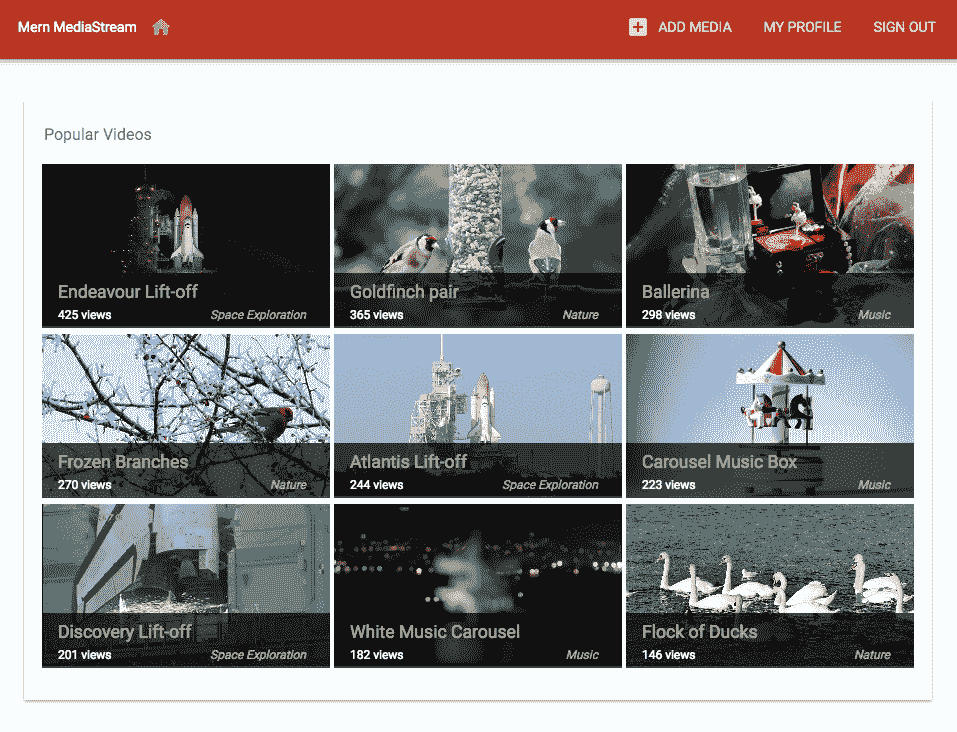
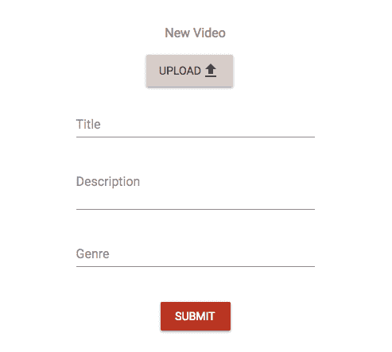
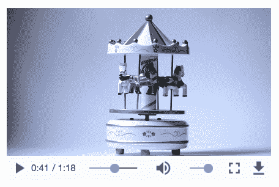
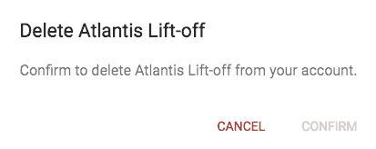

# 八、构建媒体流应用

一段时间以来，上传和流媒体内容，特别是视频内容，已经成为互联网文化中日益增长的一部分。从共享个人视频内容的个人到通过在线流媒体服务传播商业内容的娱乐业，我们都依赖于能够顺利上传和流媒体的 web 应用。MERN 堆栈技术中的功能可用于将这些核心流功能构建并集成到任何基于 MERN 的 web 应用中。

在本章中，我们将介绍以下主题，通过扩展 MERN skeleton 应用来实现基本的媒体上传和流媒体：

*   将视频上载到 MongoDB GridFS
*   存储和检索媒体详细信息
*   从 GridFS 到基本媒体播放器的流媒体

# 梅恩媒体流

我们将通过扩展基础应用来构建 MERN Mediastream 应用。这将是一个简单的视频流应用，允许注册用户上传任何浏览该应用的人都可以流的视频：



The code for the complete MERN Mediastream application is available on GitHub [github.com/shamahoque/mern-mediastream](https://github.com/shamahoque/mern-mediastream). The implementations discussed in this chapter can be accessed in the `simple-mediastream-gridfs` branch of the same repository. You can clone this code and run the application as you go through the code explanations in the rest of this chapter. 

与媒体上传、编辑、编辑相关的功能所需的视图，将通过扩展和修改 MERN skeleton 应用中现有的 React 组件来开发简单媒体播放器中的流媒体。下图中的组件树显示了构成本章开发的 MERN Mediastream 前端的所有自定义 React 组件：


# 上传和存储媒体

MERN Mediastream 上的注册用户将能够从本地文件上传视频，并使用 GridFS 将视频和相关详细信息直接存储在 MongoDB 上。

# 媒体模型

为了存储媒体详细信息，我们将在`server/models/media.model.js`中为媒体模型添加一个 Mongoose 模式，其中包含记录媒体标题、描述、类型、视图数量、创建时间、更新时间以及发布媒体的用户参考的字段。

`mern-mediastream/server/models/media.model.js`：

```jsx
import mongoose from 'mongoose'
import crypto from 'crypto'
const MediaSchema = new mongoose.Schema({
  title: {
    type: String,
    required: 'title is required'
  },
  description: String,
  genre: String,
  views: {type: Number, default: 0},
  postedBy: {type: mongoose.Schema.ObjectId, ref: 'User'},
  created: {
    type: Date,
    default: Date.now
  },
  updated: {
    type: Date
  }
})

export default mongoose.model('Media', MediaSchema)
```

# MongoDB GridFS 用于存储大型文件

在前面的章节中，我们讨论了如何将用户上传的文件作为二进制数据直接存储在 MongoDB 中。但这只适用于小于 16MB 的文件。为了在 MongoDB 中存储更大的文件，我们需要使用 GridFS。

GridFS 在 MongoDB 中存储大型文件，方法是将文件划分为多个最大为 255 KB 的块，然后将每个块存储为单独的文档。当需要检索文件以响应对 GridFS 的查询时，会根据需要重新组合块。这将打开一个选项，根据需要只获取和加载文件的一部分，而不是检索整个文件。

在为 MERN Mediastream 存储和检索视频文件的情况下，我们将利用 GridFS 来存储视频文件，并根据用户跳转到哪个部分并从哪个部分开始播放，来流式传输部分视频。

我们将使用`gridfs-stream`npm 模块向服务器端代码添加 GridFS 功能：

```jsx
npm install gridfs-stream --save
```

要使用我们的数据库连接配置`gridfs-stream`，我们将使用 Mongoose 将其链接起来，如下所示。

`mern-mediastream/server/controllers/media.controller.js`：

```jsx
import mongoose from 'mongoose'
import Grid from 'gridfs-stream'
Grid.mongo = mongoose.mongo
let gridfs = null
mongoose.connection.on('connected', () => {
  gridfs = Grid(mongoose.connection.db)
})
```

`gridfs`对象将允许访问 GridFS 功能，这些功能在创建新介质时用于存储文件，在介质流回到用户时用于获取文件。

# 创建媒体 API

我们将在 Express 服务器上设置一个创建媒体 API，该 API 将在`'/api/media/new/:userId'`接收 POST 请求，多部分正文内容包含媒体字段和上传的视频文件。

# 创建媒体的路径

在`server/routes/media.routes.js`中，我们将添加创建路由，并使用来自用户控制器的`userByID`方法。`userByID`方法处理 URL 中传递的`:userId`参数，并从数据库中检索相关用户。

`mern-mediastream/server/routes/media.routes.js`：

```jsx
router.route('/api/media/new/:userId')
        .post(authCtrl.requireSignin, mediaCtrl.create)
router.param('userId', userCtrl.userByID)
```

对创建路由的 POST 请求将首先确保用户已登录，然后在媒体控制器中启动`create`方法。

与用户和身份验证路由类似，我们必须在`express.js`中的 Express 应用上装载媒体路由，如下所示。

`mern-mediastream/server/express.js`：

```jsx
app.use('/', mediaRoutes)
```

# 用于处理创建请求的控制器方法

媒体控制器中的`create`控制器方法将使用`formidable`npm 模块解析包含用户上传的媒体详情和视频文件的多部分请求主体：

```jsx
npm install formidable --save
```

表单数据中接收到的媒体字段，经过`formidable`解析后，将用于生成新的媒体对象并保存到数据库中。

`mern-mediastream/server/controllers/media.controller.js`：

```jsx
const create = (req, res, next) => {
  let form = new formidable.IncomingForm()
    form.keepExtensions = true
    form.parse(req, (err, fields, files) => {
      if (err) {
        return res.status(400).json({
          error: "Video could not be uploaded"
        })
      }
      let media = new Media(fields)
      media.postedBy= req.profile
      if(files.video){
        let writestream = gridfs.createWriteStream({_id: media._id})
        fs.createReadStream(files.video.path).pipe(writestream)
      }
      media.save((err, result) => {
        if (err) {
          return res.status(400).json({
            error: errorHandler.getErrorMessage(err)
          })
        }
        res.json(result)
      })
    })
}
```

如果请求中有文件，`formidable`将临时存储在文件系统中，我们将使用媒体对象的 ID 创建一个`gridfs.writeStream`来读取临时文件并将其写入 MongoDB。这将在 MongoDB 中生成相关的区块和文件信息文档。当需要检索此文件时，我们将使用媒体 ID 标识它。

# 在视图中获取并创建 API

在`api-media.js`中，我们将添加一个相应的方法，通过从视图传递多部分表单数据，向 create API 发出`POST`请求。

`mern-mediastream/client/user/api-user.js`：

```jsx
const create = (params, credentials, media) => {
  return fetch('/api/media/new/'+ params.userId, {
    method: 'POST',
    headers: {
      'Accept': 'application/json',
      'Authorization': 'Bearer ' + credentials.t
    },
    body: media
  }).then((response) => {
    return response.json() 
  }).catch((err) => {
    console.log(err) 
  }) 
}
```

当用户提交新媒体表单上传新视频时，将使用此`create`获取方法。

# 新媒体形式视图

注册用户将在菜单上看到添加新媒体的链接。此链接将带他们进入新媒体表单视图，并允许他们上传视频文件以及视频的详细信息。

# 添加媒体菜单按钮

在`client/core/Menu.js`中，我们将更新呈现我的个人资料和注销链接的现有代码，以添加添加媒体按钮链接：


仅当用户当前已登录时，此选项才会显示在菜单上。

`mern-mediastream/client/core/Menu.js/`：

```jsx
<Link to="/media/new">
     <Button style={isActive(history, "/media/new")}>
        <AddBoxIcon style={{marginRight: '8px'}}/> Add Media
     </Button>
</Link>
```

# 新媒体视图的反应路线

当用户点击添加媒体链接时，为了将用户带到新媒体表单视图，我们将更新`MainRouter`文件以添加`/media/new`反应路径，该路径将呈现`NewMedia`组件。

`mern-mediastream/client/MainRouter.js`：

```jsx
<PrivateRoute path="/media/new" component={NewMedia}/>
```

由于此新媒体表单只能由登录用户访问，因此我们将其添加为`PrivateRoute`。

# 新媒体组件

在`NewMedia`组件中，我们将呈现一个表单，允许用户通过输入标题、描述和流派，并从本地文件系统上传视频文件来创建媒体：



我们将使用 Material UI`Button`和 HTML5`file input`元素添加文件上传元素。

`mern-mediastream/client/media/NewMedia.js`：

```jsx
<input accept="video/*" 
       onChange={this.handleChange('video')} 
       id="icon-button-file" 
       type="file"
       style={{display: none}}/>
<label htmlFor="icon-button-file">
    <Button color="secondary" variant="raised" component="span">
       Upload <FileUpload/>
    </Button>
</label> 
<span>{this.state.video ? this.state.video.name : ''}</span>

```

`Title`、`Description`和`Genre`表单字段将添加`TextField`组件。

`mern-mediastream/client/media/NewMedia.js`：

```jsx
<TextField id="title" label="Title" value={this.state.title} 
           onChange={this.handleChange('title')} margin="normal"/><br/>
<TextField id="multiline-flexible" label="Description"
           multiline rows="2"
           value={this.state.description}
           onChange={this.handleChange('description')}/><br/>
<TextField id="genre" label="Genre" value={this.state.genre} 
           onChange={this.handleChange('genre')}/><br/>
```

这些表单字段更改将通过`handleChange`方法进行跟踪。

`mern-mediastream/client/media/NewMedia.js`：

```jsx
handleChange = name => event => {
    const value = name === 'video'
      ? event.target.files[0]
      : event.target.value
    this.mediaData.set(name, value)
    this.setState({ [name]: value })
}
```

`handleChange`方法使用新值更新状态，并填充`mediaData`，这是一个`FormData`对象。`FormData`API 确保发送到服务器的数据以编码类型`multipart/form-data`所需的正确格式存储。此`mediaData`对象在`componentDidMount`中初始化。

`mern-mediastream/client/media/NewMedia.js`：

```jsx
componentDidMount = () => {
    this.mediaData = new FormData()
}
```

表单提交后，调用具有必要凭据的`create`fetch 方法，并将表单数据作为参数传递：

```jsx
 clickSubmit = () => {
    const jwt = auth.isAuthenticated()
    create({
      userId: jwt.user._id
    }, {
      t: jwt.token
    }, this.mediaData).then((data) => {
      if (data.error) {
        this.setState({error: data.error})
      } else {
        this.setState({redirect: true, mediaId: data._id})
      }
    })
 }
```

在成功创建媒体时，可以根据需要将用户重定向到不同的视图，例如，重定向到具有新媒体详细信息的媒体视图。

`mern-mediastream/client/media/NewMedia.js`：

```jsx
if (this.state.redirect) {
      return (<Redirect to={'/media/' + this.state.mediaId}/>)
}
```

为了允许用户流式传输和查看存储在 MongoDB 中的此视频文件，接下来我们将实现如何在视图中检索和渲染视频。

# 检索和流媒体

在服务器上，我们将设置检索单个视频文件的路由，然后将其用作 React media player 中的源，以渲染流式视频。

# 获取视频 API

在`'/api/medias/video/:mediaId'`接收到 GET 请求时，我们将在媒体路由中添加一个路由来获取视频。

`mern-mediastream/server/routes/media.routes.js`：

```jsx
router.route('/api/medias/video/:mediaId')
        .get(mediaCtrl.video)
router.param('mediaId', mediaCtrl.mediaByID)
```

路由 URL 中的`:mediaId`参数将在`mediaByID`控制器中处理，从媒体集合中获取相关文档并附加到请求对象，因此可以根据需要在`video`控制器方法中使用。

`mern-mediastream/server/controllers/media.controller.js`：

```jsx
const mediaByID = (req, res, next, id) => {
  Media.findById(id).populate('postedBy', '_id name').exec((err, media) => {
    if (err || !media)
      return res.status('400').json({
        error: "Media not found"
      })
    req.media = media
    next()
  })
}
```

`media.controller.js`中的`video`控制器方法将使用`gridfs`查找 MongoDB 中与`mediaId`关联的视频。然后，如果找到匹配的视频，并且根据请求是否包含范围标头，响应将发送回正确的视频块，并将相关内容信息设置为响应标头。

`mern-mediastream/server/controllers/media.controller.js`：

```jsx
const video = (req, res) => {
  gridfs.findOne({
        _id: req.media._id
    }, (err, file) => {
        if (err) {
            return res.status(400).send({
                error: errorHandler.getErrorMessage(err)
            })
        }
        if (!file) {
            return res.status(404).send({
                error: 'No video found'
            })
        }

        if (req.headers['range']) {
            ...
            ... consider range headers and send only relevant chunks in 
           response ...
            ...
        } else {
            res.header('Content-Length', file.length)
            res.header('Content-Type', file.contentType)

            gridfs.createReadStream({
                _id: file._id
            }).pipe(res)
        }
    })
}
```

4 如果请求包含范围标头，例如当用户拖动到视频中间并从该点开始播放时，我们需要将范围标头转换为开始和结束位置，这些位置将与使用 GridFS 存储的正确区块相对应。然后，我们将把这些开始值和结束值作为一个范围传递给 gridfs 流的`createReadStream`方法，并使用其他文件详细信息（包括内容长度、范围和类型）设置响应头。

`mern-mediastream/server/controllers/media.controller.js`：

```jsx
let parts = req.headers['range'].replace(/bytes=/, "").split("-")
let partialstart = parts[0]
let partialend = parts[1]

let start = parseInt(partialstart, 10)
let end = partialend ? parseInt(partialend, 10) : file.length - 1
let chunksize = (end - start) + 1

res.writeHead(206, {
    'Accept-Ranges': 'bytes',
 'Content-Length': chunksize,
 'Content-Range': 'bytes ' + start + '-' + end + '/' + file.length,
 'Content-Type': file.contentType
})

gridfs.createReadStream({
        _id: file._id,
        range: {
                 startPos: start,
                 endPos: end
                }
}).pipe(res)
```

连接到响应的最终`readStream`可以直接在基本 HTML5 媒体播放器或前端视图中的 React 风格媒体播放器中呈现。

# 使用媒体播放器渲染视频

React 风味媒体播放器的一个好选择是作为 npm 提供的`ReactPlayer`组件，可根据需要定制：



可通过安装相应的`npm`模块在应用中使用：

```jsx
npm install react-player --save
```

对于浏览器提供的默认控件的基本用法，我们可以将其添加到应用中任何可以访问要呈现的媒体 ID 的 React 视图中：

```jsx
<ReactPlayer url={'/api/media/video/'+media._id} controls/>
```

在下一章中，我们将研究使用我们自己的控件定制此`ReactPlayer`的高级选项。

To learn more about what is possible with `ReactPlayer`, visit [cookpete.com/react-player](https://cookpete.com/react-player).

# 媒体列表

在 MERN Mediastream 中，我们将添加相关媒体的列表视图以及每个视频的快照，以便访问者更方便地访问和浏览应用上的视频。我们将在后端设置列表 API，以检索不同的列表，例如单个用户上传的视频和应用中具有最高视图的最流行视频。然后，这些检索到的列表可以在`MediaList`组件中呈现，该组件将从获取特定 API 的父组件接收列表作为道具：


在前面的屏幕截图中，`Profile`组件使用用户列表 API 获取用户在前面的配置文件中发布的媒体列表，并将接收到的列表传递给`MediaList`组件以呈现每个视频和媒体细节。

# 媒体列表组件

`MediaList`组件是一个可重用的组件，它将获取一个媒体列表并在其中迭代以呈现视图中的每个项目。在 MERN Mediastream 中，我们使用它来呈现主视图中最流行的媒体列表以及特定用户在其个人资料中上载的媒体列表。

`mern-mediastream/client/media/MediaList.js`：

```jsx
<GridList cols={3}>
   {this.props.media.map((tile, i) => (
        <GridListTile key={i}>
          <Link to={"/media/"+tile._id}>
            <ReactPlayer url={'/api/media/video/'+tile._id} 
                         width='100%' height='inherit'/>
          </Link>
          <GridListTileBar 
            title={<Link to={"/media/"+tile._id}>{tile.title}</Link>}
            subtitle={<span>{tile.views} views 
                  <span style={{float: 'right'}}>{tile.genre}</span>}/>
        </GridListTile>
    ))}
</GridList>
```

`MediaList`组件在遍历道具中发送的列表时使用 Material UI`GridList`组件，并呈现列表中每个项目的媒体详细信息，以及呈现视频 URL 而不显示任何控件的`ReactPlayer`组件。从这个角度来看，这让访问者对媒体有了一个简单的概述，同时也对视频内容有了一个粗略的了解。

# 列出流行媒体

为了从数据库中检索特定的媒体列表，我们需要在服务器上设置相关的 API。对于大众媒体，我们将在`/api/media/popular`设置接收 GET 请求的路由。

`mern-mediastream/server/routes/media.routes.js`：

```jsx
 router.route('/api/media/popular')
          .get(mediaCtrl.listPopular)
```

`listPopular`控制器方法将查询媒体集合，以检索整个集合中`views`最高的十个媒体文档。

`mern-mediastream/server/controllers/media.controller.js`：

```jsx
const listPopular = (req, res) => {
  Media.find({}).limit(10)
  .populate('postedBy', '_id name')
  .sort('-views')
  .exec((err, posts) => {
    if (err) {
      return res.status(400).json({
        error: errorHandler.getErrorMessage(err)
      })
    }
    res.json(posts)
  })
}
```

要在视图中使用此 API，我们将在`api-media.js`中设置相应的获取方法。

`mern-mediastream/client/media/api-media.js`：

```jsx
const listPopular = (params) => {
  return fetch('/api/media/popular', {
    method: 'GET',
    headers: {
      'Accept': 'application/json',
      'Content-Type': 'application/json'
    }
  }).then(response => {
    return response.json() 
  }).catch((err) => console.log(err)) 
}
```

当`Home`组件挂载时，将调用此`fetch`方法，以便将列表设置为状态并传递给视图中的`MediaList`组件。

`mern-mediastream/client/core/Home.js`：

```jsx
componentDidMount = () => {
    listPopular().then((data) => {
      if (data.error) {
        console.log(data.error) 
      } else {
        this.setState({media: data}) 
      }
    })
  }
```

在主视图中，我们将添加`MediaList`如下，列表作为道具提供：

```jsx
<MediaList media={this.state.media}/>
```

# 按用户列出媒体

为了检索特定用户上传的媒体列表，我们将设置一个 API，该 API 的路由在`'/api/media/by/:userId'`处接受 GET 请求。

`mern-mediastream/server/routes/media.routes.js`：

```jsx
router.route('/api/media/by/:userId')
         .get(mediaCtrl.listByUser) 
```

`listByUser`控制器方法将查询媒体集合，查找`postedBy`值与`userId`匹配的媒体文档。

`mern-mediastream/server/controllers/media.controller.js`：

```jsx
const listByUser = (req, res) => {
  Media.find({postedBy: req.profile._id})
  .populate('postedBy', '_id name')
  .sort('-created')
  .exec((err, posts) => {
    if (err) {
      return res.status(400).json({
        error: errorHandler.getErrorMessage(err)
      })
    }
    res.json(posts)
  })
}
```

要在前端视图中通过用户 API 使用此列表，我们将在`api-media.js`中设置相应的`fetch`方法。

`mern-mediastream/client/user/api-user.js`：

```jsx
const listByUser = (params) => {
  return fetch('/api/media/by/'+ params.userId, {
    method: 'GET',
    headers: {
      'Accept': 'application/json',
      'Content-Type': 'application/json'
    }
  }).then(response => {
    return response.json() 
  }).catch((err) => console.log(err)) 
}
```

此获取方法可在`Profile`组件中使用，类似于主视图中使用的`listPopular`获取方法，用于检索列表数据，设置为状态，然后传递给`MediaList`组件。

# 显示、更新和删除介质

MERN Mediastream 的任何访问者都将能够查看媒体详细信息并流式播放视频，而只有注册用户才能在将媒体发布到应用后随时编辑详细信息并删除媒体。

# 显示媒体

MERN Mediastream 的任何访问者都可以浏览到单个媒体视图来播放视频并阅读与媒体相关的详细信息。每次在应用上加载特定视频时，我们也会增加与媒体相关联的视图数。

# 读取媒体 API

为了获取特定媒体记录的媒体信息，我们将在`'/api/media/:mediaId'`处设置一个接受 GET 请求的路由。

`mern-mediastream/server/routes/media.routes.js`：

```jsx
router.route('/api/media/:mediaId')
    .get( mediaCtrl.incrementViews, mediaCtrl.read)
```

请求 URL 中的`mediaId`将导致`mediaByID`控制器方法执行并将检索到的媒体文档附加到请求对象。然后该媒体数据将通过`read`控制器方法在响应中返回。

`mern-mediastream/server/controllers/media.controller.js`：

```jsx
const read = (req, res) => {
  return res.json(req.media)
}
```

对该 API 的 GET 请求也将执行`incrementViews`控制器方法，该方法将找到匹配的媒体记录，并在将更新的记录保存到数据库之前将`views`值增加`1`。

`mern-mediastream/server/controllers/media.controller.js`：

```jsx
const incrementViews = (req, res, next) => {
  Media.findByIdAndUpdate(req.media._id, {$inc: {"views": 1}}, {new: true})
      .exec((err, result) => {
        if (err) {
          return res.status(400).json({
            error: errorHandler.getErrorMessage(err)
          })
        }
        next()
      })
}
```

为了在前端使用此读取 API，我们将在`api-media.js`中设置相应的获取方法。

`mern-mediastream/client/user/api-user.js`：

```jsx
const read = (params) => {
  return fetch(config.serverUrl+'/api/media/' + params.mediaId, {
    method: 'GET'
  }).then((response) => {
    return response.json()
  }).catch((err) => console.log(err))
}
```

read API 可用于在视图中呈现单个媒体详细信息或预填充媒体编辑表单。

# 媒体组件

`Media`组件将呈现单个媒体记录的详细信息，并以带有默认浏览器控件的基本`ReactPlayer`格式传输视频：


`Media`组件可以调用读取 API 来获取媒体数据本身，或者作为道具从调用读取 API 的父组件接收数据。在后一种情况下，父组件将添加`Media`组件，如下所示。

`mern-mediastream/client/media/PlayMedia.js`：

```jsx
<Media media={this.state.media}/>
```

在 MERN Mediastream 中，我们将`Media`组件添加到`PlayMedia`组件中，该组件使用读取 API 从服务器获取媒体内容，并将其作为道具传递给媒体。`Media`组件将获取该数据并在视图中渲染，以显示细节并将视频加载到`ReactPlayer`组件中

标题、类型和视图计数可以在材质 UI`CardHeader`组件中呈现。

`mern-mediastream/client/media/Media.js`：

```jsx
<CardHeader 
   title={this.props.media.title}
   action={<span>
                {this.props.media.views + ' views'}
           </span>}
   subheader={this.props.media.genre}
/>
```

视频 URL 基本上是我们在后端设置的 GETAPI 路由，加载到带有默认浏览器控件的`ReactPlayer`中。

`mern-mediastream/client/media/Media.js`：

```jsx
const mediaUrl = this.props.media._id
          ? `/api/media/video/${this.props.media._id}`
          : null
            … 
<ReactPlayer url={mediaUrl} 
             controls
             width={'inherit'}
             height={'inherit'}
             style={{maxHeight: '500px'}}
             config={{ attributes: 
                        { style: { height: '100%', width: '100%'} } 
}}/>
```

`Media`组件提供有关发布视频的用户、媒体描述以及媒体创建日期的其他详细信息。

`mern-mediastream/client/media/Media.js`：

```jsx
<ListItem>
    <ListItemAvatar>
      <Avatar>
        {this.props.media.postedBy.name && 
                        this.props.media.postedBy.name[0]}
      </Avatar>
    </ListItemAvatar>
    <ListItemText primary={this.props.media.postedBy.name} 
              secondary={"Published on " + 
                        (new Date(this.props.media.created))
                        .toDateString()}/>
</ListItem>
<ListItem>
    <ListItemText primary={this.props.media.description}/>
</ListItem>
```

如果当前登录的用户也是发布所显示媒体的用户，`Media`组件也有条件地显示编辑和删除选项。

`mern-mediastream/client/media/Media.js`：

```jsx
{(auth.isAuthenticated().user && auth.isAuthenticated().user._id) 
    == this.props.media.postedBy._id && (<ListItemSecondaryAction>
        <Link to={"/media/edit/" + this.props.media._id}>
          <IconButton aria-label="Edit" color="secondary">
            <Edit/>
          </IconButton>
        </Link>
        <DeleteMedia mediaId={this.props.media._id} mediaTitle=
       {this.props.media.title}/>
      </ListItemSecondaryAction>)}
```

“编辑”选项链接到“媒体编辑”窗体，“删除”选项打开一个对话框，可以启动从数据库中删除此特定媒体文档的操作。

# 更新媒体详细信息

注册用户将有权访问其每次媒体上载的编辑表单，更新和提交此表单将在媒体集合中保存对文档的更改。

# 媒体更新 API

为了允许用户更新媒体详细信息，我们将设置一个媒体更新 API，该 API 在`'/api/media/:mediaId'`接受 PUT 请求，并在请求正文中包含更新的详细信息。

`mern-mediastream/server/routes/media.routes.js`：

```jsx
router.route('/api/media/:mediaId')
        .put(authCtrl.requireSignin, 
                mediaCtrl.isPoster, 
                    mediaCtrl.update)
```

当收到此请求时，服务器将首先通过调用`isPoster`控制器方法确保登录用户是媒体内容的原始海报。

`mern-mediastream/server/controllers/media.controller.js:`

```jsx
const isPoster = (req, res, next) => {
  let isPoster = req.media && req.auth 
  && req.media.postedBy._id == req.auth._id
  if(!isPoster){
    return res.status('403').json({
      error: "User is not authorized"
    })
  }
  next()
}
```

如果用户获得授权，`update`控制器方法将被调用`next`，用更改更新现有媒体文档，然后将其保存到数据库中。

`mern-mediastream/server/controllers/media.controller.js`：

```jsx
const update = (req, res, next) => {
  let media = req.media
  media = _.extend(media, req.body)
  media.updated = Date.now()
  media.save((err) => {
    if (err) {
      return res.status(400).send({
        error: errorHandler.getErrorMessage(err)
      })
    }
    res.json(media)
  })
}
```

为了访问前端的更新 API，我们将在`api-media.js`中添加相应的获取方法，该方法以必要的凭证和媒体详细信息为参数。

`mern-mediastream/client/user/api-user.js`：

```jsx
const update = (params, credentials, media) => {
  return fetch('/api/media/' + params.mediaId, {
    method: 'PUT',
    headers: {
      'Accept': 'application/json',
      'Content-Type': 'application/json',
      'Authorization': 'Bearer ' + credentials.t
    },
    body: JSON.stringify(media)
  }).then((response) => {
    return response.json() 
  }).catch((err) => {
    console.log(err) 
  }) 
}
```

当用户进行更新并提交表单时，将在媒体编辑表单中使用此获取方法。

# 媒体编辑表

媒体编辑表单与新媒体表单类似，但没有上载选项，字段将预先填充现有详细信息：


包含此表单的`EditMedia`组件将在`'/media/edit/:mediaId'`处呈现，该组件只能由登录用户访问。此专用路线将在`MainRouter`中与其他前端路线一起申报。

`mern-mediastream/client/MainRouter.js`：

```jsx
<PrivateRoute path="/media/edit/:mediaId" component={EditMedia}/>
```

一旦`EditMedia`组件挂载到视图上，将对读取媒体 API 进行获取调用，以检索媒体详细信息并设置为状态，以便在文本字段中呈现值。

`mern-mediastream/client/media/EditMedia.js`：

```jsx
  componentDidMount = () => {
    read({mediaId: this.match.params.mediaId}).then((data) => {
      if (data.error) {
        this.setState({error: data.error}) 
      } else {
        this.setState({media: data}) 
      }
    }) 
  }
```

表单字段元素将与`NewMedia`组件中的相同。当用户更新表单中的任何值时，更改将通过调用`handleChange`方法注册到状态为的`media`对象中。

`mediastream/client/media/EditMedia.js`：

```jsx
handleChange = name => event => {
    let updatedMedia = this.state.media
    updatedMedia[name] = event.target.value
    this.setState({media: updatedMedia})
}
```

当用户完成编辑并单击提交时，将使用所需凭据和更改的媒体值调用更新 API。

`mediastream/client/media/EditMedia.js`：

```jsx
  clickSubmit = () => {
    const jwt = auth.isAuthenticated() 
    update({
      mediaId: this.state.media._id
    }, {
      t: jwt.token
    }, this.state.media).then((data) => {
      if (data.error) {
        this.setState({error: data.error}) 
      } else {
        this.setState({error: '', redirect: true, media: data}) 
      }
    }) 
}
```

这将更新媒体详细信息，与媒体关联的视频文件将保持数据库中的原样。

# 删除媒体

经过身份验证的用户可以完全删除他们上载到应用的媒体，包括媒体集合中的媒体文档，以及使用 GridFS 存储在 MongoDB 中的文件块。

# 删除媒体 API

在后端，我们将添加一个删除路由，允许授权用户删除他们上传的媒体记录。

`mern-mediastream/server/routes/media.routes.js`：

```jsx
router.route('/api/media/:mediaId')
        .delete(authCtrl.requireSignin, 
                    mediaCtrl.isPoster, 
                        mediaCtrl.remove)
```

当服务器在`'/api/media/:mediaId'`收到删除请求时，首先确认登录用户是需要删除的媒体的原始海报。然后`remove`控制器方法将从数据库中删除指定的媒体详细信息。

`mern-mediastream/server/controllers/media.controller.js`：

```jsx
const remove = (req, res, next) => {
  let media = req.media
    media.remove((err, deletedMedia) => {
      if (err) {
        return res.status(400).json({
          error: errorHandler.getErrorMessage(err)
        })
      }
      gridfs.remove({ _id: req.media._id })
      res.json(deletedMedia)
    })
}
```

除了从媒体集合中删除媒体记录外，我们还使用`gridfs`删除数据库中存储的相关文件详细信息和区块。

我们还将在`api-media.js`中添加相应的方法，从视图中获取`delete`API。

`mern-mediastream/client/user/api-user.js`：

```jsx
const remove = (params, credentials) => {
  return fetch('/api/media/' + params.mediaId, {
    method: 'DELETE',
    headers: {
      'Accept': 'application/json',
      'Content-Type': 'application/json',
      'Authorization': 'Bearer ' + credentials.t
    }
  }).then((response) => {
    return response.json() 
  }).catch((err) => {
    console.log(err) 
  }) 
}
```

# 删除媒体组件

`DeleteMedia`组件被添加到`Media`组件中，并且仅对添加此特定媒体的登录用户可见。此组件将媒体 ID 和标题作为道具：



这个`DeleteMedia`组件基本上是一个图标按钮，点击它会打开一个确认对话框，询问用户是否确定要删除视频。

`mern-mediastream/client/media/DeleteMedia.js`：

```jsx
<IconButton aria-label="Delete" onClick={this.clickButton} color="secondary">
    <DeleteIcon/>
</IconButton>
<Dialog open={this.state.open} onClose={this.handleRequestClose}>
  <DialogTitle>{"Delete "+this.props.mediaTitle}</DialogTitle>
  <DialogContent>
     <DialogContentText>
         Confirm to delete {this.props.mediaTitle} from your account.
     </DialogContentText>
  </DialogContent>
  <DialogActions>
     <Button onClick={this.handleRequestClose} color="primary">
        Cancel
     </Button>
     <Button onClick={this.deleteMedia} 
              color="secondary" 
              autoFocus="autoFocus"
              variant="raised">
        Confirm
     </Button>
  </DialogActions>
</Dialog>
```

当用户确认删除意图时，调用`delete`fetch 方法。

`mern-mediastream/client/media/DeleteMedia.js`：

```jsx
deleteMedia = () => {
    const jwt = auth.isAuthenticated() 
    remove({
      mediaId: this.props.mediaId
    }, {t: jwt.token}).then((data) => {
      if (data.error) {
        console.log(data.error) 
      } else {
        this.setState({redirect: true}) 
      }
    }) 
}
```

成功删除后，用户将重定向到主页。

`mern-mediastream/client/media/DeleteMedia.js`：

```jsx
if (this.state.redirect) {
   return <Redirect to='/'/> 
}
```

本章中开发的 MERN Mediastream 应用是一个完整的媒体流应用，具有将视频文件上载到数据库、将存储的视频流回观众、支持 CRUD 操作（如媒体创建、更新、读取和删除）以及按上传者或受欢迎程度列出媒体的选项。

# 总结

在本章中，我们通过扩展 MERN 框架应用并利用 MongoDB GridFS 开发了一个媒体流应用。

除了为媒体添加基本的添加、更新、删除和列表功能外，我们还研究了基于 MERN 的应用如何允许用户上传视频文件，将这些文件作为块存储到 MongoDB GridFS 中，并根据需要将视频部分或全部流回到观看者。我们还介绍了带默认浏览器控件的`ReactPlayer`的基本用法，以流式传输视频文件。

在下一章中，我们将看到如何使用我们自己的控件和功能自定义`ReactPlayer`，以便用户有更多选项，例如播放列表中的下一个视频。此外，我们将讨论如何通过使用媒体视图的数据实现服务器端渲染来改进媒体细节的 SEO。