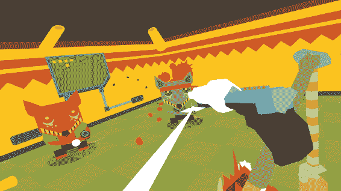
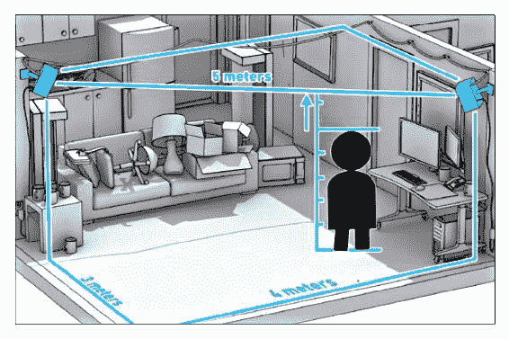
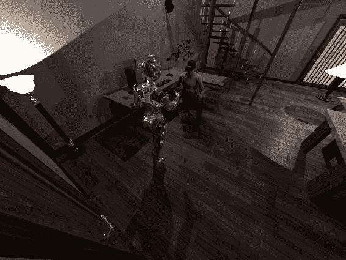

# 什么是虚拟现实，真的？

您阅读本书是为了学习制作**虚拟现实**（**VR**），但什么是虚拟现实？

这似乎是一个足够简单的问题，但答案却无处不在。大多数人认为虚拟现实意味着虚拟现实或交替现实。

这不是虚拟现实。

我认为这是因为虚拟这个词可以表示几种不同的东西。对于计算机科学家来说，虚拟这个词的意思是模拟它虚拟化的东西。换句话说，虚拟硬盘驱动器假装是硬盘驱动器。

虚拟对象的行为就像它是真实的，但它不是——通常，它比物理对象更灵活、更易于控制、修改和支持。在许多方面，它比物理对象更好。例如，虚拟磁盘的作用就像计算机磁盘。它可以存储数据。然而，这些数据可能在物理旋转磁盘、固态驱动器甚至内存中。虚拟磁盘可以调整大小，而物理磁盘只能复制到更大（或更小）的磁盘。虚拟磁盘更灵活。

有些人认为虚拟意味着几乎不可能。如果一辆特斯拉汽车经过，他们可能会说，“*这实际上是无声的！”*人们知道它并不是真的无声，但它比一辆大 V8 汽车经过时要安静得多。或者，*那个人是一个他们喜欢的人的虚拟圣人*。在这种情况下，它的意思是几乎或全部除了名字。

虚拟也可以指有美德的人。一个行为合乎道德的人是虚拟的，尽管这不是这个词的正常用法（应该是美德）。这个词就是从这里来的；在拉丁语中，虚拟意味着力量或美德。然而，在我们的例子中，我们指的是看似真实，却并非如此的东西。

我认为这是对虚拟现实的误解。人们认为这几乎是真的。很多人认为虚拟现实还没有出现，因为它看起来不像真实世界。要想通过虚拟现实耳机看到真实世界，还需要很长一段时间；其他感官，尤其是触觉和味觉，可能需要相当长的时间才能被模拟出来。

然而，这不是重点；虚拟现实的关键不在于它几乎是真实的。关键是，当你身处其中时，它似乎是真实的，即使它看起来一点也不像现实。

我要再说一遍，因为这是一个重要的区别。虚拟现实，或者说增强现实，不需要是近乎真实的，但当你身处其中时，它会*看起来*真实（即使它看起来一点也不真实）。

在本章结束时，您将学习：

*   什么是虚拟现实及其工作原理
*   虚拟现实的一些历史——这不是新的，这项技术已经有 50 多年的历史了！
*   用户代理-通过控制器与世界互动
*   渲染硬件
*   如何观看虚拟现实
*   耳机类型

# 什么是虚拟现实及其工作原理

我们有很多感觉。为了让我们觉得另一种现实是真实的，我们需要用这些感官来愚弄大脑。大多数虚拟现实系统使用两种：视觉和声音；触摸也被使用，但不是完全伸出手去触摸某人的感觉（尽管人们正在努力！）

Tor Nørretranders 用计算机术语汇编了有关感官及其相对带宽的数据。这有点像是比较苹果和机油，尽管这有助于了解它如何应用于虚拟现实。

所以，我们可以看到，如果我们让你看到的东西实际上是真实的，我们也许能够说服大脑它是真实的。然而，仅仅在我们面前放一个视觉屏幕并不是完整的答案。

给予某人深度的感知是最重要的答案。

这是一个相当复杂的主题，但显示物体深度的主要方法是立体深度感知。还记得那些 ViewMaster 玩具吗？以下是一个示例：

你放了一个有左眼和右眼图像的磁盘。左侧和右侧的图像看起来几乎相同，但它们代表了如果你站在那个位置，右眼和左眼会看到什么；由于视差的原因，每一个都略有不同。从磁盘上，我们可以看到左眼和右眼的图像。前面的视图母版中的镜头将您的眼睛聚焦在图像上。

你的大脑会看到这两幅图像，并将这些图像融合成看起来真实的东西。这使用了一种称为**立体深度感知**的深度感知技术

是的，View Master 是早期的虚拟现实查看设备！

现在，这里到底发生了什么？立体声是如何工作的？

当你看某物时，你的眼睛之间的透视和分离会使你的眼睛以不同的方式聚焦在距离较近的物体上，而不是距离较远的物体上。在这张图中，黄线表示我们对近处物体的视线，橙线表示对远处物体的视线。请注意，黄线之间的角度大于橙色线的窄角度：

一个友好的机器人借给我们她眼睛的下半部分来制作这张图片（这就是为什么它会显示电路板）。你真正的眼睛构造得有些相似；为了便于说明，我省略了光线以及它们落在眼睛后面的位置。

通过黄线和橙线之间的角度差，你的大脑会自动判断你的眼睛是指向近的还是远的物体。

这只是我们大脑用来区分深度的一种方法。另一个对虚拟现实同样重要的是*视差*的使用。

视差指的是这样一种方式，不仅左右安卓眼睛的指向不同（就像你的眼睛，当它们连接到你的头上时），而且每只眼睛看到的是相同对象的稍微不同的视图。如果你左右移动你的头，即使只有一只眼睛也能做到这一点，这也是单目视觉的人感知深度的方式（以及其他方式）。

这是您的左眼看到场景的方式：

这是右眼看到同一物体的方式：

视差指的是当用另一只眼睛观察时，或者当你从左向右移动头部时，距离较远的物体比附近物体的左右方向要小的方式。我们的大脑（以及动物的大脑）会本能地把这些看得更近/更远。

红色立方体或者紧挨着蓝色立方体，或者紧挨着绿色立方体，这取决于眼睛看到的图像。你的大脑将整合这一点，再加上如果你把眼睛从一边移到另一边，立方体是如何移动的，这也会给你一种深度感。

Don't despair if you are in the percentage of the population that do not perceive 3D movies. They strictly rely on stereoscopic depth perception and do not take parallax effects into account; they are pre-recorded.

With *true* VR (computer generated or light field based 360 video), if you move your head, you will see the parallax effect and the VR can seem real just like someone with stereoscopic depth perception sees.

我有单视功能，因为我有一只近视眼和一只远视眼，VR 对我来说非常有用。你的里程可能会有所不同，但如果你不喜欢 3D 电影，试试 VR（再说一次，我真的很喜欢 3D 电影）。

当你从右向左移动头部时，即使你有一只眼睛，视差深度感知也会起作用。

还有一种方法，你们的大脑将用来确定物体的深度——聚焦。（事实上，除了列出的方法之外，还有许多其他方法，例如远处对象的蓝移，如山脉，以及其他效果）。聚焦现实世界中的某个对象将使该对象和距离大致相同的其他对象显示在焦点上，而距离更远和更近的对象将显示模糊。有点像这样：

当前的 HMD 不能准确地显示聚焦效果。你看到的是一个小屏幕，通常在你面前有一个大约 5 英尺的固定焦点。所有的物体，无论是近的还是远的，都会像屏幕上显示的一样被聚焦。这可能会导致轻微的 VR 不适，称为适应-收敛冲突。基本上，如果你聚焦在远焦立方体（鲑鱼色立方体），你的眼睛仍然会聚焦，就好像鲑鱼立方体位于红色立方体所在的位置一样；然而，你的眼球将立体地瞄准，就好像它位于它应该在的地方一样。这种效果在非常接近的对象中最为明显。

The accommodation-vergence conflict is most severe with close objects - so try not to have anything, such as a GUI, located too close to the user's location. You will reduce sickness this way.

This means you may need to float GUI elements out into the room instead of having them very close. This may cause overlapping UI elements. 

虚拟现实设计具有挑战性。我期待着你的设计！

# 立体和视差在虚拟现实中的应用

早在 1968 年，伊万·E·萨瑟兰（Ivan E.Sutherland）就首次观察到具有立体深度感知的物体，当用户头部移动时，这些物体似乎位于空间中（运动视差），这些物体似乎是真实的。

他和鲍勃·斯普鲁尔开发的系统，通常被称为*达摩克利斯之剑*，只是在空气中显示了一些发光的线条，但：

*"Even with this relatively crude system, the three dimensional illusion was real."* *-Ivan E. Sutherland, AFIPS '68 (Fall, part I) Proceedings of the December 9-11, 1968, fall joint computer conference, part I: [http://bit.ly/2urAV5e](http://bit.ly/2urAV5e)*

在这个例子中，真实意味着尽管完全缺乏真实的渲染——只是一个发光的立方体——但人们认为它是真实的。这是由于立体渲染和视差效果。人们可以转头左右移动一点。

他们发明了第一款虚拟现实耳机，或**头戴式显示器**（**HMD**）。

被广泛认为创造了虚拟现实这个术语的人 Jaron Lanier 说：

“It's a very interesting kind of reality. It's absolutely as shared as the physical world. Some people say that, well, the physical world isn't all that real. It's a consensus world. But the thing is, however real the physical world is – which we never can really know – the virtual world is exactly as real, and achieves the same status. But at the same time it also has this infinity of possibility that you don't have in the physical world: in the physical world, you can't suddenly turn this building into a tulip; it's just impossible. But in the virtual world you can …. [Virtual Reality] gives us this sense of being able to be who we are without limitation; for our imagination to become objective and shared with other people.”
- Jaron Lanier, SIGGRAPH Panel 1989, Virtual Environments and Interactivity: Windows to the Future. [*http://bit.ly/2uIl0ib*](http://bit.ly/2uIl0ib)

一位名叫梅尔·斯莱特（Mel Slater）的研究人员对这一概念进行了进一步的研究，创造了更多的术语“存在性”和“合理性”。有些人把这一切称为**沉浸**。屏幕上的 3D 图像并不像你戴着头盔时那样引人注目，你唯一能看到的就是构建的 3D 世界。由于音频和视频提示，您会感觉到一种存在感，即使渲染与真实世界不同。似是而非意味着，即使你在现实世界中所看到的并不完全是真实的，你所看到的也有规律和有效性。

仅限于看到 HMD 中的内容，以及视差和立体视图，以及任何音频（如果做得好，声音非常重要）的组合将让你沉浸在虚拟现实世界中。有了所有这些东西，即使图形不是真实的，你也会感到沉浸其中，并且变得真实。更多学术细节见[http://bit.ly/2vGFso0](http://bit.ly/2vGFso0) ，尽管我将在本节中对此进行更多解释

这确实有效。

虚拟现实并不一定要看起来像现实，但它看起来似乎是真实的。例如，看看游戏*Quell4D*：

图形是块状的，图像看起来一点也不像现实。然而，当古老的三鼻子大象 Necro 萨满向你走来时，你会感到害怕。它们似乎是真的。对你来说，当你玩游戏的时候，它们是绝对真实的，这意味着如果你不认真对待它们，你（游戏中）的人就会死。

虚拟现实模拟火灾会让大约 10%的人惊慌失措地走出房间，尽管火焰看起来与真实火焰完全不同。

虚拟现实在这里。我们不必等到图形变得更好。很多人都这么说虚拟现实，但这是因为他们还没有尝试过虚拟现实，并且正在对虚拟现实应该是什么进行假设。

潜水吧，水很好！

So, Virtual Reality is something that will seem real, not something that necessarily looks real (but it helps if it does!).

You do not have to wait until better graphics come around. 

# 如果虚拟现实看起来不是 100%真实，为什么它能工作？

我们的眼睛可能是向我们展示世界组成的最重要的感官。如果我们用这些图片代替图片，让某人沉浸其中，他们就会开始变得真实。当你第一次进入虚拟现实时，你最初的反应是，“*看起来不是真的”*但是有了一个好的虚拟现实设置，你会想到*“哇，那是真的”*，即使你知道你在看的基本上是一个电脑游戏。

A fast frame rate (speed of display) and enough resolution will trick your brain into thinking what it sees visually really does exist. This is a powerful effect that most, but not all, people will have when immersed in such images (not everyone with normal eyesight sees 3D movies either).

事实上，现实感是如此之好，以至于人们可以通过观看虚拟现实来生病。这是因为你的眼睛可能会说那是真的，但你的其他感官，比如你的内耳，会说我们不会在空中跳 10 英尺。如果你的眼睛认为你在空中弹跳，你的腿部肌肉（本体感觉）说你在地面上，你的皮肤说你感觉不到风，你的内耳说你在向前飞行时没有倾斜，那么你的思维将在一个非常深的层次上混乱。

当你的感觉强烈不一致时，你的身体有一个防御机制。它认为你中毒了；结果，你的身体会感到恶心，甚至可能生病。你的身体担心你的眼睛看不到身体其他部分的感觉，所以它可能会试图清除你胃里的所有东西，以防你吃的东西中毒。

是的，一点也不好玩；不同的人会有不同的反应。

然而，并不是所有的虚拟现实都能做到这一点！一般来说，结构糟糕的虚拟现实会给你这种感觉。关于这一效应的学术论文已经发表。这本书将把这些讨论总结成一些简单的规则，让你的虚拟现实对人们来说更舒适。

虚拟现实的另一个重要方面是你可以与之互动（现实本身）。这带来了机械上的困难；并非每个人都拥有 3D 控制器。我们将在*用户代理部分介绍这一点——通过控制器*与世界互动。真正的虚拟现实可以与之交互，即使它像凝视检测一样简单——注视某物（凝视）并发生事情——运动发生，你被传送，动画播放。

# 其他类型的虚拟现实；AR、XR、SR/FR

还有另一种图像类型，有时称为 VR，即**360 视频**。有专门的视频播放器，可以在各个方向录制。复杂的软件将不同的摄像机输入缝合在一起，形成一个视频流，播放软件将投射到你周围。当你回头时，你似乎改变了你在电影世界中的观点。就好像你在现实世界里，环顾四周，想看什么就看什么。

360 视频看起来可能比大多数计算机图形生成的虚拟现实要好，但对我来说，这不是现实，因为你充其量只是一个虚无的幽灵。当然，这个世界看起来很棒，但是你不能伸手去摸东西，因为它已经被拍下来了。360 视频和类似的系统超出了本书的范围。话虽如此，我确实认为 360 视频确实是一种有效的艺术形式，也是一种值得追求的东西——只是这本书没有涵盖。

请理解-我的意思不是轻视 360 视频，只是因为它不是*真实的*VR。（把那个倒数第二个字的发音，就像它周围有空中引号一样）。360 视频可以是非常温暖、激烈、情绪化的戏剧。你确实得到了一点存在感的暗示，视觉效果令人震惊。这是一个我们应该看到令人惊叹的艺术正在制作的领域，因为更多的人都熟悉它并了解其细节。

我正在为 360 视频提议一个新术语；**电影真人秀****FR**或**环绕真人秀****SR】**。（虽然没有人用真正的胶卷拍摄，但短语“filmed”的意思仍然是通过镜头来记录一些东西，但 SR 可能更好。你选择！）

还有其他类型的虚拟现实。如此之多以至于有些人使用短语**XR**，这意味着（任何）现实；主要指 AR 和 VR。什么是 AR？

HMD 由一些小型显示器和复杂的光学元件组成，当您戴上耳机时，可以看到立体 3D 图像。大多数 VR 头戴式耳机都有意将你置身其中时的世界隔绝开来，让你进一步沉浸在 VR 中。这是虚拟现实的一个重要组成部分，尽管有一种称为增强现实（AR）的虚拟现实，其中虚拟现实项目通过佩戴一种透明的 HMD 投影到现实世界中。虽然微软 Hololens 可能是最著名的，但有很多制造商。还有一款游戏*口袋妖怪 Go*，这是一种 AR。人们举起手机，手机上显示的图像是在现实的基础上分层的。这不是耳机，但仍然是 AR。口袋妖怪世界增强了现实。

虚拟现实系统也可以是世界上的系统上的**窗口，尽管这在今天并不通常被称为虚拟现实。换句话说，一个真实的、持久的 3D 世界，你坐在键盘旁，通过屏幕观看。在几年前的最后一次虚拟现实浪潮中，这被称为虚拟现实，尽管今天它已经很普遍，人们不再称之为虚拟现实。你可能听说过**魔兽世界**。**

这是一种虚拟现实；虽然它不是（通常）在 3D 中，但它是一个在另一个现实中持续存在的世界。这也是一个完整的 3D 世界，你可以通过看你的屏幕看到；屏幕将你传送到一个虚拟现实中，因此它类似于 Windows on World 系统（尽管不是头跟踪）

观看电影可以被视为虚拟现实的一种有效形式；你被带到了另一个世界，在很短的一段时间里，你感觉自己好像沉浸在故事中。电视是一种虚拟现实技术。

事实上，VR 一词的首次使用是指剧院。虽然今天很多人会说那不是虚拟现实，但他们花了很多时间观察其他现实，而没有注意坐在他们旁边的人。这怎么不是虚拟现实？你沉浸在*与星星共舞*中，但你认识其中任何一个吗？它们实际上是真实的。

然而，这并不是大多数人的想法。本书将使用现代（2014+）对虚拟现实的解释，即通过 VR 耳机或某种类型的 HMD 观看的东西。如今，术语 VR 通常指耳机或 HMD，并且通常与某种形式的手控制器结合使用。好的、有效的 HMD 现在都可以在市场上买到。现在是对虚拟现实感兴趣的好时机。

WebVR 的好处在于，我们仍然可以通过浏览器看到这些虚拟现实世界，而无需使用 HMD；这对于测试和没有硬件的人来说是非常好的。

WebVR 非常包容

# 虚拟现实的历史

大多数人也认为虚拟现实是相当新的，但它实际上已经存在很长时间了，我指的是传统类型的带耳机的虚拟现实。第一个头盔显示器是由伊万·萨瑟兰和鲍勃·斯普鲁尔于 1968 年发明的。由于当时的技术，它又大又重，因此被悬挂在研究室的天花板上。它也只显示线框图像。由于它的大小，它被称为达摩克利斯之剑。它展示了一个简单的线框世界。当时的计算机速度不够快，无法显示出比几条发光的线条更复杂的东西。

90 年代末，个人电脑开始以足够快的速度显示 3D 世界，出现了新一轮的虚拟现实。我参与了这些努力；我当时正在为 CompuServe 开发一个 3D 环境，当时正是这个地方。

你可以去商场，用一个昂贵的 HMD，在一个共享的虚拟世界中与最多四个人在线。这被称为基于位置的娱乐，因为系统庞大且昂贵。今天，你也可以去虚拟现实商场体验硬件，但令人兴奋的是，虚拟现实的许多系统对于家庭爱好者来说是非常便宜的。

# 用户代理-通过控制器与世界互动

HMD 不是一切，尽管它肯定是最重要的部分。能够看到一个虚拟现实世界是很棒的，但在某个时候你希望能够与之互动。如果世界是静止的，你会觉得自己像一个虚无的幽灵。当你可以与世界互动时，这就是虚拟现实。

最终，像全套触觉（物理反馈）和身体跟踪，以及复杂的软件，将允许我们接触虚拟世界。这是未来值得期待的事情。

目前，我们通常与世界互动的方式是通过各种手持控制器。不同的控制器具有完全不同的功能和要求。高端（但消费者仍然可用）VR 设置的控制器，如 Rift 和 Vive，与移动 VR 控制器的工作方式有很大不同。我们将首先讨论高端系统，然后讨论移动 VR 控制器。

# 适用于 PC、Mac 和 Linux 的高端控制器

有了**PC VR**，例如 HTC Vive 或 Oculus Rift，控制器提供了与虚拟现实世界交互的非常重要的能力。这些控制器在 3D 空间中进行跟踪，以便软件知道它们在哪里。开发人员可以将其编码为手、枪等。这让你能够接触到周围的世界——这对于让你正在与之互动的虚拟现实成为你可以与之互动的东西非常重要。

为此，Oculus 和 Vive 控制器都需要外部跟踪硬件。在 Vive 中，这些灯塔或 VR 基站位于 VR 区域的角落。（这里有一个图表，可在[找到）http://bit.ly/VIVEManual](http://bit.ly/VIVEManual) ）。这些小而不显眼的立方体发出红外跟踪信号，控制器和耳机接收并使用这些信号在真实的 3D 世界中精确定位它们。在 Rift 中，有两个或三个传感器也可以跟踪设备，为它们提供真实的位置：

基站和跟踪硬件对 HMD 本身也非常重要

这种对真实世界位置（实际头部/手）的跟踪使移动、转动头部、移动手/控制器看起来真实，因为耳机和控制器的位置、方向和移动在真实 3D 空间中被精确跟踪，一旦软件向用户显示虚拟现实世界，任何头部运动都是真实的。

实际上，这意味着 PC 控制器似乎就在您看到它们的地方。我在技术演示中第一次体验 HTC Vive 是令人惊讶的——我戴上了 HTC Vive 耳机，在虚拟世界中，看到了我面前的控制器。我希望在控制器到达我认为应该到达的位置之前，我会一直摸索着。我伸出手，我的手指感觉到控制器正是我眼睛看到的地方——通过 HMD。

我上瘾了！虚拟世界真的是虚拟现实！我看到的幻影控制器是*真实的*，尽管我知道我看到的是我面前的一个小屏幕。

它们是如何工作的？

# 宏达电万岁

HTC Vive 在覆盖区域的两端使用两个称为**基站**或**灯塔**的方形小立方体。它们发出超过 120 度的红外光；这意味着如果它们在一个角落里，它们可以离角落几英寸远，并且仍然覆盖着墙壁（否则，你必须在墙上挖一个洞，把灯塔放在正确的位置！）

通常，您将两个基站安装在房间的对侧，相距约 16 英尺或 5 米，高于头部高度约 2 米或 6 英尺 6 英寸。如果你高一点没关系——把它们骑得高一点！

基站也可以用合适的适配器或定制支架安装在麦克风支架上。并不是每个人都有一个大客厅，所以这些安排可能有助于适应它。

Vive 也可用于坐姿配置，尽管真正的点是所谓的**房间比例**。

房间比例虚拟现实意味着你可以在虚拟现实世界中四处走动，就像你在真实世界中走动一样。不需要远程传送或其他技巧。当然，该区域需要远离家具，这是 VR 的一个普遍问题；不是每个人都有一个大房间，他们可以清除。

如果你离得太近，Vive 会在你的空间边缘显示边界或守卫，以确保你的安全。

Make your room bounds slightly less than the actual room, if it's a wall or other area. If it's a couch or chair, you can go right to the end of the chair.

We do this so you don't hit your arm on the walls. This is easy to do if you are standing up against the wall, but still in the virtual world and therefore can't see the wall, and you swing your arm, your hand won't go through the real wall!  

走到沙发边上很好，因为在你的手撞到墙上之前，你的小腿会撞到沙发上。实际上这并不是什么大问题，因为在你靠近之前你会看到警卫。请注意 Vive/Steam VR 教程！

HTC Vive 的工作原理是拥有一些**惯性测量单元**（**IMU**s），用于检测 HMD 以及控制器的位置。这些 IMU 会漂移，因此基站会有一束红外光束扫过房间。当控制器、跟踪器或 HMD 检测到这些光束时，它们会自动重新居中。这种重新定心是完全无法检测到的。这种系统的优点是，即使控制器从基站或灯塔中的一个看不见，虚拟现实系统仍然知道该项目所在的位置和指向的位置

总体效果是精确性和存在性，尽管主要效果是稳定性。如果双手交叉，控制器暂时离开基站，控制器不会失去锁定。

Try not to put your VR space in an area with a lot of windows or mirrors.

The Infrared beams can reflect off of them, leading to instability.

# 虚拟现实眼镜

**裂痕**最初只是作为一个耳机出现，没有控制器。它的初始基站是两个摄像头，你放在桌子的左右两侧；它们指向 HMD 并用于在世界上定位它。

不久之后，Rift 增加了第三台摄像机的功能；有了三个摄像头，你就可以进行房间比例的虚拟现实。他们的定位与 Vive 略有不同；查看 Rift 文档以获得最佳定位。

Be careful with cables. As I wrote this book, the Rift is cabled directly into the back of the PC. If you trip over the cables, you could yank them out of the PC fairly hard, leading to damage.

The Vive has a breakout box, so if you trip over a cable, you'll hopefully pull it out of the box. 
Don't trip over the cables.

这本书的目的不是要分析为什么生命或裂痕比另一个更好或更坏；它们的工作方式大致相同，基站/摄像机帮助控制器和 HMD 跟踪它们的位置和旋转。以下是一个典型的设置：

其中，Vive 基站安装在墙上；我们有一台台式 PC 和一个 VR 用户，他们可以像观看真实的 3D 模型一样观看 3D 模型。VR 用户持有两个 Vive 控制器；虚拟图像中有一个 Xbox 风格的游戏控制器。

此图还显示了 Oculus Rift 3 摄像机跟踪器系统。它们是浅灰色的物品，位于屏幕的左侧和右侧，以及沙发背面（就在我们前面）的 credenza 上。

没错，控制机器人就是用户。她不需要头盔显示器；系统将视频直接传送到她的眼睛。虚拟对象是看起来坐在桌子旁的人

上图是沙发前面的第三个人可能看到的场景视图。

灯塔看到的其实有点不同，但很有趣。它们实际上有几个红外条扫过视图，控制器看到这些线在视图中跟踪。当它们这样做时，控制器（和 HMD）将重新同步其惯性跟踪的定位。这意味着，即使控制器不在基站的视野内，它仍会保持跟踪，尽管您不想将控制器隐藏太长时间。惯性跟踪系统会漂移。漂移的视觉问题是，你的手臂似乎会慢慢远离你的身体——这显然是非常令人不安的。Vive 灯塔和裂谷相机阻止了漂移的发生。灯塔投影的视角约为 120 度。如果在灯塔的后面，最右边的灯塔上有这样一个视野的摄像机，那么它就会看到：

通过这座灯塔，你可以看到控制器和头盔显示器。然而，有一个问题。注意红色的圆圈——左边的大镜子实际上是一台巨大的电视，但它很闪亮。因此，灯塔的红外光束将从灯塔上反弹，控制器将感应到两个光束：一个直接光束和一个反射光束。

这可能会导致 HMD 和您的视角跳跃，或者您的控制器莫名其妙地移动。

Avoid shiny objects, mirrors, and windows in your VR room.

You might need to draw drapes, or even throw sheets over TV's, glass china cabinets, and the like.

Art requires sacrifice!

从另一座灯塔，其中一个控制器被封锁，但仍然通过其内部惯性跟踪和另一座灯塔 100%跟踪。

# 移动虚拟现实

对于**移动 VR**来说，还有谷歌白日梦和三星 Gear VR 控制器。由于使用了更简单的硬件，从而使价格更合理，因此没有完全 3D 跟踪。

在移动虚拟现实中，由于没有 Vive 和 Oculus 都具有的房间跟踪外部传感器，虚拟现实控制器的跟踪不那么精确。在实践中，它们看起来同样真实，但会周期性地漂移。就好像你的手在没有控制的情况下慢慢向右移动。因此，Mobile VR 有一个重置控制器按钮，可以将控制器移动到预定义的位置，例如靠近臀部的位置。您的手可能会被直接伸出，但如果您按下 Home（主页）按钮，VR 显示屏将显示您的手现在位于您的臀部。

这可能需要一些时间来适应。这种设置有很多优点；它更便宜，需要更少的外部硬件，而且世界上有更多这样的系统。然而，PC 硬件确实提供了更好的虚拟现实体验。

移动控制器的另一个缺点是只有三个**自由度**（**自由度**）。这意味着它们跟踪倾斜、偏航和滚动，但不跟踪位置；如果您将控制器平放在左侧，则在游戏中，您的控制器根本没有移动。这就是为什么你不能用移动控制器抓取东西。Vive 和 Rift 都有 6 个自由度控制器，所以你可以移动它们并抓取东西。

# 渲染硬件

为了避免 VR 疾病，您需要**快速帧速率**。帧速率是多少？这是您的计算机在屏幕上生成图像的速度。当然，这在很大程度上取决于场景的复杂性；展示一个立方体和一个盒子要比展示洛杉矶所有的建筑快得多。

当然，当你设计你将要实现的虚拟现实世界时，你可以控制这一点。

必须实时生成每个图像。大多数虚拟现实耳机的频率为 90 赫兹。赫兹指的是每秒的频率（以周期为单位），在这种情况下，指的是每秒的帧数。

虚拟现实的困难在于，任何东西都不能降低帧速率。如果必须加载某个内容或获取某个网页，如果您稍微降低帧速率，人们会感到头晕目眩。

有两种方法可以加快帧速率。一个是场景复杂度较低，另一个是速度较快的计算机。

电影《大白鲨》中的一句经典台词是，当他们发现鲨鱼比他们想象的要大得多时，鲨鱼撕碎了他们的船。罗伊·谢德说，“*你需要一艘更大的船*

要查看虚拟现实，您需要一台更大的计算机。

幸运的是，计算机的速度越来越快。说到电脑，我们还指高端智能手机。对于我们在这里建立的世界来说，一部速度相当快的智能手机应该没问题。

场景的复杂性有点进退两难；您想要一个丰富、详细的虚拟世界，但也希望虚拟世界能够快速渲染。如前所述，快速渲染是指每秒 90 帧（更新）。您还需要了解硬件支持方面的目标受众。它们都在高端个人电脑上，有一对千美元的显卡吗？（有点过分了；我在这里强调一点。）或者它们是在去年的手机模型上，带着一个 10 美元的硬纸盒和一些镜头吗？如果您了解您的潜在目标受众，您可以开发一个与他们的系统配合良好的 VR 应用程序。

美国海军陆战队有句谚语：*“训练如你所愿*。*在第二次世界大战期间，他们在加利福尼亚州南部海岸进行两栖登陆作战。当他们在太平洋战争期间不得不这样做时，他们没有计划建造珊瑚礁。因此，他们制定了一个原则，即你应该在与他们预期作战的相同或相当相似的环境中训练他们。*

 *虽然一个好的虚拟现实体验（希望）不是生死攸关，但这仍然是有价值的建议。如果您认为您的 VR 应用程序的大多数客户或消费者将使用去年的手机，那么请使用去年的手机进行测试。如果你认为它们会出现在高端 PC 上，请用高端 PC 进行测试。

不要以为，如果你的虚拟现实应用程序速度慢，客户会有更好的电脑，一切都会好起来。买一些和他们使用的相似的东西，然后你会比你的客户先经历恶心和眩晕，然后重新编码或简化你的场景以足够快。

多少硬件足够？为此，您应该参考您计划瞄准的耳机的最低规格。由于这种情况可能会发生变化，所以我不会在本书中对其进行总结，但不同的虚拟现实制造商给出的指导方针是很好的建议。

你可能需要一台更大的电脑（或手机）；这是你为成为早期采用者所付出的代价！

# 如何查看虚拟现实？

要查看虚拟现实，您需要某种类型的耳机或 HMD。在过去，虚拟现实的特点是在 2D 屏幕上显示 3D 图像。实际上，当时的虚拟现实意味着用任何设备观看任何 3D 程序——基本上像平常一样坐在你的电脑前，但这并不是真正的身临其境。如今，虚拟现实意味着使用 HMD/耳机；因此，要查看一个，您需要一个耳机。

具有讽刺意味的是，React VR 在浏览器中也可以作为 3D 世界使用，可以用来制作具有视差功能的网页，尽管这有点过分了。

# 虚拟现实可能很危险

你可能认为，这是相当安全的。然而，一个 VR 耳机附带了 33 页的警告。*阅读它们*。

大多数警告都是常识性的，例如，如果你靠近物体或人，不要挥手。戴上眼罩，你真的可以拍你的手了。从哲学上讲，我不相信保姆状态，但你真的会因为虚拟现实而受到伤害。想象一下，如果有人给了你一个眼罩，让你戴上，然后在你的房子里走来走去。你可能有点不舒服。

这就是我们在这本书中要做的，除了你会在惊奇和兴奋的状态中徘徊的额外皱纹。YouTube 上有很多视频，人们在视频中撞墙、撞墙、撞倒灯等等。它们看起来很傻，但当你戴上 HMD 时，你完全沉浸在虚拟世界中，根本不想动手。所以，确保你离开房间，并警告朋友不要进来。

这包括你的毛茸茸的朋友。把宠物挡在你的虚拟现实区域之外比较困难，但这是一个好主意，因为他们不会理解 HMD 分散了你的注意力，你也看不到它们。如果你能找到一种方法，最好是防止它们被踩到脚下，否则你可能会无意中踩到它们。

虚拟现实是安全的；负责任地使用。

# 虚拟现实耳机选项

对于 WebVR，有几个选项。我会把它保存在最简单、最实用的耳机里。您当然可以使用**开源虚拟现实**（**OSVR**），这实际上是一个硬件平台，但您需要弄清楚使用什么浏览器，等等。一些术语，如凝视，将在 UI 部分的后面介绍。现在，凝视移动意味着您需要凝视一些东西，以便 UI 将您移动到那里，或者让您选择一个对象，通常情况下

以下是各种主流的 WebVR 选项（您可以在[上阅读）https://webvr.info/](https://webvr.info/) ：

| **型** | **控制** | **动作** | **成本** |
| Gear VR（移动） | 1 台手持式头盔显示器 | 凝视/触摸板 | 中等的 |
| 白日梦虚拟现实（移动） | 1 个手持设备 | 凝视/触摸板 | 中等的 |
| 硬纸板/其他耳机 | 无（单击“可能”） | 凝视选择 | 低的 |
| 宏达电万岁 | 跟踪，2 个控制器 | 走来走去 | 高的 |
| Oculus Rift 2 照相机 | 键盘/操纵杆 | 凝视选择 | 高的 |
| Oculus Rift 3 照相机 | 跟踪，2 个控制器 | 走来走去 | 高的 |

# 耳机类型

从广义上讲，它们可以是连接 PC 的耳机或移动耳机。一些类型的独立耳机，如 Hololens 或 Vive 独立 VR 耳机，包括一台完全工作的 PC，因此它们实际上更像一个移动耳机，但不需要 PC。

# 移动耳机

移动耳机实际上只是用你的手机来显示数据，让你进入虚拟现实世界。因此，性能完全取决于手机的性能。

这是一个越大越好的时代。

但是有一个限制；有些耳机使用平板电脑，但它们非常笨重，与较小的移动设备相比没有任何优势。

当您使用移动耳机时，您会遇到电池寿命、重量和控制问题。市场上有各种各样的虚拟现实控制器，以及三星 Gear 虚拟现实（Samsung Gear VR）和谷歌白日梦（Google Daydream）等捆绑选项，其中包括一个控制器以及一个手机壳。

这些捆绑包的好处在于，手机通常经过认证可以正常工作，并且软件易于使用。您可以构建自己的虚拟现实耳机/控制器组合。

移动耳机也可以像一个盒子一样简单，里面装着一些镜头，尽管实际上在光学元件的尺寸和细节上有很多数学运算。最常提到的是谷歌纸板；谷歌不直接销售，但公司可以实现硬纸板查看器。还有一些非官方的硬纸板和一些价格合理、构造更好的支架，你可以把手机放进去。

一般来说，它们大多数没有传感器。有些有一个小杠杆，可以触摸屏幕，允许一些控制而不是移动。

您也可以购买单独的蓝牙控制器，尽管它们很可能没有三维定位。我们在[第 11 章](11.html)、*野外漫步*中介绍了不同类型的控制器。

有些虚拟现实耳机可以配眼镜，有些则不能，这在很大程度上取决于你的脸型大小、你使用的眼镜大小以及你的确切视力问题。我有一只近视眼和一只远视眼，并且不需要眼镜（两只眼睛都不需要），但是你的里程数可能会有所不同。我强烈建议在购买前试用耳机，或从有良好退货政策的来源购买。

在高端（移动耳机），有三星 Gear VR 和谷歌 Daydream。它们提供了一个构造良好的耳机，您可以再次将手机放入其中，还提供了一个单独的控制器。

控制器是其中最重要的部分（尽管耳机也值得一试，因为它比最好的硬纸板观众都舒适得多）。Daydream 和 Gear VR 捆绑包中的控制器都是蓝牙，即无线的，并且有点跟踪。

他们有传感器，可以检测运动，但不能精确定位在太空中。因此，它们上面有中心按钮。这是因为这些装置中的三维位置传感器类型会随时间漂移。在虚拟现实世界中，你的手/控制器/枪（或控制器具有的任何视觉表现）似乎会远离你，甚至在你身后移动！这可能非常令人不安。如果发生这种情况，只需使用适当的按钮重新居中控制器即可。

高端 PC 设置有不同类型的跟踪，通常不需要重新定心。但是，请注意，它们需要初始校准/设置，也可能存在跟踪问题。

Notes on GearVR A few things with the GearVR I did a little wrong. There's an extra elastic strap that I thought was for slack or something; its not. They tell you to put the straps on, but neglect to mention this extra strap is to hold the controller. Flip ahead to the controller part before putting the straps on the headset.

The controller should actually be the part you fiddle with first. You need to pair it and carry out some downloads, and that can't really be done when the headset is on, so do this part first.

# PC、Mac 和 Linux 耳机

大多数人认为选择 PC 耳机是在 HTC Vive 和 Oculus Rift 之间，但是有几十种或数百种 PC 类型的耳机。

它们的性能取决于您的电脑性能。伙计们，这就是 Mac 电脑有点缺点的地方；你需要一个快速的视频卡，而 Mac 的速度通常足以支持图形和一些游戏，但不能支持虚拟现实。不过，苹果公司已经推出了 VR 准备好的 PCs.，当你决定用什么平台来做 VR 的时候，考虑一下这一点。

正如本文所述，Mac 对 Oculus Rift 或 HTC Vive 的支持充其量是实验性的，因此步骤和示例将假定您使用的是 PC。Linux 支持承诺用于几种耳机，但在本书中，它充其量是实验性的。如果您使用的是 Linux，则需要检查文档和/或尽可能遵循 Windows 示例。

大多数 React 虚拟现实演示的几何结构比许多虚拟现实世界都简单，因此它们将在相对较小的硬件上运行。请向耳机制造商咨询最低要求；不要以为你能以低于最低限度的价格过活。你会生病或者有不舒服的经历。

在整个市场中，我们将在本书中介绍两款耳机；HTC Vive 和 Oculus 裂谷。如果你有一个不同的耳机，样品应该可以正常工作，但你可能需要稍微摆弄一下。

一般来说，PC、Mac 和 Linux 耳机将与 Firefox 或实验浏览器[Servo.org](http://bit.ly/VRServo)配合使用。Chrome（Chrome）的实验版本也可用于查看 WebVR。请参见[webvr.info](http://bit.ly/WebVRInfo)上的完整最新列表。

# 总结

在本章中，我们讨论了虚拟现实，它为什么工作，以及它到底是什么（双关语）。我们还简要介绍了虚拟现实硬件和软件，介绍了如何进入虚拟现实世界。

请记住，即使您没有昂贵的 HTC Vive 或 Oculus Rift，您仍然可以在台式 PC 上查看 WebVR

接下来，我们将介绍如何在非常高的级别上编程 VR。构建 VR 软件应用程序有很多不同的方法，我们将介绍不同的方法及其优缺点。您将阅读不同软件包的概述，以及 WebVR 的优势。因为这本书是关于 WebVR 的，所以我们将介绍 React VR、Node.js 和其他工具的安装，以开始实现您自己的现实——真的！*