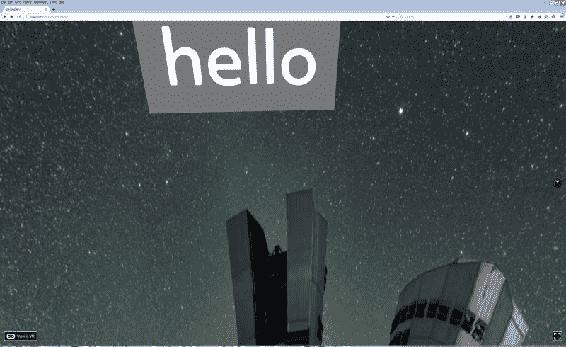
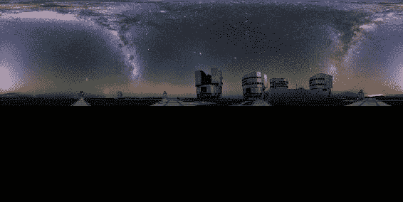
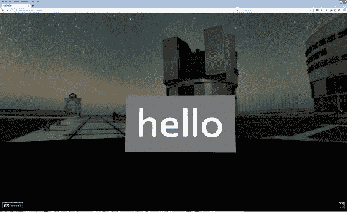

# 你的第一个虚拟现实应用

嗯，四章背景。希望您只浏览了最后一章，尽管我希望您在构建每个世界时会仔细阅读它或在线文档。既然您有了这样的背景，我们已经做好了构建第一个 React VR 应用程序的准备。我们将从深入了解 React VR 组件、道具和状态开始。

您将学习以下主题：

*   初始世界创建/制定 React VR 框架
*   设置良好的背景图像
*   如何修复背景图像，使其真正为等矩形
*   添加虚拟现实组件
*   创建新的 VR 关键字（类构造）

# 超越 hello world-我们的第一个虚拟现实世界

这实际上并不是第一个 VR 应用程序，虽然我们并没有真正制作第一个应用程序，但 npm 安装程序制作了。在[第 2 章](02.html)、*平坦与超越–VR 编程*中，在*Post Node.JS 安装–安装 React VR*部分*中*我们安装了一个简单的`Hello World`示例

我们将首先创建一个新的应用程序（目录）。但首先，让我们谈谈我们正在创造什么，为此，您将获得一个特别奖！

# 虚拟现实世界设计-或者，恭喜你，你是新的天文博物馆馆长！

任何项目都应该以设计开始，即使是非正式的。在这种情况下，您收到一封电子邮件，告诉您“*祝贺您，您被选为新的欧洲航天局户外博物馆馆长！*”作为您的奖品，您不用担心，这次访问不会损害天文学家的夜视。作为博物馆馆长，你可以选择不同于我的艺术品；事实上，你也可以着手创建一个全新的位置。

如果我们在这方面做得好，我们将进入外层空间，并能够成为轨道上的第一个艺术博物馆。因为我们是第一个，我们将是轨道上最好的博物馆。

# 创建基本组件

React VR 有许多必须安装的基本组件和代码。近 19987 个文件和 8111 个目录。您不必手动安装所有这些组件（而且浏览器也不会下载所有组件，其中很多组件可能是打包的，也可能不是打包的）。那么，我们如何安装所有这些？

安装所有东西只需一步。我们将打开 Node.js 命令提示符，导航到您希望将应用程序放置在其中的任何目录，并创建一个新模板。在正确的目录中键入以下代码：

```jsx
react-vr init SpaceGallery
```

这将安装一个名为`SpaceGallery`的新应用程序。它将开始安装以下内容：


请注意这一行：


These commands frequently take a long time to run, but some of the information they show is important. 

In this case, while I was writing the book some of the tools upgraded, and the system told me. I generally recommend upgrading as soon as you get one of these notices; if you don't, any bugs you submit won't get quite the attention you would like, and new features and bug fixes are frequently added.

Sometimes, however, you'll get warnings about stuff you don't really have control over, like the note about `connect@2.30.2`.

React VR init 命令将处理需要安装的所有内容，包括依赖项（还有一堆），然后将其全部安装。完成后，它将列出所有内容，然后退出。别担心，并不是所有这些代码都将交付给客户机。与 Unity 或 Unreal 等虚拟现实游戏引擎相比，实际下载量相当小。


React VR init 命令甚至会告诉您如何启动您的世界。如果我们启动此应用程序，我们将看到与我们在[第 2 章](02.html)、*平地和其他地方看到的*hello world*应用程序基本相同的*hello world*应用程序——VR 编程*。

首先，确保已停止正在运行的 hello world 应用程序——使用*Ctrl*+*C*，然后使用`Y`停止批处理文件。然后，使用`cd`命令（更改目录）进入您创建的新`SpaceGallery`目录。

If nothing you do seems to change your application, no matter what you try, it's quite possible you left an npm package running in some other directory. Kill all npm sessions and restart it.

继续并启动它：


If you get the error `yarn is not recognized as an internal or external command, operable program or batch file`*, *you can ignore this error; Yarn is similar to npm. Advanced users can use either one you want; as npm is used in the React VR examples, I'll use that in the course of this book.

Welcome to open source, sometimes the land of too many options. DuckDuckGo is your friend.

让我们改变背景，让我们有心情

# 创建更大的世界-背景图像

这是一个*动手*章节——前面的章节介绍了虚拟现实的一般背景。然而，现在我们实际上要改变背景（图像）。

您在 hello world 应用程序中看到的*国际象棋世界*实际上是`Pano`语句中使用的全景图像（在`index.vr.js `文件中）。当我第一次安装 React VR 时，有一秒钟我以为它是默认世界中包含的一些几何体。以下是我们对`SpaceGallery`应用程序的看法（2D 浏览器视图）：


除了 hello 文本框之外的所有内容都来自`<Pano>`对象：

```jsx
 <Pano source={asset('chess-world.jpg')}/>
```

这是一张特制的**球面全景图**或**等矩形投影图**。**它被扭曲成左/右 360 度和上/下 180 度（就像纬度和经度覆盖+/-90 和+/-180 一样，360x180 球形图像覆盖整个球体）。**

 **这里是`chess-world.jpg`，它是您每次制作虚拟现实世界时作为背景包含的文件：


需要注意的几点：

*   这是一个非常大的文件。它是 4096x2048 像素。即便如此，当你在 3D 中环顾四周时，它偶尔会看起来像颗粒状。这是因为当你在一台 15 英寸的笔记本电脑上看一个项目，比如说 35 厘米宽，离你的眼睛大约半米远，你看到的是一个 1920 像素的图像，它看起来很清晰。当你将图像 360 度散布在周围时，这相当于超过 17000 像素（2*pi*.5m*1920/.35m）。
*   即使在当今世界，大文件也会导致下载缓慢。
*   现在想象一下，如果背景是视频。虚拟现实对带宽的要求非常高。这是入场费。
*   文件看起来是扭曲的，但当它显示在浏览器和您喜爱的 HMD 中时，它将看起来笔直。
*   由于直线的缘故，这种特殊的图像非常适合测试；如果你向下或向上看，一切都会匹配。

你可以在网上找到 360 度全景照片，但要确保它们是 360 度乘以 180 度的球形全景照片。如果它们是由相机拍摄的，通常情况下，图像的顶部和底部会变得很奇怪；许多人认为你不会直视下或直视上。

地图投影也是等矩形图像，因此您可能熟悉它们以及在极点的拉伸情况。如果您使用地图投影作为背景，它看起来就像您在地球内部一样。

这可能有点奇怪。

It is a good idea to put some geometry that is part of your world directly underneath the viewpoint to cover any discontinuities or aberrations in your spherical panoramas. 

It also helps avoid a floating feeling; because the `Pano` is 2D and infinitely far away, stereoscopic depth perception wouldn't show how far away the `Pano` is. Objects will seem to move oddly against the floor if you move your point of view around in the VR world. Physical geometry through the primitives or model statements underneath the point of view may help avoid this and make your world look more virtually real.

当我们谈论太空中的画廊时，在我们进入轨道之前，让我们研究一些新的全景照片，并用它们来准备我们的背景。请使用您喜爱的搜索引擎在 web 上搜索更多全景照片。以下是我遵循的步骤：

1.  让我们去**欧洲航天局**（**ESO**）从[复制一幅奇妙的太空全景图 http://bit.ly/PanoESO](http://bit.ly/PanoESO) 。如果你想尝试不同的分辨率，他们在这个下载页面上有一系列的分辨率。这张照片很棒：


2.  将其下载到我们创建新应用程序的下方的`static_assets`文件夹中，然后打开`index.vr.js`。在该文件中，对`Pano`语句进行更改：`<Pano source={asset('uhd_vlt_circular_cc_eq.jpg')}/>`

3.  现在刷新浏览器，我们已经看到空间：



4.  你会注意到这些建筑看起来有点怪异。如果我们继续往下看，背景图像看起来更奇怪：


5.  这是因为，如果你仔细观察原始背景图像，它实际上不是 360x180 度，而是更像 360x90 度；很少有人抓住顶部和底部，使其成为真正的 360x180。一张真正的全景照片在底部和顶部看起来一样扭曲。例如，看看我们之前看到的平面国际象棋世界图像。
6.  This is fixable. The fix is to just add a black strip (or background color) to the bottom of the original 360x90 panormaic photo, like this:

    

    Using this technique, you can more or less fix any panoramic image, as long as it's at least 360x90; these are fairly common even if not marked as such. Now if we put this panoramic image in our `Pano` statement, or VR app looks much better:

    

    To do this, I used a freeware image viewing/editing program called **Irfanview**, although you can use Photoshop or any other image editing software. I would highly recommend Inkscape or Gimp; they are full featured and free/open source.
7.  当我们在 VR 中查看并检查控制台时，我们可以看到一个错误：

    ```jsx
    THREE.WebGLRenderer: image is not power of two (2000x2000). Resized to 2048x2048
    ```

    让我们通过调整大小来修复它。Irfanview 具有相当快的调整大小功能，可以保留大部分细节。只需调整大小（*Ctrl*+*R*），并将其设置为 2048x2048 或 2048x1024 即可。当我们将黑色条纹添加到底部时，我们可以在不拉伸图像的情况下调整图像的大小。如果你必须，你应该剪辑或扩展图像的底部；使用这些 360 度投影很难判断，但是如果你改变图像的纵横比，当你观看它时，世界看起来会被压扁。

If you get a blank or incorrect background, check the image format and size.

# 混乱的世界-添加我们的第一个虚拟现实组件

好的，现在让我们开始添加对象。

在本章开头的描述中，我们提到了移动到轨道。你可能想知道为什么我们不从空间背景开始。我们会，在我们在地面上创造一个世界之后。我发现作为背景的空间图像可能会迷失方向，没有地板，在我们在轨道上漂浮和上下变得毫无意义之前，我们需要讨论等矩形图像。所以，现在，在我们进入太空之前，你必须在地球画廊做得很好。

This brings up an important point. The `<Pano>` statement is usually described as a background. A better way to think of the `<Pano>` statement and background images are of the *rest of the world* or the part of the world you can't reach out and touch. Whatever your background image is, without any VR objects, it will place you *there*. The `<Pano>` really isn't just a background, it's really the whole world except for the objects you place.

This is why your choice of background is important for a sense of presence. If you have a weird, or disorienting background, people will feel disoriented. This may or may not be what you want; it can also spoil the sense of immersion. Also, they can never touch what is in the `Pano`, so if there are objects that are close, it may be disorienting. 

那么，让我们为室外画廊地板添加一个`Plane`，这样我们就不会在背景上漂浮。在`index.vr.js`中代码生成器生成的第一条`<View>`语句后，添加以下`Plane`和`Box`元素：

```jsx
export default class SpaceGallery extends React.Component {
    render() {
        return (
            <View>
//the above code is generated automatically, add your code below
//or after the <Pano> statement
<Plane 
    dimWidth={5}
    dimHeight={5}
    texture={asset('DeckPlate.jpg')}
    lit
    style={{
       transform: [
         {translate: [0,-1.8, -5]},
         {rotateX: -90}
         ] }}
/>
<Box 
          dimWidth={5}
          dimDepth={5}
          dimHeight={.1}
          texture={asset('DeckPlate.jpg')}
          lit={true}
          style={{
          transform: [{
            translate: [5.2,-1.8,.1],
          }]
          }}
        />
```

在我们保存和查看世界之前，我们需要`DeckPlate.jpg`文件。您需要从[下载此文件 http://bit.ly/VR_Chap5](http://bit.ly/VR_Chap5) 在`static_assets`文件夹中，并复制到`SpaceGallery`文件夹中的`static_assets`文件夹中。我用 Allegorithmic 的名为*物质设计师*的程序创建了`DeckPlate.JPG`文件，位于[http://bit.ly/AllegSub](http://bit.ly/AllegSub) 通过他们的材料共享网站。我找到了这个材料[http://bit.ly/MatSciFi01](http://bit.ly/MatSciFi01) 。由于您可能没有 substance player，我将此图像导出为`DeckPlate.jpg`。稍后，我们将构建更复杂的模型，并使用其他纹理构建实际材质。如果使用 Photoshop，也可以使用 Quixel.se 获得良好效果。见[网站 http://bit.ly/QuixelSuite](http://bit.ly/QuixelSuite) 。

在我们这样做之后，会发生什么？我们点击刷新，我们得到一个空白屏幕。打开 web 开发人员控制台。如果您在 Firefox 中，请单击工具| Web 开发者|切换工具（或 PC 上的*Ctrl*+*Shift*+*I*）。

控制台将打开，我们会看到很多错误，然后是：

```jsx
Expected a component class, got [object Object]
```

这是一条我们忘记添加到`import`指令的线索。当我们生成该对象时，它会将 hello world 所需的所有 React VR JSX 导入放入其中。无论何时添加新对象或 API，我们都需要确保 React VR 了解它。以粗体插入以下行：

```jsx
import {
 AppRegistry,
 asset,
 Box,
 Pano,
 Plane,
 Text,
 View,
} from 'react-vr';
```

In a large project, you may forget this on occasion. Check the console in your browser if your scene doesn't change. I also recommend using some code organization by adding your `import` declarations either in alphabetical order, or in the order you use them. Alphabetical order is easier to quickly scan. You could just import everything, but that may add some overhead you don't need.

# 照亮世界

一旦我们添加 import 语句，我们会注意到世界有些黑暗；可能很难看到我们添加的盒子和飞机。要点亮这些东西，我们将在图像中添加`AmbientLight`和`DirectionalLight`（太阳光或月亮光）。我们在这个应用程序中有点不真实，因为我们有一个明显的夜间图像背景，但我们的对象将被照亮。添加一个`AmbientLight`和一个`DirectionalLight`是一个很容易伪造自然世界的方法。在现实世界中，对象从其附近对象反射的光中获取光。`AmbientLight`可以模拟这种柔和的辉光（在其他渲染系统上通常称为全局照明）。方向灯模拟头顶的房间照明（许多灯光，如教室中的灯光）或太阳光或月亮光。

Put your lighting statements at the top of the `render()` statement in your app, so that you can easily find them. I would make them the first statements after the top level `<View>`.

If lighting is part of an object, such as a desk lamp, keep that light near the object (or as a child of the object).

This will allow you to quickly modify scene lighting.

我们的陈述很简单；`DirectionalLight`需要更多的思考，但也非常简单。按以下方式对其进行编码：

```jsx
        <AmbientLight
        intensity = {.3}
        />

        <DirectionalLight
        intensity = {.7}
        style={{
          transform:[{
            rotateZ: 45
          }]
        }}
        /> 
```

您现在应该可以看到平台了，尽管它们看起来很小。

Don't forget the import statements!

# 为什么我让你在一个平面和一个盒子里都粘贴？

它们都成为了我们世界的地板，为什么我们都这么做呢？如果你在虚拟现实视图中向右看，你会发现`Box`有一个有趣的边缘。纹理贴图将均匀地应用于所有六个面，并且在拉伸外形尺寸不接近的长方体时可能看起来很有趣。这是`Box`的一个缺点。`Plane`没有这个问题，但是如果您将`Plane`倾斜到错误的方向，您可能看不到它；`Plane`是单面的，因此如果从当前相机倾斜，则不可见。`Plane`也非常薄。我把它们都包括在内，这样你就可以看到它们的样子了。

在关于变换的部分中，我提到了变换顺序的重要性。这对于`Plane`对象尤其重要；如果旋转，然后平移，图像的方向可能完全错误，在`Plane`的情况下，图像是不可见的。

为了建造整个画廊，我们需要为平台包括几个正方形。在他们之间增加一点差距。现在，我们可以通过复制和粘贴每个`Box`或`Plane`（使用您喜欢的任何一个！）并更新`translate`语句来实现这一点：

```jsx
    {translate: [0,-1.8,-5.1]},
...
    {translate: [0,-1.8,.1]},
...
    {translate: [5.1,-1.8,.1]}

```

但是有更好的方法；React VR 不仅仅是一个硬编码的几何文件，而是一个实际的面向对象 JSX 文件，我们可以利用它

让我们定义一个新对象，它是我们的甲板之一。我们将把除了位置以外的所有东西都作为该对象的组成部分。首先（我用头在桌子上敲了一会儿），将代码的第一行更改为：

```jsx
import React from 'react';
```

致：

```jsx
import React, {Component } from 'react';
```

请注意，这是一个不同于我们在第二行中使用的`import`语句（很容易忽略）。

If you don't see an object you created, or get an error that a keyword that you know is valid isn't recognized, don't forget the `import` directive at the top of the file!

# 获取类-将对象合并为新关键字

导入 React 组件后，我们可以将对象定义为`class`。对于这个版本，我们将使用单个数字作为道具（如参数），然后根据需要经常实例化它们。我们可以把代码粘贴到任何地方；现在，您可以将其放在`export default class SpaceGallery extends React.Component`行上方的`index.vr.js`文件中。您的新`class`是：

```jsx
class Platform extends Component {
  render() {
    return ( 
    <Box 
      dimWidth={5}
      dimDepth={5}
      dimHeight={.1} 
      texture={asset('DeckPlate.jpg')}
      style={{
        transform: [
              {
              translate: [ this.props.MyX, -1.8, this.props.MyZ]
              } 
              ]
          }}
    />

    );
  }
}
```

要实例化此代码的副本，请在您的`<View>`内使用此代码（在您的`SpaceGallery`类中）：

```jsx
 <View>
...
 <Platform MyX='0' MyZ='-5.1'/>
 <Platform MyX='0' MyZ='0'/>
 <Platform MyX='0' MyZ='5.1'/>
 <Platform MyX='5.1' MyZ='-5.1'/>
 <Platform MyX='5.1' MyZ='0'/>
 <Platform MyX='5.1' MyZ='5.1'/>
 <Platform MyX='-5.1' MyZ='-5.1'/>
 <Platform MyX='-5.1' MyZ='0'/>

```

这是制作预制件或类的最直接方法，这样您就不必剪切和粘贴无休止的`Box`组件声明来制作地板。

如果您熟悉状态的概念，此时不要使用状态。对于随时间变化的值，应使用状态；我们将在[第 7 章](08.html)、*在你的世界中呼吸生命*中详细讨论这一点，尤其是[第 11 章](11.html)、*在野外散步*。因为这是应用程序的静态版本，所以您不需要它。我们将用道具在正确的位置搭建平台。

您可能认为可以创建一个向量，而不是两个命名参数，但是 JavaScript 没有向量的概念。但是，您可以使用`{ }`操作符粘贴适当的代码。创建楼板分段的另一种方法如下：

```jsx
class VecPlat extends Component {
  render() {
    return ( 
    <Box 
      dimWidth={5}
      dimDepth={5}
      dimHeight={.1} 
      texture={asset('DeckPlate.jpg')}
      style={{
        transform: [
              {
              translate: this.props.MyPos
              } 
              ]
          }}
    />

    );
  }
}
```

请注意，`translate`语句在`this.props.MyPos`的周围没有方括号，就像它在文本中一样。然后将其实例化如下：

```jsx
        <VecPlat MyPos={[-5.1, -1.8, -5.1]}/>
```

注意前面提到的`translate`语句中多余的`{ }`大括号和缺少的大括号。在本例中，您需要它来创建向量（数组）。

# 把它们放在一起

我们现在有了一个基本的平台来展示我们的艺术，你已经学会了如何创建我们可以实例化的对象，我们已经在场景中加入了基本的照明，现在我们来添加一些对象

你会发现，你已经完成了一项出色的工作，现在可以将太空画廊搬上太空。从 GitHub 的链接中，您可以下载一些新文件，包括`BabbageStation_v6_r5.jpg`。一旦我们用这个文件修改了`Pano`语句，我们将直接进入轨道——在你的加速椅上没有任何震动。又好又安静。

让我们继续建造画廊吧。首先，让我们合并并使用`Platform`；下载新的`static_assets`后，您的新`index.vr.js`文件应如下所示：

```jsx
import React, {Component } from 'react';

import {
  AppRegistry,
  asset,
  AmbientLight,
  Box,
  DirectionalLight,
  Div,
  Pano,
  Plane,
  Text,
  Vector,
  View,
  } from 'react-vr';

  class Platform extends Component {
       render() {
          return ( 
             <Box 
              dimWidth={5}
              dimDepth={5}
              dimHeight={.1} 
              texture={asset('DeckPlate.jpg')}
              style={{
                transform: [{ translate: [ this.props.MyX, -1.8, this.props.MyZ] } ]
                }}
             />
          );
      }
   }

export default class SpaceGallery extends React.Component {
    render() {
        return (
          <View>
            <Pano source={asset('BabbageStation_v6_r5.jpg')}/>
            <AmbientLight

    intensity = {.3}

    />
    <DirectionalLight
    intensity = {.7}
    style={{
        transform:[{
            rotateZ: 45
        }]
    }}
         /> 
         <Platform MyX='0' MyZ='-5.1'/>
         <Platform MyX='0' MyZ='0'/>
         <Platform MyX='0' MyZ='5.1'/>
         <Platform MyX='5.1' MyZ='-5.1'/>
         <Platform MyX='5.1' MyZ='0'/>
         <Platform MyX='5.1' MyZ='5.1'/>
         <Platform MyX='-5.1' MyZ='-5.1'/>
         <Platform MyX='-5.1' MyZ='0'/>
         <Platform MyX='-5.1' MyZ='5.1'/>

         <Text
         style={{
             backgroundColor: '#777879',
             fontSize: 0.8,
             fontWeight: '400',
             layoutOrigin: [0.5, 0.5],
             paddingLeft: 0.2,
             paddingRight: 0.2,
             textAlign: 'center',
             textAlignVertical: 'center',
             transform: [{ 
                 translate: [0, 0, -4]}]
         }}>
    Hello
  </Text>
</View>
);
    }
};

AppRegistry.registerComponent('SpaceGallery', () => SpaceGallery);
```

请注意，如果使用`Platform`或`VecPlat`作为对象，代码将大大缩短。

Note that I used `MyX='-5.1'` instead of `MyX={5.1}`. This works, but it is really incorrect. `{}` is used to insert JS into the code. Basically, if you want `MyX` to be a number, use `{'`s in the initialization list. JavaScript will covert, but sometimes lead to weird behaviors if you don't pass a number as a number.

您可能已经注意到，反应 VR 包含的基本原语有点稀疏。如果没有构造性实心几何体（通常称为布尔运算）或 native three.js，您可以创建的内容就会受到限制。

幸运的是，您可以从其他 CAD 程序导入文件。我们将在[第 6 章](06.html)*与 Poly 和 Gon 家族*的合作中详细介绍这一点，但现在，您可以导入我在[的书中包含的一些模型 http://bit.ly/VR_Chap5](http://bit.ly/VR_Chap5) 。

# 增加底座

在我们把艺术推向世界之前，我们需要建造一个基座。为了便于对齐，我们可以像以前一样创建一个对象。让我们做一个方形底座，在顶部和底部放一个盖子。

如果您在凯旋中休息了一天，请继续并重新启动 React VR 服务器；为了方便自己，我们可以复制 URL，以便将其粘贴到 web 浏览器中：


如果已选择要粘贴到浏览器中的前面文本，则需要等待很长时间。请注意地址栏中的“选择 npm”。

When you are using the console to start your app, if you "select" any text, and keep it selected, it may block the web browser from serving up the content.

因此，我们将创建一个带有顶部和底部的正方形`Pedestal`，而不是用于地板的简单立方体：

```jsx
class Pedestal extends Component {
    render() {
        return (
          <Box 
          dimWidth={.4}
          dimDepth={.4}
          dimHeight={.5}
          lit
          texture={asset('travertine_striata_vein_cut_honed_filled_Base_Color.jpg')}
          style={{
            transform: [ { translate: [ this.props.MyX, -1.4, this.props.MyZ] } ]
            }}
        />
          <Box 
          dimWidth={.5}
          dimDepth={.5}
          dimHeight={.1}
          lit
          texture={asset('travertine_striata_vein_cut_honed_filled_Base_Color.jpg')}
          style={{
            transform: [ { translate: [ this.props.MyX, -1.1, this.props.MyZ] } ]
            }}
        />
          <Box 
          dimWidth={.5}
          dimDepth={.5}
          dimHeight={.1}
          lit
          texture={asset('travertine_striata_vein_cut_honed_filled_Base_Color.jpg')}
          style={{
            transform: [ { translate: [ this.props.MyX, -1.7, this.props.MyZ] } ]
            }}
          />
    )
     }
     }
```

现在，当您尝试此操作时，您将得到一个错误：

```jsx
Adjacent JSX elements must be wrapped in an enclosing tag (31:10)
```

记住，这是反应 VR；使用 React，您可以在一个`<div>`语句中包含任意多个标记。这在这里不起作用，因为我们没有处理 HTML；最接近的东西是反应。因此，对于 VR，我们希望将多个元素/对象包装在一个`<View>`语句中。因此，正确的代码是：

```jsx
class Pedestal extends Component {
    render() {
        return (
          <View>
              <box etc='...'/>
              <snipped for='brevity'/>
          </View>
     }
     }
```

If you got the error `Expected a component class, got [object Object]` in your web console, you may have accidentally typed view instead of `View`

现在我们已经设置了`Pedestal`对象，将其粘贴到您的`index.vr.js`中，在所有平台下面：

```jsx
         <Platform MyX={ 0.0} MyZ={-5.1}/>
         <Platform MyX={ 0.0} MyZ={ 0.0}/>
         <Platform MyX={ 0.0} MyZ={ 5.1}/>
         <Platform MyX={ 5.1} MyZ={-5.1}/>
         <Platform MyX={ 5.1} MyZ={ 0.0}/>
         <Platform MyX={ 5.1} MyZ={ 5.1}/>
         <Platform MyX={-5.1} MyZ={-5.1}/>
         <Platform MyX={-5.1} MyZ={ 0.0}/>
         <Platform MyX={-5.1} MyZ={ 5.1}/>

         <Pedestal MyX={ 0.0} MyZ={-5.1}/>
         <Pedestal MyX={ 0.0} MyZ={ 0.0}/>
         <Pedestal MyX={ 0.0} MyZ={ 5.1}/>
         <Pedestal MyX={ 5.1} MyZ={-5.1}/>
         <Pedestal MyX={ 5.1} MyZ={ 0.0}/>
         <Pedestal MyX={ 5.1} MyZ={ 5.1}/>
         <Pedestal MyX={-5.1} MyZ={-5.1}/>
         <Pedestal MyX={-5.1} MyZ={ 0.0}/>
         <Pedestal MyX={-5.1} MyZ={ 5.1}/>
```

现在，我们有一系列不错的`Pedestal`s。我们做的另一件事是，通过仔细缩放，每个对象在两个维度上都位于相同的位置，[5.1…0…-5.1]。这将使导入各种艺术品变得更容易。

正如我们在创建附加类或组件时所看到的，在 React VR 中项目组合有点困难。它不打算成为一个成熟的 3D 建模者；这是一个虚拟现实演示系统。因此，任何真正复杂的对象都应该在 CAD 系统中创建。在那里，你会有一些视觉建模的类型，这比试图估计叠加时的`<Box>`偏移量要容易得多。

我们将使用 Model 语句。在[第 4 章](05.html)*React VR 库*中，我们详细介绍了 Model 关键字。是时候使用它了！在主代码中的`<View>`语句中，在`Pedestal`下面添加以下行。别忘了换`import`线！

```jsx
<Model
  source={{
      obj: asset('teapot2.obj'),
      mtl: asset('teapot2.mtl'),
      }}
      lit
      style={{
        transform: [{ translate: [ -5.1, -1, -5.1 ] }]
        }}
  />

```

我已经从互联网上创建了犹他茶壶的一个版本，并在 Blender 中进行了一些 UV 编辑；这是`'teapot2.obj'`对象。在 Blender 中创建对象可能是整本书的主题，也可能是，所以现在，您可以从书中的文件下载茶壶。他们在[http://bit.ly/VR_Chap5](http://bit.ly/VR_Chap5) ，在`static_assets`文件夹中

这个有点不同，因为它有一个橡胶手柄，蓝色搪瓷和一个铜插口。目前，材质文件（.mtl 文件）只有简单的颜色，但在下一章中，我们将了解如何使用纹理贴图使这些颜色更加详细。

If you get `Model is not defined` it means you forgot to add `Model` to your `import` line at the top of your file.

继续保存，你会看到我们添加了一个茶壶！然而，也有一些问题-装饰板的边缘看起来有点无聊和怪异，我们希望看到茶壶看起来有点不同。在下一章中，我们可以通过创建自己的模型来实现这一点。

# 总结

恭喜！您的图库现在已完成，只需一个简单对象。您已经学习了如何修改我们的世界，更改背景使其看起来像我们在任何我们想要的地方，并且您已经学习了如何创建对象组并实例化它们。接下来，您将学习如何使用更多模型填充它；阅读下一章，了解如何使用！**