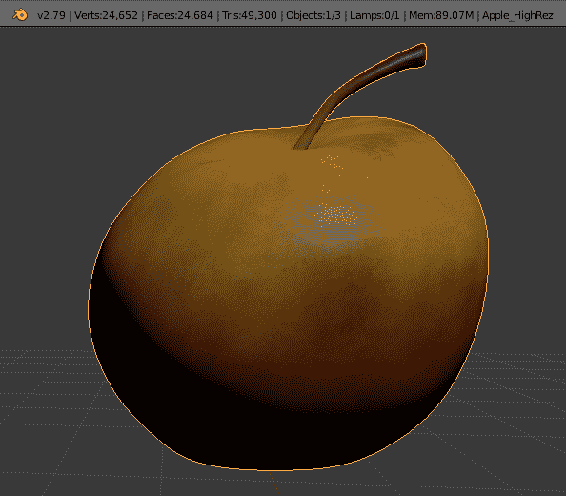
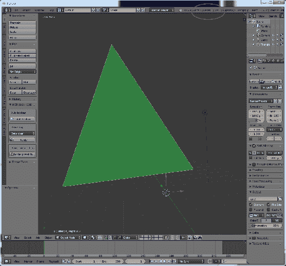
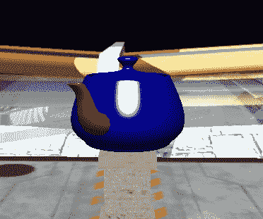

# 与 Poly 和 Gon 家族合作

当刚刚习惯计算机图形的人看到一些最早的虚拟现实图形时，他们的第一反应是“*哦，不，不是多边形！”*我的一个朋友看到她的第一个大型多人在线角色扮演游戏时，愤怒地说了这句话。它不像*免费的钱那样低，但它非常接近。*零花钱*是最早使用计算机图形的音乐视频之一，看起来像这样：*


多边形是显示实时图形的最佳方式。在本节中，我们将不得不制作一些！您可能已经熟悉**计算机辅助**（**设计**/**绘图**/**绘图**）（**CAD**软件或计算机建模软件；或者你可能是一个全新的人。有这么多不同的 CAD 系统，我们将使用 Blender，一个免费提供/开源的 CAD 系统来说明将有趣的对象带入虚拟现实的一些重要方法

在本章中，您将学习：

*   如何执行基本多边形建模
*   如何从 Blender 导出 OBJ 形式的模型
*   如何应用基本 UV 纹理贴图
*   如何导出纹理贴图
*   如何创建 MTL 文件以正确显示实时 OBJ 纹理和材质

# 多边形以及我们喜欢它们的原因

我认为与*“哦，不，不是多边形”*的混淆在于，多边形，除非它们被提升为一种艺术形式，就像前面的音乐视频中那样，可能是一种非常粗糙的创作方式。例如，这看起来不像苹果：


许多 CAD 系统确实有其他表示法，如**非**-**均匀有理 B**-**样条**（**NURBS**），这是一种曲线类型，或基本上没有多边形但它们表示的图元。例如，球体可以是任意平滑的，没有面或平坦区域。

如果所有的东西都是立方体和球体，这个世界会很无聊。除非是地雷船，否则会很酷。除 Minecraft 外，许多 CAD 系统通过**构造立体几何**（**CSG**）构建更有趣的对象，以钻出基本原语并将其添加到其他原语中，从而生成更复杂的对象

# 为什么虚拟现实不使用这些技术呢？

总的来说，他们很慢。必须将精确的数学模型转换成视频硬件可以显示的东西。一些视频卡和高级 API 可以用多边形以外的东西构建对象、计算平滑曲线等，但到目前为止，VR 和游戏行业最常见的工作流是围绕多边形和纹理展开的。

因此，我们可以将多边形视为给定的。现代显卡和高端手机在渲染对象时具有相当大的能力，尽管要保持 VR 的帧速率，我们必须注意多边形的数量

好消息是，你可以制作非常好看的虚拟现实对象，而多边形的数量却非常少。例如，看看我们的苹果。刚才显示的低分辨率版本只有 44 个面（多边形）和 24 个顶点（点）。如果我们将多边形数量增加到仅 492 个，它看起来会更好：


In these examples, I'm using Blender version, v2.79\. You can use any CAD program that will read and write to OBJ files, which is nearly all of them. I use Blender because it is free, so anyone reading this book can follow along without worrying about purchasing an expensive CAD program.

Blender 功能非常齐全，当然可以用于生产工作，尽管描述每一个可能的 CAD 系统并推荐一个不在本书的范围内（而且我从不喜欢公开讨论宗教！）。不过，从前面的模型中，您可以看到 Blender 的局限性；该模型有相当奇怪的**纹理映射**，分辨率降低太多会在纹理映射上产生一些奇怪的剥离

当然，如果摩尔定律成立的话，我们可以像从 2030 年开始在 PC 上运行一样，向系统扔多边形，比现在快 512 倍。我们的苹果看起来像这样：



虽然那些奇怪的纹理线已经消失了，但它与中等分辨率的苹果并没有太大区别。它看起来相当不错（这不是一个完整的细节渲染）。为了制作低分辨率的多边形，我在 Blender 中进行了快速抽取。Decimate 是 Blender 的一种方法，它采用了大量多边形的模型，并将其减少到较少的多边形，它是一种非常方便的方法，可以采用非常复杂的模型，并使其成为虚拟现实。手动执行“大抽取”，并对模型应用新纹理，可能会消除接缝。

For advanced modelers, you can use a low polygon version of your model, in conjunction with a high polygon version, to make a normal map, which unlike a bump map, allows the model to look like it has more polygons than it really does.

You may need to experiment some with normal mapping; it really depends on the browser and model.

现在，你可能会认为你更喜欢使用 25206 张脸的苹果。这可能行得通，但这是一个相当大的模型。许多人问*“我可以使用多少多边形？”*尽管这是一个很难回答的问题。这就像问你妈妈车里能装多少杂货一样？这在很大程度上取决于什么食品杂货。如果她带回来 24 包舒适的卫生纸，我可以根据个人经验告诉你，一辆双座跑车只能装一两包。（放松点，我不是在吹牛，我的跑车已经 12 年了。）

考虑多边形预算的更好方法是与您可能拥有的其他对象进行比较。那个高分辨率的苹果？对于相同的速度（非常粗略），您可能有超过 48 个中等分辨率的苹果。

如果你打算为你的空间画廊顾客提供茶点，你愿意给 1 份还是 48 份？


Keep your objects as low resolution as possible, and still maintain the visual look you need. You may need access to low poly objects or a good CAD system that can reduce polygons.

After having said that, I was getting somewhat reasonable frame rates from the previous one. My goal isn't to give you an absolute number, but to show how important a vertex budget is.

# 什么是多边形？顶点、多边形和边的讨论

如果您使用建模程序，您将不必处理这些对象定义的复杂性。然而，有时你可能需要深入了解细节，因此需要一些背景知识。如果你是计算机图形学的老手，你可能已经知道很多了。我确实提供了一些关于如何最好地让他们进入 React VR 的实用建议，因此最好进行回顾。

多边形是由顶点（点）、边和面组成的*n*边对象。面可以向内或向外，也可以是双面的。对于大多数实时虚拟现实，我们使用单面多边形；当我们第一次在世界上放置平面时，我们注意到了这一点，根据方向的不同，您可能看不到它

为了真正展示这一切是如何工作的，我将展示一个 OBJ 文件的内部格式。通常情况下，你不会手工编辑这些-我们已经超越了用几千个多边形构建虚拟现实的时代（我的第一个虚拟现实世界有一列代表下载的火车，它有六个多边形，每个点都是手工精心制作的），所以手工编辑是不必要的，但是，您可能需要编辑 OBJ 文件以包含正确的路径，或者进行建模者本机无法进行的更改—因此，让我们深入了解！

多边形是通过在三维空间中创建点并将其与面连接而构建的。你可以认为顶点是通过线连接的（大多数建模者都是这样工作的），但是在 VR 的本地 WebGL 中，它仅仅是脸。这些点本身并不存在，但或多或少地“锚定”多边形的角。

例如，下面是一个简单的三角形，在 Blender 中建模：



在本例中，我构建了一个三角形，有三个顶点和一个面（只有一个平面颜色，在本例中为绿色；如果您正在阅读物理书籍或 eInk 电子阅读器（Kindle），它当然是灰色阴影）。显示为黄色或浅色调的边是为了建模者的方便，不会显式渲染。

以下是我们画廊内三角形的外观：


如果你仔细看搅拌机的照片，你会注意到这个物体并没有在世界的中心。当它导出时，它将和您在 Blender 中应用的翻译一起导出。这就是三角形在底座上稍微偏离中心的原因。好消息是我们在外层空间，漂浮在轨道上，因此不必担心重力。（React VR 没有物理引擎，尽管添加物理引擎很简单。）

你可能会注意到的第二件事是 Blender 中三角形周围的黄线（打印中的浅灰色线）在虚拟现实世界中并不存在。这是因为文件导出为一个面，该面连接三个顶点

The plural of vertex is vertices, not vertexes. If someone asks you about vertexes, you can laugh at them almost as much as when someone pronouncing Bézier curve as "bez ee er." 

Ok, to be fair, I did that once, now I always say Beh zee a. 

好吧，撇开轻浮不谈，现在让我们让它看起来比一个平面的绿色三角形更有趣。这是通过一种通常称为纹理贴图的方法来实现的。

Honestly, the phrase "textures" and "materials" often get swapped around interchangeably, although lately they have sort of settled down to materials meaning anything about an object's physical appearance except its shape; a material could be how shiny it is, how transparent it is, and so on. A **texture** is usually just the colors of the object — tile is red, skin may have freckles — and is therefore usually called a texture map which is represented with a JPG, TGA, or other image format.

There is no real cross software file format for materials or **shaders** (which are usually computer code that represents the material). When it comes time to render, there are some shader languages that are standard, although these are not always used in CAD programs. 

You will need to learn what your CAD program uses, and become proficient in how it handles materials (and texture maps). This is far beyond the scope of this book.

OBJ 文件格式（React VR 通常使用的格式）允许使用多个不同的纹理贴图来正确构造材质。它还可以通过文件中编码的参数指示材料本身。首先，让我们来看看三角形是由什么组成的。我们通过`Model`关键字导入 OBJ 文件：

```jsx
<Model
    source={{
        obj: asset('OneTri.obj'),
        mtl: asset('OneTri.mtl'),
        }}
    style={{
            transform: [
                { translate: [ -0, -1, -5\. ] },
                { scale: .1 },
            ]
        }}
/>
```

首先，让我们打开`MTL`（material）文件（因为.obj 文件使用.mtl 文件）。OBJ 文件格式由 Wavefront 开发：

```jsx
# Blender MTL File: 'OneTri.blend'
# Material Count: 1

newmtl BaseMat
Ns 96.078431
Ka 1.000000 1.000000 1.000000
Kd 0.040445 0.300599 0.066583
Ks 0.500000 0.500000 0.500000
Ke 0.000000 0.000000 0.000000
Ni 1.000000
d 1.000000
illum 2
```

这在很大程度上是内务管理，但重要的是以下参数：

*   `Ka`：环境色，RGB 格式
*   `Kd`：漫反射颜色，RGB 格式
*   `Ks`：镜面反射颜色，RGB 格式
*   `Ns`：镜面反射指数，从 0 到 1000
*   `d`：透明度（d 表示*溶解*。请注意，WebGL 通常不能显示折射材质，也不能显示真实的体积材质和光线跟踪，因此`d`只是被遮挡光线的百分比。`1`（默认值）是完全不透明的。请注意，.obj 规范中的`d`适用于照明模式 2。

Transparent materials, at the time of writing this book, are not supported by React VR. This is currently under development, however, so perhaps soon they will be.

*   Tr：透明度的替代代表；0 是完全不透明的。
*   `illum`<>（从 0 到 10 的数字）。并非所有照明模型都受 WebGL 支持。目前的名单是：
    0.  颜色打开和环境光关闭。
    1.  启用颜色和环境光。
    2.  高亮显示（和颜色）<=这是正常设置。
    3.  还有其他照明模式，但 WebGL 目前未使用。这当然可以改变。
*   `Ni`为光密度。这对于 CAD 系统来说很重要，但是在虚拟现实中不需要很多技巧就可以支持它的可能性非常低。尽管计算机和视频卡的速度越来越快，但由于摩尔定律，最终可能会在虚拟现实中支持光密度和实时光线跟踪（从统计上看，计算能力大约每两年翻一番）。

Very important:
Make sure you include the "lit" keyword with all of your model declarations, otherwise the loader will assume you have only an emissive (glowing) object and will ignore most of the parameters in the material file!

YOU HAVE BEEN WARNED. It'll look very weird and you'll be completely confused. Don't ask me why I know!

OBJ 文件本身具有几何图形的描述。这些通常不是您可以手工编辑的内容，但是查看整体结构非常有用。对于前面所示的简单对象，它非常易于管理：

```jsx
# Blender v2.79 (sub 0) OBJ File: 'OneTri.blend'
# www.blender.org
mtllib OneTri.mtl
o Triangle
v -7.615456 0.218278 -1.874056
v -4.384528 15.177612 -6.276536
v 4.801097 2.745610 3.762014
vn -0.445200 0.339900 0.828400
usemtl BaseMat
s off
f 3//1 2//1 1//1
```

首先，您会看到一条注释（标有`#`），它告诉您是什么软件制作的，以及原始文件的名称。这可能会有所不同。`mtllib`是对特定材料文件的调用，我们已经看过了。`o`行（如果有组，`g`行是）定义对象和组的名称；尽管 React VR（目前）并不真正使用这些，但在大多数建模软件包中，这些都会列在对象的层次结构中。`v`和`vn`关键字是它感兴趣的地方，尽管它们仍然不可见。`v`关键字在 x、y、z 空间中创建顶点。构建的顶点稍后将连接到多边形中。`vn`为这些对象建立法线，`vt`将创建相同点的纹理坐标。更多关于纹理坐标的信息。

`usemtl BaseMat`确定了在.mtl 文件中指定的用于以下面的材质

`s off`表示平滑已关闭。平滑和顶点法线可以使对象看起来平滑，即使它们是由很少的多边形构成的。例如，看看这两个茶壶；第一种是不平滑的。


看起来很像电脑图形，对吧？现在，看一看同一个茶壶，其中始终指定了“s1”参数，文件中包含法线。这很正常（双关语），我的意思是大多数 CAD 软件都会为您计算法线。你可以制作法线；平滑、锐利，并在需要时添加边缘。这会添加细节，而不会产生多余的多边形，并且渲染速度很快。



光滑的茶壶看起来更真实，对吗？嗯，我们还没看到任何东西！让我们来讨论纹理。

I didn't used to like Sushi because of the texture. We're not talking about that kind of texture.

纹理贴图很像拿一张圣诞包装纸，然后把它放在一个奇怪形状的物体上。就像当你在圣诞节收到一份看起来很奇怪的礼物，却不知道该做什么一样，有时候做包装并没有一个明确正确的方法。盒子很简单，但最有趣的对象并不总是盒子。我在网上找到了这张图片，标题为*“我希望这是一个 X-Box*。

 *

“包装”是通过 CAD 系统中的 U、V 坐标完成的。让我们看一个三角形，用适当的 UV 坐标。然后我们去拿包装纸，也就是说，我们用一个图像文件作为纹理，如下所示：


然后，我们通过将其指定为纹理贴图，将其包装在 CAD 程序中。然后我们将导出三角形，并将其放入我们的世界中。


您可能希望在纹理贴图上看到“左和下”。仔细查看我们的建模包（Blender still），我们会发现默认的 UV 贴图（使用 Blender 的标准工具）尝试使用尽可能多的纹理贴图，但从艺术角度来看，这可能不是我们想要的。


这并不是要表明 Blender 是“你做错了”，而是要说明在导出之前必须检查纹理映射。此外，如果您试图导入没有 U、V 坐标的对象，请仔细检查它们！

If you are hand editing an .mtl file, and your textures are not showing up, double–check your .obj file and make sure you have `vt` lines; if you don't, the texture will not show up. This means the U,V coordinates for the texture mapping were not set.

纹理映射是非平凡的；这是一门艺术，甚至整本书都是关于纹理和灯光的。说到这里，如果你从网上下载了一些东西，想让它看起来更好一点，那么你可以使用 Blender 和任何 OBJ 文件。我们将向您展示如何修复它。最终目标是获得一个更有用、更高效的 UV 贴图。并非所有的 OBJ 文件导出器都导出正确的纹理贴图，并且经常导出。您可以在线找到的 OBJ 文件可能设置了 UV，也可能没有设置 UV。

您可以使用 Blender 修复模型的展开。虽然这不是一个搅拌机教程，但我将在这里向您展示足够多的内容，通过一本关于搅拌机的书（Packt 有几本不错的搅拌机书），您可以获得一个领先。您还可以使用您喜爱的 CAD 建模程序，例如 Max、Maya、Lightwave、Houdini 等。（如果我错过了你最喜欢的包裹，请原谅我！）。

This is important, so I'll mention it again in an info box. If you already use a different polygon modeler or CAD page, you don't have to learn Blender; your program will undoubtedly work fine.  You can skim this section.

If you don't want to learn Blender anyway, you can download all of the files that we construct from the Github link. You'll need some of the image files if you do work through the examples. Files for this chapter are at: [http://bit.ly/VR_Chap7](http://bit.ly/VR_Chap7). 

# 从哪里获取三维模型

这给我们带来了一个简短的消遣。你从哪里得到这些模型？

获取三维模型的最佳方法是自己制作。如果你读了，你可能没有读到这篇文章，因为你已经知道什么是多边形以及如何对它们进行纹理处理。然而，你更可能会去一个付费或免费的模特网站，下载一些你认为对你正在努力创造的世界有吸引力的东西。这只会节省时间。这里简单介绍几年来我发现有用的几个网站。其中一些网站可能有非常昂贵的模型，因为它们通常面向高端图形公司（电视、建筑、电影、设计师）以及高质量但昂贵的游戏艺术。游戏艺术是关于你在寻找什么，做一个好的虚拟现实；一些网站现在有“低保利”或 VR/AR 类别。他们中的一些人，尤其是 ShareCG 和 Renderosity，往往在某些地方非常业余。网站本身很棒，但上传的文件通常没有编辑控制；因此，你可能会发现一些侵犯版权的东西（星球大战和星际迷航模型），而这些东西你在其他网站上找不到，原因很明显（律师！）。再说一次，你可能会在这些网站上找到你自己的内容，人们从中赚钱，因此你想找到自己的律师。

Speaking of lawyers, you need to check the license for any files you do download. You may have the right to use these models for rendering, for example, but not distribution. This may or may not allow you to ship a game with these models in it, or that may require an additional (more expensive) license.

您可以在以下网站下载模型（绝非独家）：

*   [Turbosquid.com](http://Turbosquid.com)
*   [CGStudio.com](http://CGStudio.com)
*   [creativemarket.com/3d](http://creativemarket.com/3d)
*   [CGTrader.com](http://CGTrader.com)
*   [Grabcad.com](http://Grabcad.com)
*   [ShareCG.com](http://ShareCG.com)（本书的几个模型来自这里）
*   [3dwarehouse.sketchup.com](http://3dwarehouse.sketchup.com)

你为什么在这些网站上找到这么好的模特？为什么有些模特在艺术上看起来如此古怪？许多艺术家签订了不需要排他性的合同，或者人们正在制作一款解散后再也不发货的游戏。他们可以上传这些未使用或使用较少的模型，让其他人使用，甚至从销售中获利

You can spend days searching all of these sites for that perfect content for your site.

You've been warned!

还有大量用于三维打印的三维模型站点。这些模型可能非常密集（高多边形），但可能有一些您可以使用的内容。

我喜欢使用一个名为“Poser”的程序来做人体建模，尽管许多 CGI 艺术家更喜欢自己制作。DAZ3D 也销售人体模型，其中许多模型与 Poser 合作。这两个站点都是很好的资源站点，可以提供价格低廉、质量合理的渲染（取决于您设置场景的技能）。Poser 程序有许多专用于对象、场景、模型和纹理的站点。Poser 人体模型在虚拟现实中显示得不太好，因为多边形数量多，纹理非常密集，但这些网站可能仍然有对象和附加工具，通常价格非常合理

一些具有良好 Poser 模型的网站以及许多其他免费对象包括：

*   [my.smithmicro.com/poser-3d-animation-software.html](http://my.smithmicro.com/poser-3d-animation-software.html)
*   [达之 3d.com](http://DAZ3D.com)
*   [Contentparadise.com](http://Contentparadise.com)
*   [Renderosity.com](http://Renderosity.com)

本书中的几幅图像是由波斯尔和达斯工作室拍摄的。

# 总结

在本章中，您学习了使用 Blender 进行多边形建模的基础知识。您已经了解了多边形预算的重要性、如何导出这些模型以及有关 OBJ/MTL 文件格式的详细信息。您还了解了我们在哪里可以获得我们世界的三维模型。

这些物体看起来很简单；不过，在下一节中，您将学习如何用纸包裹茶壶。这不仅仅是一项向人们赠送礼物的技能，它对于让我们的虚拟世界看起来真实至关重要。*