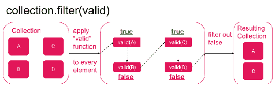

# 八、JavaScript 和 ECMAScript 模式

在本章中，我们将回到 JavaScript 语言的核心。这里的一些模式可以在许多不同的语言中重复使用，例如 java、C++和 Python。用如此强大的东西填满你的工具箱是至关重要的。这一次，我们将用 JavaScript 实现众所周知的设计模式，并了解如何从中获益，特别是在 React 本机环境中。作为一个小补充，我们将学习一个名为 Ramda 的新库，它以其强大的功能而闻名，可以帮助我们编写更简短的代码。您还将了解函数式编程的基本原理，这将是下一章的主题。

在本章中，您将了解以下内容：

*   选择器模式
*   咖喱模式
*   拉姆达图书馆
*   函数式编程基础

# JavaScript 与函数式编程

函数式编程基本上意味着以某种方式使用函数来编写逻辑代码。大多数语言都允许函数非常复杂且难以理解。然而，函数式编程对函数施加约束，以便能够组合它们并从数学上证明它们的行为。

制约因素之一是与外部世界的通信规则（例如，副作用，如数据获取）。有些人断言，无论我们用相同的参数调用函数多少次，它都会返回完全相同的值。所有这些限制都会给我们带来某些好处。你已经可以说出其中的一些好处了，比如时间旅行，它使用纯减速器。

在本章中，我们将学习一系列有用的函数，这些函数将使我们轻松进入[第 9 章](09.html)、*函数编程模式的元素*。我们还将详细阐述确切的限制及其好处。

# ES6 映射、过滤和减少

本节旨在更新我们对`map`、`filter`和`reduce`功能的了解。

Usually, common language functions need to be extremely performant, which is a topic that spans beyond this book. Avoid reimplementing what is in the language already. Some of the examples in this chapter are here only for learning purposes. 

`reduce`很可能经常被忽略，因此，我们将重点关注它。通常，`reduce`（顾名思义）用于将集合的大小缩减为较小的集合，甚至是单个变量。

以下是 reduce 函数声明：

```jsx
reduce(callback, [initialValue])
```

回调包含四个参数：`previousValue`、`currentValue`、`index`和`array`。

为了快速提醒您`reduce`函数是如何工作的，让我们看看以下示例：

```jsx
const sumArrayElements = arr => arr.reduce((acc, elem) => acc+elem, 0);
console.log(sumArrayElements([5,15,20])); // 40
```

`reduce`对集合进行迭代。在每一步中，它都调用它所在的元素迭代器上的函数。然后它记住函数输出并传递到下一个元素。这个记住的输出是第一个函数参数；在前面的示例中，它是累加器（`acc`变量）。它记住先前运行函数的结果，应用`reducer`函数并进入下一步。这与 Redux 库在州上的操作非常相似。

`reduce`函数的第二个参数是累加器的初始值；在前面的示例中，我们从零开始。

让我们提高标准，使用`reduce`实现一个`average`函数：

```jsx
const numbers = [1, 2, 5, 7, 13];
const average = numbers.reduce(
    (accumulator, currNumber, indexOfElProcessed, arrayWeWorkOn) => {
        // Sum all numbers so far
        const newAcc = accumulator + currNumber;
        if (indexOfElProcessed === arrayWeWorkOn.length - 1) {
            // if this is the last item, return average
            return newAcc / arrayWeWorkOn.length;
        }
        // if not the last item, pass sum
        return newAcc;
    },
    0
);
// average equals 5.6
```

在本例中，我们使用`if`语句执行一个技巧。如果元素是数组中的最后一个元素，那么我们要计算`average`，而不是`sum`。

# 使用 reduce 重新实现过滤器和映射

是时候挑战一下了。您知道您可以使用`reduce`同时实现`map`和`filter`吗？

在开始之前，让我们快速回顾一下`filter`函数的工作原理：



How the filter function works on collection

假设我们有一个`task`集合，只想过滤`type`等于`1`的任务，如下所示：

```jsx
const onlyType1 = task => task.type === 1
```

使用标准筛选函数，您只需编写以下内容：

```jsx
tasks.filter(onlyType1)
```

但是现在，假设没有`filter`函数，到目前为止，工具箱中只有`reduce`

您可以执行以下操作：

```jsx
tasks.reduce((acc,t) => onlyType1(t) ? [...acc, t] :acc, [])
```

诀窍是使累加器成为一个集合。前一个值始终是一个集合，从空数组开始。一步一步地，我们要么将任务添加到累加器中，要么在任务未能通过过滤器时返回累加器。

如何实现`map`功能？`map`通过应用传递给每个元素的映射函数，将每个元素转换为一个新元素：


How the map function works on collection

让我们使用`reduce`进行操作，如下所示：

```jsx
const someFunc = x => x+1;
const tab = [1, 5, 9, 13];
tab.reduce((acc, elem) => [...acc, someFunc(elem)], []);
// result: [2, 6, 10, 14]
```

在本例中，我们只是将每个项再次收集到同一个集合中，但在将其添加到数组中之前，我们对其应用了映射函数。在本例中，映射函数在名称`someFunc`下定义。

# 计算数组中的项目

我们的下一个示例是关于计算数组中的项目。假设您有一系列房屋物品。你需要数一数你拥有多少。使用`reduce`函数，预期结果是一个对象，项目作为键，特定项目的计数作为值，如下所示：

```jsx
const items = ['fork', 'laptop', 'fork', 'chair', 'bed', 'knife', 'chair'];
items.reduce((acc, elem) => ({ ...acc, [elem]: (acc[elem] || 0) + 1 }), {});
// {fork: 2, laptop: 1, chair: 2, bed: 1, knife: 1}

```

这是相当棘手的：部分`(acc[elem] || 0)`意味着我们要么取`acc[elem]`的值（如果定义的话），要么取`0`。这样，我们就可以检查它的第一个元素。此外，`{ [elem]: something }`语法用于定义具有`elem`变量中存储的名称的键。

The preceding example is helpful when you work with serialized data that came from an external API. Sometimes you need to transform it in order to cache it, so it avoids unnecessary re-rendering.

下一个示例介绍了一个新词——**展平**。当我们展平集合时，这意味着它是集合中的嵌套集合，我们希望它展平。

例如，`[[1, 2, 3], [4, 5, 6], [7, 8, 9]]`等集合在展平后变为`[1, 2, 3, 4, 5, 6, 7, 8, 9]`。具体做法如下：

```jsx
const numCollections = [[1, 2, 3], [4, 5, 6], [7, 8, 9]];
numCollections.reduce((acc, collection) => [...acc, ...collection], []);
// result:[1, 2, 3, 4, 5, 6, 7, 8, 9]

```

这个例子对于理解我们将在[第 9 章](09.html)、*函数编程模式元素*中使用的更复杂的例子中的扁平化非常重要。

# 迭代器模式

在上一节中，我们遍历了许多不同的集合，甚至是嵌套的集合。现在，是了解迭代器模式的时候了。如果您计划使用 Redux Saga 库，这种模式尤其引人注目。

If you jumped straight to this chapter, I highly advise you to read the section that introduces iterator patterns in [Chapter 6](06.html), *Data Transfer Patterns*. That chapter also covers the Redux Saga library and generators.

总而言之，在 JavaScript 中，迭代器是一个对象，它知道如何一次遍历一个集合的项。它必须公开`next()`函数，该函数返回集合的下一项。收藏可以是它想要的任何东西。它甚至可以是一个无限的集合，如 Fibonacci 数，如下所示：

```jsx
class FibonacciIterator {
    constructor() {
        this.n1 = 1;
        this.n2 = 1;
    }
    next() {
        var current = this.n2;
        this.n2 = this.n1;
        this.n1 = this.n1 + current;
        return current;
    }
}
```

在使用它之前，您需要创建类的实例：

```jsx
const fibNums = new FibonacciIterator();
fibNums.next(); // 1
fibNums.next(); // 1
fibNums.next(); // 2
fibNums.next(); // 3
fibNums.next(); // 5

```

这可能很快变得无聊，因为它闻起来像一个学术例子。但事实并非如此。向您展示我们将使用闭包和`Symbol`迭代器重新创建的算法非常有用。

# 定义自定义迭代器

简单回顾一下 JavaScript 中的符号：`CallingSymbol()`返回一个唯一的符号值。符号值应被视为 ID，例如，作为要用作对象中键的 ID。

要为集合定义迭代器，需要指定特殊键`Symbol.iterator`。如果定义了这样一个符号，我们就说集合是可编辑的。见下文：

```jsx
// Array is iterable by default,
// we don't need to create a custom iterator,
// just use the one that is present.
const alpha = ['a','b','c'];
const it = alpha[Symbol.iterator]();

it.next();  //{ value: 'a', done: false }
it.next();  //{ value: 'b', done: false }
it.next();  //{ value: 'c', done: false }
it.next();  //{ value: undefined, done: true }
```

现在，让我们为 Fibonacci 集合创建一个自定义`iterator`。斐波那契序列的特点是，前两个之后的每个数字都是前两个数字的总和（序列的开头是 1，1，2，3，5，8，13，21，34，55，89，144，…）：

```jsx
const fib = {
    [Symbol.iterator]() {
        let n1 = 1;
        let n2 = 1;

        return {
            next() {
                const current = n2;
                n2 = n1;
                n1 += current;
                return { value: current, done: false };
            },

            return(val) { // this part handles loop break
                // Fibonacci sequence stopped.
                return { value: val, done: true };
            }
        };
    }
};
```

要轻松遍历 iterable 集合，我们可以使用方便的`for...of`循环：

```jsx
for (const num of fib) {
    console.log(num);
    if (num > 70) break; // We do not want to iterate forever
}
```

# 使用生成器作为迭代器的工厂

我们还需要知道如何使用生成器（例如，对于 Redux Saga），因此我们应该能够流利地编写生成器。事实证明，它们可以像我们已经学习过的迭代器工厂一样工作。

快速回顾发电机，它们的功能与`*`和`yield`操作员在其范围内，如`function* minGenExample() { yield "a"; }`。这些函数一直执行到遇到`yield`关键字为止。然后，函数返回`yield`值。函数可以有很多`yields`，在第一次调用时返回`Generator`。这样的发电机是不合适的。请看以下内容：

```jsx
const a = function* gen() { yield "a"; };
console.log(a.prototype)
// Generator {}
```

我们现在可以利用这些知识将斐波那契重新实现为一个生成器：

```jsx
function* fib() {
    let n1 = 1;
    let n2 = 1;
    while (true) {
        const current = n2;
        n2 = n1;
        n1 += current;

        yield current;
    }
}
// Pay attention to invocation of fib to get Generator
for (const num of fib()) {
    console.log(num);
    if (num > 70) break;
}
```

就这样。我们使用生成器函数语法来简化自己的事情。生成器函数类似于迭代器的工厂。一旦被调用，它将为您提供一个新的生成器，您可以像任何其他集合一样对其进行迭代。

The piece of code that handles Fibonacci numbers can be simplified. The shortest way I could write this is as follows:
`function* fib() {`
`  let n1 = 1, n2 = 1;`
`  while (true) {`
`    yield n1;`
`    [n1, n2] = [n2, n1 + n2];`
`  }`
`}`

# 使用生成器进行 API 调用以获取任务详细信息

我们已经尝试了生成器，并成功地使用它们获取任务。现在，我们将重复这个过程，但目标略有不同：获取单个任务的数据。为了实现这一点，我对代码库做了一些更改，并准备了代码的各个部分，以便您只关注生成器：

```jsx
// src/Chapter 8/Example 1/src/features/tasks/sagas/fetchTask.js
// ^ fully functional example with TaskDetails page
export function* fetchTask(action) {
    const task = yield call(apiFetch, `tasks/${action.payload.taskId}`);
    if (task.error) {
        yield put(ActionCreators.fetchTaskError(task.error));
    } else {
        const json = yield call([task.response, 'json']);
        yield put(ActionCreators.fetchTaskComplete(json));
    }
}
```

这个生成器首先处理 API 调用。端点是使用已调度操作的有效负载计算的。为了方便起见，使用了字符串模板。然后，根据结果，我们分派成功操作或错误操作：


This is an example of the Task Details screen. Feel free to work on the styles.

请注意发电机中的大量产量。我们以每一种收益停止函数执行。在我们的示例中，执行在完成的`call`效果上恢复。然后，我们可以继续，知道通话的结果。

但我们为什么要停止？这有什么使用案例吗？首先，它比简单的承诺和 async/await 更强大（下一节将对此进行详细介绍）。其次，停下来等待某些事情发生是很方便的。例如，假设我们要等到创建三个任务时才显示祝贺消息，如下所示：

```jsx
function* watchFirstThreeTasksCreation() {
    for (let i = 0; i < 3; i++) {
        const action = yield take(TasksActionTypes.ADD_TASK)
    }
    yield put({type: 'SHOW__THREE_TASKS_CONGRATULATION'})
}
```

This example is for playground purposes only. Pay attention to the fact that the task creation counter is within the generator function. Hence, is not saved in any backend system. On app refresh, the counter will reset. If you build any reward system for your application, keep such issues under consideration.

# 发电机的替代品

在 JavaScript 中流行多年的另一种选择是 promises。承诺使用了与发电机非常相似的概念。语法糖允许你等待承诺。如果你想要这个语法糖，那么你的函数需要是`async`。你觉得有什么相似之处吗？是的，我会冒险说承诺是发电机的一种不太强大的变体。

If you do use promises, take a look at a new loop called **`for await of`**. You may find it handy. Another feature worth checking is **asynchronous iterators**.

# 选择器

在上一节中，我们再次使用异步数据。此数据已推送到应用程序的 Redux 存储区。我们已经在`mapStateToProps`函数中多次访问它，例如在任务列表容器中：

```jsx
const mapStateToProps = state => ({
    tasks: state.tasks.get('entities'),
    isLoading: state.tasks.get('isLoading'),
    hasError: state.tasks.get('hasError'),
    errorMsg: state.tasks.get('errorMsg')
});
```

这一个看起来不是很难看，但是对于任务详细信息页面来说，它已经失去了控制。考虑以下事项：

```jsx
// On this page we don't know if tasks are already fetched
const mapStateToProps = (state, ownProps) => ({
    task: state.tasks
        ? state.tasks
            .get('entities')
            .find(task => task.id === ownProps.taskId)
        : null
});

```

我们做了大量的检查，然后进行转换。每次重新渲染时都会发生此流。如果数据不变，我们还能记得计算结果吗？是的，我们可以来这里救援。

# 从 Redux 存储中选择

让我们面对现实吧，到目前为止，我们对访问存储没有任何抽象概念。这意味着每个`mapStateToProps`函数都会自己访问它。如果门店形状发生变化，所有`mapStateToProps`功能都可能受到影响。第一步是分离关注点并提供选择器，而不是直接的对象访问：

```jsx
// src/Chapter 8/Example 1/src/features/
//                         ./tasks/containers/TaskListContainer.js
const mapStateToProps = state => ({
    tasks: tasksEntitiesSelector(state),
    isLoading: tasksIsLoadingSelector(state),
    hasError: tasksHasErrorSelector(state),
    errorMsg: tasksErrorMsgSelector(state)
});

```

实现与以前一样，只是我们可以在许多地方重用代码：

```jsx
// src/Chapter 8/Example 2/src/features/
//                      ./tasks/state/selectors/tasks.js

export const tasksSelector = state => state.tasks;

export const tasksEntitiesSelector = state =>
 (tasksSelector(state) ? tasksSelector(state).get('entities') : null);

export const tasksIsLoadingSelector = state =>
 (tasksSelector(state) ? tasksSelector(state).get('isLoading') : null);

export const tasksHasErrorSelector = state =>
 (tasksSelector(state) ? tasksSelector(state).get('hasError') : null);

export const tasksErrorMsgSelector = state =>
 (tasksSelector(state) ? tasksSelector(state).get('errorMsg') : null);

// PS: I have refactored the rest of the app to selectors too. 
```

即使在这个小例子中，我们每隔一个选择器访问`tasksSelector`两次。如果`tasksSelector`很贵，那么它的效率就会很低。但是，我们现在将通过缓存选择器来避免出现这种情况。

# 缓存选择器

要缓存选择器，我们将使用**记忆**功能。一旦函数的输入引用发生更改，该函数将重新计算该值。为了节省我们的时间，我们将使用一个流行的库来为我们实现这个记忆功能。图书馆名为`reselect`。在`reselect`中，使用强相等（**====**检查参考更改，但如果需要，您可以将相等函数更改为您自己的。使用以下命令添加库：

```jsx
yarn add reselect
```

至此，我们已准备好缓存：

```jsx
// src/Chapter 8/Example 2/src/features/
//                                ./tasks/state/selectors/tasks.js
import { createSelector } from 'reselect';

export const tasksSelector = state => state.tasks;

export const tasksEntitiesSelector = createSelector(
    tasksSelector,
    tasks => (tasks ? tasks.get('entities') : null)
);

// ... rest of the selectors in similar fashion
```

# 从 Ramda 库学习函数

映射、过滤、减少、迭代器、生成器和选择器。不会太多吧？别害怕，你能只用 10 个单词说英语吗？不好的，然后我们可以继续学习一些新单词，这将使我们更流利地使用 JavaScript 编程。

# 组合函数

HOC 最引人注目的特点之一是其可组合性。以`withLogger`、`withAnalytics`和`withRouter`HOC 为例，我们可以按照以下方式组合它们：

```jsx
withLogger(withAnalytics(withRouter(SomeComponent)))

```

Ramda 库将可组合性提升到了一个新的水平。不幸的是，我发现许多开发人员几乎不理解它。让我们看一个等效的例子：

```jsx
R.compose(withLogger,withAnalytics, withRouter)(SomeComponent)
```

大多数人对拉姆达感到困难的是理解它是如何工作的。它通常从右向左应用函数，这意味着它首先评估`withRouter`，然后将结果转发给`withAnalytics`，以此类推。函数最重要的一点是，只有第一个（`withRouter`可以有多个参数。以下每个函数都需要在前一个函数的结果上进行操作。

The Ramda `compose` function composes functions from right to left. To compose functions from left to right you can use the Ramda `pipe` function.

这个例子对于 React 或 React 本机代码库的重要性在于，您不需要`reselect`或任何其他库来编写东西。你可以自己做。这在`reselect`库之类的用例中非常有用，它希望您编写选择器。花些时间去适应它。

# 与混乱的代码作斗争

我在熟练的 Ramda 用户编写的代码中看到的下一个有趣的模式是所谓的**无点**代码。这意味着只有一个地方可以传递所有数据。虽然听起来很美，但我不建议你对它这么严格。但我们可以从这种方法中得到一件好事。

考虑重构代码：

```jsx
const myHoc = SomeComponent => R.compose(withLogger,withAnalytics, withRouter)(SomeComponent)
```

您可以将其重构为：

```jsx
const myHoc = R.compose(withLogger,withAnalytics, withRouter)

```

这将隐藏明显的部分。最常见的问题是，它开始像一个魔盒，只有我们知道如何将数据传递给它。如果您使用类型系统，例如 TypeScript 或 Flow，如果您不知道，那么快速查找它会容易得多。但是，令人惊讶的是，许多开发者会在这一点上发疯。他们对`compose`的工作原理了解得越少（尤其是从右向左的函数应用程序），他们就越可能不知道该传递给该函数什么

考虑一下：

```jsx
const TaskNamesList = tasks => tasks
    .map({ name }) => (
        <View><Text>{name}</Text></View>
    ))
```

现在将上一个示例与`compose`的这个古怪版本进行比较：

```jsx
const TaskComponent = name => (<View><Text>{name}</Text></View>)

const TaskNamesList = compose(
    map(TaskComponent),
    map(prop('name')) // prop function maps object to title key
);
```

在第一个示例中，您可能能够在不到 30 秒内理解正在发生的事情。在第二个示例中，初学者理解代码可能需要一分钟以上的时间。这是不能接受的。

# 咖喱功能

好的，记住上一节的挑战，现在让我们关注硬币的另一面。在棕地应用程序中，我们可能会遇到这样一个问题：修改我们希望以不同方式使用的函数是非常危险或耗时的。

Brownfield applications are applications that were developed in the past and are fully functional. Some of these applications may be built using old patterns or approaches. We cannot usually afford to rewrite them to the latest trend, such as React Native. If they are battle-tested, why would we even bother? Hence, we will need to find a way to connect both worlds if we decide that a new trend will give us enough of a benefit by switching to it for its new features.

假设一个函数期望您传递两个参数，但您希望先传递一个，然后再传递另一个：

```jsx
const oldFunc = (x, y) => { // something }

const expected = x => y => { // something }
```

如果您不想修改函数，这是很棘手的。但是，我们可以编写一个`util`函数来为我们实现这一点：

```jsx
const expected = x => y => oldFunc(x, y)
```

令人惊叹的但是，在每一种情况下，为什么还要费心写一个助手呢？现在是介绍`curry`的时候了：

```jsx
const notCurriedFunc = (x, y, z) => x + y + z;

const curriedFunc = R.curry(notCurriedFunc);

// Usage: curriedFunc(a)(b)(c)
// or shorter: R.curry(notCurriedFunc)(a)(b)(c)

// So our case with partial application could be:
const first = R.curry(notCurriedFunc)(a)(b);
// ... <pass it somewhere else where c will be present> ...
const final = first(c)
```

就这样。我们让它按照我们想要的方式运行，我们甚至没有改变棕色地带应用程序功能（`oldFunc`或`notCurriedFunc`中的任何一行）。

If there are only one or two places in your app where you would use `curry`, think twice. Will there be more use cases in the future? If not, it is probably overkill to use it. Use the helper arrow functions, as shown previously.

# 翻转

我们可以`curry`一个函数，这很好，但是如果我们想以不同的顺序传递参数呢？对于前两个参数的更改，有一个名为`flip`的方便函数，如下所示：

```jsx
const someFunc = x => y => z => x + y + z;

const someFuncYFirst = R.flip(someFunc);
// equivalent to (y => x => z => x + y + z;)
```

如果我们需要反转所有参数，不幸的是没有这样的函数。但我们仍然可以为我们的用例写出它：

```jsx
const someFuncReverseArgs = z => y => x => someFunc(x, y, z);
```

# 总结

在本章中，我们深入了解了现代 JavaScript 中常见的各种模式，如迭代器、生成器、有用的 reduce 用例、选择器和函数组合。

您还从 Ramda 库学习了一些函数。Ramda 比几页简单的用例更值得关注。请在空闲时间看一看。

在下一章中，我们将使用在这里学到的知识来了解函数式编程及其好处。

# 进一步阅读

*   Mozilla 指南中的迭代器和生成器文章：

[https://developer.mozilla.org/en-US/docs/Web/JavaScript/Guide/Iterators_and_Generators.](https://developer.mozilla.org/en-US/docs/Web/JavaScript/Guide/Iterators_and_Generators)

*   重新选择文档常见问题解答：

[https://github.com/reduxjs/reselect#faq](https://github.com/reduxjs/reselect#faq) 。

*   不仅在 JavaScript 中使用的老式设计模式：

[https://medium.com/@Tksharma/js-design-patterns-quick-look-fbc9ebfaf9aa](https://medium.com/@tkssharma/js-design-patterns-quick-look-fbc9ebfaf9aa)。

*   TC39 关于 JavaScript 异步迭代器的建议：

[https://github.com/tc39/proposal-async-iteration](https://github.com/tc39/proposal-async-iteration) 。