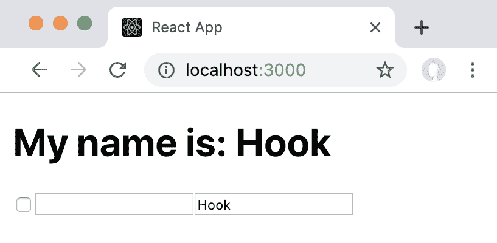
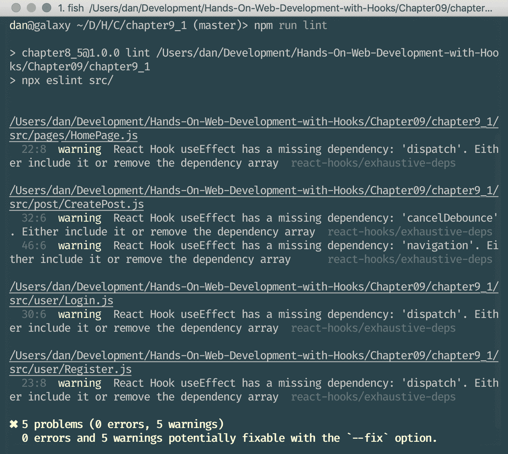
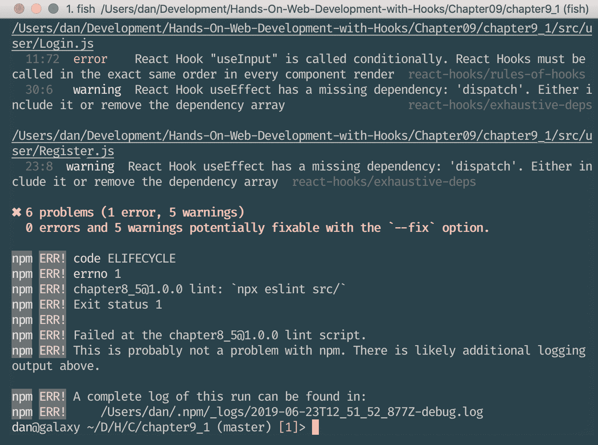
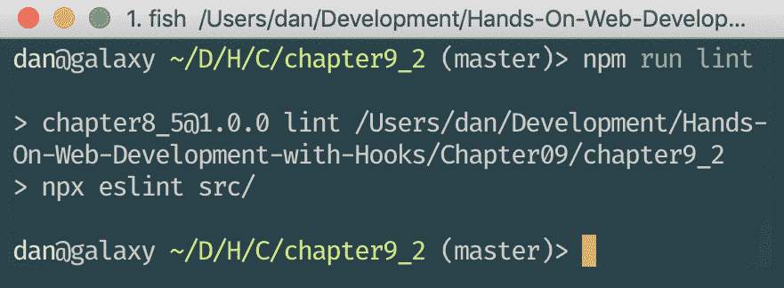

# 九、挂钩规则

在上一章中，我们学习了如何使用 React 社区开发的各种挂钩，以及在哪里可以找到更多挂钩。我们学习了用挂钩替换 React 生命周期方法、实用工具和数据管理挂钩、用挂钩替换响应性设计以及用挂钩实现撤销/重做功能。最后，我们学会了在哪里找到其他挂钩。

在本章中，我们将学习关于使用挂钩的所有知识，以及在使用和开发我们自己的挂钩时要注意的事项。挂钩在调用顺序上有一定的限制。违反挂钩规则可能会导致错误或意外行为，因此我们需要确保学习并执行规则。

本章将介绍以下主题：

*   呼叫钩
*   挂钩顺序
*   挂钩的名称
*   执行挂钩规则
*   处理`useEffect`依赖关系

# 技术要求

应该已经安装了 Node.js 的最新版本（v11.12.0 或更高版本）。Node.js 的`npm`包管理器也需要安装。

本章的代码可以在 GitHub 存储库中找到：[https://github.com/PacktPublishing/Learn-React-Hooks/tree/master/Chapter09](https://github.com/PacktPublishing/Learn-React-Hooks/tree/master/Chapter09) [。](https://github.com/PacktPublishing/Learn-React-Hooks/tree/master/Chapter09)

请查看以下视频以查看代码的运行情况：

[http://bit.ly/2Mm9yoC](http://bit.ly/2Mm9yoC)

Please note that it is highly recommended that you write the code on your own. Do not simply run the code examples that have been provided. It is important to write the code yourself in order to learn and understand properly. However, if you run into any issues, you can always refer to the code example.

现在，让我们从这一章开始。

# 呼叫钩

挂钩只能在***React 功能组件*或*自定义挂钩*中调用。它们不能在类组件或常规 JavaScript 函数中使用。**

 **可以在以下项的顶层调用挂钩：

*   React 功能部件
*   自定义挂钩（我们将在下一章中学习如何创建自定义挂钩）

正如我们所看到的，挂钩大部分是普通的 JavaScript 函数，只是它们依赖于在 React 函数组件中定义。当然，使用其他挂钩的自定义挂钩可以在 React 函数组件之外*定义*，但是当*使用*挂钩时，我们总是需要确保在 React 函数组件内部调用它们。接下来，我们将学习关于挂钩顺序的规则。

# 挂钩顺序

仅调用功能组件或自定义挂钩的顶层/**开头**的挂钩**。**

不要在条件、循环或嵌套函数中调用挂钩这样做会更改挂钩的顺序，从而导致错误。我们已经了解到，更改挂钩的顺序会导致状态在多个挂钩之间混淆。

在[第 2 章](02.html)中*使用状态挂钩*时，我们了解到我们无法执行以下操作：

```jsx
const [ enableFirstName, setEnableFirstName ] = useState(false)
const [ name, setName ] = enableFirstName
 ? useState('')
 : [ '', () => {} ] const [ lastName, setLastName ] = useState('')
```

我们为`firstName`和`lastName`呈现了一个复选框和两个输入字段，然后我们在`lastName`字段中输入了一些文本：



Revisiting our example from Chapter 2, Using the State Hook

目前，吊钩的顺序如下：

1.  `enableFirstName`
2.  `lastName`

接下来，我们单击复选框以启用`firstName`字段。这样做改变了挂钩的顺序，因为现在我们的挂钩定义如下所示：

1.  `enableFirstName`
2.  `firstName`
3.  `lastName`

由于 React 完全依赖于挂钩的顺序来管理它们的状态，`firstName`字段现在是第二个挂钩，因此它从`lastName`字段获取状态：


Problem of changing the order of Hooks from Chapter 2, Using the State Hook

如果我们使用实例 2 中 React 中的真实`useState`挂钩*我们可以定义条件挂钩吗？*从[第 2 章](02.html)中*使用状态挂钩*可以看到，当挂钩的顺序发生变化时，React 会自动检测，并显示警告：


React printing a warning when detecting that the order of Hooks has changed

在开发模式下运行 React 时，如果渲染的挂钩数多于上一个渲染中的挂钩数，则它将另外崩溃，并显示未捕获不变冲突错误消息：


React crashing in development mode when the number of Hooks changed

正如我们所看到的，更改挂钩的顺序或有条件地启用挂钩是不可能的，因为 React 内部使用挂钩的顺序来跟踪哪些数据属于哪个挂钩。

# 挂钩的名称

有一种约定，挂钩函数的前缀应该始终是`use`，然后是以大写字母开头的挂钩名称；例如：`useState`、`useEffect`和`useResource`。这很重要，因为否则我们将不知道哪些 JavaScript 函数是挂钩，哪些不是。特别是在强制执行挂钩规则时，我们需要知道哪些函数是挂钩，这样我们就可以确保它们没有被条件调用或循环调用。

正如我们所看到的，命名约定在技术上并不是必需的，但它们使开发人员的生活更加轻松。了解正常函数和挂钩之间的差异可以很容易地自动执行挂钩规则。在下一节中，我们将学习如何使用`eslint`工具自动执行规则。

# 执行挂钩规则

如果我们坚持使用`use`作为挂钩函数前缀的约定，我们可以自动执行另外两个规则：

*   仅从 React 函数组件或自定义挂钩调用挂钩
*   仅在顶层调用挂钩（不在循环、条件或嵌套函数内部）

为了自动执行规则，React 提供了一个名为`eslint-plugin-react-hooks`的`eslint`插件，该插件将自动检测何时使用了挂钩，并将确保规则不会被破坏。ESLint 是一个 linter，它是一个分析源代码并发现诸如风格错误、潜在 bug 和编程错误等问题的工具。

In the future, `create-react-app` is going to include this plugin by default.

# 设置 eslint 插件

我们现在将设置 React Hooks`eslint`插件，以自动执行挂钩规则。

让我们开始安装并启用`eslint`插件：

1.  首先，我们必须通过`npm`安装插件：

```jsx
> npm install --save-dev eslint-plugin-react-hooks
```

We use the `--save-dev` flag here, because `eslint` and its plugins are not required to be installed when deploying the app. We only need them during the development of our app.

2.  然后，我们在项目文件夹的根目录中创建一个新的`.eslintrc.json`文件，包含以下内容。我们从`react-app`ESLint 配置开始扩展：

```jsx
{
    "extends": "react-app",
```

3.  接下来，我们将包括我们之前安装的`react-hooks`插件：

```jsx
    "plugins": [
        "react-hooks"
    ],
```

4.  现在我们启用两个规则。首先，我们告诉`eslint`在违反`rules-of-hooks`规则时显示错误。此外，我们启用`exhaustive-deps`规则作为警告：

```jsx
    "rules": {
        "react-hooks/rules-of-hooks": "error",
        "react-hooks/exhaustive-deps": "warn"
    }
}
```

5.  最后，我们调整`package.json`来定义一个新的`lint`脚本，它将调用`eslint`：

```jsx
    "scripts": {
 "lint": "npx eslint src/",
```

现在，我们可以执行`npm run lint`，我们将看到有 5 个警告和 0 个错误：



Executing ESLint with the react-hooks plugin

我们现在将试图打破钩的规则；例如，通过编辑`src/user/Login.js`并使第二个输入挂钩有条件：

```jsx
    const { value: password, bindToInput: bindPassword } = loginFailed ? useInput('') : [ '', () => {} ]
```

当我们再次执行`npm run lint`时，我们可以看到现在有一个错误：



Executing ESLint after breaking the rules of Hooks

正如我们所看到的，`eslint`通过强迫我们遵守挂钩的规则来帮助我们。当我们违反任何规则时，linter 将抛出一个错误，并在效果挂钩缺少依赖项时显示警告。聆听`eslint`将有助于我们避免错误和意外行为，因此我们永远不能忽视它的错误或警告。

# 示例代码

示例代码可在`Chapter09/chapter9_1`文件夹中找到。

只需运行`npm install`即可安装所有依赖项，执行`npm run lint`即可运行 linter。

# 处理 useffect 依赖关系

除了强制执行挂钩的规则外，我们还检查 Effect 挂钩中使用的所有变量是否都传递给它的依赖项数组。这个*彻底依赖*规则确保每当效果挂钩中使用的内容发生变化（函数、值等）时，挂钩将再次触发。

正如我们在上一节中所看到的，当使用`npm run lint`运行 linter 时，有几个警告与穷举依赖项规则相关。通常，它与`dispatch`函数或不属于依赖项数组的其他函数有关。通常，这些函数不应该更改，但我们永远无法确定，因此最好将它们添加到依赖项中。

# 使用 eslint 自动修复警告

由于穷举依赖项规则非常简单且易于修复，我们可以自动让`eslint`修复它。

为此，我们需要将`--fix`标志传递给`eslint`。使用`npm run`，我们可以通过使用额外的`--`作为分隔符来传递标志，如下所示：

```jsx
> npm run lint -- --fix
```

在运行前面的命令之后，我们可以再次运行`npm run lint`，我们将看到所有警告都已自动修复：



No warnings after letting eslint fix them

正如我们所看到的，`eslint`不仅可以警告我们问题，它甚至可以为我们自动修复其中的一些问题！

# 示例代码

示例代码可在`Chapter09/chapter9_2`文件夹中找到。

只需运行`npm install`即可安装所有依赖项，执行`npm run lint`即可运行 linter。

# 总结

在本章中，我们首先了解了挂钩的两个规则：我们应该只从 React 函数组件调用挂钩，并且我们需要确保挂钩的顺序保持不变。此外，我们还了解了挂钩的命名约定，它们应该始终以`use`前缀开头。然后，我们学习了如何使用`eslint`强制执行挂钩规则。最后，我们学习了`useEffect`依赖项，以及如何使用`eslint`自动修复缺失的依赖项。

为了避免 bug 和意外行为，了解挂钩的规则并加以实施是非常重要的。这些规则在创建我们自己的挂钩时尤其重要。现在我们已经很好地掌握了挂钩的工作原理，包括它们的规则和约定，在下一章中，我们将学习如何创建自己的挂钩！

# 问题

为了重述我们在本章学到的知识，请尝试回答以下问题：

1.  哪里可以叫挂钩？
2.  我们可以在 React 类组件中使用挂钩吗？
3.  关于挂钩的顺序，我们需要注意什么？
4.  挂钩可以在条件、循环或嵌套函数中调用吗？
5.  挂钩的命名约定是什么？
6.  我们如何能够自动执行挂钩规则？
7.  什么是彻底依赖规则？
8.  我们如何自动修复过梁警告？

# 进一步阅读

如果您对我们在本章中所学概念的更多信息感兴趣，请阅读以下阅读材料：

*   官方文件中的挂钩规则：[https://reactjs.org/docs/hooks-rules.html](https://reactjs.org/docs/hooks-rules.html) 。
*   ESLint 官方网站：[https://eslint.org/](https://eslint.org/) 。**