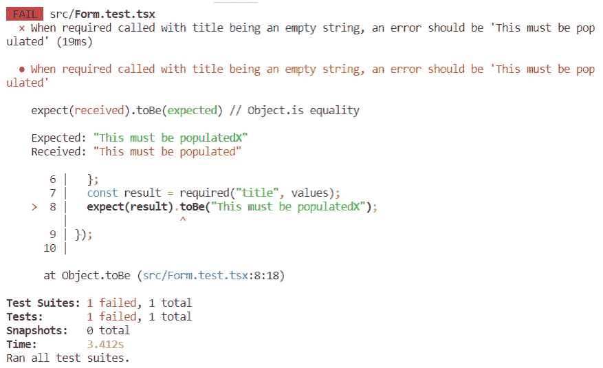
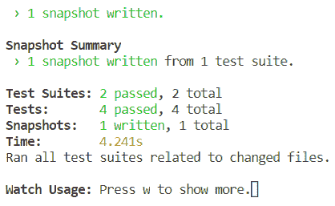
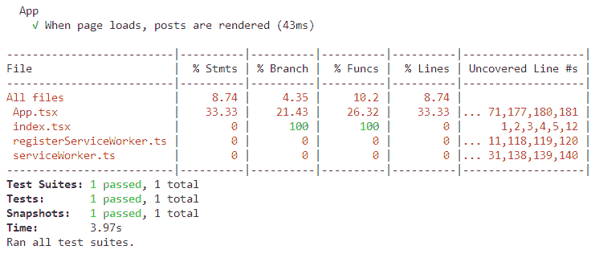
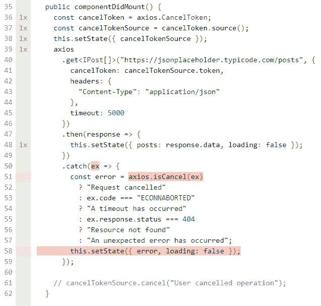

# 用 Jest 进行单元测试

构建一套健壮的单元测试，以捕获真正的 bug，并且在重构代码时不标记误报，这是我们作为软件开发人员所做的最困难的任务之一。Jest 是一个很好的测试工具，可以帮助我们应对这一挑战，我们将在本章中发现这一点

也许应用到单元测试中最简单的部分是纯功能，因为没有副作用需要处理。我们将回顾我们在[第 7 章](07.html)*中使用表单*构建的验证器函数，并针对它们执行一些单元测试，以了解如何对纯函数进行单元测试。

单元测试组件是我们在构建应用程序时执行的最常见的单元测试类型。我们将详细了解它，并利用一个库来帮助我们实现在重构代码时不会不必要地中断的测试。

我们将了解什么是快照测试，以及如何利用它更快地实现测试。快照可以用于测试纯函数和组件，因此它们是我们可以使用的非常有用的工具。

模仿是一个具有挑战性的话题，因为如果我们模仿太多，我们就不会真正测试我们的应用程序。但是，有一些依赖关系对 mock 是有意义的，比如 restapi。我们将重温我们在[第 9 章](09.html)中构建的应用程序*与 Restful API*交互，以便针对它实现一些单元测试并了解模拟。

在为我们的应用程序实现一套单元测试时，了解哪些位已经测试过，哪些位没有测试过是很有用的。我们将学习如何使用代码覆盖工具来帮助我们快速确定需要更多单元测试的应用程序区域。

本章将介绍以下主题：

*   测试纯函数
*   测试组件
*   使用 Jest 快照测试
*   模拟依赖项
*   获取代码覆盖率

# 技术要求

我们在本章中使用以下技术：

*   **Node.js 和`npm`**：TypeScript 和 React 依赖于这些。从以下链接安装它们：[https://nodejs.org/en/download/](https://nodejs.org/en/download/) 。如果您已经安装了这些，请确保`npm`至少是 5.2 版

*   **Visual Studio 代码**：我们需要一个编辑器来编写 React 和 TypeScript 代码，可以从[安装 https://code.visualstudio.com/](https://code.visualstudio.com/) 。我们还需要 TSLint 扩展（由 egamma 提供）和 Pretter 扩展（由 Estben Petersen 提供）。
*   **反应车间**：我们将在我们创建的反应车间上实施单元测试。这可以通过以下链接在 GitHub 上获得：[https://github.com/carlrip/LearnReact17WithTypeScript/tree/master/08-ReactRedux%EF%BB%BF](https://github.com/carlrip/LearnReact17WithTypeScript/tree/master/08-ReactRedux%EF%BB%BF) 。
*   **第 9 章代码**：我们将在[第 9 章](09.html)*中创建的与 RESTful API*交互的应用程序上实施单元测试。这可在 GitHub 上通过以下链接获得：[https://github.com/carlrip/LearnReact17WithTypeScript/tree/master/09-RestfulAPIs/03-AxiosWithClass](https://github.com/carlrip/LearnReact17WithTypeScript/tree/master/09-RestfulAPIs/03-AxiosWithClass) 。

In order to restore code from a previous chapter, the `LearnReact17WithTypeScript` repository at [https://github.com/carlrip/LearnReact17WithTypeScript](https://github.com/carlrip/LearnReact17WithTypeScript) can be downloaded. The relevant folder can then be opened in Visual Studio Code and `npm install` entered in the terminal to do the restore. All the code snippets in this chapter can be found online at the following link: [https://github.com/carlrip/LearnReact17WithTypeScript/tree/master/11-UnitTesting](https://github.com/carlrip/LearnReact17WithTypeScript/tree/master/11-UnitTesting).

# 测试纯函数

在本节中，我们将通过在纯函数上实现单元测试来开始单元测试之旅。

A pure function has a consistent output value for a given set of parameter values. Pure functions only depend on the function arguments, and on nothing outside the function. These functions also don't change any of the argument values passed into them.

这些函数只依赖于它们的参数值这一事实使得它们可以直接进行单元测试。

我们将对我们在 React shop 中创建的`Form`组件中创建的`required`验证器函数进行单元测试。如果还没有，请在 Visual Studio 代码中打开此项目。

我们将使用 Jest 作为我们的单元测试框架，Jest 在单元测试 React 应用程序中非常流行。幸运的是，`create-react-app`工具在创建项目时为我们安装并配置了这个。因此，Jest 已准备好用于我们的 React shop 项目。

# 创建基本的纯函数测试

让我们在项目中创建第一个单元测试，以测试`Form.tsx`中的`required`功能：

1.  首先在`src`文件夹中创建一个名为`Form.test.tsx`的文件。我们将使用此文件作为测试代码，在`Form.tsx`中测试代码

The `test.tsx` extension is important because Jest automatically looks for files with this extension when finding tests to execute. Note that if our tests don't contain any JSX, we could use a `test.ts` extension.

2.  让我们导入要测试的函数，以及参数值所需的 TypeScript 类型：

```jsx
import { required, IValues } from "./Form";
```

3.  让我们开始使用 Jest`test`函数创建测试：

```jsx
test("When required is called with empty title, 'This must be populated' should be returned", () => {
  // TODO: implement the test
});
```

`test`功能包含两个参数：

*   第一个参数是一条消息，告诉我们测试是否通过，这将显示在测试输出中
*   第二个参数是一个 arrow 函数，它将包含我们的测试

4.  我们将继续使用包含空`title`属性的`values`参数调用`required`函数：

```jsx
test("When required called with title being an empty string, an error should be 'This must be populated'", () => {
  const values: IValues = {
 title: ""
 };
 const result = required("title", values);
  // TODO: check the result is correct
});
```

5.  我们在这个测试中的下一个任务是检查`required`函数的结果是否符合我们的预期。我们可以使用 Jest`expect`函数来执行此操作：

```jsx
test("When required called with title being an empty string, an error should be 'This must be populated'", () => {
  const values: IValues = {
    title: ""
  };
  const result = required("title", values);
  expect(result).toBe("This must be populated");
});
```

我们将要检查的变量传递到`expect`函数中。然后我们将一个`toBe`匹配器函数链接到该函数上，该函数检查`expect`函数的结果是否与提供给`toBe`函数的参数相同。

`toBe` is one of many Jest matcher functions we can use to check a variable value. The full list of functions can be found at [https://jestjs.io/docs/en/expect](https://jestjs.io/docs/en/expect).

6.  现在我们的测试已经完成，我们可以通过在终端中键入以下内容来运行测试：

```jsx
npm test
```

这将在监视模式下启动 Jest 测试运行程序，这意味着它将持续运行，在我们更改源文件时执行测试。

Jest 最终将找到我们的测试文件，执行我们的测试，并将结果输出到终端，如下所示：


7.  让我们更改测试中的预期结果，以使测试失败：

```jsx
expect(result).toBe("This must be populatedX");
```

当我们保存测试文件时，Jest 自动执行测试并将失败输出到终端，如下所示：



Jest 为我们提供了有关失败的宝贵信息。它告诉我们：

*   哪个测试失败了
*   与实际结果相比，预期结果是什么
*   测试代码中发生故障的那一行

此信息有助于我们快速解决测试失败问题。

8.  在继续之前，让我们更正测试代码：

```jsx
expect(result).toBe("This must be populated");
```

当我们保存更改时，测试现在应该通过了。

# 了解 Jest 手表选项

Jest 执行我们的测试后，它为我们提供以下选项：

```jsx
> Press f to run only failed tests.
> Press o to only run tests related to changed files.
> Press p to filter by a filename regex pattern.
> Press t to filter by a test name regex pattern.
> Press q to quit watch mode.
> Press Enter to trigger a test run.
```

这些选项允许我们指定应该执行哪些测试，随着测试数量的增加，这些选项非常有用。让我们探讨其中一些选项：

1.  如果我们按下*F*，Jest 将只执行失败的测试。在我们的代码中，我们确认没有失败的测试：


2.  让我们按*F*退出此选项，并返回所有可用选项。

3.  现在，让我们按下*P*。这允许我们测试一个特定的文件或一组名称与正则表达式模式匹配的文件。当提示输入文件名模式时，让我们输入`form`：


然后将执行我们在`Form.test.tsx`中的测试。

4.  我们将保持文件名过滤器打开，然后按*T*。这将允许我们按测试名称添加额外的过滤器。让我们进入`required`：


然后将执行我们对`required`函数的测试。

5.  要清除过滤器，我们可以按*C*。

If we receive an error—watch is not supported without git/hg, please use --watchAll, this will be because our project isn't in a Git repository. We can resolve the issue by entering the `git init` command in the Terminal.

我们现在可以很好地处理可用于执行测试的选项。

# 向单元测试结果添加结构

当我们实现更多的单元测试时，在单元测试结果中添加一些结构是非常有用的，这样我们就可以更容易地阅读它们。有一个名为`describe`的 Jest 函数，我们可以使用它将某些测试的结果分组在一起。如果将一个函数的所有测试组合在一起，可能会使读取测试结果更容易。

让我们这样做，并使用`describe`函数重构我们之前创建的单元测试：

```jsx
describe("required", () => {
  test("When required called with title being an empty string, an error should be 'This must be populated'", () => {
    const values: IValues = {
      title: ""
    };
    const result = required("title", values);
    expect(result).toBe("This must be populated");
  });
});
```

描述函数包含两个参数：

*   第一个参数是测试组的标题。我们已经使用了为此测试的函数名。
*   第二个参数是一个 arrow 函数，它包含要执行的测试。我们在这里进行了最初的测试。

当我们保存测试文件时，测试将自动运行，我们改进的输出显示在终端中，测试结果在`required`标题下：


我们已经开始熟悉 Jest，已经实现并执行了单元测试。在下一节中，我们将继续讨论更复杂的单元测试组件主题。

# 测试组件

单元测试组件具有挑战性，因为组件具有依赖项，如浏览器的 DOM 和 React 库。在进行必要的检查之前，我们如何在测试代码中呈现组件？在编码用户交互（例如单击按钮）时，我们如何触发 DOM 事件

在本节中，我们将通过对我们在 React shop 中创建的`ContactUs`组件进行一些测试来回答这些问题。

# 创建基本组件测试

我们将首先创建一个单元测试，以验证在未填写字段的情况下提交“联系我们”表单是否会导致页面上显示错误：

1.  我们将在`ContactUs`组件上实施单元测试。我们首先在`src`文件夹中创建一个名为`ContactUs.test.tsx`的文件。
2.  我们将使用`ReactDOM`呈现`ContactUs`组件的测试实例。我们来导入`React`和`ReactDOM`：

```jsx
import React from "react";
import ReactDOM from "react-dom";
```

3.  我们将模拟表单提交事件，因此让我们从 React 测试实用程序导入`Simulate`函数：

```jsx
import { Simulate } from "react-dom/test-utils";
```

4.  现在，让我们导入需要测试的组件：

```jsx
import ContactUs from "./ContactUs";
```

5.  我们还需要从`Form.tsx`导入提交结果界面：

```jsx
import { ISubmitResult } from "./Form";
```

6.  让我们开始使用 Jest`test`函数创建测试，结果输出到`ContactUs`组：

```jsx
describe("ContactUs", () => {
  test("When submit without filling in fields should display errors", () => {
    // TODO - implement the test
  });
});
```

7.  测试实现中的第一项任务是在 DOM 中创建 React 组件：

```jsx
test("When submit without filling in fields should display errors", () => {
  const handleSubmit = async (): Promise<ISubmitResult> => {
 return {
 success: true
 };
 };

 const container = document.createElement("div");
 ReactDOM.render(<ContactUs onSubmit={handleSubmit} />, container);

 // TODO - submit the form and check errors are shown

 ReactDOM.unmountComponentAtNode(container);
});
```

首先，我们创建一个容器`div`标记，然后将`ContactUs`组件呈现到这个容器中。我们还为返回成功的`onSubmit`道具创建了一个处理程序。测试中的最后一行通过删除在测试中创建的 DOM 元素进行清理。

8.  接下来，我们需要获取表单的引用，然后提交它：

```jsx
ReactDOM.render(<ContactUs onSubmit={handleSubmit} />, container);

const form = container.querySelector("form");
expect(form).not.toBeNull();
Simulate.submit(form!);

// TODO - check errors are shown

ReactDOM.unmountComponentAtNode(container);
```

以下是逐步说明：

*   我们使用`querySelector`函数，传入`form`标记以获取对`form`标记的引用。
*   然后，我们使用 Jest`expect`函数和`not`和`toBeNull`函数链接在一起，检查表单是否为`null`。
*   使用 React 测试实用程序中的`Simulate`功能模拟`submit`事件。我们在`form`变量后面使用`!`来通知 TypeScript 编译器它不是`null`。

9.  我们的最终任务是检查是否显示验证错误：

```jsx
Simulate.submit(form!);

const errorSpans = container.querySelectorAll(".form-error");
expect(errorSpans.length).toBe(2);

ReactDOM.unmountComponentAtNode(container);
```

让我们一步一步来看看：

*   我们在容器 DOM 节点上使用`querySelectorAll`函数，传入 CSS 选择器以查找应该包含错误的`span`标记
*   然后，我们使用 Jest`expect`函数来验证是否显示了两个错误

10.  当测试运行时，它应该成功通过，这给了我们两个通过的测试：


在本测试中，Jest 在假 DOM 中呈现组件。还使用标准 React 测试实用程序中的`simulate`函数模拟了表单`submit`事件。因此，为了便于交互式组件测试，有很多模拟正在进行。

还要注意，我们在测试代码中引用了内部实现细节。我们引用了一个`form`标记和一个`form-error`CSS 类。如果我们以后将这个 CSS 类名更改为`contactus-form-error`会怎么样？我们的测试将失败，而我们的应用程序不一定存在问题。

这被称为一个**假阳性**，并且可能会使具有此类测试的代码库的更改非常耗时。

# 使用 react 测试库改进我们的测试

react 测试库是一组实用程序，帮助我们为 react 组件编写可维护的测试。它着重于帮助我们从测试代码中删除实现细节。

我们将使用此库删除测试代码中的 CSS 类引用，以及与 React 的事件系统的紧密耦合。

# 安装 react 测试库

我们先通过终端将`react-testing-library`作为开发依赖项安装：

```jsx
npm install --save-dev react-testing-library
```

几秒钟后，这将添加到我们的项目中。

# 从测试中删除 CSS 类引用

我们将通过删除`form-error`CSS 类上的依赖项对测试进行第一次改进。相反，我们将通过错误文本获得对错误的引用，这是用户在屏幕上看到的，而不是实现细节：

1.  我们将从`react-testing-library`导入一个`render`函数，现在我们将使用它来呈现我们的组件。我们还将导入一个`cleanup`函数，我们将在测试结束时使用该函数从 DOM 中删除测试组件：

```jsx
import { render, cleanup} from "react-testing-library";
```

2.  我们可以使用刚刚导入的`render`函数来呈现我们的组件，而不是使用`ReactDOM.render`，如下所示：

```jsx
test("When submit without filling in fields should display errors", () => {
  const handleSubmit = async (): Promise<ISubmitResult> => {
    return {
      success: true
    };
  };
  const { container, getAllByText } = render(
 <ContactUs onSubmit={handleSubmit} />
 );

  const form = container.querySelector("form");
  ...
});
```

我们在一个`container`变量中获取容器 DOM 节点，以及一个`getallByText`函数，我们将使用该函数获取对所显示错误的引用。

3.  现在我们使用`getAllByText`函数获取页面上显示的错误：

```jsx
Simulate.submit(form!);

const errorSpans = getAllByText("This must be populated");
expect(errorSpans.length).toBe(2);
```

4.  我们要做的最后一个更改是在测试结束时使用我们刚刚导入的`cleanup`函数而不是`ReactDOM.unmountComponentAtNode`清理 DOM。我们还将在测试之外，在 Jest 的`afterEach`函数中执行此操作。我们完成的测试现在应该如下所示：

```jsx
afterEach(cleanup);

describe("ContactUs", () => {
  test("When submit without filling in fields should display errors", () => {
    const handleSubmit = async (): Promise<ISubmitResult> => {
      return {
        success: true
      };
    };
    const { container, getAllByText } = render(
      <ContactUs onSubmit={handleSubmit} />
    );

    const form = container.querySelector("form");
    expect(form).not.toBeNull();
    Simulate.submit(form!);

    const errorSpans = getAllByText("This must be populated");
    expect(errorSpans.length).toBe(2);
  });
});
```

当测试运行时，它仍然可以正常执行，并且测试应该通过。

# 使用 fireEvent 进行用户交互

我们现在将切换到依赖于本机事件系统，而不是位于其上的 React 的事件系统。这使我们更接近于测试用户使用我们的应用程序时发生的情况，并增强了我们对测试的信心：

1.  让我们首先从`react-testing-library`向导入语句添加`fireEvent`函数：

```jsx
import { render, cleanup, fireEvent } from "react-testing-library";
```

2.  我们将把`getByText`函数添加到`render`函数调用中的解构变量中：

```jsx
const { getAllByText, getByText } = render(
  <ContactUs onSubmit={handleSubmit} />
);
```

我们还可以删除解构的`container`变量，因为不再需要它了。

3.  然后，我们可以使用此函数获取对 Submit 按钮的引用。之后，我们可以使用我们导入的`fireEvent`功能点击按钮：

```jsx
const { getAllByText, getByText } = render(
  <ContactUs onSubmit={handleSubmit} />
);

const submitButton = getByText("Submit");
fireEvent.click(submitButton);

const errorSpans = getAllByText("This must be populated");
expect(errorSpans.length).toBe(2);
```

先前引用`form`标记的代码现在已被删除。

当测试运行时，它仍然通过。

因此，我们的测试引用的是用户看到的项目，而不是实现细节，因此意外中断的可能性要小得多。

# 为有效表单提交创建第二个测试

现在我们已经了解了如何编写健壮测试的要点，让我们添加第二个测试，以检查表单填写错误时是否显示验证错误：

1.  我们首先在`ContactUs`小组中创建一个新测试：

```jsx
describe("ContactUs", () => {
  test("When submit without filling in fields should display errors", () => {
    ...
  });

  test("When submit after filling in fields should submit okay", () => {
 // TODO - render component, fill in fields, submit the form and check there are no errors
 });
});
```

2.  我们将以与第一次测试相同的方式呈现组件，但分解的变量略有不同：

```jsx
test("When submit after filling in fields should submit okay", () => {
  const handleSubmit = async (): Promise<ISubmitResult> => {
 return {
 success: true
 };
 };
 const { container, getByText, getByLabelText } = render(
 <ContactUs onSubmit={handleSubmit} />
 );
});
```

现在：

*   我们需要`container`对象来检查是否显示任何错误
*   我们将使用`getByText`功能定位提交按钮
*   我们将使用`getByLabelText`函数获取对输入的引用

3.  我们现在可以使用`getByLabelText`函数获取输入名称的引用。之后，我们进行一点检查以验证名称输入是否存在：

```jsx
const { container, getByText, getByLabelText } = render(
  <ContactUs onSubmit={handleSubmit} />
);

const nameField: HTMLInputElement = getByLabelText(
 "Your name"
) as HTMLInputElement;
expect(nameField).not.toBeNull();
```

4.  然后我们需要模拟用户填写这个输入。为此，我们调用本机`change`事件，传入所需的事件参数，其中包括我们的输入值：

```jsx
const nameField: HTMLInputElement = getByLabelText(
  "Your name"
) as HTMLInputElement;
expect(nameField).not.toBeNull();
fireEvent.change(nameField, {
 target: { value: "Carl" }
});
```

我们模拟了用户将名称字段设置为`Carl`。

We use a type assertion after the call to `getByLabelText` to inform the TypeScript compiler that the returned element is of type `HTMLInputElement`, so that we don't get a compilation error.

5.  然后，我们可以按照相同的模式填写电子邮件字段：

```jsx
const nameField: HTMLInputElement = getByLabelText(
  "Your name"
) as HTMLInputElement;
expect(nameField).not.toBeNull();
fireEvent.change(nameField, {
  target: { value: "Carl" }
});

const emailField = getByLabelText("Your email address") as HTMLInputElement;
expect(emailField).not.toBeNull();
fireEvent.change(emailField, {
 target: { value: "carl.rippon@testmail.com" }
});
```

这里，我们模拟了用户将电子邮件字段设置为`carl.rippon@testmail.com`。

6.  然后，我们可以通过单击 submit 按钮提交表单，方式与第一次测试相同：

```jsx
fireEvent.change(emailField, {
  target: { value: "carl.rippon@testmail.com" }
});

const submitButton = getByText("Submit");
fireEvent.click(submitButton); 
```

7.  我们的最终任务是验证屏幕上没有显示错误。不幸的是，我们不能使用上一次测试中使用的`getAllByText`函数，因为这期望找到至少一个元素，而在我们的例子中，我们期望没有元素。因此，在我们执行此检查之前，我们将在错误周围添加一个包装`div`标签。让我们转到`Form.tsx`并执行以下操作：

```jsx
{context.errors[name] && context.errors[name].length > 0 && (
 <div data-testid="formErrors">
    {context.errors[name].map(error => (
      <span key={error} className="form-error">
        {error}
      </span>
    ))}
  </div>
)}
```

我们已经给了`div`标记一个`data-testid`属性，我们将在测试中使用它

8.  让我们回到我们的测试。我们现在可以使用`data-testid`属性定位错误周围的`div`标记。然后我们可以验证此`div`标记是否为`null`，因为不会显示任何错误：

```jsx
fireEvent.click(submitButton); 

const errorsDiv = container.querySelector("[data-testid='formErrors']");
expect(errorsDiv).toBeNull();
```

当测试在我们的测试套件中运行时，我们会发现现在有三个通过测试。

不过，引用`data-testid`属性不是一个实现细节吗？用户看不到或不关心`data-testid`属性，这似乎与我们前面所说的相矛盾。

这是一种实现细节，但它专门用于我们的测试。因此，实现重构不太可能意外地破坏我们的测试

在下一节中，我们将添加另一个测试，这次使用 Jest 快照测试。

# 使用 Jest 快照测试

快照测试是 Jest 将呈现组件中的所有元素和属性与呈现组件的前一个快照进行比较的测试。如果没有差异，则测试通过。

我们将添加一个测试，通过使用 Jest 快照测试检查 DOM 节点来验证`ContactUs`组件呈现 OK：

1.  我们将在`ContactUs`测试组中创建一个标题为`Renders okay`的测试，以与前面相同的方式呈现组件：

```jsx
describe("ContactUs", () => {
  ...
  test("Renders okay", () => {
 const handleSubmit = async (): Promise<ISubmitResult> => {
 return {
 success: true
 };
 };
 const { container } = render(<ContactUs onSubmit={handleSubmit} />);

 // TODO - do the snapshot test
 });
});
```

2.  现在，我们可以添加执行快照测试的行：

```jsx
test("Renders okay", () => {
  const handleSubmit = async (): Promise<ISubmitResult> => {
    return {
      success: true
    };
  };
  const { container } = render(<ContactUs onSubmit={handleSubmit} />);

  expect(container).toMatchSnapshot();
});
```

进行快照测试非常简单。我们将要比较的 DOM 节点传递到 Jest 的`expect`函数中，然后在其后面链接`toMatchSnapshot`函数。

测试运行时，我们将确认快照已写入终端，如下所示：



3.  如果我们查看`src`文件夹，我们将看到它现在包含一个`__snapshots__`文件夹。如果我们查看此文件夹，我们将看到一个名为`ContactUs.test.tsx.snap`的文件。打开该文件，我们将看到以下内容：

```jsx
// Jest Snapshot v1, https://goo.gl/fbAQLP

exports[`ContactUs Renders okay 1`] = `
<div>
  <form
    class="form"
    novalidate=""
  >
    <div
      class="form-group"
    >
      <label
        for="name"
      >
        Your name
      </label>
      <input
        id="name"
        type="text"
        value=""
      />
    </div>
    ...
  </form>
</div>
`;
```

在这段代码中，部分内容被剥离出来，但我们得到了要点：我们有每个 DOM 节点的副本，包括它们的属性，这些属性来自传递给`toMatchSnapshot`函数的`container`元素。

不过，此测试与我们的实现紧密耦合。因此，对 DOM 结构或属性的任何更改都将破坏我们的测试。

4.  例如，让我们在`Form.tsx`中的`Form`组件中添加一个`div`标记：

```jsx
<form ...>
  <div>{this.props.children}</div>
  ...
</form>
```

当测试运行时，我们将看到测试已中断的确认。Jest 很好地向我们展示了终端的不同之处：


5.  我们很高兴这是一个有效的更改，所以我们可以按*U*让 Jest 更新快照：


那么，快照测试是好事还是坏事？它们是不稳定的，因为它们与组件的实现紧密耦合。然而，它们非常容易创建，当它们出现故障时，Jest 在突出问题区域并允许我们高效地更正测试快照方面做得非常好。它们非常值得一试，看看您的团队是否从中获得了价值。

在本章中，我们已经学到了很多关于单元测试 React 和 TypeScript 应用程序的知识。接下来，我们将学习如何模拟依赖项。

# 模拟依赖项

模拟组件的依赖关系可以使组件更易于测试。然而，如果我们模拟了太多的东西，那么测试是否真的验证了该组件在我们真正的应用程序中工作？

在编写单元测试时，确定要模拟的内容是最困难的任务之一。不过，有些东西很值得模仿，比如 RESTAPI。RESTAPI 在前端和后端之间是一个非常固定的契约。模拟 RESTAPI 还可以让我们的测试运行得又好又快。

在本节中，我们最终将学习如何模拟使用`axios`进行的 RESTAPI 调用。不过，首先，我们将了解 Jest 的函数模拟特性。

# 在 Jest 中使用模拟函数

我们将对该测试进行另一项改进，该测试验证了在未填写字段的情况下提交 Contact Us 表单会导致错误显示在页面上。我们将添加一个附加检查，以确保未执行提交处理程序：

1.  让我们回到我们编写的第一个组件测试：`ContactUs.test.tsx`。我们手动创建了一个`handleSubmit`函数，我们在`ContactUs`组件的实例中引用了该函数。让我们将其更改为 Jest 模拟函数：

```jsx
const handleSubmit = jest.fn();
```

我们的测试将正确运行，就像以前一样，但是这次 Jest 为我们模拟了这个函数。

2.  现在 Jest 正在模拟提交处理程序，我们可以在测试结束时检查它是否被作为附加检查调用。我们使用`not`和`toBeCalled`Jest matcher 函数来实现这一点：

```jsx
const errorSpans = container.querySelectorAll(".form-error");
expect(errorSpans.length).toBe(2);

expect(handleSubmit).not.toBeCalled();
```

这真的很好，因为我们不仅简化了提交处理程序函数，而且还很容易地添加了一个检查来验证它是否未被调用。

让我们继续进行我们实施的第二个测试，该测试验证了已提交有效的联系我们表单，可以：

1.  我们将再次更改`handleSubmit`变量以引用 Jest 模拟函数：

```jsx
const handleSubmit = jest.fn();
```

2.  让我们验证是否调用了提交处理程序。我们使用`toBeCalledTimes`Jest 函数传递我们期望调用该函数的次数，在本例中为`1`：

```jsx
const errorsDiv = container.querySelector("[data-testid='formErrors']");
expect(errorsDiv).toBeNull();

expect(handleSubmit).toBeCalledTimes(1);
```

当测试执行时，它仍然应该通过

3.  我们还可以做一个有用的检查。我们知道正在调用 submit 处理程序，但它的参数是否正确？我们可以使用`toBeCalledWith`Jest 函数来检查：

```jsx
expect(handleSubmit).toBeCalledTimes(1);
expect(handleSubmit).toBeCalledWith({
 name: "Carl",
 email: "carl.rippon@testmail.com",
 reason: "Support",
 notes: ""
});
```

同样，当测试执行时，它仍然应该通过

因此，通过让 Jest 模拟我们的提交处理程序，我们很快在测试中添加了一些有价值的附加检查。

# 使用 Axios 模拟适配器模拟 Axios

我们将转到我们在[第 9 章](09.html)中创建的项目*与 Restful API 交互。*我们将添加一个测试，验证帖子是否正确呈现在页面上。我们将模拟 JSONPlaceholder REST API，这样我们就可以控制返回的数据，这样我们的测试就能很好地快速执行：

1.  首先，我们需要安装`axios-mock-adapter`包作为开发依赖项：

```jsx
npm install axios-mock-adapter --save-dev
```

2.  我们还将安装`react-testing-library`：

```jsx
npm install react-testing-library --save-dev
```

3.  该项目已经有一个测试文件`App.test.tsx`，其中包括对`App`组件的基本测试。我们将删除测试，但保留导入，因为我们需要这些。
4.  此外，我们将从 react 测试库`axios`和`MockAdapter`类中导入一些函数，我们将使用这些函数模拟 REST API 调用：

```jsx
import { render, cleanup, waitForElement } from "react-testing-library";
import axios from "axios";
import MockAdapter from "axios-mock-adapter";
```

5.  让我们添加在每次测试后执行的常规清理行：

```jsx
afterEach(cleanup);
```

6.  我们将使用适当的描述创建测试，并将其置于`App`组下：

```jsx
describe("App", () => {
  test("When page loads, posts are rendered", async () => {

    // TODO - render the app component with a mock API and check that the posts in the rendered list are as expected
```

```jsx
      });
});
```

注意，`arrow`函数用`async`关键字标记。这是因为我们最终将在测试中进行异步调用。

7.  我们测试的第一项工作是使用`MockAdapter`类模拟 REST API 调用：

```jsx
test("When page loads, posts are rendered", async () => {
    const mock = new MockAdapter(axios);
 mock.onGet("https://jsonplaceholder.typicode.com/posts").reply(200, [
 {
 userId: 1,
 id: 1,
 title: "title test 1",
 body: "body test 1"
 },
 {
 userId: 1,
 id: 2,
 title: "title test 2",
 body: "body test 2"
 }
 ]);
});
```

当调用获取帖子的 URL 时，我们使用`onGet`方法定义我们想要的响应 HTTP 状态代码和主体。因此，对 RESTAPI 的调用应该返回两个包含测试数据的 POST。

8.  我们需要检查帖子是否正确呈现。为此，我们将在`App.tsx`中的无序帖子列表中添加一个`data-testid`属性。我们也只会在有数据时渲染：

```jsx
{this.state.posts.length > 0 && (
  <ul className="posts" data-testid="posts">
    ...
  </ul>
)}
```

9.  回到我们的测试，我们现在可以呈现组件并分解`getByTestId`函数：

```jsx
mock.onGet("https://jsonplaceholder.typicode.com/posts").reply(...);
const { getByTestId } = render(<App />);
```

10.  我们需要检查渲染的帖子是否正确，但这很棘手，因为这些帖子是异步渲染的。在进行检查之前，我们需要等待 posts 列表添加到 DOM 中。我们可以使用 react 测试库中的`waitForElement`函数来完成此操作：

```jsx
const { getByTestId } = render(<App />);
const postsList: any = await waitForElement(() => getByTestId("posts"));
```

`waitForElement`函数接受一个 arrow 函数作为参数，它反过来返回我们正在等待的元素。我们使用`getByTestId`函数获取 posts 列表，该列表使用其`data-testid`属性找到它。

11.  然后，我们可以使用快照测试来检查 posts 列表中的内容是否正确：

```jsx
const postsList: any = await waitForElement(() => getByTestId("posts"));
expect(postsList).toMatchSnapshot();
```

12.  在我们的测试能够成功执行之前，我们需要在`tsconfig.json`中进行更改，以便 TypeScript 编译器知道我们正在使用`async`和`await`：

```jsx
{
  "compilerOptions": {
    "target": "es5",
    "lib": ["dom", "es2015"],
    ...
  },
  "include": ["src"]
}
```

执行测试时，将创建快照。如果我们检查快照，它将包含两个列表项，其中包含我们告诉 RESTAPI 返回的数据。

我们已经了解了 Jest 和 react 测试库中的一些重要特性，这些特性帮助我们在纯函数和 react 组件上编写可维护的测试。

我们怎样才能知道单元测试覆盖了我们应用程序的哪些部分，更重要的是，哪些部分没有被覆盖？我们将在下一节中找到答案。

# 获取代码覆盖率

代码覆盖率是指单元测试覆盖了多少应用程序代码。当我们编写单元测试时，我们会对哪些代码被覆盖和哪些代码没有被覆盖有一个大致的概念，但随着应用程序的发展和时间的推移，我们将无法了解这一点

Jest 附带了一个很好的代码覆盖工具，所以我们不必将所覆盖的内容保存在头脑中。在本节中，我们将使用它来发现我们在上一节中工作的项目中的代码覆盖率，我们在其中模拟了`axios`：

1.  我们的第一个任务是添加一个`npm`脚本，该脚本将在覆盖率跟踪工具打开的情况下运行测试。让我们添加一个名为`test-coverage`的新脚本，在执行`react-scripts`时包含`--coverage`选项：

```jsx
"scripts": {
  "start": "react-scripts start",
  "build": "react-scripts build",
  "test": "react-scripts test",
  "test-coverage": "react-scripts test --coverage",
  "eject": "react-scripts eject"
},
```

2.  然后，我们可以在终端中运行此命令：

```jsx
npm run test-coverage
```

几秒钟后，Jest 将在终端中的每个文件上呈现一些漂亮的高级覆盖率统计信息：



3.  如果我们查看我们的项目文件结构，我们会看到一个`coverage`文件夹被添加了一个`lcov-report`文件夹。在`lcov-report`文件夹中有一个`index.html`文件，其中包含每个文件覆盖范围的更详细信息。让我们打开这个，看看：


我们看到的信息与终端中显示的信息相同

这四列统计数字意味着什么？

*   `Statements`列显示代码中执行了多少条语句
*   `Branches`列显示代码中条件语句中执行了多少分支

*   `Function`列显示代码中调用了多少函数
*   `Line`列显示代码中执行了多少行。一般来说，这将与`Statements`图相同。但是，如果在一行上放置多个语句，则可能会有所不同。例如，以下内容计为一行，但有两条语句：

```jsx
let name = "Carl"; console.log(name);
```

4.  我们可以钻取每个文件，找出哪些特定的代码位没有被覆盖。点击`App.tsx`链接：



代码行左侧带有绿色背景的`1x`表示这些行已经被我们的测试执行过一次。以红色突出显示的代码是我们的测试未涵盖的代码。

因此，获取覆盖率统计数据并确定我们可能想要实现的其他测试非常容易。这是一个非常值得使用的东西，让我们相信我们的应用程序经过了良好的测试。

# 总结

在本章中，我们学习了如何使用 Jest 测试用 TypeScript 编写的纯函数。我们只需使用要测试的参数执行函数，并使用 Jest 的`expect`函数与 Jest 的匹配器函数（如`toBe`链接）来验证结果。

我们研究了如何与 Jest 的测试运行程序交互，以及如何应用过滤器，以便只执行我们关注的测试。我们了解到，测试 React 和 TypeScript 组件比测试纯函数更复杂，但 Jest 和 React 测试库为我们提供了大量帮助。

我们还学习了如何使用`render`函数呈现组件，以及如何使用 react 测试库中的`getByText`和`getLabelByText`等各种函数与元素交互和检查元素。

我们了解到，我们也可以使用 react 测试库中的`waitForElement`函数轻松测试异步交互。我们现在了解了在测试中不引用实现细节的好处，这将帮助我们构建更健壮的测试。

我们还讨论了 Jest 聪明的快照测试工具。我们研究了这些测试是如何定期中断的，以及为什么它们非常容易创建和更改。

模拟和监视函数的能力是我们现在知道的另一个非常有趣的特性。检查是否使用正确的参数调用了组件事件处理程序的函数确实可以为测试增加价值。

我们讨论了可用于模拟`axios`REST API 请求的`axios-mock-adapter`库。这使我们能够轻松地测试与 RESTful API 交互的容器组件。

现在，我们知道如何快速确定需要实施的其他测试，从而让我们相信我们的应用程序经过了良好的测试。我们使用`react-scripts`和`--coverage`选项创建了一个`npm`脚本命令来实现这一点。

总的来说，我们现在有了知识和工具，可以通过 Jest 为我们的应用程序稳健地创建单元测试。

Jasmine 和 Mocha 是两种流行的替代测试框架。Jest 的最大优点是它由`create-react-app`配置来计算方框。如果我们想使用茉莉花和摩卡，就必须手动配置它们。不过，如果您的团队已经有使用这两种工具的经验，而不是学习其他测试框架，那么 Jasmine 和 Mocha 是值得考虑的。

Ezyme 是另一个与 Jest 一起用于测试 React 应用程序的流行库。它支持浅层渲染，这是一种仅渲染组件中的顶级元素而不渲染子组件的方法。这是非常值得探索的，但请记住，我们嘲笑的越多，我们得到的真相就越远，我们对我们的应用程序经过良好测试的信心就越低。

# 问题

1.  假设我们正在实现一个 Jest 测试，我们有一个名为`result`的变量，我们要检查它不是`null`。我们如何使用 Jest matcher 函数实现这一点？

2.  假设我们有一个名为`person`的变量，类型为`IPerson`：

```jsx
interface IPerson {
  id: number;
  name: string;
}
```

我们要检查`person`变量是否为`{ id: 1, name: "bob" }`。我们如何使用 Jest matcher 函数实现这一点？

3.  是否可以使用 Jest 快照测试执行最后一个问题中的检查？如果是，怎么做？
4.  我们已经实现了一个名为`CheckList`的组件，它从列表中的数组中呈现文本。每个列表项都有一个复选框，以便用户可以选择列表项。该组件有一个名为`onItemSelect`的函数 prop，当用户选中复选框选择一个项目时调用该函数 prop。我们正在进行一项测试，以验证`onItemSelect`道具是否有效。以下代码行在测试中呈现组件：

```jsx
const { container } = render(<SimpleList data={["Apple", "Banana", "Strawberry"]} onItemSelect={handleListItemSelect} />);
```

我们如何为`handleListItemSelect`使用 Jest 模拟函数并检查它是否被调用？

5.  在上一个问题`SimpleList`的实现中，`onItemSelect`函数引入了一个名为`item`的参数，该参数是用户选择的`string`值。在我们的测试中，假设我们已经模拟了用户选择`Banana`。如何检查调用了`onItemSelect`函数，项目参数为`Banana`？

6.  在最后两个问题的`SimpleList`实现中，文本使用一个标签显示，该标签使用`for`属性绑定到复选框。我们如何使用 react 测试库中的函数首先定位`Banana`复选框，然后再进行检查？
7.  在本章中，我们发现呈现来自 JSONPlaceholder REST API 的帖子的代码覆盖率很低。当我们从 RESTAPI 获取帖子时，`componentDidMount`函数中处理 HTTP 错误代码是其中一个未涉及的领域。创建一个测试以覆盖此代码区域。

# 进一步阅读

以下资源可用于查找有关单元测试 React 和 TypeScript 应用程序的更多信息：

*   官方 Jest 文档可在以下链接中找到：[https://jestjs.io/](https://jestjs.io/)
*   React 测试库 GitHub 存储库位于以下链接：[https://github.com/kentcdodds/react-testing-library](https://github.com/kentcdodds/react-testing-library)
*   阅读以下链接的酶文档：[https://airbnb.io/enzyme/docs/api/](https://airbnb.io/enzyme/docs/api/)
*   Jasmine GitHub 页面如下：[https://jasmine.github.io/index.html](https://jasmine.github.io/index.html)
*   摩卡主页位于[https://mochajs.org/](https://mochajs.org/)