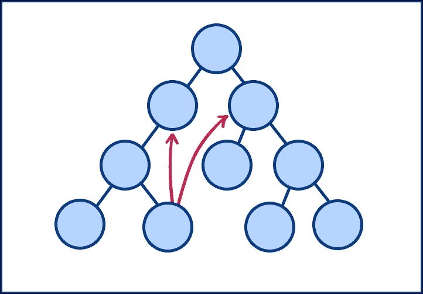
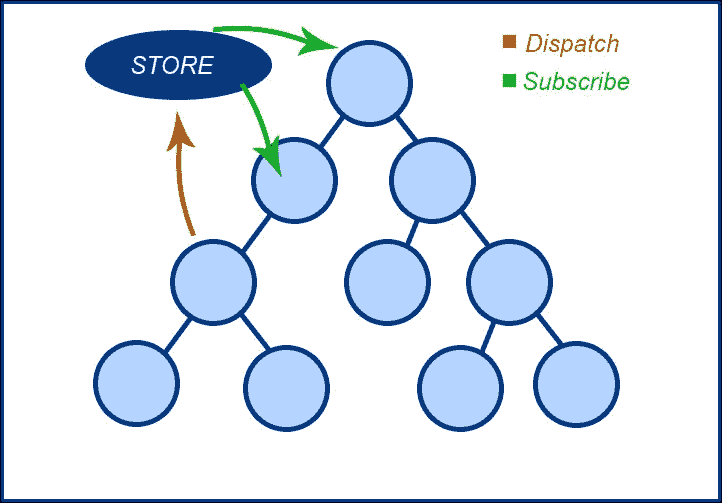
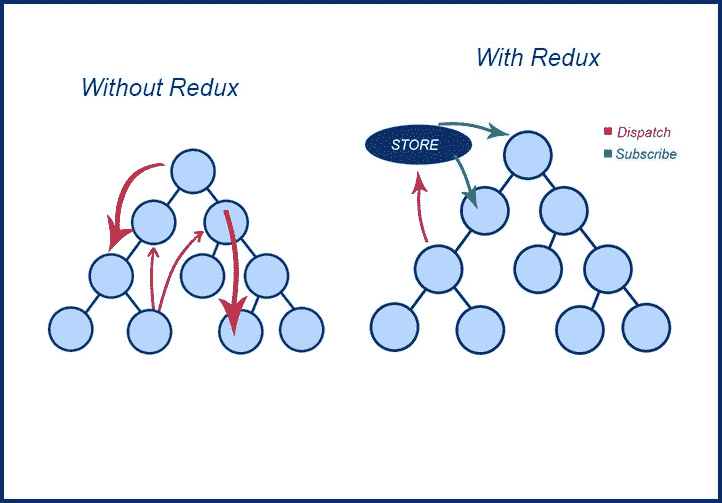
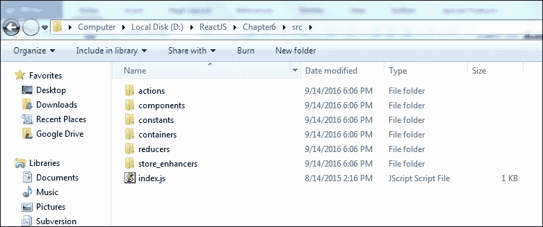

# 六、Redux 架构

在前面的章节中，我们已经学习了如何创建自定义组件、如何与 React 进行 DOM 交互以及如何与 React 一起使用 JSX，这将使您对 React 及其在不同平台上的变体有足够的了解，并提供了实际的示例，如 Add Ticket form 应用程序。现在我们将进入一个高级阶段，它将使您进一步了解 JavaScript 应用程序中的状态管理。

# 什么是 Redux？

我们知道，在**单页申请**（**SPA**）中，当我们必须与状态和时间签订合同时，随着时间的推移，很难掌握状态。在这里，Redux 帮助很大。怎样因为在 JavaScript 应用程序中，Redux 处理两种状态：一种是数据状态，另一种是 UI 状态，这是 SPA 的标准选项。此外，请记住，Redux 可以与 AngularJS、jQuery 或 React JS 库或框架一起使用。

Redux 是什么意思？简而言之，Redux 是开发 JavaScript 应用程序时处理状态的帮手。

我们在前面的示例中已经看到，数据只在一个方向上从父级流向子级，称为*单向数据流*。React 具有从数据到组件的相同流向，因此在这种情况下，React 中的两个组件很难正确通信。

我们可以在下图中清楚地看到：



正如我们在前面的图中所看到的，React 并不遵循两个组件的直接通信，尽管它有一个特性来提供该策略。然而，这被认为是不好的做法，因为它可能会导致不准确，而且这是一种非常古老的写作方式，很难理解。

但这并不意味着不可能在 React 中实现它，因为它提供了另一种实现方法，但是，根据您的逻辑和 React 标准，您必须操纵它。

要对两个不具有父子关系的组件实现相同的功能，您必须定义一个全局事件系统，它们在其中进行通信；通量可能是最好的例子。

在这里，Redux 进入了画面，因为它提供了一种将您的所有状态存储到组件可以访问它的位置的方法，该位置称为**存储**。简单地说，任何组件发现任何更改时，都必须首先分派到存储，如果其他组件需要访问，则必须从存储中**订阅**。它不能直接授权与该组件的通信，如下图所示：



在上图中，我们可以看到**存储**假装为应用程序内各种状态修改的*中介*，Redux 通过**存储**控制两个组件之间的直接通信，具有单点通信。

您可能认为使用其他策略可以实现组件之间的通信，但不建议这样做，因为这会导致错误代码，或者很难遵循：



现在很清楚 Redux 是如何通过将所有状态更改发送到**存储**而不是在组件内通信来简化工作的。现在组件只需考虑分派状态更改；所有其他责任将由**门店**承担。

通量模式做同样的事情。您可能听说过 Redux 的灵感来自 Flux，让我们看看它们的相似之处：

比较 Redux 和 Flux，Redux 是一种工具，而 Flux 只是一种模式，您不能使用它即插即用，也不能下载它。我不否认 Redux 与 Flux 模式有一些相似之处，但它与 Flux 并非 100%相同。

让我们看看一些不同之处。

Redux 遵循三个指导原则，如下所示，这也将涵盖 Redux 和 Flux 之间的差异。

## 单店方式

我们在前面的图中看到，应用程序中的所有状态修改，存储都假装是*中介*，Redux 通过存储控制两个组件之间的直接通信，充当单个通信点。

这里 Redux 和 Flux 的区别在于：Flux 有多个存储方法，Redux 有一个存储方法。

## 只读状态

在 React 应用程序中，组件不能直接更改状态，但必须通过*操作*将更改发送到存储。

这里，`store`是一个对象，它有以下四种方法：

*   `store.dispatch`（行动）
*   `store.subscribe`（听众）
*   `store.getState()`
*   `replaceReducer`（下一个减速器）

您可能知道 JavaScript 中的`get`和`set`属性：`set`属性设置对象，`get`属性获取对象。但对于`store`方法，只有`get`方法，因此只有一种方法可以设置通过*动作*发送变更的状态。

JavaScript Redux 的示例如以下代码所示：

```jsx
var action = { 
    type: 'ADD_USER', 
    user: {name: 'Dan'} 
}; 
// Assuming a store object has been created already 
store.dispatch(action); 

```

这里，一个动作意味着`dispatch()`，其中`store`方法将发送一个对象来更新状态。在前面的代码片段中，`action`获取`type`数据来更新状态。您可以根据组件的需要使用不同的设计来设置操作。

## 减速器的功能是改变状态

Reducer 功能将处理`dispatch`动作以改变状态，因为 Redux 工具不允许两个组件之间直接通信，因此它也不会改变状态，但`dispatch`动作将针对状态改变进行描述。

在下面的代码片段中，您将看到`Reducer`如何通过允许当前状态作为参数并返回新状态来更改`state`：

```jsx
Javscript: 
// Reducer Function 
varsomeReducer = function(state, action) { 
    ... 
    return state; 
} 

```

这里的约化子可以看作是纯函数。以下是编写`Reducer`函数的几个特点：

*   没有外部数据库或网络呼叫
*   根据其参数返回值
*   参数是*不可变的*
*   相同的参数返回相同的值

Reducer 函数被称为纯函数，因为它们除了根据设置的参数纯粹返回一个值之外，什么都不做；它们没有其他后果。

# Redux 的架构

正如我们已经讨论过的，Redux 受 Flux 模式的启发，因此它也遵循其架构。这意味着状态更改将发送到存储，存储将处理组件之间通信的操作。

让我们通过下图来了解数据和逻辑是如何工作的：


要了解 Redux 架构，请遵循以下几点：

*   在前面的图中，您可以在右下方看到组件的触发动作。
*   状态突变的发生方式与它在流量请求中的工作方式相同，它可能会有一个**API**请求作为另一个效果。
*   在这里**中间件**扮演着重要的角色，比如处理监听承诺状态的动作以及采取新的动作。
*   **减速机**作为中间件处理操作。
*   **Reducer**作为中间件获取所有动作请求，并与数据关联。它有权通过定义新状态全局更改应用程序存储中的状态。
*   当我们说状态改变时，这涉及到重新选择它的选择器、转换数据和传递组件。
*   当组件获得更改请求时，它相应地将 HTML 呈现给 DOM 元素。

在我们前进之前，我们必须了解流程以获得平滑的结构。

## Redux 的架构优势

与其他框架相比，Redux 具有更多优势：

*   它可能没有任何其他副作用
*   正如我们所知，不需要绑定，因为组件不能直接交互
*   国家是全球管理的，因此管理不善的可能性较小
*   有时，对于中间件来说，很难管理其他副作用

从以上几点可以看出，Redux 的体系结构非常强大，并且具有可重用性。让我们看一个实际的例子，看看 Redux 如何与 React 一起工作。

我们将在 Redux 中创建添加票据表单应用程序。

# 重排设置

让我们从 Redux 中的一个`UserList`示例开始。首先，使用应用程序创建一个目录。我们在本例中使用 Node.js 服务器和 npm 包，因为 Redux 模块不单独可用。

## 安装 Node.js

首先，如果尚未在系统中安装 Node.js，我们必须下载并安装它。我们可以从[下载 Node.jshttp://nodejs.org](http://nodejs.org) 。它包括 npm 包管理器。

设置完成后，我们可以检查 Node.js 是否设置正确。打开命令提示符窗口并运行以下命令：

```jsx
node --version
```

您应该能够看到版本信息，从而确保安装成功。

### 设置应用程序

首先，我们需要为我们的项目创建一个`package.json`文件，其中包括项目信息和依赖项。现在，打开命令提示符/控制台并导航到已创建的目录。运行以下命令：

```jsx
Npm init
```

此命令将初始化我们的应用程序，并询问几个问题以创建名为`package.json`的 JSON 文件。该实用程序将询问有关项目名称、描述、入口点、版本、作者姓名、依赖项、许可证信息等的问题。一旦执行该命令，它将在项目的根目录中生成一个`package.json`文件：

```jsx
{ 
  "name": "react-redux add ticket form example", 
  "version": "1.0.0", 
  "description": "", 
  "scripts": { 
    "start": "node server.js", 
    "lint": "eslintsrc" 
  }, 
  "keywords": [ 
    "react", 
   "redux", 
   "redux form", 
    "reactjs", 
    "hot", 
    "reload", 
    "live", 
    "webpack" 
  ], 
  "author": "Harmeet Singh <harmeet.singh090@gmail.com>", 
  "license": "MiIT", 
  "devDependencies": { 
    "babel-core": "^5.8.3", 
    "babel-eslint": "^4.0.5", 
    "babel-loader": "^5.3.2", 
    "css-loader": "^0.15.6", 
    "cssnext-loader": "^1.0.1", 
    "eslint": "^0.24.1", 
    "eslint-plugin-react": "^3.1.0", 
    "extract-text-webpack-plugin": "^0.8.2", 
    "html-webpack-plugin": "^1.6.1", 
    "react-hot-loader": "^1.2.7", 
    "redux-devtools": "^1.0.2", 
    "style-loader": "^0.12.3", 
    "webpack": "^1.9.6", 
    "webpack-dev-server": "^1.8.2" 
  }, 
  "dependencies": { 
    "classnames": "^2.1.3", 
    "lodash": "^3.10.1", 
    "react": "^0.13.0", 
    "react-redux": "^0.2.2", 
    "redux": "^1.0.0-rc" 
  } 
} 

```

好的，在我们开始之前，让我向您解释一些主要工具：

*   `webpack-dev-server`：这是一个服务器，用于实时重新加载我们的应用程序。
*   `babel-loader`：这是我们 JavaScript 的编译器。
*   `redux-devtools`：这是一个强大的 Redux 开发工具。在开发中使用此工具将帮助我们监视 domui 中的更新。
*   `classnames`：这是一个帮助我们在有条件的情况下应用这些类的模块。
*   `eslint`：这是一个类似于 JSHint 和 JSLint 的用于解析 JavaScript 的工具。

## 开发工具设置

首先，我们需要创建`webpack.config.js`并添加以下代码来启用`redux-devtools`：

```jsx
var path = require('path'); 
varwebpack = require('webpack'); 
varExtractTextPlugin = require('extract-text-webpack-plugin'); 
vardevFlagPlugin = new webpack.DefinePlugin({ 
  __DEV__: JSON.stringify(JSON.parse(process.env.DEBUG || 'true')) 
}); 

module.exports = { 
  devtool: 'eval', 
  entry: [ 
    'webpack-dev-server/client?http://localhost:3000', 
    'webpack/hot/only-dev-server', 
    './src/index' 
  ], 
  output: { 
    path: path.join(__dirname, 'dist'), 
    filename: 'bundle.js', 
    publicPath: '/static/' 
  }, 
  plugins: [ 
    new webpack.HotModuleReplacementPlugin(), 
    new webpack.NoErrorsPlugin(), 
    devFlagPlugin, 
    new ExtractTextPlugin('app.css') 
  ], 
  module: { 
    loaders: [ 
      { 
        test: /\.jsx?$/, 
        loaders: ['react-hot', 'babel'], 
        include: path.join(__dirname, 'src') 
      }, 
      { test: /\.css$/, loader: ExtractTextPlugin.extract
      ('css-loader?module!cssnext-loader') } 
    ] 
  }, 
  resolve: { 
    extensions: ['', '.js', '.json'] 
  } 
}; 

```

现在，创建一个名为`src`的目录。在这里面，我们需要创建一些文件夹，如以下屏幕截图所示：



## Redux 应用程序设置

在每个 Redux 应用程序中，我们都有操作、还原器、存储和组件。让我们从为应用程序创建一些操作开始。

### 行动

操作是将数据从应用程序发送到存储的信息的一部分。

首先，我们需要在 actions 文件夹中创建`UsersActions.js`文件，并将以下代码放入其中：

```jsx
import * as types from '../constants/ActionTypes'; 

export function addUser(name) { 
  return { 
    type: types.ADD_USER, 
    name 
  }; 
} 

export function deleteUser(id) { 
  return { 
    type: types.DELETE_USER, 
    id 
  }; 
} 

```

在前面的代码中，我们创建了两个操作：`addUser`和`deleteUser`。现在我们需要在定义`type`的`constants`文件夹中创建`ActionTypes.js`：

```jsx
export constADD_USER = 'ADD_USER'; 
export constDELETE_USER = 'DELETE_USER';  

```

### 减速器

还原程序处理描述发生了某件事情的操作，但是管理应用程序的状态是还原程序的责任。它们存储上一个`state`和`action`以及`return`下一个`state`：

```jsx
export default function users(state = initialState, action) { 
  switch (action.type) { 
    case types.ADD_USER: 
    constnewId = state.users[state.users.length-1] + 1; 
      return { 
        ...state, 
        users: state.users.concat(newId), 
        usersById: { 
          ...state.usersById, 
          [newId]: { 
            id: newId, 
            name: action.name 
          } 
        }, 
      } 

     case types.DELETE_USER: 
     return { 
       ...state, 
       users: state.users.filter(id => id !== action.id), 
       usersById: omit(state.usersById, action.id) 
     } 

     default: 
     return state; 
  } 
} 

```

### 商店

我们已经定义了表示*发生了什么*以及何时需要根据这些操作更新状态的操作和还原器。

`store`是结合动作和减缩器的对象。商店有以下责任：

*   保存应用程序状态
*   允许通过`getState()`和`dispatch`访问和更新状态（操作）
*   通过`subscribe`（监听器）注册和注销监听器

以下是集装箱文件夹内的`UserListApp.js`代码：

```jsx
constinitialState = { 
  users: [1, 2, 3], 
  usersById: { 
    1: { 
      id: 1, 
      name: 'Harmeet Singh' 
    }, 
    2: { 
      id: 2, 
      name: 'Mehul Bhatt' 
    }, 
    3: { 
      id: 3, 
      name: 'NayanJyotiTalukdar' 
    } 
  } 
}; 
import React, { Component, PropTypes } from 'react'; 
import { bindActionCreators } from 'redux'; 
import { connect } from 'react-redux'; 

import * as UsersActions from '../actions/UsersActions'; 
import { UserList, AddUserInput } from '../components'; 

@connect(state => ({ 
userlist: state.userlist 
})) 
export default class UserListApp extends Component { 

  static propTypes = { 
    usersById: PropTypes.object.isRequired, 
    dispatch: PropTypes.func.isRequired 
  } 

  render () { 
    const { userlist: { usersById }, dispatch } = this.props; 
    const actions = bindActionCreators(UsersActions, dispatch); 

    return ( 
      <div> 
        <h1>UserList</h1> 
        <AddUserInputaddUser={actions.addUser} /> 
        <UserList users={usersById} actions={actions} /> 
      </div> 
    ); 
  } 
} 

```

在前面的代码中，我们正在使用静态 JSON 数据`UserList`初始化组件的状态，并使用`getstate`、`dispatch`（操作），我们将更新存储信息。

### 提示

我们在 Redux 应用程序中只有一个存储。当我们需要拆分数据处理逻辑时，我们将使用 reducer 组合而不是多个存储。

### 组件

这些是正常的 React JSX 组件，因此我们不需要详细介绍它们。我们添加了一些函数式无状态组件，除非我们需要使用本地状态或生命周期方法，否则我们将使用这些组件：

在这个（`AddUserInput.js`文件中，我们正在创建一个 JSX 输入组件，从中获取用户输入：

```jsx
export default class AddUserInput extends Component { 
  static propTypes = { 
    addUser: PropTypes.func.isRequired 
  } 

  render () { 
    return ( 
      <input 
      type="text" 
      autoFocus="true" 
      className={classnames('form-control')} 
        placeholder="Type the name of the user to add" 
        value={this.state.name} 
        onChange={this.handleChange.bind(this)} 
        onKeyDown={this.handleSubmit.bind(this)} /> 
    ); 
  } 

  constructor (props, context) { 
    super(props, context); 
      this.state = { 
        name: this.props.name || '', 
      }; 
  } 
} 

```

在`UserList.js`中，我们正在创建一个列表组件，在其中迭代`Input`组件的值：

```jsx
export default class UserList extends Component { 
  static propTypes = { 
    users: PropTypes.object.isRequired, 
    actions: PropTypes.object.isRequired 
  } 

  render () { 
    return ( 
      <div className="media"> 
        { 
          mapValues(this.props.users, (users) => { 
            return (<UsersListItem 
              key={users.id} 
              id={users.id} 
              name={users.name} 
               src={users.src} 
              {...this.props.actions} />); 
          }) 
        } 
      </div> 
    ); 
  } 
}

```

迭代`UserList`组件中的值后，我们将在Bootstrap`media`布局中显示该列表：

```jsx
export default class UserListItem extends Component { 
  static propTypes = { 
    id: PropTypes.number.isRequired, 
    name: PropTypes.string.isRequired, 
    onTrashClick: PropTypes.func.isRequired 
  } 

  render () { 
    return ( 
      <div> 
      <div className="clearfix"> 
            <a href="#" className="pull-left"> 
             
            </a> 
            <div className={`media-body ${styles.paddng10}`}> 
                  <h3className="media-heading"> 
                  <strong><a href="#">{this.props.name}</a></strong> 
                  </h3> 
            <p> 
                  Loremipsum dolor sit amet, consecteturadipiscingelit. 
                  Praesentgravidaeuismod ligula,
                  vel semper nuncblandit sit amet.  
            </p> 

            <div className={`pull-right ${styles.userActions}`}> 
            <button className={`btnbtn-default ${styles.btnAction}`} 
            onClick={()=>this.props.deleteUser(this.props.id)} 
            > 
            Delete the user <iclassName="fafa-trash" /> 
            </button> 
            </div> 
          </div> 
        </div> 
      </div> 
    ); 
  } 
}  

```

现在我们需要将组件包装在`UserListApp.js`容器文件夹中：

```jsx
import { UserList, AddUserInput } from '../components'; 
@connect(state => ({ 
  userlist: state.userlist 
})) 
export default class UserListApp extends Component {  
  static propTypes = { 
    usersById: PropTypes.object.isRequired, 
    dispatch: PropTypes.func.isRequired 
  } 

  render () { 
    const { userlist: { usersById }, dispatch } = this.props; 
    const actions = bindActionCreators(UsersActions, dispatch); 

    return ( 
      <div> 
        <h1>UserList</h1> 
        <AddUserInput addUser={actions.addUser} /> 
        <UserList users={usersById} actions={actions} /> 
      </div> 
    ); 
  } 
}
```

现在，让我们将这个`UserListApp`组件包装到容器文件夹中`App.js`中的 Redux 存储中：

```jsx
import UserListApp from './UserListApp'; 
import * as reducers from '../reducers'; 

const reducer = combineReducers(reducers); 
const store = createStore(reducer); 

export default class App extends Component { 
  render() { 
    return ( 
      <div> 
        <Provider store={store}> 
          {() => <UserListApp /> } 
        </Provider> 

        {renderDevTools(store)} 
      </div> 
    ); 
  } 
} 

```

现在转到根目录，打开 CMD 并运行以下命令：

要安装此应用程序所需的软件包，请运行以下命令：

```jsx
Npm install
```

完成后，运行以下命令：

```jsx
Npm start
```

观察以下屏幕截图：


那看起来太棒了。右侧面板中是 Redux DevTool，它提供了 UI 的更新。我们可以很容易地看到删除或添加此列表中用户的更新。

以下屏幕截图显示从`UserList`删除用户：


以下屏幕截图显示添加的用户：


### 注

请参阅[第 6 章](06.html "Chapter 6. Redux Architecture")、*Redux 架构*的源代码，以正确理解应用程序的流程。

# 总结

现在我们可以看到 Redux 体系结构的重要性及其在 React 应用程序中的作用。在本章中，我们还了解了状态管理，了解了存储如何全局处理状态更改请求，Redux 有助于避免组件之间的直接交互。

本章介绍 Redux 体系结构及其细节。为了澄清，我们已经看到了一些图表，这些图表提供了对 Redux 体系结构中数据流和逻辑的理解。Redux 架构的灵感来自 Flux，但它有自己的特性和优点。我们希望这些图表和实际示例能够帮助您理解 Redux 体系结构。

现在，我们将进入下一章，讨论如何使用 React 进行路由。