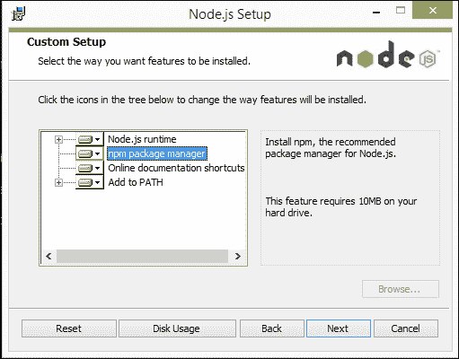
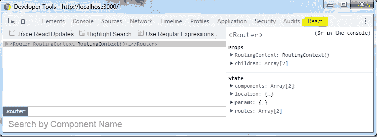
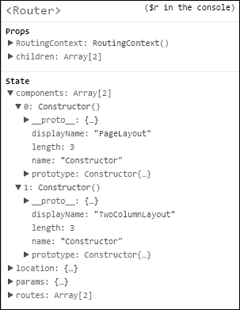

# 九、 React 和 Node.js 

在前面的章节中，我们学习了 React 路由、Facebook API 的集成以及如何配置和处理应用程序 URL。我们还学习了如何根据 URL 在 DOM 中注册组件。

在本章中，我们将使用 Node.js 构建现有的应用程序。我不会在这里向您展示如何连接服务器并构建服务器端方面，因为这超出了本书的范围。但是，它包含在本书附带的代码文件中。以下是我们将在本章中介绍的内容：

*   使用 npm 安装所有模块
*   运行编译器和预处理器
*   集成 addticket 表单
*   提交表单并将其保存在本地存储中
*   存储和读取本地存储数据
*   运行开发 web 服务器、文件监视程序和浏览器重新加载
*   React 调试工具

到目前为止，我们的应用程序完全基于前端，并且没有模块化。当然，这意味着我们的应用程序代码看起来很混乱。我们还为 React 的每个依赖项库使用一个解包文件，浏览器必须去获取并编译每个 JavaScript 文件。

我们不再需要手动连接和缩小，但我们可以设置一个监视文件更改的设置，并自动进行更改，例如`webpack`和`webpack-hot-middleware`。

让我们继续在我们的项目中进行更改，不断重复这个过程将是乏味的。

# 安装节点和 npm

首先，我们需要下载并安装 Node.js。如果您已经安装并配置了节点，请跳过本节。我们可以从[下载 Node.jshttp://nodejs.org](http://nodejs.org)并遵循以下说明：

1.  Download the installer for your operating system from [http://nodejs.org/](http://nodejs.org/). Node.js provides different installers in line with your platform. In this chapter, we will use the Windows installer to set up Node.

    

2.  我们也可以从[下载以前的节点版本 https://nodejs.org/en/download/releases/](https://nodejs.org/en/download/releases/) 。在本章中，我们使用的是 Node.js 0.12 分支，因此请确保您正在下载它。
3.  Run the installer and the MSI file that we downloaded.

    安装程序向导将要求您选择要安装的功能，您可以选择所需的功能。通常，我们选择默认安装：

    

4.  如果安装需要，请重新启动计算机。

系统重启后，我们可以检查 Node.js 是否设置正确。

打开命令提示符并运行以下命令：

```jsx
node --version // will result something like v0.12.10
```

您应该能够看到版本信息，从而确保安装成功。

## React 应用程序设置

首先，我们需要为我们的项目创建一个`package.json`文件，其中包括项目信息和 npm 模块的依赖关系。npm 对于 JavaScript 开发人员创建和共享他们创建的可重用代码非常有用，这些代码用于构建应用程序并在开发应用程序时解决特定问题。

现在，打开命令提示符/控制台并导航到已创建的目录。运行以下命令：

```jsx
Npm init
```

此命令将初始化我们的应用程序，并询问几个问题以创建名为`package.json`的 JSON 文件。该实用程序将询问有关项目名称、描述、入口点、版本、作者姓名、依赖项、许可证信息等的问题。一旦执行该命令，它将在项目的根目录中生成一个`package.json`文件。

```jsx
{ 
    "name": "react-node", 
    "version": "1.0.0", 
    "description": "ReactJS Project with Nodejs", 
    "scripts": { 
        "start": "node server.js", 
        "lint": "eslint src" 
    }, 
    "author": "Harmeet Singh <harmeetsingh090@gmail.com>", 
    "license": "MIT", 
    "bugs": { 
        "url": "" 
    }, 

```

在前面的代码中，您可以看到应用程序的`name`、应用程序的入口点（`start`、应用程序的`version`和应用程序的`description`。

## 安装模块

现在我们需要安装一些节点模块，这些模块将帮助我们使用节点构建 React 应用程序。我们将使用 Babel、React、React DOM、Router、Express 等。

以下是通过`npm`安装模块的命令：

```jsx
npm install <package name> --save
```

当我们使用`<package name>`运行上述命令时，它将在您的`project folder/node_modules`中安装程序包，并将`package name/version`保存在您的`package.json`中，这将帮助我们安装所有项目依赖项并更新任何系统中的模块。

如果您已经拥有带有项目依赖项的`package.json`文件，则只需运行以下命令：

```jsx
npm install
```

要更新，我们需要运行以下命令：

```jsx
npm update
```

以下是在我们的应用程序中具有依赖项的模块列表：

```jsx
"devDependencies": { 
    "babel-core": "^6.0.20", 
    "babel-eslint": "^4.1.3", 
    "babel-loader": "^6.0.1", 
    "babel-preset-es2015": "^6.0.15", 
    "babel-preset-react": "^6.0.15", 
    "babel-preset-stage-0": "^6.0.15", 
    "body-parser": "^1.15.2", 
    "eslint": "^1.10.3", 
    "eslint-plugin-react": "^3.6.2", 
    "express": "^4.13.4", 
    "react-hot-loader": "^1.3.0", 
    "webpack": "^1.12.2", 
    "webpack-dev-middleware": "^1.6.1", 
    "webpack-hot-middleware": "^2.10.0" 
    }, 
    "dependencies": { 
        "mongodb": "^2.2.11", 
        "mongoose": "^4.6.8", 
        "react": "^0.14.6", 
        "react-dom": "^0.14.6", 
        "react-router": "^1.0.0-rc1", 
        "style-loader": "^0.13.1", 
        "url-loader": "^0.5.7", 
        "css-loader": "^0.26.0",a 
        "file-loader": "^0.9.0" 
    } 

```

在前面的`dependencies`列表中，可能有一些模块您没有听说过，或者您还不熟悉。好的，让我解释一下：

*   `mongoose`和`mongodb`：它们在应用程序或 MongoDB 中充当中间件。安装 MongoDB 和 mongoose 对您来说是可选的，因为我们在应用程序中不使用它们。我刚刚添加了它们供您参考。
*   `nodemon`：在 Node.js 应用程序的开发过程中，`nodemon`会观察目录中的文件，如果文件发生变化，会自动重启您的节点应用程序。
*   `react-hot-loader`：这是 web 开发中最常用的实时代码编辑和项目重新加载模块。`react-hot-loader`本身对其他模块有一定的依赖性：
    *   `webpack`
    *   `webpack-hot-middleware`
    *   `webpack-dev-middleware`
*   `webpack-hot-middleware`：这允许您在不使用`webpack-dev-server`的情况下向现有服务器添加热重新加载。它将浏览器客户端连接到网页包服务器，以从服务器接收更新和订阅更改。然后使用 webpack 的**热模块替换**（**HMR**API）执行这些更改。
*   `webpack-dev-middleware`：这是一个网页包包装器，通过连接的服务器提供从网页包发出的文件。在开发过程中具有以下优势：
    *   文件不会写入磁盘，而是在内存中处理。
    *   如果在开发过程中以监视模式更改了文件，则不会向您提供旧包，但请求会延迟到编译完成。文件修改后，我们不需要进行页面刷新。

### 注

`webpack-dev-middlware`仅用于开发。请不要在生产中使用它。

`style-loader`、`url-loader`、`css-loader`和`file-loader`帮助加载静态路径、CSS 和文件。

例如：`import '../vendor/css/bootstrap.min.css'`，包括字体 URL 和图片路径。

在设置了`package.json`文件之后，我们有了如下代码所示的 HTML 标记，名为`index.html`：

```jsx
<!doctype html> 
<html>
    <head>
        <title>React Application - EIS</title>
        <script src="//ajax.googleapis.com/ajax/libs/jquery/
        1.11.1/jquery.min.js"></script> 
    </head>
    <body>
        <div id='root'> 
        </div>
        <script src="/static/bundle.js"></script> 
    </body>
</html> 

```

现在我们需要在`server.js`中创建一个服务器来运行我们的应用程序：

```jsx
var path = require('path'); 
var webpack = require('webpack'); 
var express = require('express'); 
var config = require('./webpack.config'); 
var app = express(); 
var compiler = webpack(config); 

app.use(require('webpack-dev-middleware')(compiler, { 
    publicPath: config.output.publicPath 
})); 
app.use(require('webpack-hot-middleware')(compiler));
```

在前面的代码中，我们正在应用程序中配置`webpack`。它连接到服务器并接收更新通知以重建客户端捆绑包：

```jsx
app.get('*', function(req, res) { 
    res.sendFile(path.join(__dirname, 'index.html')); 
}); 

app.listen(3000, function(err) { 
    if (err) { 
        return console.error(err); 
    } console.log('Listening at http://localhost:3000/'); 
}) 

```

在前面的代码中，我们发送一个 HTML 文件并启动服务器。您可以根据需要更改端口号。

现在让我们来看一下，在我们的 Ty1 T1 文件的顶部，我们只包含了。

```jsx
module.exports = { 
    devtool: 'cheap-module-eval-source-map', 
    entry: [ 
        'webpack-hot-middleware/client', 
        './src/index' 
    ], 
    output: { 
        path: path.join(__dirname, 'dist'), 
        filename: 'bundle.js', 
        publicPath: '/static/' 
    }, 
    plugins: [ 
        new webpack.HotModuleReplacementPlugin() 
    ], 

```

在前面的代码中，我们正在设置`webpack-hot-middleware`插件，并添加要编译和运行的脚本入口点：

```jsx
module: { 
    loaders: [{ 
        test: /\.js$/, 
        loaders: ['react-hot', 'babel'], 
        include: path.join(__dirname, 'src') 
    }, 
    { 
        test: /\.css$/, 
        loader: 'style!css', 
        exclude: /node_modules/ 
        }, { 
            test: /\.(woff|woff2|ttf|svg)$/, 
            loader: 'url?limit=100000', 
            exclude: /node_modules/ 
        }, 
        { 
            test: /\.(eot|png)$/, 
            loader: 'file', 
            exclude: /node_modules/ 
        } 
        ] 
    } 
}; 

```

这里，我们根据应用程序中匹配的文件加载模块。

我们还需要配置 Babel，其中包括 ECMAScript 版本和`eslint`以添加一些规则、插件信息等。

`.babelrc`文件包括：

```jsx
{ 
    "presets": ["es2015", "stage-0", "react"] 
} 

```

`.eslintrc`文件包括：

```jsx
{ 
    "ecmaFeatures": { 
        "jsx": true, 
        "modules": true 
    }, 
    "env": { 
        "browser": true, 
        "node": true 
    }, 
    "parser": "babel-eslint", 
    "rules": { 
        "quotes": [2, "single"], 
        "strict": [2, "never"], 
        "react/jsx-uses-react": 2, 
        "react/jsx-uses-vars": 2, 
        "react/react-in-jsx-scope": 2 
    }, 
    "plugins": [ 
        "react" 
    ] 
}
```

观察以下屏幕截图：


前面的屏幕截图显示了根目录的文件夹结构。在`src`目录中，我们有所有脚本，在供应商文件夹中，我们有Bootstrap字体和 CSS。

# 具有 React 和 Node 的响应式Bootstrap应用程序

我们将包括并模块化我们迄今为止开发的Bootstrap应用程序。在这个应用程序中，我们可以看到静态用户配置文件在线提高帮助台票证并在服务器端呈现 React 组件。我们没有使用任何数据库，所以我们正在浏览器的本地存储中存储我们的票证。我们可以在 view 票中看到提交的票。

为了供您参考，我在代码片段中包含了 Mongodb 配置和 db 连接设置，您可以在本书中学习。此外，我还为 addticket 表单提供了 mongoose 模式，以便您可以使用它们。

首先，我们打开`src`文件夹中脚本文件`index.js`的入口点和`import`React 模块。

```jsx
import React from 'react'; 
import ReactDOM from 'react-dom'; 
import { Router, Route, Link, IndexRoute,IndexLink, browserHistory } 
from 'react-router' 

```

在版本 15.4.0 中，`React`和`ReactDOM`被分为不同的包。在 React 0.14 中，`React.render()`被弃用，取而代之的是`ReactDOM.render()`，开发人员也在 React 15 中从 React 中完全删除了 DOM 特定的 API。

在 React 15.4.0 中，他们最终将 ReactDOM 实现移动到了 ReactDOM 包中。React 包现在将只包含渲染器不可知代码，如`React.Component`和`React.createElement()`。

转到此博客以获取有关 React 的最新更新：

[https://facebook.github.io/react/blog/](https://facebook.github.io/react/blog/)

现在我们需要导入Bootstrap、CSS 和 JS 文件：

```jsx
import '../css/custom.css'; 
import '../vendor/css/base.css'; 
import '../vendor/css/bootstrap.min.css'; 
import '../vendor/js/bootstrap.min.js'; 

```

现在，让我们使用以下命令启动服务器，看看我们的代码和配置是否可以生成：

```jsx
nodemon start
```

它监视应用程序文件中的更改并重新启动服务器。

或者如果我们没有安装`nodemon`，那么命令应该是：

```jsx
node server.js
```


服务器在 webpack 中启动，以将代码包构建到服务器客户端浏览器。如果一切顺利，您可以在构建完成后获得以下信息：


现在我们的页面是空白的。没有什么可以显示的，因为我们还没有在页面中包含任何组件。

让我们在 component 文件夹中创建一个名为`navbar.js`的用于Bootstrap导航的组件。

```jsx
module.exports.PageLayout = React.createClass({ 
}) 

```

`module.exports`是 Node.js 中的特殊对象，包含在每个 js 文件中。它将您的函数、变量以及您在`module.exports`中编写的任何内容公开为一个模块，使您的代码可重用且易于共享。

让我们使用`container`布局将Bootstrap导航组件添加到此页面中，以呈现页面内容：

```jsx
render: function() { 
    return ( 
        <main> 
        <div className="navbar navbar-default navbar-static-top"
        role="navigation"> 
            <div className="container"> 
                <div className="navbar-header"> 
                    <button type="button" className="navbar-toggle"
                    data-toggle="collapse" data-target=".navbar-collapse"> 
                    <span className="sr-only">Toggle navigation</span> 
                    <span className="icon-bar"></span> 
                    <span className="icon-bar"></span> 
                    <span className="icon-bar"></span> 
                    </button> 
                    <Link className="navbar-brand" to="/">EIS</Link> 
                </div> 
            <div className="navbar-collapse collapse"> 
            <ul className="nav navbar-nav"> 
            <li><IndexLink activeClassName="active" to="/">
            Home</IndexLink></li> 
            <li><Link to="/edit" activeClassName="active">
            Edit Profile</Link></li> 
            <li className="dropdown"> 
                <Link to="#" className="dropdown-toggle"
                data-toggle="dropdown">Help Desk <b className="caret">
                </b></Link> 
            <ul className="dropdown-menu"> 
            <li><Link to="/alltickets">View Tickets</Link></li> 
            <li><Link to="/newticket">New Ticket</Link></li> 
            </ul> 
            </li> 
            </ul> 
        </div> 
    </div> 
</div> 

```

我们的页面导航`container`到此结束。

这里我们开始页面的主`container`，在这里我们可以使用`props`呈现页面内容：

```jsx
<div className="container"> 
    <h1>Welcome to EIS</h1> 
    <hr/> 
    <div className="row"> 
    <div className="col-md-12 col-lg-12"> 
    {this.props.children} 
    </div> 
    </div> 
    </div> 
</main> 
); 
}  

```

让我们继续添加主页内容并准备第一个布局：

```jsx
const RightSection = React.createClass({ 
    render: function() { 
        return (<div className="col-sm-9 profile-desc" id="main">  
        <div className="results">  
        <PageTitle/> 
        <HomePageContent/> 
        </div> 
        </div>) 
    } 
}) 
// include Left section content in ColumnLeft component with the wrapper of bootstrap responsive classes classes    

const ColumnLeft = React.createClass({ 
    render: function() { 
        return ( 
        ) 
    } 
}) 
const LeftSection = React.createClass({ 
    render: function() { 
        return (  
        //Left section content          
        ) 
    } 
}) 
const TwoColumnLayout = React.createClass({ 
    render: function() { 
        return ( 
            <div> 
            <ColumnLeft/> 
            <RightSection/> 
            </div> 
        ) 
    } 
})  

```

在此，我们将页面标题和主页内容包含在此组件中：

```jsx
const PageTitle = React.createClass({ 
    render: function() { 
        return ( 
            <h2>//page content</h2> 
        ); 
    } 
}); 
const HomePageContent = React.createClass({ 
    render: function() { 
        return ( 
            <p>//page content</p> 
        ); 
    } 
}); 

```

现在，我们需要配置路由以在 UI 中呈现组件：

```jsx
ReactDOM.render(( 
    <Router history={browserHistory}> 
    <Route path="/" component={PageLayout}> 
    <IndexRoute component={TwoColumnLayout}/> 
    </Route> 
    </Router> 
), document.getElementById('root')); 

```

我们需要对其他组件和页面重复相同的流程：


我们的页面看起来很棒；我们已经成功地将第一个页面与 Node.js 集成。

让我们转到我们的主要组件，并在“帮助台”部分添加一个问题。

创建一个名为`addTicketForm.js`的文件，并包含以下代码：

```jsx
import React from 'react'; 
import ReactDOM from 'react-dom'; 

```

包含`React`模块在我们有 React 代码的每个文件中都很重要：

```jsx
var max_Char='140'; 
var style = {color: "#ffaaaa"}; 

module.exports.AddTicket = React.createClass({ 
    getInitialState: function() { 
        return {value: '', char_Left: max_Char}; 
    }, 
    handleChange: function(event) { 
        var input = event.target.value; 
        this.setState({value: input.substr(0, max_Char),char_Left:
        max_Char - input.length}); 
        if (input.length == max_Char){ 
            alert("You have reached the max limit") 
        } 
    }, 

```

### 提示

在前面的代码中，我们使用在[第 5 章](05.html "Chapter 5. jQuery Bootstrap Component with React")中创建的相同代码控制`textarea`组件，*jQuery Bootstrap组件与 React*中创建的相同代码控制`textarea`组件。

```jsx
handleSubmitEvent: function (event) { 
    event.preventDefault(); 

var values   = { 
    date: new Date(), 
    email: this.refs.email.value.trim(), 
    issueType: this.refs.issueType.value, 
    department: this.refs.department.value, 
    comment: this.state.value 
}; 
this.props.addTicketList(values); 
localStorage.setItem('Ticket', JSON.stringify(values)); 
}, 

```

之前我们提交表单后才在`AddTicket`界面中显示。现在我们正在使用本地存储来保存门票。

```jsx
render: function() { 
    return ( 
        <form onSubmit={this.handleSubmitEvent}> 

```

在这里，您需要放入我们之前添加的其他表单元素：

```jsx
<div className="form-group"> 
    <label htmlFor="comments">Comments <span style={style}>*</span>
    </label>(<span>{this.state.char_Left}</span> characters left) 
        <textarea className="form-control" value={this.state.value} 
        maxLength={max_Char} ref="comments" onChange={this.handleChange} /> 
   </div> 
   <div className="btn-group"> 
       <button type="submit" className="btn btn-primary">Submit</button> 
       <button type="reset" className="btn btn-link">cancel</button> 
   </div> 
   </form> 
   ); 
} 
}); 

```

接下来我们需要创建`addTicketList.js`，将这个 JSX 表单包装到组件中：

```jsx
<AddTicket addTicketList={this.addTicketList} /> 

```

我们还需要创建`listView.js`来显示用户同时提交后的列表：

```jsx
import { AddTicket } from "./addTicketForm.js";
import { List } from "./listView.js";
```

这里我们导入了之前创建的`AddTicket`模块，并创建了另一个模块`addTicketForm`，用于管理更新的表单状态：

```jsx
module.exports.AddTicketsForm = React.createClass({ 
    getInitialState: function () { 
        return { 
            list: {} 
        }; 
    }, 
    updateList: function (newList) { 
        this.setState({ 
            list: newList 
        }); 
    }, 
    addTicketList: function (item) { 
    var list = this.state.list; 
    list[item] = item; 
    this.updateList(list); 
    }, 
    render: function () { 
        var items = this.state.list; 
    return ( 
        <div className="container"> 
        <div className="row"> 
        <div className="col-sm-6"> 
            <List items={items} /> 
            <AddTicket addTicketList={this.addTicketList} /> 
        </div> 
        </div> 
        </div> 
    ); 

```

在`render`方法中，我们将表单和`list`项传递到组件中：

```jsx
    } 
}); 
listView.js 
import { ListPanel } from "./ListUI.js"; 

```

在`ListPanel`中，我们有实际的 JSX 代码，在用户提交并创建我们包含在`addTicketList.js`中的模块后，将票据呈现到 UI：

```jsx
module.exports.List = React.createClass({ 
    getListOfIds: function (items) { 
    return Object.keys(items); 
    }, 
    createListElements: function (items) { 
        var item; 
        return ( 
            this 
                .getListOfIds(items) 
                .map(function createListItemElement(itemId,id) { 
                    item = items[itemId]; 
                    return (<ListPanel key={id} item={item} />); 
                    }.bind(this)) 
               .reverse() 
        ); 
    }, 
    render: function () { 
        var items = this.props.items; 
        var listItemElements = this.createListElements(items); 
        return ( 
            <div className={listItemElements.length > 0 ? "":""}> 
            {listItemElements.length > 0 ? listItemElements : ""} 

```

这里我们将把`listItemElements`呈现到 DOM 中：

```jsx
        </div> 
    ); 
    } 
}); 

```

现在我们创建`ListUI.js`，最后一个模块，它将完成表单组件的功能：

```jsx
module.exports.ListPanel =  
React.createClass({ 
    render: function () { 
        var item = this.props.item; 
    return ( 
        <div className="panel panel-default"> 
        <div className="panel-body"> 
        Emailid: {item.email}<br/> 
        IssueType: {item.issueType}<br/> 
        IssueType: {item.department}<br/> 
        Message: {item.comment} 
        </div> 
        <div className="panel-footer"> 
       {item.date.toString()} 
       </div> 
       </div> 
    ); 
    } 
}); 

```

让我们看看浏览器中的输出外观。

请确保在路由中包含以下代码和 URL：

```jsx
<Route path="/newticket" component={AddTicketsForm} />
```

观察以下屏幕截图：


看起来不错。现在，让我们填写此表单，提交并查看输出：


太棒了；我们的表格工作正常。

您还可以在浏览器的本地存储中看到提交**票证**，JSON 符号的**键**和**值**格式：

**开发者工具**>**应用**>**存储**>**本地存储**

观察以下屏幕截图：


现在我们需要从本地存储中获取这个 JSON**票证**并在**查看票证**部分显示给用户。

让我们创建另一个模块来获取票据，并将其呈现到Bootstrap响应表中。档案

`allTickets.js`将如下所示：

```jsx
module.exports.allTickets = React.createClass({ 
    getInitialState: function() { 
        return { 
            value :JSON.parse(localStorage.getItem( 'Ticket' )) || 1}; 
        }, 

```

在组件的初始状态下，我们使用`localStorage.getItem`获取`tickets`并解析成 JSON 来设置状态：

```jsx
getListOfIds: function (tickets) { 
    return Object.keys(tickets); 
    }, 
    createListElements: function (tickets) { 
    var ticket; 
    return ( 
        this 
        .getListOfIds(tickets) 
        .map(function createListItemElement(ticket,id) { 
        ticket = tickets[ticket]; 
        return (<ticketTable key={id} ticket={ticket}/>) 
        }.bind(this)) 
    ); 
}, 

```

使用添加票据时使用的相同方法，我们通过`props`将`ticket key`和值映射到React组件中：

```jsx
render: function() { 
    var ticket = this.state.value;
```

在`render`方法中，我们将`state`值赋给`ticket`变量，并将其传递给`createListElements`函数：

```jsx
var listItemElements = this.createListElements(ticket); 
return ( 
    <div> 
        <div className={listItemElements.length > 0 ? "":"bg-info"}> 
            {listItemElements.length > 0 ? "" : "You have not raised any ticket yet."} 

```

我们正在使用 JavaScript 三元运算符检查是否有`ticket`，如果没有，则在 UI 中显示消息。

```jsx
</div> 
    <table className="table table-striped table-responsive"> 
        <thead> 
            <tr> 
                <th>Date</th> 
                <th>Email ID</th> 
                <th>Issue Type</th> 
                <th>Department</th> 
                <th>Message</th> 
            </tr> 
        </thead> 
        <tbody> 
        <tr> 
            {listItemElements.length > 0 ? listItemElements : ""} 
        </tr> 
        </tbody> 
    </table> 
</div> 
// In the preceding code, we are creating the table header and appending the ticket list items.
   ); 
   } 
}); 

```

现在我们需要创建包含`<td>`并继承`ticket`数据的组件。`ticketTable.js`将如下所示：

```jsx
module.exports.ticketTable = React.createClass({ 
    render: function () { 
        var ticket = this.props.ticket; 
        return ( 
            <td>{ticket}</td> 
        ); 
    } 
}); 

```

我们还需要在`allTickets.js`文件中导入此模块：

```jsx
const table = require("./ticketTable.js"); 

```

您可能会注意到，我使用的是`const`对象，而不是`import`。您也可以使用`var`代替。`const`为常数；它们是块范围的，很像变量。常量的值不能更改和重新分配，也不能重新声明。

例如：

```jsx
const MY_CONST = 10; 
// This will throw an error because we have reassigned again. 
MY_CONST = 20; 

// will print 10 
console.log("my favorite number is: " + MY_CONST); 

// const also works on objects 
const MY_OBJECT = {"key": "value"};  

```

这是我们的最终路由配置：

```jsx
ReactDOM.render(( 
    <Router history={browserHistory}> 
    <Route path="/" component={PageLayout}> 
    <IndexRoute component={TwoColumnLayout}/> 
    <Route path="/profile" component={Profile} /> 
    <Route path="/alltickets" component={allTickets} /> 
    <Route path="/newticket" component={AddTicketsForm} /> 
    </Route> 
    <Route path="*" component={NoMatch}/> 
    </Router> 
), document.getElementById('root')); 

```

## Bootstrap表

让我们看一下以下要点：

*   **条纹行**：将 `<table class="table table-striped">`中的`.table-striped`用于表格行中的斑马条纹
*   **带边框表**：增加`.table-bordered`在整体和单元格中增加边框
*   **悬停行**：增加 `.table-hover`对表行启用悬停状态
*   **浓缩表**：增加`.table-condensed`减少单元格填充
*   **上下文类**：使用上下文类（`.active`、`.success`、`.info`、`.warning`、`.danger`）为表格行或单元格添加背景色

在表格上应用这些类，看看它们如何影响表格的外观和感觉。

### Bootstrap响应表

在创建响应表时，我们需要在`.table-responsive`中包装任何`.table`，使它们在小型设备上水平滚动（768 像素以下）。当我们在大于 768 像素宽的任何设备上查看它们时，您将不会在这些表中看到任何差异。

让我们再提交一次票，然后快速看一下桌子。

转到导航栏中的“帮助台”下拉列表，然后单击“查看通知单”。


如果您尚未提交任何票据，您将在 UI 中收到相应的消息（**您尚未提交任何票据。**）。

好的，让我们提交新的票证并再次打开此页面。添加票证后，它将显示在您的表中：


我们现在可以在表中看到我们提交的票证。

# React 开发者工具

React 为开发人员提供调试 React 代码的工具。它允许我们使用组件层次结构、道具和状态检查 React 渲染的组件。

## 安装

Chrome 和 Firefox 浏览器有两个官方扩展。

下载 Chrome 的扩展：

[https://chrome.google.com/webstore/detail/react-developer-tools/fmkadmapgofadopljbjfkapdkoienihi?hl=en](https://chrome.google.com/webstore/detail/react-developer-tools/fmkadmapgofadopljbjfkapdkoienihi?hl=en)

和 Firefox：

[https://addons.mozilla.org/en-US/firefox/addon/react-devtools/](https://addons.mozilla.org/en-US/firefox/addon/react-devtools/)

### 注

一个独立的应用程序仍在开发中，将很快推出。

## 如何使用

在浏览器中下载或安装扩展后，打开 React 页面上的**开发者工具**。您应该会看到一个名为**React**的额外选项卡：



在侧面板中，您可以看到每个React组件的**状态**和**道具**。如果展开组件的**状态**，您将看到组件的完整层次结构以及您在 React 应用程序中使用的组件的名称。

请参见以下屏幕截图：



右键单击侧面板，我们可以在右侧面板中检查和编辑其当前道具和状态。

我们也可以点击**执行功能**查看代码执行功能：


如果您使用 React 工具检查`allTicket`组件，您可以看到`props`进入子元素的数据流：


如果您在**元素**选项卡中检查页面上的某个React元素，然后切换到**React**选项卡，则该元素将在React树中自动选择。使用“搜索”选项卡，我们还可以按名称搜索组件。

如果您还需要跟踪组件的更新，则需要选中顶部复选框**trace React updates**。

# 总结

在本章中，您了解了如何将 React 独立应用程序转换为 Node.js npm 包并模块化 React 组件。我们首先安装 Node.js 并设置 React 环境。然后我们研究了如何使用`module.export`导入和导出模块。

我们还学习了如何在一个文件中创建和导入多个模块，如`react-router`、`{ Router, Route, IndexRoute,IndexLink, Link, browserHistory } = ReactRouter`。

我们还研究了如何从本地存储中存储和读取数据。使用Bootstrap表，我们将数据显示到表格网格中。我们还介绍了 Bootstrap table，这些造型课程可以让您的桌子更灵敏，外观和感觉更好。