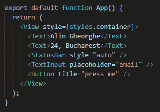
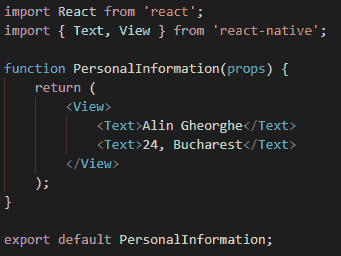
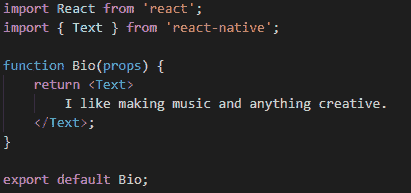

# *第二章*：反应本族语基础

我们首先了解了 React Native 和 Galio 为什么是我们开始构建第一个跨平台移动应用程序的最佳组合。在设置了我们的环境并配置了必要的文件之后，我们用 Expo 创建了第一个 React 原生项目，我们了解了可以对应用程序进行物理和数字测试的不同方法。

我相信在学习如何之前先了解原因有助于建立一个更好、更强大的知识库。在了解了原因之后，现在是了解 React Native 如何工作以及如何使用它创建应用程序的时候了。

这就是为什么我们将在本章开始时，先浏览 React 原生项目的文件结构，以了解这些文件和文件夹是如何连接的。然后，我们将浏览`App.js`文件，并解释它是如何作为我们应用程序的主要入口点工作的。

一旦我们了解了文件结构，我们就应该了解什么是**JSX**以及如何使用它——任何 React 应用程序的框架。我们将大量比较 JSX 和 HTML，因此您必须事先了解一些 HTML。如果您对 web 开发了解不多，请放心——我们还将介绍一些 HTML 概念，但从长远来看，自己学习一点可能会对您有很大帮助。*理解 JSX*的概念是我们将讨论**组件**的概念，这是我们在第一章中几乎没有涉及的概念。在本章结束时，应完全理解这一点。

一旦我们理解了 JSX 的主要概念，以及它如何连接到 React 和 React Native，我们将进行第一次组件导入。我们将了解什么是 npm/Thread，以及如何使用它在 web 上导入和上载组件或库。这是令人兴奋的，因为您将看到拥有一个支持框架的庞大社区的重要性，以及您如何参与并结交新朋友。

现在是了解 React Native 的核心组件的时候了。我们将在讨论改进它们甚至完全改变它们的不同方法时，了解它们在何种情况下如何有用。核心组件是我们将在网上找到的所有组件的基础组件。这意味着几乎每个组件都继承自核心组件，这使得了解和理解这些组件非常重要。

到本章结束时，您将学习如何构建组件。您还将学习如何在我们的应用程序或未来的应用程序中使用它，以及如何组织文件，以便您在搜索组件时永远不会迷路。

我相信在本章结束时，您将能够开始构建真正简单的应用程序，作为构建更大、更复杂项目的垫脚石。理解这些概念并不局限于阅读这本书——它比这本书更深入，你会看到我总是鼓励你查看我们正在使用的任何项目/框架的官方文档，因为这些文档应该是程序员阅读时应该感到舒服的。学习阅读文档是一项技能，你将通过阅读并尽可能对你感兴趣的项目感兴趣来培养。

本章将涵盖以下主题：

*   使用`App.js`——主要入口点
*   理解 JSX 的概念
*   导入第一个组件
*   核心部件
*   理解和创建组件

# 技术要求

您可以通过访问 GitHub[查看本章的代码 https://github.com/PacktPublishing/Lightning-Fast-Mobile-App-Development-with-Galio](https://github.com/PacktPublishing/Lightning-Fast-Mobile-App-Development-with-Galio) 。您将找到一个名为`Chapter 02`的文件夹，其中包含我们在本章中编写的所有代码。要使用该项目，请按照`README.md`文件中的说明进行操作。

# 使用 App.js–主要入口点

正如我们所知，React Native是一个用于构建 iOS 和 Android 应用程序的开源框架。它使用 React 来描述 UI，同时通过我们可以使用的方法访问平台的功能。

了解我们的文件夹结构很重要，因为我们不应该接触某些文件——至少在开发之初是这样。让我们来看看我们新创建的项目的结构。

提示

不要忘记，你可以使用任何你想要的文本编辑器；我之所以使用 VSCode，是因为我喜欢它的外观，它有很多我使用的插件，但这并不意味着你不能用任何你觉得舒服的文本编辑器打开项目。当然，这意味着您将无法使用`code.`命令，因为它只用于 VSCode。

首先，让我们打开终端并导航到文件夹。现在，如果我们在到达文件夹后编写`code.`，它将打开 Visual Studio 代码。

打开文本编辑器后，我们将在项目目录中看到以下输出：


图 2.1–打开文本编辑器后的项目目录

正如我们所看到的，这里有几个文件夹和文件，它们都是为了在您完成应用程序后帮助捆绑项目。在接下来的几节中，我们将逐一介绍这些文件夹。

## 世博会和世博会共享文件夹

我们将从前面有点的文件夹开始：`.expo`和`.expo-shared`。点在那里显示一个隐藏的文件。打开文件浏览器时无法直接看到该文件；只有当您明确选择查看它时，您才能看到它。这些文件是隐藏的，因为您不需要触摸它们。它们是第一次使用`expo start`命令时创建的配置文件。

## 资产文件夹

下一个文件夹是`assets`文件夹。在里面，你会发现几个`.png`图像，这些图像是 Expo 在启动屏幕上使用的，启动屏幕是应用程序加载时出现的屏幕，以及应用程序安装在设备上时使用的图标。

## 节点 _ 模块文件夹

现在，您将看到一个名为`node_modules`的文件夹。如果你打开那个文件夹，你会看到很多很多文件夹。所有这些文件夹都是软件包和**依赖项**，我们正在使用它们来让这个应用程序工作。您通过 internet 安装或导入的所有内容都将直接进入此文件夹。这个文件夹会越来越大，这取决于你将为你的应用程序使用多少外部软件包。

一旦我们通过这些文件夹，我们就有了一些具有一些有趣特性的文件。

## 内的文件

首先，我们可以看到`.gitignore`，这有助于我们在 GitHub 上上传时节省大小。如果你打开文件，你会看到里面已经写了一些文字。一旦您将项目上传到 GitHub 上，您在其中看到的所有内容都将被忽略。你会发现`.expo`存在，因为这些文件夹只与程序员相关，不用于共享。您可以使用任何不想联机或不想更改的文件名来编辑此文件。

重要提示

GitHub是一个平台，它就像一家开放源码软件程序的互联网托管公司，同时也使用 Git 为程序员提供版本控制。开发人员正在使用 Git 跟踪他们项目中的变化，并与他们的队友进行协调。

现在，我们将忽略`App.js`，因为我们将在本节末尾解释此文件。那么，让我们直接转到`app.json`文件。这个文件就像你的应用程序的配置文件——基本上，所有与代码无关的东西都会在那里找到。比如说，我们想改变闪屏的图像。除了进入这个文件并编辑 splash 图像的路径之外，我们没有任何方法可以做到这一点。从这里，您可以更改几乎所有与应用程序相关的内容，例如图标或其方向。你会看到你自己去那里很多，配置你的应用程序的最终版本。

我们不关心`babel.config.js`，但我非常确定你也会对这件事感到好奇。Babel 是一个 JavaScript 编译器，几乎每个人都在使用它来访问最新的 JavaScript 标准。不需要编辑此文件，但如果您想了解有关编译器的更多信息，我建议您搜索有关 Babel 的更多信息。

最后两个文件是`package-lock.json`和`package.json`。第一个总是在使用 npm 在项目中安装依赖项时创建的。我已经告诉过你我们将在本章中学习 npm，但不是现在。现在，我希望您熟悉项目目录中的所有文件。通过命令行创建你的应用程序，Expo 自动使用 npm 在互联网上为你的项目带来大量文件。这些文件存储在的`node_modules`文件夹中。您可以了解更多有关您在`package.json`中使用的所有直接依赖项的信息。

现在我们终于结束了所有的文件，我们应该开始讨论`App.js`。那么，让我们打开该文件并查看它。

## App.js 文件

打开文件`App.js`后，您将看到以下内容：


图 2.2–App.js 文件中的代码

您可以立即看到**打开 App.js 开始使用您的应用程序！**文本。我很确定你还记得，但在上一章，当我们测试我们的应用程序时，这是出现在屏幕中央的文本。这意味着，通过更改文本，我们也应该在应用程序中看到更改。

我们现在不会这样做，因为我们的重点是理解文件和代码，然后根据自己的喜好进行更改。

我敢肯定，你看到这个文件后，意识到这是我们应用程序的入口点。入口点是连接所有文件并启动应用程序的主文件。我们使用 Expo 的主要功能是`App()`功能。您的整个应用程序将生活在该函数中。

打开应用程序时，您看到居中文本的原因是因为文本在`App()`函数中。在这里，我们将开始构建我们的应用程序。要做到这一点，我们必须了解什么是 JSX，以及如何在我们的应用程序中使用它。我假设您已经能够阅读一点 JavaScript，并且理解函数和对象等概念；我们不会在本书中讨论这个话题。我们将在下一节讨论 JSX。

# 理解 JSX 的概念

我们终于到了这里，我们现在准备查看 JSX 并学习如何在我们的应用程序中使用它。React 严重依赖于 JSX，因为它是构建应用程序布局的主要方式。

首先，我们来看一个包含一些 JSX 代码的变量：

```jsx
const text = <Text>Hi, this is a message</Text>;
```

这种奇怪的语法看起来有点熟悉，对吧？它看起来像**HTML**。我敢肯定你至少看过一次 HTML 代码的样子。如果您还没有，请打开您最喜欢的浏览器并转到类似于[的位置 https://reactnative.dev](https://reactnative.dev) 。到达后，右键单击网站上的任意位置，然后左键单击**检查**。

一旦你做到了这一点，你会看到很多很多的 HTML 代码。随机单击这些 HTML 元素中的任何一个都会将您带到网站上的特定元素。因此，正如您所看到的，HTML 是一种描述事物外观的语言，或者更准确地说，它在语义上定义了浏览器的每个元素。

不过，我们不使用带有React/React Native 的 HTML。相反，我们使用一种称为**JavaScript XML**（**JSX**的东西）。

JSX 是 JavaScript 的扩展，允许我们用 JavaScript 编写 HTML 元素。问题是，React Native 甚至不使用 JSX 的 HTML 部分。它只是使用它的语法，因为它使事情更容易观察和阅读。它也是基于 React 的，所以很明显，它在编写代码方面非常相似。

我觉得只要阅读前面的 JSX 代码，我们就可以很容易地理解那里发生了什么。它应该是一条短信，上面写着“*嗨，这是一条短信*

我们都知道“**文本**”不是 HTML 中使用的正确标记，因为它不存在。我们在这里称之为**文本**，因为这是一种反应天然**成分**。

伟大的所以，终于到了触及组件的时候了。

## 发现组件

简单地说，组件就是JavaScript 函数。所以，我们可以这样写：

```jsx
function Element(props) {
     return <Text>Welcome to your first component</Text>;
}
```

此函数称为组件，因为它返回 JSX 元素。稍后我们将讨论**道具**，但它们非常重要，因为任何组件都可以在其函数中接收道具参数。

定义一个组件很容易，但它的使用却极其重要。这使我们能够创建尽可能多的组件，并且它们可以根据我们的喜好而有所不同。这是因为它清除了我们的代码，使事情更容易组织。

让我们来看看我们在文件中发现的代码。尝试并观察`App()`函数的外观。它所做的唯一一件事就是返回一大堆 JSX 元素。在这种情况下，我们甚至可以将此函数称为组件，并将其作为 JSX 标记进行注销。

Expo 使用这个组件来启动你的应用程序，这意味着你的 React 本机应用程序只是一个大组件，它封装了你将要编写的所有其他组件。

我将此组件用作 JSX 标记的意思是，如果出于某种原因，我们希望将此组件用于我们应用程序的不同部分，我们可以轻松地转到需要它的文件并在堆栈中写入`<App />`。然后，`App()`函数中的所有内容都将被渲染。

让我们尝试使用我们唯一的`App.js`文件中已经存在的组件之一。我们知道`<Text>`是一个已经定义好的组件，正在使用中，因为我们在第一次测试我们的应用程序时看到它工作。

您应该已经打开了项目和终端。让我们继续在终端中写入`expo start`，以便服务器开始启动。

一个新窗口将在你的浏览器中打开，就像上一章一样。单击**在……**上运行，然后选择您想要使用的模拟器（或者使用您的物理设备，如果这对您更方便的话）。我们已经讨论过如何运行该应用程序，因此，如果有什么事情似乎有点难以理解，请返回[*第 1 章*](01.html#_idTextAnchor015)*React Native 和 Galio*简介，刷新您的记忆。

现在该应用程序已在您的设备上运行良好，我们将看到我们已经看到的基本屏幕。让我们通过删除`<Text>`标记之间的文本并用其他内容替换它来稍微改变一下。写上你的名字；我也要这么做。

现在，我们有以下几行：

```jsx
<Text>Open up App.js to start working on your app!</Text>
```

在这一点上，它应该是这样的（但是用你的名字而不是我的名字）：

```jsx
<Text>Alin Gheorghe</Text>
```

完成此操作后，转到该行的末尾并按*回车*。将创建一个新行，所以让我们添加一些东西，使这个启动应用程序感觉更像是个人的东西，这是我们的东西。

我们应该增加一些描述我们的年龄和家乡的文字。您的`App()`函数现在应该如下所示：


图 2.3–您最近修改的代码

现在，保存您修改的文件（通常通过点击*Ctrl*+*S*或*cmd*+*S*，您会突然发现一些很酷的东西。完成此操作后，代码会在模拟器/物理设备上自动更改。

这太棒了，对吧？通常，您必须重新启动服务器，但我们只需保存正在编辑的文件。这是称为**热重新加载**，是 React Native 附带的一个强大功能。

由于我们在`App`函数中添加了一个新的`Text`组件，您可能已经猜到我们需要从某个地方获取这个组件。如果不先将组件导入到文件中，则无法使用该组件。那么，让我们来学习如何做到这一点。

# 导入您的第一个组件

现在，是我们进一步了解进口组件的时候了。导入很好，因为我们可以从任何地方获取组件并在应用程序中使用它们。我是说，你可以从互联网上的任何地方获取组件。

首先，让我们看看我们一直使用的`Text`组件是如何进入`App.js`文件的。

如果我们查看`App()`函数上方，我们将看到第一行代码都是不同组件的导入。让我们看看这些，看看它们是否复杂。


图 2.4–App.js 文件中显示的导入

这很容易阅读，也很容易理解这里到底发生了什么。让我们以第一行为例。我们正在**从**一个名为`expo-status-bar`的**包**进口`StatusBar`**。**

我们为什么要这么做？在我们的`App()`函数中，您将看到我们使用了一个名为`StatusBar`的组件。

为了能够使用特定组件，我们需要从项目中的包或定义路径导入它。

我们可以看到来自**React**的导入，但我们在代码中的任何地方都找不到 React 组件；为什么呢？这主要是因为我们需要 React，以便在创建所有组件和编写 JSX 时能够使用 React 框架。

在下面，我们可以看到一个名为`react-native`的包中有三种不同的进口产品。我们可以看到`StyleSheet`、`Text`和`View`。React Native 附带了许多基本但非常重要的本机代码实现，供我们在 React 应用程序中使用。

我们将在下一节更详细地介绍这些核心组件，但您必须了解这些组件是导入的，然后在我们的主函数中使用。

您可以在线找到*包*，因此您可以使用**npm**轻松地将其导入到您的文件中。这已经与 Node.js 配置一起安装，所以现在就可以使用了。我们可以在[上搜索套餐 https://npmjs.com](https://npmjs.com) 并使用`npm i package-name`命令轻松安装其中任何一个。

现在，我们将重点介绍从`react-native`收到的组件。在接下来的章节中，我们将安装更多的组件，但首先，我们需要学习如何使用现有组件，以及如何在此基础上进行构建。

让我们从导入一些最重要的组件开始，并在我们的应用程序中使用它们。那么，让我们转到`App.js`文件中的第三行。在我们已经导入了`StyleSheet`、`Text`和`View`的括号中，我们将添加`Image`、`TextInput`和`Button`组件。

现在，我们的生产线将如下所示：

```jsx
import { StyleSheet, Text, View, Image, TextInput, Button } from 'react-native';
```

让我们试着了解每个组件的用途，以及如何在应用程序中使用它们。

# 核心部件

在我们继续之前，我们需要了解所有的基本组成部分。这将帮助我们认识到如何混合它们，以便我们能够创建更大、更复杂的组件。这也将使我们在规划应用程序时更加容易。在[*第四章*](04.html#_idTextAnchor070)*您的第一款跨平台应用*中，我们将创建一款功能性应用，让我们引以为傲，让我们的朋友敬仰。以下列表显示了核心组件：

*   **View**:

    那么，让我们从讨论 React Native 中最重要的组件开始：**视图**。这个组件是所有组件的基础。`View`组件非常重要，因为没有它您无法构建 UI。就像其他组件的容器一样，如果您希望以不同的样式或以特定的方式排列布局，这是您的最佳选择。

    让我们看一个基本示例：

    ```jsx
    <View>
          <Text>Hi! Welcome!</Text>
    </View>
    ```

*   **Text**:

    我们已经使用了这个组件，它非常简单。我们可以使用此组件在屏幕上显示文本。

    让我们看一个基本示例：

    ```jsx
    <Text>This is a text</Text>
    ```

*   **Image:**

    这很酷，因为它允许我们以我们想要的方式显示图像和样式。。

    让我们看一个基本示例：

    ```jsx
    <Image source={{uri: 'https://via.placeholder.com/300'}} />
    ```

*   **StyleSheet**

    通过再次查看我们的`App.js`文件，我们可以找到如何使用该组件的示例。它创建了一个类似于 CSS 的样式表，但样式规则较少。一旦你理解了它，它就很容易使用。一旦我们遇到第一个实际挑战，我们将进一步探讨样式设计，在这里我们将创建并设计我们自己的第一个屏幕。

    让我们看一个基本示例：

    ```jsx
    const styles = StyleSheet.create({
           logo: {
               backgroundColor: '#fff',
    }
    });
    ```

*   **TextInput**

    这是一个组件，用于使用键盘将文本输入应用程序。它包含了您希望从输入中获得的所有必要方法，例如`onSubmitEditing`和`onFocus`。别担心，我们会在需要时使用所有这些。

    让我们看一个基本示例：

    ```jsx
    <TextInput placeholder='email' />
    ```

*   **Button**

    此组件呈现处理触摸的基本按钮。

    让我们看一个基本示例：

    ```jsx
    <Button title='Press me' />
    ```

我敢肯定，您已经注意到其中一些组件的标签中有另一个单词。例如，对于我们的`Image`组件，我们有一个单词“source”，它抓住了我们提供的链接，以了解要显示的图像。这个词被称为**道具**，我们将在下一章中了解更多。

在继续之前，让我们使用应用程序中`Button`和`TextInput`的示例。我们这样做是为了练习，并习惯于一旦我们使用这些组件，我们的设备上的情况。

让我们使用`TextInput`和`Button`的示例，在`Text`组件下面编写一些代码，显示我们的年龄和家乡。现在，主要功能如下所示：



图 2.5–导入和使用新组件后的新代码

现在，让我们点击刷新，看看我们的模拟器/物理设备。我们将看到两个新东西：一个输入，如果按下，将打开一个键盘，您可以在其中写入内容；一个蓝色按钮，文本以大写字母书写。

我们还没有使用`Image`组件，因为它需要样式才能工作。需要告诉它图像的大小。我们将在下一章更详细地介绍样式。

在这一点上，我们已经更详细地讨论了所有这些组件，并解释了每个组件的用途。这些都是**核心组件**，因为它们处理硬件功能，需要**本机代码**才能运行。所谓本机代码，我们指的是用 Swift 或 Java 为 iOS 或 Android 编写的代码。开发人员正在构建和设计从这些组件继承的组件。

接下来，我们将学习如何创建组件以及如何组织文件，以便永远不会忘记从何处导入。

了解并创建自己的组件

我们正在接近我们的目标：创建一个跨平台的移动应用程序。为了实现这一点，我们需要学习如何创建组件。

首先，让我们在项目的主目录中创建一个新文件夹，并将其命名为`components`。在这里，我们将创建一个名为`PersonalInformation.js`的新文件。

这个文件夹将作为我们所有组件的安全空间，我们可以随时导入组件，就像我们通常在网上找到的任何软件包一样。

所以，我们已经讨论了如何创建组件——它们是返回一组 JSX 代码的 JavaScript 函数。然而，我没有告诉你的是，这些组件被称为**功能组件**，并且存在不同类型的组件。

让我们通过在新创建的文件中编写所有必要的代码来构建第一个功能组件。我们将创建一个组件，其主要目的是在屏幕上显示我们已经写入的个人信息。

我们将从编写必要的导入开始。所以，对于这个组件，我们知道我们需要一个`Text`组件。让我们继续导入它。在文件开头写下以下内容：

```jsx
import React from 'react';
import { Text } from 'react-native'; 
```

我们导入了 React，因为正如我在本章前面提到的，如果我们想要创建组件并使用 JSX，我们需要它。因为这是最重要和最基本的导入，我们将把它放在代码的开头。之后，我们从 React Native 导入了`Text`组件。

## 创建函数

现在，让我们继续编写我们的功能组件，就像我们之前学习的那样：

```jsx
function PersonalInformation(props) {
     return <Text>some text</Text>;
}
```

早些时候，我们提到我们需要它来显示与以前相同的信息（我们的姓名、年龄和家乡），但我没有写过类似的东西。那是因为我们遇到了第一个问题。

假设我们试着写这样的东西：

```jsx
function PersonalInformation(props) {
      return (
           <Text>Alin Gheorghe</Text>
           <Text>24, Bucharest</Text>
);
}
```

在这里，我们将在代码下面看到一堆红线。这是因为如果两个标记没有封装在一个更大的标记中，JSX 不允许它们彼此相邻。这就是`View`派上用场的地方。那么，让我们也导入它。我们的第二行代码现在如下所示：

```jsx
import { Text, View } from 'react-native';
```

因为我们现在有了`View`组件，我们可以在封装`Text`组件的同时用它编写函数，如下所示：

```jsx
function PersonalInformation(props) {
      return (
           <View>
                <Text>Alin Gheorghe</Text>
                <Text>24, Bucharest</Text>
           </View>
);
}
```

有了这些，我们成功地创建了我们的第一个组件。但我们为什么写同样的东西呢？我们的主`App.js`文件中已经有了这些信息。我们这样做是为了理解为什么组件如此酷。

## 出口和进口我们的组件

在我们转到主文件之前，我们必须能够**导入**这个。在出口之前我们不能这样做。有道理，对吧？让我们继续并在文件顶部添加以下行：

```jsx
export default PersonalInformation;
```

现在，您的代码应该如下所示：



图 2.6–我们在 PersonalInformation.js 文件中编写的代码

如果一切正常，保存文件并移动到`App.js`，这样我们可以看到组件最有用的特性：**可重用性**和**可读性**。

现在我们进入`App.js`，让我们删除我们定制组件中已有的内容–我说的是关于显示我们个人信息的`Text`组件。删除这些后，我们可以导入新组件。导入这个应该是很容易的，如果你已经遵循了到目前为止-你只需要在你的最后一个导入下面添加另一行。在这里，您将导入组件，如下所示：

```jsx
import PersonalInformation from './components/PersonalInformation';
```

现在，让我们使用这个组件，而不是之前已经移除的`Text`组件。这和写`<PersonalInformation />`一样简单。

现在，您的代码应该如下所示：


图 2.7–所有修改后的代码

现在，让我们保存并查看我们的应用程序。正如您所看到的，没有任何变化，但我们已经清理了代码，因为我们只编写了一行代码来获得两行输出，这使得遵循更为自然。阅读起来要简单得多，因为我们立即知道`Personal Information`组件将输出个人信息，除此之外，在查找代码的特定部分时，我们很容易找到感兴趣的内容。

所以，如果我们想继续从我们的主屏幕上改变一些东西——比如我们想改变我们的年龄，因为我们现在已经大 1 岁了——你可以很容易地看到你的个人信息在一个名为`PersonalInformation`的**组件**中，它是**从一个名为`components`的文件夹中导入的**。现在，您所要做的就是进入该文件夹，查找该特定文件，并修改文本。这很容易理解，对吗？

让我们创建另一个，以便我们可以看到如何进一步简化和清理此过程。

## 创建生物成分

现在，让我们从`App.js`中移除`TextInput`和`Button`组件。我们现在没有使用这些，它们看起来与我们的个人信息没有任何关系。

从主功能中删除这些内容后，进入我们的`components`文件夹并创建一个名为`Bio.js`的新文件。这是非常不言自明的，但我觉得个人资料的顶部应该有一个小的传记，上面只有你的姓名和年龄。

我们已经知道我们想要导入一个`Text`组件并创建我们的功能组件。我不会重复创建新组件的过程；相反，我将在`Text`组件中编写一些个人信息。

重要提示

不要忘记，您现在不需要`View`组件，因为我们这里只使用`Text`组件。事实上，我们只有一个 JSX 元素，这意味着我们的组件可以轻松返回它，而不需要父组件封装它。

新组件应如下所示：



图 2.8–我们的新生物成分

让我们保存并导入到我们的主文件`App.js`。如前所述，我们在上次导入下创建了一行新行，并编写以下内容：

```jsx
import Bio from './components/Bio';
```

现在，让我们在应用程序中使用它——我将它放在`<PersonalInformation />`组件下面。保存并刷新。您现在应该可以在设备上查看您的年龄和家乡下方的个人简历。

这很好，但我们是否要继续为每个组件创建新的生产线？想象一下有 30 个自定义组件。这将变成一场地狱般的噩梦，滚动过去。

## 为我们的组件创建主文件

我们可以通过进入`PersonalInformation.js`文件并从文件的最后一行删除`default`关键字来轻松解决这个问题。对`Bio.js`做同样的事情。两个文件中的最后一行应该是这样的：

```jsx
export Component;
```

当然，您将获得函数的实际名称，而不是`Component`，它应该是`PersonalInformation`或`Bio`。

因为我们已经这样做了，我们可以在我们的`components`文件夹中创建一个名为`index.js`的新文件。我们将在这里创建所有组件的列表，这将允许我们从一行导入这些自定义组件。

在新创建的文件`index.js`中，我们将导入组件，然后导出它们。这听起来很简单，而且有些多余，但这很有用，因为它将使事情更加清晰，更容易阅读和理解。

在我们的索引文件中写入所有内容后，里面的代码应该如下所示：


图 2.9–index.js 文件及其内部编写的所有代码

现在我们有了这个存储所有新创建的自定义组件的文件，让我们进入我们的`App.js`文件，按照应该编写的方式重写导入。

## 重构我们的主代码

在这里，我们必须删除前两个自定义组件导入，并编写以下代码：

```jsx
import { PersonalInformation, Bio } from './components';
```

这是我们正在做的唯一改变。很简单，对吧？看起来好多了，更有条理。

现在，让我们删除未使用的组件，例如`Text`和`Image`，并保存我们的文件。完成所有这些修改后，您的`App.js`文件将如下所示：


图 2.10–本章的最终代码

耶！我们已经完成了为我们的应用程序创建两个新组件的工作，同时还以任何程序员都会为我们感到自豪的方式组织代码。我不相信家庭作业，但我相信锻炼的力量。现在轮到你了。创建尽可能多的组件。不要停留在简单的基于文本的组件上；尝试使用 React Native 拥有的更多核心组件。不要害怕出错——这是最好的学习方法：反复尝试。

# 总结

在本章中，我们开始学习我们世博会的基本文件结构，以及所有这些文件是如何连接的，`App.js`是我们应用程序的主要入口点，以及在启动时调用哪个函数。之后，我们深入研究了 JSX 的主要概念，解释并将 JSX 与其他标记语言进行比较，并理解 JSX 更像是 JavaScript 的扩展。

我们把这个理论放在一边，开始导入我们的第一个组件，同时讨论 npm 以及我们将来在创建更复杂的应用程序时将如何使用它。我们导入了 React Native 的核心组件，并对它们进行了解释。使用它们感觉很舒服，也很简单，所以我们想，为什么不创建一个组件呢？在我们创建了一个组件之后，我们了解了更多关于文件结构的知识，以及如何将所有组件索引到一个文件中，这有助于我们更清晰地清理代码。

在下一章中，我们将研究 React/React 本地开发人员的正确心态，并了解如何在 React 中思考。这将极大地帮助我们，因为当我们开始一个新项目时，它将节省我们的时间。如果计划从一开始就是正确的，我们在建设这个项目时就不会有任何问题。