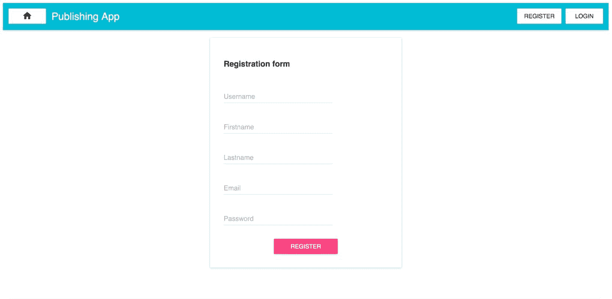
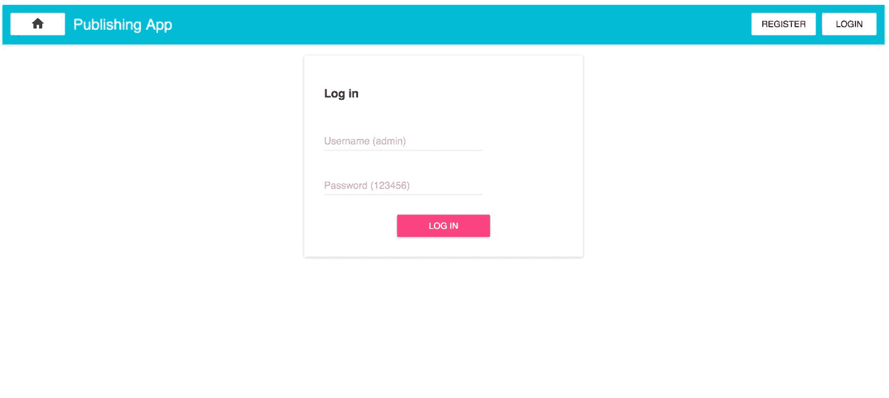
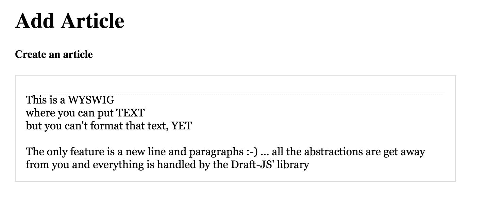
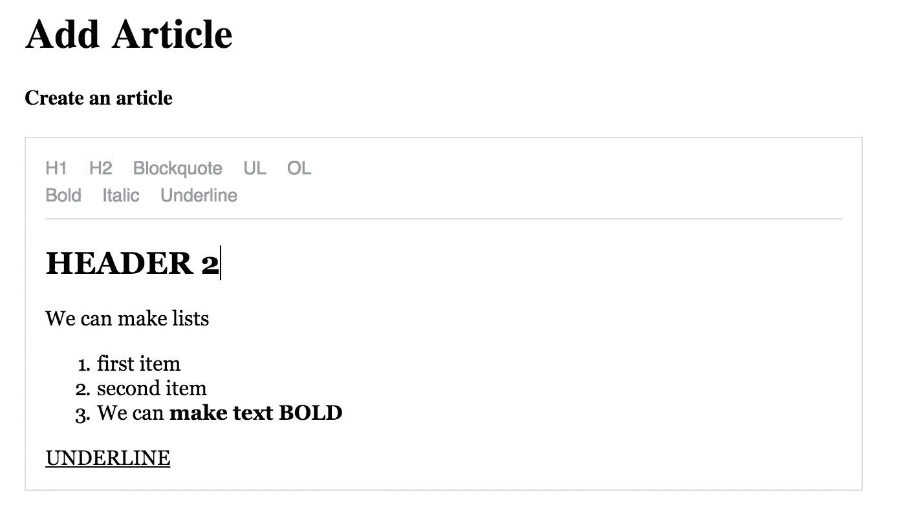
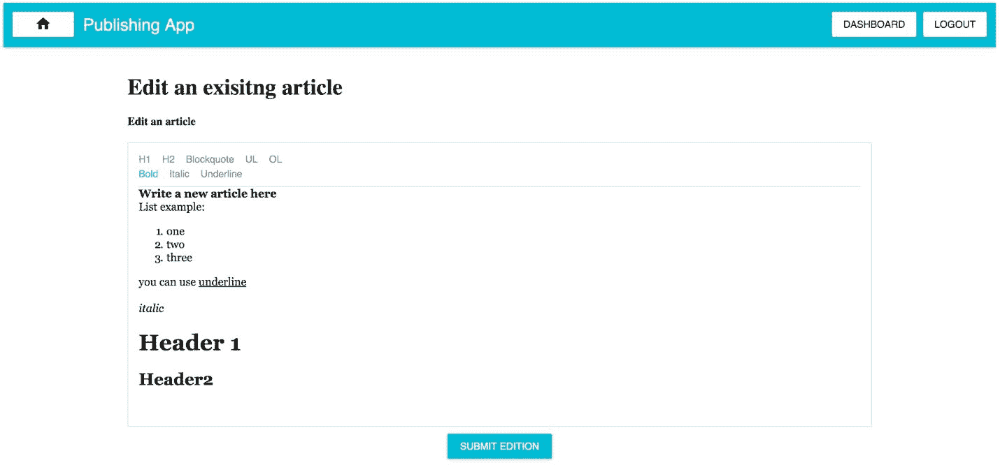

# 客户端的高级 Redux 和 Falcor

Redux 是我们应用程序的状态容器，它保存有关 React 视图层在浏览器中呈现方式的信息。另一方面，Falcor 不同于 Redux，因为它是一个完整的堆栈工具集，取代了过时的 API 端点数据通信方法。在接下来的几页中，我们将在客户端与 Falcor 合作，但您需要记住，Falcor 是一个完整的堆栈库。这意味着，我们需要在两侧使用它（在后端，我们使用一个名为 Falcor Router 的附加库）。从[第 5 章](5.html#45GEO0-7870c13caa1244daa9bd53ca5c1e1a42)*Falcor Advanced Concepts*开始，我们将使用全栈 Falcor。在本章中，我们将只关注客户端。

# 专注于应用程序的前端

目前，我们的应用程序是一个简单的入门工具包，这是其进一步开发的框架。我们需要更多地关注面向客户的前端，因为在当今时代，拥有一个好看的前端非常重要。多亏了 MaterialUI，我们可以重用许多东西，使我们的应用程序看起来更漂亮。

需要注意的是，响应式 web 设计目前（以及整体）不在本书的范围内，因此您需要了解如何改进移动设备的所有样式。我们将要开发的应用程序在平板电脑上看起来不错，但小型手机屏幕可能不太好看。

在本章中，我们将重点关注以下方面：

*   卸载`fetchServerSide.js`
*   添加一个新的`ArticleCard`组件，这将使我们的主页对我们的用户更加专业
*   改进应用程序的总体外观
*   实现注销功能
*   在`Draft.js`中添加所见即所得编辑器，这是 Facebook 团队创建的 React 富文本编辑器框架
*   在我们的 Redux 前端应用程序中添加创建新文章的功能

# 前端改进前的后端总结

在上一章中，我们执行了服务器端呈现，这将影响我们的用户，这样他们可以更快地看到他们的文章，并将改进我们网站的 SEO，因为整个 HTML 标记都在服务器端呈现。

要使我们的服务器端渲染 100%工作，最后一件事是取消服务器端文章获取`/server/fetchServerSide.js`的锁定。获取的新代码如下所示：

```jsx
import configMongoose from './configMongoose'; 
const Article = configMongoose.Article; 

export default () => { 
  return Article.find({}, function(err, articlesDocs) { 
    return articlesDocs; 
  }).then ((articlesArrayFromDB) => { 
    return articlesArrayFromDB; 
  }); 
}

```

正如您在前面的代码片段中所看到的，该函数返回一个带有`Article.find`的承诺（该`find`函数来自 Mongoose）。您还可以发现，我们正在返回从 MongoDB 获取的文章数组。

# 改进 handleServerSideRender

下一步是调整`handleServerSideRender`函数，该函数当前保存在`/server/server.js`文件中。当前函数如以下代码段所示：

```jsx
// te following code should already be in your codebase: 
let handleServerSideRender = (req, res, next) => { 

    let initMOCKstore = fetchServerSide(); // mocked for now 

    // Create a new Redux store instance 
    const store = createStore(rootReducer, initMOCKstore) 
    const location = hist.createLocation(req.path);

```

我们需要将其替换为此改进的：

```jsx
// this is an improved version: 
let handleServerSideRender = async (req, res, next) => { 
  try { 
    let articlesArray = await fetchServerSide(); 
    let initMOCKstore = { 
      article: articlesArray 
    } 

  // Create a new Redux store instance 
  const store = createStore(rootReducer, initMOCKstore) 
  const location = hist.createLocation(req.path);

```

我们改进的`handleServerSideRender`有什么新功能？如您所见，我们添加了`async await`。回想一下，它可以帮助我们通过异步调用（例如对数据库的查询（同步生成器样式的代码））减少代码的痛苦。这个 ES7 特性帮助我们编写异步调用，就像它们是同步调用一样——在引擎盖下，`async await`要复杂得多（在它被传输到 ES5 以便可以在任何现代浏览器中运行之后），但我们不会详细介绍`async await`是如何工作的，因为它不在本章的范围内。

# 在 Falcor 中更改路由（前端和后端）

您还需要将两个 ID 变量名更改为`_id`（`_id`是 Mongo 集合中文档 ID 的默认名称）。

在`server/routes.js`中查找此旧代码：

```jsx
route: 'articles[{integers}]["id","articleTitle","articleContent"]',

```

将其更改为以下内容：

```jsx
route: 'articles[{integers}]["_id","articleTitle","articleContent"]',

```

唯一的变化是我们将返回`_id`而不是`id`。我们需要获取`src/layouts/PublishingApp.js`中的`_id`值，因此找到以下代码片段：

```jsx
get(['articles', {from: 0, to: articlesLength-1}, ['id','articleTitle', 'articleContent']]).

```

使用`_id`将其更改为新的：

```jsx
get(['articles', {from: 0, to: articlesLength-1}, ['_id','articleTitle', 'articleContent']]).

```

# 我们的网站标题和文章列表需要改进

既然我们已经完成了服务器端渲染并从数据库中获取文章，那么让我们从前端开始。

首先，从`server/server.js`中删除以下标题；我们不再需要它了：

```jsx
<h1>Server side publishing app</h1>

```

您也可以在`src/layouts/PublishingApp.js`中删除此表头：

```jsx
<h1>Our publishing app</h1>

```

删除注册登录视图（`src/LoginView.js`中的`h1`标记：

```jsx
<h1>Login view</h1>

```

删除`src/RegisterView.js`中的注册：

```jsx
<h1>Register</h1>

```

所有这些`h1`线都不需要，因为我们希望有一个好看的设计，而不是过时的设计。

之后，进入`src/CoreLayout.js`从物料界面导入一个新的`AppBar`组件和两个按钮组件：

```jsx
import AppBar from 'material-ui/lib/app-bar'; 
import RaisedButton from 'material-ui/lib/raised-button'; 
import ActionHome from 'material-ui/lib/svg-icons/action/home';

```

将此`AppBar`与内联样式一起添加到`render`中：

```jsx
 render () { 
    const buttonStyle = { 
      margin: 5 
    }; 
    const homeIconStyle = { 
      margin: 5, 
      paddingTop: 5 
    }; 

    let menuLinksJSX = ( 
    <span> 
        <Link to='/register'> 
       <RaisedButton label='Register' style={buttonStyle}  /> 
     </Link>  
        <Link to='/login'> 
       <RaisedButton label='Login' style={buttonStyle}  /> 
     </Link>  
      </span>); 

    let homePageButtonJSX = ( 
     <Link to='/'> 
          <RaisedButton label={<ActionHome />} 
           style={homeIconStyle}  /> 
        </Link>); 

    return ( 
      <div> 
        <AppBar 
          title='Publishing App' 
          iconElementLeft={homePageButtonJSX} 
          iconElementRight={menuLinksJSX} /> 
          <br/> 
          {this.props.children} 
      </div> 
    ); 
  }

```

我们为`buttonStyle`和`homeIconStyle`添加了内联样式。`menuLinksJSX`和`homePageButtonJSX`的视觉输出将得到改善。以下是您的应用程序如何处理这些`AppBar`更改：


# 新的 ArticleCard 组件

为了改善我们主页的外观，下一步就是根据 CSS 的材质设计制作文章卡片。让我们先创建组件的文件：

```jsx
$ [[you are in the src/components/ directory of your project]]
$ touch ArticleCard.js

```

然后，在`ArticleCard.js`文件中，我们用以下内容初始化`ArticleCard`组件：

```jsx
import React from 'react'; 
import {  
  Card,  
  CardHeader,  
  CardMedia,  
  CardTitle,  
  CardText  
} from 'material-ui/lib/card'; 
import {Paper} from 'material-ui'; 

class ArticleCard extends React.Component { 
  constructor(props) { 
    super(props); 
  } 

  render() { 
    return <h1>here goes the article card</h1>; 
  } 
}; 
export default ArticleCard;

```

正如您在前面的代码中所看到的，我们已经从 MaterialUI/card 中导入了所需的组件，这将帮助我们主页的文章列表看起来更漂亮。下一步是对我们商品卡的`render`功能进行如下改进：

```jsx
render() { 
  let title = this.props.title || 'no title provided'; 
  let content = this.props.content || 'no content provided'; 

  const paperStyle = { 
    padding: 10,  
    width: '100%',  
    height: 300 
  }; 

  const leftDivStyle = { 
    width: '30%',  
    float: 'left' 
  }; 

  const rightDivStyle = { 
    width: '60%',  
    float: 'left',  
    padding: '10px 10px 10px 10px' 
  }; 

  return ( 
    <Paper style={paperStyle}> 
      <CardHeader 
        title={this.props.title} 
        subtitle='Subtitle' 
        avatar='/static/avatar.png' 
      /> 

      <div style={leftDivStyle}> 
        <Card > 
          <CardMedia 
            overlay={<CardTitle title={title} 
             subtitle='Overlay subtitle' />}> 
             
          </CardMedia> 
        </Card> 
      </div> 
      <div style={rightDivStyle}> 
        {content} 
      </div> 
    </Paper>); 
}

```

正如您在前面的代码中所看到的，我们已经创建了一个文章卡片，`Paper`组件和左右`div`都有一些内联样式。如果您愿意，可以随意更改样式。

通常，我们在前面的`render`函数中缺少两个静态图像，即`src= '/static/placeholder.png'`和`avatar='/static/avatar.png'`。让我们使用以下步骤添加它们：

1.  在`dist`目录下制作一个名为`placeholder.png`的 PNG 文件。在我的例子中，我的`placeholder.png`文件是这样的：


2.  同时在`dist`目录中创建一个`avatar.png`文件，该文件将在`/static/avatar.png`中公开。我这里不提供截图，因为里面有我的个人照片。

`express.js`中的`/static/`文件在`/server/server.js`文件中与`codeapp.use('/static', express.static('dist'));`一起公开（您已经在那里有了它，因为我们在上一章中已经添加了它）。

最后一件事是需要导入`ArticleCard`并将`layouts/PublishingApp.js`的渲染从旧的简单视图修改为新的简单视图。

将`import`添加到文件顶部：

```jsx
import ArticleCard from '../components/ArticleCard';

```

然后，使用此新渲染替换渲染：

```jsx
render () { 

  let articlesJSX = []; 
  for(let articleKey in this.props.article) { 
    const articleDetails = this.props.article[articleKey]; 

    const currentArticleJSX = ( 
      <div key={articleKey}> 
        <ArticleCard  
          title={articleDetails.articleTitle} 
          content={articleDetails.articleContent} /> 
      </div> 
    ); 

    articlesJSX.push(currentArticleJSX); 
  } 
  return ( 
    <div style={{height: '100%', width: '75%', margin: 'auto'}}> 
        {articlesJSX} 
    </div> 
  ); 
}

```

前面的新代码仅在新的`ArticleCard`组件中有所不同：

```jsx
<ArticleCard  
  title={articleDetails.articleTitle} 
  content={articleDetails.articleContent} />

```

我们还在`div style={{height: '100%', width: '75%', margin: 'auto'}}`中添加了一些样式。

在完全按照样式执行所有这些步骤后，您将看到：


这是注册用户视图：



这是登录用户视图：



# 仪表板-添加文章按钮、注销和标题改进

我们现在的计划是创建一个注销机制，让我们的标题知道用户是否登录，并根据该信息在标题中显示不同的按钮（用户未登录时登录/注册，用户登录时仪表板/注销）我们将在仪表板中创建一个添加文章按钮，并使用模拟的（我们稍后将取消对它的锁定）创建一个模拟视图。

**WYSIWYG** stands for **what you see is what you get**, of course.

所见即所得模型将位于`src/components/articles/WYSIWYGeditor.js`中，因此您需要使用以下命令在`components`中创建一个新的目录和文件：

```jsx
$ [[you are in the src/components/ directory of your project]]
$ mkdir articles
$ cd articles
$ touch WYSIWYGeditor.js

```

那么我们的`WYSIWYGeditor.js`模拟内容如下：

```jsx
import React from 'react'; 

class WYSIWYGeditor extends React.Component { 
  constructor(props) { 
    super(props); 
  } 

  render() { 
    return <h1>WYSIWYGeditor</h1>; 
  } 
}; 
export default WYSIWYGeditor;

```

下一步是在`src/views/LogoutView.js`处创建注销视图：

```jsx
$ [[you should be at src/views/ directory of your project]]
$ touch LogoutView.js

```

`src/views/LogoutView.js`文件内容如下：

```jsx
import React from 'react'; 
import {Paper} from 'material-ui'; 

class LogoutView extends React.Component { 
  constructor(props) { 
    super(props); 
  } 

  componentWillMount() { 
    if (typeof localStorage !== 'undefined' && localStorage.token) { 
      delete localStorage.token; 
      delete localStorage.username; 
      delete localStorage.role; 
    } 
  } 

  render () { 
    return ( 
      <div style={{width: 400, margin: 'auto'}}> 
        <Paper zDepth={3} style={{padding: 32, margin: 32}}> 
          Logout successful. 
        </Paper> 
      </div> 
    ); 
  } 
} 
export default LogoutView;

```

这里提到的`logout`视图是一个没有连接 Redux 功能的简单视图（与`LoginView.js`相比）。我们正在使用一些样式来使其美观，使用 MaterialUI 中的`Paper`组件。

当用户登陆注销页面时，`componentWillMount`功能从`localStorage`信息中删除。如您所见，它还检查`**if(typeof localStorage !== 'undefined' && localStorage.token) **`是否有`localStorage`，因为您可以想象，当您执行服务器端渲染时，`localStorage`是未定义的（服务器端不像客户端那样有`localStorage`和`window`。

# 创建前端添加文章功能之前的重要注意事项

我们已经到了你需要从你的文章集中删除所有文档的地步，或者你可能会在执行下一步时遇到一些麻烦，因为我们将要使用一个 js 库草稿和一些其他东西，这些东西需要在后端使用一个新的模式。我们将在下一章中创建该后端的模式，因为本章将重点介绍前端。

立即删除 MongoDB 文章集合中的所有文档，但保持用户集合不变（不要从数据库中删除用户）。

# AddArticleView 组件

在创建了`LogoutView`和`WYSIWYGeditor`组件之后，让我们创建流程中最后缺少的组件：`src/views/articles/AddArticleView.js`文件。现在让我们创建一个目录和文件：

```jsx
$ [[you are in the src/views/ directory of your project]]
$ mkdir articles
$ cd articles
$ touch AddArticleView.js

```

因此，您的`views/articles`目录中将包含该文件。我们需要将内容放入其中：

```jsx
import React from 'react'; 
import {connect} from 'react-redux'; 
import WYSIWYGeditor from '../../components/articles/WYSIWYGeditor.js'; 

const mapStateToProps = (state) => ({ 
  ...state 
}); 

const mapDispatchToProps = (dispatch) => ({ 

}); 

class AddArticleView extends React.Component { 
  constructor(props) { 
    super(props); 
  } 

  render () { 
    return ( 
      <div style={{height: '100%', width: '75%', margin: 'auto'}}> 
        <h1>Add Article</h1> 
        <WYSIWYGeditor /> 
      </div> 
    ); 
  } 
} 
export default connect(mapStateToProps, mapDispatchToProps)(AddArticleView);

```

正如您在这里看到的，这是一个简单的 React 视图，它导入了我们刚才创建的`WYSIWYGeditor`组件（`import WYSIWYGeditor from '../../components/articles/WYSIWYGeditor.js'`。我们有一些内联样式，以使视图更适合我们的用户。

让我们通过修改位于`**src/routes/index.js*`位置的`routes`文件，为注销和添加文章功能创建两个新路由：

```jsx
import React from 'react'; 
import {Route, IndexRoute} from 'react-router'; 
import CoreLayout from '../layouts/CoreLayout'; 
import PublishingApp from '../layouts/PublishingApp'; 
import LoginView from '../views/LoginView'; 
import LogoutView from '../views/LogoutView'; 
import RegisterView from '../views/RegisterView'; 
import DashboardView from '../views/DashboardView'; 
import AddArticleView from '../views/articles/AddArticleView'; 

export default ( 
  <Route component={CoreLayout} path='/'> 
    <IndexRoute component={PublishingApp} name='home' /> 
    <Route component={LoginView} path='login' name='login' /> 
    <Route component={LogoutView} path='logout' name='logout' /> 
    <Route component={RegisterView} path='register' 
       name='register' /> 
    <Route component={DashboardView} path='dashboard' 
       name='dashboard' /> 
    <Route component={AddArticleView} path='add-article' 
       name='add-article' /> 
  </Route> 
);

```

如`src/routes/index.js`文件所述，我们增加了两条路线：

*   `<Route component={LogoutView} path='logout' name='logout' />`
*   `<Route component={AddArticleView} path='add-article' name='add-article' />`

不要忘记导入这两个视图的组件，包括以下内容：

```jsx
import LogoutView from '../views/LogoutView'; 
import AddArticleView from '../views/articles/AddArticleView';

```

现在，我们已经创建了视图并创建了进入该视图的路线。最后一点是在我们的应用程序中显示这两条路线的链接。

首先，让我们创建`src/layouts/CoreLayout.js`组件，使其具有登录/注销类型 login，以便登录用户将看到与未登录用户不同的按钮。将`CoreLayout`组件中的`render`功能修改为：

```jsx
  render () { 
    const buttonStyle = { 
      margin: 5 
    }; 
    const homeIconStyle = { 
      margin: 5, 
      paddingTop: 5 
    }; 

    let menuLinksJSX; 
    let userIsLoggedIn = typeof localStorage !== 'undefined' &&  
     localStorage.token && this.props.routes[1].name !== 'logout'; 

    if (userIsLoggedIn) { 
      menuLinksJSX = ( 
     <span> 
          <Link to='/dashboard'> 
      <RaisedButton label='Dashboard' style={buttonStyle}  /> 
    </Link>  
          <Link to='/logout'> 
      <RaisedButton label='Logout' style={buttonStyle}  /> 
    </Link>  
      </span>); 
    } else { 
      menuLinksJSX = ( 
     <span> 
         <Link to='/register'> 
      <RaisedButton label='Register' style={buttonStyle}  /> 
    </Link>  
           <Link to='/login'> 
       <RaisedButton label='Login' style={buttonStyle}  /> 
     </Link>  
       </span>); 
    } 

    let homePageButtonJSX = ( 
      <Link to='/'> 
        <RaisedButton label={<ActionHome />} style={homeIconStyle}  
         /> 
      </Link>); 

    return ( 
      <div> 
        <AppBar 
          title='Publishing App' 
          iconElementLeft={homePageButtonJSX} 
          iconElementRight={menuLinksJSX} /> 
          <br/> 
          {this.props.children} 
      </div> 
    ); 
  }

```

您可以看到前面代码中的新部分如下所示：

```jsx
  let menuLinksJSX; 
  let userIsLoggedIn = typeof localStorage !== 
  'undefined' && localStorage.token && this.props.routes[1].name 
   !== 'logout'; 

  if (userIsLoggedIn) { 
    menuLinksJSX = ( 
  <span> 
        <Link to='/dashboard'> 
    <RaisedButton label='Dashboard' style={buttonStyle}  /> 
  </Link>  
        <Link to='/logout'> 
    <RaisedButton label='Logout'style={buttonStyle}  /> 
  </Link>  
      </span>); 
  } else { 
    menuLinksJSX = ( 
  <span> 
        <Link to='/register'> 
    <RaisedButton label='Register' style={buttonStyle}  /> 
  </Link>  
        <Link to='/login'> 
    <RaisedButton label='Login' style={buttonStyle}  /> 
  </Link>  
      </span>); 
  }

```

我们添加了`let userIsLoggedIn = typeof localStorage !== 'undefined' && localStorage.token && this.props.routes[1].name !== 'logout';`。如果我们不在服务器端，`userIsLoggedIn`变量就会被找到（那么它就没有前面提到的`localStorage`。然后，它检查`localStorage.token`是否为`yes`，还检查用户是否没有使用`this.props.routes[1].name !== 'logout'`表达式单击注销按钮。`this.props.routes[1].name`值/信息由`redux-simple-router`和`react-router`提供。这始终是客户端上当前路由的名称，因此我们可以根据该信息呈现适当的按钮。

# 修改仪表板视图

您会发现，我们已经添加了`if (userIsLoggedIn)`语句，新的部分是仪表板和注销`RaisedButton`实体，它们具有指向正确路由的链接。

本阶段要完成的最后一件事是修改`src/views/DashboardView.js`组件。使用从 react 路由器导入的`{Link}`组件将链接添加到`/add-article`路由。此外，我们还需要导入新的材质 UI 组件，以使`DashboardView`更好：

```jsx
import {Link} from 'react-router'; 
import List from 'material-ui/lib/lists/list'; 
import ListItem from 'material-ui/lib/lists/list-item'; 
import Avatar from 'material-ui/lib/avatar'; 
import ActionInfo from 'material-ui/lib/svg-icons/action/info'; 
import FileFolder from 'material-ui/lib/svg-icons/file/folder'; 
import RaisedButton from 'material-ui/lib/raised-button'; 
import Divider from 'material-ui/lib/divider';

```

在您将所有这些导入您的`src/views/DashboardView.js`文件后，我们需要开始改进`render`功能：

```jsx
render () { 

    let articlesJSX = []; 
    for(let articleKey in this.props.article) { 
      const articleDetails = this.props.article[articleKey]; 
      const currentArticleJSX = ( 
        <ListItem 
          key={articleKey} 
          leftAvatar={} 
          primaryText={articleDetails.articleTitle} 
          secondaryText={articleDetails.articleContent} 
        /> 
      ); 

      articlesJSX.push(currentArticleJSX); 
    } 
    return ( 
      <div style={{height: '100%', width: '75%', margin: 'auto'}}> 
        <Link to='/add-article'> 
          <RaisedButton  
            label='Create an article'  
            secondary={true}  
            style={{margin: '20px 20px 20px 20px'}} /> 
        </Link> 

        <List> 
          {articlesJSX} 
        </List> 
      </div> 
    ); 
  }

```

这里，我们为`DashboardView`提供了新的`render`函数。我们正在使用`ListItem`组件制作我们的精美列表。我们还为`/add-article`路线添加了链接和按钮。有一些内联样式，但是您可以自己设计这个应用程序。

让我们看几个屏幕截图，显示在添加了具有新文章视图的“创建文章”按钮后，应用程序在所有这些更改后的外观：


在`/add-article`视图上模拟所见即所得之后：


我们的新注销视图页面将如下所示：


# 开始我们所见即所得的工作

让我们安装一个 js 库草稿，这是“一个在 React 中构建富文本编辑器的框架，由一个不变的模型提供支持，并对跨浏览器差异进行抽象”，正如他们在网站上所说的那样。

一般来说，draft js 是由 Facebook 的朋友制作的，它可以帮助我们制作强大的 WYSIWYG 工具。它将在我们的发布应用程序中很有用，因为我们希望为我们的编辑提供好的工具，以便在我们的平台上创建有趣的文章。

让我们先安装它：

```jsx
npm i --save draft-js@0.5.0

```

我们将在书中使用 js 草稿的 0.5.0 版本。在开始编码之前，让我们再安装一个依赖项，它将有助于以后通过 Falcor 从 DB 获取文章。执行以下命令：

```jsx
npm i --save falcor-json-graph@1.1.7

```

通常，`falcor-json-graph@1.1.7`语法使我们能够使用通过 Falcor helper 库提供的不同 Sentinel（将在下一章详细介绍）。

# js WYSIWYG 草案的样式表

为了设计草稿 js 编辑器，我们需要在位于`dist/styles-draft-js.css`的`dist`文件夹中创建一个新的 CSS 文件。这是唯一一个放置 CSS 样式表的地方：

```jsx
.RichEditor-root { 
  background: #fff; 
  border: 1px solid #ddd; 
  font-family: 'Georgia', serif; 
  font-size: 14px; 
  padding: 15px; 
} 

.RichEditor-editor { 
  border-top: 1px solid #ddd; 
  cursor: text; 
  font-size: 16px; 
  margin-top: 10px; 
  min-height: 100px; 
} 

.RichEditor-editor .RichEditor-blockquote { 
  border-left: 5px solid #eee; 
  color: #666; 
  font-family: 'Hoefler Text', 'Georgia', serif; 
  font-style: italic; 
  margin: 16px 0; 
  padding: 10px 20px; 
} 

.RichEditor-controls { 
  font-family: 'Helvetica', sans-serif; 
  font-size: 14px; 
  margin-bottom: 5px; 
  user-select: none; 
} 

.RichEditor-styleButton { 
  color: #999; 
  cursor: pointer; 
  margin-right: 16px; 
  padding: 2px 0; 
} 

.RichEditor-activeButton { 
  color: #5890ff; 
}

```

当您在`dist/styles-draft-js.css`创建此文件后，我们需要将其导入`server/server.js`，我们已经在这里创建了 HTML 头，因此`server.js`文件中已经存在以下代码：

```jsx
let renderFullPage = (html, initialState) => 
{ 
  return &grave; 
    <!doctype html> 
    <html> 
      <head> 
        <title>Publishing App Server Side Rendering</title> 
        <link rel="stylesheet" type="text/css" 
         href="/static/styles-draft-js.css" /> 
      </head> 
      <body> 
        <div id="publishingAppRoot">${html}</div> 
        <script> 
          window.__INITIAL_STATE__ = 
           ${JSON.stringify(initialState)} 
        </script> 
        <script src="/static/app.js"></script> 
      </body> 
    </html> 
    &grave; 
};

```

然后，您需要在样式表中包含以下链接：

```jsx
<link rel="stylesheet" type="text/css" href="/static/styles-draft- 
 js.css" />

```

到目前为止还没什么特别的。在我们完成了富文本所见即所得编辑器的样式之后，让我们玩一玩。

# 编写 js 框架草案

让我们回到`src/components/articles/WYSIWYGeditor.js`文件。它目前被嘲笑，但我们现在将改进它。

为了让你们知道，我们现在就做一个所见即所得的框架。我们将在本书后面部分对其进行改进。在这一点上，WYSIWYG 将没有任何功能，例如使文本加粗或使用 OL 和 UL 元素创建列表。

```jsx
import React from 'react'; 
import { 
  Editor,  
  EditorState,  
  ContentState,  
  RichUtils,  
  convertToRaw, 
  convertFromRaw 
} from 'draft-js'; 

export default class   WYSIWYGeditor extends React.Component { 
  constructor(props) { 
    super(props); 

    let initialEditorFromProps = 
     EditorState.createWithContent 
     (ContentState.createFromText('')); 

    this.state = { 
      editorState: initialEditorFromProps 
    }; 

    this.onChange = (editorState) => {  
      var contentState = editorState.getCurrentContent(); 

      let contentJSON = convertToRaw(contentState); 
      props.onChangeTextJSON(contentJSON, contentState); 
      this.setState({editorState})  
    }; 
  } 

  render() { 
    return <h1>WYSIWYGeditor</h1>; 
  } 
}

```

在这里，我们只创建了新的 js 草稿文件的 WYSIWYG 的构造函数。`let initialEditorFromProps = EditorState.createWithContent(ContentState.createFromText(''));`表达式只是创建一个空的 WYSIWYG 容器。稍后，我们将对其进行改进，以便在编辑所见即所得时能够从数据库接收`ContentState`。

`editorState: initialEditorFromProps`是我们目前的状态。我们的`**this.onChange = (editorState) => { **`行在每次更改时都会启动，因此`src/views/articles/AddArticleView.js`处的视图组件将知道所见即所得的任何更改。

无论如何，您可以在[查看 js 草案的文档 https://facebook.github.io/draft-js/](https://facebook.github.io/draft-js/) 。

这仅仅是开始；下一步是在`onChange`下增加两个新功能：

```jsx
this.focus = () => this.refs['refWYSIWYGeditor'].focus(); 
this.handleKeyCommand = (command) => this._handleKeyCommand(command);

```

并在我们的`WYSIWYGeditor`类中添加一个新函数：

```jsx
_handleKeyCommand(command) { 
   const {editorState} = this.state; 
   const newState = RichUtils.handleKeyCommand(editorState, 
    command); 

   if (newState) { 
     this.onChange(newState); 
     return true; 
   } 
   return false; 
 }

```

在所有这些更改之后，您构建的`WYSIWYGeditor`类应该是这样的：

```jsx
export default class   WYSIWYGeditor extends React.Component { 
  constructor(props) { 
    super(props); 

    let initialEditorFromProps = 
     EditorState.createWithContent 
     (ContentState.createFromText('')); 

    this.state = { 
      editorState: initialEditorFromProps 
    }; 

    this.onChange = (editorState) => {  
      var contentState = editorState.getCurrentContent(); 

      let contentJSON = convertToRaw(contentState); 
      props.onChangeTextJSON(contentJSON, contentState); 
      this.setState({editorState}); 
    }; 

    this.focus = () => this.refs['refWYSIWYGeditor'].focus(); 
    this.handleKeyCommand = (command) => 
     this._handleKeyCommand(command); 
  }

```

本课程的其他内容如下：

```jsx
  _handleKeyCommand(command) { 
    const {editorState} = this.state; 
    const newState = RichUtils.handleKeyCommand(editorState, 
     command); 

    if (newState) { 
      this.onChange(newState); 
      return true; 
    } 
    return false; 
  } 

  render() { 
    return <h1> WYSIWYGeditor</h1>; 
  } 
}

```

下一步是用以下代码改进`render`功能：

```jsx
 render() { 
    const { editorState } = this.state; 
    let className = 'RichEditor-editor'; 
    var contentState = editorState.getCurrentContent(); 

    return ( 
      <div> 
        <h4>{this.props.title}</h4> 
        <div className='RichEditor-root'> 
          <div className={className} onClick={this.focus}> 
            <Editor 
              editorState={editorState} 
              handleKeyCommand={this.handleKeyCommand} 
              onChange={this.onChange} 
              ref='refWYSIWYGeditor' /> 
          </div> 
        </div> 
      </div> 
    ); 
  }

```

在这里，我们所做的只是简单地使用 JSAPI 草稿来制作一个简单的富编辑器；稍后，我们将使其更具功能性，但现在，让我们关注一些简单的内容。

# 改进 views/articles/AddArticleView 组件

在我们继续添加所有所见即所得特性（如加粗）之前，我们需要用一些东西改进`views/articles/AddArticleView.js`组件。安装一个库，将草稿 js 状态转换为纯 HTML，如下所示：

```jsx
npm i --save draft-js-export-html@0.1.13

```

我们将使用这个库为普通读者保存只读的纯 HTML。接下来，将其导入`src/views/articles/AddArticleView.js`：

```jsx
import { stateToHTML } from 'draft-js-export-html';

```

通过更改构造函数并添加名为`_onDraftJSChange`的新函数来改进`AddArticleView`：

```jsx
class AddArticleView extends React.Component { 
  constructor(props) { 
    super(props); 
    this._onDraftJSChange = this._onDraftJSChange.bind(this); 

    this.state = { 
      contentJSON: {}, 
      htmlContent: '' 
    }; 
  } 

  _onDraftJSChange(contentJSON, contentState) { 
    let htmlContent = stateToHTML(contentState); 
    this.setState({contentJSON, htmlContent}); 
  }

```

我们需要在每次更改时保存一个状态`this.setState({contentJSON, htmlContent});`。这是因为`contentJSON`将被保存到数据库中，以便获得关于我们所见即所得的不变信息，`htmlContent`将成为我们读者的服务器。`htmlContent`和`contentJSON`变量都将保留在文章集合中。`AddArticleView`类中的最后一件事是将`render`修改为新代码，如下所示：

```jsx
render () { 
   return ( 
     <div style={{height: '100%', width: '75%', margin: 'auto'}}> 
       <h1>Add Article</h1> 
       <WYSIWYGeditor 
         initialValue='' 
         title='Create an article' 
         onChangeTextJSON={this._onDraftJSChange} /> 
     </div> 
   ); 
 }

```

在所有这些更改之后，您将看到以下新视图：



# 向 WYSIWYG 添加更多格式功能

让我们开始使用所见即所得的第二个版本，并提供更多选项，如下例所示：



按照这里提到的步骤进行操作后，您将能够按如下方式格式化文本并从中提取 HTML 标记，这样我们就可以在 MongoDB 文章集合中保存 WYSIWYG 的 JSON 状态和纯 HTML。

在以下名为`WYSIWYGbuttons.js`的新文件中，我们将导出两个不同的类，并使用以下方法将它们导入`components/articles/WYSWIWYGeditor.js`：

```jsx
// don't write it, this is only an example:
import { BlockStyleControls, InlineStyleControls } from 
 './wysiwyg/WYSIWY
    Gbuttons';

```

通常，该新文件将包含三个不同的 React 组件，如下所示：

*   `StyleButton`：这将是一个通用样式按钮，将在`BlockStyleControls`和`InlineStyleControls`中使用。不要因为在`WYSIWYGbuttons`文件中首先创建`StyleButton`React 组件而感到困惑。
*   `BlockStyleControls`：导出组件，用于`H1`、`H2`、`Blockquote`、`UL`、`OL`等区块控制。
*   `InlineStyleControls`：此组件用于粗体、斜体和下划线。

现在我们知道，在新文件中，您将创建三个独立的 React 组件。

首先，我们需要在`src/components/articles/wysiwyg/WYSIWYGbuttons.js`位置创建 WYSWIG 按钮：

```jsx
$ [[you are in the src/components/articles directory of your project]]
$ mkdir wysiwyg
$ cd wysiwyg
$ touch  WYSIWYGbuttons.js

```

此文件的内容将是按钮组件：

```jsx
import React from 'react'; 

class StyleButton extends React.Component { 
  constructor() { 
    super(); 
    this.onToggle = (e) => { 
      e.preventDefault(); 
      this.props.onToggle(this.props.style); 
    }; 
  } 

  render() { 
    let className = 'RichEditor-styleButton'; 
    if (this.props.active) { 
      className += ' RichEditor-activeButton'; 
    } 

    return ( 
      <span className={className} onMouseDown={this.onToggle}> 
        {this.props.label} 
      </span> 
    ); 
  } 
}

```

前面的代码为我们提供了一个可重复使用的按钮，在`this.props.label`处有一个特定的标签。如前所述，不要与`WYSIWYGbuttons`混淆；它是一个通用按钮组件，将在内联和块类型按钮控件中重用。

接下来，在该组件下，可以放置以下对象：

```jsx
const BLOCK_TYPES = [ 
  {label: 'H1', style: 'header-one'}, 
  {label: 'H2', style: 'header-two'}, 
  {label: 'Blockquote', style: 'blockquote'}, 
  {label: 'UL', style: 'unordered-list-item'}, 
  {label: 'OL', style: 'ordered-list-item'} 
];

```

这个对象是块类型，我们可以在 js WYSIWYG 草稿中创建它。它用于以下组件中：

```jsx
export const BlockStyleControls = (props) => { 
  const {editorState} = props; 
  const selection = editorState.getSelection(); 
  const blockType = editorState 
    .getCurrentContent() 
    .getBlockForKey(selection.getStartKey()) 
    .getType(); 

  return ( 
    <div className='RichEditor-controls'> 
      {BLOCK_TYPES.map((type) => 
        <StyleButton 
          key={type.label} 
          active={type.style === blockType} 
          label={type.label} 
          onToggle={props.onToggle} 
          style={type.style} 
        /> 
      )} 
    </div> 
  ); 
};

```

前面的代码是用于块样式格式化的一整套按钮。我们将在一段时间内将其导入`WYSIWYGeditor`。如您所见，我们正在使用`export const BlockStyleControls = (props) => {`进行出口。

将下一个对象放在`BlockStyleControls`组件下，但这次，对于`Bold`之类的内联样式：

```jsx
var INLINE_STYLES = [ 
  {label: 'Bold', style: 'BOLD'}, 
  {label: 'Italic', style: 'ITALIC'}, 
  {label: 'Underline', style: 'UNDERLINE'} 
];

```

正如您所见，在我们的 WYSIWYG 中，编辑器将能够使用粗体、斜体和下划线。

您可以将这些内联样式的最后一个组件放在“所有这些”下面：

```jsx
export const InlineStyleControls = (props) => { 
  var currentStyle = props.editorState.getCurrentInlineStyle(); 
  return ( 
    <div className='RichEditor-controls'> 
      {INLINE_STYLES.map(type => 
        <StyleButton 
          key={type.label} 
          active={currentStyle.has(type.style)} 
          label={type.label} 
          onToggle={props.onToggle} 
          style={type.style} 
        /> 
      )} 
    </div> 
  ); 
};

```

正如你所看到的，这很简单。我们每次都映射块中定义的样式和内联样式，并基于每次迭代创建`StyleButton`。

下一步是在我们的`WYSIWYGeditor`组件（`src/components/articles/WYSIWYGeditor.js`中同时导入`InlineStyleControls`和`BlockStyleControls`：

```jsx
import { BlockStyleControls, InlineStyleControls } from './wysiwyg/WYSIWYGbuttons';

```

然后，在`WYSIWYGeditor`构造函数中，包含以下代码：

```jsx
this.toggleInlineStyle = (style) => 
this._toggleInlineStyle(style); 
this.toggleBlockType = (type) => this._toggleBlockType(type);

```

绑定到`toggleInlineStyle`和`toggleBlockType`两个箭头函数，当有人选择切换以在`WYSIWYGeditor`中使用内联或块类型时，这将是回调（我们稍后将创建这些函数）。

创建以下两个新功能：

```jsx

      RichUtils.toggleBlockType( 
        this.state.editorState, 
        blockType 
      ) 
    ); 
  } 

  _toggleInlineStyle(inlineStyle) { 
    this.onChange( 
      RichUtils.toggleInlineStyle( 
        this.state.editorState, 
        inlineStyle 
      ) 
    ); 
  }

```

在这里，这两个函数都使用了草稿 js`RichUtils`，以便在所见即所得（WYSIWYG）中设置标志。我们正在使用我们在`'./wysiwg/WYSIWGbuttons';`的`import { BlockStyleControls, InlineStyleControls }`中定义的`BLOCK_TYPES`和`INLINE_STYLES`中的某些格式选项。

在我们完成`WYSIWYGeditor`结构和`_toggleBlockType`和`_toggleInlineStyle`功能的改进后，我们可以开始改进`render`功能：

```jsx
 render() { 
    const { editorState } = this.state; 
    let className = 'RichEditor-editor'; 
    var contentState = editorState.getCurrentContent(); 

    return ( 
      <div> 
        <h4>{this.props.title}</h4> 
        <div className='RichEditor-root'> 
          <BlockStyleControls 
            editorState={editorState} 
            onToggle={this.toggleBlockType} /> 

          <InlineStyleControls 
            editorState={editorState} 
            onToggle={this.toggleInlineStyle} /> 

          <div className={className} onClick={this.focus}> 
            <Editor 
              editorState={editorState} 
              handleKeyCommand={this.handleKeyCommand} 
              onChange={this.onChange} 
              ref='refWYSIWYGeditor' /> 
          </div> 
        </div> 
      </div> 
    ); 
  }

```

您可能会注意到，在前面的代码中，我们只添加了`BlockStyleControls`和`InlineStyleControls`组件。还请注意，我们正在使用带有`onToggle={this.toggleBlockType}`和`onToggle={this.toggleInlineStyle}`的回调；这是为了在我们的`WYSIWYGbuttons`和 js 草案`RichUtils`之间沟通用户点击了什么以及他们当前使用的模式（如粗体、header1 和 UL 或 OL）。

# 将新物品推入物品还原器

我们需要在`src/actions/article.js`位置创建一个名为`pushNewArticle`的新动作：

```jsx
export default { 
  articlesList: (response) => { 
    return { 
      type: 'ARTICLES_LIST_ADD', 
      payload: { response: response } 
    } 
  }, 
  pushNewArticle: (response) => { 
    return { 
      type: 'PUSH_NEW_ARTICLE', 
      payload: { response: response } 
    } 
  } 
}

```

下一步是通过改进`src/components/ArticleCard.js`组件中的`render`功能来改进`src/components/ArticleCard.js`组件：

```jsx
return ( 
   <Paper style={paperStyle}> 
     <CardHeader 
       title={this.props.title} 
       subtitle='Subtitle' 
       avatar='/static/avatar.png' 
     /> 

     <div style={leftDivStyle}> 
       <Card > 
         <CardMedia 
           overlay={<CardTitle title={title} subtitle='Overlay 
            subtitle' />}> 
            
         </CardMedia> 
       </Card> 
     </div> 
     <div style={rightDivStyle}> 
       <div dangerouslySetInnerHTML={{__html: content}} /> 
     </div> 
   </Paper>); 
}

```

在这里，我们将旧的`{content}`变量（在内容的变量中接收纯文本值）替换为一个新变量，该变量在文章卡片中使用`dangerouslySetInnerHTML`显示所有 HTML：

```jsx
<div dangerouslySetInnerHTML={{__html: content}} />

```

这将帮助我们向读者展示所见即所得生成的 HTML 代码。

# 用于改进我们的还原程序的 MapHelpers

通常，当对象发生更改时，所有还原符*都必须*返回对该对象的新引用。在第一个示例中，我们使用了`Object.assign`：

```jsx
// this already exsits in your codebasecase 'ARTICLES_LIST_ADD': 
let articlesList = action.payload.response; 
return Object.assign({}, articlesList);

```

我们将用一种新的方法取代这种`Object.assign`方法，并使用 ES6 的地图：

```jsx
case 'ARTICLES_LIST_ADD': 
  let articlesList = action.payload.response; 
  return mapHelpers.addMultipleItems(state, articlesList);

```

在前面的代码中，您可以找到一个带有`mapHelpers.addMultipleItems(state, articlesList)`的新`ARTICLES_LIST_ADD`。

为了制作地图助手，我们需要创建一个名为`utils`的新目录和一个名为`mapHelpers.js(src/utils/mapHelpers.js)`的文件：

```jsx
$ [[you are in the src/ directory of your project]]
$ mkdir utils
$ cd utils
$ touch mapHelpers.js

```

然后，您可以将第一个函数输入到该`src/utils/mapHelpers.js`文件中：

```jsx
const duplicate = (map) => { 
  const newMap = new Map(); 
  map.forEach((item, key) => { 
    if (item['_id']) { 
      newMap.set(item['_id'], item); 
    } 
  }); 
  return newMap; 
}; 

const addMultipleItems = (map, items) => { 
  const newMap = duplicate(map); 

  Object.keys(items).map((itemIndex) => { 
    let item = items[itemIndex]; 
    if (item['_id']) { 
      newMap.set(item['_id'], item); 
    } 
  }); 

  return newMap; 
};

```

复制只是在内存中创建一个新引用，以便使我们的不变性成为 Redux 应用程序中的一个要求。我们还正在使用`if(key === item['_id'])`检查是否存在密钥与我们的对象 ID 不同的边缘情况`_id`中的`_`是故意的，因为这是 Mongoose 如何从我们的 DB 标记 ID。`addMultipleItems`函数将项目添加到新的重复映射中（例如，在成功获取文章之后）。

我们需要的下一个代码更改位于同一文件中的`src/utils/mapHelpers.js`：

```jsx
const addItem = (map, newKey, newItem) => { 
  const newMap = duplicate(map); 
  newMap.set(newKey, newItem); 
  return newMap; 
}; 

const deleteItem = (map, key) => { 
  const newMap = duplicate(map); 
  newMap.delete(key); 

  return newMap; 
}; 

export default { 
  addItem, 
  deleteItem, 
  addMultipleItems 
};

```

如您所见，我们为单个项目添加了一个`add`函数和`delete`函数。之后，我们从`src/utils/mapHelpers.js`出口所有这些。

下一步是我们需要改进`src/reducers/article.js`减速器，以便在其中使用 map 实用程序：

```jsx
import mapHelpers from '../utils/mapHelpers'; 

const article = (state = {}, action) => { 
  switch (action.type) { 
    case 'ARTICLES_LIST_ADD': 
      let articlesList = action.payload.response; 
      return mapHelpers.addMultipleItems(state, articlesList); 
    case 'PUSH_NEW_ARTICLE': 
      let newArticleObject = action.payload.response; 
      return mapHelpers.addItem(state, newArticleObject['_id'], 
       newArticleObject); 
    default: 
      return state; 
  } 
} 
export default article

```

`src/reducers/article.js`文件中有什么新内容？如您所见，我们改进了`ARTICLES_LIST_ADD`（已经讨论过）。我们增加了一个新的`PUSH_NEW_ARTICLE`；案例这将把一个新对象推送到我们的 reducer 的状态树中。这类似于将一个项目推送到一个数组中，但是我们使用了我们的缩减器和映射。

# 核心布局改进

因为我们在前端切换到 ES6 的映射，所以我们还需要确保在接收到具有服务器端渲染的对象后，它也是一个映射（而不是普通的 JS 对象）。请查看以下代码：

```jsx
// The following is old codebase: 
import React from 'react'; 
import { Link } from 'react-router'; 
import themeDecorator from 'material-ui/lib/styles/theme- 
 decorator'; 
import getMuiTheme from 'material-ui/lib/styles/getMuiTheme'; 
import RaisedButton from 'material-ui/lib/raised-button'; 
import AppBar from 'material-ui/lib/app-bar'; 
import ActionHome from 'material-ui/lib/svg-icons/action/home';

```

在下面的新代码段中，您可以找到`CoreLayout`组件中需要的所有导入：

```jsx
import React from 'react'; 
import {Link} from 'react-router'; 
import themeDecorator from 'material-ui/lib/styles/theme- 
 decorator'; 
import getMuiTheme from 'material-ui/lib/styles/getMuiTheme'; 
import RaisedButton from 'material-ui/lib/raised-button'; 
import AppBar from 'material-ui/lib/app-bar'; 
import ActionHome from 'material-ui/lib/svg-icons/action/home'; 
import {connect} from 'react-redux'; 
import {bindActionCreators} from 'redux'; 
import articleActions from '../actions/article.js'; 

const mapStateToProps = (state) => ({ 
  ...state 
}); 

const mapDispatchToProps = (dispatch) => ({ 
  articleActions: bindActionCreators(articleActions, dispatch) 
});

```

在`CoreLayout`组件上方，我们添加了 Redux 工具，因此我们将有一个状态树和`CoreLayout`组件中可用的操作。

另外，在`CoreLayout`组件中，添加`componentWillMount`功能：

```jsx
  componentWillMount() { 
    if (typeof window !== 'undefined' && !this.props.article.get) 
     { 
      this.props.articleActions.articlesList(this.props.article); 
    } 
  }

```

此函数负责检查项目的属性是否为 ES6 映射。如果没有，那么我们向`articlesList`发送一个动作，完成任务，然后在`this.props.article`中绘制地图。

最后一件事是改进`CoreLayout`组件中的`export`：

```jsx
const muiCoreLayout = themeDecorator(getMuiTheme(null, { 
 userAgent: 'all' }))(CoreLayout); 
 export default connect(mapStateToProps, 
 mapDispatchToProps)(muiCoreLayout);

```

前面的代码帮助我们连接到 Redux 单状态树及其允许的操作。

# 为什么映射到 JS 对象上？

一般来说，ES6 地图具有一些便于数据操作的功能，如`.get`和`.set`等功能，这使得编程更加愉快。它还有助于拥有一个更简单的代码，以便能够按照 Redux 的要求保持我们的不变性。

Map 方法比`slice/c-oncat/Object.assign`更易于使用。我确信每种方法都有一些优缺点，但在我们的应用程序中，我们将使用 ES6 地图方式，以便在完全设置后让事情变得更简单。

# 改进发布应用程序和仪表板视图

在`src/layouts/PublishingApp.js`文件中，我们需要改进我们的`render`功能：

```jsx
render () { 

  let articlesJSX = []; 

  this.props.article.forEach((articleDetails, articleKey) => { 
    const currentArticleJSX = ( 
      <div key={articleKey}> 
        <ArticleCard  
          title={articleDetails.articleTitle} 
          content={articleDetails.articleContent} /> 
      </div> 
    ); 

    articlesJSX.push(currentArticleJSX); 
  }); 

  return ( 
    <div style={{height: '100%', width: '75%', margin: 'auto'}}> 
        {articlesJSX} 
    </div> 
  ); 
}

```

正如您在前面的代码中所看到的，我们将旧的`for(let articleKey in this.props.article) {`代码切换为`this.props.article.forEach`，因为我们已经从对象切换到使用贴图。

我们在`src/views/DashboardView.js`文件的`render`函数中也需要这样做：

```jsx
render () { 

  let articlesJSX = []; 
  this.props.article.forEach((articleDetails, articleKey) => { 
    const currentArticleJSX = ( 
      <ListItem 
        key={articleKey} 
        leftAvatar={} 
        primaryText={articleDetails.articleTitle} 
        secondaryText={articleDetails.articleContent} 
      /> 
    ); 

    articlesJSX.push(currentArticleJSX); 
  }); 

  return ( 
    <div style={{height: '100%', width: '75%', margin: 'auto'}}> 
      <Link to='/add-article'> 
        <RaisedButton  
          label='Create an article'  
          secondary={true}  
          style={{margin: '20px 20px 20px 20px'}} /> 
      </Link> 

      <List> 
        {articlesJSX} 
      </List> 
    </div> 
  ); 
}

```

出于与`PublishingApp`部分相同的原因，我们切换到使用 ES6 的新地图，我们也将使用新的 ES6`forEach`方法：

```jsx
this.props.article.forEach((articleDetails, articleKey) => {

```

# 调整为 AddArticleView

在我们准备好应用程序将一篇新文章保存到文章的 reducer 之后，我们需要调整`src/views/articles/AddArticleView.js`组件。`AddArticleView.js`中新增进口量如下：

```jsx
import {bindActionCreators} from 'redux'; 
import {Link} from 'react-router'; 
import articleActions from '../../actions/article.js'; 
import RaisedButton from 'material-ui/lib/raised-button';

```

正如您在前面的代码中所看到的，我们正在导入`RaisedButton`和`Link`，这将有助于在成功添加文章后将编辑器重定向到仪表板视图。然后，我们导入`articleActions`，因为我们需要对文章提交进行`this.props.articleActions.pushNewArticle(newArticle);`操作。如果您遵循前面章节的说明，`bindActionCreators`将已经导入您的`AddArticleView`中。

通过替换此代码段，使用`bindActionCreators`在`AddArticleView`组件中加入`articleActions`：

```jsx
// this is old code, you shall have it already 
const mapDispatchToProps = (dispatch) => ({ 
});

```

以下是新的`bindActionCreators`代码：

```jsx
const mapDispatchToProps = (dispatch) => ({ 
  articleActions: bindActionCreators(articleActions, dispatch) 
});

```

以下是`AddArticleView`组件的更新构造函数：

```jsx
 constructor(props) { 
    super(props); 
    this._onDraftJSChange = this._onDraftJSChange.bind(this); 
    this._articleSubmit = this._articleSubmit.bind(this); 

    this.state = { 
      title: 'test', 
      contentJSON: {}, 
      htmlContent: '', 
      newArticleID: null 
    }; 
  }

```

编辑想要添加文章后，需要使用`_articleSubmit`方法。我们还为标题添加了一些默认状态，`contentJSON`（我们将保留 js 条款草案状态），`htmlContent`和`newArticleID`。下一步是创建`_articleSubmit`函数：

```jsx
 _articleSubmit() { 
    let newArticle = { 
      articleTitle: this.state.title, 
      articleContent: this.state.htmlContent, 
      articleContentJSON: this.state.contentJSON 
    } 

    let newArticleID = 'MOCKEDRandomid' + Math.floor(Math.random() 
     * 10000); 

    newArticle['_id'] = newArticleID; 
    this.props.articleActions.pushNewArticle(newArticle); 
    this.setState({ newArticleID: newArticleID}); 
  }

```

正如您在这里看到的，我们通过`this.state.title`、`this.state.htmlContent`和`this.state.contentJSON`获得当前写作状态，并在此基础上创建`newArticle`模型：

```jsx
let newArticle = { 
  articleTitle: this.state.title, 
  articleContent: this.state.htmlContent, 
  articleContentJSON: this.state.contentJSON 
}

```

然后我们用`newArticle['_id'] = newArticleID;`模拟新文章的 ID（稍后，我们会将其保存到 DB），并用`this.props.articleActions.pushNewArticle(newArticle);`将其推送到我们文章的减缩器中。唯一要做的就是用`this.setState({ newArticleID: newArticleID});`设置`newarticleID`。最后一步是更新`AddArticleView`组件中的`render`方法：

```jsx
 render () { 
    if (this.state.newArticleID) { 
      return ( 
        <div style={{height: '100%', width: '75%', margin: 
         'auto'}}> 
          <h3>Your new article ID is 
           {this.state.newArticleID}</h3> 
          <Link to='/dashboard'> 
            <RaisedButton 
              secondary={true} 
              type='submit' 
              style={{margin: '10px auto', display: 'block', 
               width: 150}} 
              label='Done' /> 
          </Link> 
        </div> 
      ); 
    } 

    return ( 
      <div style={{height: '100%', width: '75%', margin: 'auto'}}> 
        <h1>Add Article</h1> 
        <WYSIWYGeditor 
          name='addarticle' 

          onChangeTextJSON={this._onDraftJSChange} /> 
          <RaisedButton 
            onClick={this._articleSubmit} 
            secondary={true} 
            type='submit' 
            style={{margin: '10px auto', display: 'block', width: 
             150}} 
            label={'Submit Article'} /> 
      </div> 
    ); 
  }

```

在`render`方法中，我们有一条语句检查一篇文章的编辑是否已经用`if(this.state.newArticleID)`创建了一篇文章（点击提交文章按钮）。如果是，那么编辑将看到他的新文章的 ID 和一个链接到仪表板的按钮（链接为`to='/dashboard'`。

第二个返回是在编辑器处于编辑模式的情况下；如果是，那么他可以通过点击`RaisedButton`组件提交，而`onClick`方法称为`_articleSubmit`。

# 编辑文章的能力（EditArticleView 组件）

我们可以添加文章，但还不能编辑它。让我们实现这个特性。

首先要做的是在`src/routes/index.js`中创建一条路由：

```jsx
import EditArticleView from '../views/articles/EditArticleView';

```

然后编辑路线：

```jsx
export default ( 
  <Route component={CoreLayout} path='/'> 
    <IndexRoute component={PublishingApp} name='home' /> 
    <Route component={LoginView} path='login' name='login' /> 
    <Route component={LogoutView} path='logout' name='logout' /> 
    <Route component={RegisterView} path='register' 
     name='register' /> 
    <Route component={DashboardView} 
    path='dashboard' name='dashboard' /> 
    <Route component={AddArticleView} 
    path='add-article' name='add-article' /> 
    <Route component={EditArticleView} 
  path='/edit-article/:articleID' name='edit-article' /> 
  </Route> 
);

```

如您所见，我们在`EditArticleViews`路线中添加了`path='/edit-article/:articleID'`；您应该已经知道，`articleID`将与道具一起发送给我们，作为`this.props.params.articleID`（这是`redux-router`的默认功能）。

下一步是创建`src/views/articles/EditArticleView.js`组件，这是一个新组件（现在模拟）：

```jsx
import React from 'react'; 
import Falcor from 'falcor'; 
import {Link} from 'react-router'; 
import falcorModel from '../../falcorModel.js'; 
import {connect} from 'react-redux'; 
import {bindActionCreators} from 'redux'; 
import articleActions from '../../actions/article.js'; 
import WYSIWYGeditor from '../../components/articles/WYSIWYGeditor'; 
import {stateToHTML} from 'draft-js-export-html'; 
import RaisedButton from 'material-ui/lib/raised-button'; 

const mapStateToProps = (state) => ({ 
  ...state 
}); 

const mapDispatchToProps = (dispatch) => ({ 
  articleActions: bindActionCreators(articleActions, dispatch) 
}); 

class EditArticleView extends React.Component { 
  constructor(props) { 
    super(props); 
  } 

  render () { 
    return <h1>An edit article MOCK</h1> 
  } 
} 
export default connect(mapStateToProps, 
 mapDispatchToProps)(EditArticleView);

```

在这里，您可以找到一个标准视图组件，该组件具有返回模拟的`render`函数（稍后我们将对其进行改进）。我们已经准备好了所有必需的导入（我们将在`EditArticleView`组件的下一次迭代中使用所有导入）。

# 让我们为文章版本添加一个仪表板链接

在`src/views/DashboardView.js`中做一个小调整：

```jsx
 let articlesJSX = []; 
  this.props.article.forEach((articleDetails, articleKey) => { 
    let currentArticleJSX = ( 
      <Link to={&grave;/edit-article/${articleDetails['_id']}&grave;} 
       key={articleKey}> 
        <ListItem 
          leftAvatar={} 
          primaryText={articleDetails.articleTitle} 
          secondaryText={articleDetails.articleContent} 
        /> 
      </Link> 
    ); 

    articlesJSX.push(currentArticleJSX); 
  });

```

在这里，我们有两件事需要更改：向`to={/edit-article/${articleDetails['_id']}`添加`Link`属性。这将在点击`ListItem`后将用户重定向到文章的版本视图。我们还需要给`Link`元素一个唯一的键属性。

# 创建新的动作和减速器

修改`src/actions/article.js`文件并添加此名为`EDIT_ARTICLE`的新操作：

```jsx
export default { 
  articlesList: (response) => { 
    return { 
      type: 'ARTICLES_LIST_ADD', 
      payload: { response: response } 
    } 
  }, 
  pushNewArticle: (response) => { 
    return { 
      type: 'PUSH_NEW_ARTICLE', 
      payload: { response: response } 
    } 
  }, 
  editArticle: (response) => { 
    return { 
      type: 'EDIT_ARTICLE', 
      payload: { response: response } 
    } 
  } 
}

```

下一步是在`src/reducers/article.js`处改进我们的减速器：

```jsx
import mapHelpers from '../utils/mapHelpers'; 

const article = (state = {}, action) => { 
  switch (action.type) { 
    case 'ARTICLES_LIST_ADD': 
      let articlesList = action.payload.response; 
      return mapHelpers.addMultipleItems(state, articlesList); 
    case 'PUSH_NEW_ARTICLE': 
      let newArticleObject = action.payload.response; 
      return mapHelpers.addItem(state, newArticleObject['_id'], 
       newArticleObject); 
    case 'EDIT_ARTICLE': 
      let editedArticleObject = action.payload.response; 
      return mapHelpers.addItem(state, editedArticleObject['_id'], 
       editedArticleObject); 
    default: 
      return state; 
  } 
};export default article;

```

您可以在这里找到，我们为`EDIT_ARTICLE`添加了一个新的`switch`案例。我们使用我们的`mapHelpers.addItem`；通常，如果`_id`确实存在于地图中，那么它将替换一个值（这对于编辑操作非常有用）。

# src/components/articles/WYSIWYGeditor.js 中的编辑模式

现在，让我们通过改进`WYSIWYGeditor.js`文件中的构造来实现在`WYSIWYGeditor`组件中使用编辑模式的功能：

```jsx
export default class  WYSIWYGeditor extends React.Component { 
  constructor(props) { 
    super(props); 

    let initialEditorFromProps; 

    if (typeof props.initialValue === 'undefined' || typeof 
     props.initialValue !== 'object') { 
      initialEditorFromProps = 
       EditorState.createWithContent 
       (ContentState.createFromText('')); 
    } else { 
      let isInvalidObject = typeof props.initialValue.entityMap 
       === 'undefined' || typeof props.initialValue.blocks === 
       'undefined'; 

      if (isInvalidObject) { 
        alert('Invalid article-edit error provided, exit'); 
        return; 
      } 
      let draftBlocks = convertFromRaw(props.initialValue); 
      let contentToConsume = 
       ContentState.createFromBlockArray(draftBlocks); 

      initialEditorFromProps = 
       EditorState.createWithContent(contentToConsume); 
    } 

    this.state = { 
      editorState: initialEditorFromProps 
    }; 

    this.focus = () => this.refs['refWYSIWYGeditor'].focus(); 
    this.onChange = (editorState) => {  
      var contentState = editorState.getCurrentContent(); 

      let contentJSON = convertToRaw(contentState); 
      props.onChangeTextJSON(contentJSON, contentState); 
      this.setState({editorState})  
    }; 

    this.handleKeyCommand = (command) => 
     this._handleKeyCommand(command); 
      this.toggleInlineStyle = (style) => 
       this._toggleInlineStyle(style); 
      this.toggleBlockType = (type) => 
       this._toggleBlockType(type); 
  }

```

在这里，您可以了解构造函数在进行更改后的外观。

正如您已经知道的，draft js 必须是一个对象，所以我们在第一条`if`语句中检查它是否是一个对象。然后，如果没有，我们将一个空的所见即所得作为默认值（选中`if(typeof props.initialValue === 'undefined' || typeof props.initialValue !== 'object'))`。

在`else`声明中，我们提出以下内容：

```jsx
let isInvalidObject = typeof props.initialValue.entityMap === 
 'undefined' || typeof blocks === 'undefined'; 
if (isInvalidObject) { 
  alert('Error: Invalid article-edit object provided, exit'); 
  return; 
} 
let draftBlocks = convertFromRaw(props.initialValue); 
let contentToConsume = 
 ContentState.createFromBlockArray(draftBlocks); 
 initialEditorFromProps = 
 EditorState.createWithContent(contentToConsume);

```

这里我们检查是否有一个有效的草稿 JSON 对象；如果不是，我们需要抛出一个关键错误并返回，否则，该错误会使整个浏览器崩溃（我们需要使用`withif(isInvalidObject))`处理该边缘情况）。

在我们有了一个有效的对象之后，我们使用 draft js 库提供的`convertFromRaw`、`ContentState.createFromBlockArray`和`EditorState.createWithContent`函数恢复所见即所得编辑器的状态。

# EditArticleView 中的改进

文章编辑模式结束前的最后一个改进是`src/views/articles/EditArticleView.js`的改进：

```jsx
class EditArticleView extends React.Component { 
  constructor(props) { 
    super(props); 
    this._onDraftJSChange = this._onDraftJSChange.bind(this); 
    this._articleEditSubmit = this._articleEditSubmit.bind(this); 
    this._fetchArticleData = this._fetchArticleData.bind(this); 

    this.state = { 
      articleFetchError: null, 
      articleEditSuccess: null, 
      editedArticleID: null, 
      articleDetails: null, 
      title: 'test', 
      contentJSON: {}, 
      htmlContent: '' 
    }; 
  }

```

这是我们的建造师；我们将有一些状态变量，例如`articleFetchError`、`articleEditSuccess`、`editedArticleID`、`articleDetails`、`title`、`contentJSON`和`htmlContent`。

一般来说，所有这些变量都是不言自明的。关于这里的`articleDetails`变量，我们将保留从`reducer/mongoDB`获取的整个对象。像`title`、`contentHTML`和`contentJSON`这样的东西会保持在`articleDetails`状态（稍后您会发现）。

完成`EditArticleView`构造函数后，添加一些新函数：

```jsx
 componentWillMount() { 
    this._fetchArticleData(); 
  } 

  _fetchArticleData() { 
    let articleID = this.props.params.articleID; 
    if (typeof window !== 'undefined' && articleID) { 
        let articleDetails = this.props.article.get(articleID); 
        if(articleDetails) { 
          this.setState({  
            editedArticleID: articleID,  
            articleDetails: articleDetails 
          }); 
        } else { 
          this.setState({ 
            articleFetchError: true 
          }) 
        } 
    } 
  } 

  onDraftJSChange(contentJSON, contentState) { 
    let htmlContent = stateToHTML(contentState); 
    this.setState({contentJSON, htmlContent}); 
  } 

  _articleEditSubmit() { 
    let currentArticleID = this.state.editedArticleID; 
    let editedArticle = { 
      _id: currentArticleID, 
      articleTitle: this.state.title, 
      articleContent: this.state.htmlContent, 
      articleContentJSON: this.state.contentJSON 
    } 

    this.props.articleActions.editArticle(editedArticle); 
    this.setState({ articleEditSuccess: true }); 
  }

```

在`componentWillMount`上，我们将使用`_fetchArticleData`获取关于文章的数据。`_fetchArticleData`通过`react-redux`（`let articleID = this.props.params.articleID;`从道具获取文章 ID。然后，我们用`if(typeof window !== 'undefined' && articleID)`检查我们是否不在服务器端。在此之后，我们使用`.get`映射功能从减速器（`let articleDetails = this.props.article.get(articleID);`中获取详细信息，并根据情况，使用以下设置我们的组件状态：

```jsx
if (articleDetails) { 
  this.setState({  
    editedArticleID: articleID,  
    articleDetails: articleDetails 
  }); 
} else { 
  this.setState({ 
    articleFetchError: true 
  }) 
}

```

在这里您可以发现，在`articleDetails`变量中，我们保留了从 reducer/DB 获取的所有数据。一般来说，现在我们只有前端，因为本书后面将介绍获取已编辑文章的后端。

`_onDraftJSChange`功能类似于`AddArticleView`组件中的功能。

`_articleEditSubmit`是相当标准的，所以我将留给您阅读代码。我只想提到，`_id: currentArticleID`非常重要，因为我们后面的`reducer/mapUtils`中会用到它，以便在文章的减速器中正确更新文章。

# EditArticleView 的渲染改进

最后一部分是改进我们在`EditArticleView`组件中的`render`功能：

```jsx
render () { 
    if (this.state.articleFetchError) { 
      return <h1>Article not found (invalid article's ID 
       {this.props.params.articleID})</h1>; 
    } else if (!this.state.editedArticleID) { 
        return <h1>Loading article details</h1>; 
    } else if (this.state.articleEditSuccess) { 
      return ( 
        <div style={{height: '100%', width: '75%', margin: 
         'auto'}}> 
          <h3>Your article has been edited successfully</h3> 
          <Link to='/dashboard'> 
            <RaisedButton 
              secondary={true} 
              type='submit' 
              style={{margin: '10px auto', display: 'block', 
               width: 150}} 
              label='Done' /> 
          </Link> 
        </div> 
      ); 
    } 

    let initialWYSIWYGValue = 
     this.state.articleDetails.articleContentJSON; 

    return ( 
      <div style={{height: '100%', width: '75%', margin: 'auto'}}> 
        <h1>Edit an existing article</h1> 
        <WYSIWYGeditor 
          initialValue={initialWYSIWYGValue} 
          name='editarticle' 
          title='Edit an article' 
          onChangeTextJSON={this._onDraftJSChange} /> 
          <RaisedButton 
            onClick={this._articleEditSubmit} 
            secondary={true} 
            type='submit' 
            style={{margin: '10px auto', display: 'block', 
             width: 150}} 
            label={'Submit Edition'} /> 
      </div> 
    ); 
  }

```

我们正在使用`if(this.state.articleFetchError)`、`else if(!this.state.editedArticleID)`和`else if(this.state.articleEditSuccess)`管理我们组件的不同状态，如下所示：

```jsx
<WYSIWYGeditor 
  initialValue={initialWYSIWYGValue} 
  name='editarticle' 
  title='Edit an article' 
  onChangeTextJSON={this._onDraftJSChange} />

```

在这一部分中，主要的变化是添加一个名为`initialValue`的新属性，该属性被传递给`WYSIWYGeditor`——JSON 对象草案。

# 删除文章的功能实现

让我们在`src/actions/article.js`创建一个新的删除操作：

```jsx
deleteArticle: (response) => { 
  return { 
    type: 'DELETE_ARTICLE', 
    payload: { response: response } 
  } 
}

```

接下来，我们在`src/reducers/article.js`中添加一个`DELETE_ARTICLE`开关盒：

```jsx
import mapHelpers from '../utils/mapHelpers'; 

const article = (state = {}, action) => { 
  switch (action.type) { 
    case 'ARTICLES_LIST_ADD': 
      let articlesList = action.payload.response; 
      return mapHelpers.addMultipleItems(state, articlesList); 
    case 'PUSH_NEW_ARTICLE': 
      let newArticleObject = action.payload.response; 
      return mapHelpers.addItem(state, newArticleObject['_id'], 
       newArticleObject); 
    case 'EDIT_ARTICLE': 
      let editedArticleObject = action.payload.response; 
      return mapHelpers.addItem(state, editedArticleObject['_id'], 
       editedArticleObject); 
    case 'DELETE_ARTICLE': 
      let deleteArticleId = action.payload.response; 
      return mapHelpers.deleteItem(state, deleteArticleId); 
    default: 
      return state; 
  } 
export default article

```

执行删除按钮的最后一步是修改`src/views/articles/EditArticleView.js component.Import PopOver`（会再次询问您是否确定删除某篇文章）：

```jsx
import Popover from 'material-ui/lib/popover/popover'; 
Improve the constructor of EditArticleView: 
class EditArticleView extends React.Component { 
  constructor(props) { 
    super(props); 
    this._onDraftJSChange = this._onDraftJSChange.bind(this); 
    this._articleEditSubmit = this._articleEditSubmit.bind(this); 
    this._fetchArticleData = this._fetchArticleData.bind(this); 
    this._handleDeleteTap = this._handleDeleteTap.bind(this); 
    this._handleDeletion = this._handleDeletion.bind(this); 
    this._handleClosePopover = 
     this._handleClosePopover.bind(this); 

    this.state = { 
      articleFetchError: null, 
      articleEditSuccess: null, 
      editedArticleID: null, 
      articleDetails: null, 
      title: 'test', 
      contentJSON: {}, 
      htmlContent: '', 
      openDelete: false, 
      deleteAnchorEl: null 
    }; 
  }

```

这里的新事物是`_handleDeleteTap`、`_handleDeletion`、`_handleClosePopover`和`state (htmlContent, openDelete, deleteAnchorEl)`。然后，在`EditArticleView`中增加三个新功能：

```jsx
 _handleDeleteTap(event) { 
    this.setState({ 
      openDelete: true, 
      deleteAnchorEl: event.currentTarget 
    }); 
  } 

  _handleDeletion() { 
    let articleID = this.state.editedArticleID; 
    this.props.articleActions.deleteArticle(articleID); 

    this.setState({ 
      openDelete: false 
    }); 
    this.props.history.pushState(null, '/dashboard'); 
  } 

  _handleClosePopover() { 
    this.setState({ 
      openDelete: false 
    }); 
  }

```

改善`render`功能中的返回：

```jsx
let initialWYSIWYGValue = 
 this.state.articleDetails.articleContentJSON; 

 return ( 
   <div style={{height: '100%', width: '75%', margin: 'auto'}}> 
     <h1>Edit an exisitng article</h1> 
     <WYSIWYGeditor 
       initialValue={initialWYSIWYGValue} 
       name='editarticle' 
       title='Edit an article' 
       onChangeTextJSON={this._onDraftJSChange} /> 
       <RaisedButton 
         onClick={this._articleEditSubmit} 
         secondary={true} 
         type='submit' 
         style={{margin: '10px auto', display: 'block', 
          width: 150}} 
         label={'Submit Edition'} /> 
     <hr /> 
     <h1>Delete permanently this article</h1> 
       <RaisedButton 
         onClick={this._handleDeleteTap} 
         label='Delete' /> 
       <Popover 
         open={this.state.openDelete} 
         anchorEl={this.state.deleteAnchorEl} 
         anchorOrigin={{horizontal: 'left', vertical: 
          'bottom'}} 
         targetOrigin={{horizontal: 'left', vertical: 'top'}} 
         onRequestClose={this._handleClosePopover}> 
         <div style={{padding: 20}}> 
           <RaisedButton  
             onClick={this._handleDeletion}  
             primary={true}  
             label="Permanent delete, click here"/> 
         </div> 
       </Popover> 
   </div> 
 );

```

关于`render`，新事物都在新的`hr`标签下：`<h1>: Delete permanently this article<h1>`。`RaisedButton: DeletePopover`是物料界面的组件。您可以在[上找到该组件的更多文档 http://www.material-ui.com/v0.15.0-alpha.1/#/components/popover](http://www.material-ui.com/v0.15.0-alpha.1/#/components/popover) 。您可以在以下截图中找到它在`browserRaisedButton: Permanent delete, click here`标签中的外观。`AddArticleView`组件：


点击`SUBMIT ARTICLE`按钮后的`AddArticleView`组件：


仪表板组件：


`EditArticleView`组件：



`EditArticleView`组件上的删除按钮：


第一次点击后`EditArticleView`组件上的删除按钮（popover 组件）：


A`PublishingApp`组件（主页面）：


# 总结

目前，我们在前端使用 Redux 将应用程序的状态存储在单个状态树中取得了很大的进展。重要的缺点是，点击“刷新”后，所有数据都会消失。

在下一章中，我们将开始实现后端，以便在数据库中存储文章。

正如你已经知道的，Falcor 是我们的粘合剂，它取代了旧的流行的 RESTful 方法；你很快就会掌握有关猎鹰的知识。您还将了解 Relay/GraphQL 和 Falcor 之间的区别。两人都在试图解决类似的问题，但方式截然不同。

让我们更深入地了解我们的完整堆栈 Falcor 应用程序。我们将为我们的最终用户提供更棒的服务。