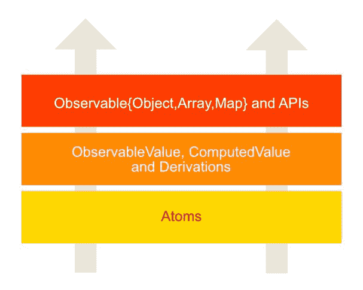
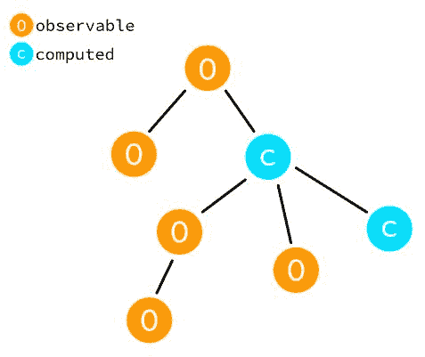

# 九、Mobx 堆内构件

到目前为止，我们看到的 MobX 是从消费者的角度出发的，它关注于如何使用它、最佳实践以及处理真实世界用例的 api。本章将其置于下面一层，并揭示了 MobX 反应系统背后的机制。我们将关注使*可观察到的动作*三元组变得生动的基础和核心抽象。

本章将涵盖的主题包括：

*   MobX 的分层体系结构
*   原子与可观测值
*   衍生和反应
*   什么是*透明功能反应式编程*？

# 技术要求

您需要在系统上安装 Node.js。最后，要使用本书的 Git 存储库，用户需要安装 Git。

本章代码文件可在 GitHub 上找到：
[https://github.com/PacktPublishing/Mobx-Quick-Start-Guide/tree/master/src/Chapter09](https://github.com/PacktPublishing/Mobx-Quick-Start-Guide/tree/master/src/Chapter09)

查看以下视频以查看代码的运行：
[http://bit.ly/2LvAouE](http://bit.ly/2LvAouE)

# 分层结构

像任何好的系统一样，MobX 由多个层组成，每个层为更高的层提供服务和行为。如果在 MobX 上应用此镜头，则可以从下至上看到这些层：



*   原子 To1 T1：原子是 MUBX 观测值的基础。顾名思义，它们是可观测依赖树的原子片段。它跟踪观察者，但实际上不存储任何值
*   **ObservableValue、ComputedValue 和派生**：`ObservableValue`扩展`Atom`并提供实际存储。同时，我们还有衍生和反应，它们是原子的*观察者*。它们对原子的变化作出反应，并安排反应。`ComputedValue`建立在衍生的基础上，也作为一个可观察的过程。
*   **可观察的{对象、数组、映射}和 API**：这些数据结构构建在`ObservableValue`之上，并使用它来表示它们的属性和值。它还充当 MobX 的 API 层，从用户的角度来看，MobX 是与库接口的主要手段。

The separation of layers is also visible in the source code where there are separate folders for different abstraction layers of MobX. It is not a one-to-one match with what we have described here, but conceptually these layers have lot of parallels in code as well. All of the code in MobX has been written using TypeScript with first class support.

# 原子

MobX 的反应系统由存在于可观察对象之间的依赖关系图支持。一个可观测值可能取决于一组可观测值，而这些可观测值又可能取决于其他可观测值。例如，购物车可能有一个名为`description`的*计算属性*，该属性取决于它持有的`items`数组和应用的任何`coupons`。在内部，`coupons`可能依赖于`CouponManager`类的`validCoupons`*计算属性*。在代码中，这可能是这样的：

```jsx
class Coupon {
    @observable isValid = false;

    /*...*/
}

class CouponManager {
    @observable.ref coupons = [];

    @computed
    get validCoupons() {
        return this.coupons.filter(coupon => coupon.isValid);
    }

    /*...*/
}

class ShoppingCart {
    @observable.shallow items = [];

    couponManager = new CouponManager();

    @computed
    get coupons() {
        return this.couponManager.validCoupons;
    }

    @computed
    get description() {
        return `Cart has ${this.items.length} item(s) with ${
            this.coupons.length
        } coupon(s) applied.`;
    }

    /*...*/
}
```

可视化这组依赖项可以为我们提供一个简单的图表，如下所示：


在运行时，MobX 将创建一个支持依赖关系树。此树中的每个节点将由 MobX 的核心构建块`Atom`的一个实例表示。因此，我们可以预期上图中树中的节点有五个*原子*。

原子有两个用途：

*   当*读取*时通知。这是通过调用`reportObserved()`完成的。
*   当*变更*时通知。这是通过调用`reportChanged()`完成的。

As a node of the MobX reactivity fabric, an atom plays the important role of notifying the reads and writes happening on each node.

在内部，原子跟踪其观察者，并将变化通知他们。调用`reportChanged()`时会发生这种情况。这里一个明显的遗漏是原子的实际值没有存储在`Atom`本身中。为此，我们有一个名为`ObservableValue`的子类，它构建在`Atom`之上。我们将在下一节中讨论这一点。

原子的核心契约由我们前面提到的两种方法组成。它还包含一些内务处理属性，如`observers`数组、是否正在观察等。我们可以放心地忽略它们进行讨论：

```jsx
class Atom {
    observers = [];

 reportObserved() {}
 reportChanged() {}

    /* ... */
}
```

# 运行时读取原子

MobX 还使您能够在运行时查看支持的原子。回到上一个 computed`description`属性的示例，让我们探究它的依赖关系树：

```jsx
import { autorun, $mobx, getDependencyTree } from 'mobx';

const cart = new ShoppingCart();
const disposer = autorun(() => {
    console.log(cart.description);
});

const descriptionAtom = cart[$mobx].values.get('description');
console.log(getDependencyTree(descriptionAtom));
```

在前面的代码片段中，有几个细节值得注意：

*   MobX 给你一个特殊的符号，`$mobx`，它包含了对可观察对象内部内务结构的引用。`cart`实例使用`cart[$mobx].values`维护其所有可观察属性的映射。`description`属性的支持原子通过读取此映射获得：`cart[$mobx].values.get('description')`。
*   我们可以使用 MobX 公开的`getDependencyTree()`函数来获取该属性的依赖关系树。它接受一个`Atom`作为输入，并返回一个描述依赖关系树的对象。

以下是`description`属性的`getDependencyTree()`输出。为了清晰起见，删除了一些额外的细节。您之所以两次看到`ShoppingCart@16.items`是因为它指向`items`（参考）和`items.length`属性：

```jsx
{
    name: 'ShoppingCart@16.description',
    dependencies: [
        { name: 'ShoppingCart@16.items' },
        { name: 'ShoppingCart@16.items' },
        {
            name: 'ShoppingCart@16.coupons',
            dependencies: [
                {
                    name: 'CouponManager@19.validCoupons',
                    dependencies: [{ name: 'CouponManager@19.coupons' }],
                },
            ],
        },
    ],
};
```

There is also a convenient API, `getAtom(thing: any, property: string)`, to read atoms from observables and observers. For example, in our previous example, instead of using the special symbol `$mobx` and reading into its internal structure, we can get the *description* atom with `getAtom(cart, 'description')`. `getAtom()` is exported from the `mobx` package. As an exercise, find out the dependency tree for `autorun()` in the previous code snippet. You can get hold of the instance of the reaction with `disposer[$mobx]` or `getAtom(disposer)`. Similarly, there is also the `getObserverTree()` utility that gives you the observers depending on the given observable. See if you can find the connection to `autorun()` from the atom backing the `description` property.

# 创造原子

作为 MobX 用户，您很少直接使用`Atom`。相反，您将依赖 MobX 公开的其他便利 api 或数据结构，如`ObservableObject`、`ObservableArray`或`ObservableMap`。然而，现实世界总是会产生一些情况，你可能需要更深一层。

MobX 确实为您提供了一个方便的工厂函数来创建原子，恰当地命名为`createAtom()`：

**`createAtom(name, onBecomeObservedHandler, onBecomeUnobservedHandler)`**

*   `name`（`string`）：原子的名称，用于 MobX 中的调试和跟踪设施
*   `onBecomeObservedHandler`（`() => { }`）：一个回调函数，用于在原子第一次被观察到时获得通知
*   `onBecomeUnobservedHandler`（`() => { }`）：一个回调函数，用于在原子不再被观察时获得通知

`onBecomeObserved`和`onBecomeUnobserved`是反应性系统中原子变得活跃和不活跃的两个时间点。它们通常用于资源管理，分别用于设置和拆卸。

# 原子钟的例子

让我们看一个使用`Atom`的例子，它也说明了原子如何参与反应系统。我们将创建一个*简单的时钟*，当一个原子被观察到时开始滴答作响，当它不再被观察到时停止。本质上，我们这里的资源是通过使用`Atom`管理的计时器（时钟）：

```jsx
import { createAtom, autorun } from 'mobx';

class Clock {

    constructor() {
 this.atom = createAtom(
 'Clock',
 () => {
 this.startTicking();
 },
 () => {
 this.stopTicking();
 },
 );

        this.intervalId = null;
    }

    startTicking() {
        console.log('Clock started');
        this.tick();
        this.intervalId = setInterval(() => this.tick(), 1000);
    }

    stopTicking() {
        clearInterval(this.intervalId);
        this.intervalId = null;

        console.log('Clock stopped');
    }

    tick() {
 this.atom.reportChanged();
    }

    get() {
 this.atom.reportObserved();
        return new Date();
    }
}

const clock = new Clock();

const disposer = autorun(() => {
 console.log(clock.get());
});

setTimeout(disposer, 3000);
```

在前面的代码片段中有许多有趣的细节。让我们在这里列出它们：

*   在对`createAtom()`的调用中，我们在原子被观察到以及不再被观察到时提供处理程序。当 ato*m 真正被观测到*时，这似乎有点神秘。这里的秘密是使用`autorun()`，它设置了一个副作用来读取原子钟的当前值。*S*由于`autorun()`立即运行，因此会调用`clock.get()`，而`clock.get()`又会调用`this.atom.reportObserved()`。这就是原子在反应体系中变得活跃的方式。
*   一旦原子被观察到，我们就启动时钟计时器，它每秒钟都在滴答作响。这发生在`onBecomeObserved`回调中，我们调用`this.startTicking()`。
*   每秒钟，我们调用`this.atom.reportChanged()`，它将更改的值传播给所有观察者。在我们的例子中，只有一个`autorun()`，它重新执行并打印控制台日志。
*   我们不必存储当前时间，因为每次调用`get()`时都会返回一个新值。
*   另一个神秘的细节是当原子变得*不被观测*时。当我们在三秒钟后处理`autorun()`时，就会发生这种情况，导致在原子上调用`onBecomeUnobserved`回调。在回调内部，我们停止计时器并清理资源。

因为`Atoms`只是依赖树的节点，所以我们需要一个可以存储可观察值的构造。这就是`ObservableValue`类的用武之地。把它想象成一个有价值的`Atom`。MobX 内部区分两种可观察值，`ObservableValue`和`ComputedValue`。让我们轮流看看。

# 可观察值

`ObservableValue`是`Atom`的一个子类，增加了存储可观测值的能力。它还增加了一些额外的功能，比如提供钩子来拦截值更改和观察值。这也是`ObservableValue`定义的一部分。以下是`ObservableValue`的简化定义：

```jsx
class ObservableValue extends Atom {
    value;

    get() {
        /* ... */
 this.reportObserved();
    }

    set(value) {

        /* Pass through interceptor, which may modify the value (*newValue*) ... */

        this.value = newValue;
 this.reportChanged();
    }

    intercept(handler) {}
    observe(listener, fireImmediately) {}
}
```

注意`get()`方法中对`reportObserved()`的调用和`set()`方法中对`reportChanged()`的调用。这些是读取和写入原子值的地方。通过调用这些方法，`ObservableValue`参与反应性系统。还要注意的是，`intercept()`和`observe()`并不是反应系统的一部分。它们更像是*事件发射器*，与可观测值发生的变化挂钩。这些事件不受事务的影响，这意味着它们在批处理结束之前不会排队，而是立即触发

MobX 的所有高级构造也是基础。这包括盒装可观测对象、可观测对象、可观测阵列和可观测地图。存储在这些数据结构中的值是`ObservableValue`的实例。

`ObservableValue`周围最薄的包装是装箱的 observable，您可以使用`observable.box()`创建它。这个 API 实际上会返回一个`ObservableValue`的实例。您可以使用它调用`ObservableValue`上的任何方法，如以下代码片段所示：

```jsx
import {observable} from 'mobx';

const count = observable.box(0);

count.intercept(change => {
    console.log('Intercepted:', change);

    return change; // No change
    // Prints
    // Intercepted: {object: ObservableValue$$1, type: "update", newValue: 1}
    // Intercepted: {object: ObservableValue$$1, type: "update", newValue: 2}
});

count.observe(change => {
    console.log('Observed:', change);
    // Prints
    // Observed: {object: ObservableValue$$1, type: "update", newValue: 1}
    // Observed: {object: ObservableValue$$1, type: "update", newValue: 2, oldValue: 1}
});

// Increment
count.set(count.get() + 1);

count.set(count.get() + 1);
```

# 计算值

另一种*可观察值*可以存在于可观察树中，即`ComputedValue`。这在许多方面与`ObservableValue`不同。`ObservableValue`为底层原子提供存储，并有其自身的*值*。MobX 提供的所有数据结构，如 Observable Object/Array/Map，都依赖于`ObservableValue`来存储叶级值。`ComputedValue`之所以特别，是因为它本身没有内在价值。顾名思义，它的*值*是根据其他观测值计算的，包括其他计算值：



在`ComputedValue`的定义中，这一点变得很明显，因为它不是`Atom`的子类。相反，它有一个类似于`ObservableValue`的接口，除了拦截能力。以下是一个简单的定义，突出了有趣的部分：

```jsx
class ComputedValue {
    get() {
        /* ... */
 reportObserved(this);
        /* ... */
    }

    set(value) { /* rarely applicable */ }

    observe(listener, fireImmediately) {}
}
```

在前面的片段中需要注意的一点是，由于`ComputedValue`不依赖`Atom`，因此它对`reportObserved()`使用了不同的方法。这是一个较低级别的实现，它在可观察对象和观察者之间建立了联系。`Atom`也会在内部使用，因此行为完全相同。此外，没有对`reportChanged()`的调用，因为`ComputedValue`的设置器定义不明确。

正如您所看到的，a`ComputedValue`主要是一个只读的可观察对象。尽管 MobX 提供了一种*设置*计算值的方法，但在大多数情况下，它并没有多大意义。计算值的 setter 必须应用 getter 的反向计算。在大多数情况下，这几乎是不可能的。考虑本章前面的例子，关于购物车的 To1 T1。这是一个计算出的值，它从其他可观察对象（如`items`和`coupons`）生成一个字符串。这个计算属性的*setter*是什么样子的？它必须解析字符串，并以某种方式得出`items`和`coupons`的值。这绝对不可能。因此，一般来说，最好将`ComputedValue`视为只读可观察对象。

由于计算值取决于其他观察值，因此实际的*值计算*更像是一种副作用。这是一个副作用的变化，在任何依赖观测。MobX 将此计算称为派生。我们稍后将看到，派生与反应同义，强调计算的副作用方面。

`ComputedValue`是依赖树中唯一一种既可观察又可观察的节点。它的价值是一个可观察的，由于它依赖于其他可观察的，它也是一个观察者。
`ObservableValue`=仅可观察
`Reaction`=仅观察者
`ComputedValue`=可观察者和观察者

# 有效计算

`ComputedValue`的派生函数可能是一个昂贵的操作。因此，谨慎的做法是缓存该值并尽可能地延迟计算。这是 MobX 中的标准，它采用了一系列优化，使其成为一个懒惰的评估：

*   首先，除非明确要求或存在依赖于此`ComputedValue`的反应，否则永远不会计算值。正如预期的那样，当没有观察者时，它将根本不会被计算。
*   一旦计算完毕，它的值将被缓存以备将来读取。它将保持这种方式，直到一个依赖的可观察信号发出变化（通过其`reportChanged()`并导致推导重新评估）。
*   `ComputedValue`可以依赖于创建依赖关系树的其他计算值。除非直系子代已更改，否则不会重新计算。如果依赖关系树中存在深层次的更改，它将等待直接的依赖关系发生更改。此行为提高了效率，并且不会不必要地重新计算。

正如您所见，在`ComputedValue`中有多个层次的优化。强烈建议利用计算属性的功能来表示域逻辑及其 UI 的各种细微差别。

# 起源

到目前为止，我们已经看到了 MobX 的构建块，它们用`Atoms`、`ObservableValue`和`ComputedValue`表示可观察状态。这些都有助于构建应用的反应状态图。但真正的反应能力是通过使用派生或反应释放出来的。这些可见物和反应共同构成了 MobX 的阴阳关系。每一个都依赖于另一个来为反应系统提供燃料。

衍生或反应是跟踪发生的地方。它跟踪在派生或反应的上下文中使用的所有观察值。MobX 将收听他们的`reportObserved()`并将其添加到跟踪观察对象列表中（`ObservableValue`或`ComputedValue`。任何时候，可观察到的调用`reportChanged()`（发生变异时会发生），MobX 都会安排运行所有连接的观察者。

We will be using ***derivation*** and ***reaction*** interchangeably. Both are intended to convey the execution of a side effect that uses the observables to produce a new value (*derivation*) or a side effect (*reaction*). The tracking behavior is common between these two types and hence we will use them synonymously.

# 推导周期

MobX 使用一个`globalState`来保存对当前执行的*派生*或*反应*的引用。每当一个反应在运行时，所有触发其`reportObserved()`的可观察物都将被标记为该反应。事实上，这种关系是双向的。*可观测*记录其所有观察者（反应），而*反应*记录其当前观察的所有可观测者。当前执行的反应将被添加为每个观察对象的*观察者*。如果已添加观察者，将忽略它。

当您设置观察者时，他们都会返回一个处理器功能。我们已经在返回值`autorun()`、`reaction()`或`when()`中看到了这一点，它们是处理器函数。调用此处理器时，观察者将从连接的观察对象中移除：


在反应的执行过程中，只考虑现有的观测值进行跟踪。然而，在同一反应的不同运行中，可能会引用一些新的观测值。当执行一段由于某些分支逻辑而被跳过的代码时，这是可能的。由于在跟踪反应时可以发现新的观察值，MobX 会对观察值进行检查。新的将被添加到可观察的列表中，而不再使用的将被删除。移除可观察到的物体不会立即发生；它们在当前反应完成后排队等待移除

在可见物和反应之间的相互作用中，**动作**似乎严重缺失。嗯，不完全是这样。他们确实可以发挥作用。正如本书中多次提到的，行动是改变可观察事物的推荐方式。操作将创建事务边界，并确保仅在完成后触发所有更改通知。这些操作也可以嵌套，从而产生嵌套事务。只有当最上面的*操作*（或事务）完成时，才会触发通知。这也意味着在事务（嵌套或非嵌套）进行时，不会运行任何*反应*。MobX 将此事务边界视为一个**批处理**，并在内部跟踪嵌套。在批处理过程中，所有反应都将排队，并在最上面的批处理结束时执行。

当排队的反应执行时，循环再次开始。它将跟踪观察值，将它们和正在执行的派生链接起来，添加任何新发现的观察值，并将在批处理过程中发现的任何反应排队。如果没有更多的批次，MobX 会认为自己是稳定的，并继续等待任何可观察到的突变。

An interesting thing about reactions is that they could re-trigger themselves. Inside a reaction, you can read an observable and also fire an action that mutates that same *observable*. This may happen within the same block of code or indirectly via some function invoked from the reaction. The only requirement is that it should ***not*** lead to an infinite loop. MobX expects the reaction to become stable as quickly as possible.

If, for some reason, it takes more than **100** iterations and there is no stability, MobX will bail out with an exception.

Reaction doesn't converge to a stable state after 100 iterations. There is probably a cycle in the reactive function: `Reaction[Reaction@14]`
Without the upper limit of 100 iterations, it would cause a stack overflow at runtime, making it much harder to track down its cause. MobX protects you from this predicament by guarding with the **100-iterations** limit. Note that it does not forbid you from cyclic dependencies but assists in identifying the code that is causing the instability (infinite loop).

下面显示了一个简单的片段，它即使在*100 次迭代*反应后仍然不稳定。这个反应观察到`counter`可观察到的，并且通过调用`spinLoop()`动作来修改它。这会导致反应一次又一次地运行，直到它在*100 次迭代之后放弃：*

```jsx
class Infinite {
    @observable counter = 0;

    constructor() {
        reaction(
 () => this.counter,
            counterValue => {
                console.log(`Counter is ${counterValue}`);
 this.spinLoop();
            },
        );
    }

    @action
    spinLoop() {
        this.counter = this.counter + 1;
    }
}

new Infinite().spinLoop();

/* Console log:
*Reaction doesn't converge to a stable state after 100 iterations. Probably there is a cycle in the reactive function: Reaction[Reaction@14]* */
```

可以看出，执行推导或反应对于建立*观察者*和*观察者*之间的联系至关重要。没有*反应*，反应性系统中就没有生命。它只是一个可观察的集合。您仍然可以启动动作并对其进行变异，但它仍然是非常静态和无反应的。反应（衍生）完成了*可观察到的动作*的三位一体，并将寿命泵入该反应系统。

最终，**反应**是*从您的状态中提取*值并激发整个反应过程的反应！

# 异常处理

处理错误被认为是 MobX 反应的重要部分。事实上，它提供了一个选项来为`autorun()`、`reaction()`和`when()`提供一个错误处理程序（`onError`），在`computed()`的情况下，它会在读取计算值的任何时候将错误返回给您。在每一种情况下，MobX 都能像预期的那样继续工作。

在内部，MobX 在反应和衍生的执行过程中放置了额外的`try-catch`块。它将捕获这些块中抛出的错误，并通过`onError`处理程序或在读取计算值时将它们传播回您。此行为确保您可以继续运行您的反应，并在`onError`处理程序中采取任何恢复措施

如果没有为某个反应指定`onError`处理程序，MobX 还有一个全局`onReactionError()`处理程序，它将为反应中抛出的任何异常调用。您可以注册这些全局反应错误的侦听器，以执行错误监视、报告等操作：

`onReactionError(handler-function: (error, reaction) => { })`

**处理函数**：接受错误和反应实例作为参数的函数。

在调用全局`onReactionError`处理程序之前，MobX 首先检查`onError`处理程序是否存在失败的反应。只有当不存在全局处理程序时，才会调用全局处理程序。

现在，如果出于某种原因，您不希望 MobX 捕获异常并将其报告给全局`onReactionError`处理程序，那么您有一个解决方法。通过使用`configure({ disableErrorBoundaries: true })`配置 MobX，您将在*故障点*处引发常规异常。您现在需要通过反应内部的*try-catch*块来处理它。

`configure({ disableErrorBoundaries: true })`在正常情况下不应使用，因为未选中异常会破坏 MobX 的内部状态。但是，启用此配置可以帮助您进行调试，因为它会使异常取消捕获。您**现在可以在导致异常的确切语句上暂停调试器。**

 **# API 层

这是 MobX 面向消费者的最外层，建立在迄今为止提到的基础之上。这一层中突出的 API 包括贯穿本书的 API：`observable()`、`observable.box()`、`computed()`、`extendObservable()`、`action()`、`reaction()`、`autorun()`、`when()`等。当然，我们也有装饰师，比如`observable.ref`、`observable.deep`、`observable.shallow`、`action.bound`、`computed.struct`等等。

`ObservableObject`、`ObservableArray`和`ObservableMap`等核心数据结构依赖`ObservableValue`存储它们的所有值。

对于`ObservableObject...`：

*   键值对的值由`ObservableValue`支持。
*   正如预期的那样，每个计算属性都有一个`ComputedValue`作为后盾。
*   *可观察对象*的`keys()`方法也有`Atom`支持。这是必要的，因为你可能在你的一个反应中重复`keys()`。当添加或删除密钥时，您希望再次执行您的反应。`keys()`的原子激发`reportChanged()`进行添加和删除，并确保重新执行连接的反应。

对于`ObservableArray...`：

*   每个索引值都有`ObservableValue`支持。
*   `length`属性由`Atom`明确支持。请注意，*ObservableArray*与 JavaScript 数组具有相同的接口。在***MobX 4***中，它是一个类似数组的数据结构，在***MobX 5***（由 ES6*代理*支持）中已经成为一个真正的 JS 数组。`length`上的读写操作将导致对原子调用`reportObserved()`和`reportChanged()`。事实上，当使用*map*、*reduce*、*filter*等任何一种方法时，都会使用 backing`Atom`来触发`reportObserved()`。对于任何突变方法，如*剪接*、*推送*、*pop*、*移位*等，都会触发`reportChanged()`。这可确保连接的反应按预期进行。

对于`ObservableMap...`：

*   *键值*对的值由`ObservableValue`支持。
*   就像*ObservieObject*一样，它也为`keys()`方法维护了一个`Atom`实例。任何密钥的添加或删除都会在 atom 上显示一个`reportChanged()`。调用`keys()`方法本身将在原子上触发`reportObserved()`。

MobX 中的集合是对象、数组和映射，本质上是可观察框的集合（`ObservableValue`。它们可以组织为列表或地图，也可以组合起来创建复杂的结构。

所有这些数据结构还公开了允许细粒度截取和观察值的`intercept()`和`observe()`方法。通过建立在`Atom`、`ObservableValue`和*派生*的基础上，MobX 为您提供了强大的 API 工具箱，用于在应用中构建复杂的状态管理解决方案。

# 透明函数反应式编程

MobX 被认为是一个**透明功能反应式编程**（**TFRP**系统。是的，那一行的形容词太多了！让我们把它逐字分解。

# 它是透明的。。。

将*可观察到的*与*观察者*相连，允许观察者对可观察到的变化做出反应。这是我们对 MobX 的基本期望，我们建立这些联系的方式感觉非常直观。除了在观察者内部使用装饰器和解引用观察者之外，没有明确的连线。由于布线的低开销，MobX 变得非常*声明性*，在这里您可以表达您的意图，而不用担心机器。在*观察者*和*观察者*之间建立的自动连接使*反应系统*能够自动运行。这使得 MobX 成为一个*透明的*系统，因为连接观察者和观察者的工作基本上被取消了。在一个反应中使用一个可观察到的东西足以将两者联系起来。

# 它是反应性的。。。

这种反应性也是非常细粒度的。可观察对象的依赖关系树可以根据需要简单，也可以同样深入。有趣的是，您从不担心布线的复杂性或效率。MobX 对您的依赖关系有着深刻的了解，并通过仅在需要时作出反应来确保效率。当依赖项不断更改时，不会触发轮询或过多事件。因此，MobX 也是一个非常被动的系统。

# 它是功能性的。。。

**函数式**编程，正如我们所知，是关于利用函数的能力来执行数据流转换。通过使用诸如 map、reduce、filter、compose 等多种函数运算符，我们可以对*输入数据*应用转换并生成输出值。在 MobX 的情况下需要注意的是，*输入 da*ta 是一个可观察的、随时间*变化的*值。MobX 结合了反应式系统的特性，确保在输入数据（可观察）发生变化时自动应用功能转换。正如前面所讨论的，它以一种透明的方式来实现这一点，在可观察物和反应之间建立隐式的联系。

这种品质的结合使 MobX 成为一个 TFRP 系统。

From the author's point of view, the *origins* of the acronymn TFRP has come from the following article: [https://github.com/meteor/docs/blob/version-NEXT/long-form/tracker-manual.md](https://github.com/meteor/docs/blob/version-NEXT/long-form/tracker-manual.md).

# 面向价值的程序设计

MobX 也是关于**面向价值的编程**（**VOP**），在这里，您关注的是价值的变化、它的依赖性以及它在反应式系统中的传播。有了 VOP*，*你关注的是*什么是连接的值*而不是*值是如何连接的？*它的对应物是**面向事件的编程**（**EOP**，你关注的是一个事件流来通知更改。事件只报告所发生的事情，而没有依赖性的概念。与面向价值的编程相比，它在概念上处于较低的级别。

VOP 依靠事件在内部完成其工作。值更改时，将引发事件以通知更改。然后，这些事件的处理程序将该值传播给该***可观测值***的所有侦听器（***观察者***）。这通常会导致调用一个反应/派生。因此，作为价值变化的副作用的反应和推导处于价值传播事件的末尾。

在 VOP 中思考提高了抽象级别，使您更接近您正在处理的领域。与其担心价值传播的机制，不如只关注通过可观察物、计算属性和观察者（反应/衍生）建立联系。我们知道，这就是 MobX 的三元组：*可观察到的动作和反应*。这种思维方式在本质上是非常***陈述性***：价值观的*什么与*如何变化。随着你越来越沉迷于这种思维方式，状态管理中的许多场景变得更加站得住脚。你会惊讶于这个范例所提供的*简单、强大和高效*。

If you do need to dive deeper into the eventing layer, MobX has the `intercept()` and `observe()` APIs. They allow you to hook into the events that are raised when observables are *added, updated, or deleted*. There is also the `fromStream()` and `toStream()` APIs from the `mobx-utils` npm package, which gives you a stream of events that are compatible with RxJS. These events don't participate in the MobX transaction (batching), are never queued up, and always fire immediately.

It is rare to use the eventing APIs in consumer code; they are mostly used by tools and utility functions such as `spy()`, `trace()`, and so on to give insight into the event layer of MobX.

# 总结

通过对 MobX 的深入了解，您可以欣赏到 TFRP 系统的强大功能，它通过一个非常简单的 API 公开。从`Atoms`开始，以`ObservableValue`包装的功能层，以及 API 和更高级别的数据结构，为您的域建模提供了一个全面的解决方案。

在内部，MobX 管理观察者和观察者之间的所有连接（反应/衍生）。它是自动完成的，对您通常的编程风格的干扰最小。作为一名开发人员，您编写的代码感觉很自然，MobX 消除了管理反应式连接的复杂性。

MobX 是一个开源项目，已经在各个领域进行了战斗测试，接受了来自世界各地开发人员的贡献，多年来不断成熟。通过对 MobX 的深入了解，我们当然希望减少为这个强大的状态管理库做出贡献的障碍。**