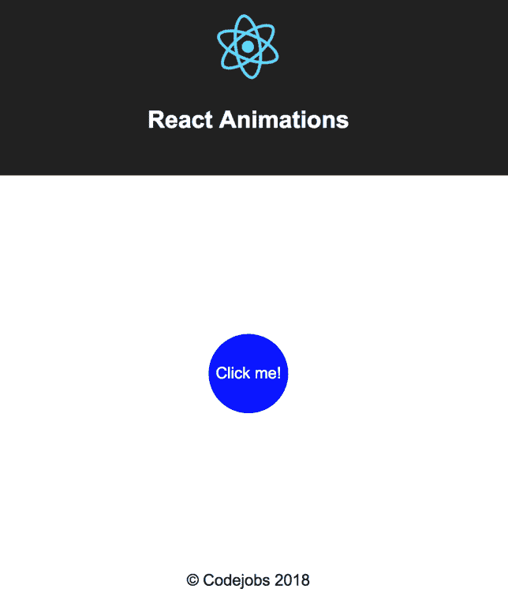
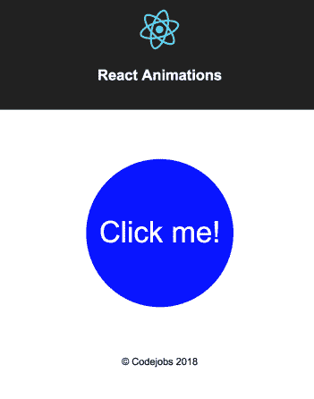
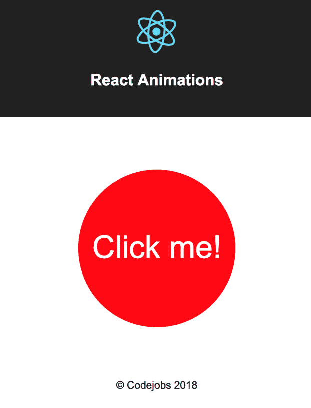

# 七、React 和动画

本章将介绍以下配方：

*   使用 ReactCsStranisitionGroup 设置待办事项列表的动画
*   使用 react 动画库
*   使用 React pose 创建我们的第一个动画

# 介绍

动画在任何 web 应用中都非常常见。自 CSS3 以来，动画已经变得广泛且易于实现。动画最常见的用途是转换，您可以在其中更改 CSS 属性并定义持续时间或延迟。React 可以使用名为`ReactCSSTransitionGroup`的动画加载项处理动画。在下面的食谱中，我们将使用`ReactCSSTransitionGroup`来创建一些动画。`ReactCSSTransitionGroup`是一个附加组件，用于顺利实现基本 CSS 动画和过渡

# 使用 ReactCsStranisitionGroup 设置待办事项列表的动画

在本食谱中，我们将使用`ReactCSSTransitionGroup`设置待办事项列表的动画。

# 准备

对于此配方，我们需要安装`react-addons-css-transition-group`包：

```jsx
npm install react-addons-css-transition-group
```

# 怎么做。。。

我们将用一些动画制作一个待办事项列表：

1.  首先，让我们创建`Todo`组件：

```jsx
import React, { Component } from 'react';
import uuidv4 from 'uuid/v4';
import List from './List';
import './Todo.css';

class Todo extends Component {
  constructor() {
    super();

    // Initial state...
    this.state = {
      task: '',
      items: []
    };
  }

  componentWillMount() {
    // Setting default tasks...
    this.setState({
      items: [
        {
          id: uuidv4(),
          task: 'Default Task 1',
          completed: false
        },
        {
          id: uuidv4(),
          task: 'Default Task 2',
          completed: true
        },
        {
          id: uuidv4(),
          task: 'Default Task 3',
          completed: false
        }
      ]
    });
  }

  handleOnChange = e => {
    const { target: { value } } = e;

    // Updating our task state with the input value...
    this.setState({
      task: value
    });
  }

  handleOnSubmit = e => {
    // Prevent default to avoid the actual form submit...
    e.preventDefault();

    // Once is submited we reset the task value and we push the 
    // new task to the items array.
    this.setState({
      task: '',
      items: [
        ...this.state.items,
        {
          id: uuidv4(),
          task: this.state.task,
          complete: false
        }
      ]
    });
  }

  markAsCompleted = id => {
    // Finding the task by id...
    const foundTask = this.state.items.find(
      task => task.id === id
    );

    // Updating the completed status...
    foundTask.completed = true;

    // Updating the state with the new updated task...
    this.setState({
      items: [
        ...this.state.items,
        ...foundTask
      ]
    });
  }

  removeTask = id => {
    // Filtering the tasks by removing the specific task id...
    const filteredTasks = this.state.items.filter(
      task => task.id !== id
    );

    // Updating items state...
    this.setState({
      items: filteredTasks
    });
  }

  render() {
    return (
      <div className="Todo">
        <h1>New Task:</h1>

        <form onSubmit={this.handleOnSubmit}>
          <input 
            value={this.state.task} 
 onChange={this.handleOnChange} 
          />
        </form>

        <List
          items={this.state.items}
          markAsCompleted={this.markAsCompleted}
          removeTask={this.removeTask}
        />
      </div>
    );
  }
}

export default Todo;
```

File: src/components/Todo/index.jsx

2.  现在，在我们的`List`组件中，我们需要包含`ReactCSSTransitionGroup`并将其用作列表元素中的包装器。我们需要使用`transitionName`道具指定过渡的名称，`transitionAppear`在第一个动画挂载时添加一个过渡。默认为`false`：

```jsx
import React from 'react';
import ReactCSSTransitionGroup from 'react-addons-css-transition-group';
import './List.css';

const List = props => (
  <ul>
    <ReactCSSTransitionGroup 
 transitionName="todo" 
 transitionAppear={true}
    >
      {props.items.map((item, key) => (
        <li 
          key={key} 
          className={`${item.completed ? 'completed' : 'pending'}`}
        >
          {item.task}

          <div className="actions">
            <span 
              className={item.completed ? 'hide' : 'done'} 
              onClick={() => props.markAsCompleted(item.id)}
            >
              <i className="fa fa-check"></i>
            </span>

            <span 
              className="trash" 
              onClick={() => props.removeTask(item.id)}
            >
              <i className="fa fa-trash"></i>
            </span>
          </div>
        </li>
      ))}
    </ReactCSSTransitionGroup>
  </ul>
);

export default List;
```

File: src/components/Todo/List.jsx

3.  现在，使用`transitionName`，我们将使用`ReactCSSTransitionGroup`创建的特殊类添加一些样式：

```jsx
.todo-enter {
    opacity: 0.01;
}

.todo-enter.todo-enter-active {
    opacity: 1;
    transition: opacity 0.5s ease;
}

.todo-leave {
    opacity: 1;
}

.todo-leave.todo-leave-active {
    opacity: 0.01;
    transition: opacity .5s ease-in;
}

.todo-appear {
    opacity: 0.01;
    transition: opacity .5s ease-in;
}

.todo-appear.todo-appear-active {
    opacity: 1;
}
```

File: src/components/Todo/List.css

# 它是如何工作的。。。

我们需要在`ReactCSSTransitionGroup`组件中包含我们想要设置动画的元素。每次我们在待办事项列表中添加一个项目时，我们都会看到我们的特殊类（`.todo-enter`和`.todo-enter-active`）被注入一秒钟以开始我们的动画：


如果我们删除一个项目，我们将看到第二个类`.todo-leave`和`.todo-leave-active`：


如您所见，使用`ReactCSSTransitionGroup`可以帮助我们处理动画的状态。您可以使用它在 React 应用中创建更好的动画。

# 使用 react 动画库

在本食谱中，我们将学习如何使用库 react 动画。

# 准备

对于此配方，我们需要安装以下软件包：

```jsx
npm install react-animations radium
```

# 怎么做。。。

让我们做一些动画：

1.  我们需要使用`Radium`来创建内联样式，以使用`react-animations`包中的动画。首先，让我们创建我们的组件：

```jsx
import React, { Component } from 'react';
import { fadeIn } from 'react-animations';
import Radium, { StyleRoot } from 'radium';

const styles = {
  fadeIn: {
    animation: 'x 1s',
    animationName: Radium.keyframes(fadeIn, 'fadeIn')
  }
};

class Animations extends Component {
  render() {
    return (
      <StyleRoot>
        <div className="Animations" style={styles.fadeIn}>
          <h1>This text will be animated</h1>
        </div>
      </StyleRoot>
    );
  }
}

export default Animations;
```

File: src/components/Animations/index.jsx

2.  在本例中，我们使用的是`fadeIn`动画。我们需要从`react-animations`导入要使用的动画，将动画添加到`Radium`样式中，然后使用`<StyleRoot>`作为动画的包装，最后指定内联样式`fadeIn`。
3.  如果要使用另一个动画，例如，`bounce`，则需要添加反弹动画并为其创建样式：

```jsx
import React, { Component } from 'react';
import { fadeIn, bounce } from 'react-animations';
import Radium, { StyleRoot } from 'radium';

const styles = {
  fadeIn: {
    animation: 'x 1s',
    animationName: Radium.keyframes(fadeIn, 'fadeIn')
  },
  bounce: {
    animation: 'x 1s',
    animationName: Radium.keyframes(bounce, 'bounce')
  }
};

class Animations extends Component {
  render() {
    return (
      <StyleRoot>
        <div className="Animations" style={styles.bounce}>
          <h1>This text will be animated</h1>
        </div>
      </StyleRoot>
    );
  }
}

export default Animations;
```

File: src/components/Animations/index.jsx

# 还有更多。。。

如您所见，使用`react-animations`中的动画非常简单。还有很多动画：

*   `bounce`
*   `fadeIn`
*   `fadeOut`
*   `flash`
*   `flip`
*   `rollIn`
*   `rollOut`
*   `rotateIn`
*   `rotateOut`
*   `rubberBand`
*   `shake`
*   `swing`
*   `zoomIn`
*   `zoomOut`

要查看所有可用动画，请访问官方存储库[https://github.com/FormidableLabs/react-animations](https://github.com/FormidableLabs/react-animations) 。

# 使用 React Pose 创建我们的第一个动画

React-Pose 是 HTML、SVG 和 React 的声明式运动系统。这是一个非常酷的库，您可以使用 React 制作惊人的动画。

# 准备

对于此配方，我们需要安装以下软件包，并将我们的`react`和`react-dom`更新为`16.4.2`或更高版本：

```jsx
 npm install react react-dom react-pose styled-components
```

# 怎么做。。。

按照以下步骤创建反应姿势动画：

1.  首先，让我们创建组件结构：

```jsx
import React, { Component } from 'react';
import posed from 'react-pose';
import styled from 'styled-components';
import './Animations.css';

class Animations extends Component {
  render() {
    return (
      <div class="Animations">

      </div>
    );
  }
}

export default Animations;
```

File: src/components/Animations/index.jsx

2.  我们需要做的第二件事是使用动画的状态（`normal`和`hover`创建我们的第一个姿势`div`，并使用`styled-components`创建一个样式化的`div`：

```jsx
import React, { Component } from 'react';
import posed from 'react-pose';
import styled from 'styled-components';
import './Animations.css';

// Creating our posed div
const Circle = posed.div({
  normal: {
    scale: 1 // Normal state
  },
  hover: {
    scale: 3 // Hover state
  }
});

// Creating styled component
const StyledCircle = styled(Circle)`
  color: white;
  cursor: pointer;
  background: blue;
  line-height: 80px;
  border-radius: 50%;
  height: 80px;
  width: 80px;
`;

class Animations extends Component {
  render() {
    return (
      <div class="Animations">

      </div>
    );
  }
}

export default Animations;
```

File: src/components/Animations/index.jsx

3.  现在我们需要将`StyledCircle`组件添加到`render`方法中：

```jsx
      render() {
        return (
          <div class="Animations">
            <StyledCircle
              pose={this.state.hover ? 'hover' : 'normal'}
              onMouseEnter={this.handleMouseEnter}
              onMouseLeave={this.handleMouseLeave}
              onClick={this.handleClick}
              style={{ background: this.state.bg }}
            >
              Click me!
            </StyledCircle>
          </div>
        );
      }
```

File: src/components/Animations/index.jsx

4.  如您所见，我们需要创建一些事件方法，我们将使用本地状态在用户单击时更改圆的大小和颜色：

```jsx
import React, { Component } from 'react';
import posed from 'react-pose';
import styled from 'styled-components';
import './Animations.css';

const Circle = posed.div({
  normal: {
    scale: 1 // Normal state
  },
  hover: {
    scale: 3 // Hover state
  }
});

// Creating styled component
const StyledCircle = styled(Circle)`
  color: white;
  cursor: pointer;
  background: blue;
  line-height: 80px;
  border-radius: 50%;
  height: 80px;
  width: 80px;
`;

class Animations extends Component {
  state = {
    bg: 'blue',
    hover: false
  };

  handleMouseEnter = () => {
    this.setState({
      hover: true
    });
  }

  handleMouseLeave = () => {
    this.setState({
      hover: false
    });
  }

  handleClick = () => {
    // Choosing a random color...
    const colors = ['red', 'green', 'gray', 'orange', 'black', 'pink'];

    this.setState({
      bg: colors[Math.floor(Math.random() * colors.length)]
    });
  }

  render() {
    return (
      <div class="Animations">
        <StyledCircle
          pose={this.state.hover ? 'hover' : 'normal'}
          onMouseEnter={this.handleMouseEnter}
          onMouseLeave={this.handleMouseLeave}
          onClick={this.handleClick}
          style={{ background: this.state.bg }}
        >
          Click me!
        </StyledCircle>
      </div>
    );
  }
}

export default Animations;
```

File: src/components/Animations/index.jsx

# 它是如何工作的。。。

我们的第一个视图将是一个带有“单击我”标签的蓝色圆圈



如果我们将鼠标悬停在圆上，我们将看到姿势动画，这会增加圆的比例：



最后，如果单击圆形，我们将看到圆形随机更改其背景颜色：



# 还有更多。。。

我们甚至可以组合`react-animations`库中的动画。例如，如果我们想在用户单击圆时翻转它，那么我们可以这样做：

```jsx
import React, { Component } from 'react';
import posed from 'react-pose';
import styled, { keyframes } from 'styled-components';
import { flip } from 'react-animations';
import './Animations.css';

const flipAnimation = keyframes`${flip}`;

const Circle = posed.div({
  normal: {
    scale: 1 // Normal state
  },
  hover: {
    scale: 3 // Hover state
  }
});

// Creating styled component
const StyledCircle = styled(Circle)`
  color: white;
  cursor: pointer;
  background: blue;
  line-height: 80px;
  border-radius: 50%;
  height: 80px;
  width: 80px;
`;

class Animations extends Component {
  state = {
    style: {
      background: 'blue'
    },
    hover: false
  };

  handleMouseEnter = () => {
    this.setState({
      hover: true
    });
  }

  handleMouseLeave = () => {
    this.setState({
      hover: false
    });
  }

  handleClick = () => {
    // Choosing a random color...
    const colors = ['red', 'green', 'gray', 'orange', 'black', 'pink'];

    this.setState({
      style: {
        animation: `1s ${flipAnimation}`,
        background: colors[Math.floor(Math.random() * colors.length)]
      }
    });
  }

  render() {
    return (
      <div className="Animations">
        <StyledCircle
          pose={this.state.hover ? 'hover' : 'normal'}
          onMouseEnter={this.handleMouseEnter}
          onMouseLeave={this.handleMouseLeave}
          onClick={this.handleClick}
          style={this.state.style}
         >
           Click me!
         </StyledCircle>
       </div>
    );
  }
}

export default Animations;
```

File: src/components/Animations/index.jsx