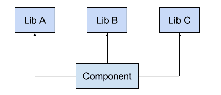
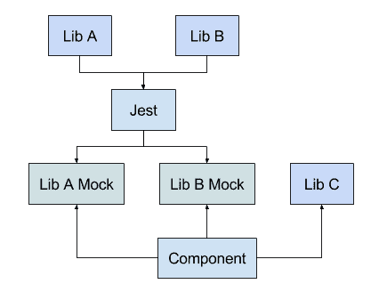
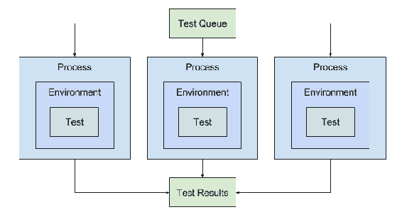

# 四、优化测试驱动的 React 开发

也许，React 生态系统中最重要的工具之一是 Jest—一个测试运行程序和单元测试库，用于测试 React 组件。Jest 是为了克服其他测试框架（如 Jasmine）面临的挑战而设计的，它的创建考虑到了 React 开发。使用功能强大的测试工具（如 Jest），您可以更好地让单元测试影响 React 组件的设计。在本章中，您将学习：

*   Jest 的总体设计理念以及这对 React 开发人员的意义
*   在`create-react-app`环境和独立 React 环境中运行 Jest 单元测试
*   使用 JESTAPI 编写有效的单元测试和套件
*   在代码编辑器中运行 Jest 单元测试，并将测试集成到开发服务器中

# 玩笑的驱动哲学

在上一章中，您了解到创建`create-react-app`工具是为了使开发 React 应用更容易。通过消除前期配置，您可以直接构建组件。Jest 的创建也出于同样的目的，它消除了通常需要创建的前端样板文件，而这些样板文件只是为了开始编写测试。除了删除初始单元测试配置因素外，Jest 还有其他一些技巧。让我们用笑话来回顾一下测试的一些驱动原则。

# 模拟除应用代码之外的所有内容

你最不想花时间测试别人的代码。然而，有时你不得不这么做。例如，假设您想测试一个函数，该函数对某个 HTTP API 进行`fetch()`调用。另一个示例：React 组件使用一些库来帮助设置和操作其状态。

在这两个示例中，有一些代码是在单元测试运行时运行的，但您没有实现。您肯定不想通过 HTTP 与外部系统联系。您肯定不想确保基于另一个库的函数输出正确设置组件的状态。对于我们不想测试的代码，Jest 提供了一个强大的模拟系统。但是你需要在一个你不能嘲笑每一件小事的地方画一条线。

下面是组件及其依赖关系的图示：



此组件需要三个库才能正常工作。您可能不想按原样对该组件进行单元测试，因为您还需要测试其他三个库的功能。您不希望在单元测试期间运行的库可以使用 Jest 进行模拟。你不必嘲笑每一个图书馆，对一些人来说，嘲笑它们可能比它们的价值更麻烦。

例如，假设此场景中的**Lib C**是一个日期库。您真的需要模拟它吗，或者您真的可以在组件测试中使用它生成的值吗？日期库的级别非常低，因此它可能是稳定的，并且对单元测试的功能造成的风险很小。另一方面，库的级别越高，所做的工作越多，单元测试的问题就越大。让我们来看看，如果你决定用笑话来嘲讽 To.T2。



如果您告诉 Jest 您想要模拟**Lib A**和**Lib B**的实现，它可以使用实际的模块并自动创建一个您的测试可以使用的对象。因此，您只需付出很少的努力，就可以模拟对测试代码构成挑战的依赖项。

# 隔离测试并并行运行

Jest 使得在沙盒环境中隔离单元测试变得很容易。换句话说，运行一个测试的副作用不会影响其他测试的结果。每次测试运行完成时，全局环境都会自动为下一次重置。由于测试是独立的，它们的执行顺序无关紧要，Jest 并行运行测试。这意味着，即使您有数百个单元测试，您也可以经常运行它们，而不用担心等待。

以下是 Jest 如何在其自己的隔离环境中并行运行测试的示例：



最好的部分是 Jest 为您处理扩展过程。例如，如果您刚刚开始，并且您的项目只有少数几个单元测试，那么 Jest 不会产生八个并行进程。它将只在一个进程中运行它们。你要记住的关键是单元测试是他们自己的宇宙，没有来自其他宇宙的干扰。

# 测试应该是自然的

Jest 使您可以轻松地开始运行测试，但是编写测试呢？Jest 公开的 API 使编写没有太多活动部件的测试变得容易。API 文件（[https://facebook.github.io/jest/docs/en/api.html](https://facebook.github.io/jest/docs/en/api.html) 被组织成多个部分，便于找到您需要的内容。例如，如果您正在编写测试，并且需要验证预期，那么您可以在 API 文档的*预期*部分中找到所需的函数。或者，您可能需要配置模拟函数的帮助 API 文档中的*模拟函数*部分提供了有关此主题的所有信息。

Jest 真正突出的另一个领域是当您需要测试异步代码时。这通常涉及到与承诺合作。JESTAPI 可以很容易地从已解析或拒绝的承诺中获得特定值，而无需编写大量异步样板文件。正是这些小事情让为 Jest 编写单元测试感觉像是实际应用代码的自然扩展。

# 运行测试

Jest 命令行工具是运行单元测试所需的全部工具。有许多方法可以使用该工具。首先，您将学习如何从`create-react-app`环境调用测试运行程序，以及如何使用交互式监视模式选项。然后，您将学习如何在独立环境中运行 Jest，而无需`create-react-app`的帮助。

# 使用 react 脚本运行测试

当您使用`create-react-app`创建 React 应用时，就可以立即运行测试了。事实上，作为为您创建的样板代码的一部分，为`App`组件创建了一个单元测试。添加此测试是为了让 Jest 找到可以运行的测试。它实际上并不测试应用中任何有意义的内容，因此，一旦添加了更多测试，您可能会删除它。

此外，`create-react-app`将适当的脚本添加到`package.json`文件中以运行测试。您只需在终端中运行以下命令：

```jsx
npm test
```

这实际上将从`react-scripts`调用`test`脚本。这将调用 Jest，Jest 运行它找到的任何测试。在本例中，由于您正在处理一个新的项目，它将只找到`create-react-app`创建的一个测试。以下是运行此测试的输出：

```jsx
PASS  src/App.test.js
  renders without crashing (3ms)

Test Suites: 1 passed, 1 total
Tests:       1 passed, 1 total
Snapshots:   0 total
Time:        0.043s, estimated 1s
```

运行的测试位于`App.test.js`模块中，所有 Jest 测试的文件名中都应该有`test`。一个好的惯例是`ComponentName.test.js`。然后，您可以看到在此模块中运行的测试的列表，它们花费了多长时间，以及它们是通过还是失败。

在底部，Jest 打印运行的摘要信息。这通常是一个很好的起点，因为如果您的所有测试都通过了，您可能不关心任何其他输出。另一方面，当测试失败时，信息越多越好。

来自`react-scripts`的`test`脚本在监视模式下调用 Jest。这意味着您可以选择在更改文件时实际运行哪些测试。以下是命令行上的菜单：

```jsx
Watch Usage
 > Press a to run all tests.
 > Press p to filter by a filename regex pattern.
 > Press t to filter by a test name regex pattern.
 > Press q to quit watch mode.
 > Press Enter to trigger a test run. 
```

当 Jest 在监视模式下运行时，进程不会在所有测试完成后立即退出。相反，它监视测试和组件文件的更改，并在检测到更改时运行测试。这些选项允许您微调发生更改时运行的测试。`p`和`t`选项只有在您有数千个测试且其中许多测试失败时才有用。这些选项有助于在开发过程中深入查找有问题的组件。

默认情况下，当 Jest 检测到更改时，只运行关联的测试。例如，更改测试或组件将导致再次运行测试。随着`npm test`在您的终端中运行，让我们打开`App.test.js`并对测试进行一个小的更改：

```jsx
it('renders without crashing', () => { 
  const div = document.createElement('div'); 
  ReactDOM.render(<App />, div); 
}); 
```

您只需更改测试的名称，使其如下所示，然后保存文件：

```jsx
it('renders the App component', () => { 
  const div = document.createElement('div'); 
  ReactDOM.render(<App />, div); 
}); 
```

现在，看看您让 Jest 在监视模式下运行的终端：

```jsx
PASS  src/App.test.js
  renders the App component (4ms)
```

Jest 检测到单元测试中的更改并运行它，生成更新的控制台输出。现在，让我们介绍一个新组件和一个新测试，看看会发生什么。首先，您将实现一个如下所示的`Repeat`组件：

```jsx
export default ({ times, value }) => 
  new Array(parseInt(times, 10))
    .fill(value)
    .join(' ');
```

此组件采用`times`属性，用于确定重复`value`属性的次数。以下是`App`组件如何使用`Repeat`组件：

```jsx
import React, { Component } from 'react'; 
import logo from './logo.svg'; 
import './App.css'; 
import Repeat from './Repeat'; 

class App extends Component { 
  render() { 
    return ( 
      <div className="App"> 
        <header className="App-header"> 
           
          <h1 className="App-title">Welcome to React</h1> 
        </header> 
        <p className="App-intro"> 
          <Repeat times="5" value="React!" /> 
        </p> 
      </div> 
    ); 
  } 
} 

export default App; 
```

如果您要查看此应用，您将看到字符串`React!`在页面上呈现了五次。您的组件按预期工作，但我们要确保在提交新组件之前添加单元测试。创建一个如下所示的`Repeat.test.js`文件：

```jsx
import React from 'react'; 
import ReactDOM from 'react-dom'; 
import Repeat from './Repeat'; 

it('renders the Repeat component', () => { 
  const div = document.createElement('div'); 
  ReactDOM.render(<Repeat times="5" value="test" />, div); 
}); 
```

这实际上是用于`App`组件的相同单元测试。除了组件可以在不触发某种错误的情况下进行渲染之外，它不会进行太多测试。现在 Jest 有两个组件测试要运行：一个用于`App`和另一个用于`Repeat`。如果查看 Jest 的控制台输出，您将看到两个测试都在运行：

```jsx
PASS  src/App.test.js
PASS  src/Repeat.test.js

Test Suites: 2 passed, 2 total
Tests:       2 passed, 2 total
Snapshots:   0 total
Time:        0.174s, estimated 1s
Ran all test suites related to changed files.
```

请注意此输出中的最后一行。Jest 的默认监视模式是查找尚未提交到源代码管理且已保存的文件。通过忽略已提交的组件和测试，您知道它们没有更改，因此运行这些测试将毫无意义。让我们尝试更改`Repeat`组件，看看会发生什么（实际上您不必更改任何内容，只需保存文件就足以触发笑话）：

```jsx
 PASS  src/App.test.js 
 PASS  src/Repeat.test.js 
```

`App`测试为什么在运行？它已提交，未更改。问题是由于`App`依赖于`Repeat`，对`Repeat`组件的更改可能导致`App`测试失败。

让我们介绍另一个组件和测试，不过这次我们不会介绍任何导入新组件的依赖项。创建一个`Text.js`文件并使用以下组件实现保存：

```jsx
export default ({ children }) => children; 
```

这个`Text`组件将只呈现传递给它的任何子元素或文本。这是一个人为的组成部分，但这并不重要。现在，让我们编写一个测试，验证组件是否按预期返回值：

```jsx
import Text from './text'; 

it('returns the correct text', () => {
  const children = 'test';
  expect(Text({ children })).toEqual(children);
});
```

当`Text()`返回的值等于`children`值时，`toEqual()`断言通过。保存此测试时，请查看 Jest 控制台输出：

```jsx
PASS  src/Text.test.js
  returns the correct text (1ms)

Test Suites: 1 passed, 1 total
Tests:       1 passed, 1 total
```

现在您有了一个没有任何依赖项的测试，Jest 将自己运行它。另外两个测试被签入 Git，因此它知道这些测试不需要运行。你永远不会犯一些没有通过单元测试的错误，对吗？

现在让我们让这个测试失败，看看会发生什么。将`Test`组件更改为如下所示：

```jsx
export default ({ children }) => 1;
```

这将使测试失败，因为它期望组件函数返回传递给`children`属性的值。现在，如果返回 Jest 控制台，输出应该如下所示：

```jsx
FAIL  src/Text.test.js
 ● returns the correct text

   expect(received).toEqual(expected)

   Expected value to equal:
     "test"
   Received:
     1

   Difference:

    Comparing two different types of values. Expected string but 
     received number.
```

测试失败了，正如你所知道的那样。有趣的是，这是唯一一个运行的测试，因为根据 Git 没有任何其他更改。对您的好处是，一旦您有了数百个测试，您就不需要等到所有测试都运行之后，您当前正在工作的组件的失败测试才能运行。

# 使用独立 Jest 运行测试

您在上一节中刚刚了解到的`react-scripts`中的`test`脚本是在构建应用时在后台运行的一个很好的工具。当您实现组件和单元测试时，它会立即提供反馈。

其他时候，您只需要运行所有测试，并在打印结果输出后立即退出流程。例如，如果您正在将 Jest 输出集成到一个连续集成过程中，或者如果您只想看到测试结果运行一次，那么可以直接运行 Jest。

让我们试着自己开玩笑吧。确保您仍在项目目录中，并且已停止运行`npm test`脚本。现在只需运行：

```jsx
jest
```

该命令不是在监视模式下运行 Jest，而是尝试运行所有测试，打印结果输出，然后退出。然而，这种方法似乎存在问题。运行这样的笑话会导致错误：

```jsx
FAIL  src/Repeat.test.js
 ● Test suite failed to run

   04/my-react-app/src/Repeat.test.js: Unexpected token (7:18)
        5 | it('renders the Repeat component', () => {
        6 |   const div = document.createElement('div');
      > 7 |   ReactDOM.render(<Repeat times="5" value="test"...
          |                   ^
        8 | });
```

这是因为`react-scripts`中的`test`脚本为我们设置了很多东西，包括解析和执行 JSX 所需的所有 Jest 配置。既然我们有这个工具，我们就使用它，而不是从头开始配置 Jest。记住，您的目标是在非观察模式下运行一次 Jest。

事实证明，来自`react-scripts`的`test`脚本已经准备好处理持续集成环境。如果它找到一个`CI`环境变量，它将不会在监视模式下运行 Jest。让我们通过导出此变量来尝试：

```jsx
export CI=1
```

现在，当您运行`npm test`时，一切正常。完成所有操作后，流程将退出：

```jsx
PASS  src/Text.test.js
PASS  src/App.test.js
PASS  src/Repeat.test.js

Test Suites: 3 passed, 3 total
Tests:       3 passed, 3 total
Snapshots:   0 total
Time:        1.089s
Ran all test suites.
```

完成后，可以取消设置此环境变量：

```jsx
unset CI 
```

大多数情况下，您可能只是在观看模式下使用笑话。但如果您需要在一个短暂的过程中快速运行测试，您可以临时进入持续集成模式。

# 写笑话测试

既然您知道了如何运行 Jest，那么让我们编写一些单元测试。我们将介绍用于测试 React 应用的 Jest 的基本功能和更高级的功能。我们将开始将您的测试组织成套件和 Jest 中可用的基本断言。然后，您将创建第一个模拟模块并使用异步代码。最后，我们将使用 Jest 的快照机制来帮助测试 React 组件输出。

# 使用套件组织测试

套件是测试的主要组织单元。套件不是玩笑要求`create-react-app`创建的测试不包括套件：

```jsx
it('renders without crashing', () => { 
  ... 
}); 
```

`it()`函数声明通过或失败的单元测试。当您刚开始项目时，您只有几个测试，不需要套件。一旦您进行了几次测试，就应该开始考虑组织了。将套件视为可以将测试放入其中的容器。您可以使用这些容器中的几个来组织您认为合适的测试。通常，套件对应于源模块。以下是您如何申报套房：

```jsx
describe('BasicSuite', () => { 
  it('passes the first test', () => { 
    // Assertions... 
  }); 

  it('passes the second test', () => { 
    // Assertions... 
  }); 
}); 
```

这里使用`describe()`函数来声明一个名为`BasicSuite`的套件。在套件中，我们声明了几个单元测试。使用`describe()`，您可以组织测试，以便在测试结果输出中将相关测试分组在一起。

但是，如果套件是组织测试的唯一可用机制，那么测试将很快变得笨拙。原因是，对于模块中的每个类、方法或函数，通常会有多个测试。因此，您需要一种方法来说明测试实际上属于代码的哪一部分。好消息是，您可以向`describe()`嵌套呼叫，为您的套房提供必要的组织：

```jsx
describe('NestedSuite', () => { 
  describe('state', () => { 
    it('handles the first state', () => { 

    }); 

    it('handles the second state', () => { 

    }); 
  }); 

  describe('props', () => { 
    it('handles the first prop', () => { 

    });
 it('handles the second prop', () => { 

    }); 
  });

 describe('render()', () => { 
    it('renders with state', () => { 

    }); 

    it('renders with props', () => { 

    }); 
  }); 
}); 
```

最外层的`describe()`调用声明了测试套件，它对应于一些顶级代码单元，例如模块。`describe()`的内部调用对应较小的代码单元，如方法和函数。通过这种方式，您可以轻松地为给定的代码编写多个单元测试，同时避免对实际测试内容的混淆。

让我们看一下刚刚创建的测试套件的一些详细输出。要执行此操作，请运行以下操作：

```jsx
npm test -- --verbose
```

第一组双破折号告诉`npm`将后面的任何参数传递给`test`脚本。以下是您将看到的内容：

```jsx
PASS  src/NestedSuite.test.js
 NestedSuite
   state
      handles the first state (1ms)
      handles the second state
   props
      handles the first prop
      handles the second prop
   render()
      renders with state
      renders with props (1ms)

PASS  src/BasicSuite.test.js
 BasicSuite
    passes the first test
    passes the second test
```

在`NestedSuite`下，您可以看到`state`是正在测试的代码，并且已经通过了两个测试。`props`和`render()`的情况也是如此。

# 基本断言

单元测试中的断言是使用 Jest 的 ExpectationAPI 创建的。当代码的期望没有得到满足时，这些函数会触发单元测试失败。当使用此 API 时，测试失败的输出将向您显示除实际发生的情况外，预期会发生的情况。这大大减少了你花在追求价值上的时间。

# 基本平等

您可以使用`toBe()`期望方法断言两个值相同：

```jsx
describe('basic equality', () => { 
  it('true is true', () => { 
    expect(true).toBe(true); 
    expect(true).not.toBe(false); 
  }); 

  it('false is false', () => { 
    expect(false).toBe(false); 
    expect(false).not.toBe(true); 
  }); 
}); 
```

在第一次测试中，您希望`true`等于`true`。然后，在下一行中使用`.not`属性否定这个期望。如果这是一个真正的单元测试，你就不必证明你刚才所做的断言的反面——我这样做是为了说明你的一些选择。

在第二个测试中，我们正在执行相同的断言，但是使用`false`作为期望值。`toBe()`方法使用严格相等来比较其值。

# 近似相等

有些时候，检查代码中某些内容的确切值并没有什么区别，可能需要做的工作比值得做的更多。例如，您可能只需要确保存在一个值。您可能还需要执行反向操作，以确保没有值。JavaScript 术语中的有事对无是**truthy**对**falsy**。

要在 Jest 单元测试中检查 truthy 或 falsy 值，可以分别使用`isTruthy()`或`isFalsy()`方法：

```jsx
describe('approximate equality', () => { 
  it('1 is truthy', () => { 
    expect(1).toBeTruthy(); 
    expect(1).not.toBeFalsy(); 
  }); 

  it('\'\' is falsy', () => { 
    expect('').toBeFalsy(); 
    expect('').not.toBeTruthy(); 
  }); 
});
```

值`1`不是真的，但在布尔比较上下文中使用时，其计算结果为`true`。同样，空字符串的计算结果为`false`，因此被认为是错误的。

# 价值平等

使用对象和数组时，检查相等性可能会很痛苦。您通常不能使用严格相等，因为您正在比较引用，而引用总是不同的。如果要比较的是值，则需要迭代对象或集合，并分别比较值、键和索引。

因为没有一个头脑正常的人愿意做所有这些工作来执行一个简单的测试。Jest 提供了`toEqual()`方法，用于比较对象属性和数组值：

```jsx
describe('value equality', () => { 
  it('objects are the same', () => { 
    expect({ 
      one: 1, 
      two: 2 
    }).toEqual({ 
      one: 1, 
      two: 2, 
    });

    expect({ 
      one: 1, 
      two: 2 
    }).not.toBe({ 
      one: 1, 
      two: 2
 }); 
  }); 

  it('arrays are the same', () => { 
    expect([1, 2]).toEqual([1, 2]); 
    expect([1, 2]).not.toBe([1, 2]); 
  }); 
}); 
```

本例中的每个对象和数组都是唯一的引用。然而，这两个对象和两个数组在属性和值方面是相等的。`toEqual()`方法检查值是否相等。在这之后，我展示了`toBe()`不是你想要的，它返回`false`，因为它在比较引用。

# 收藏中的价值

在玩笑中有更多的断言方法可用，我在本书中没有足够的篇幅来介绍。我鼓励您查看 Jest API 文档的*Expect*部分：[https://facebook.github.io/jest/docs/en/expect.html](https://facebook.github.io/jest/docs/en/expect.html) 。

最后两种断言方法是`toHaveProperty()`和`toContain()`。前者测试对象是否具有给定属性，而后者检查数组是否包含给定值：

```jsx
describe('object properties and array values', () => { 
  it('object has property value', () => { 
    expect({ 
      one: 1, 
      two: 2 
    }).toHaveProperty('two', 2); 

    expect({ 
      one: 1, 
      two: 2 
    }).not.toHaveProperty('two', 3); 
  });
  it('array contains value', () => { 
    expect([1, 2]).toContain(1); 
    expect([1, 2]).not.toContain(3); 
  }); 
}); 
```

当您需要检查对象是否具有特定属性值时，`toHaveProperty()`方法非常有用。当您需要检查数组是否具有特定值时，`toContain()`方法非常有用。

# 使用 mock

编写单元测试时，您正在测试自己的代码。至少是这样。实际上，这比听起来更困难，因为您的代码将不可避免地使用某种库。这是您不想测试的代码。编写调用其他库的单元测试的问题在于，它们通常需要接触到网络或文件系统。您肯定不希望由于其他库的副作用而出现误报。

Jest 提供了一种功能强大、易于使用的模拟机制。您将要模拟的模块的路径提供给 Jest，它将处理其余的模块。在某些情况下，您不需要提供模拟实现。在其他情况下，您需要以与原始模块相同的方式处理参数和返回值。

假设您创建了一个如下所示的`readFile()`函数：

```jsx
import fs from 'fs'; 

const readFile = path => new Promise((resolve, reject) => { 
  fs.readFile(path, (err, data) => { 
    if (err) { 
      reject(err); 
    } else { 
      resolve(data); 
    } 
  }); 
}); 

export default readFile; 
```

此功能需要来自`fs`模块的`readFile()`功能。它返回一个承诺，该承诺在调用传递给`readFile()`的回调函数时解析，除非出现错误。

现在您想为这个函数编写一个单元测试。您希望做出如下断言：

*   它叫`fs.readFile()`吗？
*   返回的承诺是否解析为正确的值？
*   当传递给`fs.readFile()`的回调收到错误时，返回的承诺是否拒绝？

您可以通过开玩笑模仿`fs.readFile()`来执行所有这些断言，而不依赖于它的实际实现。你不必对外部因素做任何假设；你只关心你的代码按照你期望的方式工作。

因此，让我们来为这个函数实现一些测试，使用一个嘲弄的 To0T0 实现：

```jsx
import fs from 'fs'; 
import readFile from './readFile'; 

jest.mock('fs'); 

describe('readFile', () => { 
  it('calls fs.readFile', (done) => { 
    fs.readFile.mockReset(); 
    fs.readFile.mockImplementation((path, cb) => { 
      cb(false); 
    }); 

    readFile('file.txt') 
      .then(() => { 
        expect(fs.readFile).toHaveBeenCalled(); 
        done(); 
      }); 
  }); 

  it('resolves a value', (done) => { 
    fs.readFile.mockReset(); 
    fs.readFile.mockImplementation((path, cb) => { 
      cb(false, 'test'); 
    }); 

    readFile('file.txt') 
      .then((data) => { 
        expect(data).toBe('test'); 
        done(); 
      }); 
  }); 

  it('rejects on error', (done) => { 
    fs.readFile.mockReset(); 
    fs.readFile.mockImplementation((path, cb) => { 
      cb('failed'); 
    }); 

    readFile() 
      .catch((err) => { 
        expect(err).toBe('failed'); 
        done(); 
      }); 
  }); 
}); 
```

通过调用`jest.mock('fs')`创建`fs`模块的模拟版本。请注意，您实际上在模拟之前导入了真实的`fs`模块，并且在任何测试实际使用它之前，它已经被模拟了。在每个测试中，我们都会创建一个自定义的`fs.readFile()`实现。默认情况下，Jest 模拟的函数实际上不会做任何事情。这很少足以测试大多数东西。mock 的美妙之处在于，您可以控制代码使用的库的结果，并且您的测试断言确保您的代码能够相应地处理所有事情。

您通过将其作为函数传递给`mockImplementation()`方法来提供实现。但在执行此操作之前，始终确保调用`mockReset()`以清除有关模拟的任何存储信息，例如调用了多少次。例如，第一个测试有断言`expect(fs.readFile).toHaveBeenCalled()`。您可以将模拟函数传递给`expect()`，Jest 提供了知道如何使用它们的方法。

类似的功能也可以遵循相同的模式。以下是`readFile()`的对应项：

```jsx
import fs from 'fs'; 

const writeFile = (path, data) => new Promise((resolve, reject) => { 
  fs.writeFile(path, data, (err) => { 
    if (err) { 
      reject(err); 
    } else { 
      resolve(); 
    } 
  }); 
}); 

export default writeFile; 
```

`readFile()`和`writeFile()`之间有两个重要区别：

*   `writeFile()`函数接受数据写入文件的第二个参数。此参数也传递给`fs.writeFile()`。
*   `writeFile()`函数不解析值，而`readFile()`解析已读取的文件数据。

这两个差异对您创建的模拟实现有影响。现在让我们来看看它们：

```jsx
import fs from 'fs'; 
import writeFile from './writeFile'; 

jest.mock('fs'); 

describe('writeFile', () => { 
  it('calls fs.writeFile', (done) => { 
    fs.writeFile.mockReset(); 
    fs.writeFile.mockImplementation((path, data, cb) => { 
      cb(false); 
    }); 

    writeFile('file.txt') 
      .then(() => { 
        expect(fs.writeFile).toHaveBeenCalled(); 
        done(); 
      }); 
  }); 

  it('resolves without a value', (done) => { 
    fs.writeFile.mockReset(); 
    fs.writeFile.mockImplementation((path, data, cb) => { 
      cb(false, 'test'); 
    }); 

    writeFile('file.txt', test) 
      .then(() => { 
        done(); 
      }); 
  }); 

  it('rejects on error', (done) => { 
    fs.writeFile.mockReset(); 
    fs.writeFile.mockImplementation((path, data, cb) => { 
      cb('failed'); 
    });
 writeFile() 
      .catch((err) => { 
        expect(err).toBe('failed'); 
        done(); 
      }); 
  }); 
}); 
```

`data`参数现在需要是 mock 实现的一部分；否则，将无法访问`cb`参数并调用回调。

在`readFile()`和`writeFile()`测试中，您必须处理异步性。这就是我们在`then()`回调中执行断言的原因。当我们完成测试时，将调用从`it()`传入的`done()`函数。如果忘记调用`done()`，测试将挂起，最终超时并失败。

# 单元测试覆盖率

Jest 内置了对测试覆盖率报告的支持。将其作为测试框架的一部分很好，因为并非所有测试框架都有这种支持。如果您想查看您的测试覆盖率，只需在启动 Jest 时通过`--coverage`选项，如下所示：

```jsx
npm test -- --coverage 
```

执行此操作时，测试将正常运行。然后，Jest 中的 coverage tool 将计算出您的测试对源代码的覆盖程度，并生成如下所示的报告：

```jsx
----------|--------|----------|---------|---------|----------------|
File      |% Stmts | % Branch | % Funcs | % Lines |Uncovered Lines |
----------|--------|----------|---------|---------|----------------|
All files |   2.17 |        0 |    6.25 |    4.55 |                |
 App.js   |    100 |      100 |     100 |     100 |                |
 index.js |      0 |        0 |       0 |       0 |  1,2,3,4,5,7,8 |
----------|--------|----------|---------|---------|----------------|
```

如果你想提高你的保险范围，请看一下报告中的`Uncovered Lines`栏。其他列告诉您测试所涵盖的代码类型：语句、分支和函数。

# 异步断言

Jest 预计您将有异步代码进行测试。这就是为什么它提供了 API，使编写单元测试的这一方面感觉自然。在上一节中，我们编写了在`then()`回调中执行断言的测试，并在所有异步测试完成后调用`done()`。在本节中，我们将研究另一种方法。

Jest 允许您从单元测试函数返回承诺期望，并将相应地处理它们。让我们重构您在上一节中编写的`readFile()`测试：

```jsx
import fs from 'fs'; 
import readFile from './readFile'; 

jest.mock('fs'); 

describe('readFile', () => { 
  it('calls fs.readFile', () => { 
    fs.readFile.mockReset(); 
    fs.readFile.mockImplementation((path, cb) => { 
      cb(false); 
    });
return readFile('file.txt') 
      .then(() => { 
        expect(fs.readFile).toHaveBeenCalled(); 
      }); 
  }); 

  it('resolves a value', () => { 
    fs.readFile.mockReset(); 
    fs.readFile.mockImplementation((path, cb) => { 
      cb(false, 'test'); 
    }); 

    return expect(readFile('file.txt')) 
      .resolves 
      .toBe('test'); 
  }); 

  it('rejects on error', () => { 
    fs.readFile.mockReset(); 
    fs.readFile.mockImplementation((path, cb) => { 
      cb('failed'); 
    }); 

    return expect(readFile()) 
      .rejects 
      .toBe('failed'); 
  }); 
}); 
```

现在，测试回报了承诺。当一个承诺被返回时，Jest 将等待它得到解决，然后再捕获测试结果。您还可以传递`expect()`承诺，并使用`resolves`和`rejects`对象来执行断言。这样，您就不必依赖`done()`函数来指示测试的异步部分已经完成。

`rejects`物品在这里特别有价值。确保函数按预期拒绝是很重要的。但是没有`rejects`，这是不可能的。在本测试的前一个版本中，如果您的代码在应该拒绝时由于某种原因被解析，则无法检测到这一点。如果出现这种情况，使用`rejects`会导致测试失败。

# 反应组件快照

React 组件渲染输出。当然，您需要部分组件单元测试来确保创建正确的输出。一种方法是将组件呈现给基于 JS 的 DOM，然后对呈现的输出执行单独的断言。至少可以说，这是一次痛苦的考试写作经历。

快照测试允许您生成渲染组件输出的*快照*。然后，每次运行测试时，都会将输出与快照进行比较。如果某些东西看起来不一样，测试就会失败。

让我们修改`create-react-app`为您添加的`App`组件的默认测试，使其使用快照测试。以下是最初的测试结果：

```jsx
import React from 'react'; 
import ReactDOM from 'react-dom'; 
import App from './App'; 

it('renders without crashing', () => { 
  const div = document.createElement('div'); 
  ReactDOM.render(<App />, div); 
}); 
```

此测试实际上并没有验证所呈现内容的任何内容，只是没有抛出错误。如果你做出的改变导致了意想不到的事情，你永远不会知道。以下是同一测试的快照版本：

```jsx
import React from 'react'; 
import renderer from 'react-test-renderer'; 
import App from './App'; 

it('renders without crashing', () => { 
  const tree = renderer 
    .create(<App />) 
    .toJSON(); 

  expect(tree).toMatchSnapshot(); 
}); 
```

在这个测试运行之前，我必须安装`react-test-renderer`包：

```jsx
npm install react-test-renderer --save-dev
```

也许有一天这会被添加到`create-react-app`中。同时，您必须记住安装它。然后，您的测试可以导入测试呈现器并使用它创建 JSON 树。这是渲染组件内容的表示形式。接下来，您希望树与第一次运行此测试时使用`toMatchSnapshot()`断言创建的快照相匹配。

这意味着第一次运行测试时，它将始终通过，因为这是首次创建快照时。快照文件是应该提交到项目的源代码管理系统的工件，就像单元测试源代码本身一样。这样，在项目中工作的其他人员在运行您的测试时将有一个快照文件。

快照测试的误导之处在于，它给人的印象是，您实际上无法更改组件以生成不同的输出。事实上，更改组件生成的输出将导致快照测试失败。不过，这并不是一件坏事，因为它迫使您在每次更改时查看组件渲染的内容。

让我们更改`App`组件，使其增加对`started`的强调：

```jsx
<p className="App-intro"> 
  To get <em>started</em>, edit <code>src/App.js</code> and save to  
  reload. 
</p> 
```

现在，如果您运行测试，您会遇到如下失败：

```jsx
Received value does not match stored snapshot 1\. 

- Snapshot 
+ Received 

 @@ -16,11 +16,15 @@ 
    </h1> 
    </header> 
    <p 
       className="App-intro" 
    > 
-    To get started, edit  
+    To get  
+    <em> 
+      started 
+    </em> 
+    , edit  
```

哇！这是有用的。一个统一的 diff 会准确地显示组件输出的变化。您可以查看此输出并确定这正是您希望看到的更改，或者您犯了错误，需要去修复它。一旦您对新输出感到满意，就可以通过向`test`脚本传递参数来更新存储的快照：

```jsx
npm test -- --updateSnapshot
```

这将在运行测试之前更新存储的快照，任何失败的快照测试现在都将通过，因为它们满足其输出预期：

```jsx
PASS  src/App.test.js
  renders without crashing (12ms)

Snapshot Summary
 > 1 snapshot updated in 1 test suite.

 Test Suites: 1 passed, 1 total
 Tests:       1 passed, 1 total
 Snapshots:   1 updated, 1 total
 Time:        0.631s, estimated 1s 
```

Jest 告诉您，快照在运行任何测试之前已更新，这是传递`--updateSnapshot`参数的结果。

# 总结

在本章中，您学习了笑话。您了解到 Jest 的关键驱动原则是创建有效的模拟、测试隔离和并行执行以及易用性。然后您了解到，`react-scripts`通过提供一些与 Jest 一起使用的基本配置，使运行单元测试变得更加容易。

当运行 Jest 时，您看到通过`react-scripts`运行 Jest 时，默认的模式是观察模式。当您有很多测试时，监视模式特别有用，这些测试不需要每次更改源代码时都运行，只执行相关的测试。

接下来，在单元测试中执行一些基本断言。然后，您为`fs`模块创建了一个模拟，并对模拟的函数执行断言，以确保它们按预期使用。然后，您对这些测试进行了改进，以利用 Jest 固有的异步功能。单元测试覆盖率报告内置于 Jest 中，您通过传递附加参数了解了如何查看此报告。

在下一章中，您将学习如何使用流创建类型安全组件。