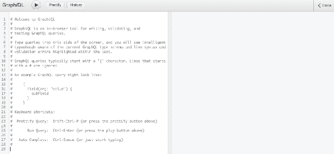
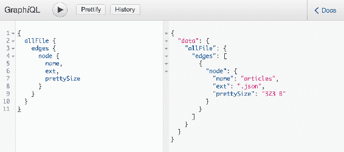
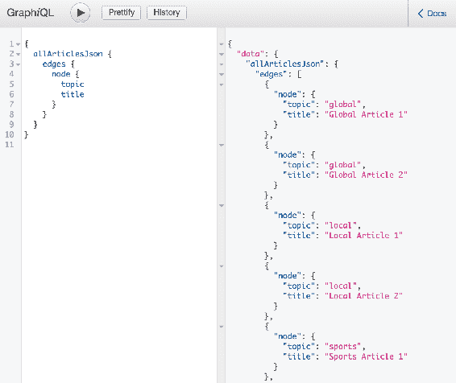
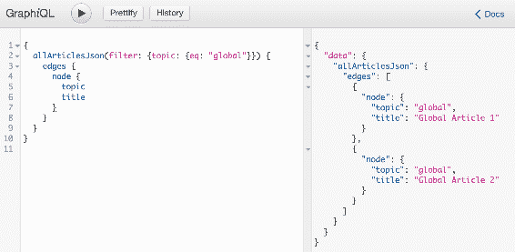
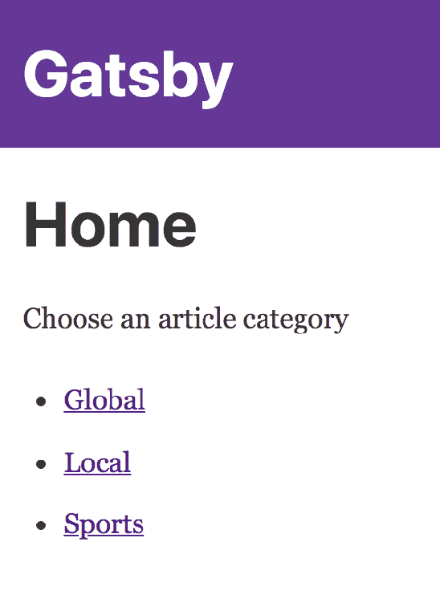

# 十、使用 Gatsby 构建和部署静态 React 站点

盖茨比是一个静态的网站生成工具的开发者。本质上，此工具允许您构建 React 组件并捕获其渲染输出以用作静态站点内容。然而，盖茨比将静态站点生成提升到了一个新的水平。特别是，它提供了一些机制来获取您的网站数据，并将其转换为更容易被 React 组件使用的 GraphQL。盖茨比可以处理任何事情，从单页宣传册网站到跨越数百页的网站。

以下是您将在本章学到的内容：

*   为什么要使用 React 组件构建静态站点
*   使用启动器构建简单的盖茨比站点
*   使用本地文件系统中的数据
*   使用来自黑客新闻的远程数据

# 为什么是静态站点？

在开始使用盖茨比构建静态网站之前，让我们先简要讨论一下为什么要这样做。这里有三个关键因素——我们现在将逐一介绍。

# React 应用的类型

React 具有互动性强、数据变化大的应用的内涵。这可能适用于某些应用，甚至可能是大多数应用，但仍有一些情况下，用户查看的静态数据信息不会更改或很少更改。

考虑一个博客。典型的流程是，作者发布一些内容，然后将这些内容提供给访问网站的任何人，然后这些人可以查看这些内容。常见的情况是，一旦内容发布，它将保持不变，或者保持静态。不常见的情况是，作者对他们的帖子进行更新，但即使如此，这也是一种罕见的行为。现在，想想你典型的博客发布平台。每次读者访问您博客上的某个页面时，都会执行数据库查询，必须组装内容，等等。问问自己，如果每次的结果都是一样的，那么发出所有这些查询真的有意义吗？

让我们看另一个例子。你有一个企业风格的应用——一个拥有大量数据和大量功能的大型应用。该应用的一部分侧重于用户交互添加/更改数据以及与近实时数据交互。该应用的另一部分基于数据库查询生成报告，并基于数据的历史快照生成图表。此企业应用的后一部分似乎不会与频繁更改的数据交互，或者根本不会。也许，该应用可以分为两个应用：一个用于处理用户与生动数据的交互，另一个用于生成不经常更改或根本不更改的静态内容。

您可能正在构建一个应用或更大应用的一部分，其中大部分数据都是静态数据。如果是这样，您可能可以使用像盖茨比这样的工具来生成静态呈现的内容。但为什么要这样做呢？有什么好处？

# 更好的用户体验

构建 React 组件的静态版本的最重要原因是为用户提供更好的体验。这里的关键指标是整体性能改进。不必接触各种 API 端点并处理向 React 组件提供数据的所有异步方面，所有内容都是预先加载的。

静态构建的 React 内容对用户体验的另一个不太明显的改进是，由于活动部件较少，所以网站被破坏的可能性较小，从而导致用户沮丧。例如，如果您的 React 组件不必通过网络获取数据，则此故障向量将完全从您的站点中删除。

# 有效利用资源

Gatsby 静态编译的组件知道如何有效利用它们所消耗的 GraphQL 资源。GraphQL 的一大优点是，工具很容易在编译时解析和生成高效代码。如果您想在继续《盖茨比》之前对 GraphQL 进行更深入的介绍，可以在这里找到一个好的介绍：[http://graphql.org/learn/](http://graphql.org/learn/) 。

静态 Gatsby React 应用帮助减少资源消耗的另一个地方是后端。这些应用不会不断地访问每次返回相同响应的 API 端点。这是同一个 API 和数据库可以用来服务实际需要动态数据或正在生成新数据的请求的时间。

# 建立你的第一个盖茨比网站

使用 Gatsby 的第一步是全局安装命令行工具：

```jsx
npm install gatsby-cli -g  
```

现在，您可以运行命令行工具来生成您的盖茨比项目，这与`create-react-app`的工作方式类似。`gatsby`命令有两个参数：

*   新项目的名称
*   盖茨比初学者存储库的 URL

项目名称基本上是为保存所有项目文件而创建的文件夹的名称。盖茨比入门有点像一个模板，让你更容易上手，尤其是当你在学习的时候。如果未通过启动器，则使用默认启动器：

```jsx
gatsby new your-first-gatsby-site
```

运行上述命令与运行以下命令相同：

```jsx
gatsby new your-first-gatsby-site https://github.com/gatsbyjs/gatsby-starter-default
```

在这两种情况下，starter 存储库都被克隆到`your-first-gatsby-site`目录中，然后为您安装依赖项。如果一切顺利，您应该会看到控制台输出，它看起来类似于：

```jsx
info Creating new site from git: https://github.com/gatsbyjs/gatsby-starter-default.git
Cloning into 'your-first-gatsby-site'...
```

```jsx
success Created starter directory layout
info Installing packages...
added 1540 packages from 888 contributors in 29.528s  
```

现在您可以切换到`your-first-gatsby-site`目录并启动开发服务器：

```jsx
cd your-first-gatsby-site
gatsby develop
```

这将在项目中启动盖茨比开发服务器。再一次，这类似于`create-react-app`的工作方式—零配置需要处理，而 Webpack 被设置为只工作。启动开发服务器后，您应该在控制台上看到如下输出：

```jsx
success delete html and css files from previous builds - 0.007 s
success open and validate gatsby-config.js - 0.004 s
success copy gatsby files - 0.014 s
success onPreBootstrap - 0.011 s
success source and transform nodes - 0.022 s
success building schema - 0.070 s
success createLayouts - 0.020 s
success createPages - 0.000 s
success createPagesStatefully - 0.014 s
success onPreExtractQueries - 0.000 s
success update schema - 0.044 s
success extract queries from components - 0.042 s
success run graphql queries - 0.024 s
success write out page data - 0.003 s
success write out redirect data - 0.001 s
success onPostBootstrap - 0.001 s

info bootstrap finished - 1.901 s

DONE  Compiled successfully in 3307ms                                          
```

您现在可以通过导航到`http://localhost:8000/`在浏览器中查看`gatsby-starter-default`。

查看浏览器 IDE 中的 GraphiQL，以探索站点的数据和模式
`http://localhost:8000/___graphql`。

请注意，开发构建没有经过优化。要创建生产构建，请使用`gatsby build`：

```jsx
WAIT  Compiling... 

DONE  Compiled successfully in 94ms 
```

如果您在 web 浏览器中访问`http://localhost:8000/`，您应该会看到默认内容：


默认启动程序创建多个页面，以便您可以查看如何将页面链接在一起。如果单击“转到第 2 页”链接，您将进入网站的下一页，如下所示：


下面是您默认的 Gatsby starter 项目的结构：

```jsx
├── LICENSE
├── README.md
├── gatsby-browser.js
├── gatsby-config.js
├── gatsby-node.js
├── gatsby-ssr.js
├── package-lock.json
├── package.json
├── public
│   ├── index.html
│   ├── render-page.js.map
│   └── static
└── src
 ├── components
 │   └── Header
```

```jsx
 │       └── index.js
 ├── layouts
 │   ├── index.css
 │   └── index.js
 └── pages
 ├── 404.js
 ├── index.js
 └── page-2.js  
```

对于基本的网站设计和编辑，您将主要关注`src`下的文件和目录。让我们来看看你在这里要做的工作，首先从 Tobe T1 组件开始：

```jsx
import React from 'react' 
import Link from 'gatsby-link' 

const Header = () => ( 
  <div 
    style={{ 
      background: 'rebeccapurple', 
      marginBottom: '1.45rem', 
    }} 
  > 
    <div 
      style={{ 
        margin: '0 auto', 
        maxWidth: 960, 
        padding: '1.45rem 1.0875rem', 
      }} 
    > 
      <h1 style={{ margin: 0 }}> 
        <Link 
          to="/" 
          style={{ 
            color: 'white', 
            textDecoration: 'none', 
          }} 
        > 
          Gatsby 
        </Link> 
      </h1> 
    </div> 
  </div> 
) 

export default Header 
```

此组件定义紫色标题部分。标题现在是静态的，它链接到主页，并定义一些内联样式。接下来我们来看`layouts/index.js`文件：

```jsx
import React from 'react' 
import PropTypes from 'prop-types' 
import Helmet from 'react-helmet' 

import Header from '../components/Header' 
import './index.css' 

const TemplateWrapper = ({ children }) => ( 
  <div> 
    <Helmet 
      title="Gatsby Default Starter" 
      meta={[ 
        { name: 'description', content: 'Sample' }, 
        { name: 'keywords', content: 'sample, something' }, 
      ]} 
    /> 
    <Header /> 
    <div 
      style={{ 
        margin: '0 auto', 
        maxWidth: 960, 
        padding: '0px 1.0875rem 1.45rem', 
        paddingTop: 0, 
      }} 
    > 
      {children()} 
    </div> 
  </div> 
) 

TemplateWrapper.propTypes = { 
  children: PropTypes.func, 
} 

export default TemplateWrapper 
```

此模块导出一个`TemplateWrapper`组件。该组件的工作是定义站点的布局。与您可能已经实现的其他容器组件一样，此组件将呈现在站点的每个页面上。这类似于你对`react-router`所做的，除了盖茨比，路由是为你处理的。例如，处理指向`page-2`的链路的路由由盖茨比自动创建。同样，盖茨比会自动为您处理此布局模块，方法是确保站点上的每个页面都呈现该模块。你所要做的就是确保它看起来像你想要的那样，并且`children()`函数被呈现出来。现在，你可以保持原样。

您还会注意到，布局模块还导入了一个样式表，其中包含与站点布局相关的样式。

现在我们来看一下页面组件，从`index.js`开始：

```jsx
import React from 'react' 
import Link from 'gatsby-link' 

const IndexPage = () => ( 
  <div> 
    <h1>Hi people</h1> 
    <p>Welcome to your new Gatsby site.</p> 
    <p>Now go build something great.</p> 
    <Link to="/page-2/">Go to page 2</Link> 
  </div> 
) 

export default IndexPage 
```

就像普通的 HTML 站点有一个`index.html`文件一样，静态的盖茨比站点有一个`index.js`页面，该页面可以导出要在主页上呈现的内容，这一点很重要。此处定义的`IndexPage`组件呈现一些基本 HTML，包括指向`page-2`的链接。下面我们来看`page-2.js`：

```jsx
import React from 'react' 
import Link from 'gatsby-link' 

const SecondPage = () => ( 
  <div> 
    <h1>Hi from the second page</h1> 
    <p>Welcome to page 2</p> 
    <Link to="/">Go back to the homepage</Link> 
  </div> 
)
export default SecondPage 
```

此页面看起来与主页非常相似。此处呈现的链接将用户带回主页。

这只是一个基本的介绍，让你与盖茨比合作。您没有使用任何数据源生成内容；您将在下一节中完成此操作。

# 添加本地文件系统数据

在上一节中，您了解了如何建立和运行一个基本的盖茨比网站。这个网站不是很有趣，因为没有数据驱动它。例如，驱动博客的数据是存储在数据库中的博客条目内容。呈现帖子列表和帖子本身的博客框架使用此数据呈现标记。

你可以用盖茨比做同样的事情，但要用更复杂的方式。首先，标记（或者在本例中为 React 组件）静态构建并绑定一次。然后将这些构建提供给用户，而无需查询数据库或 API。其次，盖茨比使用的插件体系结构意味着你不局限于一个数据源，不同的数据源通常是组合在一起的。最后，GraphQL 是位于所有这些之上的查询抽象，它将数据交付给 React 组件。

要开始，您需要一个数据源来驱动网站的内容。我们现在将保持简单，并使用本地 JSON 文件作为源。为此，您需要安装`gatsby-source-filesystem`插件：

```jsx
npm install --save gatsby-source-filesystem
```

安装此软件包后，您可以通过编辑`gatsby-config.js`文件将其添加到项目中：

```jsx
plugins: [ 
  // Other plugins... 
  { 
    resolve: 'gatsby-source-filesystem', 
    options: { 
      name: 'data', 
      path: '${__dirname}/src/data/', 
    }, 
  }, 
] 
```

`name`选项告诉 GraphQL 后端如何组织查询结果。在这种情况下，所有内容都属于`data`属性。路径选项限制哪些文件是可读的。本例中使用的路径是`src/data`——可以随意将文件放入该目录，以便查询。

此时，您可以继续启动 Gatsby 开发服务器。GraphiQL 实用程序可在`http://localhost:8000/___graphql`访问。在开发盖茨比网站时，您将经常使用此工具，因为它允许您创建临时 GraphQL 查询并动态执行它们。首次加载此接口时，您将看到如下内容：



左边的面板是编写 GraphQL 查询的地方，单击上面的 Play 按钮执行查询，右边的面板显示查询结果。右上角的 docs 链接是探索 Gatsby 为您创建的可用 GraphQL 类型的有用方法。此外，右侧的“查询编辑器”窗格将在您键入时自动完成，以帮助简化生成查询。

让我们执行第一个查询，其中列出了有关文件系统上文件的信息。请记住，`src/data`中至少需要一个文件才能让查询返回任何结果。以下是如何查询数据目录中文件的名称、扩展名和大小：



如您所见，查询中指定了特定的节点字段。右侧面板中的结果显示您得到了所需的确切字段。GraphQLs 的部分吸引力在于，您可以创建跨越多个后端数据源的任意嵌套复杂查询。然而，深入研究 GraphQL 的细节远远超出了本书的范围。盖茨比主页（[https://www.gatsbyjs.org/](https://www.gatsbyjs.org/) ）有一些关于 GraphQL 的优秀资源，包括指向其他 GraphQL 教程和文档的链接。

这里的要点是`gatsby-source-filesystem`数据源插件为您完成了所有繁重的 GraphQL 提升。它会为您生成整个模式，这意味着您一旦安装了插件，就可以启动开发服务器并立即使用 autocomplete 和文档进行实验。

继续这个示例，您可能不需要在 UI 中呈现本地文件数据。那么让我们创建一个包含一些 JSON 内容的`articles.json`文件：

```jsx
[ 
  { "topic": "global", "title": "Global Article 1" }, 
  { "topic": "global", "title": "Global Article 2" }, 
  { "topic": "local", "title": "Local Article 1" }, 
  { "topic": "local", "title": "Local Article 2" }, 
  { "topic": "sports", "title": "Sports Article 1" }, 
  { "topic": "sports", "title": "Sports Article 2" } 
]
```

这个 JSON 结构是一个具有`topic`和`title`属性的 article 对象数组。这是要使用 GraphQL 查询的数据。为此，您需要安装另一个盖茨比插件：

```jsx
npm install --save gatsby-transformer-json
```

`gatsby-transformer-json`插件来自另一类盖茨比插件。源插件负责向 Gatsby 提供数据，而 transformers 负责通过 GraphQL 查询数据。就像您想要使用的任何插件一样，您需要将其添加到项目配置中：

```jsx
plugins: [ 
  // Other plugins... 
  'gatsby-transformer-json', 
], 
```

现在您的数据目录中有一个包含 JSON 内容的文件，并且安装并启用了`gatsby-transformer-json`插件，您可以返回 GraphiQL 并查询 JSON 内容：



`gatsby-transformer-json`插件使`allArticlesJson`查询成为可能，因为它基于在数据源中找到的 JSON 数据为您定义了 GraphQL 模式。在`node`下，您可以请求特定的属性，就像您在任何其他 GraphQL 查询中一样。在结果中，您将获得查询要求的所有 JSON 数据。

在本例中，假设您需要三个单独的页面来列出文章，按主题组织。您需要一种方法来过滤查询返回的节点。您可以直接将过滤器添加到 GraphQL 语法中。例如，要仅查找全局文章，请执行以下查询：



这一次，过滤器参数被传递到`allArticlesJson`查询。这里，查询请求主题值为 global 的节点。果然，带有全局主题的文章会在结果中返回。

GraphiQL 实用程序允许您设计 GraphQL 查询，然后您的 React 组件可以使用该查询。一旦查询返回了正确的结果，就可以简单地将其复制到组件中。最后一个查询返回全局文章，因此您可以将其与用于`pages/global.js`页面的组件一起使用：

```jsx
import React from 'react' 
import Link from 'gatsby-link' 

export default ({ data: { allArticlesJson: { edges } } }) => ( 
  <div>
    <h1>Global Articles</h1> 
    <Link to="/">Home</Link> 
    <ul> 
      {edges.map(({ node: { title } }) => ( 
        <li key={title}>{title}</li> 
      ))} 
    </ul> 
  </div> 
) 

export const query = graphql' 
  query GlobalArticles { 
    allArticlesJson(filter: { topic: { eq: "global" } }) { 
      edges { 
        node { 
          topic 
          title 
        } 
      } 
    } 
  } 
'
```

本模块中有两件事需要注意。首先，查看传递给组件的参数，并注意它如何匹配您在 GraphiQL 中看到的结果数据。然后使用此数据呈现全局文章标题列表。接下来，请注意`query`导出字符串。在构建期间，Gatsby 将找到这个字符串并执行适当的 GraphQL 查询，以便您的组件具有结果的静态快照。

鉴于您现在知道如何筛选全局文章，您现在可以更新`pages/local.js`页面的筛选器：

```jsx
import React from 'react' 
import Link from 'gatsby-link' 

export default ({ data: { allArticlesJson: { edges } } }) => ( 
  <div> 
    <h1>Local Articles</h1> 
    <Link to="/">Home</Link> 
    <ul> 
      {edges.map(({ node: { title } }) => ( 
        <li key={title}>{title}</li> 
      ))} 
    </ul> 
  </div> 
)
export const query = graphql' 
  query LocalArticles { 
    allArticlesJson(filter: { topic: { eq: "local" } }) { 
      edges { 
        node { 
          topic 
          title 
        } 
      } 
    } 
  } 
' 
```

以下是`pages/sports.js`页面的外观：

```jsx
import React from 'react' 
import Link from 'gatsby-link' 

export default ({ data: { allArticlesJson: { edges } } }) => ( 
  <div> 
    <h1>Sports Articles</h1> 
    <Link to="/">Home</Link> 
    <ul> 
      {edges.map(({ node: { title } }) => ( 
        <li key={title}>{title}</li> 
      ))} 
    </ul> 
  </div> 
) 

export const query = graphql' 
  query SportsArticles { 
    allArticlesJson(filter: { topic: { eq: "sports" } }) { 
      edges { 
        node { 
          topic 
          title 
        } 
      } 
    } 
  } 
' 
```

您可能已经注意到这三个组件看起来非常相似。这是因为它们都使用相同的数据。他们唯一独特的地方就是他们的头衔。为了减少一些冗余，您可以创建一个高阶组件，该组件接受一个`name`参数并返回每个页面上使用的相同底层组件：

```jsx
import React from 'react' 
import Link from 'gatsby-link' 

export default title => ({ data: { allArticlesJson: { edges } } }) => ( 
  <div> 
    <h1>{title}</h1> 
    <Link to="/">Home</Link> 
    <ul> 
      {edges.map(({ node: { title } }) => ( 
        <li key={title}>{title}</li> 
      ))} 
    </ul> 
  </div> 
) 
```

然后，你可以这样使用它：

```jsx
import React from 'react' 
Import ArticleList from '../components/ArticleList' 

export default ArticleList('Global Articles') 

export const query = graphql' 
  query GlobalArticles { 
    allArticlesJson(filter: { topic: { eq: "global" } }) { 
      edges { 
        node { 
          topic 
          title 
        } 
      } 
    } 
  } 
'
```

为了查看所有这些页面，您需要一个链接到每个页面的索引页面：

```jsx
import React from 'react' 
import Link from 'gatsby-link' 

const IndexPage = () => ( 
  <div> 
    <h1>Home</h1> 
    <p>Choose an article category</p> 
    <ul> 
      <li> 
        <Link to="/global/">Global</Link> 
      </li>
      <li> 
        <Link to="/local/">Local</Link> 
      </li>

      <li> 
        <Link to="/sports/">Sports</Link> 
      </li> 
    </ul> 
  </div> 
) 

export default IndexPage 
```

以下是主页的外观：



如果您要单击其中一个主题链接，例如 Global，您将进入一个文章列表页面：


# 获取远程数据

盖茨比有一个丰富的数据源插件生态系统，我们没有时间浏览所有这些插件。盖茨比源插件在构建时接触到另一个系统并通过网络获取数据是很常见的。`gatsby-source-hacker-news`插件是一个很好的插件，您可以从中了解 Gatsby 的抓取过程。

我们将使用[创建的演示，而不是使用盖茨比构建自己的黑客新闻网站 https://github.com/ajayns](https://github.com/ajayns) 。首先，您可以克隆到他的回购协议中，如下所示：

```jsx
git clone https://github.com/ajayns/gatsby-hacker-news.git
cd gatsby-hacker-news
```

然后可以安装依赖项，包括`gatsby-source-hacker-news`插件：

```jsx
npm install
```

您不需要编辑项目配置来启用任何功能，因为这已经是一个盖茨比项目。只需像在本章中所做的那样启动开发服务器：

```jsx
gatsby develop
```

与您在本章中研究过的其他网站相比，这次构建需要更长的时间才能完成。这是因为盖茨比必须通过网络获取数据。还有更多的资源需要获取。如果查看开发服务器的控制台输出，您应该看到以下内容：

```jsx
success onPreBootstrap - 0.011 s
 starting to fetch data from the Hacker News GraphQL API. Warning, this can take a long time e.g. 10-20 seconds
 source and transform nodesfetch HN data: 10138.119ms
```

这表明由于加载黑客新闻数据所需的工作，构建将花费更长的时间。此过程完成后，您可以在浏览器中加载网站。您应该看到类似以下内容：


让我们来看看加载用于渲染这个内容的数据的图形 QQL 查询。在`index.js`页面中，您会发现以下查询：

```jsx
query PageQuery { 
  allHnStory(sort: { fields: [order] }, limit: 10) { 
    edges { 
      node { 
        ...Story 
      } 
    } 
  } 
} 
```

没有指定单个节点字段，而是有`...Story`。这被称为**片段**，在`StoryItem`组件中定义：

```jsx
fragment Story on HNStory { 
  id 
  title 
  score 
  order 
  domain 
  url 
  by 
  descendants 
  timeISO(fromNow: true) 
} 
```

`StoryItem`组件定义此 GraphQL 片段，因为它使用此数据。现在，让我们转到 GraphiQL，将此查询放在一起并执行它：


这就是网站主页加载从 Hack News API 获取的数据的方式。以下是主页组件的外观：

```jsx
import React from 'react' 

import StoryItem from '../components/story-item' 

const IndexPage = ({ data, active }) => ( 
  <div> 
    <div> 
      {data.allHnStory.edges.map(({ node }) => ( 
        <StoryItem key={node.id} story={node} active={false} /> 
      ))} 
    </div> 
  </div> 
) 

export default IndexPage 
```

返回数据的边缘映射到`StoryItem`组件，并传入数据节点。以下是`StoryItem`组件的外观：

```jsx
import React, { Component } from 'react'; 
import Link from 'gatsby-link'; 

import './story-item.css'; 

const StoryItem = ({ story, active }) => ( 
  <div 
    className="story" 
    style={active ? { borderLeft: '6px solid #ff6600' } : {}} 
  > 
    <div className="header"> 
      <a href={story.url}> 
        <h4>{story.title}</h4> 
      </a> 
      <span className="story-domain"> 
        {' '}({story.domain}) 
      </span> 
    </div> 
    <div className="info"> 
      <h4 className="score">▴ {story.score}</h4> 
      {' '} 
      by <span className="author">{story.by}</span> 
      {' '} 
      <span className="time">{story.timeISO}</span> 
      {' '} 
      {active ? ( 
        '' 
      ) : ( 
        <Link to={'/item/${story.id}'} className="comments"> 
          {story.descendants} comments 
        </Link> 
      )} 
    </div> 
  </div> 
); 

export default StoryItem; 
```

在这里，您可以看到该组件如何使用传递给较大查询的 GraphQL 片段定义的数据。

现在，让我们点击一个故事的评论链接，它将带您进入故事的详细信息页面。新的 URL 应该类似于`http://localhost:8000/item/16691203`，页面应该类似于：


您可能想知道这个页面来自哪里，因为它有一个 URL 参数（故事的 ID）。当使用 Gatsby 构建具有动态 URL 组件的静态页面时，您必须编写一些代码，其任务是告诉 Gatsby 如何基于 GraphQL 查询结果创建页面。该代码进入`gatsby-node.js`模块。以下是黑客新闻网站页面的创建方式：

```jsx
const path = require('path') 

exports.createPages = ({ graphql, boundActionCreators }) => { 
  const { createPage } = boundActionCreators 
  return new Promise((resolve, reject) => { 
    graphql(' 
      { 
        allHnStory(sort: { fields: [order] }, limit: 10) { 
          edges { 
            node { 
              id 
            } 
          } 
        } 
      } 
    ').then(result => { 
      if (result.errors) {
```

```jsx
        reject(result.errors) 
      } 

      const template = path.resolve('./src/templates/story.js') 

      result.data.allHnStory.edges.forEach(({ node }) => { 
        createPage({ 
          path: '/item/${node.id}', 
          component: template, 
          context: { 
            id: node.id, 
          }, 
        }) 
      }) 

      resolve() 
    })
  }) 
} 
```

此模块导出一个`createPages()`函数，盖茨比将使用该函数在构建时创建静态黑客新闻文章页面。它首先使用`grapghql()`函数执行查询，以查找您需要为其创建页面的所有文章节点：

```jsx
graphql(' 
  { 
    allHnStory(sort: { fields: [order] }, limit: 10) { 
      edges { 
        node { 
          id 
        } 
      } 
    } 
  } 
') 
```

接下来，为每个节点调用`createPage()`函数：

```jsx
const template = path.resolve('./src/templates/story.js') 

result.data.allHnStory.edges.forEach(({ node }) => { 
  createPage({ 
    path: '/item/${node.id}', 
    component: template, 
    context: { 
      id: node.id, 
    },
```

```jsx
  }) 
}) 
```

传递给`createPage()`的属性为：

*   `path`：这是访问时将呈现页面的 URL。
*   `component`：这是呈现页面内容的 React 组件的文件系统路径。
*   `context`：这是传递给 React 组件的数据。在这种情况下，组件知道项目 ID 是很重要的。

这是 Gatsby 在任何时候基于动态数据生成大量页面时所采用的一般方法，但是可以使用相同的 React 组件来呈现内容。换句话说，您可能更愿意编写此代码和一个 React 组件，而不是为每一篇文章编写单独的组件。

让我们来看一看用来渲染文章细节页面的组件：

```jsx
import React from 'react' 

import StoryItem from '../components/story-item' 
import Comment from '../components/comment' 

const Story = ({ data }) => ( 
  <div> 
    <StoryItem story={data.hnStory} active={true} /> 
    <ul> 
      {data.hnStory.children.map(comment => ( 
        <Comment key={comment.id} data={comment} /> 
      ))} 
    </ul> 
  </div> 
) 

export default Story 

export const pageQuery = graphql' 
  query StoryQuery($id: String!) { 
    hnStory(id: { eq: $id }) { 
      ...Story 
      children { 
        ...Comment 
      } 
    } 
  } 
' 
```

组件再次依赖于 Gatsby 执行在`pageQuery`常量中找到的 GraphQL 查询。上下文被传递到`gatsby-node.js`中的`createPage()`。这就是如何将`$id`参数输入到查询中，以便查询特定的故事数据。

# 总结

在本章中，您了解了 Gatsby，一种基于 React 组件生成静态网站的工具。我们开始讨论了为什么你可能要考虑建立静态网站，为什么反应是一个很好的适合这个工作。静态站点带来了总体上更好的用户体验，因为它们不像常规应用那样使用相同类型的资源。

接下来，你建立了你的第一个盖茨比网站。您学习了由 Gatsby 初学者模板创建的文件的基本布局以及如何将页面链接在一起。然后，您了解到盖茨比数据是由插件体系结构驱动的。盖茨比能够通过插件支持各种数据源。您开始使用本地文件系统数据。接下来，您了解了 transformer 插件。这些类型的 Gatsby 插件允许通过 GraphQL 查询特定类型的数据源。

最后，您看了一个使用盖茨比构建的黑客新闻示例。这使您可以获取远程 API 数据作为数据源，并根据 GraphQL 查询结果动态生成页面。

在下一章（也是最后一章）中，您将学习将 React 应用与它们使用的服务一起进行容器化和部署的工具。