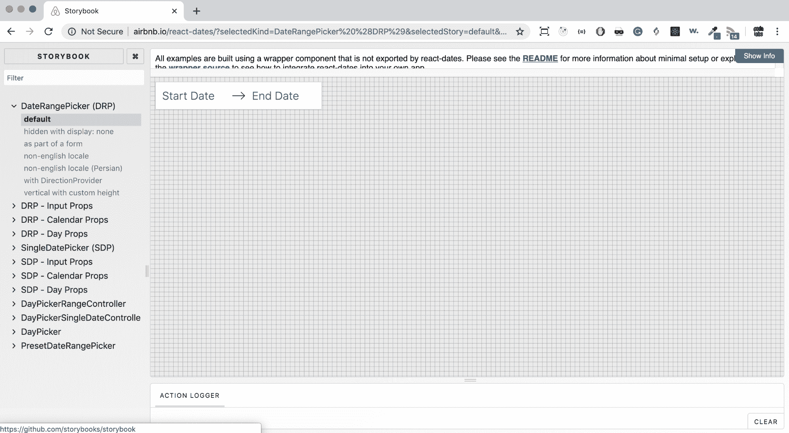

Next Steps

React 是过去几年中发布的最令人惊叹的图书馆之一，这不仅是因为图书馆本身及其强大的功能，更重要的是，由于围绕它构建的生态系统。

跟随 React 社区是非常令人兴奋和鼓舞人心的；每天都有新的项目和工具需要学习和使用。不仅如此，还有会议和聚会，在那里你可以与现实生活中的人交谈并建立新的关系，你可以阅读博客文章来提高技能并学到更多，还有许多其他方法来成为一名更好的开发人员。

React 生态系统鼓励最佳实践和对开放源码开发人员的热爱，这对我们未来的职业生涯来说是非常棒的。

在本章中，我们将介绍以下主题：

*   如何通过打开问题和请求来帮助 React 库
*   为什么回馈社区和共享代码很重要
*   如何发布`npm`包以及如何使用语义版本控制

# 技术要求

要完成本章，您需要以下内容：

*   Node.js 12+
*   Visual Studio 代码

# 促成反应

当人们使用 React 一段时间后，他们经常想做的一件事就是为图书馆捐款。React 是开源的，这意味着它的源代码是公开的，任何签署了**贡献者许可协议**（**CLA**的人都可以帮助修复 bug、编写文档，甚至添加新功能。

You can read the full terms of the CLA at the following URL: [https://code.facebook.com/cla](https://code.facebook.com/cla).

您需要确保您在 React 的 GitHub 存储库中发布的任何 bug 都是 100%可复制的。一旦您验证了这一点，如果您想在 GitHub 上提交问题，您可以访问[https](https://github.com/facebook/react/issues/new)[://GitHub.com/facebook/react/issues/new](https://github.com/facebook/react/issues/new)。正如您将看到的，本期附带了一些预先填写的说明，其中之一是设置最小演示。其他问题帮助您解释问题，并描述当前和预期的行为。

在参与或贡献存储库之前，阅读*Facebook 行为准则*非常重要，请参见[https://code.facebook.com/codeofconduct](https://code.facebook.com/codeofconduct) 。该文件列出了所有社区成员都应该遵守的良好行为。一旦问题被归档，您必须等待一个核心贡献者来检查它，并告诉您他们决定如何处理这个 bug。根据问题的严重程度，他们可能会修复它，或者要求您修复它。

在第二种情况下，您可以分叉存储库并编写代码来解决问题。遵循编码风格指南并编写修复程序的所有测试非常重要。同样重要的是，所有旧测试都要通过，以确保新代码不会在代码库中引入回归。当修复程序准备就绪且所有测试均为绿色时，您可以提交拉取请求，并等待核心团队成员对其进行审查。他们可能会决定合并它或要求您进行一些更改。

如果您没有发现 bug，但仍然希望为项目做出贡献，那么您可以查看 GitHub 上标有良好第一期标签的问题：[https://github.com/facebook/react/labels/good%20first%20issue](https://github.com/facebook/react/labels/good%20first%20issue) 。这是一个很好的开始贡献的方式，React 团队让每个人，特别是新的贡献者，都有可能成为项目的一部分，这真是太棒了。

如果您发现了一个好的第一个 bug 问题，而这个问题还没有被别人解决，那么您可以添加一条评论，表示您对解决这个问题感兴趣。其中一名核心成员将与您联系。在开始编写代码之前，请确保与他们讨论您的方法和您希望采用的路径，这样您就不必多次重写代码。

另一种改进 React 的方法是添加新特性。重要的是，React 团队有一个计划要遵循，主要功能由核心成员设计和决定。

If you are interested in knowing the next steps that the library will take, you can find some of them under the Type: Big Picture label on GitHub: [https://github.com/facebook/react/labels/Type%3A%20Big%20Picture](https://github.com/facebook/react/labels/Type%3A%20Big%20Picture).

也就是说，如果您对应该添加到库中的功能有一些好的想法，那么首先要做的就是打开一个问题，并开始与 React 团队进行讨论。您应该避免在询问他们之前花费时间编写代码和提交请求，因为您心目中的功能可能不适合他们的计划，或者可能与他们正在使用的其他功能冲突。

# 分发您的代码

对 React 生态系统的贡献不仅仅意味着将代码推入 React 存储库。为了回馈社区并帮助开发人员，您可以创建包、撰写博客文章、回答有关堆栈溢出的问题以及执行许多其他活动。

例如，假设您创建了一个 React 组件来解决一个复杂的问题，并且您认为其他开发人员可以从中受益，而不是花时间来构建他们的解决方案。最好的办法是将它发布到 GitHub 上，让每个人都可以阅读和使用。然而，将代码推送到 GitHub 只是一个大流程中的一个小动作，它伴随着一些责任。因此，你应该清楚地知道你选择的原因。

您希望共享代码的动机有助于提高您作为开发人员的技能。一方面，共享代码迫使您遵循最佳实践并编写更好的代码。另一方面，它将您的代码暴露给其他开发人员的反馈和评论。这对您来说是一个很大的机会，您可以获得提示并改进代码，使其变得更好。

除了与代码本身相关的建议之外，通过将代码推送到 GitHub，您可以从其他人的想法中获益。事实上，您可能已经想到了您的组件可以解决的单个问题，但是另一个开发人员可能会以稍微不同的方式使用它，为它找到新的解决方案。此外，他们可能需要新功能，并且可以帮助您实现这些功能，这样每个人，包括您自己，都可以从中受益。共同构建软件是提高您的技能和软件包的一个很好的方法，这就是为什么我坚信开源。

开源可以给你的另一个重要机会是让你与来自世界各地的聪明而热情的开发者取得联系。与具有不同背景和技能的新人密切合作是保持思想开放和自我提升的最佳方式之一。

共享代码也会让您承担一些责任，这可能会很耗时。事实上，一旦代码是公开的，人们可以使用它，你就必须维护它。

维护存储库需要投入，因为它越受欢迎，使用它的人越多，问题和问题的数量就越多。例如，开发人员可能会遇到 bug 和未解决的问题，因此您必须检查所有这些问题并尝试重现这些问题。如果问题存在，则必须编写修复程序并发布库的新版本。您可能会收到来自开发人员的请求，这些请求可能既长又复杂，需要对它们进行审查。

如果您决定请他人共同维护项目，并帮助您处理问题和请求，您必须与他们协调，共同分享您的愿景并做出决策。

## 了解推动开源代码时的最佳实践

我们可以通过一些好的实践来帮助您建立一个更好的存储库，并避免一些常见的陷阱。

首先，如果要发布 React 组件，必须编写一组全面的测试。由于公共代码和许多人的参与，测试非常有用，原因有很多：

*   它们使代码更加健壮。
*   它们帮助其他开发人员理解代码的作用。
*   它们使得添加新代码时更容易找到回归。
*   它们使其他贡献者在编写代码时更有信心。

第二件重要的事情是添加一个`README`，其中包含组件的描述、使用示例以及可以使用的 API 和道具文档。这有助于软件包的用户，但也避免了人们打开问题，询问有关库如何工作以及如何使用它的问题。

还必须向存储库中添加一个`LICENSE`**文件，让人们知道他们可以和不能对您的代码做什么。GitHub 有很多现成的模板可供选择。只要有可能，就应该使包保持小，并尽可能少地添加依赖项。开发人员在决定是否使用库时，往往会仔细考虑库的大小。请记住，沉重的软件包会对性能产生不良影响。**

 **不仅如此，依赖于太多的第三方库，如果其中任何一个库没有维护或有 bug，都会产生问题。

共享 React 组件的一个棘手的部分是当您必须决定样式时。共享 JavaScript 代码非常简单，而附加 CSS 并不像您想象的那么容易。事实上，有许多不同的途径可以提供它：从向包中添加 CSS 文件到使用内联样式。需要记住的重要一点是，CSS 是全局的，通用类名可能与导入组件的项目中已经存在的类名冲突。

最好的选择是包含尽可能少的样式，并使组件对最终用户具有高度可配置性。这样，开发人员将更有可能使用它，因为它可以适应他们的定制解决方案。

为了证明您的组件是高度可定制的，您可以向存储库中添加一个或多个示例，使每个人都能够轻松了解它是如何工作的以及它接受哪些道具。示例也很有用，这样您就可以测试组件的新版本，并查看是否存在意外的中断更改。

正如我们在*第 3 章*、*React Hooks*中所看到的，**React Storybook**等工具可以帮助您创建生活方式指南，这些指南更易于维护，也更便于您包的消费者导航和使用。

Airbnb 的`react-dates`是一个高度可定制的库，它使用故事书来显示所有这些变化。您应该将该存储库作为如何将 React 组件发布到 GitHub 的完美示例。

如您所见，他们使用故事书来显示组件的不同选项：



最后但并非最不重要的一点是，您可能不仅希望共享代码，还希望分发包。JavaScript 最流行的包管理器是`npm`，我们在本书中一直使用它来安装包和依赖项。

在下一节中，我们将看到使用`npm`发布新包是多么容易。

除了`npm`之外，一些开发人员可能需要将您的组件添加为全局依赖项，并在没有包管理器的情况下使用它。

正如我们在*第 1 章*中所看到的，*使用 React*迈出了第一步，您只需添加一个指向[的脚本标记，即可轻松使用 Reacthttps://unpkg.com/](https://unpkg.com/) 。为库的用户提供相同的选项很重要。

因此，为了提供包的全局版本，您还应该构建**通用模块定义**（**UMD**版本）。有了 webpack，这是非常简单的；您只需在配置文件的输出部分设置`libraryTarget`。

# 发布 npm 包

让开发人员可以使用包的最常用方法是将包发布到 Node.js 的包管理器`npm`。

我们在本书的所有示例中都使用了它，您已经看到安装软件包是多么容易；这只是运行`npm install`包的问题，就是这样。您可能不知道发布包有多容易。

首先，假设您移动到一个空目录，并在终端中写入以下内容：

```jsx
npm init
```

将创建一个新的`package.json`文件，并显示一些问题。第一个是包名，默认为文件夹名，然后是版本号。这些是最重要的，因为第一个是包的用户在安装和使用包时将引用的名称；第二种方法可以帮助您安全地发布包的新版本，而不会破坏其他人的代码。

版本号由三个由点分隔的数字组成，它们都有一个含义。右边包的最后一个数字代表补丁，当包含 bug 修复的库的新版本推送到`npm`时，应该增加该数字。

中间的数字表示发行版本的次要版本，当新的特征添加到库时，应该改变它。这些新特性不应该破坏现有的 API。最后，左边的第一个数字代表主要版本，当包含突破性更改的版本发布给公众时，必须增加该数字。

遵循这种称为**语义版本控制**（**SemVer**）的方法是一种很好的做法，它可以让用户在更新软件包时更加自信。

包的第一个版本通常是`0.1.0`。

要发布`npm`包，您必须拥有`npm`帐户，您可以在控制台中运行以下命令轻松创建该帐户，其中`$username`是您选择的名称：

```jsx
npm adduser $username
```

创建用户后，可以运行以下命令：

```jsx
npm publish
```

将向注册表中添加一个新条目，其中包含程序包名称和您在`package.json`中指定的版本。

每当您更改库中的某些内容并希望推送新版本时，您只需运行`$type`，其中一个修补程序是次要的或主要的：

```jsx
npm version $type
```

此命令将在您的`package.json`文件中自动切换版本，如果您的文件夹受版本控制，它还将创建提交和标记。

一旦版本号增加，您只需再次运行`npm publish`，新版本将可供用户使用。

# 总结

在这次环游 React 世界之旅的最后一站，我们看到了 React 之所以伟大的一些方面——它的社区和生态系统——以及如何为之做出贡献。

您学习了如何在 React 中发现 bug 时打开问题，以及如何让核心开发人员更容易修复它。现在，您知道了使代码开源的最佳实践，以及由此带来的好处和责任。

最后，您看到了在`npm`注册表上发布包是多么容易，以及如何选择正确的版本号以避免破坏其他人的代码。**