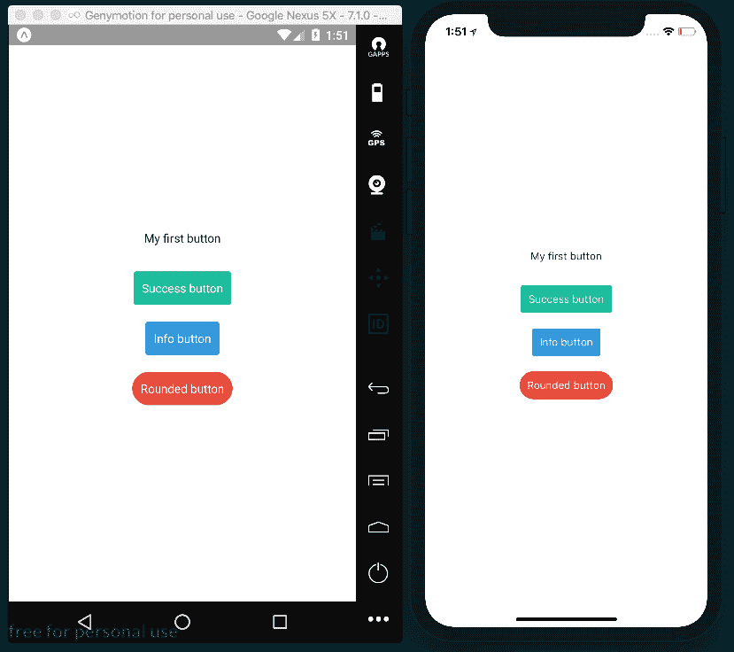
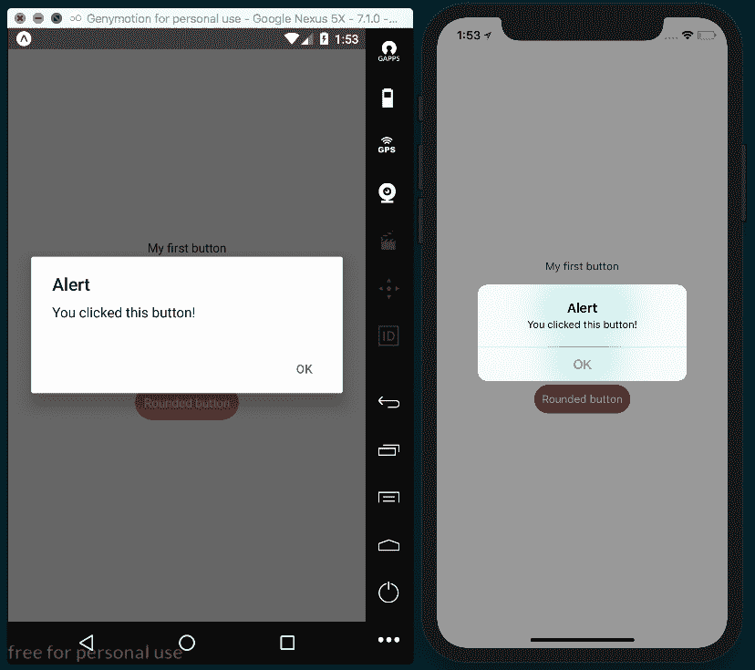
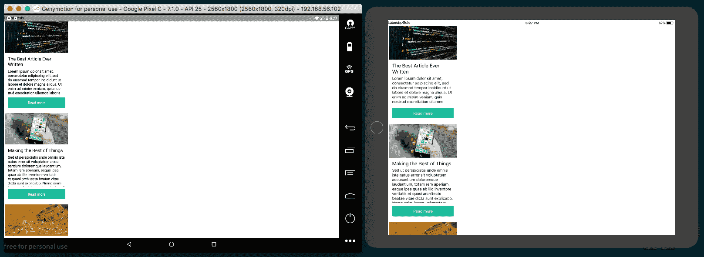
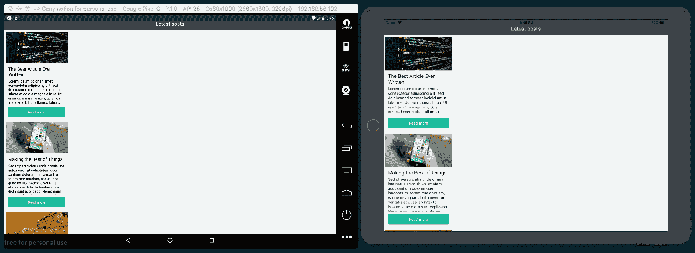
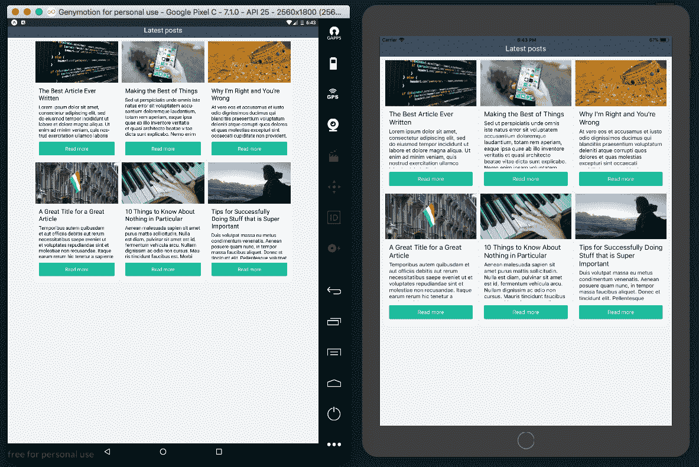
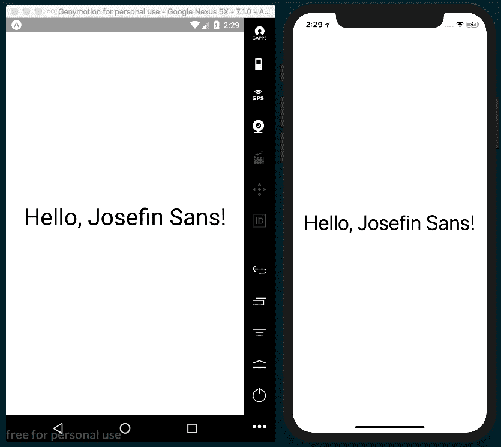
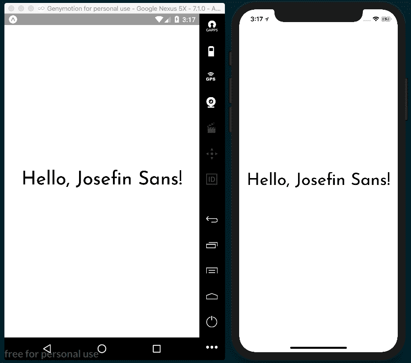
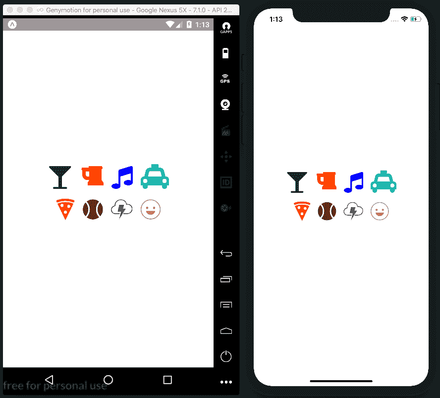

# 三、实现复杂用户界面——第一部分

在本章中，我们将实现复杂的用户界面。我们将了解更多关于使用 flexbox 创建在不同屏幕尺寸上工作的组件的信息，以及如何检测方向变化等。

本章将介绍以下配方：

*   创建具有主题支持的可重用按钮
*   使用 flexbox 为平板电脑构建复杂布局
*   包括自定义字体
*   使用字体图标

# 创建具有主题支持的可重用按钮

在开发软件时，可重用性非常重要。我们应该避免重复同一件事一遍又一遍，相反，我们应该创建可以重复使用尽可能多的小组件。

在这个配方中，我们将创建一个`Button`组件，我们还将定义几个属性来更改其外观。在学习这个方法的同时，我们将学习如何动态地将不同的样式应用于组件。

# 准备

我们需要创建一个空的应用。让我们把它命名为`reusable-button`

# 怎么做。。。

1.  在新应用的根目录中，我们需要为可重用的按钮相关代码创建一个新的`Button`文件夹。让我们在新的`Button`文件夹中创建`index.js`和`styles.js`。
2.  我们将从导入新组件的依赖项开始。在`Button/index.js`文件中，我们将创建一个`Button`组件。这意味着我们需要进口`Text`和`TouchableOpacity`组件。您会注意到，我们还导入了尚不存在的样式。我们将在本配方后面的不同文件中定义这些样式。在`Button/index.js`文件中，我们应该有以下导入：

```jsx
import React, { Component } from 'react';

import {
  Text,
  TouchableOpacity,
} from 'react-native';

import {
  Base,
  Default,
  Danger,
  Info,
  Success
} from './styles';
```

3.  现在我们已经导入了依赖项，让我们定义这个组件的类。我们需要一些性质和两种方法。我们还需要导出此组件，以便在其他地方使用：

```jsx
export default class Button extends Component {
  getTheme() {
    // Defined in a later step
  }

  render() {
    // Defined in a later step
  }
}
```

4.  我们需要根据给定的`properties`选择要应用于我们组件的样式。为此，我们将定义`getTheme`方法。此方法将检查`properties`中是否有`true`项，并返回相应的样式，如果没有`true`项，则返回`Default`样式：

```jsx
  getTheme() {
    const { danger, info, success } = this.properties;

    if (info) {
      return Info;
    }

    if (success) {
      return Success;
    }

    if (danger) {
      return Danger;
    }

    return Default;
  }
```

5.  要求所有组件都有一个`render`方法。这里，我们需要返回这个组件的 JSX 元素。在本例中，我们将获得给定`properties`的样式，并将其应用于`TouchableOpacity`组件。
    我们还为按钮定义了一个标签。在这个标签中，我们将呈现`children`属性。如果收到回调函数，则当用户按下此组件时将执行该函数：

```jsx
  render() {
    const theme = this.getTheme();
    const {
      children,
      onPress,
      style,
      rounded,
    } = this.properties;

    return (
      <TouchableOpacity
        activeOpacity={0.8}
        style={[
          Base.main,
          theme.main,
          rounded ? Base.rounded : null ,
          style,
        ]}
        onPress={onPress}
      >
        <Text style={[Base.label, theme.label]}>{children}</Text>
      </TouchableOpacity>
    );
  }
```

6.  我们的`Button`组件快完成了。我们仍然需要定义样式，但首先让我们转到项目根目录中的`App.js`文件。我们需要导入依赖项，包括我们创建的`Button`组件。
    当用户点击按钮时，我们将显示一条警告消息，因此我们还需要导入`Alert`组件：

```jsx
import React from 'react';
import {
  Alert,
  StyleSheet,
  View
} from 'react-native';
import Button from './Button';
```

7.  一旦我们有了所有的依赖项，让我们定义一个呈现几个按钮的无状态组件。第一个按钮将使用默认样式，第二个按钮将使用成功样式，这将为按钮的背景添加一个漂亮的绿色。最后一个按钮按下时将显示警报。为此，我们需要定义将使用`Alert`组件的回调函数，只需设置标题和消息：

```jsx
export default class App extends React.Component {
  handleButtonPress() {
    Alert.alert('Alert', 'You clicked this button!');
  }

  render() {
    return(
      <View style={styles.container}>
        <Button style={styles.button}>
          My first button
        </Button>
        <Button success style={styles.button}>
          Success button
        </Button>
        <Button info style={styles.button}>
          Info button
        </Button>
        <Button danger rounded style={styles.button}
        onPress={this.handleButtonPress}>
          Rounded button
        </Button>
      </View>
    );
  }
}
```

8.  我们将为主布局如何对齐和对齐每个按钮添加一些样式，以及一些边距：

```jsx
const styles = StyleSheet.create({
  container: {
      flex: 1,
      alignItems: 'center',
      justifyContent: 'center',
    },
  button: {
    margin: 10,
  },
});
```

9.  如果我们现在尝试运行该应用，将会出现一些错误。这是因为我们尚未声明按钮的样式。让我们现在就开始吧。在`Button/styles.js`文件中，我们需要定义基本样式。这些样式将应用于按钮的每个实例。在这里，我们将定义半径、填充、字体颜色以及此组件所需的所有常用样式：

```jsx
import { StyleSheet } from 'react-native';

const Base = StyleSheet.create({
  main: {
    padding: 10,
    borderRadius: 3,
  },
  label: {
    color: '#fff',
  },
  rounded: {
    borderRadius: 20,
  },
});
```

10.  一旦我们有了按钮的通用样式，我们需要定义`Danger`、`Info`、`Success`和`Default`主题的样式。为此，我们将为每个主题定义不同的对象。在每个主题中，我们将使用相同的对象，但该主题具有特定的样式。
    为了简单起见，我们只打算更改`backgroundColor`，但我们可以选择使用任意多的样式属性：

```jsx
const Danger = StyleSheet.create({
  main: {
    backgroundColor: '#e74c3c',
  },
});

const Info = StyleSheet.create({
  main: {
    backgroundColor: '#3498db',
  },
});

const Success = StyleSheet.create({
  main: {
    backgroundColor: '#1abc9c',
  },
});

const Default = StyleSheet.create({
  main: {
    backgroundColor: 'rgba(0 ,0 ,0, 0)',
  },
  label: {
    color: '#333',
  },
});
```

11.  最后，让我们导出样式。此步骤是必要的，以便`Button`组件可以导入每个主题的所有样式：

```jsx
export {
  Base,
  Danger,
  Info,
  Success,
  Default,
};
```

12.  如果我们打开应用，我们应该能够看到我们完成的布局：



# 它是如何工作的。。。

在本例中，我们使用了`TouchableOpacity`组件。该组件允许我们定义一个漂亮的动画，当用户按下按钮时，该动画会更改不透明度。

按下按钮时，我们可以使用`activeOpacity`属性设置不透明度值。数值可以是介于`0`和`1`之间的任意数字，其中`0`是完全透明的。

如果按下圆形按钮，我们将看到一条本机警报消息，如以下屏幕截图所示：



# 使用 flexbox 为平板电脑构建复杂布局

Flexbox 在创建响应性布局时非常方便。React Native 使用 flexbox 作为布局系统，如果您已经熟悉这些概念，那么开始创建任何类型的布局都非常容易。

如前一章所述，flexbox 在 React Native 中的工作方式与在 CSS 中的工作方式存在一些差异。有关 React-Native 和 CSS flexbox 之间差异的更多信息，请参阅[第 2 章](01.html)中*使用 flexbox 创建布局*配方*创建简单的 React-Native 应用*中的*如何工作…*部分。

在这个配方中，我们将创建一个布局来显示博客文章列表。每篇文章都是一张小卡片，上面有一张图片、一段摘录和一个阅读更多内容的按钮。我们将使用 flexbox 根据屏幕大小在主容器上安排帖子。这将允许我们通过在横向和纵向上正确对齐卡片来处理屏幕旋转。

# 准备

我们需要一个新的应用来制作这个食谱。让我们把它命名为`tablet-flexbox`。

当我们用 Expo 创建一个新的应用时，会在项目的基础上创建一个`app.json`，提供一些基本配置。在这个配方中，我们正在构建一个应用，我们希望确保它在平板电脑上看起来不错，尤其是在横向模式下。当我们打开`app.json`时，我们会看到`orientation`属性设置为`'portrait'`。此属性确定应用中应允许的方向。`orientation`属性接受`'portrait'`（将应用锁定为纵向模式）、`'landscape'`（将应用锁定为横向模式）和`'default'`（允许应用根据设备方向调整屏幕方向）。对于我们的应用，我们将把`orientation`设置为`'landscape'`，这样我们就可以支持横向和纵向布局。

我们还将使用一些图像，这些图像需要远程托管，以便正确模拟加载远程数据和使用`Image`组件显示图像。我已将这些图像上传到[www.imgur.com](http://www.imgur.com)图像托管服务，并在配方用于其耗材数据的`data.json`文件中引用了这些远程图像。如果出于任何原因，这些远程图像无法正确加载，它们也会包含在`/assets`文件夹下的此配方存储库中。请随时将它们上载到任何服务器或托管服务，并相应地更新`data.json`中的图像 URL。可在 GitHub 的[上找到存储库 https://github.com/warlyware/react-native-cookbook/tree/master/chapter-3/tablet-flexbox](https://github.com/warlyware/react-native-cookbook/tree/master/chapter-3/tablet-flexbox)

# 怎么做。。。

1.  首先，我们需要在项目的根目录中创建一个`Post`文件夹。我们还需要在新的`Post`文件夹中创建`index.js`和`styles.js`文件。我们将使用这个`Post`组件来显示我们应用的每个帖子。最后，我们需要在项目的根目录中添加一个`data.json`文件，我们将使用该文件定义一个帖子列表。
2.  现在我们可以继续构建`App.js`组件。首先，我们需要导入这个类的依赖项。我们将使用`ListView`组件来呈现帖子列表。我们还需要`Text`和`View`组件用于内容容器。我们将创建一个自定义的`Post`组件来呈现列表中的每个帖子，我们还需要导入`data.json`文件：

```jsx
import React, { Component } from 'react';
import { ListView, StyleSheet, Text, View } from 'react-native';

import Post from './Post';
import data from './data.json';
```

3.  让我们为`App`组件创建类。在这里，我们将使用`.json`文件中的数据为列表创建`dataSource`。我们将在下一步向我们的`data.json`文件中添加一些实际数据。在`render`方法中，我们将定义一个简单的顶部工具栏和`List`组件。我们将对每条记录使用`Post`组件，并从`state`中获取`dataSource`。

如果您对`ListView`组件有任何疑问，请查看[第 2 章](01.html)*中的配方，创建一个简单的 React 原生应用*，我们在其中创建了一个订单列表：

```jsx
const dataSource = new ListView.DataSource({
  rowHasChanged: (r1, r2) => r1 !== r2,
});

export default class App extends Component {
  state = {
    dataSource: dataSouce.cloneWithRows(data.posts),
  };

  render() {
    return (
      <View style={styles.container}>
        <View style={styles.toolbar}>
          <Text style={styles.title}>Latest posts</Text>
        </View>
        <ListView
          dataSource={this.state.dataSource}
          renderRow={post => <Post {...post} />}
          style={styles.list}
          contentContainerStyle={styles.content}
        />
      </View>
    );
  }
}
```

4.  仍然缺少两个文件：包含数据的`.json`文件和`Post`组件。在这一步中，我们将创建用于每篇文章的数据。简单地说，下面的代码片段中只有一条数据记录，但是我在这个配方中使用的`POST`对象的其余部分可以在这个配方的代码库的`data.json`文件中找到，位于[https://github.com/warlyware/react-native-cookbook/blob/master/chapter-3/tablet-flexbox/data.json](https://github.com/warlyware/react-native-cookbook/blob/master/chapter-3/tablet-flexbox/data.json) :

```jsx
{
  "posts": [
    {
      "title": "The Best Article Ever Written",
      "img": "https://i.imgur.com/mf9daCT.jpg",
      "content": "Lorem ipsum dolor sit amet...",
      "author": "Bob Labla"
    },
    // Add more records here.
  ]
}
```

5.  现在我们有了一些数据，我们已经准备好处理`Post`组件。在这个组件中，我们需要显示图像、标题和按钮。因为这个组件不需要知道状态，所以我们将使用无状态组件。下面的代码使用了我们在[第 2 章](01.html)*中学习的所有组件，创建了一个简单的 React 原生应用*。如果有不清楚的地方，请重新阅读该章。
    此组件将数据作为参数接收，然后我们将其用于显示组件中的内容。`Image`组件将使用`data.json`文件中每个对象上定义的`img`属性来显示远程图像：

```jsx
import React from 'react';
import {
  Image,
  Text,
  TouchableOpacity,
  View
} from 'react-native';

import styles from './styles';

const Post = ({ content, img, title }) => (
  <View style={styles.main}>
    <Image
      source={{ uri: img }}
      style={styles.image}
    />
    <View style={styles.content}>
      <Text style={styles.title}>{title}</Text>
      <Text>{content}</Text>
    </View>
    <TouchableOpacity style={styles.button} activeOpacity={0.8}>
      <Text style={styles.buttonText}>Read more</Text>
    </TouchableOpacity>
  </View>
);

export default Post;
```

6.  一旦我们定义了组件，我们还需要为每个帖子定义样式。让我们创建一个空的`StyleSheet`导出，以便依赖`styles.js`的`Post`组件能够正常工作：

```jsx
import { StyleSheet } from 'react-native';

const styles = StyleSheet.create({
  // Defined in later steps
});

export default styles;
```

7.  如果我们尝试运行该应用，我们应该能够在屏幕上看到来自`.json`文件的数据。但它不会很漂亮，因为我们还没有应用任何样式。
8.  我们在屏幕上有我们需要的一切。现在我们已经准备好开始布局工作。首先，让我们为`Post`容器添加样式。我们将设置`width`、`height`、`borderRadius`和其他一些。让我们将它们添加到`/Post/styles.js`文件中：

```jsx
const styles = StyleSheet.create({
  main: {
    backgroundColor: '#fff',
    borderRadius: 3,
    height: 340,
    margin: 5,
    width: 240,
  }
});
```

9.  到现在为止，我们应该看到小盒子垂直对齐。这是一个进步，但我们需要为图像添加更多的样式，以便我们可以在屏幕上看到它。让我们将一个`image`属性添加到上一步的相同`styles`常量中。`resizeMode`属性允许我们设置如何调整图像大小。在这种情况下，通过选择`cover`，图像将保持原稿的纵横比：

```jsx
  image: {
    backgroundColor: '#ccc',
    height: 120,
    resizeMode: 'cover',
  }
```

10.  对于帖子的`content`，我们希望占据卡片上所有可用的高度，因此我们需要使其灵活并添加一些填充。我们还将在内容中添加`overflow: hidden`以避免`View`元素溢出。对于`title`，我们只需更改`fontSize`并在底部添加一个`margin`：

```jsx
  content: {
    padding: 10,
    overflow: 'hidden',
    flex: 1,
  },
  title: {
    fontSize: 18,
    marginBottom: 5,
  },
```

11.  最后，对于按钮，我们将`backgroundColor`设置为绿色，文本设置为白色。我们还需要增加一些`padding`和`margin`的间距：

```jsx
  button: {
    backgroundColor: '#1abc9c',
    borderRadius: 3,
    padding: 10,
    margin: 10,
  },
  buttonText: {
    color: '#fff',
    textAlign: 'center',
  }
```

12.  如果我们刷新模拟器，我们应该可以在小卡片上看到我们的帖子。目前，卡片是垂直排列的，但我们希望水平渲染所有卡片。我们将通过以下步骤解决此问题：



Primary styles have been added for all post elements

13.  目前，我们只能在一列中看到列表中的前三项，而不是在屏幕上的一行中。让我们回到`App.js`文件，开始添加我们的样式。我们将`flex: 1`添加到`container`中，以便我们的布局始终填充屏幕。我们还希望在顶部显示工具栏。为此，我们只需要定义一些`padding`和`color`如下：

```jsx
const styles = StyleSheet.create({
  container: {
    flex: 1,
  },
  toolbar: {
    backgroundColor: '#34495e',
    padding: 10,
    paddingTop: 20,
  },
  title: {
    color: '#fff',
    fontSize: 20,
    textAlign: 'center',
  }
});
```

14.  让我们也为`list`添加一些基本样式。只是一个漂亮的背景色和一些填充。我们还将添加`flex`属性，这将确保列表占据屏幕上所有可用的高度。这里只有两个组件：工具栏和列表。工具栏大约需要 50 像素。如果我们使列表灵活，它将占用所有剩余的可用空间，这正是我们在旋转设备或以不同屏幕分辨率运行应用时所需要的：

```jsx
  list: {
    backgroundColor: '#f0f3f4',
    flex: 1,
    paddingTop: 5,
    paddingBottom: 5,
  }
```

15.  如果我们再次在模拟器中检查应用，我们应该能够看到工具栏和列表按预期布局：



Styles have been applied to each post to give them a card like appearance

16.  我们几乎完成了这个应用。我们所要做的就是水平排列卡片。使用 flexbox 可以通过三个简单的步骤实现这一点：

```jsx
        content: { 
          flexDirection: 'row', 
          flexWrap: 'wrap', 
          justifyContent: 'space-around', 
        }, 
```

第一步是通过`ListView`组件中的`contentContainerStyle`属性应用这些`content`样式。在内部，`ListView`组件将这些样式应用于内容容器，内容容器封装所有子视图。
然后我们将`flexDirection`设置为`row`。这将水平对齐列表上的卡片；然而，这带来了一个新问题：我们只能看到一行帖子。为了解决这个问题，我们需要包装这些项目。为此，我们将`flexWrap`属性设置为`wrap`，这将自动将视图中不适合的项目移动到下一行。最后，我们使用了{ To8t}属性，并将其设置为 AutoT99T，这将将我们的 Ty10 T10 置于我们的应用的中间。

17.  我们现在有了一款响应迅速的应用，在平板电脑上以横向模式运行时效果良好：


Side-by-side comparison of iPad and Android tablet screenshots in landscape mode

在纵向模式下看起来也一样好：



Side-by-side comparison of iPad and Android tablet screenshots in portrait mode

# 还有更多。。。

Expo 还提供了一个`ScreenOrientation`助手，用于更改应用的方向配置。此帮助器还允许进行更精细的方向设置（如`ALL_BUT_UPSIDE_DOWN`或`LANDSCAPE_RIGHT`）。如果您的应用需要动态、精细地控制屏幕方向，请参阅`ScreenOrientation`世博会文档以获取信息：[https://docs.expo.io/versions/v24.0.0/sdk/screen-orientation.html](https://docs.expo.io/versions/v24.0.0/sdk/screen-orientation.html) 。

# 另见

静态图像资源和`<Image>`组件的官方文档可在[找到 https://facebook.github.io/react-native/docs/images.html](https://facebook.github.io/react-native/docs/images.html) 。

# 包括自定义字体

在某种程度上，我们可能希望使用自定义字体族显示文本。到目前为止，我们一直使用默认字体，但我们可以使用任何我们喜欢的其他字体。

在世博会之前，添加自定义字体的过程更加困难，需要使用本机代码，并且需要在 iOS 和 Android 中以不同的方式实现。幸运的是，通过使用 Expo 的 font helper 库，这已变得精简和简化

在此配方中，我们将导入一些字体，然后使用每个导入的字体系列显示文本。我们还将使用不同的字体样式，如**粗体**和*斜体*。

# 准备

为了处理这个例子，我们需要一些字体。你可以使用任何你想要的字体。我建议去谷歌字体（[https://fonts.google.com/](https://fonts.google.com/) 下载您的收藏夹。对于这个配方，我们将使用*Josefin Sans 和 Raleway 字体。*

 *下载字体后，让我们创建一个空应用并将其命名为`custom-fonts`。当我们使用 Expo 创建一个空白应用时，它会在项目根目录中创建一个`assets`文件夹，用于放置您的所有资产（图像、字体等），因此我们将按照标准将字体添加到此文件夹。让我们创建`/img/fonts`文件夹并添加从谷歌字体下载的自定义字体文件。

从 Google fonts 下载字体时，您将获得一个包含每个字体系列变体的`.ttf`文件的`.zip`文件。我们将使用常规的**粗体**和*斜体***变体，因此将每个系列中每个变体对应的`.ttf`文件复制到我们的`/img/fonts`文件夹。**

 **# 怎么做。。。

1.  有了我们的字体文件，第一步是打开`App.js`并添加我们需要的导入：

```jsx
import React from 'react';
import { Text, View, StyleSheet } from 'react-native';
import { Font } from 'expo';
```

2.  接下来，我们将添加一个简单的组件，用于显示一些要使用自定义字体设置样式的文本。我们将从一个`Text`元素开始，以显示 Roboto 字体的常规变体：

```jsx
export default class App extends React.Component {
  render() {
    return (
      <View style={styles.container}>
        <Text style={styles.josefinSans}>
          Hello, Josefin Sans!
        </Text>
      </View>
    );
  }
}
```

3.  让我们为刚刚创建的组件添加一些初学者样式。现在，我们只增加`josefinSans`类样式的字体大小：

```jsx
const styles = StyleSheet.create({
  container: {
    flex: 1,
    backgroundColor: '#fff',
    alignItems: 'center',
    justifyContent: 'center',
  },
  josefinSans: {
    fontSize: 40,
  }
});
```

4.  如果我们现在在模拟器中打开应用，我们将看到 Hello，Josefin Sans！使用默认字体显示在屏幕中部的文本：



5.  让我们加载我们的`JosefinSans-Regular.ttf`字体文件，这样我们就可以用它来设置文本的样式。我们将使用 React Native 提供的`componentDidMount`生命周期挂钩告诉我们的应用何时开始加载字体：

```jsx
export default class App extends React.Component {

 componentDidMount() {
    Font.loadAsync({
      'josefin-sans-regular': require('./img/fonts/JosefinSans-Regular.ttf'),
    });
  }

  render() {
    return (
      <View style={styles.container}>
        <Text style={styles.josefinSans}>
          Hello, Josefin Sans!
        </Text>
      </View>
    );
  }
}
```

6.  接下来，我们将把加载的字体添加到应用于`Text`元素的样式中：

```jsx
const styles = StyleSheet.create({
  // Other styles from step 3
  josefinSans: {
    fontSize: 40,
 fontFamily: 'josefin-sans-regular'
  }
});
```

7.  我们现在有了风格，对吗？嗯，不完全是。如果我们回顾一下我们的模拟器，我们会发现我们得到了一个错误：

```jsx
console.error: "fontFamily 'josefin-sans-regular' is not a system font and has not been loaded through Expo.Font.loadAsync"
```

8.  但我们只是通过`Expo.Font.loadAsync`加载字体！有什么好处？结果是我们手上有一个比赛条件。我们为`Text`元素定义的`josefinSans`样式是在加载 Josefin Sans 字体之前应用的。要处理此问题，需要使用组件的`state`来跟踪字体的加载状态：

```jsx
export default class App extends React.Component {
 state = {
    fontLoaded: false
  };
```

9.  既然我们的组件有一个`state`，那么一旦加载字体，我们就可以将状态的`fontLoaded`属性更新为`true`。使用 ES6 功能`async`/`await`使这一点简洁明了。让我们在`componentDidMount`代码块中执行此操作：

```jsx
  async componentDidMount() {
    await Font.loadAsync({
      'josefin-sans-regular': require('./img/fonts/JosefinSans-
      Regular.ttf'),
    });
  }
```

10.  由于我们现在正在等待`Font.loadAsync()`呼叫，一旦呼叫完成，我们可以将`fontLoaded`的状态设置为`true`：

```jsx
  async componentDidMount() {
    await Font.loadAsync({
      'josefin-sans-regular': require('./img/fonts/JosefinSans-
      Regular.ttf'),
    });

 this.setState({ fontLoaded: true });
  }
```

11.  剩下要做的就是更新我们的`render`方法，当`fontLoaded`状态属性为`true`时，只呈现依赖于自定义字体的`Text`元素：

```jsx
      <View style={styles.container}>
 {
          this.state.fontLoaded ? (
            <Text style={styles.josefinSans}>
              Hello, Josefin Sans!
            </Text>
          ) : null
        }
      </View>
```

12.  现在，当我们在模拟器中查看我们的应用时，我们应该看到我们的自定义字体正在应用：



13.  让我们加载其余字体，以便我们也可以在应用中使用它们：

```jsx
    await Font.loadAsync({
      'josefin-sans-regular': require('./img/fonts/JosefinSans-
      Regular.ttf'),
 'josefin-sans-bold': require('./img/fonts/JosefinSans-
      Bold.ttf'),
      'josefin-sans-italic': require('./img/fonts/JosefinSans-
      Italic.ttf'),
      'raleway-regular': require('./img/fonts/Raleway-
      Regular.ttf'),
      'raleway-bold': require('./img/fonts/Raleway-Bold.ttf'),
      'raleway-italic': require('./img/fonts/Raleway-
      Italic.ttf'),
    });
```

14.  我们还需要`Text`元素来显示每个新字体系列/变体中的文本。注意，我们还需要将所有的`Text`元素包装到另一个`View`元素中，因为 JSX 表达式要求只有一个父节点。我们现在还向`style`属性传递了一系列要应用的样式，以便整合我们将在下一步应用的`fontSize`和`padding`样式：

```jsx
  render() {
    return (
      <View style={styles.container}>
 {
          this.state.fontLoaded ? (
            <View style={styles.container}>
              <Text style={[styles.josefinSans, 
              styles.textFormatting]}>
                Hello, Josefin Sans!
              </Text>
              <Text style={[styles.josefinSansBold,
              styles.textFormatting]}>
                Hello, Josefin Sans!
              </Text>
              <Text style={[styles.josefinSansItalic, 
              styles.textFormatting]}>
                Hello, Josefin Sans!
              </Text>
              <Text style={[styles.raleway, styles.textFormatting]}>
                Hello, Raleway!
              </Text>
              <Text style={[styles.ralewayBold, 
              styles.textFormatting]}>
                Hello, Raleway!
              </Text>
              <Text style={[styles.ralewayItalic, 
              styles.textFormatting]}>
                Hello, Raleway!
              </Text>
            </View>
          ) : null
        }
      </View>
    );
  }
```

15.  只需将新样式添加到`StyleSheet`即可应用我们的自定义字体：

```jsx
const styles = StyleSheet.create({
  container: {
    flex: 1,
    backgroundColor: '#fff',
    alignItems: 'center',
    justifyContent: 'center',
  },
  josefinSans: {
    fontFamily: 'josefin-sans-regular',
  },
  josefinSansBold: {
    fontFamily: 'josefin-sans-bold',
  },
  josefinSansItalic: {
    fontFamily: 'josefin-sans-italic',
  },
  raleway: {
    fontFamily: 'raleway-regular',
  },
  ralewayBold: {
    fontFamily: 'josefin-sans-bold'
  },
  ralewayItalic: {
    fontFamily: 'josefin-sans-italic',
  },
  textFormatting: {
    fontSize: 40,
    paddingBottom: 20
  }
});
```

16.  现在，在我们的应用中，我们将看到六个不同的文本元素，每个元素都有自己的自定义字体：


# 它是如何工作的。。。

在*步骤 5*和*步骤 6*中，我们使用`componentDidMount`React 生命周期钩子来告诉我们的应用何时完成加载。虽然使用`componentWillMount`似乎很诱人，但这也会引发错误，因为`componentWillMount`不能保证等待`Font.loadAsync`完成。通过使用`componentDidMount`，我们还可以确保不会阻止应用的初始呈现。

在*步骤 9*中，我们使用了 ES6 功能`async`/`await`。如果您是一名 web 开发人员，您可能会熟悉这种模式，但如果您想了解更多信息，我在*另见本配方末尾的*部分中包含了一篇来自[ponyfoo.com](http://ponyfoo.com)的精彩文章，这很好地解释了`async`/`await`的工作原理。

在*步骤 11*中，我们使用了一个三元语句来呈现自定义字体样式的`Text`元素（如果已加载），或者通过返回`null`来呈现未加载的内容

Fonts loaded through Expo don’t currently support the `fontWeight` or `fontStyle` properties—you will need to load those variations of the font and specify them by name, as we have done here with bold and italic.

# 另见

一篇关于`async`/`await`的好文章可以在[找到 https://ponyfoo.com/articles/understanding-javascript-async-await](https://ponyfoo.com/articles/understanding-javascript-async-await) 。

# 使用字体图标

图标几乎是任何应用不可或缺的一部分，尤其是在导航和按钮中。与上一章介绍的 Expo 字体助手类似，Expo 还有一个图标助手，它使添加图标字体比使用 Villa React Native 简单得多。在这个配方中，我们将看到如何将图标助手模块与流行的`FontAwesome`和`Ionicons`图标字体库一起使用。

# 准备

我们需要为这个配方做一个新的项目。让我们把这个项目命名为`font-icons`。

# 怎么做。。。

1.  我们将首先打开`App.js`并导入构建应用所需的依赖项：

```jsx
import React from 'react';
import { StyleSheet, Text, View } from 'react-native';
import { FontAwesome, Ionicons } from '@expo/vector-icons';
```

2.  接下来，我们可以添加应用的外壳，在这里我们将显示图标：

```jsx
export default class App extends React.Component {
  render() {
    return (
      <View style={styles.container}>
      </View>
    );
  }
}
```

3.  在`View`元素内部，我们再添加两个`View`元素，用于保存每个图标集中的图标：

```jsx
export default class App extends React.Component {
  render() {
    return (
      <View style={styles.container}>
 <View style={styles.iconRow}>

        </View>
        <View style={styles.iconRow}>

        </View>
      </View>
    );
  }
}
```

4.  现在，让我们为每个声明的元素添加样式。正如我们在前面的食谱中所看到的，`container`样式用`flex: 1`填充屏幕，并将`alignItems`和`justifyContent`设置为`center`使项目居中。`iconRow`属性将`flexDirection`设置为`row`，这样我们的图标将排成一行：

```jsx
const styles = StyleSheet.create({
  container: {
    flex: 1,
    backgroundColor: '#fff',
    alignItems: 'center',
    justifyContent: 'center',
  },
  iconRow: {
    flexDirection: 'row',
  },
});
```

5.  现在我们的应用的基本结构已经就绪，让我们添加图标。在第一行图标中，我们将使用四个`FontAwesome`组件来显示`FontAwesome`字体库中的四个图标。`name`属性决定应该使用哪个图标，`size`属性设置图标的像素大小，`color`设置图标应该是什么颜色：

```jsx
<View style={styles.iconRow}>
 <FontAwesome style={styles.iconPadding} name="glass" size={48} color="green" />
  <FontAwesome style={styles.iconPadding} name="beer" size={48} color="red" />
  <FontAwesome style={styles.iconPadding} name="music" size={48} color="blue" />
  <FontAwesome style={styles.iconPadding} name="taxi" size={48} color="#1CB5AD" />
</View>
```

Just as in CSS, the `color` property can be a color keyword defined in the CSS specification (you can check out the full list in the MDN docs at [https://developer.mozilla.org/en-US/docs/Web/CSS/color_value](https://developer.mozilla.org/en-US/docs/Web/CSS/color_value)), or a hex code for a given color.

6.  在下一个`View`元素中，我们将添加`Ionicons`字体库中的图标。如您所见，`Ionicons`元素与上一步中使用的`FontAwesome`元素具有相同的属性：

```jsx
<View style={styles.iconRow}>
 <Ionicons style={styles.iconPadding} name="md-pizza" size={48} color="orange" />
  <Ionicons style={styles.iconPadding} name="md-tennisball" size={48} color="maroon" />
  <Ionicons style={styles.iconPadding} name="ios-thunderstorm" size={48} color="purple" />
  <Ionicons style={styles.iconPadding} name="ios-happy" size={48} color="#DF7977" />
</View>
```

7.  本食谱的最后一步是添加剩余的样式`iconPadding`，它只是添加一些填充，以均匀地隔开每个图标：

```jsx
const styles = StyleSheet.create({
  container: {
    flex: 1,
    backgroundColor: '#fff',
    alignItems: 'center',
    justifyContent: 'center',
  },
  iconRow: {
    flexDirection: 'row',
  },
 iconPadding: {
    padding: 8,
  }
});
```

8.  就这些！当我们查看我们的应用时，将有两行图标，每行分别显示来自`FontAwesome`和`Ionicons`的图标：



# 它是如何工作的。。。

世博会附带的`vector-icons`套餐提供 11 套完整的图标。您所要做的就是导入相关组件（例如，字体可怕图标的`FontAwesome`组件），并为其提供与要使用的图标集中的图标对应的名称。您可以在`vector-icons`目录中找到可用于`vector-icons`助手库的所有图标的完整、可搜索列表，该目录位于[https://expo.github.io/vector-icons/](https://expo.github.io/vector-icons/) 。只需将元素的`name`属性设置为目录中列出的图标名称，添加`size`和`color`属性，就完成了！

正如`vector-icons`的 GitHub 自述文件所述，该库是为使用 Expo 中`react-native-vector-icons`包提供的图标而创建的兼容层。您可以在[找到此套餐 https://github.com/oblador/react-native-vector-icons](https://github.com/oblador/react-native-vector-icons) 。如果您正在构建一个没有 Expo 的 React 本机应用，您可以使用`react-native-vector-icons`库获得相同的功能。

# 另见

`vector-icons`库中所有可用图标的目录可在[中找到 https://expo.github.io/vector-icons/](https://expo.github.io/vector-icons/) 。***