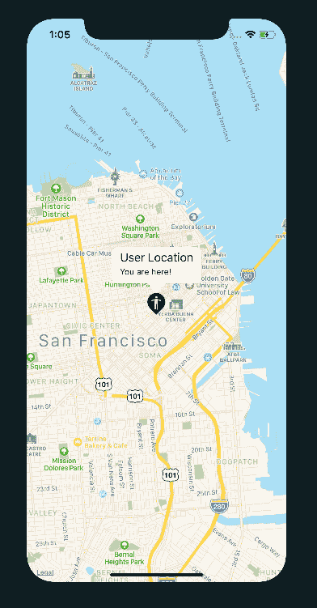
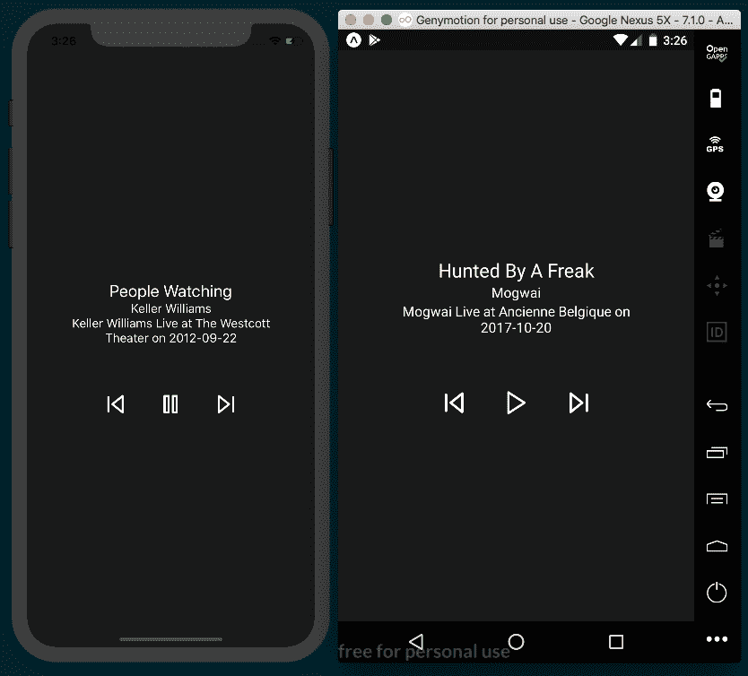
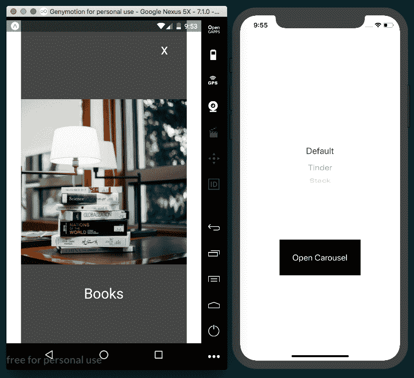
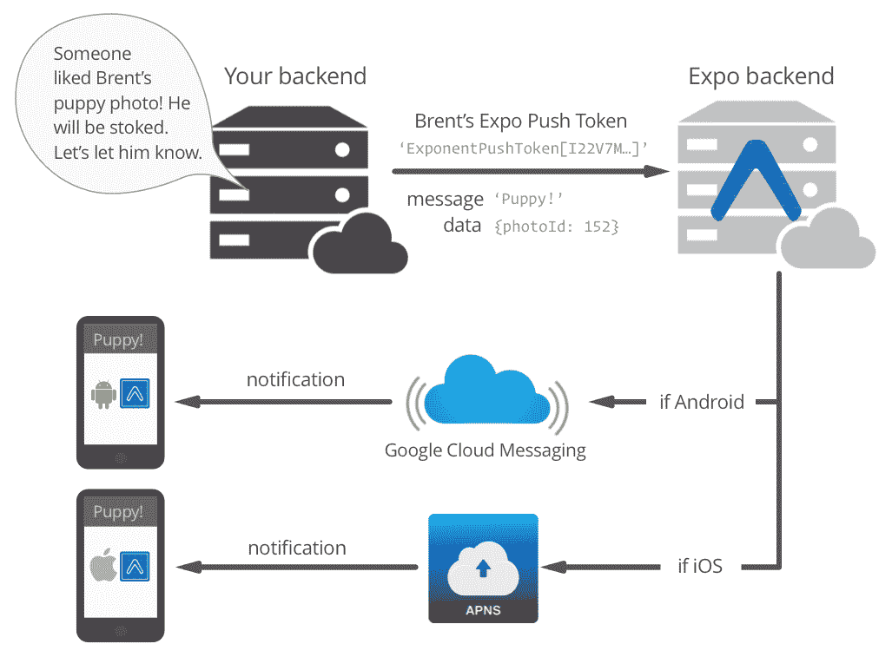
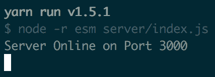
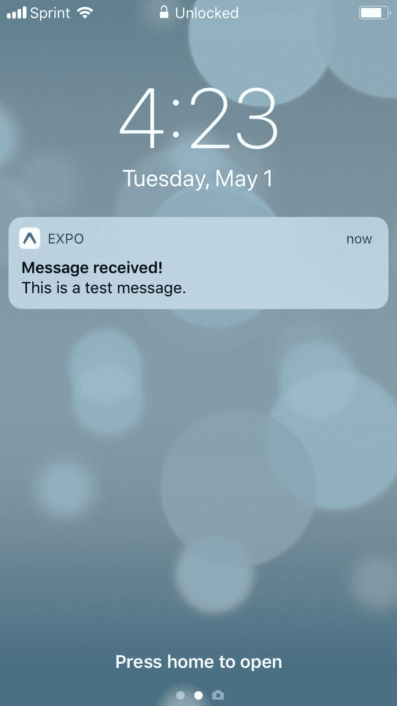
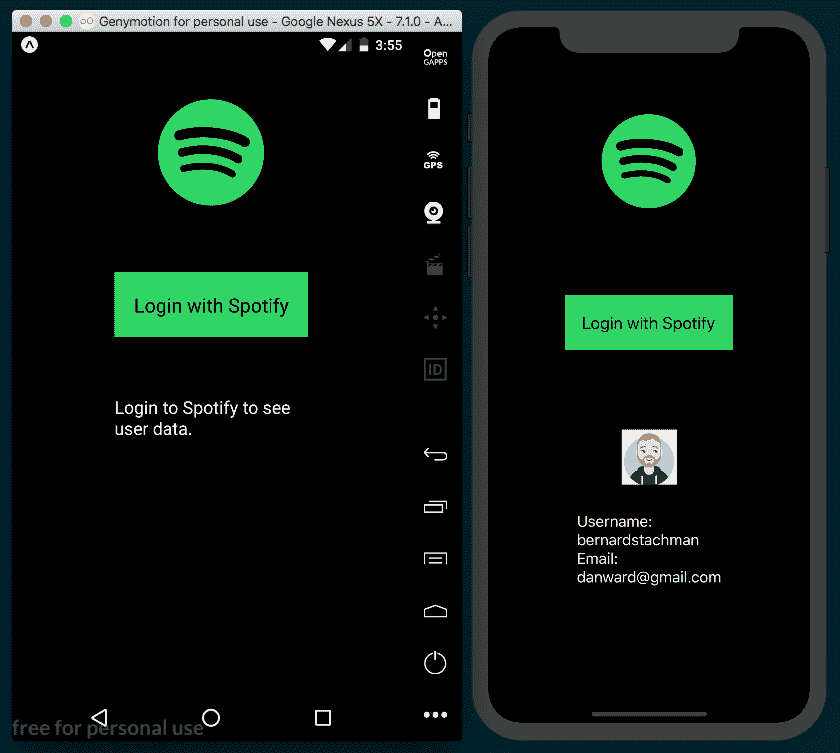

# 实现复杂用户界面.第三部分

在本章中，我们将介绍以下配方：

*   创建地图应用程序
*   创建音频播放器
*   创建图像旋转木马
*   向应用程序添加推送通知
*   实现基于浏览器的身份验证

# 介绍

在本章中，我们将介绍一些可能需要添加到应用程序中的更高级功能。我们将在本章中构建的应用程序包括构建一个功能齐全的音频播放器、地图集成，以及实现基于浏览器的身份验证，以便您的应用程序可以连接到开发人员的公共 API

# 创建地图应用程序

使用移动设备是一种便携体验，因此地图是许多 iOS 和 Android 应用程序的常见部分也就不足为奇了。您的应用程序可能需要实时告诉用户他们在哪里、要去哪里或其他用户在哪里。

在本食谱中，我们将制作一个简单的应用程序，在 Android 上使用谷歌地图，在 iOS 上使用苹果地图应用程序，以显示以用户位置为中心的地图。我们将使用 Expo 的`Location`助手库获取用户的纬度和经度，并使用该数据使用 Expo 的`MapView`组件渲染地图。`MapView`是 Airbnb 创建的 react native maps 软件包的世博版，因此您可以期待 react native maps 文档的应用，可在[中找到 https://github.com/react-community/react-native-maps](https://github.com/react-community/react-native-maps) 。

# 准备

我们需要为此配方创建一个新应用程序。我们叫它`map-app`。由于此配方中的用户 pin 将使用自定义图标，因此我们还需要一个图像。我使用了 Maico Amorim 的图标“你在这里”，你可以从[下载 https://thenounproject.com/term/you-are-here/12314/](https://thenounproject.com/term/you-are-here/12314/) 。您可以随意使用任何图像来表示用户 pin。将图像保存到项目根目录中的`assets`文件夹中。

# 怎么做。。。

1.  我们将首先打开`App.js`并添加我们的进口：

```jsx
import React from 'react';
import {
  Location,
  Permissions,
  MapView,
  Marker
} from 'expo';
import {
  StyleSheet,
  Text,
  View,
} from 'react-native';
```

2.  接下来，让我们定义`App`类和首字母`state`。在此配方中，`state`只需跟踪用户的`location`，我们将其初始化为`null`：

```jsx
export default class App extends Component {
  state = {
    location: null
  }
  // Defined in following steps
}
```

3.  接下来，我们将定义`componentDidMount`生命周期挂钩，它将要求用户授予通过设备的地理位置访问用户位置的权限。如果用户授予应用程序使用其位置的权限，则返回对象将具有一个值为`'granted'`的`status`属性。如果允许，我们将使用`this.getLocation`获取用户的位置，在下一步中定义：

```jsx
  async componentDidMount() {
    const permission = await Permissions.askAsync(Permissions.LOCATION);
    if (permission.status === 'granted') {
      this.getLocation();
    }
  }
```

4.  `getLocation`功能很简单。它使用`Location`组件的`getCurrentPositionAsync`方法从设备的 GPS 获取位置信息，然后将该位置信息保存到`state`。该信息包含用户的纬度和经度，我们将在渲染地图时使用这些信息：

```jsx
  async getLocation() {
    let location = await Location.getCurrentPositionAsync({});
    this.setState({
      location
    });
  }
```

5.  现在，让我们使用该位置信息来渲染地图。首先，我们将检查`state`上是否保存了`location`。如果是，我们将渲染`MapView`，否则将渲染`null`。渲染地图时需要设置的唯一属性是`initialRegion`属性，它定义了首次渲染地图时应显示的位置。我们将在纬度和经度保存为`state`的对象上传递此属性，并使用`latitudeDelta`和`longitudeDelta`定义起始缩放级别：

```jsx
  renderMap() {
    return this.state.location ?
      <MapView
        style={styles.map}
        initialRegion={{
          latitude: this.state.location.coords.latitude,
          longitude: this.state.location.coords.longitude,
          latitudeDelta: 0.09,
          longitudeDelta: 0.04,
        }}
      >
        // Map marker is defined in next step
      </MapView> : null
  }
```

6.  在`MapView`中，我们需要在用户的当前位置添加一个标记。`Marker`组件是`MapView`父组件的一部分，因此在 JSX 中我们将定义`MapView`元素的`MapView.Marker`子元素。此元素获取点击图标时显示的用户位置、标题和说明，以及通过`image`属性的自定义图像：

```jsx
      <MapView
        style={styles.map}
        initialRegion={{
          latitude: this.state.location.coords.latitude,
          longitude: this.state.location.coords.longitude,
          latitudeDelta: 0.09,
          longitudeDelta: 0.04,
        }}
      >
 <MapView.Marker
 coordinate={this.state.location.coords}
 title={"User Location"}
 description={"You are here!"}
 image={require('./img/you-are-here.png')}
 />
      </MapView> : null
```

7.  现在，让我们定义我们的`render`函数。它只是在包含`View`元素的元素中渲染贴图：

```jsx
 render() {
  return (
   <View style={styles.container}>
    {this.renderMap()}
   </View>
  );
 }
```

8.  最后，让我们添加我们的样式。我们将在容器和地图上将`flex`设置为`1`，以便两者都填充屏幕：

```jsx
const styles = StyleSheet.create({
 container: {
  flex: 1,
 backgroundColor: '#fff',
 },
 map: {
  flex: 1
 }
});
```

9.  现在，如果我们打开应用程序，我们将在设备提供的位置看到一个带有自定义用户图标的地图！不幸的是，谷歌地图集成可能无法在 Android emulator 中运行，因此可能需要一台真正的设备来测试应用程序的 Android 实现。看看*还有更多。。。*本配方末尾的章节了解更多信息。不要惊讶于在模拟器上运行的 iOS 应用程序显示用户在旧金山的位置；这是由于 Xcode 位置默认值是如何工作的。在真正的 iOS 设备上运行它，查看它渲染您的位置：



# 它是如何工作的。。。

通过使用 Expo 提供的`MapView`组件，在 React 原生应用程序中实现地图现在比以前简单得多。

在*步骤 3*中，我们使用了`Permissions`助手库。`Permissions`有一个名为`askAsync`的方法，该方法使用一个参数来定义应用程序希望从用户处请求的权限类型。`Permissions`还为您可以向用户请求的每种类型的权限设置了常量。这些权限类型包括`LOCATION`、`NOTIFICATIONS`（我们将在本章后面使用）、`CAMERA`、`AUDIO_RECORDING`、`CONTACTS`、`CAMERA_ROLL`和`CALENDAR`。因为我们需要这个配方中的位置，所以我们传入了常数`Permissions.LOCATION`。一旦`askAsync`返回承诺解析，返回对象将具有`status`属性和`expiration`属性。如果用户允许请求的权限，`status`将设置为`'granted'`字符串。如果同意，我们将取消我们的`getLocation`方法。

在*步骤 4*中，我们定义了从设备的 GPS 获取位置的函数。我们称之为`Location`组件的`getCurrentPositionAsync`方法。此方法将返回具有`coords`属性和`timestamp`属性的对象。通过`coords`属性，我们可以访问`latitude`和`longitude`，以及`altitude`、`accuracy`（位置不确定度半径，以米为单位）、`altitudeAccuracy`（高度值精度，以米为单位（仅限 iOS））、`heading`和`speed`。收到后，我们将位置保存到`state`，以便调用`render`函数，并呈现我们的地图。

在*步骤 5*中，我们定义了`renderMap`方法来渲染地图。首先，我们检查是否有位置，如果有，我们渲染`MapView`元素。此元素只需要定义一个属性的值：`initialRegion`。此属性获取具有四个属性的对象：`latitude`、`longitude`、`latitudeDelta`和`longitudeDelta`。我们将`latitude`和`longitude`设置为与`state`对象中的相同，并为`latitudeDelta`和`longitudeDelta`提供初始值。最后两个属性规定了贴图应渲染的初始缩放级别；这个数字越大，地图将越缩小。我建议尝试这两个值，看看它们如何影响渲染贴图。

在*步骤 6*中，我们通过添加`MapView.Marker`元素作为`MapView`元素的子元素，将标记添加到地图中。我们通过将保存在`state`（`state.location.coords`上的信息传递给`coords`属性来定义坐标，并在点击时为标记的弹出窗口设置`title`和`description`。我们还可以通过在`image`属性中使用`require`语句内联自定义图像，轻松定义自定义 pin。

# 还有更多。。。

如前所述，您可以阅读 react native maps 项目的文档，以了解此优秀库（[的更多功能 https://github.com/react-community/react-native-maps](https://github.com/react-community/react-native-maps) ）。例如，您可以使用谷歌地图样式向导（[轻松自定义谷歌地图的外观 https://mapstyle.withgoogle.com/](https://mapstyle.withgoogle.com/) 生成一个`mapStyle`JSON 对象，然后将该对象传递给`MapView`组件的`customMapStyle`属性。或者，您可以使用`Polygon`和`Circle`组件将几何图形添加到地图中。

一旦你准备好部署你的应用程序，你需要采取一些后续步骤来确保地图在 Android 上正常工作。您可以在[的 Expo 文档中阅读关于部署到带有`MapView`组件的独立 Android 应用程序的详细信息 https://docs.expo.io/versions/latest/sdk/map-view#deploying-发送至-a-standalone-app-on-android](https://docs.expo.io/versions/latest/sdk/map-view#deploying-to-a-standalone-app-on-android)。

There is a known issue that could cause problems when rendering Google Maps within the Android simulator. You can refer to the following GitHub link for more information: [https://github.com/react-native-community/react-native-maps/issues/942](https://github.com/react-native-community/react-native-maps/issues/942).

# 创建音频播放器

音频播放器是许多应用程序中内置的另一个通用接口。无论您的应用程序需要播放本地存储在设备上的音频文件还是从远程位置传输音频，Expo 的`Audio`组件都会提供帮助。

在这个配方中，我们将构建一个成熟的基本音频播放器，具有播放/暂停、下一首曲目和上一首曲目功能。为简单起见，我们将对要使用的曲目的信息进行硬编码，但在现实场景中，您可能会使用与我们定义的类似的对象：具有曲目标题、唱片集名称、艺术家名称和远程音频文件 URL 的对象。我从互联网档案馆的现场音乐档案（[中随机选择了三首现场曲目 https://archive.org/details/etree](https://archive.org/details/etree) ）。

# 准备

我们需要为此配方创建一个新应用程序。我们叫它`audio-player`。

# 怎么做。。。

1.  让我们先打开`App.js`并添加我们需要的依赖项：

```jsx
import React, { Component } from 'react';
import { Audio } from 'expo';
import { Feather } from '@expo/vector-icons';
import {
  StyleSheet,
  Text,
  TouchableOpacity,
  View,
  Dimensions
} from 'react-native';
```

2.  音频播放器需要音频才能播放。我们将创建一个`playlist`阵列来保存音频曲目。每个轨迹由一个带有`title`、`artist`、`album`和`uri`的对象表示：

```jsx
const playlist = [
  {
    title: 'People Watching',
    artist: 'Keller Williams',
    album: 'Keller Williams Live at The Westcott Theater on 2012-09-22',
    uri: 'https://ia800308.us.archive.org/7/items/kwilliams2012-09-22.at853.flac16/kwilliams2012-09-22at853.t16.mp3'
  },
  {
   title: 'Hunted By A Freak',
   artist: 'Mogwai',
   album: 'Mogwai Live at Ancienne Belgique on 2017-10-20',
   uri: 'https://ia601509.us.archive.org/17/items/mogwai2017-10-20.brussels.fm/Mogwai2017-10-20Brussels-07.mp3'
  },
  {
    title: 'Nervous Tic Motion of the Head to the Left',
    artist: 'Andrew Bird',
    album: 'Andrew Bird Live at Rio Theater on 2011-01-28',
    uri: 'https://ia800503.us.archive.org/8/items/andrewbird2011-01-28.early.dr7.flac16/andrewbird2011-01-28.early.t07.mp3'
  }
];
```

3.  接下来，我们将用四个属性定义我们的`App`类和初始`state`对象：

*   `isPlaying`用于定义玩家是在玩还是暂停
*   `playbackInstance`持有`Audio`实例
*   `volume`和`currentTrackIndex`用于当前播放的曲目
*   `isBuffering`播放开始时，当曲目缓冲时，显示`Buffering...`消息

如以下代码所示：

```jsx
export default class App extends Component {
  state = {
    isPlaying: false,
    playbackInstance: null,
    volume: 1.0,
    currentTrackIndex: 0,
    isBuffering: false,
  }

 // Defined in following steps
}
```

4.  接下来让我们定义`componentDidMount`生命周期挂钩。我们将使用此方法通过`setAudioModeAsync`方法配置`Audio`组件，传入一个具有一些推荐设置的`options`对象。这些将在*如何工作中进行更多讨论。。。*配方末尾的部分。在此之后，我们将使用`loadAudio`加载音频，在下一步中定义：

```jsx
 async componentDidMount() {
    await Audio.setAudioModeAsync({
      allowsRecordingIOS: false,
      playThroughEarpieceAndroid: true,
      interruptionModeIOS: Audio.INTERRUPTION_MODE_IOS_DO_NOT_MIX,
      playsInSilentModeIOS: true,
      shouldDuckAndroid: true,
      interruptionModeAndroid: 
      Audio.INTERRUPTION_MODE_ANDROID_DO_NOT_MIX,
    });
    this.loadAudio();
  }
```

5.  `loadAudio`功能将为我们的播放器加载音频。首先，我们将创建一个新的`Audio.Sound`实例。然后，我们将在新的`Audio`实例上调用`setOnPlaybackStatusUpdate`方法，传入一个处理程序，每当实例中的播放状态发生变化时，就会调用该处理程序。最后，我们调用实例上的`loadAsync`，将`playlist`数组中的一个源以及一个具有卷和`shouldPlay`属性设置为`isPlaying`值`state`的状态对象传递给它。第三个参数指示在播放之前是否要等待文件完成下载，因此我们传入`false`：

```jsx
async loadAudio() {
    const playbackInstance = new Audio.Sound();
    const source = {
      uri: playlist[this.state.currentTrackIndex].uri
    }
    const status = {
      shouldPlay: this.state.isPlaying,
      volume: this.state.volume,
    };
    playbackInstance
      .setOnPlaybackStatusUpdate(
        this.onPlaybackStatusUpdate
      );
    await playbackInstance.loadAsync(source, status, false);
    this.setState({
      playbackInstance
    });
  }
```

6.  我们仍然需要定义用于处理状态更新的回调。我们在这个函数中需要做的就是将`state`上的`isBuffering`值设置为`setOnPlaybackStatusUpdate`函数调用传入的`status`参数上的`isBuffering`值：

```jsx
  onPlaybackStatusUpdate = (status) => {
    this.setState({
      isBuffering: status.isBuffering
    });
  }
```

7.  我们的应用程序现在知道如何从`playlist`阵列加载音频文件，并使用加载的音频文件的当前缓冲状态更新`state`，稍后我们将在`render`函数中使用它向用户显示消息。剩下的就是为玩家本身添加行为。首先，我们将处理播放/暂停状态。`handlePlayPause`方法检查`this.state.isPlaying`的值以确定是否应该播放或暂停曲目，并相应地调用`playbackInstance`上的关联方法。最后，我们需要更新`state`的`isPlaying `值：

```jsx
  handlePlayPause = async () => {
    const { isPlaying, playbackInstance } = this.state;
    isPlaying ? await playbackInstance.pauseAsync() : await playbackInstance.playAsync();
    this.setState({
      isPlaying: !isPlaying
    });
  }
```

8.  接下来，让我们定义处理跳到上一个曲目的函数。首先，我们将通过调用`unloadAsync`从`playbackInstance`清除当前轨道。我们将更新`state`的`currentTrackIndex`值，使其小于当前值，或者如果我们位于`playlist`数组的开头，则更新`0`。然后，我们将调用`this.loadAudio`加载正确的轨道：

```jsx
  handlePreviousTrack = async () => {
    let { playbackInstance, currentTrackIndex } = this.state;
    if (playbackInstance) {
      await playbackInstance.unloadAsync();
      currentTrackIndex === 0 ? currentTrackIndex = playlist.length
      - 1 : currentTrackIndex -= 1;
      this.setState({
        currentTrackIndex
      });
      this.loadAudio();
    }
  }
```

9.  不足为奇，`handleNextTrack`与前面的函数相同，但这次我们要么将`1`添加到当前索引，要么将索引设置为`0`，如果我们在`playlist`数组的末尾：

```jsx
  handleNextTrack = async () => {
    let { playbackInstance, currentTrackIndex } = this.state;
    if (playbackInstance) {
      await playbackInstance.unloadAsync();
      currentTrackIndex < playlist.length - 1 ? currentTrackIndex +=
      1 : currentTrackIndex = 0;
      this.setState({
        currentTrackIndex
      });
      this.loadAudio();
    }
  } 
```

10.  是时候定义我们的`render`函数了。我们的 UI 中需要三个基本部分：一个`'Buffering...'`消息，当曲目播放但仍在缓冲时，一个用于显示当前曲目信息的部分，以及一个用于保存播放器控件的部分。只有当`this.state.isBuffering`和`this.state.isPlaying`都是`true`时，`'Buffering...'`信息才会显示。歌曲信息通过`renderSongInfo`方法呈现，我们将在*步骤 12*中定义：

```jsx
  render() {
    return (
      <View style={styles.container}>
        <Text style={[styles.largeText, styles.buffer]}>
          {this.state.isBuffering && this.state.isPlaying ? 
          'Buffering...' : null}
        </Text>
        {this.renderSongInfo()}
        <View style={styles.controls}>

          // Defined in next step.

        </View>
      </View>
    );
  }
```

11.  播放器控件由三个`TouchableOpacity`按钮元素组成，每个元素都有羽毛图标库中相应的图标。有关使用图标的更多信息，请参见[第 3 章](02.html)、*实现复杂用户界面–第一部分*。我们将根据`this.state.isPlaying`的值确定是显示播放图标还是暂停图标：

```jsx
        <View style={styles.controls}>
 <TouchableOpacity
 style={styles.control}
 onPress={this.handlePreviousTrack}
 >
 <Feather name="skip-back" size={32} color="#fff"/>
 </TouchableOpacity>
 <TouchableOpacity
 style={styles.control}
 onPress={this.handlePlayPause}
 >
 {this.state.isPlaying ?
 <Feather name="pause" size={32} color="#fff"/> :
 <Feather name="play" size={32} color="#fff"/>
 }
 </TouchableOpacity>
 <TouchableOpacity
 style={styles.control}
 onPress={this.handleNextTrack}
 >
 <Feather name="skip-forward" size={32} color="#fff"/>
 </TouchableOpacity>
        </View>
```

12.  `renderSongInfo`方法返回基本 JSX，用于显示与当前播放的曲目相关联的元数据：

```jsx
  renderSongInfo() {
    const { playbackInstance, currentTrackIndex } = this.state;
    return playbackInstance ?
    <View style={styles.trackInfo}>
      <Text style={[styles.trackInfoText, styles.largeText]}>
        {playlist[currentTrackIndex].title}
      </Text>
      <Text style={[styles.trackInfoText, styles.smallText]}>
        {playlist[currentTrackIndex].artist}
      </Text>
      <Text style={[styles.trackInfoText, styles.smallText]}>
        {playlist[currentTrackIndex].album}
      </Text>
    </View>
    : null;
  }
```

13.  剩下要添加的就是样式。此处定义的样式到目前为止已被充分覆盖，且仅限于居中、颜色、字体大小以及添加填充和边距：

```jsx
const styles = StyleSheet.create({
  container: {
    flex: 1,
    backgroundColor: '#191A1A',
    alignItems: 'center',
    justifyContent: 'center',
  },
  trackInfo: {
    padding: 40,
    backgroundColor: '#191A1A',
  },
  buffer: {
    color: '#fff'
  },
  trackInfoText: {
    textAlign: 'center',
    flexWrap: 'wrap',
    color: '#fff'
  },
  largeText: {
    fontSize: 22
  },
  smallText: {
    fontSize: 16
  },
  control: {
    margin: 20
  },
  controls: {
    flexDirection: 'row'
  }
});
```

14.  你现在可以在模拟器中查看你的应用程序，你应该有一个完全工作的音频播放器！请注意，Android emulator 中的音频播放速度可能太慢，无法正常播放，并且可能听起来很不稳定。在真正的 Android 设备上打开应用程序，以听到正确播放的曲目：



# 它是如何工作的。。。

在*步骤 4*中，一旦应用程序通过`componentDidMount`方法完成加载，我们就初始化了`Audio`组件上的选项。`Audio`组件的`setAudioModeAsync`方法将选项对象作为其唯一参数。

让我们回顾一下本配方中使用的一些选项：

*   `interruptionModeIOS`和`interruptionModeAndroid`设置应用程序中的音频应如何与设备上其他应用程序的音频交互。我们分别使用`Audio`组件的`INTERRUPTION_MODE_IOS_DO_NOT_MIX`和`INTERRUPTION_MODE_ANDROID_DO_NOT_MIX`枚举来声明我们的应用程序的音频应该中断任何其他播放音频的应用程序。

*   `playsInSilentModeIOS`是一个布尔值，用于确定设备处于静默模式时应用程序是否应播放音频。

*   `shouldDuckAndroid`是一个布尔值，用于确定当来自另一个应用程序的音频中断应用程序时，应用程序的音频音量是否应降低（duck）。虽然此设置默认为`true`，但我已将其添加到配方中，以便您知道这是一个选项。

在*步骤 5*中，我们定义了`loadAudio`方法，该方法执行本配方中的重物提升。首先，我们创建了一个`Audio.Sound`类的新实例，并将其保存到`playbackInstance`变量中供以后使用。接下来，我们设置`source`和`status`变量，这些变量将被传递到`playbackInstance`上的`loadAsync`函数中，用于实际加载音频文件。在`source`对象中，我们将`uri`属性设置为`this.state.currentTrackIndex`中存储的索引处的`playlist`数组中对象上相应的`uri`属性。在`status`对象中，我们将音量设置为`state`上保存的`volume`值，并将`shouldPlay`（一个确定音频是否应该播放的布尔值）设置为`this.state.isPlaying`。而且，由于我们希望流式传输远程 MP3 文件，而不是等待整个文件下载，因此我们传递了`false`第三个`downloadFirst`参数。

在调用`loadAsync`方法之前，我们先调用`playbackInstance`的`setOnPlaybackStatusUpdate `，它接受一个回调函数，当`playbackInstance`的状态发生变化时应该调用这个回调函数。我们在*步骤 6*中定义了该处理程序。处理程序只需将回调的`status`参数中的`isBuffering`值保存到`state`的`isBuffering`属性中，该属性将触发重新加载程序，相应地更新 UI 中的“Buffering…”消息。

在*步骤 7*中，我们定义了用于在应用程序中切换播放和暂停功能的`handlePlayPause`功能。如果有曲目播放，`this.state.isPlaying`将是`true`，因此我们将调用`playbackInstance`上的`pauseAsync`功能，否则，我们将调用`playAsync`重新开始播放音频。播放或暂停后，我们会在`state`上更新`isPlaying`的值。

在*步骤 8*和*步骤 9*中，我们创建了处理跳到下一个和上一个曲目的函数。这些函数中的每一个都会适当地增加或减少`this.state.currentTrackIndex`的值，以便在每个函数的底部调用`this.loadAudio`时，它将以新的索引加载与`playlist`数组中的对象相关联的轨迹。

# 还有更多。。。

我们当前应用程序的功能比大多数音频播放器更基本，但构建功能丰富的音频播放器所需的所有工具都可供您使用。例如，您可以通过点击`setOnPlaybackStatusUpdate`回调中`status`参数的`positionMillis`属性，在 UI 中显示当前曲目时间。或者，您可以使用 React Native`Slider`组件来允许用户调整音量或播放速率。Expo 的`Audio`组件提供了一款出色的音频播放器应用程序的所有构建模块。

# 创建图像旋转木马

有各种各样的应用程序使用图像转盘。每当您希望用户能够仔细阅读图像集合时，旋转木马可能是完成任务最有效的 UI 模式之一。

React Native 社区中有许多包用于处理转盘的创建，但根据我的经验，没有一个包比 React Native snap carousel（[更稳定或更通用 https://github.com/archriss/react-native-snap-carousel](https://github.com/archriss/react-native-snap-carousel) 。该软件包为定制旋转木马的外观和行为提供了一个很好的 API，并支持世博会应用程序开发，无需弹出。通过旋转木马组件的`layout`属性，您可以轻松更改幻灯片在旋转木马帧中滑入滑出时的显示方式，从 3.6 版开始，您甚至可以创建自定义插值！

虽然您不局限于使用此软件包仅显示图像，但我们将构建一个旋转木马，它只显示图像和标题，以保持配方的简单。我们将使用优秀的无许可证照片网站[unsplash.com](http://www.unsplash.com)通过托管在[Source.unsplash.com](http://source.unsplash.com)的 unsplash 源项目获取随机图像，以显示在我们的旋转木马中。Unsplash 源允许您轻松地从 Unsplash 请求随机图像，而无需访问官方 API。您可以访问 Unsplash 源站点以获取有关其工作方式的更多信息。

# 准备

我们需要为此配方创建一个新应用程序。让我们调用此应用程序`carousel`。

# 怎么做。。。

1.  我们将首先打开`App.js`并导入依赖项：

```jsx
import React, { Component } from 'react';
import {
  SafeAreaView,
  StyleSheet,
  Text,
  View,
  Image,
  TouchableOpacity,
  Picker,
  Dimensions,
} from 'react-native';
import Carousel from 'react-native-snap-carousel';
```

2.  接下来，让我们定义`App`类和初始`state`对象。`state`有三个属性：一个布尔值，用于确定当前是否显示旋转木马；一个`layoutType`属性，用于设置旋转木马的布局样式；以及一个`imageSearchTerms`数组，我们稍后将使用该数组从非闪烁源获取图像。您可以随心所欲地更改`imageSearchTerms`阵列：

```jsx
export default class App extends React.Component {
  state = {
    showCarousel: false,
    layoutType: 'default',
    imageSearchTerms: [
      'Books',
      'Code',
      'Nature',
      'Cats',
    ]
  }

  // Defined in following steps
}
```

3.  接下来让我们定义`render`方法。我们只需检查`this.state.showCorousel`的值，并相应地显示转盘或控件：

```jsx
  render() {
    return (
      <SafeAreaView style={styles.container}>
        {this.state.showCarousel ?
          this.renderCarousel() :
          this.renderControls()
        }
      </SafeAreaView>
    );
  }
```

4.  接下来，让我们创建`renderControls`函数。这将是用户第一次打开应用程序时看到的布局，包括一个 React Native`Picker`用于选择要在旋转木马中使用的布局类型，以及一个用于打开旋转木马的按钮。`Picker`有三个可用选项：默认、触发和堆栈：

```jsx
  renderControls = () => {
    return(
      <View style={styles.container}>
        <Picker
          selectedValue={this.state.layoutType}
          style={styles.picker}
          onValueChange={this.updateLayoutType}
        >
          <Picker.Item label="Default" value="default" />
          <Picker.Item label="Tinder" value="tinder" />
          <Picker.Item label="Stack" value="stack" />
        </Picker>
        <TouchableOpacity
          onPress={this.toggleCarousel}
          style={styles.openButton}
        >
          <Text style={styles.openButtonText}>Open Carousel</Text>
        </TouchableOpacity>
      </View>
    )
  } 
```

5.  让我们定义`toggleCarousel`函数。此函数只需将`state`上的`showCarousel`值设置为相反的值。通过定义切换功能，我们可以使用相同的功能打开和关闭旋转木马：

```jsx
  toggleCarousel = () => {
    this.setState({
      showCarousel: !this.state.showCarousel
    });
  }
```

6.  类似地，`updateLayoutType`方法只是将`state`上的`layoutType`更新为`Picker`组件传入的`layoutType`值：

```jsx
  updateLayoutType = (layoutType) => {
    this.setState({
      layoutType
    });
  }
```

7.  `renderCarousel`函数返回转盘的标记。它由一个用于关闭转盘的按钮和`Carousel`组件本身组成。此组件采用`Picker`设置的`layout`属性。它还有一个`data`属性，用于获取每个旋转木马幻灯片应循环的数据，还有一个`renderItem`回调，用于处理每个幻灯片的渲染：

```jsx
 renderCarousel = () => {
  return(
   <View style={styles.carouselContainer}>
    <View style={styles.closeButtonContainer}>
     <TouchableOpacity
      onPress={this.toggleCarousel}
      style={styles.button}
     >
      <Text style={styles.label}>x</Text>
     </TouchableOpacity>
   </View>
   <Carousel
    layout={this.state.layoutType}
    data={this.state.imageSearchTerms}
    renderItem={this.renderItem}
    sliderWidth={350}
    itemWidth={350}
   >
   </Carousel>
  </View>
  );
 }
```

8.  我们仍然需要处理每张幻灯片渲染的函数。此函数接收一个对象参数，该参数包含传递给`data`属性的数组中的下一项。我们将返回一个`Image`组件，该组件使用`item`参数值从 Unsplash 源获取一个大小为`350x350`的随机项。我们还将添加一个`Text`元素来显示正在显示的图像类型：

```jsx
  renderItem = ({item}) => {
    return (
      <View style={styles.slide}>
        <Image
          style={styles.image}
          source={{ uri: `https://source.unsplash.com/350x350/?
          ${item}`}}
        />
        <Text style={styles.label}>{item}</Text>
      </View>
    );
  }
```

9.  我们最不需要的是一些样式来设计 UI。`container`样式适用于主包装`SafeAreaView`元素，因此我们将`justifyContent`设置为`'space-evenly'`，以便`Picker`和`TouchableOpacity`组件填满屏幕。要在屏幕右上角显示关闭按钮，我们将`flexDirection: 'row`和`justifyContent: 'flex-end'`应用于包装元素。其余样式仅为尺寸、颜色、填充、边距和字体大小：

```jsx
const styles = StyleSheet.create({
  container: {
    flex: 1,
    flexDirection: 'column',
    backgroundColor: '#fff',
    alignItems: 'center',
    justifyContent: 'space-evenly',
  },
  carouselContainer: {
    flex: 1,
    alignItems: 'center',
    justifyContent: 'center',
    backgroundColor: '#474747'
  },
  closeButtonContainer: {
    width: 350,
    flexDirection: 'row',
    justifyContent: 'flex-end'
  },
  slide: {
    flex: 1,
    justifyContent: 'center',
    alignItems: 'center',
  },
  image: {
    width:350,
    height: 350,
  },
  label: {
    fontSize: 30,
    padding: 40,
    color: '#fff',
    backgroundColor: '#474747'
  },
  openButton: {
    padding: 10,
    backgroundColor: '#000'
  },
  openButtonText: {
    fontSize: 20,
    padding: 20,
    color: '#fff',
  },
  closeButton: {
    padding: 10
  },
  picker: {
    height: 150,
    width: 100,
    backgroundColor: '#fff'
  }
});
```

10.  我们已经完成了旋转木马应用程序。它可能不会赢得任何设计奖项，但它是一款可以正常工作的旋转木马应用程序，具有流畅、自然的感觉行为：



# 它是如何工作的。。。

在*步骤*4 中，我们定义了`renderControls`函数，该函数在应用首次启动时呈现 UI。这是我们使用`Picker`成分的第一个配方。它是 core React 本机库的一部分，并提供用于在许多应用程序中选择选项的下拉类型选择器。`selectedValue`属性是与当前在选取器中选择的项目相关的值。通过将其设置为`this.state.layoutType`，我们将默认选择为`'default'`布局，并在选择不同的`Picker`项目时保持值同步。选择器中的每个项目由一个`Picker.Item`组件表示。其`label`属性定义项目的显示文本，`value`属性表示项目的字符串值。由于我们为`onValueChange`属性提供了`updateLayoutType`函数，因此每当选择一个新项目时都会调用它，而新项目又会相应地更新`this.state.layoutType`

在*步骤*7 中，我们为旋转木马定义了 JSX。旋转木马的`data`和`renderItem`属性是必需的，它们一起工作以渲染旋转木马中的每张幻灯片。当转盘被实例化时，传递到`data`属性中的数组将被循环，并且将为区域中的每个项调用`renderItem`回调函数，该项将作为参数传递到`renderItem`中。我们还设置了水平旋转木马所需的`sliderWidth`和`itemWidth`属性

在*步骤 8*中，我们定义了`renderItem`函数，该函数为传入`data`的数组中的每个条目调用。我们将返回的`Image`组件的源设置为非 Flash 源 URL，该 URL 将返回请求类型的随机图像。

# 还有更多。。。

我们可以做一些事情来改进这个配方。我们可以使用`Image.prefetch()`方法在打开旋转木马之前下载第一张图像，以便图像立即准备就绪，或者添加一个输入，允许用户选择自己的图像搜索词。

react native snap carousel 软件包提供了一种为 react native 应用程序构建多媒体旋转木马的好方法。有许多功能我们没有时间在这里介绍，包括视差图像和自定义分页。对于喜欢冒险的开发人员，该软件包提供了一种创建自定义插值的方法，允许您在三个内置布局之外创建自己的布局。

# 向应用程序添加推送通知

推送通知是一种很好的方式，通过不断提供与用户相关的特定于应用程序的数据，在应用程序和用户之间提供持续的反馈循环。消息传递应用程序在新消息到达时发送通知。提醒应用程序显示提醒用户在特定时间或位置执行任务的通知。播客应用程序可能会使用通知通知用户新的剧集已经发布。购物应用程序可以使用通知提醒用户签出限时交易。

推送通知是一种经验证的增加用户交互和保留的方法。如果您的应用程序使用时间敏感或基于事件的数据，推送通知可能是一项宝贵的资产。在此配方中，我们将使用 Expo 的推送通知实现，它简化了本机项目所需的一些设置。如果您的应用程序需要非世博会项目，我建议您考虑在[处使用 react native push 通知包 https://github.com/zo0r/react-native-push-notification](https://github.com/zo0r/react-native-push-notification) 。

在这个配方中，我们将制作一个带有推送通知的非常简单的消息传递应用程序。我们将请求适当的权限，然后将推送通知令牌注册到我们将要构建的 Express 服务器。我们还将呈现一个`TextInput`，供用户在其中输入消息。按下“发送”按钮时，消息将发送到我们的服务器，服务器将通过 Expo 的推送通知服务器将推送通知与来自应用程序的消息一起发送到所有已向我们的 Express server 注册令牌的设备。

得益于世博会内置的推送通知服务，为每个本机设备创建通知的复杂工作被转移到世博会托管的后端。我们在这个菜谱中构建的 Express 服务器只需将每次推送通知的 JSON 对象传递给 Expo 后端，其余的都会处理好。下图摘自世博会文件（[https://docs.expo.io/versions/latest/guides/push-notifications](https://docs.expo.io/versions/latest/guides/push-notifications) 说明了推送通知的生命周期：



Image source: [https://docs.expo.io/versions/latest/guides/push-notifications/](https://docs.expo.io/versions/latest/guides/push-notifications/)

虽然使用 Expo 实现推送通知的设置工作比其他方式要少，但该技术的要求仍然意味着我们需要运行一台服务器来处理注册和发送通知，这意味着该方法比大多数方法要长一点。让我们开始吧！

# 准备

在这个应用程序中，我们需要做的第一件事就是请求设备允许我们使用推送通知。不幸的是，推送通知权限在模拟器中无法正常工作，因此需要一台真正的设备来测试此应用程序。

我们还需要能够从本地主机之外的地址访问推送通知服务器。在实际设置中，推送通知服务器可能已经有一个公共 URL，但在开发环境中，最简单的解决方案是创建一个将开发推送通知服务器公开到 internet 的隧道。为此，我们将使用 ngrok 工具，因为它是一个成熟、健壮且极易使用的解决方案。您可以在[上阅读有关该软件的更多信息 https://ngrok.com](https://ngrok.com) 。

首先，使用以下命令通过`npm`全局安装`ngrok`：

```jsx
npm i -g ngrok
```

安装后，您可以通过使用`https`参数执行`ngrok`来创建从 internet 到本地机器上端口的隧道：

```jsx
ngrok https [port-to-expose]
```

我们稍后将在配方中使用此命令公开开发服务器。

让我们为这个食谱创建一个新的应用程序。我们称之为`push-notifications`。我们需要三个额外的 npm 包来实现这个方法：`express`用于推送通知服务器，`esm`用于在服务器上使用 ES6 语法支持，以及`expo-server-sdk`用于处理推送通知。使用`yarn`安装它们：

```jsx
yarn add express esm expo-server-sdk
```

或者，使用`npm`安装它们：

```jsx
npm install express esm expo-server-sdk --save
```

# 怎么做。。。

1.  让我们从构建`App`开始。我们将首先向`App.js`添加所需的依赖项：

```jsx
import React from 'react';
import {
  StyleSheet,
  Text,
  View,
  TextInput,
  TouchableOpacity
} from 'react-native';
import { Permissions, Notifications } from 'expo';
```

2.  我们将为服务器上的 API 端点声明两个常量，但是当我们稍后在配方中运行服务器时，`url`将由`ngrok`生成，因此我们将在此时更新这些常量的值：

```jsx
const PUSH_REGISTRATION_ENDPOINT = 'http://generated-ngrok-url/token';
const MESSAGE_ENPOINT = 'http://generated-ngrok-url/message';
```

3.  让我们创建`App`组件并初始化`state`对象。我们需要一个`notification`属性来保存`Notifications`侦听器接收到的通知，我们将在后面的步骤中定义它：

```jsx
export default class App extends React.Component {
  state = {
    notification: null,
    messageText: ''
  }

 // Defined in following steps
}
```

4.  让我们定义将处理向服务器注册推送通知令牌的方法。我们将通过`Permissions`组件上的`askAsync`方法向用户请求通知权限。如果授予了权限，则通过`Notifications`组件的`getExpoPushTokenAsync`方法从设备获取令牌：

```jsx
  registerForPushNotificationsAsync = async () => {
    const { status } = await Permissions.askAsync(Permissions.NOTIFICATIONS);
    if (status !== 'granted') {
      return;
    }
    let token = await Notifications.getExpoPushTokenAsync();

    // Defined in following steps
  }
```

5.  一旦我们有了合适的令牌，我们将把它发送到推送通知服务器进行注册。然后我们会向`PUSH_REGISTRATION_ENDPOINT`发出`POST`请求，在请求主体中发送`token`对象和`user`对象。我已经硬编码了 user 对象中的值，但在实际应用中，这将是您为当前用户存储的元数据：

```jsx
  registerForPushNotificationsAsync = async () => {
    // Defined in above step

 fetch(PUSH_REGISTRATION_ENDPOINT, {
 method: 'POST',
 headers: {
 'Accept': 'application/json',
 'Content-Type': 'application/json',
 },
 body: JSON.stringify({
 token: {
 value: token,
 },
 user: {
 username: 'warly',
 name: 'Dan Ward'
 },
 }),
 });

    // Defined in next step
  }
```

6.  注册令牌后，我们将设置一个事件侦听器，以侦听应用程序打开并前景化时发生的任何通知。在某些情况下，我们需要手动处理显示传入推送通知中的信息。检查*的工作原理。。。*本配方末尾的一节详细介绍了为什么需要这样做以及如何利用。我们将在下一步中定义处理程序：

```jsx
  registerForPushNotificationsAsync = async () => {
    // Defined in above steps

    this.notificationSubscription = 
    Notifications.addListener(this.handleNotification);
  }
```

7.  每当收到新通知时，`handleNotification`方法将运行。我们将只将传递给此回调的新通知存储在`state`对象上，以供以后在`render`函数中使用：

```jsx
handleNotification = (notification) => {
  this.setState({ notification });
}
```

8.  我们希望我们的应用程序请求使用推送通知的权限，并在应用程序启动时注册推送通知令牌。我们将利用`componentDidMount`生命周期挂钩来运行我们的`registerForPushNotificationsAsync`方法：

```jsx
  componentDidMount() {
    this.registerForPushNotificationsAsync();
  }
```

9.  UI 将非常小，以保持配方简单。它由一个用于消息文本的`TextInput`，一个用于发送消息的发送按钮，以及一个用于显示通知侦听器听到的任何通知的`View`组成：

```jsx
  render() {
    return (
      <View style={styles.container}>
        <TextInput
          value={this.state.messageText}
          onChangeText={this.handleChangeText}
          style={styles.textInput}
        />
        <TouchableOpacity
          style={styles.button}
          onPress={this.sendMessage}
        >
          <Text style={styles.buttonText}>Send</Text>
        </TouchableOpacity>
        {this.state.notification ?
          this.renderNotification()
        : null}
      </View>
    );
  }
```

10.  上一步中定义的`TextInput`组件缺少其`onChangeText`属性所需的方法。接下来，让我们创建该方法。它只是将用户输入的文本保存到`this.state.messageText`以便`value`属性和其他地方可以使用：

```jsx
  handleChangeText = (text) => {
    this.setState({ messageText: text });
  }
```

11.  当用户按下按钮时，`TouchableOpacity`组件的`onPress`属性调用`sendMessage`方法发送消息文本。在这个函数中，我们只需将消息文本和`POST`发送到推送通知服务器上的`MESSAGE_ENDPOINT`。服务器将从那里处理事情。消息发送后，我们将清除`state`上的`messageText`属性：

```jsx
  sendMessage = async () => {
    fetch(MESSAGE_ENPOINT, {
      method: 'POST',
      headers: {
        Accept: 'application/json',
        'Content-Type': 'application/json',
      },
      body: JSON.stringify({
        message: this.state.messageText,
      }),
    });
    this.setState({ messageText: '' });
  } 
```

12.  我们需要的`App`的最后一件是款式。这些样式都很简单，现在看起来应该都很熟悉了：

```jsx
const styles = StyleSheet.create({
  container: {
    flex: 1,
    backgroundColor: '#474747',
    alignItems: 'center',
    justifyContent: 'center',
  },
  textInput: {
    height: 50,
    width: 300,
    borderColor: '#f6f6f6',
    borderWidth: 1,
    backgroundColor: '#fff',
    padding: 10
  },
  button: {
    padding: 10
  },
  buttonText: {
    fontSize: 18,
    color: '#fff'
  },
  label: {
    fontSize: 18
  }
});
```

13.  有了 React 本机应用程序部分，让我们转到服务器部分。首先，我们将在项目的根目录中创建一个新的`server`文件夹，其中包含一个`index.js`文件。我们先导入`express`来运行服务器，`expo-server-sdk`来处理推送通知的注册和发送。我们将创建一个 Express server 应用程序并将其存储在`app`常量中，并在`expo`常量中创建一个新的 Expo server SDK 实例。我们还将添加一个`savedPushTokens`数组，用于存储在 React 本机应用程序中注册的任何令牌，并为要运行服务器的端口添加一个`PORT_NUMBER`常量：

```jsx
import express from 'express';
import Expo from 'expo-server-sdk';

const app = express();
const expo = new Expo();

let savedPushTokens = [];
const PORT_NUMBER = 3000;

```

14.  我们的服务器将需要公开两个端点（一个用于注册令牌，另一个用于接受来自 React 本机应用程序的消息），因此我们将创建两个函数，当这些路由被命中时将执行这两个函数。我们将首先定义`saveToken`函数。它只需获取一个令牌，检查它是否存储在`savedPushTokens`数组中，如果它还没有存储，则将其推送到数组中：

```jsx
const saveToken = (token) => {
  if (savedPushTokens.indexOf(token === -1)) {
    savedPushTokens.push(token);
  }
}
```

15.  服务器需要的另一个功能是处理程序，用于在从 React 本机应用程序接收消息时发送推送通知。我们将循环保存到`savedPushTokens`数组中的所有令牌，并为每个令牌创建一个消息对象。每个消息对象都有一个标题`Message received!`，在推送通知上以粗体显示，消息文本作为通知正文：

```jsx
const handlePushTokens = (message) => {
  let notifications = [];
  for (let pushToken of savedPushTokens) {
    if (!Expo.isExpoPushToken(pushToken)) {
      console.error(`Push token ${pushToken} is not a valid Expo push token`);
      continue;
    }
    notifications.push({
      to: pushToken,
      sound: 'default',
      title: 'Message received!',
      body: message,
      data: { message }
    })
  }

  // Defined in following step
}
```

16.  一旦我们有了一系列的消息，我们就可以将它们发送到世博会的服务器，而该服务器将向所有注册的设备发送推送通知。我们将通过 expo 服务器的`chunkPushNotifications`和`sendPushNotificationsAsync`方法以及`console.log`成功回执或错误（视情况而定）发送消息数组到服务器控制台。在本配方末尾的*如何工作*一节中有更多关于此方法工作原理的内容：

```jsx
const handlePushTokens = (message) => {
  // Defined in previous step

 let chunks = expo.chunkPushNotifications(notifications);

 (async () => {
 for (let chunk of chunks) {
 try {
 let receipts = await expo.sendPushNotificationsAsync(chunk);
 console.log(receipts);
 } catch (error) {
 console.error(error);
 }
 }
 })();
}
```

17.  现在我们已经定义了用于处理推送通知和消息的函数，让我们通过创建 API 端点来公开这些函数。如果您不熟悉 Express，那么它是一个功能强大且易于使用的框架，用于在节点中运行 web 服务器。您可以通过[上的基本路由文档快速了解路由的基本情况 https://expressjs.com/en/starter/basic-routing.html](https://expressjs.com/en/starter/basic-routing.html) 。
    我们将处理 JSON 数据，因此第一步将通过调用`express.json()`应用 JSON 解析器中间件：

```jsx
app.use(express.json());
```

18.  尽管我们不会真正使用服务器的根路径（`/`，但最好定义一个。我们将只响应一条消息，说明服务器正在运行：

```jsx
app.get('/', (req, res) => {
  res.send('Push Notification Server Running');
});
```

19.  首先，让我们实现保存推送通知令牌的端点。当`POST`请求发送到`/token`端点时，我们会将令牌值传递给`saveToken`函数，并返回一个响应，说明已收到令牌：

```jsx
app.post('/token', (req, res) => {
  saveToken(req.body.token.value);
  console.log(`Received push token, ${req.body.token.value}`);
  res.send(`Received push token, ${req.body.token.value}`);
});
```

20.  同样地，`/message`端点将从请求主体获取`message`并将其传递给`handlePushTokens`函数进行处理。然后，我们将发回一个消息已收到的响应：

```jsx
app.post('/message', (req, res) => {
  handlePushTokens(req.body.message);
  console.log(`Received message, ${req.body.message}`);
  res.send(`Received message, ${req.body.message}`);
});
```

21.  服务器的最后一部分是对服务器实例调用 Express 的`listen`方法，该方法将启动服务器：

```jsx
app.listen(PORT_NUMBER, () => {
  console.log('Server Online on Port ${PORT_NUMBER}');
});
```

22.  我们需要一种启动服务器的方法，因此我们将向名为 serve 的`package.json`文件中添加一个自定义脚本。打开`package.json`文件并将其更新为具有新`serve`脚本的脚本对象。加上这个，我们可以通过`yarn run serve`命令使用纱线运行服务器，或者通过`npm run serve`命令使用`npm`运行服务器。`package.json`文件应如下所示：

```jsx
{
  "main": "node_modules/expo/AppEntry.js",
  "private": true,
  "dependencies": {
    "esm": "^3.0.28",
    "expo": "^27.0.1",
    "expo-server-sdk": "^2.3.3",
    "express": "^4.16.3",
    "react": "16.3.1",
    "react-native": "https://github.com/expo/react-native/archive/sdk-27.0.0.tar.gz"
  },
 "scripts": {
 "serve": "node -r esm server/index.js"
 }
}
```

23.  我们已经准备好了所有的代码，让我们使用它吧！如前所述，推送通知权限在仿真器上无法正常工作，因此需要实际设备来测试推送通知功能。首先，我们将通过运行以下命令启动新创建的服务器：

```jsx
 yarn run serve
 npm run serve
```

您应该会收到我们在*步骤 21*中的`listen`方法调用中定义的`Server Online`消息：



24.  接下来，我们需要运行`ngrok`将我们的服务器公开给 internet。打开一个新的终端窗口，使用以下命令创建一个`ngrok`隧道：

```jsx
 ngrok http 3000
```

您应该可以在终端中看到`ngrok`接口。显示由`ngrok`生成的 URL。在本例中，`ngrok`正在将我位于`http://localhost:3000`的服务器转发到 URL`http://ddf558bd.ngrok.io`。让我们复制该 URL：


25.  通过在浏览器中访问生成的 URL，可以测试服务器是否正在运行以及是否可以从 internet 访问。直接导航到此 URL 的行为与导航到`http://localhost:3000`的行为完全相同，这意味着我们在上一步中定义的`GET`端点应该运行。该函数返回推送通知服务器运行字符串，并应显示在浏览器中：


26.  现在我们已经确认服务器正在运行，让我们更新 React 本机应用程序以使用正确的服务器 URL。在*步骤 2*中，我们添加了常量来保存 API 端点，但我们还没有正确的 URL。让我们更新这些 URL 以反映`ngrok`生成的隧道 URL：

```jsx
const PUSH_REGISTRATION_ENDPOINT = 'http://ddf558bd.ngrok.io/token';
const MESSAGE_ENPOINT = 'http://ddf558bd.ngrok.io/message';
```

27.  如前所述，您需要在真实设备上运行此应用程序，权限请求才能正常工作。打开应用程序后，设备会提示您是否允许应用程序发送通知：


28.  一旦选择了 Allow，推送通知令牌将被发送到服务器的`/token`端点进行保存。这还应该打印服务器终端中与保存的令牌相关联的`console.log`语句。在本例中，我的 iPhone 的推送令牌是字符串
    `ExponentPushToken[g5sIEbOm2yFdzn5VdSSy9n]`：


29.  此时，如果您有第二台 Android 或 iOS 设备，请继续并在该设备上打开 React 本机应用程序。如果没有，不要担心。还有另一种简单的方法可以测试推送通知功能是否在不使用第二台设备的情况下工作。
30.  您可以使用 React 本机应用程序的文本输入向其他注册设备发送消息。。如果您的第二个设备已经向服务器注册了令牌，那么它应该会收到与新发送的消息相对应的推送通知。您还应该在服务器中看到两个新的`console.log`实例：一个显示接收到的消息，另一个显示从 Expo 服务器返回的`receipts`阵列。如果操作成功，数组中的每个接收对象都将有一个值为`'ok'`的`status`属性：


31.  如果您没有第二台设备进行测试，您可以使用世博会推送通知工具，该工具位于[https://expo.io/dashboard/notifications](https://expo.io/dashboard/notifications) 。只需从服务器终端复制`push token`并将其粘贴到标有 EXPO PUSH TOKEN 的输入中（来自您的应用程序）。要模拟从 React 本机应用程序发送的消息，请将消息标题设置为`Message received!`，将消息正文设置为要发送的消息文本，并选中播放声音复选框。如果愿意，还可以通过提供一个 JSON 对象，该对象的键为`"message"`和消息文本的值，如`{ "message": "This is a test message." }`，来模拟`data`对象。然后，收到的消息应类似于以下屏幕截图：



# 它是如何工作的。。。

我们在这里构建的方法有点做作，但请求权限、注册令牌、接受应用程序数据以及发送推送通知以响应应用程序数据所需的核心概念都在这里。

在*步骤 4*中，我们定义了`registerForPushNotificationsAsync`函数的第一部分。我们首先请求用户允许通过`Permissions.askAsync`方法从我们的应用程序向他们发送通知，并传递推送通知权限的常量`Permissions.NOTIFICATIONS`。然后，我们从解析的`return`对象中保存了`status`属性，如果用户授予了权限，该属性的值将为`'granted'`。如果我们得不到许可，我们会立即`return`；否则，我们通过调用`getExpoPushTokenAsync`从 Expo 的`Notifications`组件获取令牌。此函数返回一个令牌字符串，其格式如下：

```jsx
 ExponentPushToken[xxxxxxxxxxxxxxxxxxxxxx]
```

在*步骤 5*中，我们定义了对服务器注册端点（`/token`的`POST`调用。此功能在请求正文中发送令牌，然后使用*步骤 14*中定义的`saveToken`功能将令牌保存在服务器上。

在*步骤 6*中，我们创建了一个事件侦听器，它将侦听任何新传入的推送通知。这是通过调用`Notifications.addListener`并传入一个回调函数来完成的，该函数将在每次收到新通知时执行。在 iOS 设备上，系统设计为仅在发送推送通知的应用程序未打开和预先启动的情况下生成推送通知。这意味着如果你试图在用户当前使用你的应用程序时向他们发送推送通知，他们将永远不会收到。

为了解决这个问题，Expo 建议在应用程序中手动显示推送通知数据。这个`Notifications.addListener`方法就是为了满足这个需求而创建的。当收到推送通知时，将执行传递给`addListener`的回调，并将新的通知对象作为参数接收。在*步骤 7*中，我们将此通知保存到`state`，以便相应地重新呈现 UI。在这个配方中，我们只在一个`Text`组件中显示消息文本，但您也可以使用一个模式来进行更像通知的演示。

在*步骤 11*中，我们创建了`sendMessage`函数，将`state`上存储的消息文本发布到服务器的`/message`端点。这将执行*步骤 15*中定义的`handlePushToken`服务器功能。

在*步骤 13*中，我们开始使用 Express 和 Expo server SDK 开发服务器。使用 express 直接调用`express()`创建一个新服务器，作为一个本地常量，通常按约定命名为`app`。我们能够使用`new Expo()`创建一个新的 Expo server SDK 实例，并将其存储在`expo`常量中。我们后来使用 Expo server SDK 使用`expo`发送推送通知，使用*st**eps 17*中的`app`定义路由到*步骤 20*，并在*步骤 22*中调用`app.listen()`启动服务器。

在*步骤 14*中，我们定义了`saveToken`函数，该函数将在 React 本机 app 使用`/token`端点注册令牌时执行。此函数将传入的令牌保存到`savedPushTokens`数组中，以便稍后当用户收到消息时使用。在真实的应用程序中，您可能希望将令牌保存到某种持久数据库中，例如 SQL、MongoDB 或 Firebase 数据库。

在*步骤 15*中，我们开始定义`handlePushTokens`函数，该函数在 React 本机应用程序使用`/message`端点时运行。函数在`savedPushTokens `数组上循环进行处理。使用 Expo server SDK 的`isExpoPushToken `方法检查每个令牌的有效性，该方法接收令牌，如果令牌有效，则返回`true`。如果无效，我们会将错误记录到服务器控制台。如果有效，我们将新的通知对象推送到本地`notifications`数组中，以便在下一步进行批处理。每个通知对象都需要一个`to`属性，该属性的值设置为有效的 Expo 推送令牌。所有其他属性都是可选的。我们设置的可选属性如下所示：

*   **声音**：可以默认播放默认通知声音，也可以`null`不播放声音
*   **标题**：推送通知的标题，通常以粗体显示
*   **主体**：推送通知的主体
*   **数据**：自定义数据 JSON 对象

在*步骤 16*中，我们使用 Expo server SDK 的`chunkPushNotifications`实例方法创建了一组数据块，这些数据块经过优化，可以发送到 Expo 的推送通知服务器。然后，我们在区块上循环，并通过`expo.sendPushNotificationsAsync`方法将每个区块发送到 Expo 的推送通知服务器。它返回一个承诺，该承诺解析为每个推送通知的一个收据数组。如果处理成功，数组中的每个通知都会有一个`{ status: 'ok' }`对象。

该端点的行为可能比真正的服务器简单，因为大多数消息应用程序处理消息的方式更复杂。至少，可能会有一个接收者列表，指示哪些注册设备将依次接收特定的推送通知。逻辑有意保持简单，以描述基本流程。

在*步骤 18*中，我们在服务器上定义了第一条可访问的路由，根（`/`路径）。Express 分别为`GET`和`POST`请求提供了`get`和`post`辅助方法，以方便创建 API 端点。回调函数接收请求对象和响应对象作为参数。所有服务器 URL 都需要响应请求；否则，请求将超时。响应通过响应对象上的`send`方法发送。此路由不处理任何数据，因此我们只返回表示服务器正在运行的字符串。

在*步骤 19*和*步骤 20*中，我们为`/token`和`/message`定义了`POST`端点，分别执行`saveToken`和`handlePushTokens`。我们还为每个添加了`console.log`语句，以便将令牌和消息记录到服务器终端，以便于开发

在*步骤 21*中，我们在 Express 服务器上定义了`listen`方法，启动服务器。第一个参数是侦听请求的端口号，第二个参数是回调函数，通常用于`console.log`向服务器终端发送服务器已启动的消息。

在*步骤 22*中，我们在项目的`package.json`文件中添加了一个自定义脚本。通过将`scripts`键添加到`package.json`文件集，并将其添加到一个对象中，该对象的键是自定义脚本的名称，其值是运行该自定义脚本时应执行的命令，可以使终端中可以运行的任何命令成为自定义 npm 脚本。在这个配方中，我们定义了一个名为`serve`的自定义脚本，它运行`node -r esm server/index.js `命令。此命令使用我们在本配方开头安装的`esm`npm 包，使用 Node 运行我们的服务器文件（`server/index.js`。自定义脚本可以通过`npm`执行：

```jsx
npm run [custom-script-name]
```

也可以使用`yarn`执行：

```jsx
yarn run [custom-script-name]
```

# 还有更多。。。

推送通知可能很复杂，但谢天谢地，Expo 在许多方面简化了这个过程。有很多关于世博会推送通知服务的文档，其中包括通知时间、世博会其他语言的服务器 SDK 以及如何通过 HTTP/2 实现通知的细节。我鼓励您在[上阅读更多内容 https://docs.expo.io/versions/latest/guides/push-notifications](https://docs.expo.io/versions/latest/guides/push-notifications) 。

# 实现基于浏览器的身份验证

在[第 8 章](04.html)中的*登录 Facebook*配方*使用应用程序逻辑和数据*中，我们将介绍使用 Expo`Facebook`组件创建登录工作流，为我们的应用程序提供用户的 Facebook 基本账户信息。Expo 还提供了一个`Google`组件，该组件提供了获取用户谷歌账户信息的类似功能。但是，如果我们想创建一个使用不同站点的帐户信息的登录工作流，我们该怎么办？在这种情况下，Expo 提供了`AuthSession`组件。

`AuthSession`基于世博会的`WebBrowser`组件，我们已经在[第 4 章](12.html)*实现复杂用户界面–第二部分*中使用了该组件。典型的登录工作流包括四个步骤：

1.  用户启动登录过程
2.  web 浏览器将打开到登录页面
3.  身份验证提供程序在成功登录时提供重定向
4.  React 本机应用程序处理重定向

在此应用程序中，我们将使用 Spotify API 通过用户登录获取我们应用程序的 Spotify 帐户信息。前往[https://beta.developer.spotify.com/dashboard/applications](https://beta.developer.spotify.com/dashboard/applications) 创建一个新的 Spotify dev 帐户（如果您还没有）和一个新的应用程序。该应用程序可以被命名为任何你喜欢的。使用 Spotify 创建应用程序后，您将在应用程序的信息中看到一个客户端 ID 字符串。我们在构建 React 本机应用程序时需要此 ID。

# 准备

我们需要一个新的应用程序来制作这个食谱。让我们把这个应用命名为`browser-based-auth`。

重定向 URI 也需要在我们之前创建的 Spotify 应用程序中列入白名单。重定向的格式应为`https://auth.expo.io/@YOUR_EXPO_USERNAME/YOUR_APP_SLUG`。因为我的世博会用户名是`warlyware`，而我们正在构建的 React 本机应用程序名为`browser-based-auth`，所以我的重定向 URI 是`https://auth.expo.io/@warlyware/browser-based-auth`。确保将其添加到 Spotify 应用程序设置中的重定向 URI 列表中。

# 怎么做。。。

1.  我们将首先打开`App.js`并导入我们将使用的依赖项：

```jsx
import React, { Component } from 'react';
import { TouchableOpacity, StyleSheet, Text, View } from 'react-native';
import { AuthSession } from 'expo';
import { FontAwesome } from '@expo/vector-icons';
```

2.  我们还将`CLIENT_ID`声明为一个常数，以便稍后使用。复制我们之前创建的 Spotify 应用程序的客户端 ID，以便将其保存在`CLIENT_ID`常量中：

```jsx
const CLIENT_ID = Your-Spotify-App-Client-ID;
```

3.  让我们创建`App`类和首字母`state`。`userInfo`属性将保存我们从 Spotify API 收到的用户信息，`didError`是用于跟踪登录期间是否发生错误的布尔值：

```jsx
export default class App extends React.Component {
  state = {
    userInfo: null,
    didError: false
  };

  // Defined in following steps
}
```

4.  接下来，让我们定义将用户登录到 Spotify 的方法。`AuthSession`组件的`getRedirectUrl`方法提供了登录后返回 React 本机应用程序所需的重定向 URL，这与我们保存在 Spotify 应用程序中本配方*准备*部分的重定向 URI 相同。然后，我们将在登录请求中使用重定向 URL，我们将使用`AuthSession.startAsync`方法启动该请求，并将一个带有`authUrl`属性的选项对象传递给 Spotify 端点，以使用应用程序授权用户数据。有关此 URL 的更多信息，请参见本配方末尾的*如何工作…*部分：

```jsx
  handleSpotifyLogin = async () => {
    let redirectUrl = AuthSession.getRedirectUrl();
    let results = await AuthSession.startAsync({
      authUrl:
      `https://accounts.spotify.com/authorize?client_id=${CLIENT_ID}
      &redirect_uri=${encodeURIComponent(redirectUrl)}
      &scope=user-read-email&response_type=token`
    });

    // Defined in next step
  };
```

5.  我们将点击 Spotify 端点进行用户身份验证的结果保存在本地`results `变量中。如果 results 对象上的`type`属性返回除`'success'`之外的任何内容，则会发生错误，因此我们将相应地更新`state`的`didError`属性。否则，我们将使用从授权处收到的访问令牌点击`/me`端点以获取用户信息，并将其保存到`this.state.userInfo`：

```jsx
  handleSpotifyLogin = async () => {

    if (results.type !== 'success') {
      this.setState({ didError: true });
    } else {
      const userInfo = await axios.get(`https://api.spotify.com/v1/me`, {
        headers: {
          "Authorization": `Bearer ${results.params.access_token}`
        }
      });
      this.setState({ userInfo: userInfo.data });
    }
  };
```

6.  既然已经定义了与`auth`相关的方法，那么让我们创建`render`函数。我们将使用`FontAwesome`Expo 图标库显示 Spotify 徽标，添加一个按钮以允许用户登录，并根据`this.state.didError`的值添加呈现错误或用户信息的方法。在`state`的`userInfo`属性上保存数据后，我们也将禁用登录按钮：

```jsx
  render() {
    return (
      <View style={styles.container}>
        <FontAwesome
          name="spotify"
          color="#2FD566"
          size={128}
        />
        <TouchableOpacity
          style={styles.button}
          onPress={this.handleSpotifyLogin}
          disabled={this.state.userInfo ? true : false}
        >
          <Text style={styles.buttonText}>
            Login with Spotify
          </Text>
        </TouchableOpacity>
        {this.state.didError ?
          this.displayError() :
          this.displayResults()
        }
      </View>
    );
  }
```

7.  接下来，让我们定义用于处理错误的 JSX。该模板仅显示一条常规错误消息，指示用户应重试：

```jsx
  displayError = () => {
    return (
      <View style={styles.userInfo}>
        <Text style={styles.errorText}>
          There was an error, please try again.
        </Text>
      </View>
    );
  }
```

8.  `displayResults`功能将是一个`View`组件，如果`userInfo`保存到`state`中，则会显示用户的图像、用户名和电子邮件地址，否则会提示用户登录：

```jsx
  displayResults = () => {
    { return this.state.userInfo ? (
      <View style={styles.userInfo}>
        <Image
          style={styles.profileImage}
          source={ {'uri': this.state.userInfo.images[0].url} }
        />
        <View>
          <Text style={styles.userInfoText}>
            Username:
          </Text>
          <Text style={styles.userInfoText}>
            {this.state.userInfo.id}
          </Text>
          <Text style={styles.userInfoText}>
            Email:
          </Text>
          <Text style={styles.userInfoText}>
            {this.state.userInfo.email}
          </Text>
        </View>
      </View>
    ) : (
      <View style={styles.userInfo}>
        <Text style={styles.userInfoText}>
          Login to Spotify to see user data.
        </Text>
      </View>
    )}
  }
```

9.  这个食谱的样式很简单。它使用 column flex 布局，应用黑色和绿色的 Spotify 配色方案，并添加字体大小和边距：

```jsx
const styles = StyleSheet.create({
 container: {
  flexDirection: 'column',
  backgroundColor: '#000',
  flex: 1,
  alignItems: 'center',
  justifyContent: 'space-evenly',
 },
 button: {
  backgroundColor: '#2FD566',
  padding: 20
 },
 buttonText: {
  color: '#000',
  fontSize: 20
 },
 userInfo: {
  height: 250,
  width: 200,
  alignItems: 'center',
 },
 userInfoText: {
  color: '#fff',
  fontSize: 18
 },
 errorText: {
  color: '#fff',
  fontSize: 18
 },
 profileImage: {
  height: 64,
  width: 64,
  marginBottom: 32
 }
});
```

10.  现在，如果我们查看该应用程序，我们应该能够登录到 Spotify，并查看用于登录的帐户的相关图像、用户名和电子邮件地址：



# 它是如何工作的。。。

在*步骤 4*中，我们创建了处理 Spotify 登录过程的方法。`AuthSession.startAsync`方法只需要一个`authUrl`，由 Spotify 开发者文档提供。所需的四个部分是`Client-ID`、处理 Spotify 响应的重定向 URI、`scope`参数，指示应用程序正在请求的用户信息范围，以及`response_type`参数`token`。我们只需要用户提供基本信息，所以我们请求的范围类型为`user-read-email`。有关所有可用范围的信息，请查看[上的文档 https://beta.developer.spotify.com/documentation/general/guides/scopes/](https://beta.developer.spotify.com/documentation/general/guides/scopes/) 。

在*步骤 5*中，我们完成了 Spotify 登录处理程序。如果登录不成功，我们会相应更新`state`上的`didError`。如果成功，我们将使用该响应访问 Spotify API 端点以获取用户数据（[https://api.spotify.com/v1/me](https://api.spotify.com/v1/me) 。根据 Spotify 的文档，我们将`GET`请求的`Authorization`头定义为`Bearer ${results.params.access_token}`，以验证该请求。此请求成功后，我们将返回的用户数据存储在`userInfo``state`对象中，该对象重新呈现 UI 并显示用户信息。

要深入了解 Spotify 的认证过程，您可以在[找到指南 https://beta.developer.spotify.com/documentation/general/guides/authorization-guide/](https://beta.developer.spotify.com/documentation/general/guides/authorization-guide/) 。

# 另见

*   世博会许可文件：[https://docs.expo.io/versions/latest/sdk/permissions](https://docs.expo.io/versions/latest/sdk/permissions)
*   世博会`MapView`文件：[https://docs.expo.io/versions/latest/sdk/map-view](https://docs.expo.io/versions/latest/sdk/map-view)
*   Airbnb 的 React 原生地图包：[https://github.com/react-community/react-native-maps](https://github.com/react-community/react-native-maps)
*   世博会音频文件：[https://docs.expo.io/versions/latest/sdk/audio](https://docs.expo.io/versions/latest/sdk/audio)
*   React 本机映像预取文档：[https://facebook.github.io/react-native/docs/image.html#prefetch](https://facebook.github.io/react-native/docs/image.html#prefetch)
*   React 本机快照转盘自定义插值文档：[https://github.com/archriss/react-native-snap-carousel/blob/master/doc/CUSTOM_INTERPOLATIONS.md](https://github.com/archriss/react-native-snap-carousel/blob/master/doc/CUSTOM_INTERPOLATIONS.md)
*   世博推送通知文件：[https://docs.expo.io/versions/latest/guides/push-notifications](https://docs.expo.io/versions/latest/guides/push-notifications)
*   快速基本路线指南：[https://expressjs.com/en/starter/basic-routing.html](https://expressjs.com/en/starter/basic-routing.html)
*   esm 包：[https://github.com/standard-things/esm](https://github.com/standard-things/esm)
*   节点的 Expo server SDK:[https://github.com/expo/exponent-server-sdk-node](https://github.com/expo/exponent-server-sdk-node)
*   ngrok 包：[https://github.com/inconshreveable/ngrok](https://github.com/inconshreveable/ngrok)