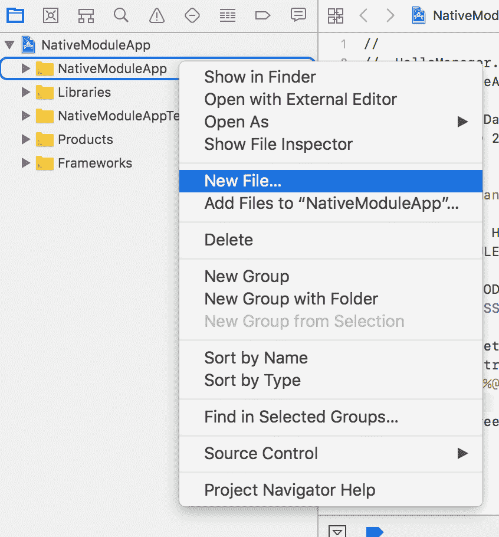
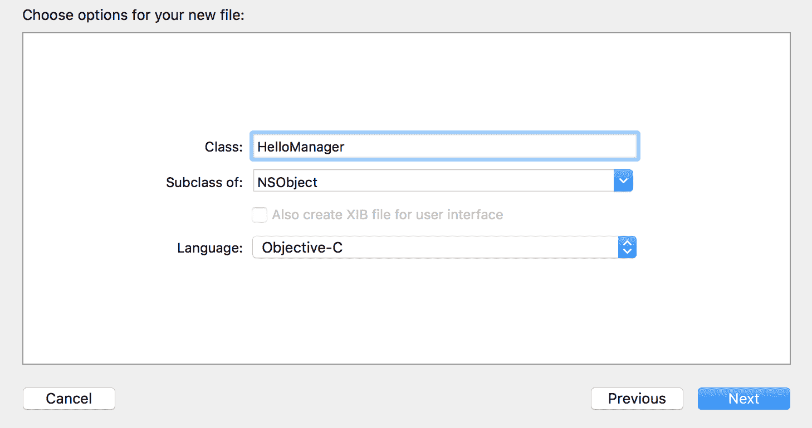
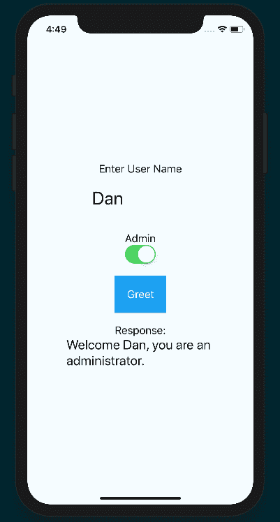
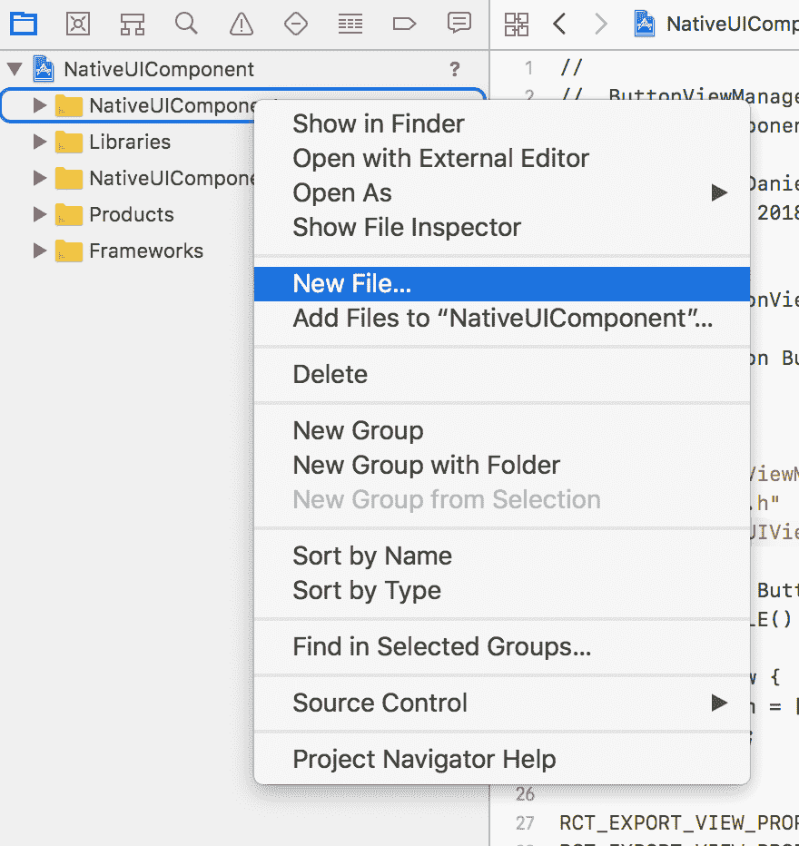
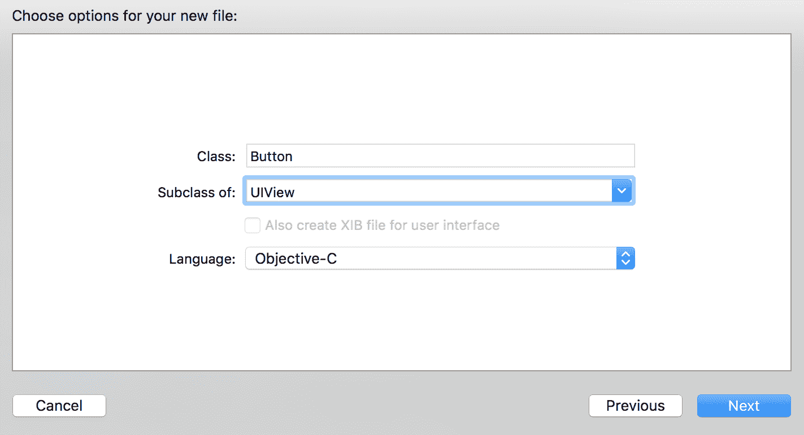
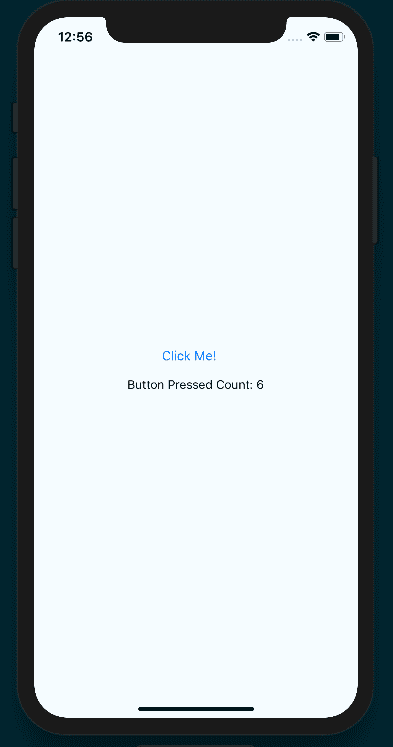
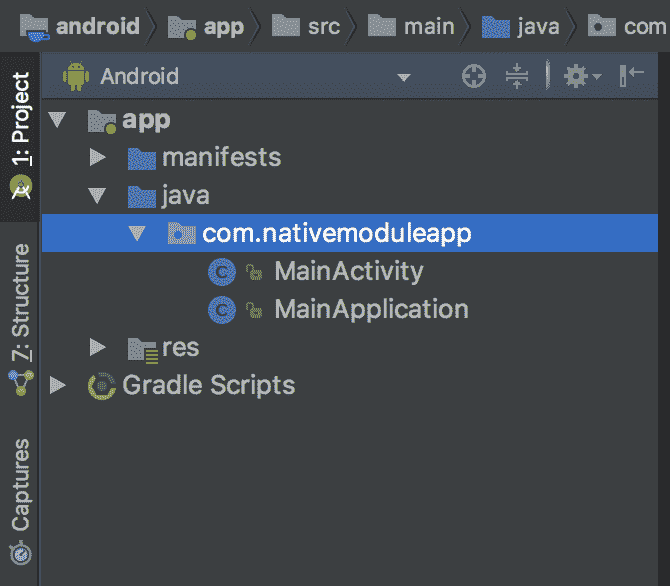
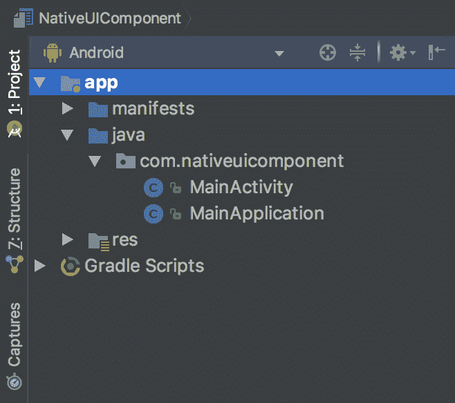
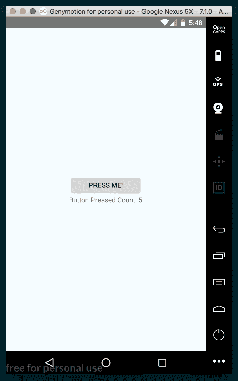

# 十一、添加本机功能——第一部分

在本章中，我们将介绍以下配方：

*   公开自定义 iOS 模块
*   呈现自定义 iOS 视图组件
*   公开定制 Android 模块
*   呈现自定义 Android 视图组件

# 介绍

React 原生开发的核心原则之一是编写 JavaScript 来构建真正的原生移动应用。为了实现这一点，许多本机 API 和 UI 组件通过抽象层公开，并通过 React 本机网桥进行访问。尽管 React Native 和 Expo 团队继续改进和扩展目前已经存在的令人印象深刻的 API，但通过本机 API，我们可以访问其他方面不可用的功能，如振动、联系人、本机警报和祝酒。

通过公开本机视图组件，我们能够利用设备提供的所有渲染性能，因为我们不像在混合应用中那样使用 WebView。这提供了适合用户运行应用的平台的本地外观和感觉。使用 React Native，我们已经能够渲染许多本机视图组件，包括贴图、列表、输入字段、工具栏和选择器。

虽然 React Native 附带了许多内置的本机模块和视图组件，但有时我们需要一些定制功能来利用本机应用层，而这些功能不是现成提供的。幸运的是，有一个非常丰富的开源社区支持 React Native，它不仅为库本身做出了贡献，而且还发布了导出一些常见本机模块和视图组件的库。如果您找不到第一方或第三方库来完成您需要的内容，您可以自己构建它。

在本章中，我们将介绍在两种平台上公开自定义本机功能（无论是 API 还是视图组件）的方法

There will be a lot of generated code in the native portions of the code we'll be using in these recipes. The code blocks provided throughout this chapter will, like in previous chapters, continue to display all of the code used in a particular step, whether it's added by us or generated, unless stated otherwise. This is intended to ease the burden of understanding the context of a piece of code, and facilitates the discussion of these pieces of generated code when further explanation is warranted. 

# 公开自定义 iOS 模块

当您开始开发更有趣、更复杂的 React 本机应用时，您可能会达到这样一个程度：执行某些代码只能在本机层中执行（或显著改进）。这允许在本机层执行比 JavaScript 更快的数据处理，并允许访问某些未公开的本机功能，如文件 I/O，或利用 React 本机应用中其他应用或库的现有本机代码。

这个方法将引导您完成执行一些原生 Objective-C 或 Swift 代码并与 JavaScript 层通信的过程。我们将构建一个本机`HelloManager`模块，该模块将向用户发送一条消息。我们还将展示如何执行本机 Objective-C 和 Swift 代码，引入参数，并展示几种与 UI（或 JavaScript）层通信的方法。

# 准备

对于这个配方，我们需要一个新的空的纯 React 本机应用。我们叫它`NativeModuleApp`。

在本食谱中，我们还将使用`react-native-button`库。这个库将允许我们使用一个比 React 原生组件更复杂的`Button`组件。可与`npm`一起安装：

```jsx
npm install react-native-button --save
```

也可以使用`yarn`进行安装：

```jsx
yarn add react-native-button
```

# 怎么做。。。

1.  我们将首先在 Xcode 中打开 iOS 项目。项目文件具有`.xcodeproj`文件扩展名，位于项目根目录的`ios/`目录中。在我们的例子中，该文件将被称为`NativeModuleApp.xcodeproj`。
2.  我们需要创建一个新文件，方法是选择并右键单击与项目名称匹配的组/文件夹，然后单击新建文件。。。如下图所示：



3.  我们将创建一个 Cocoa 类，因此选择 Cocoa 类并单击 Next。
4.  我们将使用`HelloManager`作为类名，并将的子类设置为 NSObject，语言为 Objective-C，如下所示：



5.  单击 Next 之后，系统将提示我们为新类选择目录。我们想把它保存到`NativeModuleApp`目录
6.  创建这个新的 Cocoa 类向项目中添加了两个新文件：一个头文件（`HelloManager.h`）和一个实现文件（`HelloManager.m`）。
7.  在头文件（`HelloManager.h`中，您应该看到一些生成的代码实现了新的`HelloManager`协议。我们还需要导入 React`RCTBridgeModule`库。文件最终应如下所示：

```jsx
#import <Foundation/Foundation.h>
#import <React/RCTBridgeModule.h>

@interface HelloManager : NSObject <RCTBridgeModule>

@end
```

8.  实现文件（`HelloManager.m`包含了我们模块的功能。为了使我们的 React 本机应用能够从 JavaScript 层访问此模块，我们需要向 React 桥注册它。这是通过在`@implementation`标记后添加`RCT_EXPORT_MODULE()`来完成的。还请注意，头文件也应导入到此文件中：

```jsx
#import "HelloManager.h"

@implementation HelloManager
RCT_EXPORT_MODULE();

@end
```

9.  我们需要添加将导出到 React 本机应用的功能。我们将创建一个`greetUser`方法，该方法将接受两个参数`name`和`isAdmin`。这些参数将用于使用字符串连接创建问候消息，然后通过`callback`将其发送回 JavaScript 层：

```jsx
#import "HelloManager.h"

@implementation HelloManager
RCT_EXPORT_MODULE();

RCT_EXPORT_METHOD(
 greetUser: (NSString *)name isAdmin:(BOOL *)isAdmin callback: (RCTResponseSenderBlock) callback
) {
 NSString *greeting =
 [NSString stringWithFormat:
 @"Welcome %@, you %@ an administrator.", name, isAdmin ? @"are" : @"are not"];

 callback(@[greeting]);
}

@end
```

10.  我们已经准备好切换到 JavaScript 层，该层将有一个 UI，该 UI 将调用我们刚刚创建的本机`HelloManager greetUser`方法，然后显示其输出。幸运的是，React 本地桥为我们完成了所有繁重的工作，并为我们留下了一个简单易用的 JavaScript 对象，它模仿了`NativeModules`API。在本例中，我们将使用`TextInput`和`Switch`为本机模块方法提供`name`和`isAdmin`值。让我们从`App.js`中的 out 导入开始：

```jsx
import React, { Component } from 'react';
import {
  StyleSheet,
  Text,
  View,
  NativeModules,
  TextInput,
  Switch
} from 'react-native';
import Button from 'react-native-button';
```

11.  我们可以使用我们导入的`NativeModules`组件获得我们从本机层创建的`HelloManager`协议：

```jsx
const HelloManager = NativeModules.HelloManager; 
```

12.  让我们创建`App`组件并定义初始`state`对象。我们将添加一个用于保存从本机模块接收的消息的`greetingMessage`属性、`userName`用于存储输入的用户名，以及一个用于表示用户是否为管理员的`isAdmin`布尔值：

```jsx
export default class App extends Component {
  state = {
    greetingMessage: null,
    userName: null,
    isAdmin: false
  }
  // Defined on following steps
}
```

13.  我们已经准备好开始构建`render`方法。首先，我们需要一个`TextInput`组件用于从用户获取用户名，以及一个`Switch`组件用于切换`isAdmin`状态：

```jsx
  render() {
    return (
      <View style={styles.container}>
        <Text style={styles.label}>
          Enter User Name
        </Text>
        <TextInput
          ref="userName"
          autoCorrect={false}
          style={styles.inputField}
          placeholder="User Name"
          onChangeText={(text) => this.setState({ userName: text }) }
        />
        <Text style={styles.label}>
          Admin
        </Text>
        <Switch style={styles.radio}
          value={this.state.isAdmin}
          onValueChange={(value) =>
            this.setState({ isAdmin: value })
          }
        />

        // Continued below
      </View>
    );
  }
```

14.  UI 还需要`Button`向本机模块提交回调，以及`Text`组件显示本机模块返回的消息：

```jsx
  render() {
    return (
      // Defined above.
 <Button
 disabled={!this.state.userName}
 style={[
 styles.buttonStyle,
 !this.state.userName ? styles.disabled : null
 ]}
 onPress={this.greetUser}
 >
 Greet (callback)
 </Button>
 <Text style={styles.label}>
 Response:
 </Text>
 <Text style={styles.message}>
 {this.state.greetingMessage}
 </Text>
      </View>
    );
  }
```

15.  通过 UI 呈现必要的组件，我们准备将`Button`的`onPress`处理程序连接到对本机层的调用。此函数将`displayResults`类方法作为第三个参数传递，这是本机`greetUser`函数将使用的回调。我们将在下一步中定义`displayResults`：

```jsx
  greetUser = () => {
    HelloManager.greetUser(
      this.state.userName,
      this.state.isAdmin,
      this.displayResults
    );
  }
```

16.  `displayResults`需要做两件事：`blur`使用与组件关联的`refs`并将`state`上的`greetingMessage`设置为从本机模块返回的`results`：

```jsx
  displayResults = (results) => {
    this.refs.userName.blur();
    this.setState({ greetingMessage: results });
  }
```

17.  最后一步是将样式添加到布局并设置应用的样式：

```jsx
const styles = StyleSheet.create({
  container: {
    flex: 1,
    justifyContent: 'center',
    alignItems: 'center',
    backgroundColor: '#F5FCFF',
  },
  inputField:{
    padding: 20,
    fontSize: 30
  },
  label: {
    fontSize: 18,
    marginTop: 18,
    textAlign: 'center',
  },
  radio: {
    marginBottom: 20
  },
  buttonStyle: {
    padding: 20,
    backgroundColor: '#1DA1F2',
    color: '#fff',
    fontSize: 18
  },
  message: {
    fontSize: 22,
    marginLeft: 50,
    marginRight: 50,
  },
  disabled: {
    backgroundColor: '#3C3C3C'
  }
});
```

18.  我们现在有了一个可以直接与本机 iOS 层通信的 React 本机应用：



# 它是如何工作的。。。

我们在这个食谱中构建的 app 将作为本章中许多食谱的基础。这也是 Facebook 用来实现许多捆绑的 React 本机 API 的方法。

在未来的发展中，有几个重要的概念需要牢记。我们希望在 JavaScript 层中使用的任何本机模块类都必须扩展`RCTBridgeModule`，因为它包含将我们的类注册到 React 本机网桥上的功能。我们使用`RCT_EXPORT_MODULE`方法调用注册我们的类，该调用在模块注册后在模块上注册方法。注册模块及其各自的方法和属性是允许我们从 JavaScript 层与本机层进行接口的原因。

按下按钮时执行`greetUser`方法。此函数依次调用`HelloManager.greetUser`，将`state`和`displayResults`函数的`userName`和`isAdmin`属性作为回调传递。`displayResults`将新的`greetingMessage`设置为`state`上，导致 UI 刷新并显示消息。

# 另见

*   关于 React 本机应用如何启动的说明：[https://levelup.gitconnected.com/wait-what-happens-when-my-react-native-application-starts-an-in-depth-look-inside-react-native-5f306ef3250f](https://levelup.gitconnected.com/wait-what-happens-when-my-react-native-application-starts-an-in-depth-look-inside-react-native-5f306ef3250f)
*   深入探讨 React 本地事件实际上是如何工作的：[https://levelup.gitconnected.com/react-native-events-in-gory-details-what-happens-on-the-way-to-listeners-2cee6c55940c](https://levelup.gitconnected.com/react-native-events-in-gory-details-what-happens-on-the-way-to-listeners-2cee6c55940c)

# 呈现自定义 iOS 视图组件

在 React 本机应用的本机层上执行代码时，利用设备的处理能力非常重要，而利用其呈现能力来显示本机 UI 组件也同样重要。React Native 可以呈现在应用中作为`UIView`实现的任何 UI 组件。这些组件可以是列表、表单字段、表格、图形等。

对于这个配方，我们将创建一个名为`NativeUIComponent`的 React 本机应用。

在这个配方中，我们将采用本机`UIButton`并将其作为 React 本机视图组件公开。您可以设置按钮标签，并在按下按钮时附加处理程序。

# 怎么做。。。

1.  让我们从在 Xcode 中打开 iOS 项目开始。项目文件位于项目的`ios/`目录中，应称为`NativeUIComponent.xcodeproj`。
2.  选择并右键单击与项目名称匹配的组，然后单击新建文件…：



3.  我们将创建一个 Cocoa 类，因此选择 Cocoa 类并单击 Next。
4.  我们将创建一个按钮，因此让我们将类命名为`Button`，并将的子类设置为 UIView，将语言设置为 Objective-C：



5.  单击 Next 之后，系统将提示我们为新类选择目录。我们希望将其保存到`NativeUIComponent`目录中以创建类。

6.  我们还需要一门`ButtonViewManager`课。您可以使用`ButtonViewManager`作为类名，`RCTViewManager`作为子类重复步骤 2 到 5。
7.  首先，我们要实现我们的`Button`UI 类。在头文件（`Button.h`中，我们将从 React 导入`RCTComponent.h`并添加一个`onTap`属性来连接我们的 tap 事件：

```jsx
#import <UIKit/UIKit.h>
#import "React/RCTComponent.h"

@interface Button : UIView

@property (nonatomic, copy) RCTBubblingEventBlock onTap;

@end
```

8.  让我们来处理实现文件（`Button.m`。首先，我们将为`UIButton`实例和保存按钮标签的字符串创建引用：

```jsx
#import "Button.h"
#import "React/UIView+React.h"

@implementation Button {
  UIButton *_button;
  NSString *_buttonText;
}

// Defined in following steps
```

9.  桥接器将为`buttonText`属性寻找一个 setter。我们将在此处设置`UIButton`实例标题字段：

```jsx
-(void) setButtonText:(NSString *)buttonText {
  NSLog(@"Set text %@", buttonText);
  _buttonText = buttonText;
  if(_button) {
    [_button setTitle:
     buttonText forState:UIControlStateNormal];
    [_button sizeToFit];
  }
}
```

10.  我们的`Button`将接受来自 React 本机应用的`onTap`事件处理程序。我们需要通过操作选择器将其连接到我们的`UIButton`实例：

```jsx
- (IBAction)onButtonTap:(id)sender {
  self.onTap(@{});
}
```

11.  我们需要实例化`UIButton`并将其放置在 React`Subview`中。我们将此方法称为`layoutSubviews`：

```jsx
-(void) layoutSubviews {
  [super layoutSubviews];
  if( _button == nil) {
    _button =
    [UIButton buttonWithType:UIButtonTypeRoundedRect];
    [_button addTarget:self action:@selector(onButtonTap:)
      forControlEvents:UIControlEventTouchUpInside];
    [_button setTitle:
     _buttonText forState:UIControlStateNormal];
    [_button sizeToFit];
    [self insertSubview:_button atIndex:0];
  }
}
```

12.  让我们导入`ButtonViewManager.h`头文件中的 React`RCTViewManager`：

```jsx
#import "React/RCTViewManager.h"

@interface ButtonViewManager : RCTViewManager

@end
```

13.  现在我们需要实现我们的`ButtonViewManager`，它将与我们的 React 本机应用接口。让我们在实现文件（`ButtonViewManager.m`上工作，以实现这一点。我们使用`RCT_EXPORT_VIEW_PROPERTY`将`buttonText`属性和`onTap`方法传递给反应原生层：

```jsx
#import "ButtonViewManager.h"
#import "Button.h"
#import "React/UIView+React.h"

@implementation ButtonViewManager
RCT_EXPORT_MODULE()

- (UIView *)view {
  Button *button = [[Button alloc] init];
  return button;
}

RCT_EXPORT_VIEW_PROPERTY(buttonText, NSString);
RCT_EXPORT_VIEW_PROPERTY(onTap, RCTBubblingEventBlock);

@end
```

14.  我们已经准备好切换到 React 原生层。我们需要一个自定义的`Button`组件，所以让我们在项目的根目录中创建一个新的`components`文件夹，其中包含一个新的`Button.js`文件。我们还需要从 React Native 导入`requireNativeComponent`组件，以便与我们的本机 UI 组件接口：

```jsx
import React, { Component } from 'react';
import {
  StyleSheet,
  Text,
  View
} from 'react-native';
import Button from './components/Button';
```

15.  `Button`组件将获取我们先前通过`requireNativeComponent`React native helper 创建的本机`Button`模块。调用将 React 原生层中用作组件名称的字符串作为第一个参数，第二个参数将文件中的`Button`组件作为第二个参数，有效地将两者连接在一起：

```jsx
export default class Button extends Component {
  render() {
    return <ButtonView {...this.properties} />;
  }
}

const ButtonView = requireNativeComponent('ButtonView', Button);
```

16.  我们已经准备好在项目根目录的`App.js`文件中构建主`App`组件。我们将从导入开始，它将包括我们在最后两个步骤中创建的`Button`组件：

```jsx
import React, { Component } from 'react';
import {
  StyleSheet,
  Text,
  View
} from 'react-native';
import Button from './components/Button';
```

17.  让我们定义`App`组件和初始`state`对象。`count`属性将记录`Button`组件被按下的次数：

```jsx
export default class App extends Component {
 state = {
  count: 0
 }
 // Defined on following steps
}
```

18.  我们已经准备好定义`render`方法，它将只包括`Button`组件，以及用于显示当前按钮按下次数的`Text`元素：

```jsx
  render() {
    return (
      <View style={styles.container}>
        <Button buttonText="Click Me!"
        onTap={this.handleButtonTap}
        style={styles.button}
      />
        <Text>Button Pressed Count: {this.state.count}</Text>
      </View>
    );
  }
```

19.  您可能还记得，我们创建的`Button`组件有一个`onTap`属性，它接受回调函数。在这种情况下，我们将使用此函数来增加`state`上的计数器：

```jsx
  handleButtonTap = () => {
    this.setState({
      count: this.state.count + 1
    });
  }
```

20.  让我们用几个基本风格来总结这个食谱：

```jsx
const styles = StyleSheet.create({
  container: {
    flex: 1,
    justifyContent: 'center',
    alignItems: 'center',
    backgroundColor: '#F5FCFF',
  },
  button: {
    height: 40,
    width: 80
  }
});
```

21.  应用已完成！按下按钮时，将执行传递给`onTap`的功能，计数器增加一个：



# 它是如何工作的。。。

在此配方中，我们公开了一个基本的本机 UI 组件。这与创建 React Native 中内置的所有 UI 组件（例如，`Slider`、`Picker`和`ListView`）的方法相同。

The most important requirement in creating UI components is that your `ViewManager` extends `RCTViewManager` and returns an instance of `UIView`. In our case, we're wrapping `UIButton` with a React-specific `UIView` extension, which improves our ability to layout and style the component.

下一个重要因素是发送属性并对组件事件作出反应。在步骤 13 中，我们使用 React Native 提供的`RCT_EXPORT_VIEW_PROPERTY`方法将来自 JavaScript 层的`buttonText`和`onTap`视图属性注册到`Button`组件。然后创建并返回该`Button`组件以在 JavaScript 层中使用：

```jsx
- (UIView *)view {
  Button *button = [[Button alloc] init];
  return button;
}
```

# 公开定制 Android 模块

通常，您会发现 React 本机应用需要与本机 iOS 和 Android 代码接口。在讨论了集成本机 iOS 模块之后，现在是时候介绍 Android 中的等效配方了。

这个方法将带领我们完成第一个 Android 本机模块的编写。我们将创建一个带有`greetUser`方法的`HelloManager`本机模块，该方法将`name`和`isAdmin`布尔值作为参数，将返回一条问候消息，我们将在 UI 中显示。

# 准备

对于这个配方，我们需要创建另一个纯 React 本机应用。让我们把这个项目也命名为`NativeModuleApp`。

我们还将再次使用`react-native-button`库，该库可以安装`npm`：

```jsx
npm install react-native-button --save
```

或者，可以使用`yarn`安装：

```jsx
yarn add react-native-button
```

# 怎么做。。。

1.  我们将首先在 Android Studio 中打开新项目的 Android 代码。在 Android Studio 欢迎屏幕中，您可以选择打开现有的 Android Studio 项目，然后选择项目文件夹内的`android`目录。
2.  项目加载完成后，我们打开 Android Studio 左侧的 project explorer（即目录树），展开包结构，找到 Java 源文件，应该在`app/java/com.nativemoduleapp`中。文件夹中应该已经有两个`.java`文件，`MainActivity`和`MainApplication`：



3.  Right-click on the com.nativemoduleapp package, select New | Java Class, and name the class `HelloManager`. Also, be sure to set the Kind field to Class:

    

4.  我们还需要在同一目录中有一个`HelloPackage`类。您可以重复步骤 2 和 3 来创建此类，只需应用新名称并将“种类”字段设置为“类”。
5.  让我们从实现我们的`HelloManager`本机模块开始。我们将从该文件中需要的`package`名称和依赖项开始：

```jsx
package com.nativemoduleapp;

import com.facebook.react.bridge.Callback;
import com.facebook.react.bridge.ReactApplicationContext;
import com.facebook.react.bridge.ReactContextBaseJavaModule;
import com.facebook.react.bridge.ReactMethod;
```

6.  `ReactContextBaseJavaModule`是所有 React 本机模块的基类，因此我们将创建`HelloManager`类作为其子类。我们还需要定义一个`getName`方法，用于向 React native 桥注册本机模块。这是与 iOS 本机模块实现的一个区别，因为它们是通过类名定义的：

```jsx
public class HelloManager extends ReactContextBaseJavaModule {
  public HelloManager(ReactApplicationContext reactContext) {
    super(reactContext);
  }

  @Override
  public String getName() {
    return "HelloManager";
  }
}
```

7.  现在我们已经设置了我们的`HelloManager`本机模块，是时候向其添加`greetUser`方法了，该方法将作为参数`name`、`isAdmin`以及将执行的回调来将消息发送到 React 本机层：

```jsx
public class HelloManager extends ReactContextBaseJavaModule {
  // Defined in previous steps  

 @ReactMethod
 public void greetUser(String name, Boolean isAdmin, Callback callback) {
 System.out.println("User Name: " + name + ", Administrator: " + (isAdmin ? "Yes" : "No"));
 String greeting = "Welcome " + name + ", you " + (isAdmin ? "are" : "are not") + " an administrator";

 callback.invoke(greeting);
 }
}
```

8.  Android 独有的另一个步骤是必须向应用注册本机模块，这是一个两步过程。第一步是将我们的`HelloManager`模块添加到我们之前创建的`HelloPackage`类中。我们将从`HelloPackage.java`的依赖项开始：

```jsx
package com.nativemoduleapp;

import com.facebook.react.ReactPackage;
import com.facebook.react.bridge.NativeModule;
import com.facebook.react.bridge.ReactApplicationContext;
import com.facebook.react.uimanager.ViewManager;

import java.util.ArrayList;
import java.util.Collections;
import java.util.List;
```

9.  `HelloPackage`的实施完全遵循官方文件（[提供的模式 https://facebook.github.io/react-native/docs/native-modules-android.html](https://facebook.github.io/react-native/docs/native-modules-android.html) ）。这里最重要的部分是对`modules.add`的调用，其中传入了`HelloManager`的一个新实例，并将`reactContext`作为其参数：

```jsx
public class HelloPackage implements ReactPackage {

  @Override
  public List<ViewManager> createViewManagers(ReactApplicationContext reactContext) {
    return Collections.emptyList();
  }

  @Override
  public List<NativeModule> createNativeModules(ReactApplicationContext reactContext) {
    List<NativeModule> modules = new ArrayList<>();
    modules.add(new HelloManager(reactContext));

    return modules;
  }
}
```

10.  向 React native app 注册本机模块的第二步是向`MainApplication`模块添加`HelloPackage`。这里的大部分代码是由 React 本机引导过程生成的。`getPackages`方法需要更新，将`new MainReactPackage()`和`new HelloPackage()`作为传递给`Arrays.asList`的参数：

```jsx
package com.nativemoduleapp;

import android.app.Application;

import com.facebook.react.ReactApplication;
import com.facebook.react.ReactNativeHost;
import com.facebook.react.ReactPackage;
import com.facebook.react.shell.MainReactPackage;
import com.facebook.soloader.SoLoader;

import java.util.Arrays;
import java.util.List;

public class MainApplication extends Application implements ReactApplication {

 private final ReactNativeHost mReactNativeHost = new ReactNativeHost(this) {
    @Override
    public boolean getUseDeveloperSupport() {
      return BuildConfig.DEBUG;
    }

 @Override
 protected List<ReactPackage> getPackages() {
 return Arrays.asList(
 new MainReactPackage(),
 new HelloPackage()
 );
 }

    @Override
    protected String getJSMainModuleName() {
      return "index";
    }
  };

  @Override
  public ReactNativeHost getReactNativeHost() {
    return mReactNativeHost;
  }

  @Override
  public void onCreate() {
    super.onCreate();
    SoLoader.init(this, /* native exopackage */ false);
  }
}
```

11.  我们已经完成了这个配方的 Java 部分。我们需要构建 UI，它将调用本机`HelloManager greetUser`方法并显示其输出。在本例中，我们将使用`TextInput`和`Switch`为本机模块方法提供`name`和`isAdmin`值。这与我们在*公开定制 iOS 模块*配方中在 iOS 上实现的功能相同。让我们开始构建`App.js`，从我们需要的依赖项开始：

```jsx
import React, { Component } from 'react';
import {
  StyleSheet,
  Text,
  View,
  NativeModules,
  TextInput,
  Switch,
  DeviceEventEmitter
} from 'react-native';
import Button from 'react-native-button';
```

12.  我们需要引用位于导入的`NativeModules`组件上的`HelloManager`对象：

```jsx
const { HelloManager } = NativeModules;
```

13.  让我们创建`App`类和初始`state`：

```jsx
export default class App extends Component {
  state = {
    userName: null,
    greetingMessage: null,
    isAdmin: false
  }
}
```

14.  我们已经准备好定义组件的`render`函数。这段代码将不会详细描述，因为它基本上与本章开头的*公开定制 iOS 模块*配方中定义的`render`功能相同：

```jsx
  render() {
    return (
      <View style={styles.container}>
        <Text style={styles.label}>
          Enter User Name
        </Text>
        <TextInput
          ref="userName"
          autoCorrect={false}
          style={styles.inputField}
          placeholder="User Name"
          onChangeText={(text) => this.setState({ userName: text })
          }
        />
        <Text style={styles.label}>
          Admin
        </Text>
        <Switch
          style={styles.radio}
          onValueChange={
            value => this.setState({ isAdmin: value })
          }
          value={this.state.isAdmin}
        />
       <Button
          disabled={!this.state.userName}
          style={[
            styles.buttonStyle,
            !this.state.userName ? styles.disabled : null
          ]}
          onPress={this.greetUser}
        >
          Greet
        </Button>
        <Text style={styles.label}>
          Response:
        </Text>
        <Text style={styles.message}>
          {this.state.greetingMessage}
        </Text>
      </View>
    );
  }
```

15.  通过 UI 呈现必要的组件，我们现在需要连接`Button`的`onPress`处理程序，通过`HelloManager.greetUser`进行本机调用：

```jsx
  updateGreetingMessage = (result) => {
    this.setState({
      greetingMessage: result
    });
  }

  greetUser = () => {
    this.refs.userName.blur();
    HelloManager.greetUser(
      this.state.userName,
      this.state.isAdmin,
      this.updateGreetingMessage
    );
  }
```

16.  我们将向布局中添加样式，并为应用设置样式。同样，这些样式与本章开头的*公开定制 iOS 模块*配方中使用的样式相同：

```jsx
const styles = StyleSheet.create({
  container: {
    flex: 1,
    justifyContent: 'center',
    alignItems: 'center',
    backgroundColor: '#F5FCFF',
  },
  inputField:{
    padding: 20,
    fontSize: 30,
    width: 200
  },
  label: {
    fontSize: 18,
    marginTop: 18,
    textAlign: 'center',
  },
  radio: {
    marginBottom: 20
  },
  buttonStyle: {
    padding: 20,
    backgroundColor: '#1DA1F2',
    color: '#fff',
    fontSize: 18
  },
  message: {
    fontSize: 22,
    marginLeft: 50,
    marginRight: 50,
  },
  disabled: {
    backgroundColor: '#3C3C3C'
  }
});
```

17.  最终的应用应类似于以下屏幕截图：


# 它是如何工作的。。。

这个食谱涵盖了我们将在未来的食谱中添加原生 Android 模块所做的大部分工作的基础。所有本机模块类都需要扩展`ReactContextBaseJavaModule`，实现构造函数，定义`getName`方法。所有应该暴露于 React 原生层的方法都需要有`@ReactMethod`注释。与 iOS 相比，创建 React 本机 Android 本机模块的开销更大，因为您还必须将模块封装在实现`ReactPackage`的类中（在此配方中，即`HelloPackage`模块），并向 React 本机项目注册该包。这在步骤 7 和 8 中完成。

在配方的 JavaScript 部分，当用户按下`Button`组件时，执行`greetUser`函数。这反过来调用`HelloManager.greetUser`，将`state`和`updateGreetingMessage`方法中的`userName`和`isAdmin`属性作为回调传递。`updateGreetingMessage`在`state`上设置新的`greetingMessage`，从而刷新 UI 并显示消息。

# 呈现自定义 Android 视图组件

React-Native 如此受欢迎的一个原因是它能够呈现真正的本机 UI 组件。通过 Android 上的本机 UI 组件，我们不仅可以利用 GPU 的渲染能力，还可以获得本机组件的本机外观，包括本机字体、颜色和动画。Android 上的 Web 和混合应用使用 CSS 多边形填充来模拟本地动画，但在 React native 中，我们可以得到真实的动画。

我们需要一个新的纯反应本机应用来制作这个食谱。让我们把它命名为`NativeUIComponent`。在这个配方中，我们将采用本机`Button`并将其作为 React 本机视图组件公开

# 怎么做。。。

1.  让我们首先在 Android Studio 中打开 Android 项目。在 Android Studio 欢迎屏幕中，选择打开现有的 Android Studio 项目并打开项目的`android`目录。

2.  打开 project explorer 并展开包结构，直到可以看到 Java 源文件（例如，`app/java/com.nativeuicomponent`）：



3.  右键单击包并选择 New | Java 类。使用`ButtonViewManager`作为类名，并将种类字段设置为 class。
4.  使用相同的方法也创建一个`ButtonPackage`类。
5.  让我们开始实现我们的`ButtonViewManager`类，它必须是`SimpleViewManager<View>`的子类。我们将从导入开始并定义类本身：

```jsx
package com.nativeuicomponent;

import android.view.View;
import android.widget.Button;

import com.facebook.react.bridge.Arguments;
import com.facebook.react.bridge.ReactContext;
import com.facebook.react.bridge.WritableMap;
import com.facebook.react.uimanager.SimpleViewManager;
import com.facebook.react.uimanager.ThemedReactContext;
import com.facebook.react.uimanager.annotations.ReactProp;
import com.facebook.react.uimanager.events.RCTEventEmitter;

public class ButtonViewManager extends SimpleViewManager<Button> implements View.OnClickListener {
  // Defined on following steps
}
```

The file class name `ButtonViewManager` follows the Android naming convention of adding the suffix `ViewManager` to any `View` component.

6.  让我们用返回我们分配给组件的字符串名称的`getName`方法开始类定义，在本例中为`ButtonView`：

```jsx
public class ButtonViewManager extends SimpleViewManager<Button> implements View.OnClickListener{
 @Override
 public String getName() {
 return "ButtonView";
 }

  // Defined on following steps.
}
```

7.  需要使用`createViewInstance`方法定义 React 应如何初始化模块：

```jsx
  @Override
  protected Button createViewInstance(ThemedReactContext reactContext) {
    Button button = new Button(reactContext);
    button.setOnClickListener(this);
    return button;
  }
```

8.  `setButtonText`将从 React Native 元素的属性中使用，以设置按钮上的文本：

```jsx
  @ReactProp(name = "buttonText")
  public void setButtonText(Button button, String buttonText) {
    button.setText(buttonText);
  }
```

9.  `onClick`方法定义按下按钮时会发生什么。此方法使用`RCTEventEmitter`处理从 React 本机层接收事件：

```jsx
  @Override
  public void onClick(View v) {
    WritableMap map = Arguments.createMap();
    ReactContext reactContext = (ReactContext) v.getContext();
    reactContext.getJSModule(RCTEventEmitter.class).receiveEvent(v.getId(), "topChange", map);
  }
```

10.  就像上一个配方一样，我们需要在`ButtonPackage`中添加`ButtonViewManager`；然而，这一次，我们将其定义为`ViewManager`而不是`NativeModule`：

```jsx
package com.nativeuicomponent;

import com.facebook.react.ReactPackage;
import com.facebook.react.bridge.NativeModule;
import com.facebook.react.bridge.ReactApplicationContext;
import com.facebook.react.uimanager.ViewManager;

import java.util.Arrays;
import java.util.Collections;
import java.util.List;

public class ButtonPackage implements ReactPackage {
  @Override
  public List<ViewManager> createViewManagers(ReactApplicationContext reactContext) {
    return Arrays.<ViewManager>asList(new ButtonViewManager());
  }

  @Override
  public List<NativeModule> createNativeModules(ReactApplicationContext reactContext) {
    return Collections.emptyList();
  }
}
```

11.  Java 层的最后一步是将`ButtonPackage`添加到`MainApplication`。`MainApplication.java`中已经有相当多的样板代码，我们只需要更改`getPackages`方法：

```jsx
    @Override
    protected List<ReactPackage> getPackages() {
      return Arrays.<ReactPackage>asList(
        new MainReactPackage(),
        new ButtonPackage()
      );
    }
```

12.  切换到 JavaScript 层，让我们构建 React 本机应用。首先，让我们在项目根目录的`components/Button.js`中创建一个新的`Button`组件。本机按钮将位于应用的 React native 层中。`render`方法使用本机按钮作为`ButtonView`，我们将在下一步中定义：

```jsx
import React, { Component } from 'react';
import { requireNativeComponent, View } from 'react-native';

export default class Button extends Component {
  onChange = (event) => {
    if (this.properties.onTap) {
      this.properties.onTap(event.nativeEvent.message);
    }
  }

  render() {
    return(
      <ButtonView
        {...this.properties}
        onChange={this.onChange}
      />
    );
  }
}
```

13.  我们可以使用`requireNativeComponent`助手将本机按钮创建为 React 本机组件，该组件使用三个参数：字符串`ButtonView`定义组件名称、上一步中定义的`Button`组件和选项对象。在*的工作原理中有更多关于这个物体的信息。。。本配方末尾的*部分：

```jsx
const ButtonView = requireNativeComponent(
  'ButtonView',
  Button, {
    nativeOnly: {
      onChange: true
    }
  }
);
```

14.  我们已经准备好定义`App`类。让我们从依赖项开始，包括之前创建的`Button`组件：

```jsx
import React, { Component } from 'react';
import {
  StyleSheet,
  Text,
  View
} from 'react-native';

import Button from './components/Button';
```

15.  此配方中的`App`组件与本章前面的*呈现自定义 iOS 视图组件*配方基本相同。按下`Button`组件时会触发自定义`onTap`属性，在`state`上的`count`属性中添加`1`：

```jsx
export default class App extends Component {
  state = {
    count: 0
  }

  onButtonTap = () => {
    this.setState({
      count : this.state.count + 1
    });
  }

  render() {
    return (
      <View style={styles.container}>
        <Button buttonText="Press Me!"
          onTap={this.onButtonTap}
          style={styles.button}
        />
        <Text>
          Button Pressed Count: {this.state.count}
        </Text>
      </View>
    );
  }
}
```

16.  让我们为应用 UI 的布局和大小添加一些样式：

```jsx
const styles = StyleSheet.create({
  container: {
    flex: 1,
    justifyContent: 'center',
    alignItems: 'center',
    backgroundColor: '#F5FCFF',
  },
  button: {
    height: 40,
    width: 150
  }
});
```

17.  最终的应用应类似于以下屏幕截图：



# 它是如何工作的。。。

在定义本机视图时，正如我们对`ButtonViewManager`类所做的那样，它必须扩展`SimpleViewManager`并呈现扩展`View`的类型。在我们的配方中，我们呈现了一个`Button`视图，并使用`@ReactProp`注释来定义属性。当我们需要与 JavaScript 层通信时，我们从本机组件触发一个事件，我们在本配方的*步骤 9*中实现了该事件。

在*步骤 12*中，我们创建了一个`onChange`监听器，它将执行从 Android 层传入的事件处理程序（`event.nativeEvent.message`。

关于*步骤 13*中`nativeOnly`选项的使用，来自 React 原生文档：

Sometimes you'll have some special properties that you need to expose for the native component, but don't actually want them as part of the API for the associated React component. For example, `Switch` has a custom `onChange` handler for the raw native event, and exposes an `onValueChange` handler property that is invoked with just the Boolean value, rather than the raw event. Since you don't want these native only properties to be part of the API, you don't want to put them in `propTypes`, but if you don't, you'll get an error. The solution is simply to call them out via the `nativeOnly` option.