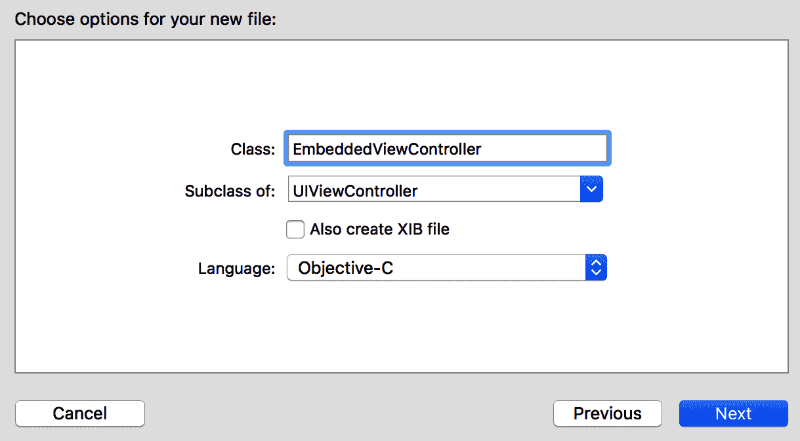
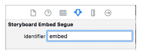
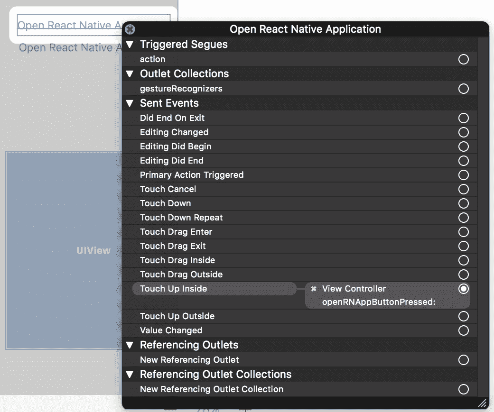
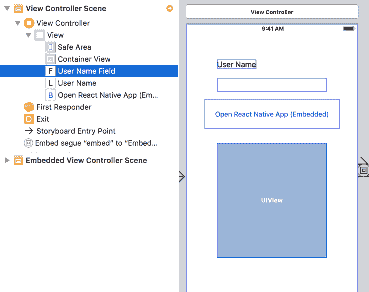
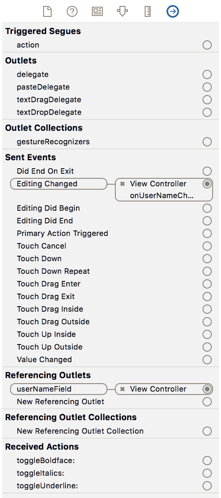
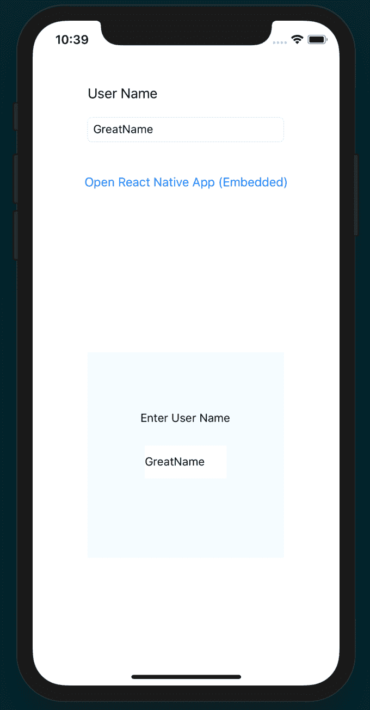
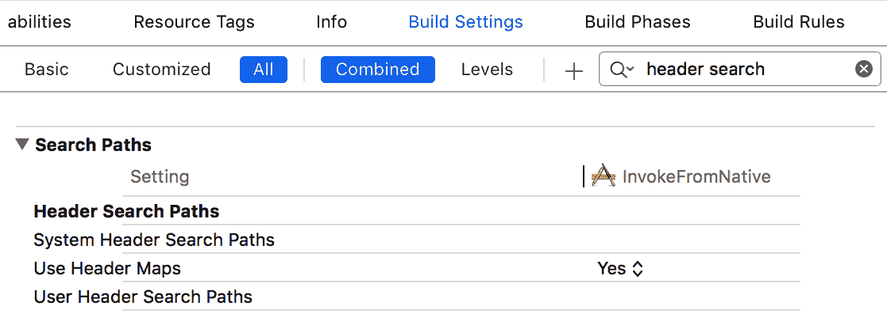
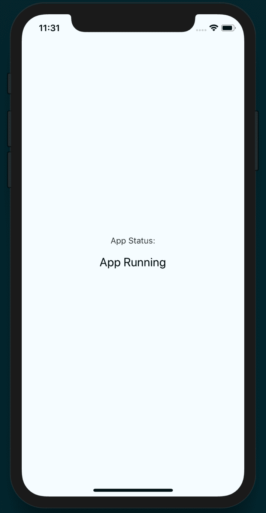
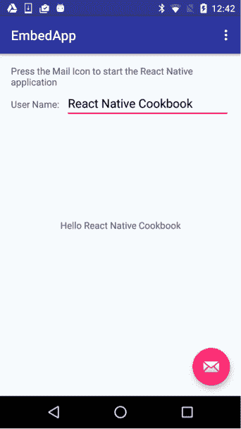
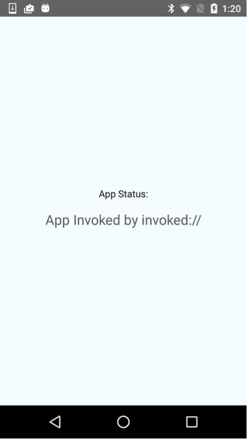

# 与本机应用程序的集成

在本章中，我们将介绍以下配方：

*   组合 React 本机应用程序和本机 iOS 应用程序
*   从 iOS 应用程序进行通信以响应本机
*   从 React Native 到 iOS 应用程序容器进行通信
*   由外部 iOS 应用程序调用的句柄
*   结合 React 本机应用程序和本机 Android 应用程序
*   从 Android 应用程序进行通信以响应本机
*   从 React Native 通信到 Android 应用程序容器
*   由外部 Android 应用程序调用的句柄

# 介绍

React Native 是作为一种使用 JavaScript 构建本机应用程序的解决方案引入的，目的是让更多的开发人员能够为多个平台构建真正的本机应用程序。作为与团队一起构建 React 本机应用程序的结果，JavaScript 开发人员和本机开发人员密切合作是很常见的

React-Native 呈现本机 UI 视图的能力的优点之一是，它们可以轻松嵌入现有的本机应用程序中。公司已经拥有对其业务线至关重要的复杂本机应用程序的情况并不少见。如果应用程序没有损坏，可能不需要立即在 React Native 中重写他们的整个代码库。在这种情况下，JavaScript 和本机开发人员都可以利用 React-Native 编写可集成到现有应用程序中的 React-Native 代码。

本章将专门关注在现有的本机 iOS 和 Android 应用程序中使用 React Native。我们将介绍如何在本机应用程序中呈现 React 本机应用程序，如何在 React 本机应用程序与其本机父应用程序之间通信，以及如何使用用户设备上的其他应用程序调用 React 本机应用程序。

When working on the Android recipes, it is recommended that you enable the auto-import settings in Android Studio or use *Alt*+*Enter* to perform a quick fix code completion for the class import.

# 组合 React 本机应用程序和本机 iOS 应用程序

如果你为一家公司工作，或者你的客户机上有一个活跃的 iOS 应用程序，那么从头开始重写它可能并不有利，尤其是如果它构建良好、使用频繁并受到用户的赞扬。如果您只想使用 React-Native 构建新功能，React-Native 应用程序可以嵌入并呈现在现有的本机 iOS 应用程序中。

本食谱将介绍如何创建一个空白的 iOS 应用程序，并将其添加到 React 本机应用程序中，以便两个层可以相互通信。我们将介绍两种呈现 React 本机应用程序的方法：作为嵌套视图嵌入到应用程序中，另一种作为全屏实现。本配方中讨论的步骤可作为呈现 React 本机应用程序以及本机 iOS 应用程序的基准。

# 准备

此配方将引用名为`EmbeddedApp`的本机 iOS 应用程序。在本节中，我们将介绍如何创建示例 iOS 应用程序。如果您已经有了打算与 React Native 集成的 iOS 应用程序，您可以跳到配方说明。但是，您需要确保已安装`cocoapods`。此库是 Xcode 项目的包管理器。可使用以下命令通过自制软件进行安装：

```jsx
brew install cocoapods
```

安装了`cocoapods`后，下一步是在 Xcode 中创建一个新的本机 iOS 项目。这可以通过打开 Xcode 并选择 File | New | Project 来完成。在下面的窗口中，选择默认的单视图应用程序 iOS 模板开始，然后点击下一步。

在新项目的选项屏幕中，确保将产品名称字段设置为`EmbeddedApp`：


# 怎么做。。。

1.  我们将首先创建一个新的本地应用程序，作为我们项目的根。让我们把新项目命名为`EmbedApp`。您可以使用以下命令使用 CLI 创建新的 React 本机应用程序：

```jsx
react-native init EmbedApp
```

2.  通过使用 CLI 创建新应用程序，`ios`和`android`子文件夹将自动为我们创建，保存每个平台的本机代码。让我们将我们在*准备就绪*部分创建的本机应用程序移动到`ios`文件夹中，以便它位于`/EmbedApp/ios/EmbeddedApp`。
3.  现在我们已经有了应用程序所需的基本结构，我们需要添加一个 Podfile。这是一个类似于 web 开发中的`package.json`的文件，用于跟踪项目中使用的所有 cocoapod 依赖项（称为 POD）。该 POD 文件应始终位于 vanilla iOS 项目的根目录中，在我们的示例中为`/EmbedApp/ios/EmbeddedApp`。在终端中，`cd`进入该目录并运行`pod init`命令。这将为您生成一个基本 Podfile。
4.  接下来，在您喜爱的 IDE 中打开 pod 文件。我们将把应用程序所需的播客添加到此文件中。以下是最终 Podfile 的内容，新添加的 React 原生依赖项以粗体显示：

```jsx
target 'EmbeddedApp' do
  # Uncomment the next line if you're using Swift or would like to use dynamic frameworks
  # use_frameworks!

  # Pods for EmbeddedApp

  target 'EmbeddedAppTests' do
    inherit! :search_paths
    # Pods for testing
  end

  target 'EmbeddedAppUITests' do
    inherit! :search_paths
    # Pods for testing
  end

 # Pods that will be used in the app
 pod 'React', :path => '../../node_modules/react-native', :subspecs => [
 'Core',
 'CxxBridge', # Include this for RN >= 0.47
 'DevSupport', # Include this to enable In-App Devmenu if RN >= 0.43
 'RCTText',
 'RCTNetwork',
 'RCTWebSocket', # Needed for debugging
 'RCTAnimation', # Needed for FlatList and animations running on native UI thread
 # Add any other subspecs you want to use in your project
 ]

 # Explicitly include Yoga if you are using RN >= 0.42.0
 pod 'yoga', :path => '../../node_modules/react-native/ReactCommon/yoga'

 # Third party deps podspec link
 pod 'DoubleConversion', :podspec => '../../node_modules/react-native/third-party-podspecs/DoubleConversion.podspec'
 pod 'glog', :podspec => '../../node_modules/react-native/third-party-podspecs/glog.podspec'
 pod 'Folly', :podspec => '../../node_modules/react-native/third-party-podspecs/Folly.podspec'

end
```

Notice how each of the paths listed in the React Native dependencies that we're adding point to the `/node_modules` folder of the React Native project. If your native project (in our case, `EmbeddedApp`) was at a different location, these references to `/node_modules` would have to be updated accordingly.

5.  有了 pod 文件，安装 pod 本身就很容易了，只需在我们创建 pod 文件的同一目录下从终端运行`pod install`命令即可。
6.  接下来，让我们回到项目根目录`/EmbedApp`中的 React 本机应用程序。首先，我们将删除`index.js`中生成的代码，并将其替换为我们自己的简单 React 本机应用程序。在文件底部，我们将使用`AppRegistry`组件上的`registerComponent`方法将`EmbedApp`注册为 React 本机应用程序的根组件。这将是一个非常简单的应用程序，只呈现文本`Hello in React Native`以便在后续步骤中将其与本机层区分开来：

```jsx
import React, { Component } from 'react';
import {
  AppRegistry,
  StyleSheet,
  View,
  Text
} from 'react-native';

class EmbedApp extends Component {
  render() {
    return (
      <View style={styles.container}>
        <Text>Hello in React Native</Text>
      </View>
    );
  }
}

const styles = StyleSheet.create({
  container: {
    flex: 1,
    justifyContent: 'center',
    alignItems: 'center',
    backgroundColor: '#F5FCFF',
  }
});

AppRegistry.registerComponent('EmbedApp', () => EmbedApp);
```

7.  现在我们有了 React 本机应用程序，我们可以转到本机代码。当我们在*步骤 3*中初始化 cocoapods 时，它也生成了一个新的`.xcworkspace`文件。请确保在 Xcode 中关闭`EmbeddedApp`项目，然后使用`EmbeddedApp.xcworkspace`文件在 Xcode 中重新打开它。
8.  在 Xcode 中，我们打开`Main.storyboard`：


9.  在情节提要中，我们需要添加两个按钮：一个标记为 Open React Native App，另一个标记为 Open React Native App（嵌入式）。我们还需要在两个按钮下面有一个新的容器视图。生成的情节提要应如下所示：


10.  接下来，我们需要一个新的 Cocoa Touch 类。这可以通过选择 File | New | File 从菜单中创建。我们将该类命名为`EmbeddedViewController`并为其分配一个子类`UIViewController`：



11.  让我们回到`Main.storyboard`。在通过在上一步中添加类创建的新场景（第二个视图控制器场景）中，选择视图控制器子场景。确保右侧面板中的 Identity inspector 处于打开状态：


选择视图控制器后，将类值更改为我们新创建的类`EmbeddedViewController`：


12.  接下来，在俯视控制器场景中，选择嵌入的 segue 对象：


13.  选择 segue 后，从右侧面板中选择 Attributes inspector，并将标识符字段更新为嵌入值。我们将使用此标识符在本机应用程序中嵌入 React 本机层：



14.  我们已经准备好构建`ViewController`实现。打开`ViewController.m`文件。我们将从导入开始：

```jsx
#import "ViewController.h"
#import "EmbeddedViewController.h"
#import <React/RCTRootView.h>
```

15.  在导入下方，我们可以添加一个接口定义，指向我们在*步骤 10*中创建的`EmbeddedViewController`：

```jsx
@interface ViewController () {
 EmbeddedViewController *embeddedViewController;
}

@end
```

16.  以下是`@interface`，我们将在`@implementation`中添加我们需要的方法。第一个方法`openRNAppButtonPressed`将连接到我们在故事板中创建的第一个按钮，标记为 Open React Native App。类似地，`openRNAppEmbeddedButtonPressed`方法将连接到第二个按钮，打开反应本机应用程序（嵌入式）。
    您可能会注意到这些方法几乎相同，第二个方法引用了`embeddedViewController`，与我们在步骤 10 中创建的`EmbeddedViewController`类相同（`[embeddedViewController setView:rootView];`。这两种方法都使用值`http://localhost:8081/index.bundle?platform=ios`定义`jsCodeLocation`，这是 React 本机应用程序将从中提供服务的 URL。另外，请注意，两种方法中的`moduleName`属性都设置为`EmbedApp`，这是 React 本机应用程序导出时的名称，我们在*步骤 6*中定义：

```jsx
@implementation ViewController

- (void)viewDidLoad {
    [super viewDidLoad];
    // Do any additional setup after loading the view, typically from a nib.
}

- (void)didReceiveMemoryWarning {
    [super didReceiveMemoryWarning];
    // Dispose of any resources that can be recreated.
}

- (IBAction)openRNAppButtonPressed:(id)sender {
 NSURL *jsCodeLocation = [NSURL
 URLWithString:@"http://localhost:8081/index.bundle?platform=ios"];
 RCTRootView *rootView =
 [[RCTRootView alloc] initWithBundleURL : jsCodeLocation
 moduleName : @"EmbedApp"
 initialProperties : nil
 launchOptions : nil];

 UIViewController *vc = [[UIViewController alloc] init];
 vc.view = rootView;
 [self presentViewController:vc animated:YES completion:nil];
}
- (IBAction)openRNAppEmbeddedButtonPressed:(id)sender {
 NSURL *jsCodeLocation = [NSURL
 URLWithString:@"http://localhost:8081/index.bundle?platform=ios"];
 RCTRootView *rootView =
 [[RCTRootView alloc] initWithBundleURL : jsCodeLocation
 moduleName : @"EmbedApp"
 initialProperties : nil
 launchOptions : nil];

 [embeddedViewController setView:rootView];
}

// Defined in next step

@end
```

17.  我们还需要定义`prepareForSegue`方法。在这里，您可以看到`segue.identifier isEqualToString:@"embed"`，它是指我们在*步骤 13*中给 segue 的嵌入标识符：

```jsx
// Defined in previous steps - (void) prepareForSegue:(UIStoryboardSegue *)segue sender:(id)sender {
 if([segue.identifier isEqualToString:@"embed"]) {
 embeddedViewController = segue.destinationViewController;
 }
}

@end
```

18.  随着`ViewController`的实施到位，我们现在需要将按钮动作与按钮本身联系起来。让我们回到`Main.storyboard`。*Ctrl+*点击第一个按钮，获得可分配给该按钮的动作菜单，通过点击并从“触动内部”拖回到故事板来选择“触动内部”动作，并将该按钮映射到*步骤 15*中定义的`openRNAppButtonPressed`方法。对第二个按钮重复这些步骤，将其链接到`openRNAppEmbeddedButtonPressed`方法：



19.  为了使 React 本机层能够与本机层通信，我们还需要添加一个安全异常，这将允许我们的代码与`localhost`通信。右键点击`Info.plist`文件，选择“作为源代码打开”。在 base`<dict>`标记中，添加以下条目：

```jsx
<key>NSAppTransportSecurity</key>
<dict>
  <key>NSExceptionDomains</key>
  <dict>
    <key>localhost</key>
    <dict>
      <key>NSTemporaryExceptionAllowsInsecureHTTPLoads</key>
      <true/>
    </dict>
  </dict>
</dict>
```

20.  我们的应用程序已完成！在`/EmbedApp`根目录中，使用 CLI 使用以下命令启动 React 本机应用程序：

```jsx
react-native start
```

21.  运行 React 本机应用程序后，让我们也从 Xcode 运行本机应用程序`EmbeddedApp`。现在，按下 Open React Native App 按钮应全屏打开我们在*步骤 6*中创建的 React Native App，按下 Open React Native App（嵌入式）按钮时，相同的 React Native App 应在我们在*步骤 9*中创建的容器视图中打开。

# 它是如何工作的。。。

在本配方中，我们介绍了通过两种不同的方法在本机 iOS 应用程序中呈现 React 本机应用程序。第一个方法将应用程序的主`UIViewController`实例替换为 React 本机应用程序，在本机代码中称为`RCTRootView`。这是通过`openRNAppButtonPressed`方法实现的。第二种方法是将 React 本机应用程序与本机应用程序内联呈现。这是通过创建一个链接到不同`UIViewController`实例的容器视图来实现的。在本例中，我们用`RCTRootView`实例替换了`embedViewController`的内容。这就是`openRNAppEmbeddedButtonPressed`方法被触发时发生的情况

# 另见

为了更好地理解 cocoapods 在 Xcode/React 原生开发中所扮演的角色，我推荐谷歌的*Route 85 Show*一集在 YouTube 上讲述这个主题。视频可在[找到 https://www.youtube.com/watch?v=iEAjvNRdZa0](https://www.youtube.com/watch?v=iEAjvNRdZa0) 。

# 从 iOS 应用程序进行通信以响应本机

在前面的配方中，我们学习了如何将 React 本机应用程序作为更大的本机 iOS 应用程序的一部分呈现。除非您正在构建美化的应用程序容器或门户，否则您可能需要在本机层和 React 本机层之间进行通信。这将是接下来两个食谱的主题，每个交流方向一个食谱。

在本配方中，我们将介绍从本机层到 React 本机层的通信，通过使用 iOS 应用程序中的`UITextField`将数据发送到 React 本机应用程序，将数据从父 iOS 应用程序发送到嵌入式 React 本机应用程序。

# 准备

由于此配方需要一个内置 React 本机应用程序的本机应用程序，因此我们将从上一配方的末尾开始，有效地从我们结束的地方开始。这将帮助您了解基本的跨层通信是如何工作的，以便您可以在自己的本机应用程序中使用相同的原则，本机应用程序可能已经存在并具有复杂的功能。因此，遵循此配方的最简单方法是使用前一配方的端点作为起点。

# 怎么做。。。

1.  让我们从更新本机层中的`ViewController.m`实现文件开始。请确保通过`EmbeddedApp`中的`.xcworkspace`文件在 Xcode 中打开项目，我们在前面的配方中将该文件放在项目的`/ios/EmbeddApp`目录中。我们将从导入开始：

```jsx
#import "ViewController.h"
#import "EmbeddedViewController.h"
#import <React/RCTRootView.h>
#import <React/RCTBridge.h>
#import <React/RCTEventDispatcher.h>
```

2.  下一步是通过`ViewController`接口添加对 React 本机网桥的引用，有效地将本机控制器与 React 本机代码链接起来：

```jsx
@interface ViewController () <RCTBridgeDelegate> {
    EmbeddedViewController *embeddedViewController;
    RCTBridge *_bridge;
    BOOL isRNRunning;
}
```

3.  我们还需要一个`userNameField`的`@property`参考，我们将在后面的步骤中使用它连接到`UITextField`：

```jsx
@property (weak, nonatomic) IBOutlet UITextField *userNameField;

@end
```

4.  在这个引用的正下方，我们将开始定义类方法。我们将从`sourceURLForBridge`方法开始，该方法定义 React 本机应用程序将从何处提供服务。在我们的例子中，应用程序 URL 应该是`http://localhost:8081/index.bundle?platform=ios`，一旦使用`react-native start`命令运行，它将指向 React 本机应用程序的`index.js`文件：

```jsx
- (NSURL *)sourceURLForBridge:(RCTBridge *)bridge {
    NSURL *jsCodeLocation = [NSURL
                             URLWithString:@"http://localhost:8081/index.bundle?platform=ios"];
    return jsCodeLocation;
}
```

5.  我们将保留`viewDidLoad`和`didReveiveMemoryWarning`方法的原样：

```jsx
- (void)viewDidLoad {
    [super viewDidLoad];
}

- (void)didReceiveMemoryWarning {
    [super didReceiveMemoryWarning];
    // Dispose of any resources that can be recreated.
}
```

6.  接下来，我们需要更新`openRNAppEmbeddedButtonPressed`方法。注意`moduleName`属性是如何设置为`FromNativeToRN`的。这是对我们在导出 React 本机应用程序时提供的名称的引用，我们将在后面的步骤中定义该名称。这一次，我们还定义了一个属性`userName`，用于将数据传递到 React 本机层：

```jsx
- (IBAction)openRNAppEmbeddedButtonPressed:(id)sender {
    NSString *userName = _userNameField.text;
    NSDictionary *props = @{@"userName" : userName};

    if(_bridge == nil) {
        _bridge = [[RCTBridge alloc] initWithDelegate:self 
        launchOptions:nil];
    }

    RCTRootView *rootView =
    [[RCTRootView alloc] initWithBridge :_bridge
                             moduleName : @"FromNativeToRN"
                      initialProperties : props];

    isRNRunning = true;
    [embeddedViewController setView:rootView];
}
```

7.  我们还需要一个`onUserNameChanged`方法。这是将通过网桥向 React 本机层实际发送数据的方法。我们在这里定义的事件名称是`UserNameChanged`，我们将在后面的步骤中在 React 原生层中引用它。这也将传递当前在文本输入中的文本，该文本将被命名为`userNameField`：

```jsx
- (IBAction)onUserNameChanged:(id)sender {
    if(isRNRunning == YES && _userNameField.text.length > 3) {
        [_bridge.eventDispatcher sendAppEventWithName:@"UserNameChanged" body:@{@"userName" : _userNameField.text}];
    }
}
```

8.  在显示之前，我们还需要`prepareForSegue`来配置`embeddedViewController`：

```jsx
- (void) prepareForSegue:(UIStoryboardSegue *)segue sender:(id)sender {
    if([segue.identifier isEqualToString:@"embed"]) {
        embeddedViewController = segue.destinationViewController;
    }
}
@end
```

9.  回到`Main.storyboard`中，让我们添加该文本字段，以及定义输入内容的标签。还可以命名“输入用户名”字段，以便在“视图控制器”场景中更容易识别所有内容：



10.  接下来，我们需要为用户名字段文本输入中的文本更改连接一个事件和一个引用出口，以便视图控制器知道如何引用它。这两项都可以通过连接检查器完成，通过右侧面板顶部的最后一个按钮（图标是一个圆圈中的右箭头）可以访问该检查器。选中文本输入后，单击并从编辑中拖动到视图控制器（通过主故事板表示），然后选择`onUserNameChange`我们在*步骤 7*中定义的方法。然后，通过将项目拖动到`ViewController`来创建以下接线。类似地，通过单击并从新的引用出口拖回视图控制器，添加一个新的引用出口，这次选择我们在*步骤 7*中针对的 userNameField 值。您的连接检查器设置现在应如下所示：



11.  我们现在已经完成了本机应用程序所需的步骤。让我们转到 React 原生层。回到`index.js`文件中，我们将从导入开始。注意我们现在是如何包含`NativeAppEventEmitter`的。
12.  将以下函数放入类定义中：

```jsx
import React, { Component } from 'react';
import {
  AppRegistry,
  StyleSheet,
  View,
  Text,
  NativeAppEventEmitter
} from 'react-native';
```

13.  我们将应用程序命名为`FromNativeToRN`以匹配我们在*步骤 6*中在本机层中定义的模块名称，使用`AppRegistry.registerComponent`以相同的名称注册应用程序。我们还将保留基本样式：

```jsx
class FromNativeToRN extends Component {
 // Defined in following steps
}

const styles = StyleSheet.create({
  container: {
    flex: 1,
    justifyContent: 'center',
    alignItems: 'center',
    backgroundColor: '#F5FCFF',
  }
});

AppRegistry.registerComponent('FromNativeToRN', () => FromNativeToRN);
```

14.  我们将使用`userName`字符串属性设置初始`state`对象，用于存储和显示从本机层接收的文本：

```jsx
class FromNativeToRN extends Component {
 state = {
 userName: ''
 }

 // Defined in following steps
}
```

15.  传递到 React 本机层的`userName`值将作为属性接收。当组件装载时，我们要做两件事：设置`userName`状态属性（如果本机层已经定义了该属性），并在更新本机层中的文本字段时连接事件侦听器更新`userName`。回想一下在*步骤 7*中，我们将事件的名称定义为`UserNameChanged`，因此我们将监听该事件。收到事件后，我们将`state.userName`更新为随事件一起传递的文本：

```jsx
  componentWillMount() {
    this.setState({
      userName : this.props.userName
    });

    NativeAppEventEmitter.addListener('UserNameChanged', (body) => {
        this.setState({userName : body.userName});
    });
  }
```

16.  最后，我们可以添加`render`函数，它简单地呈现`state.userName`中存储的值：

```jsx
  render() {
    return (
      <View style={styles.container}>
        <Text>Hello {this.state.userName}</Text>
      </View>
    );
  }
```

17.  是时候运行我们的应用程序了！首先，在项目的根目录中，我们可以使用以下命令使用 React-Native CLI 启动 React-Native 应用程序：

```jsx
react-native start
```

我们通过 Xcode 在模拟器中运行本机应用程序：


# 从 React Native 到 iOS 应用程序容器进行通信

最后一个配方涵盖了各层之间的通信，以本机方式进行反应。在本食谱中，我们将介绍相反方向的交流：从 React Native 到 Native。这次，我们将在 React 本机应用程序中呈现一个用户输入元素，并设置从 React 本机到本机应用程序中呈现的 UI 组件的单向绑定。

# 准备

就像上一个配方一样，这个配方取决于本章中第一个应用程序的最终产品，在*中结合了 React 本机应用程序和本机 iOS 应用程序*配方。接下来，确保你已经完成了那份食谱。

# 怎么做。。。

1.  让我们从本机层开始。通过`.xcworkspace`文件在 Xcode 中打开`EmbeddedApp`本机应用。我们将首先向`ViewController.m`添加导入：

```jsx
#import "ViewController.h"
#import "EmbeddedViewController.h"
#import <React/RCTRootView.h>
#import <React/RCTBridge.h>
#import <React/RCTEventDispatcher.h>
```

2.  正如我们在上一个配方中所做的，我们需要通过`ViewController`接口添加对 React 本机网桥的引用，在本机控制器和 React 本机代码之间提供一个网桥：

```jsx
@interface ViewController () <RCTBridgeDelegate> {
    EmbeddedViewController *embeddedViewController;
    RCTBridge *_bridge;
    BOOL isRNRunning;
}
```

3.  我们还需要一个`userNameField`的`@property`参考，我们将在后面的步骤中使用它连接到`UITextField`：

```jsx
@property (weak, nonatomic) IBOutlet UITextField *userNameField;

@end
```

4.  让我们继续定义`@implementation`。同样，我们必须提供 React 本机应用程序的来源，该应用程序将从`localhost`提供：

```jsx
@implementation ViewController

- (NSURL *)sourceURLForBridge:(RCTBridge *)bridge {
    NSURL *jsCodeLocation = [NSURL
                             URLWithString:@"http://localhost:8081/index.bundle?platform=ios"];
    return jsCodeLocation;
}
```

5.  使用`viewDidLoad`方法，我们还可以将控制器连接到在容器视图（`openRNAppEmbeddedButtonPressed`中）中打开 React 本机应用程序的方法。我们将`didReveiveMemoryWarning`方法保持原样：

```jsx
- (void)viewDidLoad {
    [super viewDidLoad];
 [self openRNAppEmbeddedButtonPressed:nil];
}

- (void)didReceiveMemoryWarning {
    [super didReceiveMemoryWarning];
    // Dispose of any resources that can be recreated.
}
```

6.  与上一个配方一样，我们需要更新`openRNAppEmbeddedButtonPressed`方法。这一次，`moduleName`属性被设置为`FromRNToNative`，以反映我们将在导出 React 本机应用程序时为其提供的名称，如后面步骤中所定义。我们还定义了一个属性`userName`，用于将数据传递到 React 本机层：

```jsx
- (IBAction)openRNAppEmbeddedButtonPressed:(id)sender {
    if(_bridge == nil) {
        _bridge = [[RCTBridge alloc] initWithDelegate:self launchOptions:nil];
    }

    RCTRootView *rootView =
    [[RCTRootView alloc] initWithBridge :_bridge
                      moduleName : @"FromRNToNative"
                      initialProperties : nil];

    isRNRunning = true;
    [embeddedViewController setView:rootView];
}
```

7.  在本文件中，我们需要的最后两种方法是`prepareForSegue`用于在显示之前配置`embeddedViewController`，以及`updateUserNameField`方法，当我们在本机层中输入的文本使用来自用户的新文本更新时，将触发该方法：

```jsx
- (void) prepareForSegue:(UIStoryboardSegue *)segue sender:(id)sender {
    if([segue.identifier isEqualToString:@"embed"]) {
        embeddedViewController = segue.destinationViewController;
    }
}

-(void) updateUserNameField:(NSString *)userName {
    [_userNameField setText:userName];
}
@end
```

8.  与前面的配方不同，我们还需要更新`ViewController`头文件（`ViewController.h`。此处引用的方法`updateUserNameField`将在我们定义`ViewController`实现时使用：

```jsx
#import <UIKit/UIKit.h>

@interface ViewController : UIViewController
- (void) updateUserNameField:(NSString *)userName;

@end
```

9.  接下来，我们需要创建一个新的`UserNameManager`本机模块。首先，创建一个名为`UserNameManager`的 Cocoa Touch 类。创建完成后，让我们打开实现文件（`UserNameManger.m`并添加我们的导入：

```jsx
#import "UserNameManager.h"
#import "AppDelegate.h"
#import "ViewController.h"
#import <React/RCTBridgeModule.h>
```

For a more in-depth look at creating native modules, refer to the *Exposing Custom iOS Modules *recipe in [Chapter 11](06.html), *Adding Native Functionality**.*

10.  接下来，我们将定义类实现。这里主要介绍的是`setUserName`方法，这是我们从本机层导出的用于 React 本机应用程序的方法。我们将在 React Native 应用程序中使用此方法来更新 Native 文本字段中的值。但是，由于我们正在更新本机 UI 组件，因此必须在主线程上执行该操作。这是`methodQueue`函数的目的，它指示模块在主线程上执行：

```jsx
@implementation UserNameManager
RCT_EXPORT_MODULE();

- (dispatch_queue_t)methodQueue
{
    return dispatch_get_main_queue();
}

RCT_EXPORT_METHOD(setUserName: (NSString *)userName) {
    AppDelegate *delegate = (AppDelegate *)[[UIApplication sharedApplication] delegate];
    ViewController *controller = (ViewController *)delegate.window.rootViewController;

    [controller updateUserNameField:userName];
}
@end
```

11.  我们还需要更新`UserNameMangager.h`头文件以使用 React 本机网桥模块：

```jsx
#import <Foundation/Foundation.h>
#import <React/RCTBridgeModule.h>

@interface UserNameManager : NSObject <RCTBridgeModule>

@end
```

12.  与上一个配方一样，我们需要为用户名输入添加文本字段和标签：


13.  我们还需要将上一个集合中创建的文本字段中的引用出口添加到我们的`userNameField`属性中：


If you need more information on how to create a Referencing Outlet, view *step 10* of the previous recipe.

14.  我们已经完成了这个项目的本机部分，所以让我们转向 React 本机代码。让我们打开项目根目录下的`index.js`文件。我们将从我们的进口开始：

```jsx
import React, { Component } from 'react';
import {
  AppRegistry,
  StyleSheet,
  View,
  Text,
  TextInput,
  NativeModules
} from 'react-native';
```

15.  让我们定义名为`FromRNToNative`的应用程序，与*步骤 6*中本机代码中声明的`moduleName`对齐，并用相同的名称注册组件。`state`对象只需要一个`userName`字符串属性来保存保存到`TextInput`组件的值，我们将在组件的`render`函数中添加该值：

```jsx
class FromRNToNative extends Component {
  state = {
    userName: ''
  }

  // Defined on next step
}

AppRegistry.registerComponent('FromRNToNative', () => FromRNToNative);
```

16.  应用程序的`render`功能使用`TextInput`组件从用户获取输入，然后通过 React native bridge 发送到本机应用程序。当`TextInput`的值发生变化时，调用`onUserNameChange`方法：

```jsx
  render() {
    return (
      <View style={styles.container}>
        <Text>Enter User Name</Text>
        <TextInput
          style={styles.userNameField}
          onChangeText={this.onUserNameChange}
          value={this.state.userName}
        />
      </View>
    );
  }
```

17.  我们需要做的最后一件事是定义我们在上一步中定义的`TextInput`组件的`onChangeText`属性所使用的`onUserNameChange`方法。此方法将`state.userName`更新为文本输入中的值，并使用 React native 中的`NativeModules`组件将该值发送到本机代码。`NativeModules`具有`UserNameManager`类，我们在*步骤 9*中定义为本机层中的 Cocoa Touch 类。我们调用*步骤 10*中在类上定义的`setUserName`方法，将值传递到本机层，并在*步骤 12*中创建的文本字段中显示：

```jsx
  onUserNameChange = (userName) => {
    this.setState({userName});
    NativeModules.UserNameManager.setUserName(userName);
  }
```

18.  应用程序完成了！返回项目的根目录，使用以下命令启动 React 本机应用程序：

```jsx
react-native start
```

然后，启动 React 本机应用程序，从 Xcode 运行本机`EmbeddedApp`项目。现在，React 本机应用程序中的输入应将其值传达给父级本机应用程序中的输入：



# 它是如何工作的。。。

为了从我们的 React 本机应用程序与父级本机应用程序进行通信，我们创建了一个名为`UserNameManager`的本机模块，使用`setUserName`方法，该方法从本机层导出，并在 React 本机应用程序的`onUserNameChange`方法中使用。这是推荐的从 React Native 到 Native 的通信方式。

# 由外部 iOS 应用程序调用的句柄

本机应用程序之间通过链接进行通信也是一种常见行为，通常会向用户提示短语 Open in…，以及能够更好地处理操作的应用程序的名称。这是通过使用特定于应用程序的协议来实现的。就像任何网站链接都有一个`http://`或`https://`协议一样，我们也可以创建一个自定义协议，允许任何其他应用打开并向我们的应用发送数据。

在这个配方中，我们将创建一个名为`invoked://`的定制协议。通过使用`invoked://`协议，任何其他应用程序都可以使用它来运行我们的应用程序并将数据传递给它。

# 准备

对于这个食谱，我们将从一个新的本地应用程序开始。让我们把它命名为`InvokeFromNative`。

# 怎么做。。。

1.  让我们首先在 Xcode 中打开新项目的本机层。我们需要做的第一件事是调整项目的构建设置。这可以通过在左侧面板中选择根项目，然后沿中间面板顶部选择“生成设置”选项卡来完成：


2.  我们需要在标题搜索路径字段中添加一个新条目：



为了让项目知道 React 原生 JavaScript 的位置，它需要`$(SRCROOT)/../node_modules/react-native/Libraries`值。让我们将其添加为递归条目：


3.  我们还需要注册我们的自定义协议，这将被其他应用程序使用。将`Info.plist`文件作为源代码打开（右键单击，然后作为|源代码打开）。让我们在文件中添加一个条目，该条目将根据`invoked://`协议注册我们的应用程序：

```jsx
<key>CFBundleURLTypes</key>
<array>
  <dict>
    <key>CFBundleTypeRole</key>
    <string>Editor</string>
    <key>CFBundleURLSchemes</key>
    <array>
      <string>invoked</string>
    </array>
  </dict>
</array>
```

4.  接下来，我们需要将`RCTLinkingManager`添加到`AppDelegate`实现中，该实现位于`AppDelegate.m`中，并将其连接到我们的应用程序：

```jsx
#import "AppDelegate.h"

#import <React/RCTBundleURLProvider.h>
#import <React/RCTRootView.h>
#import <React/RCTLinkingManager.h>

@implementation AppDelegate

// The rest of the AppDelegate implementation

- (BOOL)application:(UIApplication *)application
 openURL:(NSURL *)url
 options:(NSDictionary<UIApplicationOpenURLOptionsKey,id> *)options
{
 return [RCTLinkingManager application:application openURL:url options:options];
}

@end
```

5.  现在，让我们转到 React 原生层。在`index.js`中，我们将添加我们的进口，其中包括`Linking`组件：

```jsx
import React, { Component } from 'react';
import {
  AppRegistry,
  StyleSheet,
  Text,
  View,
  Linking
} from 'react-native';
```

6.  接下来，我们将创建类定义并将组件注册为`InvokeFromNative`。我们还将定义一个初始的`state`对象，其`status`字符串属性设置为值`'App Running'`：

```jsx
class InvokeFromNative extends Component {
 state = {
 status: 'App Running'
 }

 // Defined on following steps
}

AppRegistry.registerComponent('InvokeFromNative', () => InvokeFromNative);
```

7.  现在，我们将使用`add`/`remove`事件监听器的`invoked://`协议的装载和卸载生命周期挂钩。听到事件后，将触发下一步定义的`onAppInvoked`方法：

```jsx
  componentWillMount() {
    Linking.addEventListener('url', this.onAppInvoked);
  }

  componentWillUnmount() {
    Linking.removeEventListener('url', this.onAppInvoked);
  }
```

8.  `onAppInvoked`函数只需从事件侦听器获取事件并更新`state.status`以反映调用已发生，通过`event.url`显示协议：

```jsx
  onAppInvoked = (event) => {
    this.setState({
      status: `App Invoked by ${ event.url }`
    });
  }
```

9.  此配方中的`render`方法的唯一真正用途是在状态上呈现`status`属性：

```jsx
  render() {
    return (
      <View style={styles.container}>
        <Text style={styles.instructions}>
          App Status:
        </Text>
        <Text style={styles.welcome}>
          {this.state.status}
        </Text>
      </View>
    );
  }
```

10.  我们还将添加一些基本样式以使文本居中并调整其大小：

```jsx
const styles = StyleSheet.create({
  container: {
    flex: 1,
    justifyContent: 'center',
    alignItems: 'center',
    backgroundColor: '#F5FCFF',
  },
  welcome: {
    fontSize: 20,
    textAlign: 'center',
    margin: 10,
  },
  instructions: {
    textAlign: 'center',
    color: '#333333',
    marginBottom: 5,
  },
});
```

11.  我们的应用程序完成了。一旦开始运行应用程序，您应该会看到如下内容：



12.  在应用程序运行时，我们可以模拟另一个应用程序使用`invoked://`协议打开我们的 React 本机应用程序的动作。这可以通过以下终端命令完成：

```jsx
 xcrun simctl openurl booted invoked://
```

一旦调用，应用程序应更新以反映调用：


# 它是如何工作的。。。

在本食谱中，我们介绍了如何注册自定义协议（或 URL 模式），以允许其他应用程序调用我们的应用程序。这个方法的目的是使我们的示例尽可能简单，因此我们没有构建通过链接机制传递给应用程序的处理数据。但是，如果应用程序的需要，完全可以这样做。对于`Linking`组件的深入研究，请查看[上的官方文件 https://facebook.github.io/react-native/docs/linking](https://facebook.github.io/react-native/docs/linking) 。

# 结合 React 本机应用程序和本机 Android 应用程序

由于安卓平台仍然持有智能手机市场的大部分股份，因此您可能希望为安卓和 iOS 构建应用程序。React Native 开发的一大优势是使此过程更容易。但是，当你想为一个已经发布的 Android 应用程序编写一个新功能时，会发生什么呢？幸运的是，React Native 也使这成为可能。

本食谱将介绍通过在容器视图中显示 React 本机应用程序，将 React 本机应用程序嵌入现有 Android 应用程序的过程。此处的步骤用作后续配方的基线，其中涉及与 React 本机应用程序的通信。

# 准备

在本节中，我们将使用名为`EmbedApp`的 Android Studio 创建一个示例 Android 应用程序。如果您有一个想要使用的基础 Android 应用程序，您可以跳过这些步骤，继续实际的实现：

1.  打开 Android Studio 并创建一个新项目（文件|新项目）
2.  将应用程序名称设置为`EmbeddedApp`并填写您的公司域。按下一步
3.  将空活动保留为默认活动，然后按“下一步”
4.  将“活动”属性保留为默认状态，然后按 Finish

# 怎么做。。。

1.  此时，我们的应用程序没有响应本机的引用，因此我们将从安装它开始。在应用程序的根文件夹中，在终端中，使用`yarn`从命令行安装 React Native：

```jsx
yarn add react-native
```

或者，您可以使用`npm`：

```jsx
 npm install react-native --save
```

2.  我们还需要一个 Node.js 脚本来启动 React 本机应用程序。让我们打开`package.json`并添加以下属性作为脚本对象的成员：

```jsx
 "start": "node node_modules/react-native/local-cli/cli.js start"
```

3.  我们只需要一个非常简单的反应本机应用程序这个食谱。让我们使用以下样板应用程序创建一个`index.android.js`文件：

```jsx
import React, { Component } from 'react';
import { AppRegistry, StyleSheet, View, Text } from 'react-native';

export default class EmbedApp extends Component {
  render() {
    return (<View style={styles.container}>
      <Text>Hello in React Native</Text>
    </View>);
  }
}

const styles = StyleSheet.create({
 container: {
   flex: 1,
   justifyContent: 'center',
   alignItems: 'center', backgroundColor: '#F5FCFF'
  }
});

AppRegistry.registerComponent('EmbedApp', () => EmbedApp);
```

将此文件命名为`index.android.js`表示此代码仅适用于此应用程序的 Android 版本。当特定于平台的代码更复杂时，官方文档建议这样做。您可以在[上了解更多信息 https://facebook.github.io/react-native/docs/platform-specific-code#platform-特定扩展名](https://facebook.github.io/react-native/docs/platform-specific-code#platform-specific-extensions)。

4.  让我们回到 Android Studio，打开`build.gradle`文件（来自应用程序模块），并将以下内容添加到依赖项中：

```jsx
dependencies {
    implementation fileTree(dir: "libs", include: ["*.jar"]) 
    implementation "com.android.support:appcompat-v7:27.1.1"
    implementation "com.facebook.react:react-native:+" // From node_modules
}   
```

5.  我们还需要对本地 React Native maven 目录的引用。打开另一个`build.gradle`并向`allprojects.repositories`对象添加以下行：

```jsx
allprojects {
  repositories {
    mavenLocal()
      maven {
        url "$rootDir/../node_modules/react-native/android"
      }
    google()
    jcenter()
  }
}
```

6.  接下来，让我们更新应用程序使用互联网的权限，以及系统警报窗口。我们将打开`AndroidManifest.xml`并向`<manifest>`节点添加以下权限：

```jsx
<?xml version="1.0" encoding="utf-8"?>
 <manifest xmlns:android="http://schemas.android.com/apk/res/android"
    package="com.warlyware.embeddedapp">

    <uses-permission android:name="android.permission.INTERNET" />
    <uses-permission android:name="android.permission.SYSTEM_ALERT_WINDOW"/>

    <application
        android:name=".EmbedApp" 
        android:allowBackup="true"
        android:icon="@mipmap/ic_launcher"
        android:label="@string/app_name"
        android:roundIcon="@mipmap/ic_launcher_round"
        android:supportsRtl="true"
        android:theme="@style/AppTheme">
        <activity android:name=".MainActivity">
            <intent-filter>
                <action android:name="android.intent.action.MAIN" />

                <category android:name="android.intent.category.LAUNCHER" />
            </intent-filter>
        </activity>
    </application>

 </manifest>
```

7.  我们已经准备好更新`MainApplication`Java 类。这里的`getUseDeveloperSupport`方法将启用开发菜单。`getPackages`方法是应用程序使用的软件包列表，因为我们只使用主 React 软件包，所以只包括`MainReactPackage()`。`getJSMainModuleName`方法返回`index.android`字符串，表示 React 原生层中的`index.android.js`文件：

```jsx
import android.app.Application;

import com.facebook.react.ReactApplication;
import com.facebook.react.ReactNativeHost;
import com.facebook.react.ReactPackage;
import com.facebook.react.shell.MainReactPackage;

import java.util.Arrays;
import java.util.List;

public class MainApplication extends Application implements ReactApplication {
  private final ReactNativeHost mReactNativeHost = new ReactNativeHost(this) {
    @Override
    public boolean getUseDeveloperSupport() {
      return BuildConfig.DEBUG;
    }

    @Override
    protected List<ReactPackage> getPackages() {
      return Arrays.<ReactPackage>asList(
        new MainReactPackage()
      );
    }
  };

  @Override
  public ReactNativeHost getReactNativeHost() {
    return mReactNativeHost;
  }
  @Override
  protected String getJSMainModuleName() {
    return "index.android";
  }
}
```

8.  接下来，让我们创建另一个名为`ReactFragment`的新 Java 类。此类需要三种方法：`OnAttach`在片段附加到主活动时调用，`OnCreateView`实例化片段的视图，在创建活动时调用`OnActivityCreated`：

```jsx
import android.app.Fragment;
import android.content.Context;
import android.os.Bundle;
import android.view.LayoutInflater;
import android.view.ViewGroup;

import com.facebook.react.ReactInstanceManager;
import com.facebook.react.ReactRootView;

public abstract class ReactFragment extends Fragment {
  private ReactRootView mReactRootView;
  private ReactInstanceManager mReactInstanceManager;

  // This method returns the name of our top-level component to show
  public abstract String getMainComponentName();

  @Override
  public void onAttach(Context context) {
    super.onAttach(context);
    mReactRootView = new ReactRootView(context);
    mReactInstanceManager =
      ((EmbedApp) getActivity().getApplication())
        .getReactNativeHost()
        .getReactInstanceManager();
  }

  @Override
  public ReactRootView onCreateView(LayoutInflater inflater, ViewGroup group, Bundle savedInstanceState) {
    super.onCreate(savedInstanceState);
    return mReactRootView;
  }

  @Override
  public void onActivityCreated(Bundle savedInstanceState) {
    super.onActivityCreated(savedInstanceState);
    mReactRootView.startReactApplication(
      mReactInstanceManager,
      getMainComponentName(),
      getArguments()
    );
  }
}
```

10.  最后，创建一个名为`EmbedFragment`的 Java 类，该类将扩展`ReactFragment`：

```jsx
import android.os.Bundle;

public class EmbedFragment extends ReactFragment {
  @Override
  public String getMainComponentName() {
    return "EmbedApp";
  }
}
```

11.  让我们打开`MainActivity.java`并将`implements DefaultHardwareBackBtnHandler`添加到类定义中，以处理硬件后退按钮事件。您可以在此处查看此 React 本机类的注释源代码：[https://github.com/facebook/react-native/blob/master/ReactAndroid/src/main/java/com/facebook/react/modules/core/DefaultHardwareBackBtnHandler.java](https://github.com/facebook/react-native/blob/master/ReactAndroid/src/main/java/com/facebook/react/modules/core/DefaultHardwareBackBtnHandler.java) 。

12.  我们还将向类中添加一些方法。`onCreate`方法将内容视图设置为主活动，并添加一个 FAB 按钮，单击该按钮时，将实例化我们在*步骤 10*中定义的`EmbedFragment`的新实例。片段管理器使用`EmbedFragment`的实例将 React 本机应用程序添加到视图中。其余方法处理当按下设备的系统按钮（如后退、暂停和恢复按钮）时发生的事件：

```jsx
import android.app.Fragment;
import android.os.Bundle;
import android.support.design.widget.FloatingActionButton;
import android.support.v7.app.AppCompatActivity;
import android.support.v7.widget.Toolbar;
import android.view.KeyEvent;
import android.view.View;

import com.facebook.react.ReactInstanceManager;
import com.facebook.react.modules.core.DefaultHardwareBackBtnHandler;

public class MainActivity extends AppCompatActivity implements DefaultHardwareBackBtnHandler {
  private ReactInstanceManager mReactInstanceManager;

  @Override
  protected void onCreate(Bundle savedInstanceState) {
    super.onCreate(savedInstanceState);
    setContentView(R.layout.activity_main);
    Toolbar toolbar = (Toolbar) findViewById(R.id.toolbar);
    setSupportActionBar(toolbar);

    FloatingActionButton fab = (FloatingActionButton) findViewById(R.id.fab);
    fab.setOnClickListener(new View.OnClickListener() {
      @Override
      public void onClick(View view) {
        Fragment viewFragment = new EmbedFragment();
        getFragmentManager().beginTransaction().add(R.id.reactnativeembed, viewFragment).commit(); }
    });

    mReactInstanceManager = ((EmbedApp) getApplication()).getReactNativeHost().getReactInstanceManager();
  }

  @Override
  public void invokeDefaultOnBackPressed() {
    super.onBackPressed();
  }

  @Override
  protected void onPause() {
    super.onPause();

    if (mReactInstanceManager != null) {
      mReactInstanceManager.onHostPause(this);
    }
  }

  @Override
  protected void onResume() {
    super.onResume();

    if (mReactInstanceManager != null) {
      mReactInstanceManager.onHostResume(this, this);
    }
  }

  @Override
  protected void onDestroy() {
    super.onDestroy();

    if (mReactInstanceManager != null) {
      mReactInstanceManager.onHostDestroy(this);
    }
  }

  @Override
  public void onBackPressed() {
    if (mReactInstanceManager != null) {
      mReactInstanceManager.onBackPressed();
    } else {
      super.onBackPressed();
    }
  }

  @Override
  public boolean onKeyUp(int keyCode, KeyEvent event) {
    if (keyCode == KeyEvent.KEYCODE_MENU && mReactInstanceManager != null) {
      mReactInstanceManager.showDevOptionsDialog();
      return true;
    }
    return super.onKeyUp(keyCode, event);
  }
}
```

13.  最后一步是在加载片段时为布局添加一些设置。我们需要编辑`content_main.xml`文件，它位于`/res`文件夹中。这是视图的主要内容。它包含我们将附加片段的容器视图（`FrameLayout`，其他本机元素应显示：

```jsx
 <FrameLayout
    android:layout_width="match_parent"
    android:layout_height="300dp"
    android:layout_centerVertical="true"
    android:layout_alignParentStart="true"
    android:id="@+id/reactnativeembed"
    android:background="#FFF">
</FrameLayout>
```

14.  在终端中，运行以下命令：

```jsx
 react-native start 
```

这将构建并托管 React 本机应用程序。现在，我们可以在 Android emulator 中打开该应用程序。按下 FAB 按钮后，您将看到以下内容：


# 它是如何工作的。。。

为了在我们的 Android 应用程序中实现本地渲染，我们必须执行几个步骤。首先，我们必须定义一个实现`ReactApplication`接口的`Application`类。然后，我们必须创建一个`Fragment`，负责实例化和呈现`ReactRootView`。使用片段，我们可以在`MainActivity`中呈现 React 本机视图。在这个配方中，我们将片段添加到片段容器视图中。这实质上用 React 本机应用程序替换了所有应用程序内容。

我们在这个配方中介绍了很多集成代码。要更深入地了解每一部分的工作原理，您可以阅读[上的官方文档 https://facebook.github.io/react-native/docs/integration-with-existing-apps.html](https://facebook.github.io/react-native/docs/integration-with-existing-apps.html) 。

# 从 Android 应用程序进行通信以响应本机

既然我们已经在*中介绍了如何在 Android 应用程序中呈现 React 本机应用程序，结合 React 本机应用程序和本机 Android 应用程序*配方，那么我们就准备好进行下一步了。我们的 React 本机应用程序应该不仅仅是一个虚拟 UI。它应该能够对其父应用程序中正在进行的操作作出反应。

在此配方中，我们将完成从 Android 应用程序向嵌入式 React 本机应用程序发送数据。React 本机应用程序可以在第一次实例化数据时接受数据，然后在运行时接受数据。我们将介绍如何实现这两种方法。此配方将在 Android 应用程序中使用`EditText`，并设置与 React 本机应用程序的单向绑定。

# 准备

对于此配方，请确保您的 Android 应用程序中嵌入了 React 本机应用程序。如果您需要指导来完成此操作，请完成*结合 React 原生应用程序和原生 Android 应用程序*的配方。

# 怎么做。。。

1.  在 Android Studio 中，打开 React 本机应用程序的 Android 部分。首先，我们需要编辑`content_main.xml`。
2.  我们只需要一个非常简单的布局这个应用程序。通过按底部的“文本”选项卡打开源代码编辑器并添加/替换以下节点，可以编辑文件：

```jsx
<TextView android: layout_width = "wrap_content"
android: layout_height = "wrap_content"
android: text = "Press the Mail Icon to start the React Native application"
android: id = "@+id/textView" />
<FrameLayout android: layout_width = "match_parent"
android: layout_height = "300dp"
android: layout_centerVertical = "true"
android: layout_alignParentStart = "true"
android: id = "@+id/reactnativeembed"
android: background = "#FFF" >
</FrameLayout>
<LinearLayout android:orientation="horizontal"
android:layout_width="match_parent"
android:layout_height="75dp"
android:layout_below="@+id/textView"
android:layout_centerHorizontal="true">
  <TextView
  android:layout_width="wrap_content"
  android:layout_height="wrap_content"
  android:text="User Name:"
  android:id="@ + id / textView2"
  android:layout_weight="0.14 " />
  <EditText android:layout_width="wrap_content"
  android:layout_height="wrap_content"
  android:id="@ + id / userName"
  android:layout_weight="0.78"
  android:inputType="text"
  android:singleLine="true"
  android:imeOptions="actionDone"/>
</LinearLayout>
```

3.  打开`MainActivity.java`并添加以下类字段：

```jsx
private ReactInstanceManager mReactInstanceManager;
private EditText userNameField;
private Boolean isRNRunning = false;
```

4.  在`onCreatemethod`内，用以下代码设置`userNameField`属性：

```jsx
  userNameField = (EditText) findViewById(R.id.userName);
```

5.  我们将使用 FAB 按钮将 Android 应用程序的内容更新为我们的 React 本机应用程序。我们需要将`FloatingActionButtononClickListener`替换为以下内容：

```jsx
fab.setOnClickListener(new View.OnClickListener() {
  @Override public void onClick(View view) {
    Fragment viewFragment = new EmbedFragment();
    if (userNameField.getText().length() > 0) {
      Bundle launchOptions = new Bundle();
      launchOptions.putString("userName", 
      userNameField.getText().toString());
      viewFragment.setArguments(launchOptions);
    }
    getFragmentManager().beginTransaction().add(R.id.reactnativeembed, viewFragment).commit();
    isRNRunning = true;
  }
});
```

6.  接下来，我们需要在`onCreate`方法中的`userNameField`中添加一个`TextChangedListener`：

```jsx
userNameField.addTextChangedListener(new TextWatcher() {
  @Override public void beforeTextChanged(CharSequence s, int start, int count, int after) {}
  @Override public void onTextChanged(CharSequence s, int start, int before, int count) {}
  @Override public void afterTextChanged(Editable s) {
    if (isRNRunning) {
      sendUserNameChange(s.toString());
    }
  }
});
```

7.  我们需要对`Activity`进行的最后一个更改是添加将通过 React 本机网桥发送事件的方法：

```jsx
private void sendUserNameChange(String userName) {
  WritableMap params = Arguments.createMap();
  params.putString("userName", userName);
  sendReactEvent("UserNameChanged", params);
}

private void sendReactEvent(String eventName, WritableMap params) {
  mReactInstanceManager.getCurrentReactContext()
    .getJSModule(DeviceEventManagerModule.RCTDeviceEventEmitter.class)
    .emit(eventName, params);
}
```

8.  让我们回到 JavaScript 层。我们将使用`NativeAppEventEmitter`组件的`addListener`方法监听本机 Android 代码发送的`UserNameChanged`事件，并使用事件中的数据更新`state.userName`：

```jsx
import React, { Component } from 'react';
import {
  AppRegistry,
  StyleSheet,
  View,
  Text,
  NativeAppEventEmitter
} from 'react-native';

export default class EmbedApp extends Component<{}> {
  componentWillMount() {
    this.setState({
      userName : this.props.userName
    });

    NativeAppEventEmitter.addListener('UserNameChanged', (body) => {
        this.setState({userName : body.userName});
    });
  }
  render() {
    return (
      <View style={styles.container}>
        <Text>Hello {this.state.userName}</Text>
      </View>
    );
  }
}

const styles = StyleSheet.create({
  container: {
    flex: 1,
    justifyContent: 'center',
    alignItems: 'center',
    backgroundColor: '#F5FCFF',
  },
  welcome: {
    fontSize: 20,
    textAlign: 'center',
    margin: 10,
  },
  instructions: {
    textAlign: 'center',
    color: '#333333',
    marginBottom: 5,
  },
});

AppRegistry.registerComponent('EmbedApp', () => EmbedApp);
```

9.  现在，如果运行应用程序，可以在用户名字段中输入文本并启动 React 本机应用程序：



# 它是如何工作的。。。

在这个配方中，我们将片段呈现为一个内联视图。在*步骤 2*中，我们添加了一个空的`FrameLayout`，我们在*步骤 5*中针对它来渲染片段。绑定功能是通过`RCTDeviceEventEmitter`使用 React 本机网桥实现的。这最初设计用于本机模块，但只要您有权访问`ReactContext`实例，就可以将其用于与 React 本机 JavaScript 层的任何通信。

# 从 React Native 通信到 Android 应用程序容器

正如我们在前面的配方中所讨论的，我们的嵌入式应用程序能够了解周围发生的事情是非常有益的。我们还应该努力让 Android 父应用程序了解 React 本机应用程序内部的情况。应用程序不仅应该能够执行业务逻辑，还应该能够更新其 UI 以反映嵌入式应用程序中的更改。

这个方法向我们展示了如何利用本机模块来更新 Android 应用程序内部创建的本机 UI。我们将在 React 原生应用程序中有一个文本字段，用于更新在宿主 Android 应用程序中呈现的文本字段。

# 准备

对于此配方，请确保您的 Android 应用程序中嵌入了 React 本机应用程序。如果您需要指导来完成此操作，请完成*结合 React 原生应用程序和原生 Android 应用程序*的配方。

# 怎么做。。。

1.  打开 Android Studio**到您的项目并打开`content_main.xml`。**
***   按下底部文本**选项卡，打开源代码编辑器，添加/替换以下节点：****

```jsx
<?xml version="1.0" encoding="utf-8"?>
<RelativeLayout xmlns:android="http://schemas.android.com/apk/res/android"
  xmlns:app="http://schemas.android.com/apk/res-auto"
  xmlns:tools="http://schemas.android.com/tools"
  android:layout_width="match_parent"
  android:layout_height="match_parent"
  android:paddingBottom="@dimen/activity_vertical_margin"
  android:paddingLeft="@dimen/activity_horizontal_margin"
  android:paddingRight="@dimen/activity_horizontal_margin"
  android:paddingTop="@dimen/activity_vertical_margin"
  app:layout_behavior="@string/appbar_scrolling_view_behavior"
  tools:context="com.embedapp.MainActivity"
  tools:showIn="@layout/activity_main">

  <TextView
    android:layout_width="wrap_content"
    android:layout_height="wrap_content"
    android:text="Press the Mail Icon to start the React Native application"
    android:id="@+id/textView" />

  <FrameLayout
    android:layout_width="match_parent"
    android:layout_height="300dp"
    android:layout_centerVertical="true"
    android:layout_alignParentStart="true"
    android:id="@+id/reactnativeembed"
    android:background="#FFF"></FrameLayout>

  <LinearLayout
    android:orientation="horizontal"
    android:layout_width="match_parent"
    android:layout_height="75dp"
    android:layout_below="@+id/textView"
    android:layout_centerHorizontal="true">

    <TextView
      android:layout_width="wrap_content"
      android:layout_height="wrap_content"
      android:text="User Name:"
      android:id="@+id/textView2"
      android:layout_weight="0.14" />

      <EditText
        android:layout_width="wrap_content"
        android:layout_height="wrap_content"
        android:id="@+id/userName"
        android:layout_weight="0.78"
        android:inputType="text"
        android:singleLine="true"
        android:imeOptions="actionDone"/>
  </LinearLayout>
</RelativeLayout>
```

3.  创建一个名为`UserNameManager`的 Java 类。这将是一个本机模块，用于更新我们添加到布局中的`EditTextfield`。

If you are not familiar with creating a native module for React Native, please refer to the *Exposing custom Android modules* recipe in [Chapter 11](06.html), *Adding Native Functionality*. 

4.  `UserNameManager.java`中的大部分工作都是通过`setUserName`方法完成的。在这里，Android 层根据从 React 原生层发送的内容更新视图的文本内容。React 方法不一定会在主 UI 线程上运行，所以我们使用`mainActivity.runOnUiThread`在主 UI 线程就绪时更新视图：

```jsx
public class UserNameManager extends ReactContextBaseJavaModule {
  public UserNameManager(ReactApplicationContext reactApplicationContext) {
    super(reactApplicationContext);
  }
  @Override public String getName() {
    return "UserNameManager";
  }
  @ReactMethod public void setUserName(final String userName) {
    Activity mainActivity = getReactApplicationContext().getCurrentActivity();
    final EditText userNameField = (EditText) mainActivity.findViewById(R.id.userName);
    mainActivity.runOnUiThread(new Runnable() {
      @Override public void run() {
        userNameField.setText(userName);
      }
    });
  }
}
```

5.  要导出`UserNameManager`模块，我们需要编辑`UserNamePackage`Java 类。我们可以通过调用`modules.add`将其导出到 React 原生层，传入一个新的`UserNameManager`，该`UserNameManager`以`reactContext`为参数：

```jsx
public class UserNamePackage implements ReactPackage {
  @Override public List < Class << ? extends JavaScriptModule >> createJSModules() {
      return Collections.emptyList();
  }
  @Override public List < ViewManager > createViewManagers(ReactApplicationContext reactContext) {
      return Collections.emptyList();
  }
  @Override public List < NativeModule > createNativeModules(ReactApplicationContext reactContext) {
      List < NativeModule > modules = new ArrayList < > ();
 modules.add(new UserNameManager(reactContext));
      return modules;
  }
}
```

6.  在`MainApplication`的`getPackages`方法中增加`UserNamePackage`：

```jsx
 @Override
 protected List<ReactPackage> getPackages() {
  return Arrays.<ReactPackage>asList(
   new MainReactPackage(),
   new UserNamePackage()
  );
 }
```

7.  现在，我们需要让 React 本机 UI 呈现一个`TextField`并调用`UserNameManager`本机模块。打开`index.android.js`并从`'react-native'`导入`TextInput`和`NativeModules`模块。
8.  为`UserNameManager`创建变量引用：

```jsx
       const UserNameManager = NativeModules.UserNameManager;
```

9.  React 本机应用程序只需要一个`TextInput`就可以操作`state`对象上的`userName`属性：

```jsx
let state = {
  userName: ''
}

onUserNameChange = (userName) => {
  this.setState({
    userName
  });

  UserNameManager.setUserName(userName);
}

render() {
  return (
    <View style={styles.container}>
      <Text>Embedded RN App</Text>
      <Text>Enter User Name</Text>
      <TextInput style={styles.userNameField}
        onChangeText={this.onUserNameChange}
        value={this.state.userName}
      />
    </View>
  );
}
```

10.  运行应用程序、启动 React Native embedded 应用程序并将文本添加到文本字段后，您应该会看到类似于以下屏幕截图所示的内容：


# 它是如何工作的。。。

为了让我们的 React 本机应用程序更新本机应用程序容器，我们创建了一个本机模块。这是从 JavaScript 到本机层通信的推荐方式。但是，由于我们必须更新一个本机 UI 组件，因此操作必须在主线程上执行。这是通过获取对`MainActivity`的引用并调用`runOnUiThread`方法来实现的。这是在*步骤 4*的`setUserName`方法中完成的。

# 由外部 Android 应用程序调用的句柄

在本章前面，我们在外部 Android 应用程序调用的*句柄中介绍了如何在 iOS 中处理外部应用程序的调用。在本食谱中，我们将介绍 Android 中深度链接的相同概念。*

# 怎么做。。。

1.  让我们首先在 Android Studio 中打开 React 原生 Android 项目并导航到`AndroidManifest.xml`。
2.  例如，我们将在`invoked://scheme`下注册我们的申请。我们将`<activity>`节点更新为以下内容：

```jsx
<activity
android:name=".MainActivity"
android:label="@string/app_name"
android:configChanges="keyboard|keyboardHidden|orientation|screenSize"
android:windowSoftInputMode="adjustResize"
android:launchMode="singleTask">
  <intent-filter>
    <action android:name="android.intent.action.MAIN" />
    <category android:name="android.intent.category.LAUNCHER" />
  </intent-filter>
</activity>
```

For more information on how this `intent-filter` works, refer to the official Android documentation at [https://developer.android.com/training/app-links/deep-linking](https://developer.android.com/training/app-links/deep-linking).

3.  接下来，我们需要创建一个简单的 React 本机应用程序，其 UI 会对被调用做出反应。让我们打开`index.android.js`文件。我们首先从`'react-native'`导入`import`块中的`Linking`模块：

```jsx
import React from 'react';
import { Platform, Text, Linking } from 'react-native';
```

4.  让我们为 React 本机应用程序构建`App`类。当组件挂载时，我们将注册一个`Linking`事件侦听器，并将其命名为`url`。当此事件发生时，`onAppInvoked`将被触发，更新 state 的`status`属性以及传递给回调的事件：

```jsx
export default class App extends React.Component {
  state = {
    status: 'App Running'
  }

  componentWillMount() {
    Linking.addEventListener('url', this.onAppInvoked);
  }

  componentWillUnmount() {
    Linking.removeEventListener('url', this.onAppInvoked);
  }

  onAppInvoked = (event) => {
    this.setState({ status: `App Invoked by ${event.url}` });
  }

  render() {
    return (
      <View style={styles.container}>
        <Text style={styles.instructions}>
          App Status:
        </Text>
        <Text style={styles.welcome}>
          {this.state.status}
        </Text>
      </View>
    );
  } 
}
```

5.  运行应用程序并从另一个应用程序调用该应用程序将如下所示：



# 它是如何工作的。。。

在这个配方中，我们通过编辑*步骤 2*中的`AndroidManifest.xml`文件注册了链接的 URL 模式。需要注意的一件重要事情是将`launchMode`更改为`singleTask`。这可以防止操作系统创建 React 活动的多个实例。如果您希望能够正确捕获随意图传递的数据，这一点很重要。****