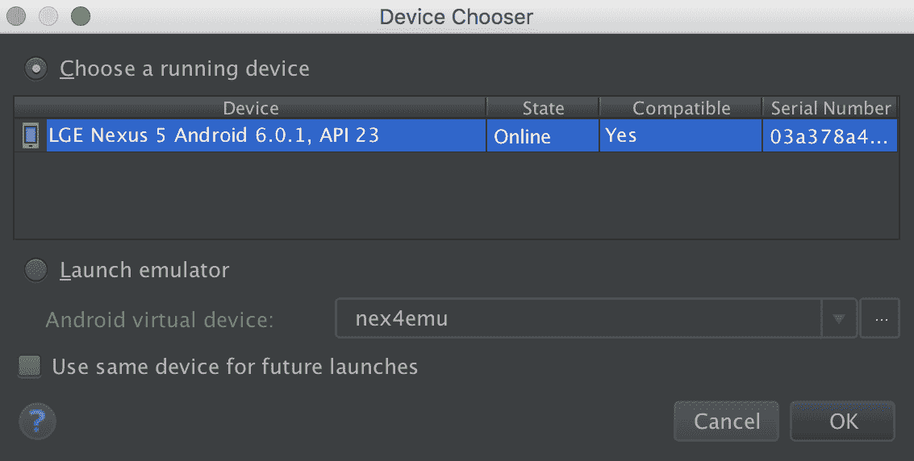
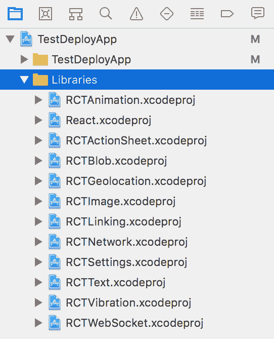
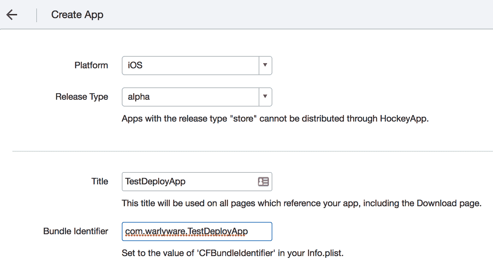
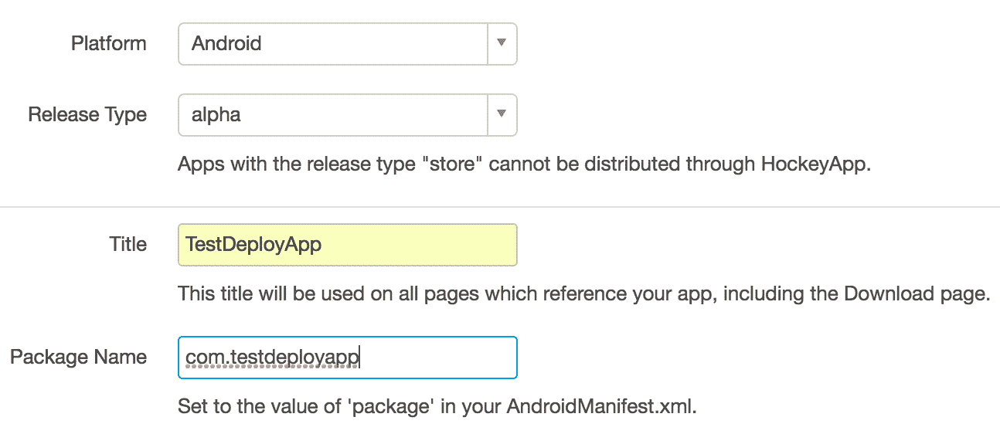
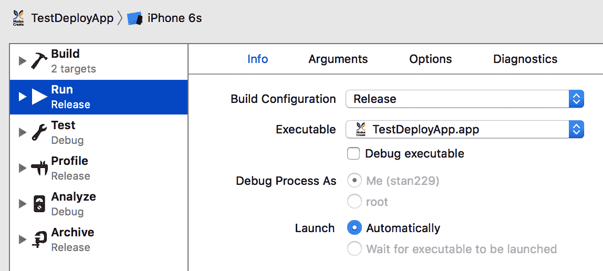
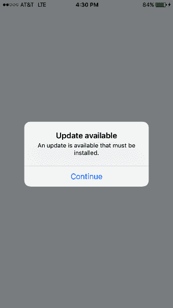
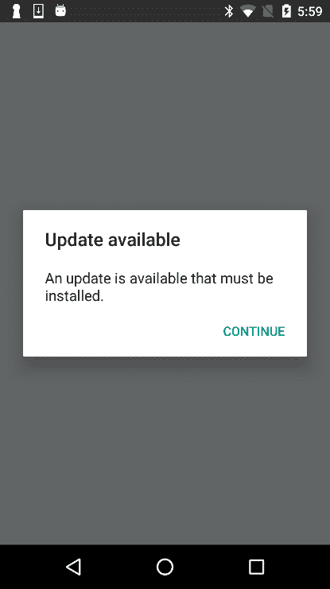

# 部署你的应用程序

在本章中，我们将介绍以下配方：

*   将开发构建部署到 iOS 设备
*   将开发构建部署到 Android 设备
*   将测试构建部署到 HockeyApp
*   将 iOS 测试构建部署到 TestFlight
*   将生产版本部署到苹果应用商店
*   将生产构建部署到 Google Play 商店
*   部署空中更新
*   优化本地应用程序大小

# 介绍

如果你是一个独立的开发人员，你可能会经历几个不同的开发阶段。第一阶段是在个人 iOS 或 Android 设备上测试应用程序。在耗尽了这个阶段之后，您可能会希望与一组选定的人共享它，以获得用户反馈。最终，你的应用程序将通过应用商店发布到世界各地。本章将介绍这些阶段中的每一个阶段，并介绍如何向应用程序推送更新，以及一些优化技巧。

# 将开发构建部署到 iOS 设备

在开发过程中，您可能会花费大量时间使用随 Xcode 一起安装的 iOS 模拟器测试 iOS 应用程序。虽然 iOS 模拟器是目前为止性能最好、最接近于在 iOS 设备上运行应用程序的方法，但它仍然与实际情况不同。iOS 模拟器使用计算机的 CPU 和 GPU 来呈现模拟的操作系统，因此，根据您的开发机器，它最终的性能可能会更好（或更差）而不是实际的设备

谢天谢地，Expo 在实际设备上测试运行代码的能力离真正的最终产品又近了一步，但最终应用程序和在 Expo 中运行的开发应用程序之间仍然存在差异。而且，如果你正在构建一个纯 React 原生应用程序，你将无法享受使用 Expo 在设备上轻松运行应用程序的奢侈。

无论哪种方式，您最终都会希望在物理设备上测试真正的应用程序，以便体验最终产品的实际用户体验和性能。

在本食谱中，我们将引导您使用 React 本机应用程序并将其部署到 iPhone 或 iPad。

# 准备

我们只需要一个新的纯 React 原生应用程序，我们将其命名为`TestDeployApp`。您可以通过以下命令创建应用程序：

```jsx
 react-native init 
```

另外，确保您的 iOS 设备通过 USB 连接到您的开发机器。

# 怎么做。。。

1.  让我们首先在 Xcode 中打开新创建的 React 本机 iOS 项目。通过在左侧面板中选择项目的根来打开项目编辑器。
2.  在项目编辑器的“常规”选项卡下，在左侧的“目标”部分中选择 iOS 应用程序。在“签名”部分下，选择您的团队，如下所示：


3.  对目标列表中的每个条目重复此步骤。
4.  在目标选择器中选择您的设备，如下所示：


5.  要在连接的设备上开始运行应用程序，只需按“播放”按钮。您必须确保您的设备已插入、解锁并受信任，才能显示在 Xcode 中的设备列表中。如果这是第一次在此设备上运行您开发的应用程序，您还需要调整设置以信任来自开发人员帐户的应用程序。在 iOS 设备上，此设置可在设置|常规|设备管理中找到。

# 它是如何工作的。。。

将我们的开发构建部署到该设备只需指定一个团队，然后按照在 Xcode 模拟器上使用的方式运行应用程序，但目标是插入式设备。我们使用 localhost 打包程序来创建包文件。然后将此文件保存在设备上，以备将来使用。注意，由于这是一个开发构建，代码还没有像最终版本中那样优化。当转移到生产版本时，您将看到显著的性能提高。

# 将开发构建部署到 Android 设备

在开发 Android 应用程序时，您最常使用的可能是在 Android 仿真器上运行该应用程序。虽然很方便，但与真正的 Android 设备相比，仿真器的性能较差。

测试应用程序的最佳方法是使用物理 Android 设备。本食谱将介绍如何将 React 本机应用程序部署到物理 Android 设备。

# 准备

我们只需要一个新的纯 React 原生应用程序，我们将其命名为`TestDeployApp`。您可以通过以下命令创建应用程序：

```jsx
react-native init
```

另外，确保您的 iOS 设备通过 USB 连接到您的开发机器。

# 怎么做。。。

1.  让我们先在 Android Studio 中打开 React 原生 Android 项目。
2.  接下来，按 run 按钮，如下所示：


3.  确保选择了“选择正在运行的设备”单选按钮，并且您的设备显示在列表中。按 OK 继续，如下所示：



# 还有更多。。。

运行应用程序时，应启动 React 本机打包程序。如果没有，则必须手动启动打包机。如果您看到错误屏幕上显示消息“无法获取 BatchedBridge”，请确保您的包已正确打包或无法连接到 development server，您应该能够通过在终端中运行以下命令来修复此问题：

```jsx
adb reverse tcp:8081 tcp:8081
```

# 它是如何工作的。。。

很像 Xcode，我们只需插入真实设备，按 run，然后选择应用程序应该运行的设备，就可以运行我们的应用程序。唯一可能出现的复杂情况是在设备和开发机器之间建立通信。这些问题通常可以通过命令解决：

```jsx
adb reverse
```

这将建立从设备到主机的转发端口。这是一个开发版本，代码尚未优化，因此一旦应用程序作为生产版本构建，性能将有所提高。

# 将测试构建部署到 HockeyApp

在将应用程序发布到野外之前，对应用程序进行压力测试并在可能的情况下获得用户反馈是很重要的。要实现这一点，您需要创建应用程序的签名版本，以便与一组测试用户共享。对于健壮的测试构建，您需要两样东西：应用程序性能分析/报告，以及交付机制。HockeyApp 在 iOS 和 Android 上为您的测试构建提供了这一点和更多。虽然苹果应用商店和谷歌 Play 商店的两个官方平台都提供了测试和分析功能，但 HockeyApp 为处理这些问题提供了一个统一的平台，并提供了第二个度量来源，事故报告等

应该注意的是，HockeyApp 最近被微软收购。他们已经宣布，HockeyApp 产品将于 2019 年 11 月停产，取而代之的是微软的应用中心。您可以在[的产品转换页面上了解更多信息 https://hockeyapp.net/transition](https://hockeyapp.net/transition) 。为了测试目的，此配方将介绍如何将 React 本机应用程序部署到 HockeyApp。我们将介绍 iOS 和 Android 版本。

# 准备

对于这个配方，我们将使用上两个配方中相同的空的纯 React 原生应用程序，我们将其命名为`TestDeployApp`。对于 iOS 部署，您需要注册 Apple Developer 程序，并且需要安装`cocoapods`。安装`cocoapods`最简单的方法是使用自制软件，通过以下命令：

```jsx
 brew install cocoapods
```

你还需要有一个 HockeyApp 帐户，你可以在他们的网站[上注册 https://hockeyapp.net/](https://hockeyapp.net/)

# 怎么做。。。

1.  首先，我们需要在应用程序中安装`react-native-hockeyapp`模块。打开终端，转到应用程序的根项目目录，然后输入以下命令：

```jsx
        npm install react-native-hockeyapp --save
```

2.  进入你的`ios/`目录并初始化你的 pod 文件：

```jsx
        pod init
```

3.  打开你的播客文件，将`pod "HockeySDK"`添加到你的目标。
4.  回到终端中，安装 Podfile，如下所示：

```jsx
        pod install
```

5.  现在，让我们打开 Xcode 并打开我们的 React 原生项目：（`ios/TestDeployApp.xcodeproj`）。
6.  我建议将包标识符更改为比默认值更有意义的值，因此请在“常规设置”对话框中更改它，如下所示：


7.  将`./ios/Pods/Pods.xcodeproj`拖放到项目导航器中的“库”组中，如下所示：



8.  将位于`./node_modules/react-native-hockeyapp/RNHockeyApp/RNHockeyApp`中的`RNHockeyApp.h`和`RNHockeyApp.m`文件拖放到同一库组中。
9.  接下来，我们将转到 HockeyApp 网站并在那里创建我们的应用程序。登录并单击新应用程序。
10.  由于我们尚未准备好构建，请手动单击短语“不想上载构建？”？在以下模式中手动创建应用程序。
11.  填写创建应用程序表单中的字段时，请确保与前面在*步骤 6*中定义的标题和捆绑标识匹配，然后按 Save，如下所示：



12.  记下应用程序 ID，因为我们将在下一步中使用它。
13.  打开`App.js`并添加以下代码：

```jsx
        import HockeyApp from 'react-native-hockeyapp'; 

        export default class 
        TestDeployApp extends Component { 
          componentWillMount() { 
            HockeyApp.configure(YOUR_APP_ID_HERE, true); 
          } 

          componentDidMount() { 
            HockeyApp.start(); 
            HockeyApp.checkForUpdate(); 
          } 
        } 
```

14.  回到 Xcode，将通用 iOS 设备设置为目标设备，并构建（产品|构建）应用程序，如下所示：


15.  现在，我们需要创建我们的`.ipa`文件。这可以通过 Product | Archive 从 Xcode 菜单完成。
16.  这将打开归档文件列表。按 Distribute App 按钮开始创建`.ipa`的过程。
17.  选择“开发”选项，然后按“下一步”。
18.  应自动选择您的资源调配团队。选择正确的团队后，按“下一步”。
19.  保留默认的导出设置，然后按“下一步”。在摘要页面上，也按 Next。
20.  选择目标目录并按导出。
21.  回到*HockeyApp*浏览器窗口，单击添加版本。
22.  将刚才导出的`.ipa`文件拖到模式窗口中。
23.  我们可以将此处的设置保留为默认设置，因此继续按 Next 直到最后一个模式屏幕，然后在 summary 屏幕上按 Done。iOS 应用程序就是这样。您可以向*HockeyApp*应用程序添加用户，然后您的测试人员就可以下载您的应用程序了。让我们切换到 Android 方面。打开 Android Studio，然后在 React Native 中打开 Android 文件夹。
24.  重复*步骤 8*至*步骤 11*，将平台改为 Android，如下所示：



25.  现在，我们需要构建我们的`.apk`文件。您可以在 React Native 文档中找到构建`.apk`的最新方法，位于：

[https://facebook.github.io/react-native/docs/signed-apk-android.html](https://facebook.github.io/react-native/docs/signed-apk-android.html)

26.  对我们 Android 项目生成的`.apk`重复*步骤**21*和*步骤**22*。

# 它是如何工作的。。。

对于这个配方，我们使用了*HockeyApp*作为它的两个主要特性：它的 beta 发行版和它的 HockeySDK（它支持崩溃报告、度量、反馈、身份验证和更新通知）。对于 iOS，beta 版发行通过*HockeyApp*托管的 OTA 企业发行机制完成。当您签署应用程序时，您可以控制哪些设备可以打开它。*HockeyApp*只发送通知并提供 URL 供测试人员通过其企业应用商店下载您的应用。Android 更简单，因为不需要担心应用程序如何传输。这意味着*HockeyApp*在 web 服务器上托管`.apk`文件，测试人员可以下载并安装该文件。

有关在 Android 上设置*HockeyApp*的更多信息，请阅读[上的官方文档 https://support.hockeyapp.net/kb/client-integration-android/hockeyapp-for-android-sdk](https://support.hockeyapp.net/kb/client-integration-android/hockeyapp-for-android-sdk) 。

# 将 iOS 测试构建部署到 TestFlight

在*HockeyApp*出现之前，测试手机应用的最流行的服务是 TestFlight。事实上，苹果在这方面做得非常好，以至于苹果收购了其母公司，并将其整合到 iTunes Connect 中。TestFlight 现在是苹果的官方应用程序测试平台。TestFund 和 Po.T2 的 HOKECAP APP TY3T3 之间有一些不同的考虑。首先也是最重要的是，TestFlight 只有在被苹果收购后才成为 iOS。其次，TestFlight 中有两种类型的测试：内部测试和外部测试。**内部测试**涉及与您团队中的开发人员或管理员角色成员共享应用程序，并将分发范围限制为 10 台设备上的 25 名测试人员。**外部测试**允许您邀请多达 2000 名测试人员，他们不必是您组织的成员。这也意味着这些测试人员不会用完您的设备配额。外部测试应用程序要通过苹果公司执行的**测试版应用程序审查**，虽然没有苹果公司对向应用商店发布应用程序的审查严格，但这是一个很好的第一关。

此配方侧重于采用我们的 React 本机应用程序，并将测试构建部署到 TestFlight。我们将设置一个内部测试，因为我们不希望苹果审查我们的示例 React 本机应用程序，但内部和外部测试的程序是相同的。

# 准备

对于这个配方，我们将使用与以前配方相同的样板 React Native 应用程序，我们将其命名为`TestDeployApp`。您还需要注册 Apple 开发者计划，您需要在 Xcode 中设置开发和分发证书，您的应用程序需要设置 AppIcon。

# 怎么做。。。

1.  让我们首先通过`ios/TestDeployApp.xcodeproj`文件在 Xcode 中打开我们的项目。
2.  正如上一个配方中所述，我还建议将捆绑包标识符更改为比默认值更有意义的内容，例如：


3.  接下来，让我们登录到 Apple 开发者程序并导航到 App ID 注册页面，位于[https/：Developer.Apple.com/account/ios/identifier/bundle](https://developer.apple.com/account/ios/identifier/bundle)。
4.  在这里，填写项目的名称和捆绑 ID，然后按 Continue 按钮，然后按 Register 按钮，最后按 Done 按钮完成应用程序的注册。
5.  接下来，我们将登录位于[的 iTunes Connect 站点 https://itunesconnect.apple.com](https://itunesconnect.apple.com) 。
6.  在 iTunes Connect 中，导航到“我的应用”，然后按加号（+）按钮并选择“新建应用”以添加新应用。
7.  在“新建应用程序”对话框中，填写名称和语言。选择与您之前创建的捆绑包 ID 相匹配的捆绑包 ID，并在 SKU 字段中添加唯一的应用程序引用，然后按 Create。

8.  接下来，导航到应用程序的 TestFlight 部分，并确保填写可本地化信息部分。
9.  让我们回到 Xcode 来创建`.ipa`文件。为活动方案选择通用 iOS 设备，然后通过 Xcode 菜单（产品|存档）创建文件。这将打开存档列表，您可以在其中按上载到应用商店按钮上载应用。
10.  应自动选择您的资源调配团队。确保选择了正确的团队，然后按选择。创建存档后，按上载按钮。
11.  上传应用程序后，您需要等待，直到收到来自 iTunes Connect 的电子邮件，通知您构建已完成处理。处理完成后，您可以返回 iTunes Connect 页面并打开内部测试视图。
12.  在内部测试部分，单击选择要测试的版本并选择您的构建，然后单击下一步按钮。在导出符合性屏幕上，按 OK。
13.  我们已经准备好添加内部测试人员。选择要测试应用程序的用户，然后单击开始测试按钮，并在以下模式中确认您的选择。您的用户现在应该会收到一封邀请电子邮件来测试您的应用程序！

# 它是如何工作的。。。

TestFlight 是应用商店发布渠道中的一等公民。苹果已经将其对应用程序 beta 测试发行版的支持直接集成到 iTunes Connect 中，为开发者创造了一个平滑无缝的过程。此过程基本上与部署到应用商店相同，只是在使用 iTunes Connect 时，必须启用和配置测试。

对于测试人员来说，这也是一种无缝体验。只要您在 iTunes Connect 中添加测试用户，就会通知他们安装 TestFlight 应用程序，这样他们就可以轻松访问可以测试的应用程序。TestFlight 也使开发人员的过程更加容易，因为不需要他们添加任何额外的第三方库或代码来支持 TestFlight，正如*HockeyApp*所需要的那样。

# 将生产版本部署到苹果应用商店

一旦你彻底测试了你的应用程序，你就准备好进入 iOS 应用程序制作过程中的下一步（可能是最激动人心的一步）：发布到苹果应用商店。

此配方将贯穿准备生产版本并将其提交到苹果应用商店的整个过程。我们实际上不会将应用程序提交到商店，因为我们使用的是示例应用程序，而不是生产就绪的应用程序。然而，该过程的最后几个步骤非常简单。

# 准备

对于这个配方，我们将再次使用早期配方中的 simple React Native 示例应用程序`TestDeployApp`。当然，您还需要参加 Apple 开发者计划，并在本章前面讨论的 Xcode 中设置您的开发和分发证书。对于真正的生产应用程序部署，您还需要准备好应用程序的 AppIcon 集和屏幕截图，以便在 iTunes 中使用。

# 怎么做。。。

1.  让我们从使用`ios/TestDeployApp.xcodeproj`文件打开 Xcode 开始。
2.  如前所述，建议您将包标识符更改为比默认值更有意义的值，因此请确保在“常规设置”对话框中更改它。
3.  在设备上以生产模式测试应用程序也是一个好主意。这可以通过将应用程序方案的构建配置（通过产品|方案|编辑方案菜单找到）更改为发布来实现，如下所示：


4.  接下来，您需要在 app ID 注册页面上注册该应用，该页面位于：

[https://developer.apple.com/account/ios/identifier/bundle](https://developer.apple.com/account/ios/identifier/bundle)

此步骤需要一个活动的 Apple Developer 程序帐户。

5.  填写项目的“名称”和“捆绑 ID”字段，然后按“继续”按钮。
6.  接下来，我们将登录位于[的 iTunes Connect 站点 https://itunesconnect.apple.com](https://itunesconnect.apple.com) 。在“我的应用”部分，按加号（+）按钮并选择“新建应用”。
7.  您需要在下面的对话框中填写名称和语言，然后选择与先前在配方中创建的捆绑包 ID 匹配的捆绑包 ID。另外，为 SKU 添加一个唯一的应用程序参考，然后按“创建”按钮。
8.  让我们回到 Xcode 并创建`.ipa`文件。为活动方案选择通用 iOS 设备，并通过菜单（产品|存档）创建文件，该菜单将打开存档列表。最后，按上载到应用商店。
9.  选择您的资源调配团队，然后按选择。

10.  创建存档后，按上载按钮。完成构建后，您将收到来自 iTunes Connect 的电子邮件。
11.  处理完应用程序后，返回 iTunes Connect。在“应用商店”部分下，打开应用信息并选择应用适合的类别。
12.  打开 iOS 应用程序下的 1.0 准备提交部分。填写所有必填字段，包括应用程序截图、说明、关键字和支持 URL。
13.  接下来，在构建部分下，选择我们在*步骤*8 中构建的`.ipa`。
14.  最后，填写版权和应用程序审查信息部分，然后单击提交审查按钮。

# 它是如何工作的。。。

在此配方中，我们介绍了将 iOS 应用发布到应用商店的标准流程。在本例中，我们不需要遵循 React-Native 特定的步骤，因为最终产品（`.ipa`文件）包含运行 React-Native packager 所需的所有代码，React-Native packager 将以发布模式构建`main.jsbundle`文件。

# 将生产构建部署到 Google Play 商店

这个配方将贯穿我们的应用程序的制作构建过程，并将其提交给 Google Play 商店。与上一个配方一样，我们将在实际提交到应用商店之前停止，因为这只是一个 React 原生应用的示例，但此过程的其余部分也很简单。

# 准备

对于这个配方，我们将使用本章中使用的相同的 simple React 本机应用程序，`TestDeployApp`。你需要有一个 Google Play 开发者帐户才能向应用商店提交应用，如果你真的想发布你的应用，你还需要为 Play 商店准备好所有的图标和屏幕截图。

# 怎么做。。。

1.  让我们首先在 Android Studio 中打开 React 原生项目。第一步是构建`.apk`文件。正如本章前面提到的，从 React 原生项目创建生产 Android 应用程序的过程是复杂的，并且容易发生变化。访问 React 本地文档以创建位于[的`.apk`https://facebook.github.io/react-native/docs/signed-apk-android.html](https://facebook.github.io/react-native/docs/signed-apk-android.html) 。
2.  接下来，让我们在 web 浏览器中打开位于[的 Google Play 开发者控制台 https://play.google.com/apps/publish/](https://play.google.com/apps/publish/) 。
3.  让我们通过单击添加新应用程序开始这个过程。填写标题字段，然后单击上载 APK 按钮，如下所示：


4.  接下来您将看到发布屏幕的 APK 部分。点击上传您的第一个 APK 到生产，然后拖放（或选择）您的`.apk`文件。
5.  随后将出现一系列自解释的模态。浏览左侧侧菜单中的每个类别（商店列表、内容分级等），并相应地填写所有信息。
6.  满足所有要求后，按发布应用程序按钮。

# 它是如何工作的。。。

在本食谱中，我们介绍了将 Android 应用程序发布到 Google Play 商店的过程。按照*步骤*2 中链接的说明，您的 React Native 应用程序将完成 Gradle`assembleRelease`过程。`assemble`流程运行 packager 来创建 JavaScript 包文件，编译 Java 类，将它们与适当的资源打包在一起，最后允许您将应用程序签名到`.apk`中。

# 部署空中更新

使用 JavaScript 编写 React 本机应用程序的一个有用的副作用是，代码在运行时加载，这与 Cordova 混合应用程序的工作方式类似。我们可以利用此功能，使用**无线**（**OTA**）向我们的应用程序推送更新。这允许添加功能和错误修复，而无需通过 App Store 审批流程。React Native 的 OTA 更新的唯一限制是我们不能推送编译的（Objective-C 或 Java）代码，这意味着更新代码只能在 JavaScript 层中。有一些流行的服务提供基于云的 OTA 应用程序更新。我们将重点介绍微软的一项服务`CodePush`。

本食谱将涵盖在 iOS 和 Android 上使用`CodePush`为我们的 React 本机应用程序设置和推送更新。

# 准备

对于这个配方，我们将使用本章中使用的相同的 simple React 本机应用程序，`TestDeployApp`。我们将把应用程序部署到以生产/发布模式运行的物理设备上，这将允许应用程序接收来自 CodePush 服务器的更新。

# 怎么做。。。

1.  为了使用 CodePush，我们需要安装 CodePush CLI 并创建一个免费帐户。这可以通过在终端中运行以下两个命令来完成：

```jsx
npm install -g code-push-cli
code-push register
```

2.  下一步是使用 CodePush 注册我们的应用程序。记下运行`code-push register`输出提供的应用部署键。我们将使用**暂存键**进行此配方。文档建议每个平台添加一个应用程序，每个应用程序都有一个`-IOS`或`-Android`后缀。要将应用程序添加到 CodePush，请使用以下命令：

```jsx
code-push app add TestDeployApp-IOS
code-push app add TestDeployApp-Android

```

3.  我们还需要在 React Native 项目目录中安装 React Native CodePush 模块。这可以通过`npm`完成，如下所示：

```jsx
npm install --save react-native-code-push
```

或者，使用`yarn`：

```jsx
yarn add react-native-code-push
```

4.  下一步是将 CodePush 本机模块与我们的项目链接起来。当提示您输入 Android 和 iOS 的部署密钥时，请使用*步骤 2*中讨论的登台密钥。可以使用以下命令链接本机模块：

```jsx
react-native link react-native-code-push
```

5.  接下来，我们需要将 React 本机应用程序设置为使用 CodePush。在`index.js`内部，我们需要添加三个东西：CodePush 导入、选项对象，以及通过`AppRegistry.registerComponent`注册应用时对导入的`codePush`模块的调用。按如下方式设置应用程序：

```jsx
import {AppRegistry} from 'react-native';
import App from './App';
import codePush from 'react-native-code-push'; 

const codePushOptions = { 
 updateDialog : true 
} 

AppRegistry.registerComponent('TestDeployApp',
 () => codePush(codePushOptions)(App)
)
```

6.  为了测试我们在 iOS 应用程序中的更改，让我们部署到 iOS 设备。在 Xcode 中打开 React 本机项目，将方案的构建配置（产品|方案|编辑方案…）更改为 Release，然后按 Run，如下所示：



7.  接下来，对应用程序中的 React 本机代码进行某种任意更改，然后在终端中，运行以下命令以使用新代码更新应用程序：

```jsx
code-push release-react TestDeployApp ios -m --description "Updating using CodePush"
```

8.  接下来，关闭并重新打开 iOS 设备上的应用程序。您应该会看到以下提示：



9.  继续通过提示后，应用程序将自身更新为最新版本！
10.  我们还将在 Android 上测试该功能。您需要按照[中 React Native 文档中概述的步骤将 Android 应用程序制作成一个`.apk`文件 https://facebook.github.io/react-native/docs/signed-apk-android.html](https://facebook.github.io/react-native/docs/signed-apk-android.html) 。
11.  将 Android 设备插入开发机器后，从`android/`目录在终端中运行以下命令：

```jsx
adb install 
app/build/outputs/apk/app-release.apk
```

12.  接下来，对 React 原生 JavaScript 代码进行更改。只要添加了新代码，我们就可以使用更改后的代码来更新应用程序。然后，在终端中运行以下命令：

```jsx
code-push release-react TestDeployApp android -m --description "Updating using CodePush"
```

13.  再次关闭并重新打开 Android 设备上的应用程序，以获得以下提示：



14.  经过提示后，应用程序将自身更新为最新版本。

# 它是如何工作的。。。

CodePush（以及其他云承载的 OTA 更新平台）使用自 React Native 成立以来就存在的相同技术工作。React Native 在应用程序初始化时加载 JavaScript 包。在开发过程中，此捆绑包从`localhost:3000`加载。然而，一旦我们部署了一个应用程序，它将查找最终产品中包含的名为`main.jsbundle`的文件。通过在*步骤 5*中的`registerComponent`中添加对`codePush`的调用，应用程序将使用 CodePush API 检入以查看是否有更新。如果有新的更新，它将提示用户更新。接受提示将下载新的`jsbundle`文件并重新启动应用程序，从而更新代码。

# 优化本地应用程序大小

在将我们的应用程序部署到生产环境之前，最好将应用程序包的大小缩小到尽可能小的文件，我们可以利用几种技术来实现这一点。这些可能涉及支持较少的设备或压缩包含的资产

本食谱将介绍一些限制 iOS 和 Android React 本机应用程序中生产包文件大小的技术。

# 准备

对于这个配方，我们将使用本章中使用的相同的 simple React 本机应用程序，`TestDeployApp`。您还需要具备针对 iOS 的代码签名功能，以及创建前面介绍的`.apk`文件的能力。

# 怎么做。。。

1.  我们将从对捆绑资产执行的一些简单优化开始，这些优化通常包括图像和外部字体：
    *   对于 PNG 和 JPEG 压缩，您可以使用[等服务 http://www.tinypng.com](http://www.tinypng.com) 减少文件大小，图像质量几乎没有降低。
    *   如果您使用`react-native-vector-icons`库，您会注意到它捆绑了八种不同的字体图标集。建议您删除应用程序未使用的任何图标字体库。
    *   SVG 文件也可以被压缩和优化。用于此目的的一项服务是[http://compressor.io](http://compressor.io) 。
    *   随应用打包的任何音频资产都应使用可利用高质量压缩的文件格式，如 MP3 或 AAC。
2.  对于 iOS，除了在发布方案中默认启用的设置之外，没有多少方法可以进一步减小文件大小。其中包括为应用程序细化启用位代码，并将编译器优化设置为最快、最小的[-Os]。
3.  对于 Android，有两件事可以改善文件大小：
    *   在 Android Studio 中，打开`android/app/build.gradle`并找到以下行，然后将其值更新为以下内容：

```jsx
def enableSeparateBuildPerCPUArchitecture = true 
def enableProguardInReleaseBuilds = true 
```

4.  如果您计划只针对基于 ARM 的 Android 设备，我们可以阻止它完全针对 x86 构建。在`build.gradle`文件中，找到`splits abi`对象并添加以下行以不包括 x86 支持：

```jsx
include "armeabi-v7a" 
```

您可以在以下 Android 文档中阅读更多关于 ABI 管理的信息：

[https://developer.android.com/ndk/guides/abis](https://developer.android.com/ndk/guides/abis)

# 它是如何工作的。。。

在本食谱中，我们介绍了可用于减小应用程序文件大小的技术。JavaScript 包越小，JavaScript 解释器解析代码的速度就越快，转换成应用程序加载时间就越快，OTA 更新也就越快。我们保存的`.ipa`和`.apk`文件越小，我们的用户下载应用程序的速度就越快