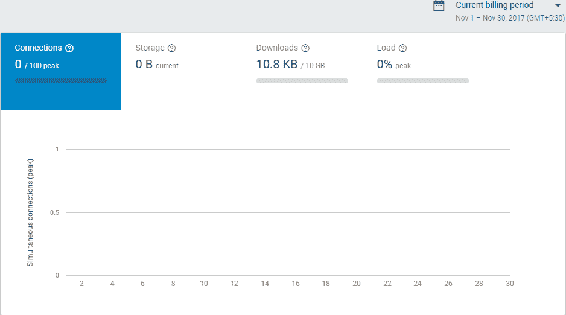
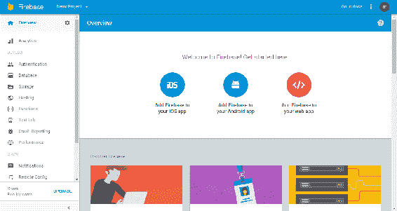
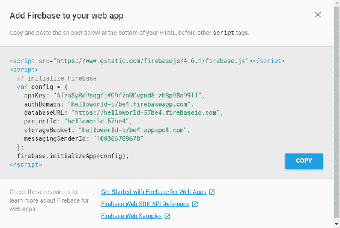
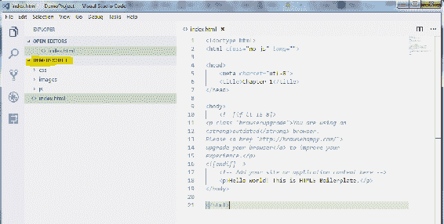
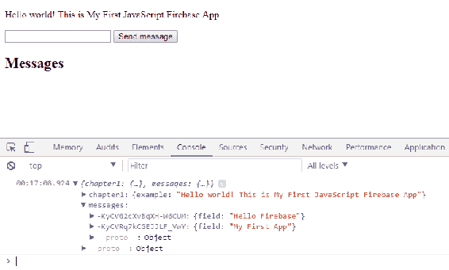

# 一、开始使用 Firebase 和 React

实时 web 应用程序据说包括对用户的超快速响应的好处，并且具有高度的交互性，这增加了用户参与流。在这个现代网络中，有许多框架和工具可用于开发实时应用程序。JavaScript 是最流行的脚本语言之一，用于在 web 上构建应用程序。本书向您介绍 ReactJS 和 Firebase，当您了解现代 web 应用程序开发时，可能会遇到这两个方面。它们都用于构建快速、可扩展和实时的用户界面，这些界面使用数据，并且可以随时间变化而无需重新加载页面。

React 以**模型**-**视图**-**控制器**（**MVC**模式）中的视图而闻名，可以与 MVC 中的其他 JavaScript 库或框架一起使用。为了管理 React 应用程序中的数据流，我们可以使用 Flux 或 Redux。在本书中，我们还将介绍如何使用 React 和 firebase 应用程序实现 redux。

Redux is the alternative to Flux. It shares the same key benefits. Redux works especially well with React, for managing the state of the UI. If you have ever worked with flux, then it's easy too.

在开始编写代码之前，让我们刷新一下关于 ReactJS 的知识，看看我们可以用 Firebase 及其功能做些什么，了解 Firebase 的强大功能。

以下是我们将在本节中介绍的主题列表：

*   React 简介
*   React 组件生命周期

这将使您更好地了解如何处理 React 组件。

# React

React 是一个开源 JavaScript 库，它提供了一个视图层，用于将数据呈现为 HTML 以创建交互式 UI 组件。组件通常用于呈现包含指定为自定义 HTML 标记的附加组件的 React 视图。React 视图可以在数据更改时高效地更新和重新呈现组件，而无需重新加载页面。它提供了一个简单的虚拟 DOM、没有模板的强大视图、单向数据流和显式变异。当数据发生变化时，它是一种非常系统化的更新 HTML 文档的方法，并在一个现代的单页应用程序中提供了组件的清晰分离。

React 组件完全是用 Javascript 构建的，因此很容易通过应用程序传递丰富的数据。通过在 React 中创建组件，可以将 UI 拆分为可重用和独立的部分，从而使应用程序组件可重用、可测试，并使关注点的分离变得容易。

React 只关注 MVC 中的视图，但它也有状态组件，可以记住`this.state`中的所有内容。它处理从输入到状态更改的映射，并呈现组件。让我们看看 React 的组件生命周期及其不同级别。

# 组件生命周期

在 React 中，每个组件都有自己的生命周期方法。每个方法都可以根据您的需求进行重写。

当数据更改时，React 会自动检测更改并重新呈现组件。此外，我们还可以在错误处理阶段捕获错误。

下图显示了 React 组件的阶段：


# 方法信息

让我们来看看前面的方法。

# 构造函数（）方法

安装组件时，首先调用 React 组件的构造函数方法。在这里，我们可以设置组件的状态。

以下是`React.Component`中的构造函数示例：

```jsx
constructor(props) {
 super(props);
 this.state = {
 value: props.initialValue
 };
 }
```

Using `this.props` inside the constructor, we need to call `super(props)` to access and call functions of parents; otherwise, you will get `this.props` undefined in the constructor because React sets the `.props` on the instance from outside immediately after calling constructor, but it will not affect when you are using `this.props` inside the render method.

# render（）方法

需要使用`render()`方法呈现 UI 组件，检查`this.props`和`this.state`并返回以下类型之一：

*   **React 元素**
*   **字符串和数字**
*   **门户**
*   **空**
*   **布尔人**

# componentWillMount（）方法

此方法在紧接着`componentDidMount`之前调用。在`render()method`之前触发。

# componentDidMount（）方法

此方法在组件获得装载后立即调用。我们可以使用此方法从远程端点加载数据以实例化网络请求。

# componentWillReceiveProps（）方法

当安装的组件收到新道具时，将调用此方法。此方法还允许比较当前值和下一个值，以确保道具中的更改。

# shouldComponentUpdate（）方法

当组件接收到新的道具和状态时，调用`shouldComponentUpdate()`方法。默认值为`true`；如果返回`false`，React 将跳过组件的更新。

# componentWillUpdate（）方法

当接收到新的道具或状态时，`componentWillUpdate()`方法将在渲染之前立即调用。我们可以使用此方法在组件更新之前执行操作。

This method will not be invoked if `shouldComponentUpdate()` returns `false`.

# componentDidUpdate（）方法

当组件更新时，`componentDidUpdate()`方法立即被调用。初始渲染时不调用此方法。

Similar to `componentWillUpdate()`, this method is also not invoked if `shouldComponentUpdate()` returns false.

# componentWillUnmount（）方法

此方法在 React 组件卸载和销毁之前立即调用。在这里，我们可以执行任何必要的清理，例如取消网络请求或清理在`componentDidMount`中创建的任何订阅。

# componentDidCatch（）方法

此方法允许我们捕获 React 组件中的 JavaScript 错误。我们可以记录这些错误并显示另一个回退 UI，而不是崩溃的组件树。

现在我们对 React 组件中可用的组件方法有了清晰的认识。

请注意以下 JavaScript 代码片段：

```jsx
<section>
<h2>My First Example</h2>
</section>
<script>
 var root = document.querySelector('section').createShadowRoot();
 root.innerHTML = '<style>h2{ color: red; }</style>' +'<h2>Hello World!</h2>';
</script>
```

现在，观察以下代码片段：

```jsx
var sectionStyle = {
 color: 'red'
};
var MyFirstExample = React.createClass({
render: function() {
 return (<section><h2 style={sectionStyle}>
 Hello World!</h2></section>
 )}
})
ReactDOM.render(<MyFirstExample />, renderedNode);
```

现在，在观察了前面的 React 和 JavaScript 示例之后，我们将对普通 HTML 封装和 ReactJS 自定义 HTML 标记有一个清晰的认识。

React isn't an MVC framework; it's a library for building a composable user interface and reusable components. React is used at Facebook in its production stages and [instagram.com](https://www.instagram.com/) is entirely built on React.

# 火基

Firebase 平台可帮助您开发高质量的应用程序，并关注您的用户。

Firebase 是一个由 Google 支持的移动和 web 应用程序开发平台。它是一个一站式解决方案，可满足您开发高质量移动和 web 应用程序的所有需求。它包括各种产品，如实时数据库、崩溃报告、云 Firestore、云存储、云函数、认证、托管、Android 测试实验室和 iOS 性能监控，这些产品可用于开发和测试实时应用程序，关注用户需求，而非技术复杂性。

它还包括云消息、谷歌分析、动态链接、远程配置、邀请、应用程序索引、AdMob 和 AdWords 等产品，这些产品可以帮助您扩大用户群，并提高受众的参与度。

Firebase 提供多个 Firebase 服务。我们可以使用 Firebase 命名空间访问每个服务：

*   `firebase.auth()`-认证
*   `firebase.storage()`-云存储
*   `firebase.database()`-实时数据库
*   `firebase.firestore()`-云 Firestore

在接下来的章节中，我们将介绍前面的所有服务。在本章中，我们将简要介绍前面的产品/服务，以基本了解 Firebase 平台的所有功能。在接下来的章节中，我们将更详细地探讨与 React 平台集成的 web 相关产品。

以下是我们将在本节中介绍的主题列表：

*   Firebase 及其特性简介
*   Firebase 功能列表以及我们如何使用它
*   云火库
*   使用 JavaScript 设置 Firebase 项目
*   带有 Firebase 和 JavaScript 的示例应用程序“Hello World”

如您所见，Firebase 提供了两种类型的云数据库和实时数据库，它们都支持实时数据同步。我们可以在同一个应用程序或项目中使用它们。好的，让我们深入了解细节，了解更多。

# 实时数据库

对于任何实时应用程序，我们都需要一个实时数据库。Firebase 实时数据库是一个云托管的 NoSQL 数据库，它将数据实时同步到每个连接的客户端。Firebase 数据库使用同步机制，在毫秒内将数据同步到所有连接的设备，而不是典型的请求-响应模型。另一个关键功能是它的离线功能。Firebase SDK 将数据保存在磁盘上；因此，即使用户失去了互联网连接，该应用程序仍能响应。一旦重新建立连接，它会自动同步数据。它由 iOS、Android、Web、C++和 Unity 平台支持。我们将在即将到来的章节中详细介绍这一点。

Firebase Realtime Database can scale around 100,000 concurrent connections and 1,000 writes/second in a single database.

下面的屏幕截图显示了左侧的功能列表，这些功能在 Firebase 中可用，我们在数据库部分选择了实时数据库。在该部分中，我们有四个可用选项卡：

*   数据
*   规则
*   备份
*   用法


# 数据库规则

Firebase 数据库规则是保护数据的唯一方法。Firebase 为开发人员提供了灵活性和基于表达式的规则语言以及类似 JavaScript 的语法，以定义数据的结构、索引方式以及用户何时可以读写数据。您还可以将认证服务与此相结合，以定义谁有权访问哪些数据，并保护您的用户免受未经授权的访问。为了验证数据，我们需要在规则中使用`.validate`单独添加一条规则。

考虑这个例子：

```jsx
{
"rules": {
".write": true,
"ticket": {
// a valid ticket must have attributes "email" and "status"
".validate": "newData.hasChildren(['email', 'status'])",
"status": {
// the value of "status" must be a string and length greater then 0 and less then 10
".validate": "newData.isString() && newData.val().length > 0 && newData.val().length < 10"
},
"email": {
// the value of "email" must valid with "@"
".validate": "newData.val().contains('@')"
}
}
}
}
```

下面是一些用于在“规则”选项卡中应用规则的其他示例代码块：

**默认**：认证规则配置：

```jsx
{
 "rules": {
 ".read": "auth != null",
 ".write": "auth != null"
 }}
```

**公共**：**这些规则允许所有人都可以完全访问，即使不是您应用程序用户的人也可以。它们提供对数据库的读写访问权限：**

```jsx
{
 "rules": {
 ".read": true,
 ".write": true
 }}
```

**用户**：这些规则授权从 Firebase 认证令牌访问与用户 ID 匹配的节点：

```jsx
{
 "rules": {
   "users": {
       "$uid": {
             ".read": "$uid === auth.uid",
             ".write": "$uid === auth.uid"
         }
       }
    }
}
```

**私有**：这些规则配置不允许任何人读写数据库：

```jsx
{
 "rules": {
    ".read": false,
    ".write": false
  }
}
```

We can also use REST API with Firebase Secret code to write and update Rules for your Firebase app by making a `PUT` request to the `/.settings/rules.json` path and it will overwrite the existing rules.

Take, for example, `curl -X PUT -d '{ "rules": { ".read": true } }'` `'https://docs-examples.firebaseio.com/.settings/rules.json?auth=FIREBASE_SECRET'`.

# 备份

Firebase 允许我们保存数据库的每日备份，但这仅在 Blaze 计划中可用。它还自动应用安全规则来保护您的数据。

# 用法

Firebase 允许在分析图表的帮助下查看数据库的使用情况。它向我们实时显示 firebase 数据库上的连接、存储、下载和加载：



# 云火库

CloudFireStore 也是一个云托管的 NoSQL 数据库。您可能会认为我们已经有了实时数据库，这也是一个 NoSQL 数据库，那么为什么我们需要 Firestore 呢？这个问题的答案是 Firestore 可以被视为实时数据库的高级版本，提供实时同步和脱机支持以及高效的数据查询。它可以在全球范围内扩展，让您专注于开发应用程序，而不用担心服务器管理。它可以与 Android、iOS 和 web 平台一起使用。

我们可以在同一 Firebase 应用程序或项目中使用这两个数据库。两者都是 NoSQL 数据库，可以存储相同类型的数据，并且具有以类似方式工作的客户端库。

如果您想在 Cloud Firestore 处于测试阶段时试用它，请使用我们的指南开始：

*   前往[https://console.firebase.google.com/](https://console.firebase.google.com/)
*   选择您的项目，``DemoProject``
*   单击左侧导航部分中的数据库并选择 Cloud Firestore 数据库：


选择数据库后，它会提示您在创建数据库之前应用安全规则。

# 安全规则

在 Cloud Firestore 中创建数据库和集合之前，它会提示您应用数据库的安全规则。

请看以下屏幕截图：


以下是 Firestore 规则的一些代码示例：

**Public**:

```jsx
service cloud.firestore {
    match /databases/{database}/documents {
           match /{document=**} {
           allow read, write;
        }
    }
}
```

**Users**:

```jsx
service cloud.firestore {
    match /databases/{database}/documents {
        match /users/{userId} {
           allow read, write: if request.auth.uid == userId;
        }
    }
}
```

**Private**:

```jsx
service cloud.firestore {
    match /databases/{database}/documents {
       match /{document=**} {
          allow read, write: if false;
       }
    }
}
```

# 实时数据库和云 Firestore 的区别

我们已经看到，实时数据库和云 Firestore 都是 NoSQL 数据库，具有同步数据的实时功能。那么，让我们看看它们在功能上的区别。

# 数据模型

两个数据库都是云托管的 NoSQL 数据库，但两个数据库的数据模型不同：

| **实时数据库** | **云火店** |
| 

*   简单的数据很容易存储。
*   复杂的分层数据更难大规模组织。

 | 

*   简单数据易于存储在文档中，与 JSON 非常相似。
*   使用文档中的子集合，更容易大规模组织复杂的层次化数据。
*   需要较少的非规范化和数据平坦化。

 |

# 实时和离线支持

两者都有移动优先、实时 SDK，并且都支持离线应用程序的本地数据存储：

| **实时数据库** | **云火店** |
| 仅在 iOS 和 Android 上对移动客户端提供离线支持。 | 对 iOS、Android 和 web 客户端的离线支持。 |

# 质疑

通过查询从任一数据库检索、排序和筛选数据：

| **实时数据库** | **云火店** |
| **排序过滤功能有限的深度查询：**

*   在一次查询中只能对属性进行排序过滤，不能对属性进行排序过滤。
*   查询默认为深度查询。它们总是返回整个子树。

 | **具有复合排序和筛选功能的索引查询：**

*   您可以在单个查询中链接筛选器，并将对属性的筛选和排序组合在一起。
*   编写子集合的浅层查询；您可以查询文档中的子集合，而不是整个集合，甚至整个文档。
*   查询默认为索引。查询性能与结果集的大小成比例，而不是与数据集的大小成比例。

 |

# 可靠性和性能

当我们为项目选择数据库时，可靠性和性能是我们想到的最重要的部分：

| **实时数据库** | **云火店** |
| **实时数据库是一款成熟的产品：**

*   一款经过实战测试、久经考验且真实可靠的产品所带来的稳定性。
*   延迟非常低，因此它是频繁状态同步的一个很好的选择。
*   数据库仅限于单个区域的分区可用性。

 | **云 Firestore 目前处于测试阶段：**

*   测试版产品的稳定性并不总是与完全发布的产品的稳定性相同。
*   跨不同地区的多个数据中心存储您的数据，确保全球可扩展性和强大的可靠性。
*   当云火库从测试版毕业时，它将比实时数据库具有更强的可靠性。

 |

# 可伸缩性

当我们开发大型应用程序时，我们必须知道我们可以扩展数据库的程度：

| **实时数据库** | **云火店** |
| **Scaling requires sharding:**在单个数据库中扩展到大约 100000 个并发连接和 1000 次写入/秒。除此之外，扩展还需要跨多个数据库共享数据。 | **Scaling will be automatic:**完全自动扩展（在测试版之后），这意味着您不需要跨多个实例共享数据。 |

# 安全

根据安全问题，每个数据库都有不同的方式保护未经授权用户的数据：

**来源**：[https://firebase.google.com/docs/firestore/rtdb-vs-firestore?authuser=0](https://firebase.google.com/docs/firestore/rtdb-vs-firestore?authuser=0) 。

| **实时数据库** | **云火店** |
| **需要单独验证的级联规则。**

*   火基数据库规则是唯一的安全选项。
*   读写规则级联。
*   您需要使用规则中的 `.validate`单独验证数据。

 | **移动、网络和服务器 SDK 更简单、更强大的安全性。**

*   移动和网络 SDK 使用云火库安全规则，服务器 SDK 使用 **身份和访问管理** （**IAM**）除非使用通配符，否则规则不会层叠。
*   数据验证自动进行。
*   规则可以约束查询；如果查询结果可能包含用户无权访问的数据，则整个查询将失败。

 |

As of now, Cloud Firestore is available in beta version; so, in this book, we are only focusing on Realtime Database.

# 事故报告

崩溃报告服务可帮助您诊断 Android 和 iOS 移动应用程序中的问题。它生成错误和崩溃的详细报告，并将其发送到配置的电子邮件地址，以便快速通知问题。它还提供了一个丰富的仪表板，您可以在其中监控应用程序的整体运行状况。

# 认证

Firebase 认证提供了一个简单而安全的解决方案，用于管理移动和 web 应用程序的用户认证。它提供多种认证方法，包括使用电子邮件和密码的传统基于表单的认证、Facebook 或 Twitter 等第三方提供商，以及直接使用现有帐户系统。

# 用于 web 的 FirebaseUI 认证

Firebase UI 是完全开源的，可以轻松地进行自定义，以适应包含一些库的应用程序。它允许您将 UI 元素快速连接到 Firebase 数据库以进行数据存储，允许实时更新视图，还为常见任务（如显示列表或项目集合）提供简单界面。

FirebaseUI 认证是在 Firebase 应用程序中添加认证的推荐方法，或者我们可以使用 Firebase 认证 SDK 手动添加认证。它允许用户添加一个完整的 UI 流，用于使用电子邮件、密码、电话号码以及最流行的身份提供商（包括 Google 和 Facebook 登录）进行登录。

FirebaseUI 在[上提供 https://opensource.google.com/projects/firebaseui](https://opensource.google.com/projects/firebaseui) 。

我们将在接下来的章节中详细探讨有关认证的更多信息。

# 云函数

云函数允许您拥有无服务器应用程序；您可以在没有服务器的情况下运行自定义应用程序后端逻辑。通过集成以下 Firebase 产品，可以对特定事件执行自定义函数：

*   云 Firestore 触发器
*   实时数据库触发器
*   Firebase 认证触发器
*   Firebase 触发器的谷歌分析
*   云存储触发器
*   云发布/订阅触发器
*   HTTP 触发器

# 它是如何工作的？

一旦你编写并部署了一个函数，谷歌的服务器就会立即开始监听这些函数，即监听事件并在触发时运行该函数。随着应用程序负载的增加或减少，它会快速扩展虚拟服务器实例的数量，以更快地运行您的功能。如果函数被删除、闲置或更新，则实例将被清理并替换为新实例。在删除的情况下，它还会删除函数和事件提供程序之间的连接。

这里给出了云函数支持的事件：

*   `onWrite()`：在实时数据库中创建、销毁或更改数据时触发
*   `onCreate()`：在实时数据库中创建新数据时触发
*   `onUpdate()`：实时数据库数据更新时触发
*   `onDelete()`：从实时数据库中删除数据时触发

以下是云函数`makeUppercase`的代码示例：

```jsx
exports.makeUppercase = functions.database.ref('/messages/{pushId}/original')
 .onWrite(event => {
 // Grab the current value of what was written to the Realtime Database.
 const original = event.data.val();
 console.log('Uppercasing', event.params.pushId, original);
 const uppercase = original.toUpperCase();
 // You must return a Promise when performing asynchronous tasks inside a Functions such as
 // writing to the Firebase Realtime Database.
 // Setting an "uppercase" sibling in the Realtime Database returns a Promise.
 return event.data.ref.parent.child('uppercase').set(uppercase);
 });
```

After you write the cloud function, we can also test and monitor our functions.

# 云存储

任何移动或 web 应用程序都需要一个存储空间，以安全的方式存储用户生成的内容，如文档、照片或视频，并且可以很好地扩展。云存储的设计也考虑了同样的需求，帮助您轻松存储和服务用户生成的内容。它提供了一种健壮的流式传输机制，以获得最佳的最终用户体验。

以下是我们如何配置 Firebase 云存储：

```jsx
// Configuration for your app
 // TODO: Replace with your project's config object
 var config = {
 apiKey: '<your-api-key>',
 authDomain: '<your-auth-domain>',
 databaseURL: '<your-database-url>',
 storageBucket: '<your-storage-bucket>'
 };
 firebase.initializeApp(config);
  // Get a reference to the storage service
 var storage = firebase.storage();
```

```jsx
// Points to the root reference
var storageRef = storage.ref();

// Points to 'images'
var imagesRef = storageRef.child('images');

// Points to 'images/sprite.jpg'
// Note that you can use variables to create child values
var fileName = 'sprite.jpg';
var spaceRef = imagesRef.child(fileName);

// File path is 'images/sprite.jpg'
var path = spaceRef.fullPath

// File name is 'sprite.jpg'
var name = spaceRef.name

// Points to 'images'
var imagesRef = spaceRef.parent;

```

The total length of `reference.fullPath` must be between 1 and 1,024 bytes, with no Carriage Return or Line Feed characters.
Avoid using #, [, ], *, or ?, as these do not work well with other tools such as Firebase Realtime Database.

# 群众或部队的集合

Firebase 提供了一个托管服务，您可以通过简单的命令轻松部署 web 应用程序和静态内容。您的 web 内容将部署在**全球交付网络**（**GDN**）上，因此无论最终用户位于何处，都能快速交付。它为您的域提供免费 SSL，以便通过安全连接为内容提供服务。它还提供了完整的版本控制和发布管理，只需单击一次回滚。

# Android 测试实验室

我们使用在不同 Android API 版本上运行的各种设备测试我们的 Android 应用程序，以确保最终用户可以在任何 Android 设备上使用我们的应用程序，而不会出现任何问题。然而，并非总是能够让测试团队使用所有不同的设备。为了克服这些问题，我们可以使用 Test Lab，它提供云托管的基础设施，用各种设备测试应用程序。它还可以通过日志、视频和屏幕截图轻松收集测试结果。它还会自动测试你的应用程序，以识别任何可能的崩溃。

# 性能监测

Firebase 性能监控专门为 iOS 应用程序的性能测试而设计。通过性能跟踪，您可以轻松识别应用程序的性能瓶颈。它还提供了一个自动化的环境来监视 HTTP 请求，这有助于识别网络问题。性能跟踪和网络数据可以更好地了解应用程序的性能。

以下类别的产品用于增加您的用户基础，并以更好的方式吸引他们。

# 谷歌分析

谷歌分析是一个非常知名的产品，我认为没有开发者需要它的介绍。Google Analytics for Firebase 是一个免费的分析解决方案，用于衡量用户对应用程序的参与度。它还提供了有关应用程序使用情况的见解。分析报告有助于您了解用户行为，因此可以就应用程序营销和性能优化做出更好的决策。您可以基于不同的参数生成报告，例如设备类型、自定义事件、用户位置和其他属性。Analytics 可以配置为 Android、iOS 和 C++和统一应用程序。

# 云消息

任何实时应用程序都需要发送实时通知。**Firebase 云消息**（**FCM**提供了一个平台，帮助您实时向应用程序用户发送消息和通知。你每天可以在不同的平台上免费发送数千亿条消息：Android、iOS 和 web。我们还可以立即或在将来安排消息传递。通知消息与 Firebase Analytics 集成，因此无需编码即可监控用户参与度。

以下浏览器支持服务人员：

*   铬：50+
*   Firefox:44+
*   Opera Mobile:37+

```jsx
// Retrieve Firebase Messaging object.
const messaging = firebase.messaging();
messaging.requestPermission()
.then(function() {
 console.log('Notification permission granted.');
 // Retrieve the Instance ID token for use with FCM.
 // ...
})
.catch(function(err) {
 console.log('Unable to get permission to notify.', err);
});
```

The FCM SDK is supported only in HTTPS pages because of service workers, which are available only on HTTPS sites.

# 动态链接

动态链接是帮助您将用户重定向到移动应用程序或 web 应用程序中特定内容位置的 URL。如果用户在桌面浏览器中打开动态链接，则相应的网页将被打开，但如果用户在 Android 或 iOS 中打开，则该用户将被重定向到 Android 或 iOS 中的相应位置。此外，动态链接在整个应用程序中起作用；如果应用程序尚未安装，系统将提示用户安装该应用程序。动态链接增加了移动 web 用户转换为本地应用程序用户的机会。作为在线社交网络活动的一部分，动态链接也增加了应用程序的安装量，并且永远免费。

# 远程配置

不在应用商店中重新部署应用程序而更改应用程序的颜色主题有多酷？是的，可以通过 Firebase 远程配置对应用程序进行动态更改。您可以通过服务器端参数管理应用程序的行为和外观。例如，您可以根据地区为特定受众群体提供特定折扣，而无需重新部署应用程序。

# 邀请

一般来说，每个人都会将好的应用推荐给他们的朋友和同事。我们通过复制和粘贴应用程序链接来实现。然而，由于一些原因，它并不总是有效的，例如，该链接是针对 Android 的，因此 iOS 用户无法打开它。Firebase 邀请使通过电子邮件或短信共享内容或应用推荐变得非常简单。它与 Firebase 动态链接一起使用，为用户提供平台的最佳体验。您可以将动态链接与要共享的内容相关联，Firebase SDK 将为您处理动态链接，为您的应用程序用户提供最佳的用户体验。

# 应用程序索引

对于任何应用程序来说，安装应用程序以及保留用户参与度同样重要。要重新吸引安装了你的应用程序的用户，应用程序索引是一种方法。通过谷歌搜索集成，只要用户搜索你的应用程序提供的内容，你的应用程序链接就会显示出来。此外，应用程序索引可以帮助您提高应用程序链接的谷歌搜索排名，以便在顶级搜索结果和自动完成中显示它们。

# AdMob

应用开发者的最终目标主要是将其货币化。AdMob 通过应用内广告帮助您实现应用的货币化。您可以有不同类型的广告，例如横幅广告、视频广告，甚至本地广告。它允许您从 AdMob 中介平台或谷歌广告商显示广告。AdMob 中介平台构建了广告优化策略，以实现收入最大化。您还可以查看 AdMob 生成的货币化报告，以定义您的产品战略。

# 关键词广告

当今世界最好的营销策略之一是在线广告。谷歌广告词帮助你通过广告活动接触潜在客户或应用程序用户。您可以将您的 Google AdWords 帐户链接到 Firebase 项目，以定义运行广告活动的特定目标受众。

现在，我们已经了解了 Firebase 平台的所有产品，我们可以将这些产品进行混合和匹配，以解决常见的开发问题，并在市场上推出最好的产品。

# Firebase 入门

在我们在示例应用程序中实际使用 Firebase 之前，我们必须通过位于[的 Firebase 控制台创建 Firebase 项目 https://console.firebase.google.com/](https://console.firebase.google.com/) 。打开此链接会将您重定向到页面中的 Google 登录，您必须登录到现有的 Google 帐户或创建一个新帐户。

成功登录 Firebase 控制台后，您将看到如下屏幕截图所示的仪表板：


我们将通过单击 AddProject 按钮创建第一个项目。单击“添加项目”按钮后，将显示一个弹出窗口，询问您的项目名称和组织所在国家/地区。我将其命名为`DemoProject`，将国家设置为美国，然后单击创建项目按钮：


一旦创建了项目，您就可以开始了。您将被重定向到 project dashboard，您可以在其中配置要在项目中使用的产品/服务：



接下来，我们将研究如何将 Firebase 项目集成到 web 应用程序中。您的 web 应用程序可以是任何 JavaScript 或 NodeJS 项目。

首先，我们将使用纯 JavaScript 创建一个示例，然后我们将进一步讨论并包括 React。

现在，您需要在系统中创建一个名为`DemoProject`的目录，并在其中创建两个名为`images`、`css`和`js`（JavaScript）的文件夹，以使您的应用程序易于管理。完成文件夹结构后，它将如下所示：


为了将 Firebase 项目集成到 JavaScript 应用程序中，我们需要在 JavaScript 代码中添加一个代码片段。要获取它，请单击将 Firebase 添加到您的 web 应用程序，并注意它生成的初始化代码，该代码应类似于以下代码：



当我们开始使用 ReactJS 或纯 JavaScript 创建应用程序时，我们需要进行一些设置，其中只涉及一个 HTML 页面和一些文件。首先，我们创建一个名为`chapter1`的目录（文件夹）。在任何代码编辑器中打开它。直接在其中创建一个名为`index.html`的新文件，并添加以下 HTML5 样板代码：

*   例如，我创建了一个名为`DemoProject`的文件夹
*   在文件夹中创建一个名为`index.html`的文件
*   在 HTML 中，添加我们从 Firebase 控制台复制的代码片段：



I prefer and recommend that you use Visual Studio code editor for any type of JavaScript application development over the listed text editors because of its vast array of features.

现在，我们需要将 Firebase 代码片段复制到 HTML 中：

```jsx
<!doctype html>
<html class="no-js" lang="">
<head>
 <meta charset="utf-8">
 <title>Chapter 1</title>
</head>
<body>
 <!--[if lt IE 8]>
<p class="browserupgrade">You are using an
<strong>outdated</strong> browser.
Please <a href="http://browsehappy.com/">
upgrade your browser</a> to improve your
experience.</p>
<![endif]-->
 <!-- Add your site or application content here -->
 <p>Hello world! This is HTML5 Boilerplate.</p>
 <script src="https://www.gstatic.com/firebasejs/4.6.1/firebase.js"></script>
 <script>
 // Initialize Firebase
 var config = {
 apiKey: "<PROJECT API KEY>",
 authDomain: "<PROJECT AUTH DOMAIN>",
 databaseURL: "<PROJECT DATABASE AUTH URL>",
 projectId: "<PROJECT ID>",
 storageBucket: "",
 messagingSenderId: "<MESSANGING ID>"
 };
 firebase.initializeApp(config);
 </script>
</body>
</html>
```

下面显示了数据库中的数据，我们将使用 JavaScript 获取并显示在 UI 上：


```jsx
//HTML Code to show the message
<p id="message">Hello world! This is HTML5 Boilerplate.</p>
<script>
//Firebase script to get the value from database and replace the "message".
var messageLabel = document.getElementById('message');
 var db = firebase.database();
 db.ref().on("value", function(snapshot) {
 console.log(snapshot.val());
 var object = snapshot.val();
 messageLabel.innerHTML = object.chapter1.example;
 });
</script>

```

在前面的代码中，我们使用`on()`方法来检索数据。它将事件类型设置为`value`，然后检索数据的快照。当我们将`val()`方法添加到快照中时，我们将获得数据以显示在`messageField`中。

让我简要介绍一下 Firebase 中可用于读取数据的可用事件。

As for now, in Database rules, we are allowing anyone to read and write the data in the database; otherwise, it shows the permission denied error. Consider this as an example:

`{`
`   "rules": {`
`      ".read": true,`
`     ".write": true`
`    }`
`}`

# 火基事件

如果您可以看到前面的代码，那么我们使用了回调函数来接收 DataSnapshot，它保存快照的数据。快照是特定数据库引用在单个时间点上的数据图片，如果引用位置不存在数据，快照的值将返回 null。

# 价值

最近，我们使用这个有价值的事件从实时数据库读取数据。每次数据更改时都会触发此事件类型，回调函数将检索包括子项在内的所有数据。

# child_ 补充道

当我们需要检索 items 对象列表时，以及每次将新对象作为给定路径添加到数据时，都会触发此事件类型。与返回该位置的整个对象的`value`不同，此事件回调作为快照传递，其中包含两个参数，其中包括新的子数据和以前的子数据。

For example, if you want to retrieve the data on each new comment added to your post in blogging app, you can use `child_added`.

# 孩子变了

当任何子对象发生更改时，`child_changed`事件被触发。

# 拆下儿童

删除直接子项时触发`child_removed`事件，通常与`child_added`和`child_changed`结合使用。此事件回调包含已删除子级的数据。

# 童装

处理有序数据（如拖放列表项）时会触发`child_moved`事件。

现在，让我们快速查看完整代码：

```jsx
<!doctype html>
<html class="no-js" lang="">
<head>
<meta charset="utf-8">
<title>Chapter 1</title><script src="</span>https://www.gstatic.com/firebasejs/4.6.1/firebase.js"></script>
</head>
<body><!--[if lt IE 8]>
<p class="browserupgrade">You are using an<strong>outdated</strong> browser.Please <a href="http://browsehappy.com/">upgrade your browser</a> to improve yourexperience.
</p>
<![endif]-->
<!-- Add your site or application content here -->
<p id="message">Hello world! This is HTML5 Boilerplate.</p>
<script>
// Initialize Firebase
var config = {
 apiKey: "<PROJECT API KEY>",
 authDomain: "<PROJECT AUTH DOMAIN>",
 databaseURL: "<PROJECT DATABASE AUTH URL>",
 projectId: "<PROJECT ID>",
 storageBucket: "",
 messagingSenderId: "<MESSANGING ID>"
};
firebase.initializeApp(config);
var messageLabel = document.getElementById('message');
var db = firebase.database();
db.ref().on("value", function(snapshot) {
 console.log(snapshot.val());
 var object = snapshot.val();
 messageLabel.innerHTML = object.chapter1.example;
});</script>
</body>
</html>
```

现在，在浏览器中打开`index.html`，让我们看看结果：


在前面的屏幕摘录中，我们可以在浏览器控制台中看到`MessageLabel`上的数据库值和 JavaScript 数据表示。

让我们进一步扩展这个示例，从用户获取输入值并将这些值保存在数据库中。然后，使用事件，我们将在浏览器中实时显示消息：


如图所示，我在数据库中添加了一个子节点`messages`。现在，我们将使用 Save 按钮在 HTML 中添加表单输入，在底部，我们将在用户提交时实时显示这些消息列表。

以下是 HTML 代码：

```jsx
<input type="text" id="messageInput" />
 <button type="button" onclick="addData()">Send message</button>
<h2>Messages</h2>
 <p id="list">sdfdf</p>
```

现在，我们将创建`addData()`函数来获取数据并保存到 Firebase：

```jsx
 // Save data to firebase
 function addData() {
 var message = messageInput.value;
   db.ref().child('users').push({
    field: message
  });
  messageInput.value = '';
 }
```

在下一个屏幕截图中，我在输入文本中添加了一些消息：



现在，我们需要在消息标题的底部将这些消息显示为 HTML：

```jsx
// Update list of messages when data is added
db.ref().on('child_added', function(snapshot) {
var data = snapshot.val();
console.log("New Message Added", data);
  snapshot.forEach(function(childSnap) {
    console.log(childSnap.val());
    var message = childSnap.val();
    messages.innerHTML = '\n' + message.field;
  });
});
```

我们使用了`child_added`事件，这意味着无论何时在节点上的消息中添加任何子节点，我们都需要获取该值并更新消息列表。

现在，打开浏览器并记录输出：


看起来不错。我们现在可以看到用户提交的消息，我们的数据也会实时更新为新消息。

现在，让我们来看看我们的代码看起来如何：

```jsx
<!doctype html>
<html class="no-js" lang="">
<head>
 <meta charset="utf-8">
 <title>Chapter 1</title>
 <script src="https://www.gstatic.com/firebasejs/4.6.1/firebase.js"></script>
</head>
<body>
 <!-- Add your site or application content here -->
 <p id="message">Hello world! This is HTML5 Boilerplate.</p>
 <input type="text" id="messageInput" />
 <button type="button" onclick="addData()">Send message</button> 
 <h2>Messages</h2>
 <p id="list"></p>
<script>
 // Initialize Firebase
 var config = {
   apiKey: "<PROJECT API KEY>",
   authDomain: "<PROJECT AUTH DOMAIN>",
   databaseURL: "<PROJECT DATABASE AUTH URL>",
   projectId: "<PROJECT ID>",
   storageBucket: "",
   messagingSenderId: "<MESSANGING ID>"
 };
 firebase.initializeApp(config);

 var messageLabel = document.getElementById('message');
 var messageInput = document.getElementById('messageInput');
 var messages = document.getElementById('list'); 
 var db = firebase.database();
 db.ref().on("value", function(snapshot) {
     var object = snapshot.val();
     messageLabel.innerHTML = object.chapter1.example;
    //console.log(object);
 });
// Save data to firebase
 function addData() {
   var message = messageInput.value;
   db.ref().child('messages').push({
   field: message
 });
   messageInput.value = '';
 }
// Update results when data is added
 db.ref().on('child_added', function(snapshot) {
   var data = snapshot.val();
   console.log("New Message Added", data);
   snapshot.forEach(function(childSnap) {
   console.log(childSnap.val());
   var message = childSnap.val();
   messages.innerHTML = '\n' + message.field;
  });
 });
 </script>
</body>
</html>
```

# 总结

我们简单的 Hello World 应用程序和 Hello World 示例看起来很棒，并且工作正常；那么，让我们回顾一下我们在本章学到的内容。
首先，我们介绍了 React 和 Firebase 以及如何轻松设置 Firebase 帐户和配置。我们还研究了实时数据库和 Firestore 之间的区别。除此之外，我们还了解了使用 JavaScript 初始化实时 Firebase 数据库是多么简单，并开始构建我们的第一个 Hello World 应用程序。我们创建的 Hello World 应用程序演示了 Firebase 的一些基本功能，例如：

*   关于实时数据库和 Firestore
*   实时数据库与 Firestore 的区别
*   使用 JavaScript 应用程序创建和配置 Firebase 帐户
*   Firebase 事件（值和`child_data`）
*   将值保存到数据库中
*   从数据库中读取值

在[第 2 章](2.html)中*将 React 应用程序与 Firebase*集成，让我们用 Firebase 构建一个 React 应用程序。我们将探索更多的 React 和 Firebase 基础知识，并介绍我们将在本书中构建的项目。**